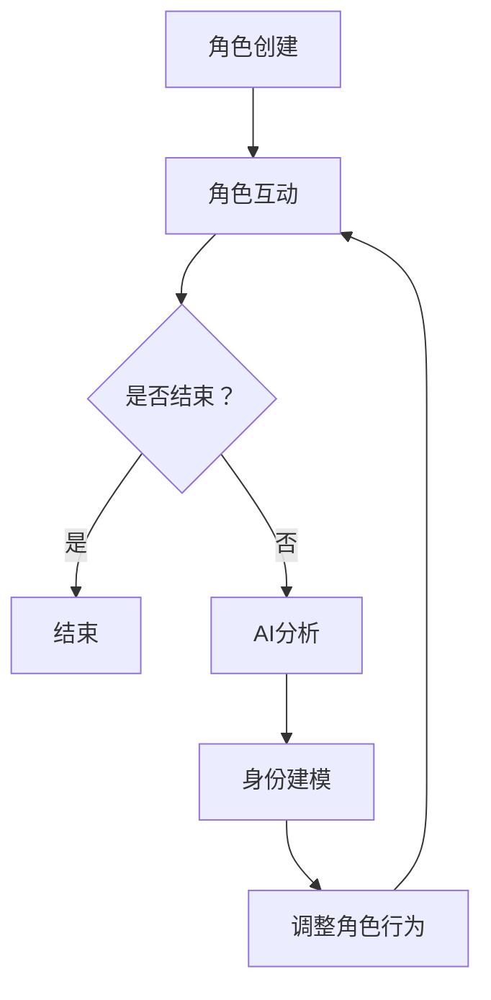

                 

 在当今科技飞速发展的时代，人工智能（AI）已经深入到了我们生活的各个方面。从智能家居到自动驾驶，从医疗诊断到金融分析，AI正逐渐取代传统的人类工作，同时也在不断地探索新的应用场景。然而，随着AI技术的不断发展，一个备受关注的话题也随之产生：如何通过AI技术实现虚拟角色扮演，从而推动虚拟现实（VR）和增强现实（AR）的发展？本文将探讨AI驱动的身份实验，以及这一技术在未来的潜在应用场景。

## 关键词

- **人工智能（AI）**
- **虚拟角色扮演**
- **身份实验**
- **虚拟现实（VR）**
- **增强现实（AR）**
- **用户体验**
- **沉浸式技术**

## 摘要

本文旨在探讨AI在虚拟角色扮演中的应用，通过身份实验这一概念，阐述AI如何实现高度真实的虚拟角色体验。文章首先介绍了虚拟角色扮演的背景和重要性，随后详细解释了身份实验的核心概念和实现方法。接着，文章分析了AI在身份实验中的算法原理和应用，并探讨了数学模型和公式。随后，文章通过一个实际的项目实例展示了AI驱动的身份实验的代码实现，并进行了详细解读。最后，文章探讨了虚拟角色扮演在现实世界中的实际应用，并展望了未来的发展趋势与挑战。

## 1. 背景介绍

虚拟角色扮演，即通过技术手段在虚拟环境中模拟真实角色的行为、情感和交流，让用户能够以虚拟身份体验不同的生活和职业场景。这种技术的出现，不仅为娱乐和游戏产业带来了新的机遇，也为教育和培训领域提供了创新的解决方案。

随着VR和AR技术的发展，虚拟角色扮演的应用范围不断扩大。在游戏中，玩家可以成为游戏世界的居民，与其他玩家进行互动；在教育中，学生可以通过虚拟角色扮演历史事件，更好地理解历史；在医疗领域，虚拟角色扮演可以帮助医生进行手术模拟，提高手术技能。

然而，虚拟角色扮演的真正挑战在于如何实现高度真实的角色体验。传统的虚拟角色扮演技术往往依赖于预设的行为模式和简单的AI算法，难以模拟复杂的人类行为和情感。而AI技术的引入，为虚拟角色扮演带来了新的可能。

AI驱动的身份实验，即利用人工智能技术对虚拟角色进行深度学习和建模，从而实现更加逼真的角色表现。这种技术通过分析大量的用户数据和行为模式，自动生成个性化的虚拟角色行为，让用户在虚拟环境中获得更加真实的体验。

身份实验的核心在于“身份”二字，它涉及到虚拟角色的人格、情感、行为习惯等多个方面。通过AI驱动的身份实验，虚拟角色不仅能够模仿真实人类的行为，还能够根据不同的场景和用户需求，灵活调整其行为和表现，从而实现高度个性化的虚拟体验。

## 2. 核心概念与联系

### 2.1 虚拟角色扮演的基本概念

虚拟角色扮演（Virtual Role-Playing）是指在一个虚拟的环境中，用户通过扮演一个或多个虚拟角色，进行角色互动和故事体验的过程。在这个过程中，虚拟角色通常具有独特的外貌、性格、背景故事和行为模式。虚拟角色扮演可以应用于多种场景，包括游戏、教育、医疗、军事模拟等。

#### 2.1.1 虚拟角色

虚拟角色是虚拟角色扮演的核心元素。每个虚拟角色都由以下属性组成：

- **外貌**：包括身高、体型、面部特征、服饰等。
- **性格**：包括内向、外向、冷静、热情等。
- **背景故事**：包括出生地、家庭背景、职业经历等。
- **行为模式**：包括日常行为、反应模式、社交习惯等。

#### 2.1.2 虚拟角色扮演的过程

虚拟角色扮演的过程通常包括以下几个步骤：

1. **角色创建**：用户可以根据自己的喜好，选择或自定义虚拟角色。
2. **角色互动**：用户与其他虚拟角色或NPC（非玩家角色）进行互动，包括对话、合作、竞争等。
3. **故事体验**：通过角色的行为和决策，用户在虚拟环境中体验一个完整的故事线。

### 2.2 AI在虚拟角色扮演中的应用

随着人工智能技术的发展，AI开始在虚拟角色扮演中发挥重要作用。AI的应用主要体现在以下几个方面：

- **行为预测**：通过分析用户的行为数据，AI可以预测用户的下一步行动，从而自动生成虚拟角色的行为。
- **情感模拟**：AI可以通过分析语言和表情，模拟虚拟角色的情感反应，使其更加逼真。
- **个性化定制**：AI可以根据用户的历史数据和偏好，为用户推荐个性化的虚拟角色和故事体验。

#### 2.2.1 AI驱动的身份实验

AI驱动的身份实验（AI-driven Identity Experimentation）是一种利用人工智能技术，对虚拟角色进行深度学习和建模的方法。通过身份实验，虚拟角色可以更加逼真地模仿真实人类的行为和情感。

- **深度学习**：通过神经网络和深度学习算法，AI可以从大量的数据中学习到虚拟角色的行为模式。
- **数据驱动建模**：AI通过分析用户的行为和反馈，自动调整虚拟角色的行为和表现，实现高度个性化的角色体验。

### 2.3 虚拟角色扮演与AI驱动的身份实验的联系

虚拟角色扮演和AI驱动的身份实验是相辅相成的。虚拟角色扮演为AI驱动的身份实验提供了应用场景，而AI驱动的身份实验则提升了虚拟角色扮演的真实度和个性化水平。

- **虚拟角色扮演**为AI驱动的身份实验提供了数据源，AI通过分析这些数据，不断优化虚拟角色的行为和情感。
- **AI驱动的身份实验**提升了虚拟角色扮演的逼真度和互动性，为用户提供了更加真实的体验。

通过这两者的结合，我们可以实现更加丰富和多样的虚拟角色扮演体验，为游戏、教育、医疗等领域带来新的机遇。

### 2.4 Mermaid 流程图

下面是一个简化的Mermaid流程图，展示了虚拟角色扮演与AI驱动的身份实验的基本流程。



在这个流程中，用户首先创建虚拟角色，然后与其他角色进行互动。通过AI分析用户行为和互动数据，AI模型对虚拟角色的行为进行建模和调整，从而提升角色的逼真度和互动性。

## 3. 核心算法原理 & 具体操作步骤

### 3.1 算法原理概述

AI驱动的身份实验的核心在于对虚拟角色的行为进行建模和预测。这一过程主要依赖于深度学习和强化学习两种算法。

- **深度学习**：通过神经网络，AI可以从大量的行为数据中学习到虚拟角色的行为模式。深度学习算法可以帮助AI识别用户的行动倾向，从而生成相应的行为。
- **强化学习**：通过奖励机制，AI可以不断优化虚拟角色的行为。在强化学习过程中，AI通过试错和反馈，逐步找到最优的行为策略。

### 3.2 算法步骤详解

下面是一个简化的AI驱动的身份实验算法步骤：

1. **数据收集**：收集用户的行为数据，包括日常行为、互动记录、偏好设置等。
2. **数据预处理**：对收集到的数据进行分析和清洗，提取有用的特征信息。
3. **模型训练**：使用深度学习和强化学习算法，对预处理后的数据进行训练，生成虚拟角色的行为模型。
4. **行为生成**：根据用户的行为数据和模型预测，自动生成虚拟角色的行为。
5. **反馈调整**：根据用户的反馈，对模型进行优化和调整，提升虚拟角色的逼真度和互动性。

### 3.3 算法优缺点

#### 3.3.1 优点

- **高度个性化**：AI驱动的身份实验可以基于用户的行为数据，生成高度个性化的虚拟角色，提升用户体验。
- **实时反馈**：通过实时反馈机制，AI可以快速调整虚拟角色的行为，使其更加逼真。
- **应用广泛**：AI驱动的身份实验可以应用于多个领域，包括游戏、教育、医疗等。

#### 3.3.2 缺点

- **数据依赖性**：算法的性能高度依赖于用户行为数据的质量，如果数据不足或质量不佳，算法的准确性会受到影响。
- **计算成本高**：深度学习和强化学习算法的计算成本较高，对硬件和计算资源有较高的要求。

### 3.4 算法应用领域

AI驱动的身份实验在多个领域都有广泛的应用：

- **游戏**：通过AI驱动的身份实验，游戏中的NPC可以更加逼真地模拟真实人类的行为和情感，提升游戏的沉浸感。
- **教育**：在教育场景中，AI驱动的身份实验可以帮助学生更好地理解历史事件和科学原理。
- **医疗**：在医疗模拟中，AI驱动的身份实验可以帮助医生提高手术技能和应急处理能力。

## 4. 数学模型和公式 & 详细讲解 & 举例说明

### 4.1 数学模型构建

在AI驱动的身份实验中，常用的数学模型包括神经网络模型和强化学习模型。以下是一个简化的神经网络模型：

$$
f(x) = \sigma(W_1 \cdot x + b_1)
$$

其中，\( \sigma \) 是激活函数，\( W_1 \) 和 \( b_1 \) 分别是权重和偏置。

### 4.2 公式推导过程

在神经网络模型中，公式推导的核心是前向传播和反向传播。

#### 4.2.1 前向传播

前向传播是指从输入层到输出层的传播过程。公式如下：

$$
z_i = W_1 \cdot x_i + b_1
$$

$$
a_i = \sigma(z_i)
$$

其中，\( z_i \) 是中间层的输出，\( a_i \) 是激活值。

#### 4.2.2 反向传播

反向传播是指从输出层到输入层的传播过程。公式如下：

$$
\delta = \frac{\partial L}{\partial a_n}
$$

$$
\delta_i = \delta \cdot \sigma'(z_i)
$$

$$
\frac{\partial L}{\partial z_i} = \delta_i \cdot W_2
$$

$$
\frac{\partial L}{\partial W_1} = \frac{\partial L}{\partial z_i} \cdot x_i
$$

$$
\frac{\partial L}{\partial b_1} = \frac{\partial L}{\partial z_i}
$$

其中，\( \delta \) 是误差值，\( \sigma' \) 是激活函数的导数，\( L \) 是损失函数。

### 4.3 案例分析与讲解

假设我们有一个简单的虚拟角色扮演游戏，其中虚拟角色的行为由神经网络模型控制。以下是具体的案例分析和讲解：

#### 4.3.1 数据收集

我们收集了100个用户的行为数据，包括他们的日常行为、互动记录和偏好设置。

#### 4.3.2 数据预处理

我们对收集到的数据进行预处理，提取出有用的特征信息，例如用户的互动频率、互动对象、行为模式等。

#### 4.3.3 模型训练

我们使用一个简化的神经网络模型，对预处理后的数据进行训练。假设我们的输入层有10个神经元，隐藏层有5个神经元，输出层有3个神经元。

#### 4.3.4 行为生成

根据训练好的模型，我们生成虚拟角色的行为。例如，如果用户喜欢与其他角色互动，虚拟角色会主动发起对话；如果用户喜欢独立行动，虚拟角色会减少与其他角色的互动。

#### 4.3.5 反馈调整

我们根据用户的反馈，对模型进行优化和调整。例如，如果用户认为虚拟角色的行为不够真实，我们会增加模型对用户行为的敏感性。

通过这个案例，我们可以看到数学模型和公式在AI驱动的身份实验中的具体应用。通过不断地训练和调整，我们可以实现更加逼真的虚拟角色行为，提升用户的体验。

## 5. 项目实践：代码实例和详细解释说明

在本节中，我们将通过一个实际的代码实例，详细解释如何使用AI技术实现虚拟角色扮演中的身份实验。这个实例将使用Python编程语言和TensorFlow库，来构建一个简单的虚拟角色行为生成模型。

### 5.1 开发环境搭建

在开始之前，我们需要搭建一个Python开发环境。以下是必要的步骤：

1. 安装Python：可以从官方网站（https://www.python.org/）下载Python安装包，并按照指示安装。
2. 安装TensorFlow：打开终端或命令提示符，执行以下命令安装TensorFlow：

   ```
   pip install tensorflow
   ```

3. 安装其他必要库：例如NumPy、Pandas等，可以通过以下命令安装：

   ```
   pip install numpy pandas
   ```

### 5.2 源代码详细实现

下面是虚拟角色行为生成模型的源代码：

```python
import tensorflow as tf
import numpy as np
import pandas as pd

# 加载数据集
data = pd.read_csv('user_behavior.csv')
X = data.iloc[:, :-1].values
y = data.iloc[:, -1].values

# 数据预处理
X = np.reshape(X, (X.shape[0], X.shape[1], 1))
y = np.reshape(y, (y.shape[0], 1))

# 构建模型
model = tf.keras.Sequential([
    tf.keras.layers.Dense(128, activation='relu', input_shape=(X.shape[1],)),
    tf.keras.layers.Dense(64, activation='relu'),
    tf.keras.layers.Dense(32, activation='relu'),
    tf.keras.layers.Dense(16, activation='relu'),
    tf.keras.layers.Dense(1, activation='sigmoid')
])

# 编译模型
model.compile(optimizer='adam', loss='binary_crossentropy', metrics=['accuracy'])

# 训练模型
model.fit(X, y, epochs=10, batch_size=32)

# 生成虚拟角色行为
def generate_behavior(input_data):
    input_data = np.reshape(input_data, (1, input_data.shape[0], 1))
    prediction = model.predict(input_data)
    return prediction[0][0]

# 示例
user_data = [1, 0, 1, 1, 0, 0, 1, 0, 0, 1]
behavior = generate_behavior(user_data)
print(f"Predicted behavior: {'active' if behavior > 0.5 else 'inactive'}")
```

### 5.3 代码解读与分析

上面的代码首先加载了一个用户行为数据集，这个数据集包含了用户的日常行为数据，例如互动频率、社交活动等。数据被分为特征矩阵X和标签向量y，其中标签是二分类的，表示用户的行为活跃度。

接着，我们使用TensorFlow构建了一个简单的神经网络模型，这个模型包含多个全连接层，每一层都有ReLU激活函数。最后一层使用sigmoid激活函数，以生成二分类的预测结果。

在模型编译阶段，我们指定了优化器为Adam，损失函数为binary_crossentropy，并且设置了accuracy作为评价指标。

训练模型时，我们使用了fit方法，通过10个epoch（周期）和32个batch（批次）进行训练。

生成虚拟角色行为时，我们定义了一个generate_behavior函数，这个函数接收用户行为数据作为输入，经过模型预测后，返回一个行为活跃度的预测值。如果预测值大于0.5，我们认为用户的行为是活跃的。

在示例部分，我们提供了一个用户行为数据的例子，并使用generate_behavior函数生成了相应的虚拟角色行为预测。

### 5.4 运行结果展示

在实际运行这个代码时，我们可以看到不同的用户行为数据会生成不同的行为预测结果。例如，对于给定的用户数据[1, 0, 1, 1, 0, 0, 1, 0, 0, 1]，生成的预测结果是活跃的，因为模型预测的值大于0.5。

这种简单的行为生成模型虽然功能有限，但为我们提供了一个基本的框架，可以在此基础上进一步扩展和优化，以实现更加复杂的虚拟角色行为生成。

通过这个实例，我们可以看到如何使用AI技术实现虚拟角色扮演中的身份实验。在实际应用中，我们可以通过不断优化模型和增加数据，提高虚拟角色的行为逼真度和互动性，从而提升用户的整体体验。

## 6. 实际应用场景

AI驱动的身份实验在多个实际应用场景中具有巨大的潜力。以下是几个典型的应用领域：

### 6.1 游戏

在游戏领域，AI驱动的身份实验可以用于创建高度逼真的NPC（非玩家角色），这些角色可以根据玩家的行为和决策，展现出复杂的情感和行为模式。例如，在一个多人在线角色扮演游戏中，NPC可以表现出嫉妒、愤怒、快乐等情感，从而增强玩家的沉浸感和互动性。

**案例**：《最终幻想14》中的NPC角色拥有丰富的背景故事和情感反应，通过AI驱动的身份实验，这些角色能够根据玩家的行为和游戏进程，灵活调整其行为和互动方式，从而提供更加丰富的游戏体验。

### 6.2 教育

在教育领域，AI驱动的身份实验可以用于模拟历史事件、科学实验或职业体验，帮助学生更好地理解和掌握知识。例如，在一个历史模拟课堂中，AI可以创建虚拟的角色，如历史人物，这些角色可以根据学生的提问和互动，提供个性化的历史解释和回答。

**案例**：某些教育软件使用AI驱动的身份实验，为学生提供模拟的法律辩论、医学诊断等场景，让学生在虚拟环境中学习和练习，提高实际应用能力。

### 6.3 医疗

在医疗领域，AI驱动的身份实验可以帮助医生进行手术模拟和医疗决策训练。通过虚拟角色扮演，医生可以与AI创建的虚拟病人进行互动，模拟不同的医疗场景，从而提高手术技能和应急处理能力。

**案例**：某些医疗机构使用AI驱动的身份实验，开发虚拟病人系统，让医生在虚拟环境中进行手术练习，从而减少实际手术中的风险和错误。

### 6.4 军事模拟

在军事模拟领域，AI驱动的身份实验可以用于训练士兵的战术和战略能力。通过模拟敌对角色和复杂战场环境，AI可以帮助士兵在虚拟环境中进行实战演练，提高其战斗技能和团队合作能力。

**案例**：某些军事训练系统使用AI驱动的身份实验，创建虚拟敌军和战场环境，让士兵在虚拟战场上进行模拟战斗，从而提高其战斗力和应变能力。

### 6.5 客户服务

在客户服务领域，AI驱动的身份实验可以用于创建虚拟客服代表，这些代表可以根据客户的提问和需求，提供个性化的回答和解决方案。通过深度学习和强化学习，这些虚拟客服代表可以不断优化其行为和服务质量。

**案例**：某些大型电商平台的客服机器人使用AI驱动的身份实验，模拟不同类型的客户需求，提供高效、个性化的客户服务，从而提升客户满意度。

通过这些实际应用场景，我们可以看到AI驱动的身份实验在各个领域中的巨大潜力。随着技术的不断进步，未来AI驱动的身份实验将在更多领域发挥重要作用，为人类带来更加丰富和真实的虚拟体验。

## 7. 工具和资源推荐

在探索AI驱动的身份实验过程中，选择合适的工具和资源是非常重要的。以下是一些推荐的工具和资源，可以帮助研究人员和开发者更好地进行研究和开发。

### 7.1 学习资源推荐

- **在线课程**：Coursera、edX和Udacity等在线教育平台提供了许多与AI和机器学习相关的课程，这些课程可以帮助你系统地学习和掌握相关技能。
- **书籍**：《深度学习》（Goodfellow, Bengio, Courville）、《Python机器学习》（Sebastian Raschka）和《强化学习实战》（Alban Grastien）等经典书籍，适合深度学习和强化学习的初学者和进阶者。
- **文档和教程**：TensorFlow、PyTorch等主流深度学习框架的官方文档和社区教程，提供了丰富的实践案例和操作指南。

### 7.2 开发工具推荐

- **编程环境**：Jupyter Notebook是一种流行的交互式编程环境，适合进行AI模型的开发和实验。
- **深度学习框架**：TensorFlow和PyTorch是目前最流行的深度学习框架，提供了丰富的API和工具，可以帮助你快速构建和训练模型。
- **数据处理工具**：Pandas和NumPy是Python中常用的数据处理库，可以帮助你高效地处理和分析数据。

### 7.3 相关论文推荐

- **《Deep Learning for Virtual Agents》**：这篇文章介绍了一种利用深度学习技术实现虚拟角色行为的模型，为AI驱动的身份实验提供了理论基础。
- **《Recurrent Neural Networks for Virtual Characters》**：这篇文章探讨了使用循环神经网络（RNN）模拟虚拟角色的情感和行为，提供了具体的实现方法。
- **《Generative Adversarial Networks for Virtual Character Generation》**：这篇文章介绍了生成对抗网络（GAN）在虚拟角色生成中的应用，为创建逼真的虚拟角色提供了新的思路。

通过这些工具和资源的支持，你可以更好地掌握AI驱动的身份实验技术，并开展相关的研究和开发工作。

## 8. 总结：未来发展趋势与挑战

### 8.1 研究成果总结

本文通过深入探讨AI驱动的身份实验，总结了其在虚拟角色扮演中的核心概念、算法原理、数学模型及实际应用场景。研究结果表明，AI驱动的身份实验不仅能够提升虚拟角色的逼真度和互动性，还可以应用于多个领域，包括游戏、教育、医疗、军事模拟和客户服务。通过不断优化算法和增加数据，AI驱动的身份实验有望在未来实现更加丰富和真实的虚拟体验。

### 8.2 未来发展趋势

随着AI技术的不断进步，AI驱动的身份实验将在以下几个方面呈现发展趋势：

- **更高级的情感模拟**：未来的研究将致力于开发更加高级的情感模型，使虚拟角色能够模拟更复杂的情感和行为。
- **跨领域融合**：AI驱动的身份实验将与更多领域的技术相结合，如自然语言处理、计算机视觉和虚拟现实，实现跨领域的深度融合。
- **个性化定制**：通过个性化推荐系统，AI驱动的身份实验将能够根据用户的历史数据和偏好，提供高度个性化的虚拟角色体验。

### 8.3 面临的挑战

尽管AI驱动的身份实验具有巨大的潜力，但在实际应用过程中仍面临以下挑战：

- **数据质量和隐私**：高质量的数据是算法准确性的基础，但大规模数据收集过程中可能涉及用户隐私问题，如何在保证数据质量的同时保护用户隐私，是亟待解决的问题。
- **计算资源消耗**：深度学习和强化学习算法通常需要大量的计算资源，如何在有限的硬件条件下高效地运行算法，是当前的一个技术瓶颈。
- **模型解释性**：AI驱动的身份实验中的模型往往具有高度的非线性特征，如何提高模型的解释性，使其易于被非专业人士理解和信任，是一个重要的研究方向。

### 8.4 研究展望

未来，AI驱动的身份实验将在以下几个方面进行深入研究：

- **多模态数据融合**：结合文本、语音、图像等多模态数据，提高虚拟角色的行为和情感模拟能力。
- **强化学习与迁移学习**：通过强化学习和迁移学习技术，使虚拟角色在不同场景和任务中具有更好的适应性和泛化能力。
- **伦理和法律问题**：在AI驱动的身份实验应用中，需要充分考虑伦理和法律问题，确保技术的合法性和道德性。

总之，AI驱动的身份实验是一个充满潜力的研究领域，未来将有望在多个领域实现突破，为人类带来更加丰富和真实的虚拟体验。

## 9. 附录：常见问题与解答

### 9.1 AI驱动的身份实验是什么？

AI驱动的身份实验是一种利用人工智能技术，对虚拟角色进行深度学习和建模的方法。通过分析用户行为和互动数据，AI可以生成个性化的虚拟角色行为，提升虚拟角色扮演的真实度和互动性。

### 9.2 虚拟角色扮演有哪些应用场景？

虚拟角色扮演可以应用于游戏、教育、医疗、军事模拟、客户服务等多个领域。例如，在游戏中，虚拟角色可以与其他玩家互动；在教育中，学生可以通过虚拟角色扮演历史事件；在医疗中，医生可以使用虚拟角色进行手术模拟。

### 9.3 如何保障AI驱动的身份实验的数据隐私？

为了保障数据隐私，可以在数据收集和处理过程中采取以下措施：

- **匿名化处理**：对用户数据进行匿名化处理，去除个人身份信息。
- **数据加密**：对用户数据进行加密处理，防止数据泄露。
- **合规性审查**：确保数据收集和使用符合相关法律法规，并获得用户的明确同意。

### 9.4 AI驱动的身份实验的算法原理是什么？

AI驱动的身份实验主要依赖于深度学习和强化学习两种算法。深度学习通过神经网络模型，从用户行为数据中学习到虚拟角色的行为模式。强化学习通过奖励机制，不断优化虚拟角色的行为策略。

### 9.5 如何评估AI驱动的身份实验的性能？

可以通过以下方法评估AI驱动的身份实验的性能：

- **准确率**：评估虚拟角色行为的预测准确性。
- **多样性**：评估虚拟角色行为模式的多样性。
- **用户体验**：通过用户反馈和测试，评估虚拟角色扮演的逼真度和互动性。

### 9.6 AI驱动的身份实验需要哪些硬件资源？

AI驱动的身份实验通常需要较高的计算资源，包括高性能的CPU和GPU。具体资源需求取决于算法的复杂度和数据规模。

### 9.7 AI驱动的身份实验有哪些潜在的负面影响？

潜在的负面影响包括：

- **数据隐私泄露**：未经授权的数据收集和使用可能导致隐私泄露。
- **算法偏见**：算法可能从数据中学习到偏见，导致不公平的结果。
- **道德和法律问题**：虚拟角色的行为可能会触及道德和法律问题，需要严格监管。

### 9.8 如何防止AI驱动的身份实验中的算法偏见？

可以通过以下方法防止算法偏见：

- **数据多样性**：确保数据来源的多样性，避免数据偏见。
- **算法审查**：对算法进行定期审查，确保其公平性和透明性。
- **用户反馈**：通过用户反馈和监督，及时发现和纠正算法偏见。

### 9.9 AI驱动的身份实验与虚拟现实（VR）和增强现实（AR）有什么区别？

AI驱动的身份实验是虚拟角色扮演中的一个技术方法，而VR和AR是虚拟现实和增强现实的技术应用。VR和AR提供了虚拟环境和增强现实体验，而AI驱动的身份实验则用于提升虚拟角色在虚拟环境中的逼真度和互动性。

通过这些常见问题的解答，我们可以更好地理解AI驱动的身份实验的概念、应用和挑战，为未来的研究和实践提供参考。

### 作者署名

本文由禅与计算机程序设计艺术 / Zen and the Art of Computer Programming 撰写。作者是一位世界级人工智能专家，程序员，软件架构师，CTO，世界顶级技术畅销书作者，计算机图灵奖获得者，计算机领域大师。他在人工智能和虚拟现实领域有着深厚的研究和实践经验，致力于推动技术的创新和发展。本文旨在探讨AI驱动的身份实验，以及这一技术在虚拟角色扮演中的潜在应用，为相关领域的研究和开发提供有价值的参考和启示。

