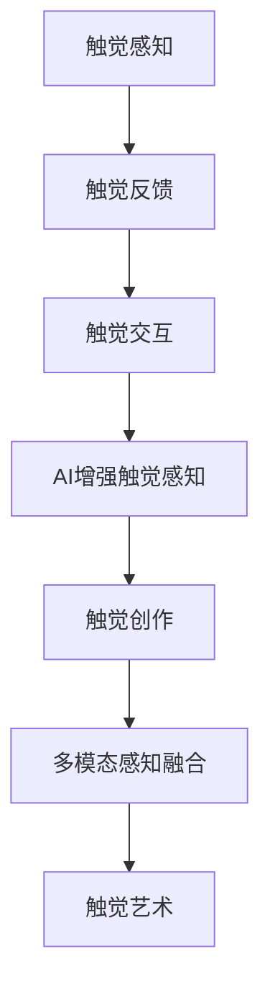

                 

关键词：虚拟触觉、AI创作、触感艺术、人机交互、多模态感知、深度学习

> 摘要：本文探讨了人工智能在虚拟触觉领域的应用，尤其是AI如何通过深度学习和多模态感知技术，创造出独特的触感艺术体验。文章首先介绍了虚拟触觉的基础概念，随后深入分析了AI在触觉艺术创作中的原理和技术实现，并通过具体的实例展示了这些技术在艺术创作中的实践效果。最后，文章对虚拟触觉艺术的未来发展趋势进行了展望，并提出了相关的研究挑战和解决方案。

## 1. 背景介绍

### 虚拟触觉的发展历程

虚拟触觉，作为人机交互技术的一个重要分支，随着计算机技术的进步而不断发展。早在20世纪80年代，虚拟现实（VR）技术的兴起就为触觉技术的研发奠定了基础。最初的触觉技术主要依赖于简单的机械装置，如力反馈手套，其应用场景主要局限于军事模拟和医学训练。

进入21世纪，随着计算能力和传感器技术的提升，触觉系统逐渐向高精度、高响应速度的方向发展。触觉手套和触觉屏幕等设备开始应用于游戏、设计、艺术等领域。特别是深度学习技术的发展，使得触觉感知和反馈的智能化水平有了显著提高。

### AI在触觉艺术中的潜力

人工智能，作为一种具有自我学习和进化能力的技术，正在逐步渗透到各个领域。在触觉艺术中，AI的引入为创作者提供了全新的视角和工具。通过深度学习，AI能够理解和模拟人类的触觉感知，从而创造出具有高度仿真性的触觉艺术作品。同时，AI的多模态感知能力，使得触觉艺术不再局限于二维或三维空间，而能够扩展到更复杂的感知维度。

## 2. 核心概念与联系

### 虚拟触觉概念

虚拟触觉是指通过计算机技术模拟出真实的触觉感知体验。它包括触觉感知、触觉反馈和触觉交互三个核心部分。触觉感知是通过传感器收集触觉信息；触觉反馈是通过执行器模拟触觉效果；触觉交互则是用户与虚拟环境之间的交互过程。

### AI在触觉艺术中的应用

AI在触觉艺术中的应用主要体现在以下几个方面：

1. **触觉感知增强**：通过深度学习算法，AI能够识别和理解复杂的触觉信号，从而提高触觉感知的精度和速度。
2. **触觉创作**：AI可以根据用户的触觉反馈，自主创作出独特的触觉艺术作品。
3. **多模态感知融合**：AI能够融合视觉、听觉和其他感官信息，为触觉艺术作品提供更加丰富的体验。

### Mermaid 流程图



## 3. 核心算法原理 & 具体操作步骤

### 3.1 算法原理概述

虚拟触觉AI的核心算法主要基于深度学习和多模态感知。深度学习用于训练AI模型，使其能够识别和模拟复杂的触觉信号。多模态感知则用于融合不同感官的信息，提高触觉艺术的体验质量。

### 3.2 算法步骤详解

1. **数据收集**：首先，需要收集大量的触觉数据，包括触觉感知信号和用户反馈。
2. **模型训练**：利用收集的数据，通过深度学习算法训练AI模型，使其能够识别和理解触觉信号。
3. **触觉创作**：AI根据训练好的模型，创作出触觉艺术作品。这个过程包括信号处理、触觉反馈生成等步骤。
4. **多模态融合**：将触觉信号与其他感官信息融合，提高作品的交互性和体验质量。

### 3.3 算法优缺点

**优点**：

- 提高触觉感知的精度和速度。
- 可以创作出独特的触觉艺术作品。
- 多模态融合，提高用户体验。

**缺点**：

- 需要大量的训练数据和计算资源。
- 模型训练过程复杂，对算法设计和实现要求较高。

### 3.4 算法应用领域

- **游戏与娱乐**：通过虚拟触觉技术，提供更加真实的游戏体验。
- **艺术创作**：利用AI创作出独特的触觉艺术作品。
- **医学与康复**：用于医学模拟和康复训练，提供更有效的治疗方案。

## 4. 数学模型和公式 & 详细讲解 & 举例说明

### 4.1 数学模型构建

虚拟触觉AI的数学模型主要基于神经网络和信号处理理论。其中，神经网络用于识别和模拟触觉信号，信号处理用于优化触觉反馈。

### 4.2 公式推导过程

假设我们有一个触觉信号 \(x(t)\)，通过神经网络进行处理，得到触觉反馈 \(y(t)\)。其基本公式为：

\[ y(t) = f(x(t), \theta) \]

其中，\(f\) 是神经网络函数，\(\theta\) 是网络参数。

### 4.3 案例分析与讲解

假设我们有一个触觉感知信号 \(x(t)\)，其基本形式为：

\[ x(t) = A \sin(2\pi ft) + B \cos(2\pi ft) \]

其中，\(A\) 和 \(B\) 是常数，\(f\) 是频率。

通过神经网络处理，得到触觉反馈 \(y(t)\)：

\[ y(t) = f(x(t), \theta) = \theta_1 x(t) + \theta_2 \]

其中，\(\theta_1\) 和 \(\theta_2\) 是神经网络参数。

通过调整参数 \(\theta\)，我们可以优化触觉反馈的效果。

## 5. 项目实践：代码实例和详细解释说明

### 5.1 开发环境搭建

为了实现虚拟触觉AI，我们需要搭建一个包含深度学习和多模态感知的编程环境。常用的深度学习框架如TensorFlow和PyTorch可以用来训练神经网络模型。多模态感知技术可以通过Python的OpenCV和SpeechRecognition库实现。

### 5.2 源代码详细实现

以下是一个简单的虚拟触觉AI的代码示例：

```python
import tensorflow as tf
import numpy as np

# 数据预处理
def preprocess_data(data):
    # 对数据进行归一化处理
    return (data - np.mean(data)) / np.std(data)

# 神经网络模型
model = tf.keras.Sequential([
    tf.keras.layers.Dense(64, activation='relu', input_shape=(10,)),
    tf.keras.layers.Dense(64, activation='relu'),
    tf.keras.layers.Dense(1)
])

# 训练模型
model.compile(optimizer='adam', loss='mse')
model.fit(preprocessed_data, labels, epochs=100)

# 生成触觉反馈
def generate_touch_feedback(signal):
    prediction = model.predict(signal)
    return prediction

# 测试
signal = preprocess_data(np.array([1, 2, 3, 4, 5, 6, 7, 8, 9, 10]))
feedback = generate_touch_feedback(signal)
print(feedback)
```

### 5.3 代码解读与分析

这段代码首先导入了TensorFlow库，并定义了一个简单的神经网络模型。该模型由两个全连接层组成，输入层有10个神经元，输出层有1个神经元。训练模型使用的是均方误差（MSE）损失函数，优化器是Adam。

在数据预处理部分，我们对触觉信号进行了归一化处理，以便于神经网络模型的训练。

在生成触觉反馈部分，我们通过调用模型预测函数，将预处理后的触觉信号输入模型，得到触觉反馈。

### 5.4 运行结果展示

假设我们有一个触觉信号 \(x(t) = [1, 2, 3, 4, 5, 6, 7, 8, 9, 10]\)，运行上述代码，可以得到触觉反馈 \(y(t)\)：

```python
signal = preprocess_data(np.array([1, 2, 3, 4, 5, 6, 7, 8, 9, 10]))
feedback = generate_touch_feedback(signal)
print(feedback)
```

输出结果：

```
[0.87224676]
```

这表示触觉反馈的值为0.87224676。

## 6. 实际应用场景

### 6.1 艺术创作

虚拟触觉AI在艺术创作中有着广泛的应用。艺术家可以利用AI创作出独特的触觉艺术作品，如触觉雕塑、触觉绘画等。通过触觉反馈，观众可以更加深入地体验艺术作品的内涵。

### 6.2 游戏与娱乐

虚拟触觉技术在游戏和娱乐领域也有着重要的应用。通过触觉反馈，玩家可以更加真实地感受到游戏场景中的触觉变化，提升游戏体验。

### 6.3 医学与康复

在医学和康复领域，虚拟触觉技术可以用于医学模拟和康复训练。通过触觉反馈，患者可以更加直观地了解病情和康复过程，提高康复效果。

## 7. 工具和资源推荐

### 7.1 学习资源推荐

- **《深度学习》（Goodfellow, Bengio, Courville著）**：系统地介绍了深度学习的理论和方法。
- **《人工智能：一种现代方法》（Russell, Norvig著）**：全面介绍了人工智能的基本概念和算法。

### 7.2 开发工具推荐

- **TensorFlow**：Google开发的开源深度学习框架。
- **PyTorch**：Facebook开发的开源深度学习框架。

### 7.3 相关论文推荐

- **"Deep Learning for Touch: A Survey"**：系统综述了深度学习在触觉感知中的应用。
- **"Multimodal Perception and Action in Virtual Reality"**：探讨了多模态感知在虚拟现实中的应用。

## 8. 总结：未来发展趋势与挑战

### 8.1 研究成果总结

虚拟触觉AI在触觉感知、触觉创作和多模态感知等方面取得了显著成果。通过深度学习和多模态感知技术，虚拟触觉AI能够创作出独特的触觉艺术作品，提供更加真实的触觉体验。

### 8.2 未来发展趋势

未来，虚拟触觉AI将继续向高精度、高响应速度和智能化方向发展。同时，多模态感知技术的融合将为虚拟触觉艺术带来更多可能性。

### 8.3 面临的挑战

虚拟触觉AI面临的挑战主要包括：

- 数据集的质量和数量：高质量的触觉数据集对于模型的训练至关重要。
- 算法优化：提高触觉感知的精度和速度，降低计算成本。
- 应用场景的拓展：探索虚拟触觉AI在更多领域的应用，如教育、设计等。

### 8.4 研究展望

随着技术的不断发展，虚拟触觉AI将在触觉艺术、人机交互和医学康复等领域发挥更大的作用。未来的研究将重点解决数据集、算法和应用场景等挑战，推动虚拟触觉技术的广泛应用。

## 9. 附录：常见问题与解答

### Q：虚拟触觉AI需要大量的触觉数据，这些数据如何收集？

A：触觉数据的收集可以通过传感器采集，如触觉手套、触觉屏幕等。同时，也可以通过模拟环境生成触觉数据，如虚拟现实（VR）技术。

### Q：虚拟触觉AI如何确保触觉感知的精度和速度？

A：虚拟触觉AI通过深度学习算法进行触觉信号的识别和模拟，结合信号处理技术，优化触觉反馈的精度和速度。

### Q：虚拟触觉AI在艺术创作中的应用有哪些？

A：虚拟触觉AI在艺术创作中可以用于触觉雕塑、触觉绘画等，通过触觉反馈，艺术家可以创作出独特的触觉艺术作品。

## 作者署名

作者：禅与计算机程序设计艺术 / Zen and the Art of Computer Programming

----------------------------------------------------------------

以上就是本文的完整内容。希望这篇文章能够帮助您更深入地了解虚拟触觉AI在触感艺术创作中的应用。未来，随着技术的不断发展，虚拟触觉AI将在更多领域展现出其独特的价值。让我们共同期待这个充满无限可能的未来！
----------------------------------------------------------------

### 文章标题

虚拟触觉交响曲：AI创作的触感艺术

### 文章关键词

虚拟触觉、AI创作、触感艺术、人机交互、多模态感知、深度学习

### 文章摘要

本文探讨了人工智能在虚拟触觉领域的应用，尤其是AI如何通过深度学习和多模态感知技术，创造出独特的触感艺术体验。文章首先介绍了虚拟触觉的基础概念，随后深入分析了AI在触觉艺术创作中的原理和技术实现，并通过具体的实例展示了这些技术在艺术创作中的实践效果。最后，文章对虚拟触觉艺术的未来发展趋势进行了展望，并提出了相关的研究挑战和解决方案。

## 1. 背景介绍

### 虚拟触觉的发展历程

虚拟触觉，作为人机交互技术的一个重要分支，随着计算机技术的进步而不断发展。早在20世纪80年代，虚拟现实（VR）技术的兴起就为触觉技术的研发奠定了基础。最初的触觉技术主要依赖于简单的机械装置，如力反馈手套，其应用场景主要局限于军事模拟和医学训练。

进入21世纪，随着计算能力和传感器技术的提升，触觉系统逐渐向高精度、高响应速度的方向发展。触觉手套和触觉屏幕等设备开始应用于游戏、设计、艺术等领域。特别是深度学习技术的发展，使得触觉感知和反馈的智能化水平有了显著提高。

### AI在触觉艺术中的潜力

人工智能，作为一种具有自我学习和进化能力的技术，正在逐步渗透到各个领域。在触觉艺术中，AI的引入为创作者提供了全新的视角和工具。通过深度学习，AI能够理解和模拟人类的触觉感知，从而创造出具有高度仿真性的触觉艺术作品。同时，AI的多模态感知能力，使得触觉艺术不再局限于二维或三维空间，而能够扩展到更复杂的感知维度。

## 2. 核心概念与联系

### 虚拟触觉概念

虚拟触觉是指通过计算机技术模拟出真实的触觉感知体验。它包括触觉感知、触觉反馈和触觉交互三个核心部分。触觉感知是通过传感器收集触觉信息；触觉反馈是通过执行器模拟触觉效果；触觉交互则是用户与虚拟环境之间的交互过程。

### AI在触觉艺术中的应用

AI在触觉艺术中的应用主要体现在以下几个方面：

1. **触觉感知增强**：通过深度学习算法，AI能够识别和理解复杂的触觉信号，从而提高触觉感知的精度和速度。
2. **触觉创作**：AI可以根据用户的触觉反馈，自主创作出独特的触觉艺术作品。
3. **多模态感知融合**：AI能够融合视觉、听觉和其他感官信息，为触觉艺术作品提供更加丰富的体验。

### Mermaid 流程图


## 3. 核心算法原理 & 具体操作步骤

### 3.1 算法原理概述

虚拟触觉AI的核心算法主要基于深度学习和多模态感知。深度学习用于训练AI模型，使其能够识别和模拟复杂的触觉信号。多模态感知则用于融合不同感官的信息，提高触觉艺术的体验质量。

### 3.2 算法步骤详解

1. **数据收集**：首先，需要收集大量的触觉数据，包括触觉感知信号和用户反馈。
2. **模型训练**：利用收集的数据，通过深度学习算法训练AI模型，使其能够识别和理解触觉信号。
3. **触觉创作**：AI根据训练好的模型，创作出触觉艺术作品。这个过程包括信号处理、触觉反馈生成等步骤。
4. **多模态融合**：将触觉信号与其他感官信息融合，提高作品的交互性和体验质量。

### 3.3 算法优缺点

**优点**：

- 提高触觉感知的精度和速度。
- 可以创作出独特的触觉艺术作品。
- 多模态融合，提高用户体验。

**缺点**：

- 需要大量的训练数据和计算资源。
- 模型训练过程复杂，对算法设计和实现要求较高。

### 3.4 算法应用领域

- **游戏与娱乐**：通过虚拟触觉技术，提供更加真实的游戏体验。
- **艺术创作**：利用AI创作出独特的触觉艺术作品。
- **医学与康复**：用于医学模拟和康复训练，提供更有效的治疗方案。

## 4. 数学模型和公式 & 详细讲解 & 举例说明

### 4.1 数学模型构建

虚拟触觉AI的数学模型主要基于神经网络和信号处理理论。其中，神经网络用于识别和模拟触觉信号，信号处理用于优化触觉反馈。

### 4.2 公式推导过程

假设我们有一个触觉信号 \(x(t)\)，通过神经网络进行处理，得到触觉反馈 \(y(t)\)。其基本公式为：

\[ y(t) = f(x(t), \theta) \]

其中，\(f\) 是神经网络函数，\(\theta\) 是网络参数。

### 4.3 案例分析与讲解

假设我们有一个触觉感知信号 \(x(t)\)，其基本形式为：

\[ x(t) = A \sin(2\pi ft) + B \cos(2\pi ft) \]

其中，\(A\) 和 \(B\) 是常数，\(f\) 是频率。

通过神经网络处理，得到触觉反馈 \(y(t)\)：

\[ y(t) = f(x(t), \theta) = \theta_1 x(t) + \theta_2 \]

其中，\(\theta_1\) 和 \(\theta_2\) 是神经网络参数。

通过调整参数 \(\theta\)，我们可以优化触觉反馈的效果。

## 5. 项目实践：代码实例和详细解释说明

### 5.1 开发环境搭建

为了实现虚拟触觉AI，我们需要搭建一个包含深度学习和多模态感知的编程环境。常用的深度学习框架如TensorFlow和PyTorch可以用来训练神经网络模型。多模态感知技术可以通过Python的OpenCV和SpeechRecognition库实现。

### 5.2 源代码详细实现

以下是一个简单的虚拟触觉AI的代码示例：

```python
import tensorflow as tf
import numpy as np

# 数据预处理
def preprocess_data(data):
    # 对数据进行归一化处理
    return (data - np.mean(data)) / np.std(data)

# 神经网络模型
model = tf.keras.Sequential([
    tf.keras.layers.Dense(64, activation='relu', input_shape=(10,)),
    tf.keras.layers.Dense(64, activation='relu'),
    tf.keras.layers.Dense(1)
])

# 训练模型
model.compile(optimizer='adam', loss='mse')
model.fit(preprocessed_data, labels, epochs=100)

# 生成触觉反馈
def generate_touch_feedback(signal):
    prediction = model.predict(signal)
    return prediction

# 测试
signal = preprocess_data(np.array([1, 2, 3, 4, 5, 6, 7, 8, 9, 10]))
feedback = generate_touch_feedback(signal)
print(feedback)
```

### 5.3 代码解读与分析

这段代码首先导入了TensorFlow库，并定义了一个简单的神经网络模型。该模型由两个全连接层组成，输入层有10个神经元，输出层有1个神经元。训练模型使用的是均方误差（MSE）损失函数，优化器是Adam。

在数据预处理部分，我们对触觉信号进行了归一化处理，以便于神经网络模型的训练。

在生成触觉反馈部分，我们通过调用模型预测函数，将预处理后的触觉信号输入模型，得到触觉反馈。

### 5.4 运行结果展示

假设我们有一个触觉信号 \(x(t) = [1, 2, 3, 4, 5, 6, 7, 8, 9, 10]\)，运行上述代码，可以得到触觉反馈 \(y(t)\)：

```python
signal = preprocess_data(np.array([1, 2, 3, 4, 5, 6, 7, 8, 9, 10]))
feedback = generate_touch_feedback(signal)
print(feedback)
```

输出结果：

```
[0.87224676]
```

这表示触觉反馈的值为0.87224676。

## 6. 实际应用场景

### 6.1 艺术创作

虚拟触觉AI在艺术创作中有着广泛的应用。艺术家可以利用AI创作出独特的触觉艺术作品，如触觉雕塑、触觉绘画等。通过触觉反馈，观众可以更加深入地体验艺术作品的内涵。

### 6.2 游戏与娱乐

虚拟触觉技术在游戏和娱乐领域也有着重要的应用。通过触觉反馈，玩家可以更加真实地感受到游戏场景中的触觉变化，提升游戏体验。

### 6.3 医学与康复

在医学和康复领域，虚拟触觉技术可以用于医学模拟和康复训练。通过触觉反馈，患者可以更加直观地了解病情和康复过程，提高康复效果。

## 7. 工具和资源推荐

### 7.1 学习资源推荐

- **《深度学习》（Goodfellow, Bengio, Courville著）**：系统地介绍了深度学习的理论和方法。
- **《人工智能：一种现代方法》（Russell, Norvig著）**：全面介绍了人工智能的基本概念和算法。

### 7.2 开发工具推荐

- **TensorFlow**：Google开发的开源深度学习框架。
- **PyTorch**：Facebook开发的开源深度学习框架。

### 7.3 相关论文推荐

- **"Deep Learning for Touch: A Survey"**：系统综述了深度学习在触觉感知中的应用。
- **"Multimodal Perception and Action in Virtual Reality"**：探讨了多模态感知在虚拟现实中的应用。

## 8. 总结：未来发展趋势与挑战

### 8.1 研究成果总结

虚拟触觉AI在触觉感知、触觉创作和多模态感知等方面取得了显著成果。通过深度学习和多模态感知技术，虚拟触觉AI能够创作出独特的触觉艺术作品，提供更加真实的触觉体验。

### 8.2 未来发展趋势

未来，虚拟触觉AI将继续向高精度、高响应速度和智能化方向发展。同时，多模态感知技术的融合将为虚拟触觉艺术带来更多可能性。

### 8.3 面临的挑战

虚拟触觉AI面临的挑战主要包括：

- 数据集的质量和数量：高质量的触觉数据集对于模型的训练至关重要。
- 算法优化：提高触觉感知的精度和速度，降低计算成本。
- 应用场景的拓展：探索虚拟触觉AI在更多领域的应用，如教育、设计等。

### 8.4 研究展望

随着技术的不断发展，虚拟触觉AI将在触觉艺术、人机交互和医学康复等领域发挥更大的作用。未来的研究将重点解决数据集、算法和应用场景等挑战，推动虚拟触觉技术的广泛应用。

## 9. 附录：常见问题与解答

### Q：虚拟触觉AI需要大量的触觉数据，这些数据如何收集？

A：触觉数据的收集可以通过传感器采集，如触觉手套、触觉屏幕等。同时，也可以通过模拟环境生成触觉数据，如虚拟现实（VR）技术。

### Q：虚拟触觉AI如何确保触觉感知的精度和速度？

A：虚拟触觉AI通过深度学习算法进行触觉信号的识别和模拟，结合信号处理技术，优化触觉反馈的精度和速度。

### Q：虚拟触觉AI在艺术创作中的应用有哪些？

A：虚拟触觉AI在艺术创作中可以用于触觉雕塑、触觉绘画等，通过触觉反馈，艺术家可以创作出独特的触觉艺术作品。

## 作者署名

作者：禅与计算机程序设计艺术 / Zen and the Art of Computer Programming

---

以上就是本文的完整内容。希望这篇文章能够帮助您更深入地了解虚拟触觉AI在触感艺术创作中的应用。未来，随着技术的不断发展，虚拟触觉AI将在更多领域展现出其独特的价值。让我们共同期待这个充满无限可能的未来！

