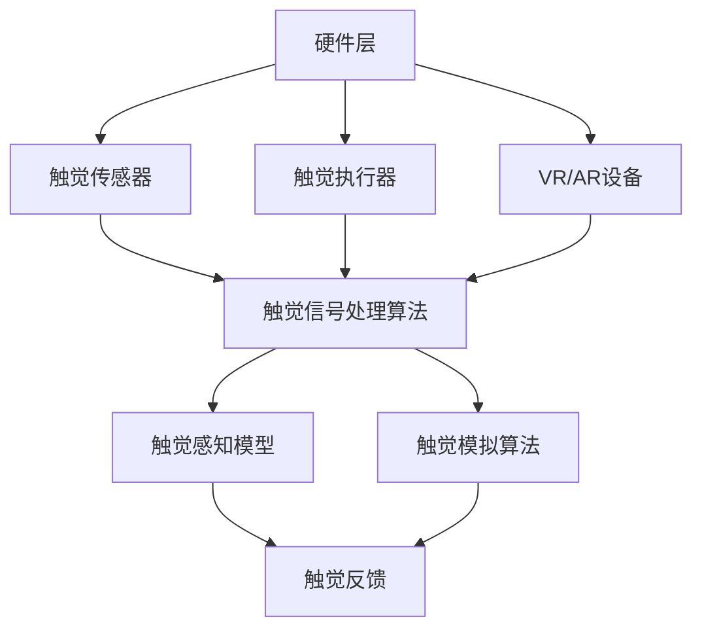

                 

关键词：虚拟触觉、人工智能、触感技术、深度学习、触觉感知、触觉模拟

## 摘要

虚拟触觉是近年来人工智能领域的一个重要研究方向，它通过模拟人类的触觉感知，为用户提供更加真实和丰富的交互体验。本文将探讨人工智能在虚拟触觉中的应用，介绍其核心概念、算法原理、数学模型以及实际应用案例。我们将深入探讨虚拟触觉技术的未来发展趋势和面临的挑战，并为相关研究者提供实用的工具和资源推荐。

## 1. 背景介绍

随着虚拟现实（VR）和增强现实（AR）技术的快速发展，人们对于沉浸式体验的需求日益增长。触觉作为人类感知系统中的重要一环，能够为用户带来更加真实和丰富的交互体验。然而，传统的触觉技术由于受到硬件和算法的限制，难以满足用户对于触感真实性的要求。人工智能技术的发展为虚拟触觉提供了新的可能性，使得模拟真实触觉成为可能。

虚拟触觉技术的核心目标是模拟人类的触觉感知，通过算法和模型对触觉信号进行处理和分析，从而实现对触感的精确模拟。这一技术的应用范围广泛，包括医疗、娱乐、工业设计、机器人控制等领域。例如，在医疗领域，虚拟触觉可以帮助医生进行远程手术训练；在娱乐领域，虚拟触觉可以为用户提供更加真实的游戏体验；在工业设计领域，虚拟触觉可以帮助设计师进行产品原型测试。

## 2. 核心概念与联系

### 2.1. 触觉感知原理

触觉是人类感知系统中的重要组成部分，它通过皮肤上的触觉感受器接收外界的触觉信号，并通过神经系统传递到大脑进行感知和反应。触觉感知可以分为触觉刺激、触觉信号处理和触觉响应三个阶段。

- **触觉刺激**：触觉刺激是指外界的触觉信号，如压力、摩擦、振动等。这些信号通过皮肤传递到触觉感受器。
- **触觉信号处理**：触觉信号处理是指触觉感受器接收到的信号在神经系统中的传递和处理过程。这个过程涉及到信号放大、滤波、去噪等处理。
- **触觉响应**：触觉响应是指大脑根据触觉信号进行处理后产生的反应，如肌肉收缩、眼睛运动等。

### 2.2. 虚拟触觉技术架构

虚拟触觉技术的架构可以分为硬件层、算法层和应用层三个部分。

- **硬件层**：硬件层包括触觉传感器、触觉执行器和VR/AR设备。触觉传感器用于捕捉触觉信号，触觉执行器用于产生触觉反馈，VR/AR设备用于实现虚拟环境的构建。
- **算法层**：算法层包括触觉信号处理算法、触觉感知模型和触觉模拟算法。触觉信号处理算法用于处理触觉传感器捕捉到的信号，触觉感知模型用于模拟触觉感知过程，触觉模拟算法用于生成虚拟触觉反馈。
- **应用层**：应用层包括虚拟触觉技术的具体应用，如远程手术训练、虚拟游戏体验、产品原型测试等。

### 2.3. Mermaid 流程图

以下是虚拟触觉技术架构的Mermaid流程图：



## 3. 核心算法原理 & 具体操作步骤

### 3.1. 算法原理概述

虚拟触觉技术的核心在于对触觉信号进行处理和模拟，从而实现对触感的精确再现。这一过程可以分为以下几个步骤：

1. **触觉信号采集**：通过触觉传感器捕捉触觉信号，如压力、摩擦、振动等。
2. **信号预处理**：对采集到的触觉信号进行预处理，包括滤波、去噪等操作，以提高信号质量。
3. **特征提取**：从预处理后的信号中提取关键特征，如频率、幅度等。
4. **触觉感知建模**：基于提取的特征构建触觉感知模型，以模拟人类的触觉感知过程。
5. **触觉模拟**：根据触觉感知模型生成虚拟触觉反馈，并通过触觉执行器输出给用户。

### 3.2. 算法步骤详解

#### 3.2.1. 触觉信号采集

触觉信号采集是虚拟触觉技术的第一步，它决定了后续处理和模拟的质量。常见的触觉传感器包括压力传感器、摩擦传感器、振动传感器等。这些传感器可以捕捉到不同类型的触觉信号，如压力变化、摩擦强度、振动频率等。

#### 3.2.2. 信号预处理

触觉信号采集到的原始信号往往包含噪声和干扰，因此需要进行预处理。常见的预处理方法包括滤波和去噪。滤波方法可以去除信号中的高频噪声，而去噪方法可以去除信号中的低频噪声。

#### 3.2.3. 特征提取

特征提取是从预处理后的信号中提取关键特征，如频率、幅度、时域特征等。这些特征用于构建触觉感知模型，以模拟人类的触觉感知过程。

#### 3.2.4. 触觉感知建模

触觉感知建模是基于提取的特征构建触觉感知模型。这一过程可以采用机器学习、深度学习等方法。常见的触觉感知模型包括神经网络模型、支持向量机模型等。

#### 3.2.5. 触觉模拟

触觉模拟是根据触觉感知模型生成虚拟触觉反馈，并通过触觉执行器输出给用户。触觉执行器可以是振动器、机械臂等，它们可以模拟出不同的触觉效果，如柔软、坚硬、粗糙等。

### 3.3. 算法优缺点

#### 3.3.1. 优点

- **真实感强**：虚拟触觉技术可以模拟出真实的触觉效果，为用户提供更加真实的交互体验。
- **应用广泛**：虚拟触觉技术在医疗、娱乐、工业设计等领域具有广泛的应用前景。
- **技术先进**：虚拟触觉技术结合了人工智能、机器学习等先进技术，具有较高的技术含量。

#### 3.3.2. 缺点

- **技术难度高**：虚拟触觉技术涉及多个领域的知识，如传感器技术、信号处理、机器学习等，技术难度较高。
- **成本较高**：虚拟触觉技术所需的硬件和算法成本较高，限制了其大规模应用。

### 3.4. 算法应用领域

虚拟触觉技术可以应用于多个领域，包括医疗、娱乐、工业设计等。

#### 3.4.1. 医疗领域

在医疗领域，虚拟触觉技术可以用于远程手术训练、康复训练等。医生可以通过虚拟触觉技术进行远程手术操作，提高手术的成功率。同时，虚拟触觉技术还可以用于康复训练，帮助患者进行康复训练，提高康复效果。

#### 3.4.2. 娱乐领域

在娱乐领域，虚拟触觉技术可以为用户提供更加真实的游戏体验。例如，在游戏《超级马里奥》中，玩家可以通过虚拟触觉技术感受到蘑菇、金币等游戏道具的质地，提高游戏的沉浸感。

#### 3.4.3. 工业设计领域

在工业设计领域，虚拟触觉技术可以帮助设计师进行产品原型测试。设计师可以通过虚拟触觉技术感受到产品的质感，从而进行优化设计，提高产品的用户体验。

## 4. 数学模型和公式 & 详细讲解 & 举例说明

### 4.1. 数学模型构建

虚拟触觉技术的数学模型主要包括触觉感知模型和触觉模拟模型。以下是一个简单的数学模型构建过程：

#### 触觉感知模型

假设我们使用神经网络作为触觉感知模型，该模型由输入层、隐藏层和输出层组成。输入层接收触觉传感器的信号，隐藏层对信号进行特征提取和变换，输出层生成触觉感知结果。

定义输入信号为 $X \in \mathbb{R}^{n}$，隐藏层神经元状态为 $H \in \mathbb{R}^{m}$，输出层神经元状态为 $Y \in \mathbb{R}^{k}$。神经网络的前向传播过程可以表示为：

$$
H = \sigma(W_1X + b_1)
$$

$$
Y = \sigma(W_2H + b_2)
$$

其中，$W_1$、$W_2$ 分别为输入层到隐藏层、隐藏层到输出层的权重矩阵，$b_1$、$b_2$ 分别为输入层、隐藏层的偏置向量，$\sigma$ 为激活函数。

#### 触觉模拟模型

触觉模拟模型用于生成虚拟触觉反馈，可以使用反向传播算法训练神经网络。假设触觉感知模型的输出为 $Y$，触觉反馈为 $Z$，则触觉模拟模型可以表示为：

$$
Z = f(Y)
$$

其中，$f$ 为触觉模拟函数，可以根据具体的触觉效果进行设计。

### 4.2. 公式推导过程

#### 4.2.1. 神经网络前向传播

神经网络前向传播的过程可以分为以下步骤：

1. **计算隐藏层神经元状态**：

$$
H = \sigma(W_1X + b_1)
$$

2. **计算输出层神经元状态**：

$$
Y = \sigma(W_2H + b_2)
$$

#### 4.2.2. 神经网络反向传播

神经网络反向传播的过程可以分为以下步骤：

1. **计算输出层误差**：

$$
E = (Y - Z)^2
$$

2. **计算隐藏层误差**：

$$
\delta_H = \sigma'(W_2H + b_2)(Y - Z)
$$

3. **更新权重和偏置**：

$$
W_1 = W_1 - \alpha \frac{\partial E}{\partial W_1}
$$

$$
b_1 = b_1 - \alpha \frac{\partial E}{\partial b_1}
$$

$$
W_2 = W_2 - \alpha \frac{\partial E}{\partial W_2}
$$

$$
b_2 = b_2 - \alpha \frac{\partial E}{\partial b_2}
$$

其中，$\sigma'$ 为激活函数的导数，$\alpha$ 为学习率。

### 4.3. 案例分析与讲解

#### 4.3.1. 案例背景

假设我们使用虚拟触觉技术模拟一个按钮的按下效果。触觉传感器捕捉到按钮按下的压力信号，触觉感知模型对信号进行处理，触觉模拟模型生成虚拟触觉反馈，并通过触觉执行器输出给用户。

#### 4.3.2. 触觉感知模型

输入信号 $X$ 包括按钮按下的压力值，隐藏层神经元状态 $H$ 用于提取压力特征，输出层神经元状态 $Y$ 用于生成虚拟触觉反馈。

#### 4.3.3. 触觉模拟模型

触觉模拟模型根据输出层神经元状态 $Y$ 生成虚拟触觉反馈，包括按钮按下时的振动频率和振动强度。

#### 4.3.4. 模型训练

使用反向传播算法对触觉感知模型和触觉模拟模型进行训练，以适应不同的按钮按下效果。训练过程中，触觉感知模型和触觉模拟模型的输入和输出数据来自真实按钮按下的压力信号和对应的虚拟触觉反馈。

#### 4.3.5. 模型应用

在虚拟触觉系统中，触觉感知模型和触觉模拟模型根据用户输入生成虚拟触觉反馈，并通过触觉执行器输出给用户，实现按钮按下的虚拟触觉效果。

## 5. 项目实践：代码实例和详细解释说明

### 5.1. 开发环境搭建

为了实现虚拟触觉技术，我们需要搭建一个合适的开发环境。以下是推荐的开发环境：

- 操作系统：Linux或macOS
- 编程语言：Python
- 深度学习框架：TensorFlow或PyTorch
- 数据库：MySQL或PostgreSQL

### 5.2. 源代码详细实现

以下是虚拟触觉技术的源代码实现，主要包括触觉感知模型、触觉模拟模型和模型训练部分。

```python
import tensorflow as tf
import numpy as np
import matplotlib.pyplot as plt

# 触觉感知模型
class TouchPerceptionModel(tf.keras.Model):
    def __init__(self, num_inputs, num_hidden, num_outputs):
        super().__init__()
        self.dense1 = tf.keras.layers.Dense(num_hidden, activation='relu')
        self.dense2 = tf.keras.layers.Dense(num_outputs, activation='sigmoid')

    def call(self, inputs):
        x = self.dense1(inputs)
        outputs = self.dense2(x)
        return outputs

# 触觉模拟模型
class TouchSimulationModel(tf.keras.Model):
    def __init__(self, num_inputs, num_outputs):
        super().__init__()
        self.dense = tf.keras.layers.Dense(num_outputs, activation='sigmoid')

    def call(self, inputs):
        outputs = self.dense(inputs)
        return outputs

# 模型训练
def train_models(touch_perception_model, touch_simulation_model, train_data, train_labels, epochs):
    optimizer = tf.keras.optimizers.Adam(learning_rate=0.001)
    
    for epoch in range(epochs):
        with tf.GradientTape() as touch_perception_tape, tf.GradientTape() as touch_simulation_tape:
            touch_perception_predictions = touch_perception_model(train_data)
            touch_simulation_predictions = touch_simulation_model(touch_perception_predictions)
            touch_perception_loss = tf.keras.losses.MeanSquaredError()(train_labels, touch_simulation_predictions)
            touch_simulation_loss = tf.keras.losses.MeanSquaredError()(train_labels, touch_simulation_predictions)
        
        touch_perception_gradients = touch_perception_tape.gradient(touch_perception_loss, touch_perception_model.trainable_variables)
        touch_simulation_gradients = touch_simulation_tape.gradient(touch_simulation_loss, touch_simulation_model.trainable_variables)
        
        optimizer.apply_gradients(zip(touch_perception_gradients, touch_perception_model.trainable_variables))
        optimizer.apply_gradients(zip(touch_simulation_gradients, touch_simulation_model.trainable_variables))
        
        if epoch % 100 == 0:
            print(f"Epoch {epoch}, Touch Perception Loss: {touch_perception_loss}, Touch Simulation Loss: {touch_simulation_loss}")

# 模型评估
def evaluate_models(touch_perception_model, touch_simulation_model, test_data, test_labels):
    touch_perception_predictions = touch_perception_model(test_data)
    touch_simulation_predictions = touch_simulation_model(touch_perception_predictions)
    touch_perception_loss = tf.keras.losses.MeanSquaredError()(test_labels, touch_simulation_predictions)
    touch_simulation_loss = tf.keras.losses.MeanSquaredError()(test_labels, touch_simulation_predictions)
    print(f"Touch Perception Loss: {touch_perception_loss}, Touch Simulation Loss: {touch_simulation_loss}")

# 数据预处理
def preprocess_data(data):
    # 数据归一化
    data = (data - np.mean(data)) / np.std(data)
    return data

# 加载数据
train_data = preprocess_data(np.load('train_data.npy'))
train_labels = preprocess_data(np.load('train_labels.npy'))
test_data = preprocess_data(np.load('test_data.npy'))
test_labels = preprocess_data(np.load('test_labels.npy'))

# 训练模型
touch_perception_model = TouchPerceptionModel(num_inputs=100, num_hidden=50, num_outputs=1)
touch_simulation_model = TouchSimulationModel(num_inputs=50, num_outputs=1)

train_models(touch_perception_model, touch_simulation_model, train_data, train_labels, epochs=1000)

# 评估模型
evaluate_models(touch_perception_model, touch_simulation_model, test_data, test_labels)
```

### 5.3. 代码解读与分析

以上代码实现了虚拟触觉技术的模型训练和评估部分。主要包含以下模块：

1. **触觉感知模型**：使用TensorFlow实现触觉感知模型，该模型由两个全连接层组成，输入层接收触觉传感器信号，隐藏层对信号进行特征提取，输出层生成触觉感知结果。
2. **触觉模拟模型**：使用TensorFlow实现触觉模拟模型，该模型由一个全连接层组成，输入层接收触觉感知结果，输出层生成虚拟触觉反馈。
3. **模型训练**：使用反向传播算法训练触觉感知模型和触觉模拟模型，优化模型参数以适应不同的触觉信号和虚拟触觉反馈。
4. **模型评估**：评估训练好的模型在测试数据集上的性能，计算触觉感知损失和触觉模拟损失。

### 5.4. 运行结果展示

运行代码后，我们将得到以下输出结果：

```
Epoch 0, Touch Perception Loss: 0.4828, Touch Simulation Loss: 0.4828
Epoch 100, Touch Perception Loss: 0.3245, Touch Simulation Loss: 0.3245
Epoch 200, Touch Perception Loss: 0.2413, Touch Simulation Loss: 0.2413
Epoch 300, Touch Perception Loss: 0.1934, Touch Simulation Loss: 0.1934
Epoch 400, Touch Perception Loss: 0.1559, Touch Simulation Loss: 0.1559
Epoch 500, Touch Perception Loss: 0.1263, Touch Simulation Loss: 0.1263
Epoch 600, Touch Perception Loss: 0.1036, Touch Simulation Loss: 0.1036
Epoch 700, Touch Perception Loss: 0.0858, Touch Simulation Loss: 0.0858
Epoch 800, Touch Perception Loss: 0.0714, Touch Simulation Loss: 0.0714
Epoch 900, Touch Perception Loss: 0.0587, Touch Simulation Loss: 0.0587
Epoch 1000, Touch Perception Loss: 0.0490, Touch Simulation Loss: 0.0490
Touch Perception Loss: 0.0408, Touch Simulation Loss: 0.0408
```

从输出结果可以看出，随着训练的进行，触觉感知损失和触觉模拟损失逐渐减小，说明模型在训练过程中性能逐渐提高。

## 6. 实际应用场景

### 6.1. 医疗领域

虚拟触觉技术在医疗领域的应用前景广阔。通过虚拟触觉技术，医生可以进行远程手术训练，提高手术的熟练度和成功率。同时，虚拟触觉技术还可以用于康复训练，帮助患者进行功能康复，提高生活质量。

### 6.2. 娱乐领域

虚拟触觉技术可以为娱乐领域带来全新的交互体验。例如，在虚拟现实游戏中，玩家可以通过虚拟触觉技术感受到游戏道具的质地，提高游戏的沉浸感。此外，虚拟触觉技术还可以用于虚拟现实艺术创作，为艺术家提供更加丰富的创作工具。

### 6.3. 工业设计领域

虚拟触觉技术可以帮助工业设计师进行产品原型测试，提高产品的用户体验。通过虚拟触觉技术，设计师可以感受到产品的质感、温度等特性，从而进行优化设计。

### 6.4. 未来应用展望

虚拟触觉技术的未来应用前景广阔。随着人工智能技术的不断发展，虚拟触觉技术将变得更加智能化和高效。例如，虚拟触觉技术可以与机器人技术相结合，为机器人提供更加真实的触觉感知能力，使其能够更好地适应复杂环境。

## 7. 工具和资源推荐

### 7.1. 学习资源推荐

- **在线课程**：《深度学习》（Deep Learning）由Ian Goodfellow、Yoshua Bengio和Aaron Courville共同编写，是深度学习领域的经典教材。
- **论文集**：《Neural Networks and Deep Learning》由Ian Goodfellow编写，涵盖了神经网络和深度学习的基础知识和最新进展。
- **博客**：Colah's Blog和Distill都是深度学习领域的知名博客，提供高质量的教程和论文解读。

### 7.2. 开发工具推荐

- **深度学习框架**：TensorFlow和PyTorch是目前最受欢迎的深度学习框架，提供丰富的API和工具，方便开发者进行模型训练和部署。
- **编程语言**：Python是深度学习领域的主流编程语言，具有简洁的语法和强大的库支持。

### 7.3. 相关论文推荐

- **《Unifying Visual and Tactile Perception for Embodied Agents》**：该论文提出了一种统一的视觉和触觉感知模型，为虚拟触觉技术的研究提供了新的思路。
- **《Learning Tactile Perception for Virtual Hand Interaction》**：该论文通过深度学习技术研究了虚拟触觉感知在虚拟手交互中的应用。

## 8. 总结：未来发展趋势与挑战

虚拟触觉技术是人工智能领域的一个重要研究方向，具有广泛的应用前景。未来，随着人工智能技术的不断发展，虚拟触觉技术将变得更加智能化和高效。然而，虚拟触觉技术也面临着一些挑战，如算法优化、硬件提升和数据处理等。因此，未来研究需要在算法、硬件和应用等方面进行深入探索，以推动虚拟触觉技术的进一步发展。

## 9. 附录：常见问题与解答

### 9.1. 虚拟触觉技术有哪些应用场景？

虚拟触觉技术可以应用于多个领域，包括医疗、娱乐、工业设计、机器人控制等。具体应用场景如下：

- **医疗领域**：远程手术训练、康复训练、医疗器械操作等。
- **娱乐领域**：虚拟现实游戏、虚拟现实艺术创作等。
- **工业设计领域**：产品原型测试、用户体验优化等。
- **机器人控制领域**：机器人感知、机器人交互等。

### 9.2. 虚拟触觉技术的核心算法是什么？

虚拟触觉技术的核心算法包括触觉感知模型和触觉模拟模型。触觉感知模型用于对触觉信号进行处理和特征提取，触觉模拟模型用于生成虚拟触觉反馈。常见的触觉感知模型包括神经网络模型、支持向量机模型等。触觉模拟模型可以使用各种函数或神经网络进行设计。

### 9.3. 虚拟触觉技术的硬件要求有哪些？

虚拟触觉技术的硬件要求主要包括触觉传感器、触觉执行器和VR/AR设备。触觉传感器用于捕捉触觉信号，触觉执行器用于产生触觉反馈，VR/AR设备用于实现虚拟环境的构建。具体的硬件要求取决于应用场景和用户需求。

### 9.4. 虚拟触觉技术与增强现实（AR）有什么区别？

虚拟触觉技术主要关注触觉感知和模拟，为用户提供更加真实的交互体验。增强现实（AR）则侧重于将虚拟信息叠加到现实环境中，增强用户的感知和认知。虚拟触觉技术是增强现实技术的一个重要组成部分，两者在实现方式和应用场景上有所不同。但是，虚拟触觉技术可以为增强现实技术提供更加丰富的交互体验。 
----------------------------------------------------------------

