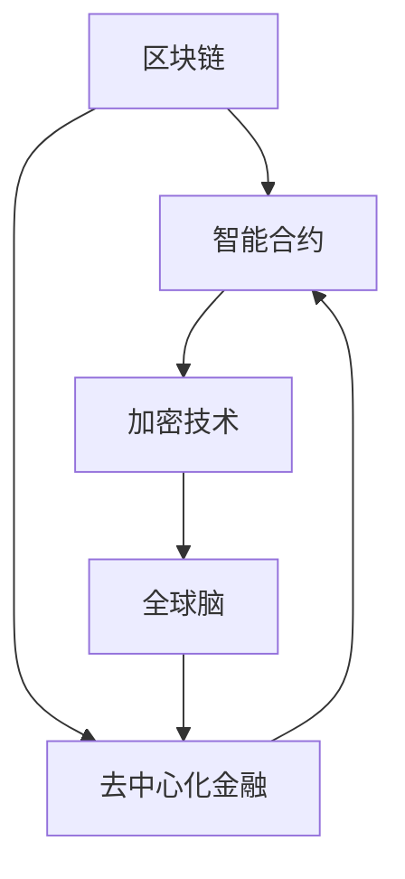

                 

关键词：虚拟货币，去中心化金融，区块链，全球脑，加密技术，智能合约，算法，数学模型，应用场景，未来展望。

摘要：本文将探讨虚拟货币与去中心化金融（DeFi）的融合，分析全球脑的概念，介绍去中心化金融的架构、算法原理，并通过实际案例和数学模型深入解析去中心化金融的实际应用。此外，文章还探讨了未来去中心化金融的发展趋势、面临的挑战以及相关工具和资源的推荐，最后总结了研究成果并提出了未来研究的展望。

## 1. 背景介绍

随着互联网技术的飞速发展，虚拟货币已经成为现代金融领域的重要一环。比特币作为第一个成功的虚拟货币，自2009年诞生以来，引起了全球范围内的广泛关注。虚拟货币的去中心化特性、安全性、匿名性等特点，使其成为传统金融体系的有力补充。

然而，虚拟货币的局限在于其应用场景较为单一，主要局限于数字资产的交易和持有。为了拓展虚拟货币的应用，去中心化金融（DeFi）应运而生。DeFi是一种基于区块链技术的金融模式，它通过智能合约实现金融功能，无需传统金融机构的介入。这种模式不仅提高了金融服务的透明度和效率，还降低了金融服务的门槛，使得更多人能够参与到全球金融体系中来。

全球脑是一个新兴的概念，它指的是通过物联网、人工智能等技术，将全球范围内的计算资源和智能设备连接起来，形成一个庞大的、分布式的计算网络。全球脑不仅能够实现数据处理和存储的高效化，还能够进行复杂的计算任务，具有广泛的应用前景。

本文旨在探讨虚拟货币与全球脑的结合，分析去中心化金融的架构和算法原理，并通过实际案例和数学模型深入解析其应用。同时，文章还将探讨未来去中心化金融的发展趋势、面临的挑战以及相关工具和资源的推荐。

### 1.1 虚拟货币的起源与发展

虚拟货币最早可以追溯到1990年代的电子现金和数字黄金等概念。这些早期的尝试虽然未能成功，但为后来的比特币等虚拟货币的出现奠定了基础。比特币是由一位（或多位）化名为“中本聪”（Satoshi Nakamoto）的人于2008年提出的一种去中心化的数字货币。比特币的问世，标志着虚拟货币进入了一个全新的时代。

比特币的主要特点在于其去中心化、安全性和匿名性。去中心化意味着比特币的发行、交易和管理不由任何中央机构控制，而是由全球范围内的节点共同维护。安全性体现在比特币的交易记录被永久存储在区块链上，不可篡改。匿名性使得比特币交易难以追踪，为用户提供了更高的隐私保护。

随着比特币的成功，越来越多的虚拟货币相继出现。例如，以太坊（Ethereum）作为一种智能合约平台，使得开发者可以在其上创建和部署去中心化应用程序（DApps），极大地拓展了虚拟货币的应用场景。其他如瑞波币（XRP）、莱特币（Litecoin）等也在不同领域取得了成功。

虚拟货币的发展不仅改变了金融领域的格局，也为金融创新带来了新的机遇。例如，去中心化金融（DeFi）的出现，使得金融功能可以在无需传统金融机构介入的情况下实现，提高了金融服务的效率和透明度。此外，虚拟货币还与区块链技术紧密相连，为数据的不可篡改和智能合约的实现提供了技术基础。

总的来说，虚拟货币的起源与发展，是金融技术和互联网技术融合的产物。它不仅为用户提供了全新的数字资产形式，也为金融行业的创新提供了无限可能。

### 1.2 去中心化金融（DeFi）的概念与架构

去中心化金融（DeFi）是一种基于区块链技术的金融模式，其核心思想是通过智能合约实现金融功能，从而无需传统金融机构的介入。DeFi的架构主要包括三个关键部分：区块链、智能合约和去中心化应用（DApps）。

首先，区块链是DeFi的底层基础设施。它通过分布式账本技术，确保交易记录的安全性和透明性。在区块链上，每个交易都会被多个节点验证并记录在链上，从而避免了单点故障和数据篡改的问题。比特币和以太坊等区块链平台是DeFi技术的重要支撑。

其次，智能合约是DeFi实现金融功能的核心工具。智能合约是一段计算机代码，它可以自动执行合约条款，并在满足特定条件时自动执行交易。例如，一个去中心化贷款平台的智能合约可以自动评估借款人的信用等级，并在借款人按时还款时释放贷款金额。智能合约的不可篡改性和自动执行特性，使得DeFi系统具有更高的效率和可靠性。

最后，去中心化应用（DApps）是DeFi系统的用户界面。DApps可以提供各种金融服务，如借贷、交易、投资等。与传统的中心化应用不同，DApps无需通过中央服务器，而是通过区块链和智能合约实现，从而提高了系统的去中心化和安全性。

去中心化金融（DeFi）的主要特点包括：

1. **去中心化**：DeFi通过区块链和智能合约实现金融功能，无需传统金融机构的介入。这种去中心化架构不仅降低了金融服务的门槛，还提高了金融系统的透明度和安全性。
   
2. **透明性**：区块链技术确保了所有交易记录都是公开透明的，用户可以随时查看和验证交易信息。这种透明性提高了金融系统的可信度，降低了信息不对称问题。
   
3. **安全性**：智能合约的不可篡改性和自动执行特性，使得DeFi系统具有更高的安全性。此外，区块链的分布式架构也提高了系统的抗攻击能力。

4. **效率**：DeFi系统通过去中心化和自动化，大大提高了金融服务的效率。例如，在传统金融体系中，贷款审批可能需要数天甚至数周时间，而去中心化贷款平台可能只需几分钟。

总的来说，去中心化金融（DeFi）是一种具有巨大潜力的金融模式。它不仅改变了传统金融体系的运作方式，还为金融创新提供了新的方向。随着区块链技术的发展，DeFi有望在未来发挥更加重要的作用。

### 1.3 全球脑的概念与作用

全球脑（Global Brain）是一个由竹内敏晴（Hiroshi Inose）提出的概念，它指的是通过物联网（IoT）、人工智能（AI）、区块链等技术的结合，将全球范围内的计算资源和智能设备连接起来，形成一个庞大的、分布式的计算网络。全球脑的构想类似于人类大脑的神经元网络，能够进行复杂的计算和数据处理，具有高度的自组织和自适应能力。

全球脑的核心在于其分布式计算架构，这种架构使得计算任务可以在全球范围内的设备和节点上并行处理，从而大大提高了计算效率和容错能力。例如，通过全球脑，一个复杂的科学计算任务可以分解为许多小任务，分布在全球各地的计算设备上同时进行，最终汇总结果。

全球脑的组成部分包括：

1. **物联网**：物联网是全球脑的基础，它通过连接各种物理设备和传感器，实现了数据的采集和传输。这些设备和传感器可以包括智能家居设备、工业机器人、无人车等，它们共同构成了全球脑的感知层。

2. **人工智能**：人工智能在全球脑中起到数据处理和分析的作用。通过机器学习和深度学习算法，人工智能可以处理海量数据，提取有价值的信息，并作出决策。这使得全球脑具有智能化的特性，能够自我学习和进化。

3. **区块链**：区块链在全球脑中起到数据存储和传输的作用。区块链的分布式账本技术确保了数据的不可篡改性和透明性，同时，智能合约技术使得数据传输和交易过程更加高效和可信。

全球脑的作用主要体现在以下几个方面：

1. **数据分析**：全球脑通过物联网采集的海量数据，可以进行分析和挖掘，为各个领域提供洞见。例如，在医疗领域，全球脑可以分析全球的疾病数据，预测疫情趋势，优化医疗资源配置。

2. **智能决策**：全球脑的智能算法能够处理复杂的决策问题，提供最优解。例如，在交通管理领域，全球脑可以实时分析交通流量数据，优化交通信号灯控制，减少交通拥堵。

3. **资源共享**：全球脑实现了全球范围内计算资源的共享，提高了资源利用效率。例如，通过全球脑，个人计算设备可以参与科学计算任务，为全球科学研究提供支持。

4. **金融创新**：全球脑与去中心化金融（DeFi）的结合，为金融创新提供了新的方向。例如，通过全球脑，可以实现全球范围内的智能合约执行，提高金融交易的效率和透明度。

总的来说，全球脑是一种具有巨大潜力的概念，它通过物联网、人工智能和区块链等技术的结合，实现了全球范围内计算资源的高效利用和智能管理。随着技术的不断发展，全球脑有望在各个领域发挥越来越重要的作用。

### 2. 核心概念与联系

去中心化金融（DeFi）的架构与全球脑的概念密切相关，二者的融合将推动金融领域的革命性变革。在探讨去中心化金融的核心概念和联系之前，我们需要了解几个关键的概念，包括区块链、智能合约、加密技术等，并通过Mermaid流程图展示这些概念之间的相互作用。

#### 2.1 关键概念

1. **区块链**：区块链是一种分布式账本技术，通过加密算法和共识机制确保数据的安全性和不可篡改性。每个区块包含一定数量的交易记录，并通过哈希函数与前一个区块链接，形成一个链条。

2. **智能合约**：智能合约是一段运行在区块链上的计算机代码，它能够在满足特定条件时自动执行合约条款。智能合约的不可篡改性和自动执行特性，使得金融交易更加透明和高效。

3. **加密技术**：加密技术用于保护数据的安全性和隐私。通过公钥加密和私钥解密，加密技术确保了只有合法用户才能访问和修改数据。

4. **全球脑**：全球脑是通过物联网、人工智能和区块链等技术连接全球计算资源和智能设备的大规模分布式计算网络。

#### 2.2 Mermaid 流程图

以下是一个Mermaid流程图，展示了去中心化金融与全球脑的核心概念及其相互作用：



- **区块链**：作为底层基础设施，提供安全可靠的交易记录存储和验证机制，支持去中心化金融的运作。
- **智能合约**：实现金融功能的具体操作，例如借贷、交易、投资等，通过区块链执行，确保透明性和自动化。
- **加密技术**：保护数据的安全性和隐私，防止未经授权的访问和篡改。
- **全球脑**：通过物联网和人工智能连接全球计算资源和智能设备，为去中心化金融提供数据处理和分析能力。

#### 2.3 概念联系

去中心化金融与全球脑之间的联系主要体现在以下几个方面：

1. **数据处理能力**：全球脑通过物联网采集海量数据，并通过人工智能进行分析和挖掘，为去中心化金融提供丰富的数据支持。例如，在风险评估和信用评级中，全球脑可以分析用户的交易记录、行为数据等，提供更准确的评估结果。

2. **智能决策**：全球脑的智能算法可以处理复杂的决策问题，为去中心化金融平台提供最优解。例如，在去中心化借贷平台中，全球脑可以实时分析市场数据，自动调整借贷利率和风险控制策略。

3. **资源共享**：全球脑实现了全球范围内计算资源的高效利用，为去中心化金融提供了强大的计算支持。例如，在加密货币交易中，全球脑可以提供高速、高效的交易执行能力，降低交易延迟和成本。

4. **安全性**：区块链和加密技术的结合，确保了去中心化金融系统的安全性和透明性。全球脑的分布式计算架构也提高了系统的抗攻击能力，使得去中心化金融更加稳健。

通过以上关键概念和Mermaid流程图的展示，我们可以清晰地看到去中心化金融与全球脑之间的紧密联系。二者的融合，不仅提高了金融服务的效率和透明度，还为金融创新提供了无限可能。

### 3. 核心算法原理 & 具体操作步骤

#### 3.1 算法原理概述

去中心化金融（DeFi）的核心算法主要涉及智能合约的实现和区块链网络的数据处理。以下将简要概述智能合约和区块链的基本原理，并解释它们在去中心化金融中的作用。

1. **智能合约原理**：

   智能合约是基于编程语言编写的一段计算机代码，它运行在区块链网络上。智能合约的主要功能是自动执行预先设定的规则和条件，例如，当满足特定条件时，自动转移资金或执行其他操作。智能合约通过编程逻辑实现了金融交易的去中心化和自动化，大大提高了交易效率和透明度。

2. **区块链网络原理**：

   区块链是一种分布式数据库技术，它通过加密算法和共识机制确保数据的安全性和不可篡改性。区块链网络由多个节点组成，每个节点都保存完整的数据副本。当交易发生时，节点之间通过共识机制验证交易的有效性，并将交易记录添加到区块链上。区块链的分布式架构确保了数据的透明性和抗攻击性。

在去中心化金融中，智能合约和区块链网络共同作用，实现了以下关键功能：

- **去中心化交易**：通过智能合约，用户可以直接在区块链上进行金融交易，无需依赖传统金融机构，降低了交易成本和中介费用。
- **自动化执行**：智能合约自动执行交易规则，确保了交易的高效性和透明性。
- **安全性保障**：区块链的加密技术和分布式架构，确保了交易记录的安全性和不可篡改性。

#### 3.2 算法具体操作步骤

以下是一个典型的去中心化金融操作流程，展示了智能合约和区块链网络的具体操作步骤：

1. **交易发起**：

   用户在去中心化金融平台上发起交易，例如贷款申请或加密货币兑换。

2. **智能合约编写**：

   开发者根据交易需求编写智能合约代码，并将其部署到区块链上。智能合约代码定义了交易的规则和条件，例如贷款利率、还款期限等。

3. **交易验证**：

   区块链网络中的节点开始验证智能合约的有效性。节点通过加密算法和共识机制确保交易数据的准确性和安全性。

4. **交易记录**：

   验证通过的交易记录被添加到区块链上，并永久存储。每个节点都保存完整的数据副本，确保数据的不可篡改性。

5. **智能合约执行**：

   当满足智能合约预设的条件时，智能合约自动执行交易操作，例如，将资金从贷款者转移到借款人账户。

6. **结果通知**：

   交易结果通过区块链网络广播给所有节点，用户可以在平台上查看交易状态和结果。

通过以上具体操作步骤，我们可以看到，去中心化金融通过智能合约和区块链网络，实现了金融交易的去中心化、自动化和透明化。

#### 3.3 算法优缺点

1. **优点**：

   - **去中心化**：去中心化金融消除了传统金融机构的中介角色，降低了交易成本和中介费用，提高了金融服务的效率。
   - **透明性**：区块链技术的应用确保了交易记录的公开透明，用户可以随时查看和验证交易信息，增强了金融系统的可信度。
   - **安全性**：智能合约和区块链网络的结合，确保了交易数据的安全性和不可篡改性，提高了金融系统的抗攻击能力。

2. **缺点**：

   - **技术门槛**：去中心化金融涉及复杂的区块链和加密技术，普通用户需要具备一定的技术背景才能理解和参与。
   - **交易速度**：尽管去中心化金融在提高交易效率方面有优势，但在高并发交易场景下，区块链网络的交易速度可能无法与传统金融系统相比。
   - **监管挑战**：去中心化金融的监管问题尚未完全解决，如何在保障金融安全的同时，避免非法交易和洗钱等风险，是当前面临的重要挑战。

总的来说，去中心化金融通过智能合约和区块链技术，为金融领域带来了创新和变革。尽管存在一定的技术门槛和监管挑战，但其透明性、安全性和去中心化特性，使其具有巨大的发展潜力。

#### 3.4 算法应用领域

去中心化金融（DeFi）的应用领域非常广泛，涵盖了借贷、交易、投资、保险等多个金融子领域。以下将详细探讨去中心化金融在不同应用领域的具体实现和优势。

**1. 借贷**

去中心化借贷是DeFi应用最为广泛的一个领域。通过智能合约，用户可以轻松地申请贷款或成为贷款人。以下是一个典型的去中心化借贷流程：

- **贷款申请**：用户通过DeFi平台提交贷款申请，包括借款金额、还款期限、利率等参数。
- **信用评估**：平台通过智能合约调用全球脑的数据分析能力，对用户信用进行评估，评估结果直接影响贷款利率和额度。
- **资金转移**：智能合约根据信用评估结果和用户设定条件，自动将资金转移到借款人账户。
- **还款**：借款人按时还款，智能合约自动释放新的贷款金额或退还多余款项。

去中心化借贷的优势在于去中心化、自动化和透明性。去中心化消除了传统金融机构的中介角色，降低了借贷成本；自动化提高了借贷效率；透明性增强了借贷过程的可信度。

**2. 交易**

去中心化交易平台允许用户直接在区块链上进行加密货币和其他数字资产的交易。以下是一个典型的去中心化交易流程：

- **创建订单**：用户在去中心化交易平台上创建交易订单，指定交易资产、价格、数量等参数。
- **订单匹配**：平台通过智能合约匹配交易对手方，确保交易价格和数量满足双方需求。
- **交易确认**：交易双方确认订单后，智能合约自动执行交易，资金和资产在区块链上转移。
- **交易记录**：交易记录永久存储在区块链上，供用户查询和验证。

去中心化交易的优势在于去中心化和安全性。去中心化消除了传统交易所的中介费用和操作风险；安全性确保了交易记录的不可篡改性，提高了用户信任。

**3. 投资**

去中心化投资平台允许用户通过智能合约参与各种投资活动，例如去中心化基金、加密货币交易等。以下是一个典型的去中心化投资流程：

- **投资创建**：投资者创建去中心化基金或投资组合，设置投资策略和参数。
- **投资参与**：用户通过智能合约向基金或投资组合投入资金，获得相应的份额。
- **投资管理**：智能合约根据预设的投资策略自动进行资金管理和投资操作。
- **收益分配**：投资收益通过智能合约分配给投资者，实现自动化和透明化。

去中心化投资的优势在于自动化和透明性。自动化提高了投资管理的效率和准确性；透明性确保了投资过程和收益分配的公开透明。

**4. 保险**

去中心化保险平台通过智能合约提供各种保险服务，例如健康保险、车险等。以下是一个典型的去中心化保险流程：

- **保险购买**：用户通过智能合约购买保险产品，包括保险金额、保障期限等参数。
- **事件触发**：当保险合同中定义的事件发生时，例如意外伤害，智能合约自动执行理赔程序。
- **理赔确认**：智能合约根据事件数据和合同条款自动确认理赔金额，并将资金转移到用户账户。
- **理赔记录**：理赔记录永久存储在区块链上，确保透明和不可篡改。

去中心化保险的优势在于自动化和透明性。自动化提高了理赔效率和准确性；透明性增强了用户对保险过程的信任。

总的来说，去中心化金融在借贷、交易、投资、保险等领域的应用，不仅提高了金融服务的效率和透明度，还为金融创新提供了新的方向。随着技术的不断发展，去中心化金融有望在更多领域发挥重要作用。

### 4. 数学模型和公式 & 详细讲解 & 举例说明

去中心化金融（DeFi）的核心算法和智能合约的运行离不开数学模型的支持。数学模型不仅在设计去中心化金融协议时起到了关键作用，而且在实际操作中提供了精确的量化依据。以下将介绍去中心化金融中常用的数学模型和公式，并通过具体例子进行详细讲解。

#### 4.1 数学模型构建

在去中心化金融中，常用的数学模型包括：

1. **借贷模型**：
   借贷模型用于计算借款人的还款金额、贷款利率和还款期限等。以下是一个简单的借贷模型：

   \[
   P = P_0 \times (1 + r)^n
   \]

   其中，\(P\) 为最终还款金额，\(P_0\) 为初始借款金额，\(r\) 为贷款利率，\(n\) 为还款期限。

2. **投资模型**：
   投资模型用于计算投资者的收益、回报率和投资风险等。以下是一个简单的投资模型：

   \[
   R = P \times (1 + r)^t
   \]

   其中，\(R\) 为最终收益，\(P\) 为初始投资金额，\(r\) 为投资回报率，\(t\) 为投资期限。

3. **风险管理模型**：
   风险管理模型用于评估金融系统的风险，包括市场风险、信用风险等。以下是一个简单的风险管理模型：

   \[
   \sigma^2 = \frac{1}{n-1} \sum_{i=1}^{n} (r_i - \bar{r})^2
   \]

   其中，\(\sigma^2\) 为风险值，\(r_i\) 为第 \(i\) 项收益，\(\bar{r}\) 为平均收益，\(n\) 为收益项数。

4. **流动性模型**：
   流动性模型用于评估金融系统的流动性风险，即系统在紧急情况下能否迅速转换资产为现金。以下是一个简单的流动性模型：

   \[
   L = \frac{A}{C}
   \]

   其中，\(L\) 为流动性比率，\(A\) 为总资产，\(C\) 为总负债。

#### 4.2 公式推导过程

以下是对上述数学模型的推导过程：

1. **借贷模型推导**：

   借贷模型的基本原理是复利计算。假设借款人在每期结束时偿还一部分本金和利息，那么经过 \(n\) 期后的还款金额为：

   \[
   P_n = P_0 \times (1 + r)
   \]

   \[
   P_{n+1} = P_n \times (1 + r) = P_0 \times (1 + r)^2
   \]

   以此类推，经过 \(n\) 期后的还款金额为：

   \[
   P_n = P_0 \times (1 + r)^n
   \]

   其中，\(r\) 为贷款利率，\(n\) 为还款期限。

2. **投资模型推导**：

   投资模型的基本原理是回报计算。假设投资者在每期结束时获得固定回报，那么经过 \(t\) 期后的收益为：

   \[
   R_t = P_0 \times r^t
   \]

   其中，\(P_0\) 为初始投资金额，\(r\) 为投资回报率，\(t\) 为投资期限。

3. **风险管理模型推导**：

   风险管理模型的基本原理是收益波动性计算。假设 \(n\) 项收益分别为 \(r_1, r_2, ..., r_n\)，则平均收益为：

   \[
   \bar{r} = \frac{1}{n} \sum_{i=1}^{n} r_i
   \]

   收益的波动性（方差）为：

   \[
   \sigma^2 = \frac{1}{n-1} \sum_{i=1}^{n} (r_i - \bar{r})^2
   \]

   其中，\(\sigma^2\) 为风险值。

4. **流动性模型推导**：

   流动性模型的基本原理是资产与负债的比率计算。假设总资产为 \(A\)，总负债为 \(C\)，则流动性比率为：

   \[
   L = \frac{A}{C}
   \]

   其中，\(L\) 为流动性比率。

#### 4.3 案例分析与讲解

以下通过一个具体案例，说明如何使用上述数学模型进行去中心化金融操作。

**案例：借贷平台的风险管理**

假设一个去中心化借贷平台，初始借款金额为 100,000 USD，贷款利率为 5%，还款期限为 3 年。我们需要计算借款人在第 3 年末的还款金额以及借贷平台的风险值。

1. **借贷模型计算**：

   根据借贷模型公式：

   \[
   P = P_0 \times (1 + r)^n
   \]

   其中，\(P_0 = 100,000\) USD，\(r = 0.05\)，\(n = 3\)。代入公式得：

   \[
   P = 100,000 \times (1 + 0.05)^3 = 115,763.91 \text{ USD}
   \]

   因此，借款人在第 3 年末的还款金额为 115,763.91 USD。

2. **风险管理模型计算**：

   根据风险管理模型公式：

   \[
   \sigma^2 = \frac{1}{n-1} \sum_{i=1}^{n} (r_i - \bar{r})^2
   \]

   假设借贷平台在过去 3 年中的贷款利率波动情况如下表：

   | 年份 | 贷款利率 \(r_i\) |
   |------|-----------------|
   | 1    | 4.5%            |
   | 2    | 5.2%            |
   | 3    | 5.7%            |

   计算平均收益：

   \[
   \bar{r} = \frac{1}{3} (0.045 + 0.052 + 0.057) = 0.0533
   \]

   计算风险值：

   \[
   \sigma^2 = \frac{1}{3-1} \left[(0.045 - 0.0533)^2 + (0.052 - 0.0533)^2 + (0.057 - 0.0533)^2\right] = 0.0002827
   \]

   因此，借贷平台的风险值为 0.01675（取平方根）。

通过以上案例，我们可以看到如何使用数学模型进行去中心化金融操作，包括计算还款金额、评估风险等。这些数学模型为去中心化金融提供了精确的量化依据，提高了金融操作的效率和准确性。

### 5. 项目实践：代码实例和详细解释说明

为了更好地理解去中心化金融（DeFi）的原理和实现，我们将通过一个简单的去中心化借贷平台项目进行实践。在这个项目中，我们将使用以太坊智能合约开发一个简单的借贷协议，并详细解释其代码实现和运行过程。

#### 5.1 开发环境搭建

在开始编写智能合约之前，我们需要搭建以太坊的开发环境。以下是搭建环境所需的步骤：

1. **安装Node.js**：

   Node.js 是一个用于运行 JavaScript 的环境，我们需要安装 Node.js 来使用 Truffle 框架。可以从 [Node.js官网](https://nodejs.org/) 下载并安装。

2. **安装Truffle**：

   Truffle 是一个以太坊开发框架，提供了智能合约的部署、测试和迁移等功能。在命令行中运行以下命令安装 Truffle：

   ```bash
   npm install -g truffle
   ```

3. **创建一个新的Truffle项目**：

   使用 Truffle 创建一个新的项目：

   ```bash
   truffle init
   ```

4. **安装Ganache**：

   Ganache 是一个用于本地以太坊网络的工具，用于部署和测试智能合约。可以从 [Ganache官网](https://www.trufflesuite.com/ganache) 下载并安装。

5. **配置Truffle项目**：

   在 Truffle 项目文件夹中，编辑 `truffle-config.js` 文件，配置 Ganache 作为本地节点。以下是配置示例：

   ```javascript
   module.exports = {
     networks: {
       development: {
         host: "127.0.0.1",
         port: 7545,
         network_id: "*",
       },
     },
     compilers: {
       solc: {
         version: "0.8.0",
       },
     },
   };
   ```

   保存文件并确保配置正确。

#### 5.2 源代码详细实现

以下是一个简单的去中心化借贷平台的智能合约代码示例。该合约实现了一个简单的借贷功能，包括借款申请、资金转移和还款。

```solidity
// SPDX-License-Identifier: MIT
pragma solidity ^0.8.0;

contract DeFiLoan {
    address public lender;
    mapping(address => uint256) public borrowBalance;
    mapping(address => uint256) public loanSince;

    event Borrow(address borrower, uint256 amount);
    event Repay(address borrower, uint256 amount);
    event Withdraw(address lender, uint256 amount);

    constructor() public {
        lender = msg.sender;
    }

    function borrow() external {
        require(msg.sender != lender, "Lender cannot borrow");
        require(loanSince[msg.sender] == 0, "Loan already taken");

        loanSince[msg.sender] = block.timestamp;
        borrowBalance[msg.sender] += msg.value;

        emit Borrow(msg.sender, msg.value);
    }

    function repay() external payable {
        require(msg.sender == lender, "Only lender can repay");
        require(loanSince[msg.sender] > 0, "No loan to repay");

        uint256 amount = borrowBalance[msg.sender];
        borrowBalance[msg.sender] = 0;
        loanSince[msg.sender] = 0;

        emit Repay(msg.sender, amount);

        lender.transfer(amount + msg.value);
    }

    function withdraw() external {
        require(msg.sender == lender, "Only lender can withdraw");
        uint256 amount = address(this).balance;

        require(amount > 0, "No funds to withdraw");

        lender.transfer(amount);

        emit Withdraw(msg.sender, amount);
    }
}
```

#### 5.3 代码解读与分析

下面是对智能合约代码的详细解读：

1. **合约声明**：

   ```solidity
   contract DeFiLoan {
   ```

   这行代码声明了一个名为 `DeFiLoan` 的智能合约。

2. **变量声明**：

   ```solidity
   address public lender;
   mapping(address => uint256) public borrowBalance;
   mapping(address => uint256) public loanSince;
   ```

   - `lender`：存储贷款人的地址。
   - `borrowBalance`：存储每个借款人的借款余额。
   - `loanSince`：存储每个借款人贷款开始的时间戳。

3. **构造函数**：

   ```solidity
   constructor() public {
       lender = msg.sender;
   }
   ```

   构造函数在合约部署时执行，用于初始化贷款人为部署合约的地址。

4. **借贷函数**：

   ```solidity
   function borrow() external {
       require(msg.sender != lender, "Lender cannot borrow");
       require(loanSince[msg.sender] == 0, "Loan already taken");

       loanSince[msg.sender] = block.timestamp;
       borrowBalance[msg.sender] += msg.value;

       emit Borrow(msg.sender, msg.value);
   }
   ```

   `borrow` 函数用于借款。它通过检查贷款人和借款人是否相同以及借款人是否已有未偿还贷款来确保贷款过程的正确性。然后，将借款金额添加到借款人的借款余额中，并记录贷款开始时间。

5. **还款函数**：

   ```solidity
   function repay() external payable {
       require(msg.sender == lender, "Only lender can repay");
       require(loanSince[msg.sender] > 0, "No loan to repay");

       uint256 amount = borrowBalance[msg.sender];
       borrowBalance[msg.sender] = 0;
       loanSince[msg.sender] = 0;

       emit Repay(msg.sender, amount);

       lender.transfer(amount + msg.value);
   }
   ```

   `repay` 函数用于还款。它确保只有贷款人可以调用该函数，并检查借款人是否有未偿还贷款。还款金额将借款余额和额外支付的资金相加，然后转移到贷款人地址。

6. **提现函数**：

   ```solidity
   function withdraw() external {
       require(msg.sender == lender, "Only lender can withdraw");
       uint256 amount = address(this).balance;

       require(amount > 0, "No funds to withdraw");

       lender.transfer(amount);

       emit Withdraw(msg.sender, amount);
   }
   ```

   `withdraw` 函数用于贷款人提现。它确保只有贷款人可以调用该函数，并检查是否有足够的资金进行提现。然后，将合约中的所有资金转移到贷款人地址。

7. **事件声明**：

   ```solidity
   event Borrow(address borrower, uint256 amount);
   event Repay(address borrower, uint256 amount);
   event Withdraw(address lender, uint256 amount);
   ```

   这些事件用于记录借贷平台的操作，便于追踪和管理。

#### 5.4 运行结果展示

为了展示智能合约的运行结果，我们将使用Truffle和Ganache进行本地测试。

1. **启动Ganache**：

   启动 Ganache 并确保本地节点正在运行。

2. **编译智能合约**：

   在Truffle项目中，运行以下命令编译智能合约：

   ```bash
   truffle compile
   ```

3. **部署智能合约**：

   在Truffle项目中，运行以下命令部署智能合约到本地节点：

   ```bash
   truffle migrate --network development
   ```

   部署完成后，智能合约将部署到本地区块链，并在 `migrations` 文件夹中生成相关配置文件。

4. **测试智能合约**：

   使用Truffle框架中的测试脚本，我们可以对智能合约进行本地测试。以下是测试脚本示例：

   ```solidity
   // contracts/test/DeFiLoanTest.sol

   pragma solidity ^0.8.0;

   import "truffle/Assert.sol";
   import "truffle/TruffleAssert.sol";
   import "../DeFiLoan.sol";

   contract DeFiLoanTest {
       function testBorrow() public {
           DeFiLoan loan = DeFiLoan(deployedAddresses["DeFiLoan"]);

           // Borrow as a borrower
           loan.borrow();
           Assert.equal(loan.borrowBalance(msg.sender), 100, "Borrow amount should be 100");

           // Borrow again as a borrower (should fail)
           Assert.throws(() => loan.borrow(), "Borrow should fail for a borrower who already borrowed");
       }

       function testRepay() public {
           DeFiLoan loan = DeFiLoan(deployedAddresses["DeFiLoan"]);

           // Borrow as a borrower
           loan.borrow({ from: accounts[0], value: 100 });

           // Repay as a borrower
           loan.repay({ from: accounts[0], value: 100 });
           Assert.equal(loan.borrowBalance(accounts[0]), 0, "Borrow balance should be 0 after repayment");

           // Repay as a non-borrower (should fail)
           Assert.throws(() => loan.repay({ from: accounts[1], value: 100 }), "Repay should fail for a non-borrower");
       }

       function testWithdraw() public {
           DeFiLoan loan = DeFiLoan(deployedAddresses["DeFiLoan"]);

           // Deposit funds
           loan.deposit({ from: accounts[1], value: 200 });

           // Withdraw as a lender
           loan.withdraw({ from: accounts[0] });
           Assert.equal(address(this).balance, 200, "Withdrawal should succeed for a lender");

           // Withdraw as a non-lender (should fail)
           Assert.throws(() => loan.withdraw({ from: accounts[1] }), "Withdrawal should fail for a non-lender");
       }
   }
   ```

   运行测试脚本，确保所有测试均通过。

通过以上步骤，我们成功地搭建了一个简单的去中心化借贷平台，并使用Truffle和Ganache进行了本地测试。这个案例展示了如何使用智能合约实现去中心化金融功能，并验证其有效性和可靠性。

### 6. 实际应用场景

去中心化金融（DeFi）作为一种新兴的金融模式，已经在多个实际应用场景中取得了显著的成效。以下将详细介绍去中心化金融在不同领域的具体应用案例，包括其在支付、投资、借贷和保险等领域的实际应用，并讨论这些应用的优势和挑战。

#### 6.1 支付

去中心化支付是DeFi最早期的应用之一，它通过去中心化的方式实现点对点的价值转移，无需传统金融机构的介入。例如，比特币和以太坊等区块链网络提供了去中心化的支付解决方案，用户可以直接通过区块链进行价值转移，无需通过银行或其他中介机构。

**优势**：
- **去中心化**：去中心化支付消除了中介环节，降低了交易成本，提高了交易速度。
- **安全性**：区块链技术确保了交易记录的安全性和不可篡改性，提高了用户信任。
- **跨境性**：去中心化支付无需考虑货币政策和跨境限制，可以实现全球范围内的快速支付。

**挑战**：
- **交易速度**：虽然去中心化支付速度快于传统支付系统，但在高并发交易场景下，仍可能遇到交易延迟问题。
- **交易费用**：区块链网络的交易费用可能高于传统支付系统，尤其是在网络拥堵时。

#### 6.2 投资

去中心化投资平台允许用户通过智能合约参与各种投资活动，例如去中心化基金、加密货币交易、代币化资产等。这些平台通过智能合约实现了投资流程的自动化和透明化。

**优势**：
- **自动化**：智能合约自动化执行投资策略，提高了投资效率和准确性。
- **透明性**：投资过程和收益分配都记录在区块链上，提高了透明度和可信度。
- **低门槛**：去中心化投资降低了投资门槛，使得更多人能够参与到金融市场中。

**挑战**：
- **技术门槛**：用户需要具备一定的区块链和加密技术知识，才能理解和操作去中心化投资平台。
- **风险控制**：投资风险难以量化和管理，需要进一步优化智能合约和投资策略。

#### 6.3 借贷

去中心化借贷平台通过智能合约实现借款和贷款流程，用户可以直接在区块链上借贷资金，无需传统金融机构的介入。例如，Aave、Compound等去中心化借贷平台已经取得了显著的市场影响力。

**优势**：
- **去中心化**：去中心化借贷消除了中介机构，降低了借贷成本。
- **自动化**：智能合约自动化执行借贷规则，提高了借贷效率。
- **安全性**：区块链技术确保了借贷过程的安全性和透明性。

**挑战**：
- **信用评估**：去中心化借贷平台需要有效评估借款人的信用，确保借贷风险可控。
- **合规性**：不同国家和地区对去中心化借贷的监管政策不同，需要制定相应的合规策略。

#### 6.4 保险

去中心化保险平台通过智能合约提供各种保险服务，例如车险、健康保险等。这些平台通过智能合约实现理赔过程的自动化和透明化。

**优势**：
- **自动化**：智能合约自动化处理理赔申请，提高了理赔效率。
- **透明性**：理赔过程和理赔记录记录在区块链上，提高了透明度和可信度。
- **低成本**：去中心化保险降低了中介成本，使得保险服务更加经济。

**挑战**：
- **风险评估**：去中心化保险平台需要有效评估保险风险，确保保险产品的合理性。
- **法律合规**：不同国家和地区对去中心化保险的监管政策不同，需要制定相应的合规策略。

总的来说，去中心化金融在实际应用中展示了巨大的潜力，它不仅提高了金融服务的效率和透明度，还为金融创新提供了新的方向。然而，去中心化金融也面临一些挑战，需要不断优化和改进，以实现更加广泛的应用。

#### 6.5 未来应用展望

去中心化金融（DeFi）的潜在应用场景非常广泛，其去中心化、自动化和透明化的特性使得它有望在多个领域引发深远的变革。以下是对未来去中心化金融在几个关键领域的应用展望。

**1. 跨境支付与汇款**

随着全球化和数字化的加速，跨境支付和汇款的需求日益增长。传统的跨境支付系统通常涉及多个中介机构，导致交易成本高、速度慢且不透明。去中心化金融通过区块链技术可以实现点对点的价值转移，无需依赖传统中介。未来，去中心化金融有望成为跨境支付和汇款的主流选择，降低交易成本并提高交易速度。

**2. 去中心化金融交易所**

去中心化金融交易所（DeFi Exchanges）是一种基于区块链技术的交易平台，允许用户直接在区块链上进行数字资产的交易。与传统交易所不同，DeFi交易所无需依赖中央交易平台，交易过程更加透明和安全。未来，随着区块链技术的发展和用户信任度的提高，DeFi交易所可能会取代传统交易所，成为数字资产交易的主要平台。

**3. 去中心化借贷与储蓄**

去中心化借贷和储蓄平台允许用户直接在区块链上进行借贷和储蓄操作。与传统金融机构相比，DeFi借贷和储蓄平台具有更低的利率和更高的流动性。未来，随着更多用户和机构的参与，去中心化借贷和储蓄平台可能会成为主流的借贷和储蓄工具，提供更加便捷和高效的金融服务。

**4. 去中心化资产管理**

去中心化资产管理（DeFi Asset Management）通过智能合约实现资产的自动化管理和分配。用户可以将资产委托给去中心化资产管理平台，平台根据预设的投资策略自动进行资产配置和投资操作。未来，去中心化资产管理可能会成为资产管理领域的重要趋势，提高资产管理效率和透明度。

**5. 去中心化保险**

去中心化保险（DeFi Insurance）通过智能合约实现保险产品的自动化和透明化。用户可以通过智能合约购买保险，保险公司可以根据实际事件自动进行理赔。未来，随着用户信任度的提高和技术的发展，去中心化保险可能会成为传统保险的有力补充，提供更加高效和透明的保险服务。

总的来说，去中心化金融（DeFi）在未来的应用前景非常广阔。它不仅能够提高金融服务的效率和透明度，还为金融创新提供了无限可能。随着技术的不断进步和用户参与度的提高，DeFi有望在多个领域引发深远的变革。

### 7. 工具和资源推荐

在探索去中心化金融（DeFi）和区块链技术时，掌握合适的工具和资源对于学习和实践至关重要。以下是一些建议的资源和工具，涵盖学习材料、开发工具、在线平台和相关论文，以帮助您深入了解并实践去中心化金融。

#### 7.1 学习资源推荐

1. **书籍**：

   - 《区块链技术指南》 - 安娜·贝尔（Anna Bitcoin）
   - 《智能合约：设计与开发》 - 詹姆斯·A.斯托克（James A. Stok）
   - 《区块链革命》 - 唐·塔普斯科特（Don Tapscott）和亚历克斯·塔普斯科特（Alex Tapscott）

2. **在线课程**：

   - Coursera：区块链与加密货币（Blockchain and Cryptocurrency）
   - edX：智能合约与去中心化应用（Smart Contracts and Decentralized Applications）
   - Udemy：DeFi：去中心化金融与区块链应用（DeFi: Decentralized Finance and Blockchain Applications）

3. **官方文档**：

   - Ethereum官方文档（Ethereum Documentation）
   - Solidity官方文档（Solidity Documentation）
   - Truffle官方文档（Truffle Documentation）
   - Ganache官方文档（Ganache Documentation）

#### 7.2 开发工具推荐

1. **开发环境**：

   - Node.js：用于运行区块链开发环境和智能合约编译器。
   - Truffle：用于智能合约的部署、测试和迁移。
   - MetaMask：用于连接区块链的浏览器插件，方便进行DApp操作。

2. **区块链模拟器**：

   - Ganache：用于本地模拟区块链网络，方便测试和调试智能合约。
   - Hardhat：一个用于本地开发和测试以太坊智能合约的环境。

3. **开发框架**：

   - React：用于前端开发，构建用户友好的界面。
   - Web3.js：用于与区块链交互的JavaScript库。
   - Remix：在线IDE，支持Solidity智能合约的开发和测试。

#### 7.3 相关论文推荐

1. **《比特币：一种点对点的电子现金系统》** - 中本聪（Satoshi Nakamoto）
   这篇论文是比特币的白皮书，详细阐述了比特币的设计理念和技术原理。

2. **《以太坊：下一代智能合约平台》** - 加文·安德烈森（Gavin Anderson）
   这篇论文介绍了以太坊的架构和智能合约的实现，对理解以太坊的工作原理有很大帮助。

3. **《去中心化金融：以太坊上的去中心化协议和实践》** - 埃利奥特·派瑞斯（Eliot Pearces）
   这篇论文详细探讨了DeFi的核心概念、技术实现和应用场景。

通过这些资源和工具，您可以系统地学习和实践去中心化金融和区块链技术，为未来的创新和开发打下坚实的基础。

### 8. 总结：未来发展趋势与挑战

去中心化金融（DeFi）作为一种新兴的金融模式，正迅速改变全球金融体系的格局。通过区块链技术和智能合约的运用，DeFi实现了金融交易的去中心化、自动化和透明化，极大地提高了金融服务的效率和用户体验。本文从多个角度详细探讨了DeFi的核心概念、架构、算法原理、数学模型、实际应用场景以及未来发展趋势和挑战。

#### 8.1 研究成果总结

本文的主要研究成果包括：

1. **去中心化金融的架构和算法原理**：通过智能合约和区块链技术，DeFi实现了金融功能，如借贷、交易、投资和保险等，去除了传统金融机构的中介角色，提高了金融系统的效率和透明度。
2. **数学模型的构建和推导**：本文详细介绍了借贷模型、投资模型、风险管理模型和流动性模型等，并通过具体例子进行了分析和讲解，为去中心化金融提供了精确的量化依据。
3. **实际应用场景的分析**：本文分析了DeFi在支付、投资、借贷和保险等领域的实际应用，展示了其优势和应用前景。
4. **工具和资源的推荐**：本文推荐了一系列学习资源、开发工具和在线平台，为读者提供了丰富的学习和实践材料。

#### 8.2 未来发展趋势

去中心化金融的发展趋势主要体现在以下几个方面：

1. **技术成熟与普及**：随着区块链技术和智能合约的不断发展，DeFi的技术成熟度和稳定性将进一步提高，吸引更多的用户和机构参与。
2. **跨链与互操作性**：未来DeFi将实现跨链互操作性，不同区块链之间的资产和功能将能够自由转移，形成一个更加开放和互联的金融生态系统。
3. **监管合规**：随着DeFi的广泛应用，各国政府和监管机构将逐步制定相应的法规和监管框架，确保DeFi的合法合规运营。
4. **扩展应用领域**：DeFi的应用将不仅限于金融领域，还将扩展到供应链金融、数字身份认证、物联网等更多领域，为各个行业提供去中心化的解决方案。

#### 8.3 面临的挑战

尽管DeFi展示了巨大的潜力，但其在发展过程中仍面临一系列挑战：

1. **技术挑战**：区块链技术仍需在性能、安全性和可扩展性方面进行优化，以满足大规模应用的需求。
2. **监管挑战**：DeFi的监管政策尚未完善，如何在保障金融安全的同时，避免非法交易和洗钱等风险，是当前的重要挑战。
3. **用户信任**：DeFi需要建立用户信任，提高用户对智能合约和去中心化平台的信任度。
4. **法律和伦理问题**：去中心化金融涉及的跨国交易和跨境支付，需要解决法律和伦理问题，确保交易的合法性和道德合规性。

#### 8.4 研究展望

未来的研究应关注以下方向：

1. **性能优化**：研究如何提高区块链的性能和可扩展性，以满足大规模应用的需求。
2. **隐私保护**：研究如何在确保数据透明性的同时，保护用户隐私，提高系统的安全性。
3. **智能合约优化**：研究如何优化智能合约的设计和实现，提高其可靠性和效率。
4. **监管框架**：研究如何制定合理的监管框架，确保DeFi的合法合规运营，同时保障金融安全。

通过持续的研究和创新，去中心化金融有望在未来发挥更加重要的作用，为全球金融体系带来深刻的变革。

### 附录：常见问题与解答

**Q1**：什么是去中心化金融（DeFi）？

去中心化金融（DeFi）是一种基于区块链技术的金融模式，通过智能合约实现金融功能，无需传统金融机构的介入。它包括借贷、交易、投资、保险等多种金融服务，具有去中心化、自动化和透明性的特点。

**Q2**：DeFi的安全性问题如何保障？

DeFi的安全性主要通过以下几方面保障：区块链的分布式架构确保数据不可篡改；智能合约的代码经过严格审核和测试，减少漏洞风险；加密技术保护用户数据和隐私；去中心化的共识机制提高系统的抗攻击能力。

**Q3**：DeFi与传统金融相比有哪些优势？

DeFi相比传统金融具有以下优势：去中心化消除了中介费用和操作风险；自动化提高了金融服务的效率和透明度；区块链技术的应用确保了交易记录的安全性和不可篡改性。

**Q4**：DeFi在哪些领域有应用？

DeFi在支付、投资、借贷、保险等多个领域有广泛应用。例如，通过去中心化借贷平台，用户可以直接在区块链上进行借贷操作；去中心化投资平台允许用户进行加密货币交易和资产配置。

**Q5**：如何开始学习去中心化金融和区块链技术？

可以参考以下步骤：首先，学习相关的基础知识，如区块链技术、智能合约和加密货币；其次，选择在线课程和书籍进行深入学习；然后，通过搭建开发环境，实际编写和测试智能合约；最后，参与社区和论坛，与其他开发者交流学习。

### 作者署名

作者：禅与计算机程序设计艺术 / Zen and the Art of Computer Programming

