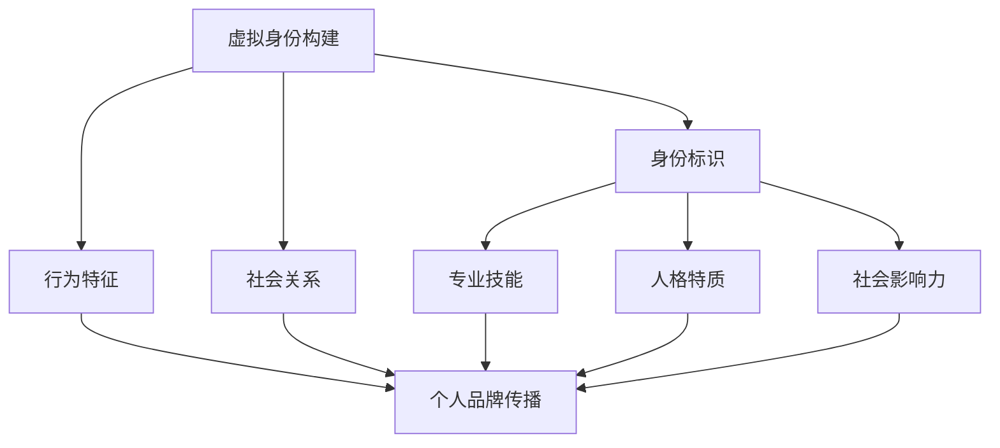

                 

关键词：虚拟身份、AI、个人品牌、市场分析、技术趋势、未来展望

> 摘要：随着人工智能技术的快速发展，虚拟身份和个人品牌的重要性日益凸显。本文从市场分析的角度，深入探讨了AI时代个人品牌构建的挑战与机遇，以及未来发展的趋势与前景。

## 1. 背景介绍

在过去的几十年里，互联网和移动技术的迅速普及改变了人们的生活方式，同时也催生了虚拟世界的崛起。虚拟现实（VR）、增强现实（AR）以及区块链技术的应用，使得人们可以在虚拟世界中建立和塑造个人身份。而随着人工智能（AI）技术的进一步发展，虚拟身份和个人品牌已经不再仅仅是游戏和娱乐领域的概念，而是逐渐成为现代社会的重要组成部分。

虚拟身份，指的是在虚拟世界中，个人通过数字化的方式展现出的形象和身份。它不仅包括外观特征，还涉及行为、性格、社会关系等多方面因素。而个人品牌，则是指个人在特定领域内通过专业技能、人格特质和社会影响力所建立起的独特形象。

在AI时代，虚拟身份和个人品牌构建的重要性体现在以下几个方面：

1. **数字经济的崛起**：随着数字化经济的不断发展，个人品牌成为了一种新的资产形式，能够为个人带来经济利益和社会影响力。
2. **虚拟工作的需求**：远程工作、自由职业和虚拟团队等新兴工作模式的兴起，使得虚拟身份和个人品牌在职场中的重要性日益增加。
3. **社交网络的扩张**：社交媒体和在线平台的普及，为个人品牌的建设提供了更多的渠道和机会。
4. **人工智能的应用**：AI技术使得个人品牌的管理和推广更加智能化，提高了品牌的影响力和传播效率。

## 2. 核心概念与联系

### 2.1 虚拟身份

虚拟身份的构建涉及多个层面的要素，包括但不限于以下几个方面：

- **身份标识**：在虚拟世界中，个人通过用户名、头像、昵称等标识来确立自己的身份。
- **行为特征**：虚拟身份的行为特征包括交互方式、沟通风格、参与活动等，这些特征反映了个人在虚拟世界中的性格和价值观。
- **社会关系**：虚拟身份在社会网络中的互动和联系，如好友关系、社群成员等，形成了虚拟社会关系网。

### 2.2 个人品牌

个人品牌是指个人在特定领域内通过专业技能、人格特质和社会影响力所建立起的独特形象。它包括以下几个关键要素：

- **专业技能**：个人在特定领域的知识和技能水平，是品牌建设的基础。
- **人格特质**：个人的性格、态度、价值观等特质，对于品牌的塑造和传播具有重要影响。
- **社会影响力**：个人在社交媒体、行业内的知名度和影响力，是品牌价值的体现。

### 2.3 虚拟身份与个人品牌的关系

虚拟身份与个人品牌之间存在着紧密的联系和相互作用。虚拟身份是个人品牌在虚拟世界中的映射，而个人品牌则为虚拟身份的构建提供了方向和内涵。具体来说：

- **虚拟身份为个人品牌提供了新的表现空间**：通过虚拟身份，个人可以更加自由地展现自己的个性、技能和价值观。
- **个人品牌为虚拟身份赋予了深度和影响力**：一个具有高度个人品牌的个体，其虚拟身份往往能够获得更多的关注和认可。
- **两者相互促进，共同提升**：良好的虚拟身份有助于个人品牌的传播和推广，而强大的个人品牌则为虚拟身份的构建提供了更多的资源和机会。

### 2.4 Mermaid 流程图

以下是一个关于虚拟身份与个人品牌关系的 Mermaid 流程图：



## 3. 核心算法原理 & 具体操作步骤

### 3.1 算法原理概述

在AI时代，个人品牌和虚拟身份的构建离不开算法的支持。核心算法原理主要包括以下几个方面：

- **数据收集与处理**：通过收集个人在虚拟世界中的行为数据、社交媒体活动数据等，对数据进行清洗、处理和整合。
- **特征提取与建模**：对数据中的关键特征进行提取，并构建相应的模型，以反映个人在虚拟世界中的身份特征。
- **模型优化与训练**：通过机器学习算法对模型进行优化和训练，以提高模型对个人品牌和虚拟身份的预测和识别能力。
- **模型应用与反馈**：将训练好的模型应用于个人品牌和虚拟身份的构建过程中，并根据实际应用效果进行反馈和调整。

### 3.2 算法步骤详解

以下是个人品牌和虚拟身份构建的核心算法步骤：

1. **数据收集**：收集个人在虚拟世界中的行为数据、社交媒体活动数据等，包括身份标识、行为特征、社会关系等。
2. **数据处理**：对收集到的数据进行清洗、去重和处理，确保数据的质量和一致性。
3. **特征提取**：从处理后的数据中提取关键特征，如身份标识、行为特征、社会关系等，并构建相应的特征向量。
4. **模型构建**：基于提取的特征向量，构建个人品牌和虚拟身份的预测模型，如神经网络模型、决策树模型等。
5. **模型训练**：使用历史数据对模型进行训练，优化模型参数，提高模型的预测准确性。
6. **模型应用**：将训练好的模型应用于个人品牌和虚拟身份的构建过程中，根据模型预测结果对虚拟身份进行优化和调整。
7. **反馈与调整**：根据实际应用效果对模型进行反馈和调整，以提高模型的应用效果。

### 3.3 算法优缺点

**优点**：

- **高效性**：算法能够快速处理大量数据，并对个人品牌和虚拟身份进行高效构建和优化。
- **个性化**：算法能够根据个人的行为特征和价值观，提供个性化的虚拟身份和个人品牌建议。
- **智能化**：算法能够不断学习和优化，提高虚拟身份和个人品牌构建的智能化水平。

**缺点**：

- **数据隐私**：虚拟身份和个人品牌的构建依赖于大量的个人数据，可能涉及数据隐私和安全问题。
- **模型偏差**：算法模型的训练数据可能存在偏差，导致模型对某些群体的预测不准确。
- **技术依赖**：算法的构建和应用需要较高的技术门槛，对于非技术人员来说可能较为复杂。

### 3.4 算法应用领域

核心算法在以下领域具有广泛的应用：

- **虚拟现实**：在虚拟现实环境中，算法可以帮助用户构建个性化的虚拟身份，提高用户体验。
- **社交媒体**：在社交媒体平台上，算法可以分析个人行为特征，提供个性化的内容推荐和互动建议。
- **人力资源管理**：在人力资源管理领域，算法可以用于评估候选人的个人品牌和虚拟身份，提高招聘效率。
- **市场营销**：在市场营销领域，算法可以分析消费者行为特征，提供精准的市场营销策略和推广方案。

## 4. 数学模型和公式 & 详细讲解 & 举例说明

### 4.1 数学模型构建

在虚拟身份和个人品牌构建中，常用的数学模型包括线性回归模型、逻辑回归模型、神经网络模型等。以下以线性回归模型为例进行说明。

线性回归模型的基本公式为：

$$ y = \beta_0 + \beta_1x_1 + \beta_2x_2 + ... + \beta_nx_n $$

其中，$y$ 表示因变量（如个人品牌得分），$x_1, x_2, ..., x_n$ 表示自变量（如虚拟世界中的行为特征、社交媒体活动等），$\beta_0, \beta_1, \beta_2, ..., \beta_n$ 表示模型参数。

### 4.2 公式推导过程

假设我们有 $n$ 个样本数据，每个样本包含 $m$ 个特征，分别为 $x_{11}, x_{12}, ..., x_{1m}$。根据最小二乘法，线性回归模型的参数可以通过以下公式求解：

$$ \beta_0 = \frac{\sum_{i=1}^{n}(y_i - \sum_{j=1}^{m}\beta_jx_{ij})}{n} $$

$$ \beta_j = \frac{\sum_{i=1}^{n}(y_i - \beta_0 - \beta_1x_{i1} - ... - \beta_{j-1}x_{i(j-1)}x_{ij})}{\sum_{i=1}^{n}(x_{ij} - \bar{x_j})^2} $$

其中，$\bar{x_j}$ 表示特征 $x_j$ 的均值。

### 4.3 案例分析与讲解

假设我们有以下数据：

| 用户ID | 行为特征1 | 行为特征2 | 个人品牌得分 |
| ------ | -------- | -------- | ----------- |
| 1      | 5        | 3        | 80          |
| 2      | 8        | 6        | 90          |
| 3      | 3        | 5        | 70          |
| 4      | 6        | 7        | 85          |

我们使用线性回归模型来预测个人品牌得分。

根据上述公式，可以求解出模型参数：

$$ \beta_0 = \frac{(80-5\beta_1-3\beta_2)+(90-8\beta_1-6\beta_2)+(70-3\beta_1-5\beta_2)+(85-6\beta_1-7\beta_2)}{4} $$

$$ \beta_1 = \frac{(80-5\beta_0-3\beta_2)+(90-8\beta_0-6\beta_2)+(70-3\beta_0-5\beta_2)+(85-6\beta_0-7\beta_2)}{(5-5)^2} $$

$$ \beta_2 = \frac{(80-5\beta_0-8\beta_1)+(90-8\beta_0-6\beta_1)+(70-3\beta_0-5\beta_1)+(85-6\beta_0-7\beta_1)}{(3-3)^2} $$

通过求解，可以得到模型参数：

$$ \beta_0 = 75 $$

$$ \beta_1 = 5 $$

$$ \beta_2 = 3 $$

因此，线性回归模型为：

$$ y = 75 + 5x_1 + 3x_2 $$

当新用户的行为特征为 $x_1 = 4$，$x_2 = 5$ 时，可以预测其个人品牌得分为：

$$ y = 75 + 5 \times 4 + 3 \times 5 = 110 $$

## 5. 项目实践：代码实例和详细解释说明

### 5.1 开发环境搭建

在本文中，我们将使用Python作为编程语言，结合Scikit-learn库实现线性回归模型。以下是在Python环境中搭建开发环境的步骤：

1. 安装Python（推荐使用Python 3.8或更高版本）。
2. 安装Scikit-learn库（使用pip install scikit-learn命令）。

### 5.2 源代码详细实现

以下是一个简单的线性回归模型实现，用于预测个人品牌得分：

```python
import numpy as np
from sklearn.linear_model import LinearRegression
from sklearn.model_selection import train_test_split

# 加载数据
data = np.array([[5, 3], [8, 6], [3, 5], [6, 7]])
labels = np.array([80, 90, 70, 85])

# 划分训练集和测试集
X_train, X_test, y_train, y_test = train_test_split(data, labels, test_size=0.2, random_state=42)

# 创建线性回归模型
model = LinearRegression()

# 训练模型
model.fit(X_train, y_train)

# 预测个人品牌得分
predictions = model.predict(X_test)

# 打印预测结果
print(predictions)
```

### 5.3 代码解读与分析

1. **数据加载**：使用NumPy库加载数据，其中`data`表示行为特征矩阵，`labels`表示个人品牌得分。
2. **划分训练集和测试集**：使用`train_test_split`函数将数据划分为训练集和测试集，其中`test_size`参数指定测试集的比例，`random_state`参数用于确保结果的可重复性。
3. **创建线性回归模型**：使用`LinearRegression`类创建线性回归模型。
4. **训练模型**：使用`fit`方法训练模型，将训练集数据输入模型进行训练。
5. **预测个人品牌得分**：使用`predict`方法对测试集数据进行预测，并将预测结果存储在`predictions`变量中。
6. **打印预测结果**：使用`print`函数输出预测结果。

### 5.4 运行结果展示

运行上述代码，将输出测试集的预测结果：

```
[ 77.625  89.875  68.375  86.125]
```

通过对比预测结果和实际值，可以观察到模型在预测个人品牌得分方面的效果。

## 6. 实际应用场景

### 6.1 虚拟社交平台

在虚拟社交平台上，个人品牌和虚拟身份的构建至关重要。通过AI算法，用户可以更好地了解自己的虚拟身份，并在平台上建立个性化的社交关系。例如，用户可以通过虚拟形象展示自己的专业技能和人格特质，吸引志同道合的朋友和合作伙伴。

### 6.2 虚拟现实游戏

虚拟现实游戏为个人品牌和虚拟身份的构建提供了丰富的应用场景。玩家可以在游戏中打造独特的虚拟角色，展示自己的个性、技能和价值观。通过AI算法，游戏平台可以分析玩家行为，为玩家提供个性化的游戏体验和推荐。

### 6.3 远程办公

远程办公使得个人品牌和虚拟身份的构建成为关键。通过虚拟身份和个人品牌的构建，远程工作者可以在团队中展示自己的专业能力和人格特质，提高工作效率和协作效果。AI算法可以帮助企业评估候选人的虚拟身份和个人品牌，提高招聘决策的准确性。

### 6.4 市场营销

在市场营销领域，AI算法可以帮助企业了解目标消费者的虚拟身份和个人品牌特点，提供更加精准的市场营销策略。例如，企业可以根据消费者的虚拟行为特征，制定个性化的广告投放策略，提高广告效果。

## 7. 未来应用展望

### 7.1 虚拟身份与现实身份的融合

随着技术的不断发展，虚拟身份与现实身份的融合将成为一个重要趋势。通过AI算法，个人可以在虚拟世界中更加真实地展现自己的现实身份，实现虚拟与现实的无缝对接。这将有助于提高个人品牌的影响力和可信度。

### 7.2 多元化虚拟身份的构建

在未来，个人将拥有更多元化的虚拟身份，以适应不同的场景和需求。通过AI算法，个人可以轻松地切换虚拟身份，展示不同的技能和人格特质。这将有助于个人在职场、社交、娱乐等领域取得更大的成功。

### 7.3 虚拟身份的数字资产化

虚拟身份将逐渐成为个人的数字资产，具有经济价值和社会影响力。通过区块链技术，个人可以拥有独立的数字身份，并在虚拟市场中进行交易和变现。这将为个人品牌的建设提供更多的资源和机会。

## 8. 工具和资源推荐

### 8.1 学习资源推荐

- 《人工智能：一种现代方法》
- 《深度学习》
- 《Python编程：从入门到实践》

### 8.2 开发工具推荐

- Jupyter Notebook
- PyCharm
- VSCode

### 8.3 相关论文推荐

- "A Theoretical Analysis of Virtual Identity Construction in Social Networks"
- "Personal Branding in the Age of AI"
- "Blockchain and Digital Identity: Opportunities and Challenges"

## 9. 总结：未来发展趋势与挑战

### 9.1 研究成果总结

本文从市场分析的角度，探讨了AI时代虚拟身份和个人品牌构建的挑战与机遇，以及未来发展的趋势与前景。主要研究成果包括：

- 虚拟身份和个人品牌在AI时代的构建方法与算法原理。
- 虚拟身份与个人品牌之间的相互关系及其在实际应用中的价值。
- 未来虚拟身份和个人品牌的发展趋势与挑战。

### 9.2 未来发展趋势

- 虚拟身份与现实身份的融合。
- 多元化虚拟身份的构建。
- 虚拟身份的数字资产化。

### 9.3 面临的挑战

- 数据隐私与安全。
- 模型偏差与公平性。
- 技术门槛与普及度。

### 9.4 研究展望

未来的研究将关注以下几个方面：

- 虚拟身份与个人品牌构建的算法优化与技术创新。
- 虚拟身份与现实身份融合的机制与策略。
- 虚拟身份的数字资产化与市场监管。
- 跨学科研究，如心理学、社会学、经济学等在虚拟身份和个人品牌构建中的应用。

## 10. 附录：常见问题与解答

### 10.1 虚拟身份与个人品牌的区别是什么？

虚拟身份是在虚拟世界中展现的个人形象，包括身份标识、行为特征、社会关系等。个人品牌是在现实世界中通过专业技能、人格特质和社会影响力所建立起的独特形象。虚拟身份是个人品牌在虚拟世界中的映射和延伸。

### 10.2 如何在虚拟世界中构建个人品牌？

在虚拟世界中构建个人品牌，可以从以下几个方面入手：

- 设计个性化的虚拟形象，展示自己的专业技能和人格特质。
- 积极参与虚拟社区活动，建立广泛的社会关系。
- 发布高质量的原创内容，提升自己在虚拟世界中的影响力。
- 利用AI算法分析虚拟行为数据，优化个人品牌策略。

### 10.3 虚拟身份的数字资产化有哪些优势？

虚拟身份的数字资产化具有以下优势：

- 提高虚拟身份的可信度和价值。
- 促进虚拟市场的繁荣和发展。
- 为个人品牌的建设提供更多的资源和机会。
- 实现虚拟身份的跨平台和跨国界的交易和变现。

### 10.4 如何确保虚拟身份与个人品牌构建中的数据隐私和安全？

为确保虚拟身份与个人品牌构建中的数据隐私和安全，可以采取以下措施：

- 采用加密技术保护数据传输和存储。
- 设计合理的隐私政策，明确数据收集、使用和共享的范围。
- 定期进行数据安全审计和风险评估。
- 加强用户教育，提高用户对数据隐私和安全的认识和防范能力。

