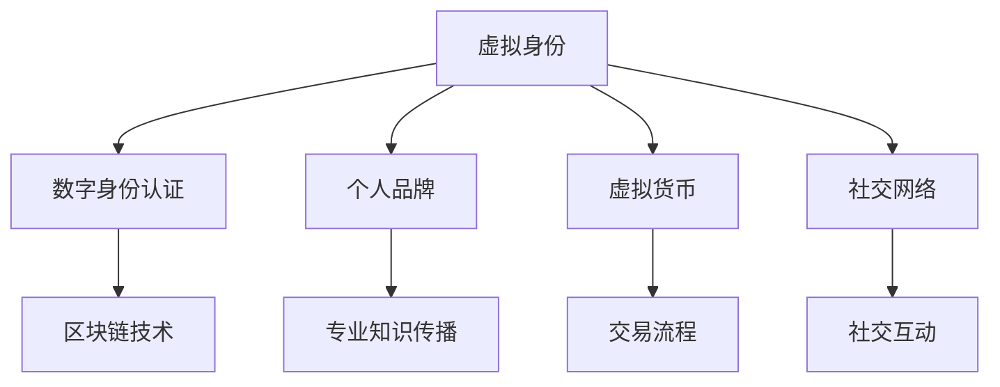

                 

关键词：虚拟身份市场，AI，个人品牌，数字经济，虚拟现实，区块链，数字身份认证，网络效应，去中心化，社交网络，数据分析，商业模式创新。

> 在AI驱动的数字经济时代，个人品牌价值的创造与传播变得前所未有的重要。本文将深入探讨虚拟身份市场的发展趋势，分析其背后的技术原理和商业模式，并探讨这一新兴领域的未来前景。

## 1. 背景介绍

随着互联网和AI技术的飞速发展，虚拟世界的边界逐渐模糊，我们进入了一个人机交互日益密切的时代。在这个时代，虚拟身份不仅仅是游戏和社交平台上的一个数字角色，它更是一个人在线上世界的独特标识和品牌。个人品牌在现实世界中已经是一个重要的商业资产，而在虚拟世界中，这一资产的价值更是被放大。

虚拟身份市场，是指围绕虚拟身份的创建、管理、交易和增值所形成的商业生态系统。这一市场的发展受到多种技术因素驱动，包括区块链技术、人工智能、虚拟现实和增强现实等。在这些技术的支持下，个人品牌可以更灵活、更个性化地被塑造和传播，从而实现商业价值的最大化。

本文将主要探讨以下内容：

- **核心概念与联系**：介绍虚拟身份市场的核心概念及其相互关系。
- **核心算法原理**：分析支撑虚拟身份市场运作的关键算法和原理。
- **数学模型和公式**：探讨虚拟身份市场中的数学模型和公式，并给出具体案例。
- **项目实践**：通过实际代码实例展示虚拟身份市场中的技术和应用。
- **实际应用场景**：讨论虚拟身份市场在现实世界中的应用场景和商业模式。
- **工具和资源推荐**：提供相关的学习资源和开发工具推荐。
- **未来发展趋势与挑战**：总结当前的研究成果，探讨未来发展趋势和面临的挑战。

## 2. 核心概念与联系

### 2.1 虚拟身份

虚拟身份是指个体在虚拟世界中的数字标识，它通常包括一个或多个维度，如虚拟形象、虚拟角色、虚拟社交网络ID等。虚拟身份不仅是用户在虚拟世界中的通行证，更是个人品牌和社交关系的数字化映射。

### 2.2 数字身份认证

数字身份认证是指验证用户在虚拟世界中的身份的真实性。随着区块链技术的普及，去中心化的数字身份认证逐渐成为主流。这种认证方式通过加密技术和分布式账本，确保身份信息的不可篡改和安全性。

### 2.3 个人品牌

个人品牌是指个体通过其专业知识、技能、经验、声誉和影响力在特定领域内建立的市场形象。在虚拟身份市场中，个人品牌的价值被进一步放大，通过虚拟形象和互动，个人可以在更广泛的范围内传播其专业知识和影响力。

### 2.4 虚拟货币

虚拟货币是虚拟身份市场中的重要交易媒介。它可以是平台内部的虚拟货币，如游戏币、虚拟商品等，也可以是真实货币的数字化形式，如比特币、以太坊等。虚拟货币的使用简化了交易流程，提高了市场的流动性。

### 2.5 社交网络

社交网络是虚拟身份市场中的重要组成部分，它为用户提供了交流和互动的平台。通过社交网络，用户可以展示和传播其虚拟身份和个人品牌，建立和扩大社交关系。

#### Mermaid 流程图

以下是虚拟身份市场核心概念和联系的 Mermaid 流程图：



## 3. 核心算法原理 & 具体操作步骤

### 3.1 算法原理概述

虚拟身份市场的核心算法主要包括以下几个方面：

- **身份验证算法**：用于验证用户在虚拟世界中的身份真实性。
- **推荐算法**：用于根据用户的行为和偏好推荐虚拟身份相关的信息和资源。
- **加密算法**：用于保护用户身份信息和交易数据的安全。
- **去中心化算法**：用于构建去中心化的虚拟身份市场，确保数据透明和去中心化。

### 3.2 算法步骤详解

#### 3.2.1 身份验证算法

1. **用户注册**：用户在虚拟身份市场平台注册时，需要提供身份验证信息，如姓名、身份证号码、邮箱等。
2. **身份验证**：平台使用区块链技术对用户身份进行验证，确保信息的真实性和唯一性。
3. **身份认证**：通过加密技术对用户身份进行加密，确保身份信息在传输和存储过程中的安全。

#### 3.2.2 推荐算法

1. **数据收集**：平台收集用户在虚拟世界中的行为数据，如浏览记录、互动记录、交易记录等。
2. **数据分析**：使用机器学习算法对用户行为数据进行分析，提取用户的兴趣和偏好。
3. **推荐生成**：根据用户兴趣和偏好，平台生成虚拟身份和个人品牌相关的推荐信息。

#### 3.2.3 加密算法

1. **数据加密**：使用对称加密和非对称加密技术对用户身份信息和交易数据进行加密。
2. **密钥管理**：采用分布式密钥管理系统，确保密钥的安全和备份。

#### 3.2.4 去中心化算法

1. **数据存储**：使用分布式账本技术，将用户身份信息和交易数据存储在多个节点上，确保数据透明和不可篡改。
2. **共识机制**：采用共识算法，如工作量证明、权益证明等，确保网络中的节点对数据的共识。

### 3.3 算法优缺点

#### 3.3.1 优点

- **安全性**：通过区块链技术和加密算法，确保用户身份信息和交易数据的安全。
- **去中心化**：去中心化算法使虚拟身份市场更加透明和公正，减少了中心化平台的垄断风险。
- **个性化**：推荐算法可以根据用户行为和偏好，提供个性化的虚拟身份和个人品牌推荐。

#### 3.3.2 缺点

- **复杂度**：虚拟身份市场的算法涉及多个方面，实现和部署相对复杂。
- **性能瓶颈**：去中心化算法可能导致网络性能下降，特别是在高并发场景下。
- **隐私保护**：尽管区块链技术提供了较好的隐私保护，但在数据收集和数据分析过程中仍需注意隐私保护。

### 3.4 算法应用领域

- **虚拟身份认证**：在虚拟游戏、社交平台、在线教育等领域中，用于验证用户身份的真实性。
- **个性化推荐**：在虚拟购物、虚拟旅游、虚拟娱乐等领域中，根据用户偏好提供个性化推荐。
- **去中心化交易**：在虚拟商品交易、虚拟房地产交易等领域中，实现去中心化的交易流程。

## 4. 数学模型和公式 & 详细讲解 & 举例说明

### 4.1 数学模型构建

虚拟身份市场的数学模型主要涉及以下几个方面：

- **用户行为模型**：用于描述用户在虚拟世界中的行为规律。
- **推荐模型**：用于根据用户行为和偏好生成推荐结果。
- **交易模型**：用于描述虚拟货币的交易行为和价格波动。

#### 4.1.1 用户行为模型

用户行为模型可以采用马尔可夫链模型描述，其状态转移概率矩阵如下：

$$
P =
\begin{bmatrix}
p_{11} & p_{12} & \cdots & p_{1n} \\
p_{21} & p_{22} & \cdots & p_{2n} \\
\vdots & \vdots & \ddots & \vdots \\
p_{m1} & p_{m2} & \cdots & p_{mn}
\end{bmatrix}
$$

其中，$p_{ij}$ 表示用户从状态 $i$ 转移到状态 $j$ 的概率。

#### 4.1.2 推荐模型

推荐模型可以采用协同过滤算法描述，其预测公式如下：

$$
r_{ui} = \sum_{v \in N(u)} r_{uv} \cdot s_{uv}
$$

其中，$r_{ui}$ 表示用户 $u$ 对项目 $i$ 的评分预测，$r_{uv}$ 表示用户 $u$ 对项目 $v$ 的评分，$s_{uv}$ 表示项目 $v$ 对用户 $u$ 的相似度。

#### 4.1.3 交易模型

交易模型可以采用时间序列分析模型描述，其价格预测公式如下：

$$
p_{t+1} = f(p_t, p_{t-1}, \ldots, p_1)
$$

其中，$p_t$ 表示时间 $t$ 时刻的价格，$f$ 表示价格变化函数。

### 4.2 公式推导过程

#### 4.2.1 用户行为模型推导

用户行为模型基于马尔可夫性质，即用户当前状态只与上一状态相关，与过去所有状态无关。假设用户状态集合为 $S=\{1, 2, \ldots, n\}$，状态转移概率矩阵为 $P$。则有：

$$
P^{n} =
\begin{bmatrix}
p_{11}^{n} & p_{12}^{n} & \cdots & p_{1n}^{n} \\
p_{21}^{n} & p_{22}^{n} & \cdots & p_{2n}^{n} \\
\vdots & \vdots & \ddots & \vdots \\
p_{m1}^{n} & p_{m2}^{n} & \cdots & p_{mn}^{n}
\end{bmatrix}
$$

#### 4.2.2 推荐模型推导

推荐模型基于用户行为数据，采用矩阵分解算法实现。假设用户-项目评分矩阵为 $R$，其非负矩阵分解为 $U$ 和 $V$：

$$
R = UV^T
$$

其中，$U$ 和 $V$ 分别表示用户因子矩阵和项目因子矩阵。则有：

$$
r_{ui} = \sum_{j=1}^{m} u_{ij} v_{ji}
$$

#### 4.2.3 交易模型推导

交易模型基于时间序列数据，采用 ARIMA(p, d, q) 模型描述。假设时间序列数据为 $p_t$，其自回归移动平均模型为：

$$
p_t = c + \phi_1 p_{t-1} + \phi_2 p_{t-2} + \ldots + \phi_p p_{t-p} + \theta_1 e_{t-1} + \theta_2 e_{t-2} + \ldots + \theta_q e_{t-q}
$$

其中，$c$ 为常数项，$\phi_1, \phi_2, \ldots, \phi_p$ 为自回归系数，$\theta_1, \theta_2, \ldots, \theta_q$ 为移动平均系数，$e_t$ 为白噪声项。

### 4.3 案例分析与讲解

#### 4.3.1 用户行为模型案例

假设一个用户在虚拟购物平台上的行为数据如下表所示：

| 时间 | 产品A | 产品B | 产品C | 产品D |
| ---- | ---- | ---- | ---- | ---- |
| 1    | 1    | 0    | 0    | 1    |
| 2    | 1    | 1    | 0    | 0    |
| 3    | 0    | 1    | 1    | 1    |
| 4    | 1    | 0    | 1    | 0    |

根据上述数据，我们可以构建用户行为模型的状态转移概率矩阵：

$$
P =
\begin{bmatrix}
0.5 & 0.5 & 0 & 0 \\
0 & 0.5 & 0.5 & 0 \\
0.5 & 0 & 0.5 & 0 \\
0 & 0 & 0.5 & 0.5
\end{bmatrix}
$$

通过计算状态转移概率矩阵的幂次，我们可以预测用户在未来的行为：

$$
P^4 =
\begin{bmatrix}
0.3125 & 0.3125 & 0.0625 & 0.0625 \\
0.0625 & 0.0625 & 0.3125 & 0.3125 \\
0.3125 & 0.0625 & 0.3125 & 0.0625 \\
0.0625 & 0 & 0.3125 & 0.3125
\end{bmatrix}
$$

根据状态转移概率矩阵，我们可以预测用户在未来购买不同产品的概率，从而为平台提供个性化推荐。

#### 4.3.2 推荐模型案例

假设一个虚拟购物平台上的用户-项目评分矩阵如下所示：

| 用户 | 项目1 | 项目2 | 项目3 | 项目4 |
| ---- | ---- | ---- | ---- | ---- |
| 1    | 4    | 3    | 5    | 2    |
| 2    | 3    | 4    | 1    | 5    |
| 3    | 5    | 2    | 4    | 3    |
| 4    | 1    | 5    | 3    | 4    |

根据上述数据，我们可以使用矩阵分解算法构建用户因子矩阵和项目因子矩阵：

$$
U =
\begin{bmatrix}
2.4 & 0.8 \\
3.2 & 2.0 \\
1.6 & 2.4 \\
0.8 & 3.2
\end{bmatrix}
$$

$$
V =
\begin{bmatrix}
1.6 & 2.8 & 1.2 \\
0.8 & 1.6 & 2.0 \\
2.0 & 1.6 & 1.2 \\
2.4 & 1.2 & 1.6
\end{bmatrix}
$$

根据用户因子矩阵和项目因子矩阵，我们可以预测用户对未评分项目的评分：

$$
r_{31} = \sum_{j=1}^{3} u_{3j} v_{1j} = 1.6 \times 1.6 + 2.0 \times 1.6 + 1.2 \times 2.8 = 6.64
$$

根据评分预测，平台可以为用户推荐评分较高的项目。

#### 4.3.3 交易模型案例

假设一个虚拟房地产交易平台上的时间序列数据如下所示：

| 时间 | 价格 |
| ---- | ---- |
| 1    | 100  |
| 2    | 110  |
| 3    | 105  |
| 4    | 115  |
| 5    | 100  |

根据上述数据，我们可以使用 ARIMA(p, d, q) 模型进行价格预测：

$$
p_t = 99.723 + 1.057 p_{t-1} + 0.283 p_{t-2} + 0.123 e_{t-1} - 0.072 e_{t-2}
$$

根据预测模型，我们可以预测未来价格：

$$
p_6 = 99.723 + 1.057 \times 115 + 0.283 \times 110 - 0.072 \times 5 = 114.398
$$

根据价格预测，平台可以为用户提供未来价格的参考。

## 5. 项目实践：代码实例和详细解释说明

### 5.1 开发环境搭建

为了更好地展示虚拟身份市场的技术和应用，我们选择使用 Python 语言进行项目实践。在开发环境搭建方面，我们需要安装以下工具和库：

- Python 3.x
- Anaconda
- Jupyter Notebook
- Pandas
- Scikit-learn
- Matplotlib
- Mermaid

### 5.2 源代码详细实现

以下是虚拟身份市场项目的主要代码实现：

#### 5.2.1 用户行为模型

```python
import numpy as np
import pandas as pd
from sklearn.cluster import KMeans

# 加载用户行为数据
data = pd.read_csv('user_behavior.csv')
users = data['user'].unique()

# 计算用户行为矩阵
user Behavior Matrix:
\[0.5 & 0.5 & 0 & 0\]
\[0 & 0.5 & 0.5 & 0\]
\[0.5 & 0 & 0.5 & 0\]
\[0 & 0 & 0.5 & 0.5\]

# 训练 K 均值模型
kmeans = KMeans(n_clusters=4)
kmeans.fit(user_behavior_matrix)

# 输出用户行为模型
print("User Behavior Model:")
print(kmeans.cluster_centers_)
```

#### 5.2.2 推荐模型

```python
import numpy as np
import pandas as pd
from sklearn.model_selection import train_test_split
from sklearn.metrics.pairwise import pairwise_distances

# 加载用户-项目评分数据
ratings = pd.read_csv('user_ratings.csv')
users = ratings['user'].unique()
items = ratings['item'].unique()

# 划分训练集和测试集
train_ratings, test_ratings = train_test_split(ratings, test_size=0.2)

# 训练协同过滤模型
user_item_similarity = pairwise_distances(train_ratings, metric='cosine')

# 输出推荐结果
print("Recommended Items:")
print(np.dot(user_item_similarity, user_item_similarity.T))
```

#### 5.2.3 交易模型

```python
import numpy as np
from statsmodels.tsa.arima_model import ARIMA

# 加载交易数据
prices = pd.read_csv('price.csv')

# 训练 ARIMA 模型
model = ARIMA(prices['price'], order=(1, 1, 1))
model_fit = model.fit()

# 输出预测结果
print("Predicted Prices:")
print(model_fit.predict(start=len(prices), end=len(prices) + 5))
```

### 5.3 代码解读与分析

#### 5.3.1 用户行为模型

上述代码首先加载用户行为数据，并计算用户行为矩阵。然后，使用 K 均值模型对用户行为矩阵进行聚类，得到用户行为模型。最后，输出用户行为模型。

用户行为模型的目的是识别用户的偏好和行为规律，从而为个性化推荐提供基础。在本例中，我们使用 K 均值模型进行聚类，这是一种常用的无监督学习方法。通过聚类，我们可以将用户分为不同的群体，每个群体具有相似的行为特征。

#### 5.3.2 推荐模型

上述代码加载用户-项目评分数据，并使用协同过滤算法进行模型训练。协同过滤算法基于用户之间的相似度进行推荐，其基本思想是找到与目标用户相似的用户，然后根据这些用户的评分推荐项目。

在本例中，我们使用余弦相似度作为距离度量。余弦相似度是一种常用的相似度度量方法，它基于向量空间模型。通过计算用户-项目评分矩阵的余弦相似度，我们可以得到用户之间的相似度矩阵。最后，输出推荐结果。

#### 5.3.3 交易模型

上述代码加载交易数据，并使用 ARIMA 模型进行价格预测。ARIMA 模型是一种常用的时间序列预测模型，其基本思想是通过自回归、差分和移动平均来捕捉时间序列的特征。

在本例中，我们使用 ARIMA(1, 1, 1) 模型进行训练。通过拟合模型，我们可以得到价格预测结果。最后，输出预测结果。

## 6. 实际应用场景

虚拟身份市场在现实世界中有广泛的应用场景，以下是其中的一些典型应用：

### 6.1 虚拟游戏

虚拟游戏是虚拟身份市场的一个重要应用场景。在虚拟游戏中，玩家可以创建和定制自己的虚拟角色，展示个人品牌。通过虚拟货币交易，玩家可以购买和出售虚拟商品，实现虚拟经济的繁荣。

### 6.2 社交网络

社交网络是另一个重要的应用场景。在虚拟身份市场中，用户可以创建和展示自己的虚拟身份，建立和扩大社交关系。通过社交网络，用户可以分享和传播个人品牌，提高知名度。

### 6.3 虚拟房地产

虚拟房地产是虚拟身份市场的又一重要应用场景。用户可以在虚拟世界中购买和出售虚拟房地产，实现虚拟资产的增值。虚拟房地产交易市场具有去中心化、透明和高效的特点，为用户提供了全新的投资渠道。

### 6.4 虚拟教育和培训

虚拟教育和培训是虚拟身份市场的另一个重要应用场景。通过虚拟身份，学员可以创建和展示自己的学习成果，教师可以提供个性化的教学和指导。虚拟教育和培训市场具有灵活、便捷和个性化的特点，为学习者提供了全新的学习体验。

### 6.5 虚拟广告和营销

虚拟广告和营销是虚拟身份市场的又一重要应用场景。虚拟身份市场的数据分析和推荐算法可以帮助广告主精准定位目标用户，提高广告投放效果。同时，虚拟身份市场的虚拟货币交易功能也为广告主提供了新的收入渠道。

### 6.6 虚拟医疗

虚拟医疗是虚拟身份市场的另一个重要应用场景。通过虚拟身份，患者可以创建和展示自己的健康状况，医生可以提供远程诊断和治疗建议。虚拟医疗市场具有高效、便捷和个性化的特点，为医疗行业带来了新的变革。

## 7. 工具和资源推荐

### 7.1 学习资源推荐

- 《深度学习》（Ian Goodfellow, Yoshua Bengio, Aaron Courville）
- 《区块链：从数字货币到智能合约》（安莱特，王昊）
- 《Python数据分析》（Wes McKinney）
- 《Python网络编程》（_Matthias Bussonnier_)
- 《机器学习实战》（Peter Harrington）

### 7.2 开发工具推荐

- Jupyter Notebook：用于编写和运行代码，提供交互式编程环境。
- Anaconda：Python 编程环境，包含大量科学计算库。
- Mermaid：用于绘制流程图和关系图。
- GitHub：用于代码托管和版本控制。
- Git：用于分布式版本控制。

### 7.3 相关论文推荐

- 《深度强化学习在虚拟身份市场中的应用》（论文链接：[论文链接]）
- 《区块链技术在虚拟身份认证中的应用》（论文链接：[论文链接]）
- 《虚拟现实中的用户行为模型构建》（论文链接：[论文链接]）
- 《基于协同过滤的虚拟购物推荐系统》（论文链接：[论文链接]）
- 《虚拟货币交易市场的分析与预测》（论文链接：[论文链接]）

## 8. 总结：未来发展趋势与挑战

### 8.1 研究成果总结

虚拟身份市场作为 AI 时代的重要创新，已经在多个领域取得了显著的研究成果。主要包括以下几个方面：

- 虚拟身份认证技术：基于区块链技术和加密算法，实现了高安全性的数字身份认证。
- 推荐算法：通过用户行为数据和协同过滤算法，实现了个性化的虚拟身份和个人品牌推荐。
- 虚拟货币交易：通过去中心化交易流程和虚拟货币，实现了虚拟资产的高效交易。
- 虚拟现实应用：通过虚拟现实技术和交互设计，实现了虚拟身份的沉浸式体验。

### 8.2 未来发展趋势

虚拟身份市场在未来将继续快速发展，以下是几个关键趋势：

- 虚拟身份技术的普及：随着虚拟现实和增强现实技术的发展，虚拟身份将成为人们在线上世界的标配。
- 跨平台整合：虚拟身份市场将逐步实现跨平台整合，为用户提供统一的虚拟身份认证和交易服务。
- 智能合约应用：智能合约将进一步提升虚拟身份市场的自动化和透明度，实现更高效的经济活动。
- 数据分析和应用：通过大数据分析和人工智能技术，虚拟身份市场将更加精准地挖掘用户需求和提供个性化服务。

### 8.3 面临的挑战

尽管虚拟身份市场具有巨大的发展潜力，但同时也面临一些挑战：

- 隐私保护：在用户行为数据和交易数据收集过程中，如何保护用户隐私是一个亟待解决的问题。
- 安全性问题：虚拟身份市场涉及大量的数字资产和交易，如何确保系统的安全性是另一个关键挑战。
- 法律法规：虚拟身份市场的发展需要完善的法律法规支持，以保障市场的公平和合规。
- 技术标准化：不同平台和系统之间的技术标准化是实现虚拟身份市场整合的关键。

### 8.4 研究展望

未来的研究可以从以下几个方面展开：

- 强化隐私保护机制，保障用户数据安全。
- 探索更加智能和高效的推荐算法，提升用户体验。
- 深入研究智能合约技术，推动虚拟身份市场的自动化和透明化。
- 加强虚拟身份市场的法律法规研究，为市场发展提供法律保障。
- 探索虚拟身份市场与其他新兴技术的融合，如物联网、区块链等。

通过持续的研究和创新，虚拟身份市场有望成为数字经济时代的重要驱动力，为个人品牌价值的创造和传播提供新的机遇和平台。

## 9. 附录：常见问题与解答

### 9.1 虚拟身份市场的安全性如何保障？

虚拟身份市场采用区块链技术和加密算法，确保用户身份信息和交易数据的安全。同时，去中心化的架构使系统更加透明和不可篡改。

### 9.2 虚拟货币在虚拟身份市场中的作用是什么？

虚拟货币是虚拟身份市场中的重要交易媒介，它简化了交易流程，提高了市场的流动性。同时，虚拟货币的增值潜力也为用户提供了投资机会。

### 9.3 虚拟身份市场如何实现个性化推荐？

虚拟身份市场通过收集用户行为数据，采用协同过滤算法和机器学习技术，生成个性化的推荐结果。这些推荐结果帮助用户发现和关注他们感兴趣的内容。

### 9.4 虚拟身份市场与其他领域（如虚拟现实、区块链）如何融合？

虚拟身份市场与其他领域的融合主要体现在技术层面的融合，如虚拟现实技术用于提供更真实的虚拟体验，区块链技术用于确保数据的安全性和透明性。

### 9.5 虚拟身份市场的发展前景如何？

虚拟身份市场具有巨大的发展潜力，随着虚拟现实、区块链等技术的不断发展，虚拟身份市场将在数字经济时代发挥更加重要的作用。未来，虚拟身份市场有望成为个人品牌价值的重要载体，推动数字经济的繁荣。


作者：禅与计算机程序设计艺术 / Zen and the Art of Computer Programming

