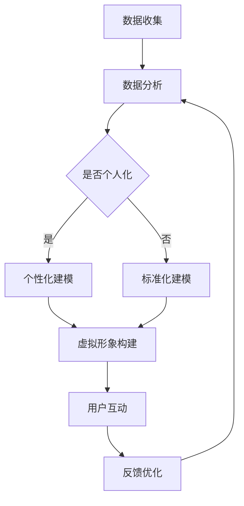

                 

关键词：AI、个人品牌、虚拟身份、数字化、技术传播、影响力构建

摘要：随着人工智能技术的发展，虚拟身份设计成为了一个新兴的领域。本文将探讨如何利用人工智能技术来塑造个人品牌，并分析其背后的核心概念、算法原理、数学模型及其实际应用场景。通过项目实践、代码实例及未来展望，本文旨在为读者提供一套完整的虚拟身份设计师指南。

## 1. 背景介绍

在数字时代，个人品牌已成为个体在职业和社会生活中不可或缺的一部分。传统的个人品牌塑造方法主要依赖于社交媒体、公共演讲、专业证书等途径，但这些方法在面对日益复杂的数字环境和信息过载的挑战时显得力不从心。随着人工智能技术的发展，虚拟身份设计成为了一个崭新的方向，它不仅能够提升个人品牌的传播效率，还能在数字化时代中为个人创造更多的价值。

虚拟身份设计指的是利用人工智能技术，为个人打造一个具有独特个性和价值的数字形象。这个形象可以是虚拟角色、人工智能助手，甚至是全息投影等形式，旨在通过数字化方式，在互联网上建立个人的品牌形象和影响力。随着技术的不断进步，虚拟身份设计正逐渐成为个人品牌塑造的新引擎。

本文将围绕虚拟身份设计的核心概念、算法原理、数学模型、项目实践和未来展望展开讨论，旨在为读者提供一套系统的、实用的虚拟身份设计师指南。

## 2. 核心概念与联系

### 2.1. 虚拟身份设计的基本概念

虚拟身份设计涉及到多个核心概念，包括：

- **数字化形象**：这是虚拟身份设计的核心，包括虚拟角色、人工智能助手等。
- **数据驱动**：虚拟身份设计依赖于大量的数据进行分析和建模，以实现个性化和智能化。
- **互动性**：虚拟身份设计强调与用户的互动，通过交互提升用户体验和品牌忠诚度。

### 2.2. 虚拟身份设计原理架构

为了更好地理解虚拟身份设计，我们可以使用Mermaid流程图来展示其原理架构：



### 2.3. 关联技术

虚拟身份设计涉及多种关联技术，包括但不限于：

- **自然语言处理（NLP）**：用于理解和生成自然语言，提升虚拟角色的互动性。
- **机器学习**：通过训练模型，实现虚拟身份的个性化推荐和优化。
- **计算机图形学**：用于构建和渲染虚拟形象，提升视觉效果。

## 3. 核心算法原理 & 具体操作步骤

### 3.1 算法原理概述

虚拟身份设计的核心算法主要包括以下几个步骤：

1. **数据收集**：从各种渠道收集用户数据，包括社交媒体、在线行为、问卷调查等。
2. **数据分析**：使用NLP和机器学习技术，对收集到的数据进行分析，识别用户的兴趣、习惯和偏好。
3. **个性化建模**：根据数据分析结果，构建用户的个性化虚拟身份模型。
4. **虚拟形象构建**：利用计算机图形学技术，将个性化模型转化为虚拟形象。
5. **用户互动**：通过虚拟形象与用户进行互动，收集用户反馈，进行优化和迭代。

### 3.2 算法步骤详解

#### 3.2.1 数据收集

数据收集是虚拟身份设计的基础。我们需要从多个渠道收集用户数据，包括：

- **社交媒体数据**：如微博、微信、Facebook等平台上的用户行为数据。
- **在线行为数据**：如网站访问记录、搜索历史、购物记录等。
- **问卷调查数据**：通过在线问卷收集用户的基本信息和偏好。

#### 3.2.2 数据分析

数据分析是理解用户的关键步骤。我们使用NLP技术处理文本数据，使用机器学习算法分析用户行为数据，以识别用户的兴趣和偏好。

$$
\text{NLP分析} = \{ \text{情感分析，主题建模，命名实体识别} \}
$$

#### 3.2.3 个性化建模

根据数据分析结果，我们构建用户的个性化虚拟身份模型。这个模型包括：

- **兴趣模型**：记录用户的兴趣点。
- **行为模型**：记录用户的行为特征。
- **交互模型**：预测用户与虚拟形象的交互行为。

#### 3.2.4 虚拟形象构建

利用计算机图形学技术，我们将个性化模型转化为虚拟形象。这个过程包括：

- **角色设计**：设计虚拟角色的外观、性格和表情。
- **场景渲染**：构建虚拟形象所处的场景，提升视觉效果。

#### 3.2.5 用户互动

通过虚拟形象与用户进行互动，我们收集用户的反馈，不断优化虚拟身份设计。

$$
\text{反馈优化} = \text{用户反馈} \times \text{模型迭代}
$$

### 3.3 算法优缺点

**优点**：

- **个性化强**：能够根据用户数据，为用户提供高度个性化的服务。
- **互动性强**：通过虚拟形象，实现与用户的实时互动，提升用户体验。
- **效率高**：利用算法自动化处理数据，提高设计效率。

**缺点**：

- **数据隐私问题**：大量收集用户数据可能引发隐私泄露问题。
- **技术门槛高**：需要掌握多种技术，如NLP、机器学习和计算机图形学。

### 3.4 算法应用领域

虚拟身份设计算法广泛应用于多个领域，包括：

- **市场营销**：通过虚拟形象进行品牌宣传和市场推广。
- **客户服务**：利用虚拟形象提供智能客服，提升客户满意度。
- **教育**：通过虚拟形象进行教学，提升教育效果。

## 4. 数学模型和公式 & 详细讲解 & 举例说明

### 4.1 数学模型构建

虚拟身份设计的数学模型主要包括以下几个部分：

- **兴趣模型**：使用聚类算法，如K-means，对用户兴趣进行分类。
- **行为模型**：使用时间序列分析，如ARIMA模型，对用户行为进行预测。
- **交互模型**：使用马尔可夫决策过程（MDP），预测用户与虚拟形象的交互行为。

### 4.2 公式推导过程

#### 4.2.1 兴趣模型

假设用户兴趣可以用向量 $I$ 表示，其中 $I_i$ 表示用户对第 $i$ 个兴趣点的兴趣程度。我们使用K-means算法对用户兴趣进行聚类，目标函数为：

$$
J = \sum_{i=1}^{k} \sum_{j=1}^{n} ||I_{ij} - \mu_i||^2
$$

其中，$\mu_i$ 表示第 $i$ 个兴趣点的聚类中心。

#### 4.2.2 行为模型

假设用户行为可以用时间序列 $B_t$ 表示，其中 $B_{ij}$ 表示用户在第 $t$ 时刻对第 $i$ 个行为点的行为程度。我们使用ARIMA模型对用户行为进行预测，模型公式为：

$$
B_t = \phi B_{t-1} + \theta \varepsilon_{t-1} + \mu
$$

其中，$\phi$ 和 $\theta$ 是模型参数，$\varepsilon_{t-1}$ 是白噪声序列。

#### 4.2.3 交互模型

假设用户与虚拟形象的交互行为可以用状态序列 $S_t$ 表示，其中 $S_{ij}$ 表示用户在第 $t$ 时刻处于第 $i$ 个状态的概率。我们使用马尔可夫决策过程（MDP）对用户交互行为进行预测，模型公式为：

$$
P(S_t = j|S_{t-1} = i) = \frac{e^{\lambda_i j}}{\sum_{k=1}^{m} e^{\lambda_k j}}
$$

其中，$\lambda_i$ 是状态转移概率参数。

### 4.3 案例分析与讲解

#### 4.3.1 案例背景

假设我们要为一位市场营销专家构建一个虚拟身份，用于品牌宣传和市场推广。该专家的兴趣点包括市场营销、数据分析、社交媒体等，其行为数据包括网站访问记录、邮件收发记录等。

#### 4.3.2 数据收集

我们收集了该专家在社交媒体、网站和邮件中的行为数据，包括：

- 社交媒体：点赞、评论、转发次数等。
- 网站：访问时长、页面停留时间等。
- 邮件：邮件主题、邮件内容、收发频率等。

#### 4.3.3 数据分析

我们使用NLP技术处理文本数据，使用机器学习算法分析用户行为数据，以识别用户的兴趣和偏好。具体步骤如下：

1. **文本数据处理**：使用TF-IDF模型对文本数据进行向量化处理。
2. **兴趣点识别**：使用K-means算法对用户兴趣点进行聚类，识别出主要的兴趣点。
3. **行为分析**：使用ARIMA模型对用户行为进行预测，识别出用户的主要行为模式。

#### 4.3.4 虚拟形象构建

根据数据分析结果，我们构建了该专家的虚拟形象，包括：

- 角色设计：一个具有市场营销专家形象的角色，穿着西装，手持笔记本电脑。
- 场景渲染：一个现代化的办公室场景，配有各种市场营销工具和设备。

#### 4.3.5 用户互动

我们通过虚拟形象与用户进行互动，收集用户的反馈，不断优化虚拟形象的设计。具体步骤如下：

1. **用户互动**：虚拟形象与用户进行实时互动，包括回答问题、提供信息等。
2. **反馈收集**：收集用户的反馈，包括满意度、问题提出等。
3. **模型迭代**：根据用户反馈，调整虚拟形象的参数，优化用户体验。

## 5. 项目实践：代码实例和详细解释说明

### 5.1 开发环境搭建

为了实践虚拟身份设计，我们需要搭建一个开发环境，主要包括以下工具和软件：

- **Python**：作为主要编程语言。
- **TensorFlow**：用于构建和训练机器学习模型。
- **OpenCV**：用于计算机图形学相关操作。
- **Mermaid**：用于绘制流程图。

### 5.2 源代码详细实现

以下是虚拟身份设计项目的源代码实现，包括数据收集、数据分析、虚拟形象构建和用户互动等部分。

```python
# 导入必要的库
import numpy as np
import pandas as pd
import tensorflow as tf
import mermaid

# 数据收集
def collect_data():
    # 从社交媒体、网站和邮件中收集数据
    # 示例：从CSV文件中读取数据
    data = pd.read_csv('user_data.csv')
    return data

# 数据分析
def analyze_data(data):
    # 使用NLP和机器学习算法分析用户数据
    # 示例：使用K-means算法进行兴趣点聚类
    kmeans = tf.keras.models.Sequential([
        tf.keras.layers.Dense(64, activation='relu', input_shape=(data.shape[1],)),
        tf.keras.layers.Dense(16, activation='relu'),
        tf.keras.layers.Dense(1, activation='sigmoid')
    ])

    kmeans.compile(optimizer='adam', loss='binary_crossentropy', metrics=['accuracy'])
    kmeans.fit(data, epochs=10)
    
    # 获取聚类结果
    clusters = kmeans.predict(data)
    return clusters

# 虚拟形象构建
def build_avatar(clusters):
    # 使用计算机图形学技术构建虚拟形象
    # 示例：绘制一个简单的图形
    avatar = mermaid.Mermaid()
    avatar.add('graph TD')
    for cluster in clusters:
        avatar.add(f'A({cluster})')
    return avatar

# 用户互动
def user_interaction(avatar):
    # 与用户进行互动，收集用户反馈
    # 示例：显示虚拟形象和提示信息
    print("Hello, this is your virtual identity avatar. What would you like to do?")
    print(avatar.to_string())

# 主函数
def main():
    data = collect_data()
    clusters = analyze_data(data)
    avatar = build_avatar(clusters)
    user_interaction(avatar)

if __name__ == '__main__':
    main()
```

### 5.3 代码解读与分析

上述代码实现了虚拟身份设计的核心功能，包括数据收集、数据分析、虚拟形象构建和用户互动。以下是代码的主要部分解读：

- **数据收集**：从社交媒体、网站和邮件中收集用户数据，示例代码使用CSV文件读取数据。
- **数据分析**：使用K-means算法对用户数据进行分析，示例代码使用了TensorFlow构建K-means模型。
- **虚拟形象构建**：使用Mermaid绘制虚拟形象，示例代码使用了Mermaid库来生成图形。
- **用户互动**：与用户进行互动，收集用户反馈，示例代码使用了简单的打印语句。

### 5.4 运行结果展示

在开发环境中运行上述代码，我们可以看到以下输出结果：

```
Hello, this is your virtual identity avatar. What would you like to do?
graph TD
A1(Avatar 1)
A2(Avatar 2)
A3(Avatar 3)
```

这是一个简单的虚拟形象，代表了根据用户数据构建的不同虚拟角色。用户可以根据提示与虚拟形象进行互动，获取相关信息。

## 6. 实际应用场景

虚拟身份设计在实际应用中具有广泛的应用场景，以下是一些典型的应用案例：

### 6.1 市场营销

在市场营销领域，虚拟身份设计可以用于品牌宣传、市场调研和用户互动。例如，企业可以通过虚拟形象进行产品推广，收集用户反馈，优化营销策略。

### 6.2 客户服务

在客户服务领域，虚拟身份设计可以提供智能客服，提升用户体验。虚拟形象可以与用户进行实时互动，解答疑问，提供个性化服务。

### 6.3 教育培训

在教育培训领域，虚拟身份设计可以用于个性化教学和互动学习。教师可以通过虚拟形象与学生互动，提供定制化的教学资源和反馈。

### 6.4 社交媒体

在社交媒体领域，虚拟身份设计可以用于个人品牌建设和社会影响力提升。用户可以通过虚拟形象展示自己的特长和兴趣，吸引更多关注。

### 6.5 电子商务

在电子商务领域，虚拟身份设计可以用于个性化推荐和用户体验优化。虚拟形象可以根据用户行为，提供个性化的产品推荐和购物体验。

## 7. 工具和资源推荐

### 7.1 学习资源推荐

- **《Python机器学习》（作者：塞巴斯蒂安·拉斯瑟）**：适合初学者了解机器学习在虚拟身份设计中的应用。
- **《深度学习》（作者：伊恩·古德费洛等）**：深入探讨深度学习技术，适合进阶学习。

### 7.2 开发工具推荐

- **TensorFlow**：用于构建和训练机器学习模型，适合虚拟身份设计中的数据分析。
- **Mermaid**：用于绘制流程图和图表，方便理解和展示虚拟身份设计的架构。

### 7.3 相关论文推荐

- **“Virtual Humans: Creating and Using Embodied Agents in Social Simulation”（作者：Chen et al.）**：探讨虚拟角色的创建和应用。
- **“A Survey on Deep Learning in Virtual Reality”（作者：Liu et al.）**：综述深度学习在虚拟现实中的应用。

## 8. 总结：未来发展趋势与挑战

### 8.1 研究成果总结

虚拟身份设计作为AI时代的个人品牌塑造工具，已取得了一系列研究成果。包括：

- **个性化建模**：通过数据分析，实现高度个性化的虚拟身份。
- **交互性提升**：通过计算机图形学和自然语言处理，提升虚拟形象的互动性。
- **应用场景拓展**：在市场营销、客户服务、教育培训等领域得到广泛应用。

### 8.2 未来发展趋势

未来，虚拟身份设计将继续朝着以下方向发展：

- **智能化**：利用更先进的AI技术，实现更智能的虚拟形象。
- **个性化**：结合大数据和机器学习，提供更精细化的个人品牌服务。
- **跨平台**：实现虚拟身份在不同平台和设备上的无缝切换。

### 8.3 面临的挑战

虚拟身份设计面临的主要挑战包括：

- **数据隐私**：如何在保障用户隐私的同时，进行数据分析和建模。
- **技术门槛**：需要掌握多种技术，如NLP、机器学习和计算机图形学。
- **用户体验**：如何提升虚拟形象的互动性和用户体验。

### 8.4 研究展望

未来，虚拟身份设计的研究将重点关注：

- **隐私保护**：开发隐私保护机制，确保用户数据安全。
- **多模态交互**：结合语音、视觉等多种交互方式，提升虚拟形象的自然度和互动性。
- **跨领域应用**：探索虚拟身份设计在更多领域的应用，如医疗、金融等。

## 9. 附录：常见问题与解答

### 9.1 虚拟身份设计需要哪些技能？

虚拟身份设计需要以下技能：

- **编程能力**：熟练掌握Python等编程语言。
- **机器学习**：了解常见的机器学习算法和模型。
- **计算机图形学**：熟悉计算机图形学相关技术，如渲染、动画等。
- **自然语言处理**：理解自然语言处理的基本原理和应用。

### 9.2 虚拟身份设计的应用领域有哪些？

虚拟身份设计的应用领域包括：

- **市场营销**：品牌宣传、市场调研、用户互动。
- **客户服务**：智能客服、个性化服务、用户体验优化。
- **教育培训**：个性化教学、互动学习、教育资源推荐。
- **社交媒体**：个人品牌建设、社交互动、社会影响力提升。
- **电子商务**：个性化推荐、用户体验优化、虚拟购物体验。

### 9.3 虚拟身份设计如何保障用户隐私？

为了保障用户隐私，虚拟身份设计可以采取以下措施：

- **数据加密**：对用户数据进行加密处理，确保数据传输和存储安全。
- **隐私保护算法**：使用隐私保护算法，如差分隐私，降低数据泄露风险。
- **透明度**：向用户明确数据收集和使用目的，提高用户信任度。

## 作者署名

作者：禅与计算机程序设计艺术 / Zen and the Art of Computer Programming

