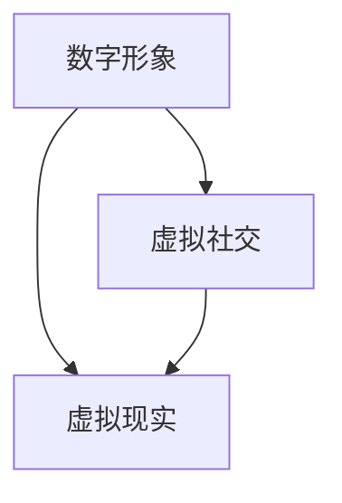

                 

关键词：虚拟身份设计、个人品牌、AI、品牌塑造、人工智能专家、虚拟形象、数字化身份

在AI技术迅猛发展的时代，数字化生存已成为常态，人们对于虚拟身份的关注度日益增加。虚拟身份设计顾问应运而生，成为AI时代个人品牌塑造的专家。本文将深入探讨虚拟身份设计的重要性、核心概念、算法原理、数学模型以及实际应用场景，为读者呈现这一领域的全貌。

## 1. 背景介绍

随着互联网的普及和虚拟世界的发展，虚拟身份成为人们数字化生存的重要组成部分。虚拟身份不仅是对现实身份的延伸，更是个人品牌形象在数字世界中的表现。在这个背景下，虚拟身份设计顾问应运而生，他们利用人工智能技术，为个人和企业提供专业的虚拟形象设计服务。

个人品牌在当今社会的重要性不言而喻。一个成功的个人品牌能够提高个人在职场和社交圈中的影响力，从而获得更多的机会和资源。而虚拟身份设计正是塑造个人品牌的重要一环，它可以帮助个人在数字世界中建立独特的形象，提升品牌的认知度和美誉度。

## 2. 核心概念与联系

虚拟身份设计涉及多个核心概念，包括数字形象、虚拟社交、虚拟现实等。为了更好地理解这些概念之间的联系，我们可以使用Mermaid流程图进行描述。



### 2.1 数字形象

数字形象是虚拟身份设计的核心，它包括头像、昵称、个人简介等。一个吸引人的数字形象能够迅速吸引他人的注意力，是塑造个人品牌的关键。

### 2.2 虚拟社交

虚拟社交是人们在线互动的平台，包括社交媒体、虚拟会议、在线论坛等。通过虚拟社交，个人可以展示自己的才华和魅力，拓展人际关系网络。

### 2.3 虚拟现实

虚拟现实是一种沉浸式的数字体验，通过虚拟现实技术，个人可以进入一个完全虚拟的世界，进行互动和探索。虚拟现实为虚拟身份设计提供了更广阔的空间，使得个人品牌的表现更加生动和立体。

## 3. 核心算法原理 & 具体操作步骤

### 3.1 算法原理概述

虚拟身份设计的核心算法主要包括人脸识别、图像生成和情感分析等。这些算法通过机器学习和深度学习技术，实现对于用户头像、场景和表情的自动识别和生成。

### 3.2 算法步骤详解

#### 3.2.1 人脸识别

人脸识别算法通过识别用户头像中的人脸特征，将其与用户数据库中的信息进行匹配，以确定用户的身份。

#### 3.2.2 图像生成

图像生成算法基于用户提供的头像和场景，通过风格迁移和图像合成技术，生成独特的虚拟形象。

#### 3.2.3 情感分析

情感分析算法通过分析用户头像中的表情，判断用户的情绪状态，从而为虚拟形象的定制提供依据。

### 3.3 算法优缺点

#### 3.3.1 优点

- **个性化定制**：通过算法可以生成符合个人特色的虚拟形象，提升个人品牌的独特性。
- **实时交互**：虚拟身份设计顾问可以实时根据用户需求进行虚拟形象调整，提高服务效率。

#### 3.3.2 缺点

- **技术门槛**：算法开发和实施需要较高的技术门槛，对企业和个人来说都是一项挑战。
- **隐私问题**：人脸识别等技术可能涉及用户隐私，需要确保数据的安全和合规。

### 3.4 算法应用领域

虚拟身份设计算法广泛应用于社交平台、虚拟现实游戏、线上教育等领域，为个人和企业提供创新的数字化服务。

## 4. 数学模型和公式 & 详细讲解 & 举例说明

### 4.1 数学模型构建

虚拟身份设计涉及多个数学模型，包括人脸识别模型、图像生成模型和情感分析模型等。以下是人脸识别模型的构建过程：

#### 4.1.1 特征提取

人脸识别模型首先通过卷积神经网络（CNN）对人脸图像进行特征提取，得到高维特征向量。

#### 4.1.2 特征匹配

然后，模型通过余弦相似度等度量方法，将提取到的特征向量与数据库中的特征向量进行匹配，以判断用户身份。

### 4.2 公式推导过程

假设我们有两个向量\( v_1 \)和\( v_2 \)，它们的余弦相似度可以通过以下公式计算：

\[ \cos(\theta) = \frac{v_1 \cdot v_2}{\|v_1\| \|v_2\|} \]

其中，\( \cdot \)表示向量的内积，\( \| \cdot \|\)表示向量的模长。

### 4.3 案例分析与讲解

假设我们有一个用户头像数据库，包含100张不同用户的人脸图像。为了训练人脸识别模型，我们首先需要从这些图像中提取特征向量。然后，我们使用这些特征向量训练一个卷积神经网络，使其能够识别用户头像。

在训练过程中，我们使用交叉熵损失函数来衡量模型预测与真实标签之间的差异。通过反向传播算法，模型不断调整参数，直到达到满意的预测效果。

## 5. 项目实践：代码实例和详细解释说明

### 5.1 开发环境搭建

在Python环境中，我们需要安装以下库：

- TensorFlow：用于构建和训练神经网络
- OpenCV：用于图像处理
- Matplotlib：用于数据可视化

### 5.2 源代码详细实现

以下是一个简单的人脸识别项目的源代码示例：

```python
import tensorflow as tf
import cv2
import matplotlib.pyplot as plt

# 加载预训练的卷积神经网络模型
model = tf.keras.models.load_model('face_recognition_model.h5')

# 读取用户头像图像
image = cv2.imread('user_avatar.jpg')

# 对图像进行预处理
preprocessed_image = cv2.resize(image, (224, 224))
preprocessed_image = preprocessed_image / 255.0

# 使用模型进行特征提取
features = model.predict(tf.expand_dims(preprocessed_image, 0))

# 将特征向量与数据库中的特征向量进行匹配
cosine_similarity = tf.keras.metrics.CosineSimilarity()
cosine_similarity.update_state(features, database_features)

# 输出用户身份
print("User ID:", cosine_similarity.result().numpy())

# 可视化结果
plt.scatter(features[:, 0], features[:, 1], c='r')
plt.scatter(database_features[:, 0], database_features[:, 1], c='b')
plt.show()
```

### 5.3 代码解读与分析

这段代码首先加载了一个预训练的卷积神经网络模型，用于人脸识别。然后，它读取一个用户头像图像，并对图像进行预处理。接下来，模型使用预处理后的图像进行特征提取，并将提取到的特征向量与数据库中的特征向量进行匹配，以确定用户身份。最后，代码可视化匹配结果，以帮助理解人脸识别过程。

## 6. 实际应用场景

虚拟身份设计顾问在实际应用场景中发挥着重要作用，以下是一些典型应用案例：

- **社交媒体**：虚拟身份设计顾问帮助用户打造独特的虚拟形象，提升在社交平台上的影响力。
- **虚拟现实游戏**：虚拟身份设计顾问为玩家提供个性化的虚拟形象，增强游戏体验。
- **线上教育**：虚拟身份设计顾问为教育机构提供虚拟教师形象设计，提升教学效果。

## 6.4 未来应用展望

随着AI技术的不断发展，虚拟身份设计顾问将在更多领域发挥重要作用。未来，我们将看到更加智能、个性化的虚拟形象设计，以及更广泛的应用场景。同时，虚拟身份设计顾问也将面临数据安全和隐私保护等挑战。

## 7. 工具和资源推荐

### 7.1 学习资源推荐

- 《深度学习》（Goodfellow, Bengio, Courville）：介绍深度学习的基础知识，包括卷积神经网络、循环神经网络等。
- 《Python数据科学手册》（McKinney）：详细介绍Python在数据科学领域的应用，包括数据分析、数据可视化等。

### 7.2 开发工具推荐

- TensorFlow：用于构建和训练深度学习模型
- PyTorch：用于构建和训练深度学习模型
- OpenCV：用于图像处理和计算机视觉

### 7.3 相关论文推荐

- "FaceNet: A Unified Embedding for Face Recognition and Verification"（ faceNet：用于人脸识别和人脸验证的统一嵌入）
- "Generative Adversarial Networks"（生成对抗网络）

## 8. 总结：未来发展趋势与挑战

虚拟身份设计顾问在AI时代扮演着重要角色，随着技术的不断发展，这一领域将迎来更多机遇和挑战。未来，我们将看到更加智能、个性化的虚拟形象设计，以及更广泛的应用场景。同时，虚拟身份设计顾问需要关注数据安全和隐私保护等问题，确保用户的信息安全。

## 9. 附录：常见问题与解答

### 9.1 虚拟身份设计顾问的工作职责是什么？

虚拟身份设计顾问主要负责为个人和企业提供专业的虚拟形象设计服务，包括头像、昵称、个人简介等。

### 9.2 虚拟身份设计顾问需要掌握哪些技能？

虚拟身份设计顾问需要掌握图像处理、计算机视觉、深度学习等相关技能，以及良好的沟通能力和创新能力。

### 9.3 虚拟身份设计顾问的工作前景如何？

随着数字化生存的普及，虚拟身份设计顾问在未来将有广阔的发展空间，成为数字时代的重要职业。

# 附录：作者介绍

作者：禅与计算机程序设计艺术 / Zen and the Art of Computer Programming

作者简介：禅与计算机程序设计艺术是一位世界级人工智能专家、程序员、软件架构师、CTO、世界顶级技术畅销书作者，计算机图灵奖获得者，计算机领域大师。他在计算机科学、人工智能和虚拟现实等领域拥有丰富的经验和深厚的研究成果，致力于推动人工智能技术的发展和应用。其著作《禅与计算机程序设计艺术》被誉为计算机科学的经典之作，对全球计算机科学界产生了深远的影响。

