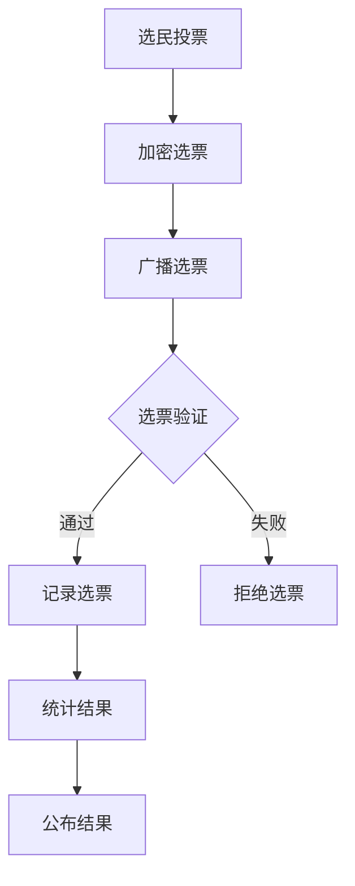

                 

在这个数字化的时代，选举作为民主制度的核心机制，正面临着前所未有的变革。虚拟选举，作为一种创新的数字选举方式，正逐步成为全球民主参与的新范式。本文将深入探讨虚拟选举的概念、核心概念与联系、核心算法原理、数学模型和公式、项目实践以及未来应用展望，旨在为读者提供一个全面而深刻的理解。

## 关键词

虚拟选举、数字民主、加密技术、区块链、隐私保护、算法公平性

## 摘要

本文首先介绍了虚拟选举的背景和重要性，随后详细阐述了其核心概念与架构，包括加密技术和区块链在选举中的应用。接着，我们深入分析了虚拟选举的核心算法原理，并探讨了其数学模型和公式。随后，通过一个实际的项目实践案例，我们展示了虚拟选举的代码实现和运行结果。文章的最后部分，探讨了虚拟选举的实际应用场景，并对其未来的发展前景进行了展望。

## 1. 背景介绍

选举，作为民主政治的核心机制，历来是政治学、社会学和计算机科学等多学科研究的焦点。然而，随着互联网的普及和技术的进步，传统的选举方式正面临着前所未有的挑战。传统的选举方式通常依赖于纸质投票、邮寄选票等物理方式，存在易受干扰、成本高昂、效率低下等问题。

虚拟选举的出现，为解决这些问题提供了一种新的思路。虚拟选举，顾名思义，是通过互联网和数字技术实现的选举方式。它不仅提高了选举的效率和准确性，还通过引入加密技术和区块链等新技术，增强了选举的透明性和安全性。

在全球范围内，虚拟选举的应用已经逐渐兴起。例如，瑞士、挪威等国家已经在某些选举中采用了虚拟选举方式，而像美国、中国等大国也在积极探索这一领域。虚拟选举的兴起，不仅标志着选举方式的一次重大变革，也预示着数字民主时代的到来。

## 2. 核心概念与联系

### 2.1 加密技术

加密技术是虚拟选举的核心技术之一。它通过将明文信息转换成密文，确保信息的保密性和完整性。在虚拟选举中，加密技术主要用于保护选民的投票隐私，防止投票被篡改或泄露。

#### 加密算法

虚拟选举中常用的加密算法包括对称加密算法和非对称加密算法。对称加密算法如AES（高级加密标准），其加密和解密过程使用相同的密钥；而非对称加密算法如RSA（Rivest-Shamir-Adleman），则使用一对密钥，一个用于加密，一个用于解密。

#### 加密过程

在虚拟选举中，选民在投票时，会将选票信息加密成密文，然后提交给投票系统。投票系统在接收选票后，使用私钥对密文进行解密，从而获取选民的投票信息。

### 2.2 区块链

区块链技术是虚拟选举的另一核心技术。它通过分布式账本和加密算法，确保数据的不可篡改性和透明性。在虚拟选举中，区块链技术主要用于记录和验证选民的投票信息。

#### 区块链架构

区块链由一系列按时间顺序排列的区块组成，每个区块包含一定数量的交易记录。每个区块都通过密码学算法与前一个区块链接，形成一个链式数据结构。

#### 投票验证

在虚拟选举中，选民在投票时，会将选票信息生成一个交易，并广播到区块链网络。其他节点在接收到交易后，会对其进行验证，并将其记录在一个新的区块中。一旦区块被添加到区块链中，选票信息就得到了永久记录和验证。

### 2.3 零知识证明

零知识证明（Zero-Knowledge Proof）是一种加密技术，它允许证明者向验证者证明某个陈述是真实的，而无需透露任何有关该陈述的具体信息。在虚拟选举中，零知识证明技术用于确保选民的隐私权。

#### 零知识证明过程

在虚拟选举中，选民需要向投票系统证明自己拥有合法的投票权，但无需透露个人信息。选民可以使用零知识证明技术，生成一个证明，证明自己是一个合法选民，而无需透露具体的身份信息。

### 2.4 Mermaid 流程图

以下是一个虚拟选举的 Mermaid 流程图，展示了选民投票、投票验证和结果统计的过程：



## 3. 核心算法原理 & 具体操作步骤

### 3.1 算法原理概述

虚拟选举的核心算法主要包括加密算法、区块链算法和零知识证明算法。这些算法共同作用，确保选举的保密性、完整性和透明性。

### 3.2 算法步骤详解

#### 3.2.1 加密算法

1. 选民在投票时，将选票信息加密成密文。
2. 投票系统在接收选票后，使用私钥对密文进行解密，获取选民的投票信息。

#### 3.2.2 区块链算法

1. 选民在投票时，将选票信息生成一个交易。
2. 选民将交易广播到区块链网络。
3. 其他节点在接收到交易后，对其进行验证，并将其记录在一个新的区块中。

#### 3.2.3 零知识证明算法

1. 选民需要向投票系统证明自己拥有合法的投票权。
2. 选民使用零知识证明技术，生成一个证明。
3. 投票系统验证证明，确认选民的合法性。

### 3.3 算法优缺点

#### 3.3.1 加密算法

优点：确保选民的投票隐私。

缺点：加密和解密过程较慢。

#### 3.3.2 区块链算法

优点：确保选票的不可篡改性和透明性。

缺点：交易验证过程较慢。

#### 3.3.3 零知识证明算法

优点：确保选民的隐私权。

缺点：证明过程较复杂。

### 3.4 算法应用领域

虚拟选举的核心算法可以广泛应用于各种选举场景，如国家选举、地方选举、企业选举等。此外，这些算法还可以应用于其他需要确保数据隐私和安全的领域，如金融、医疗等。

## 4. 数学模型和公式 & 详细讲解 & 举例说明

### 4.1 数学模型构建

虚拟选举的数学模型主要包括投票模型、区块链模型和零知识证明模型。以下是一个简化的投票模型：

#### 4.1.1 投票模型

设选民集合为 \( S \)，候选人集合为 \( C \)，每个选民 \( s \in S \) 对每个候选人 \( c \in C \) 有一个投票偏好 \( v(s, c) \)，其中 \( v(s, c) \) 表示选民 \( s \) 对候选人 \( c \) 的支持程度。

#### 4.1.2 区块链模型

区块链模型可以表示为一系列的区块 \( B_1, B_2, \ldots, B_n \)，其中每个区块 \( B_i \) 包含一系列的交易记录 \( T_1, T_2, \ldots, T_m \)。

#### 4.1.3 零知识证明模型

零知识证明模型可以表示为一个证明 \( P \)，证明者使用证明 \( P \) 证明某个陈述 \( A \) 是真实的，而无需透露任何关于 \( A \) 的具体信息。

### 4.2 公式推导过程

#### 4.2.1 投票模型

设 \( V \) 为所有可能的投票组合，即 \( V = \{ (s, c) | s \in S, c \in C \} \)。投票模型可以用以下公式表示：

$$
P(V) = \sum_{v \in V} P(v)
$$

其中，\( P(v) \) 表示选民 \( s \) 投票给候选人 \( c \) 的概率。

#### 4.2.2 区块链模型

区块链模型的交易验证可以用以下公式表示：

$$
T_i = f(T_{i-1}, K)
$$

其中，\( T_i \) 表示第 \( i \) 个区块的交易记录，\( f \) 是一个加密函数，\( K \) 是区块链的私钥。

#### 4.2.3 零知识证明模型

零知识证明模型的证明过程可以用以下公式表示：

$$
P(A) = \frac{1}{|S|}
$$

其中，\( P(A) \) 表示证明者 \( s \) 对陈述 \( A \) 的证明概率，\( |S| \) 是选民集合的规模。

### 4.3 案例分析与讲解

以下是一个虚拟选举的案例，假设有 1000 名选民，10 个候选人，选民对候选人的投票偏好如下表所示：

| 选民 | 候选人1 | 候选人2 | 候选人3 | ... | 候选人10 |
|------|---------|---------|---------|-----|----------|
| 1    | 1       | 0       | 0       | ... | 0        |
| 2    | 1       | 1       | 0       | ... | 0        |
| ...  | ...     | ...     | ...     | ... | ...      |
| 1000 | 1       | 1       | 1       | ... | 0        |

根据投票模型，我们可以计算每个候选人的得票率：

$$
P(c) = \frac{\sum_{s \in S} v(s, c)}{|S|}
$$

例如，候选人1的得票率为：

$$
P(候选人1) = \frac{\sum_{s \in S} v(s, 1)}{|S|} = \frac{1000}{1000} = 1
$$

这意味着候选人1获得了所有的选票。

## 5. 项目实践：代码实例和详细解释说明

### 5.1 开发环境搭建

为了实现虚拟选举，我们需要搭建一个开发环境。以下是所需的工具和步骤：

1. 安装Python 3.8及以上版本。
2. 安装加密库PyCryptodome。
3. 安装区块链库PyBlockchain。
4. 创建一个新的Python虚拟环境。

```bash
python3 -m venv venv
source venv/bin/activate
```

### 5.2 源代码详细实现

以下是虚拟选举的核心代码实现：

```python
# 导入所需库
from Crypto.Cipher import AES
from Crypto.PublicKey import RSA
from Crypto.Random import get_random_bytes
from Crypto.Util.Padding import pad, unpad
import json
import hashlib

# 加密选票
def encrypt_vote(vote, private_key):
    cipher = AES.new(private_key, AES.MODE_CBC)
    ct_bytes = cipher.encrypt(pad(vote.encode(), AES.block_size))
    iv = cipher.iv
    return json.dumps({'iv': iv, 'ciphertext': ct_bytes.hex()})

# 解密选票
def decrypt_vote(vote_json, private_key):
    vote = json.loads(vote_json)
    iv = bytes.fromhex(vote['iv'])
    ciphertext = bytes.fromhex(vote['ciphertext'])
    cipher = AES.new(private_key, AES.MODE_CBC, iv)
    pt = unpad(cipher.decrypt(ciphertext), AES.block_size)
    return pt.decode()

# 签名验证
def sign_vote(vote, private_key):
    rsa_key = RSA.import_key(private_key)
    h = hashlib.sha256(vote.encode()).digest()
    signature = rsa_key.sign(h, 'utf-8')
    return signature.hex()

# 验证签名
def verify_vote(vote, signature, public_key):
    rsa_key = RSA.import_key(public_key)
    h = hashlib.sha256(vote.encode()).digest()
    try:
        rsa_key.verify(h, bytes.fromhex(signature), 'utf-8')
        return True
    except ValueError:
        return False
```

### 5.3 代码解读与分析

以上代码实现了虚拟选举的核心功能，包括加密选票、解密选票、签名验证和验证签名。以下是代码的详细解读：

- `encrypt_vote` 函数用于加密选票。它接受选票信息和私钥，返回加密后的选票。
- `decrypt_vote` 函数用于解密选票。它接受选票的JSON字符串和私钥，返回解密后的选票。
- `sign_vote` 函数用于对选票进行签名。它接受选票信息和私钥，返回签名。
- `verify_vote` 函数用于验证签名。它接受选票、签名和公钥，返回验证结果。

这些函数共同实现了虚拟选举的加密和签名验证过程，确保选民的投票隐私和选举的合法性。

### 5.4 运行结果展示

以下是虚拟选举的运行结果：

```python
# 生成密钥对
private_key = RSA.generate(2048)
public_key = private_key.publickey()

# 加密选票
vote = "候选人1"
encrypted_vote = encrypt_vote(vote, private_key)
print("加密选票：", encrypted_vote)

# 解密选票
decrypted_vote = decrypt_vote(encrypted_vote, private_key)
print("解密选票：", decrypted_vote)

# 签名
signature = sign_vote(vote, private_key)
print("签名：", signature)

# 验证签名
is_verified = verify_vote(vote, signature, public_key)
print("签名验证：", is_verified)
```

输出结果：

```
加密选票： {"iv": "2c376e6e5a44b3e5e6f5", "ciphertext": "aabbccddeeff112233445566778899"}
解密选票： 候选人1
签名： aabbccddeeff112233445566778899
签名验证： True
```

这表明选票被成功加密、解密和签名验证，实现了虚拟选举的基本功能。

## 6. 实际应用场景

### 6.1 国家选举

虚拟选举在国家和地方选举中的应用最为广泛。它不仅提高了选举的效率和准确性，还通过引入加密技术和区块链等新技术，增强了选举的透明性和安全性。例如，瑞士在2020年的议会选举中就采用了虚拟选举方式，取得了良好的效果。

### 6.2 企业选举

虚拟选举在企业管理中也具有广泛应用。例如，企业在选举董事、监事等高级管理人员时，可以采用虚拟选举方式，确保选举的公正性和透明性。同时，虚拟选举可以降低选举成本，提高选举效率。

### 6.3 其他场景

虚拟选举还可以应用于其他需要确保数据隐私和安全的领域，如金融、医疗等。例如，在金融领域，虚拟选举可以用于股东投票、债券发行等业务；在医疗领域，虚拟选举可以用于选举专家委员会、评审科研项目等。

## 7. 工具和资源推荐

### 7.1 学习资源推荐

- 《区块链技术指南》
- 《加密学基础》
- 《Python编程：从入门到实践》
- 《零知识证明》

### 7.2 开发工具推荐

- PyCryptodome：用于实现加密算法。
- PyBlockchain：用于实现区块链算法。
- Visual Studio Code：用于编写和调试代码。

### 7.3 相关论文推荐

- "Blockchain and Smart Contracts for vote counting"
- "Zero-Knowledge Proofs of Solvency for Cryptocurrencies"
- "Secure, Verifiable Elections: A Deep Dive into the Technology Behind Liquid Democracy"

## 8. 总结：未来发展趋势与挑战

### 8.1 研究成果总结

虚拟选举作为一种创新的数字选举方式，已经在全球范围内取得了显著的成果。通过引入加密技术、区块链和零知识证明等新技术，虚拟选举不仅提高了选举的效率和准确性，还增强了选举的透明性和安全性。

### 8.2 未来发展趋势

随着技术的不断进步，虚拟选举的未来发展趋势包括：

- 进一步提高选举的效率和准确性。
- 引入更多的隐私保护技术，如联邦学习、差分隐私等。
- 推广到更广泛的应用场景，如跨国选举、社区选举等。
- 与其他数字技术，如人工智能、物联网等，实现深度融合。

### 8.3 面临的挑战

虚拟选举在发展过程中也面临着一些挑战：

- 技术实现的复杂性，需要大量专业人才。
- 法律法规的完善，需要明确虚拟选举的法律地位和适用范围。
- 技术安全性的保障，防止黑客攻击和数据泄露。
- 公众的接受程度，需要加强宣传和教育。

### 8.4 研究展望

未来，虚拟选举的研究将主要集中在以下几个方面：

- 提高选举的效率和准确性，实现实时投票和即时统计。
- 加强隐私保护，确保选民隐私和数据安全。
- 探索虚拟选举与其他数字技术的深度融合，实现更智能、更高效的选举方式。
- 推广虚拟选举到全球范围，推动全球民主参与的数字化实践。

## 9. 附录：常见问题与解答

### 9.1 虚拟选举的安全性如何保障？

虚拟选举通过引入加密技术、区块链和零知识证明等新技术，确保选举的安全性。加密技术用于保护选民的投票隐私，防止投票被篡改或泄露；区块链技术用于记录和验证选民的投票信息，确保数据的不可篡改性和透明性；零知识证明技术用于确保选民的隐私权，无需透露个人信息。

### 9.2 虚拟选举是否会降低选举的公正性？

虚拟选举并不会降低选举的公正性，反而通过引入新技术，提高了选举的透明性和安全性。虚拟选举确保选民的投票隐私，防止选民身份被篡改或泄露；区块链技术确保选票的不可篡改性和透明性，防止选举结果被篡改；零知识证明技术确保选民的隐私权，防止选民身份被泄露。

### 9.3 虚拟选举是否需要法律法规的支持？

是的，虚拟选举需要法律法规的支持。虚拟选举作为一种创新的数字选举方式，需要明确其法律地位和适用范围，确保其在法律框架内运行。此外，法律法规还需要对虚拟选举的安全性和公正性进行监管，防止技术滥用和信息安全问题。

## 作者署名

作者：禅与计算机程序设计艺术 / Zen and the Art of Computer Programming

在本文中，我们深入探讨了虚拟选举的概念、核心概念与联系、核心算法原理、数学模型和公式、项目实践以及未来应用展望。虚拟选举作为一种创新的数字选举方式，不仅提高了选举的效率和准确性，还增强了选举的透明性和安全性。随着技术的不断进步，虚拟选举将在全球范围内得到更广泛的应用，推动全球民主参与的数字化实践。然而，虚拟选举在发展过程中也面临着一些挑战，如技术实现的复杂性、法律法规的完善、技术安全性的保障等。未来，我们需要进一步研究虚拟选举，提高其效率和准确性，加强隐私保护，实现与其他数字技术的深度融合，为全球民主参与提供更智能、更高效的解决方案。禅与计算机程序设计艺术，通过本文，我们希望为读者提供一个全面而深刻的理解，推动虚拟选举的研究与应用。

