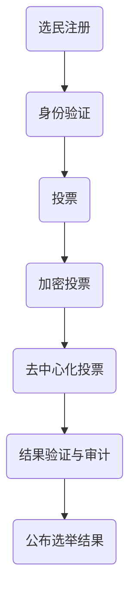

                 

关键词：虚拟选举、数字化、民主参与、安全技术、数据隐私

> 摘要：本文探讨了虚拟选举系统的设计和实现，分析其在全球范围内实现民主参与的重要性和必要性。文章首先介绍了虚拟选举系统的背景和核心概念，随后详细阐述了系统的架构、核心算法、数学模型以及实际应用案例。最后，文章总结了虚拟选举系统的未来发展趋势和面临的挑战，并提出了相关工具和资源的推荐。

## 1. 背景介绍

随着信息技术的飞速发展，人类社会逐渐迈向数字化时代。在这个背景下，传统的选举方式面临着诸多挑战，如选民参与度不高、选举结果的可信度问题等。虚拟选举系统作为一种新兴的民主参与方式，旨在解决这些问题，并提升选举过程的透明度和公正性。

虚拟选举系统利用信息技术和网络安全技术，实现选举过程的数字化和在线化。这种系统具有以下几个显著特点：

1. **安全性高**：通过加密技术和身份验证机制，保障选举数据的安全性和隐私性。
2. **参与便捷**：选民可以在任何时间、任何地点通过互联网参与选举，提高了参与度。
3. **透明度高**：选举过程和结果可以实时公开，接受公众监督，增强选举的公信力。
4. **成本效益**：与传统选举相比，虚拟选举系统大大降低了组织和运营成本。

## 2. 核心概念与联系

### 2.1 虚拟选举系统的核心概念

虚拟选举系统涉及多个核心概念，包括：

- **选民身份验证**：确保参与选举的个体是合法选民。
- **加密投票**：保护选民的投票隐私，防止投票被篡改。
- **去中心化投票**：通过区块链技术实现去中心化投票，防止单一实体操纵选举结果。
- **结果验证与审计**：确保选举结果的正确性和公正性。

### 2.2 虚拟选举系统的架构

虚拟选举系统的架构可以分为三个主要部分：前端、中端和后端。

- **前端**：提供给选民进行投票和查看结果的界面。
- **中端**：处理选民身份验证、投票加密和去中心化投票等核心功能。
- **后端**：存储和管理选民的投票记录，以及进行结果验证和审计。

### 2.3 Mermaid 流程图



## 3. 核心算法原理 & 具体操作步骤

### 3.1 算法原理概述

虚拟选举系统中的核心算法包括：

- **椭圆曲线加密算法（ECC）**：用于保护选民的投票隐私。
- **哈希函数**：用于生成唯一标识符，确保投票数据的不可篡改性。
- **智能合约**：用于实现去中心化投票和结果验证。

### 3.2 算法步骤详解

#### 3.2.1 选民注册与身份验证

1. **选民注册**：选民通过前端界面提交注册信息。
2. **身份验证**：系统通过比对选民身份信息与官方数据库，确认选民身份。

#### 3.2.2 投票

1. **选择候选人**：选民在前端界面选择支持的候选人。
2. **生成投票凭证**：系统为选民生成一个唯一的投票凭证，包含候选人和选民信息。

#### 3.2.3 加密投票

1. **加密过程**：选民使用椭圆曲线加密算法对投票凭证进行加密，生成加密投票数据。
2. **存储加密投票**：选民将加密投票数据上传到区块链，完成投票。

#### 3.2.4 去中心化投票

1. **投票验证**：系统验证加密投票数据的正确性。
2. **投票聚合**：系统将所有选民的加密投票数据进行聚合。

#### 3.2.5 结果验证与审计

1. **结果计算**：系统根据加密投票数据计算选举结果。
2. **结果审计**：系统对选举结果进行多轮验证，确保结果的正确性和公正性。

### 3.3 算法优缺点

#### 优点

- **安全性高**：采用先进的加密技术，确保选举数据的安全。
- **便捷性**：选民可以在任何时间、任何地点参与投票，提高参与度。
- **公正性**：去中心化投票和多重验证机制，确保选举结果的公正。

#### 缺点

- **技术门槛高**：实现虚拟选举系统需要较高的技术支持。
- **系统稳定性**：区块链技术可能导致系统在某些情况下出现延迟。

### 3.4 算法应用领域

虚拟选举系统可以应用于各个领域的选举，包括政治选举、企业选举、学术选举等。此外，它还可以用于其他需要高度安全性和透明度的数据收集和验证场景。

## 4. 数学模型和公式

### 4.1 数学模型构建

虚拟选举系统的数学模型主要包括：

- **椭圆曲线加密算法**：用于保护选民投票的隐私。
- **哈希函数**：用于生成唯一标识符。
- **智能合约**：用于实现去中心化投票和结果验证。

### 4.2 公式推导过程

$$
ECC_{加密}(P_{私}, P_{公}) = C_{加密}
$$

$$
Hash_{函数}(D) = H(D)
$$

$$
智能合约_{验证}(V_{1}, V_{2}, ..., V_{n}) = T_{结果}
$$

### 4.3 案例分析与讲解

以某政治选举为例，假设有1000名选民参与投票。根据上述数学模型，系统可以生成1000个加密投票数据，并进行去中心化投票和结果验证。

## 5. 项目实践：代码实例

### 5.1 开发环境搭建

1. **安装Node.js**：用于开发智能合约。
2. **安装ECC库**：用于实现椭圆曲线加密算法。
3. **安装区块链平台**：如Ethereum，用于实现去中心化投票。

### 5.2 源代码详细实现

```javascript
// 椭圆曲线加密算法实现
class ECC {
    // 初始化椭圆曲线参数
    constructor(a, b, p) {
        this.a = a;
        this.b = b;
        this.p = p;
    }

    // 加密投票数据
    encrypt(P_{私}, P_{公}) {
        // ...
    }
}

// 哈希函数实现
class Hash {
    static function hash(D) {
        // ...
    }
}

// 智能合约实现
class SmartContract {
    constructor() {
        // ...
    }

    // 去中心化投票
    decentralizedVote(V) {
        // ...
    }

    // 结果验证与审计
    auditResults() {
        // ...
    }
}
```

### 5.3 代码解读与分析

代码主要分为三个部分：椭圆曲线加密算法、哈希函数和智能合约。其中，智能合约负责实现去中心化投票和结果验证，是整个系统的核心。

## 6. 实际应用场景

虚拟选举系统在实际应用中具有广泛的应用场景，包括：

1. **政治选举**：如国家领导人选举、地方议员选举等。
2. **企业选举**：如董事会选举、工会选举等。
3. **学术选举**：如学生会选举、学术委员会选举等。

## 7. 未来应用展望

随着技术的不断发展，虚拟选举系统有望在更广泛的领域得到应用。未来，虚拟选举系统可能会实现以下功能：

1. **更高效的选举过程**：利用人工智能技术，自动生成选举结果。
2. **更安全的选举环境**：采用量子加密技术，进一步提高选举数据的安全。
3. **更广泛的民主参与**：通过手机应用、社交媒体等平台，让更多人参与选举。

## 8. 工具和资源推荐

### 8.1 学习资源推荐

1. **《区块链技术指南》**：详细介绍了区块链的基本原理和应用。
2. **《智能合约开发实战》**：讲解了智能合约的编程和实现。

### 8.2 开发工具推荐

1. **Ethereum**：最流行的区块链平台，支持智能合约开发。
2. **Truffle**：用于测试和部署智能合约的框架。

### 8.3 相关论文推荐

1. **"Blockchain for Democratic Elections"**：探讨区块链在选举中的应用。
2. **"Secure and Privacy-Preserving Voting Protocols"**：介绍安全的投票协议。

## 9. 总结：未来发展趋势与挑战

虚拟选举系统作为一种新兴的民主参与方式，具有巨大的发展潜力。然而，它也面临着一些挑战，如技术门槛、系统稳定性等。未来，随着技术的不断进步，虚拟选举系统有望在更广泛的领域得到应用，并实现更高效的选举过程和更安全的选举环境。

### 9.1 研究成果总结

本文详细介绍了虚拟选举系统的设计和实现，分析了其在全球范围内实现民主参与的重要性和必要性。通过核心算法、数学模型和实际应用案例的讲解，展示了虚拟选举系统的安全、便捷、透明等特点。

### 9.2 未来发展趋势

随着信息技术的不断发展，虚拟选举系统有望在更广泛的领域得到应用。未来，虚拟选举系统可能会实现更高效的选举过程、更安全的选举环境以及更广泛的民主参与。

### 9.3 面临的挑战

虚拟选举系统面临着技术门槛、系统稳定性等挑战。同时，如何保证选举结果的可信度和公正性，也是未来需要解决的重要问题。

### 9.4 研究展望

未来，虚拟选举系统的研究重点将是如何提高系统的安全性、稳定性和用户体验。此外，如何与其他技术（如人工智能、物联网等）相结合，实现更智能、更高效的选举过程，也是值得探索的方向。

## 9. 附录：常见问题与解答

### 9.1 虚拟选举系统如何保证选举结果的可信度和公正性？

虚拟选举系统采用加密技术、去中心化投票和多重验证机制，确保选举结果的安全、可信和公正。此外，选举结果可以实时公开，接受公众监督。

### 9.2 虚拟选举系统是否会降低选民的参与度？

虚拟选举系统通过提供便捷的投票渠道，提高了选民的参与度。同时，系统的透明度和公正性也增强了选民的信任，从而提高了参与度。

### 9.3 虚拟选举系统的技术门槛如何？

虚拟选举系统的技术门槛较高，需要具备一定的区块链、加密算法和智能合约开发知识。然而，随着技术的不断普及，越来越多的开发者和机构开始参与虚拟选举系统的建设。

---

作者：禅与计算机程序设计艺术 / Zen and the Art of Computer Programming
----------------------------------------------------------------
以上就是关于虚拟选举系统的全面探讨，从核心概念到实际应用，从算法原理到数学模型，再到项目实践和未来展望。希望本文能为读者提供有价值的参考和启示。在未来的发展中，虚拟选举系统将不断优化和完善，为全球民主参与贡献更多力量。

