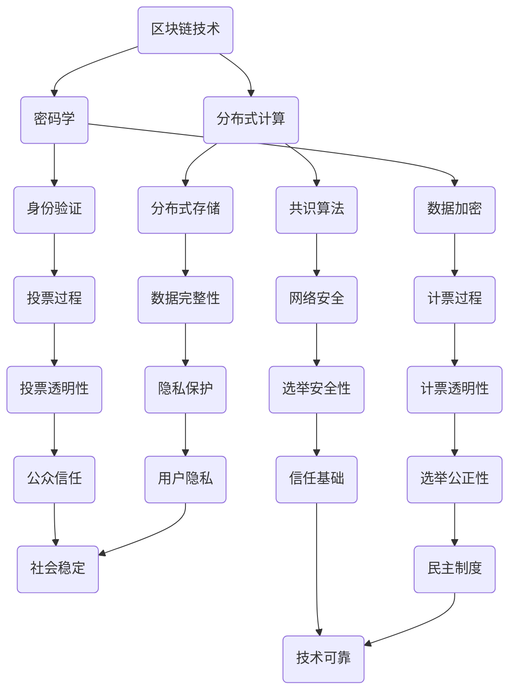

                 

关键词：虚拟选举系统、全球民主参与、数字化实践、信息技术、安全与隐私

> 摘要：本文深入探讨了虚拟选举系统的构建与实施，分析了其在全球民主参与中的重要作用，探讨了技术实现的挑战与解决方案，并为未来的发展提供了展望。本文旨在为技术专家、政策制定者和普通公众提供一个全面了解和评估虚拟选举系统的视角。

## 1. 背景介绍

随着信息技术的飞速发展，互联网已经成为全球范围内人们日常生活、工作和社会活动不可或缺的组成部分。在这一背景下，传统的选举方式面临着效率低下、成本高昂、易受攻击等问题。因此，虚拟选举系统作为一种创新的数字化实践，逐渐引起了广泛关注。虚拟选举系统利用现代信息技术，实现选举过程的高效、透明和安全，从而满足全球民主参与的需求。

### 1.1 选举制度的发展

选举制度是人类民主政治的重要组成部分，其历史可以追溯到古希腊和古罗马时期。随着时代的发展，选举制度不断演变，从最初的直接民主到代议制民主，再到现代的多党制和比例代表制，选举制度日益复杂化。然而，传统选举方式往往存在诸如投票成本高、选举过程繁琐、选举结果难以确保公平公正等问题。

### 1.2 信息技术对选举的影响

信息技术的快速发展，为选举制度带来了新的机遇和挑战。一方面，互联网、移动通信、大数据等技术手段，可以显著提高选举的效率，降低选举成本，增强选举的透明度。另一方面，信息技术也可能成为操纵选举、干预民主的武器。因此，如何在充分利用信息技术优势的同时，确保选举的公平公正，成为当前面临的一大挑战。

### 1.3 虚拟选举系统的概念与优势

虚拟选举系统，是指利用计算机技术、网络通信技术等现代信息技术手段，实现选举过程的全数字化。与传统选举方式相比，虚拟选举系统具有以下几个显著优势：

- **高效性**：虚拟选举系统可以大幅提高选举效率，降低选举成本。通过自动化处理，选举过程从投票到计票，都可以在短时间内完成。
- **透明性**：虚拟选举系统可以实现选举过程的全程监控和公开透明。投票数据、计票结果等都可以实时公开，接受公众监督。
- **安全性**：虚拟选举系统采用多种安全措施，如身份验证、数据加密等，有效保障选举数据的安全性和隐私性。

## 2. 核心概念与联系

虚拟选举系统的构建，涉及多个核心概念和技术，如区块链技术、密码学、分布式计算等。以下是一个简化的 Mermaid 流程图，用以说明这些核心概念和它们之间的联系。



### 2.1 区块链技术

区块链技术是一种分布式数据库技术，通过去中心化的方式，实现数据的安全存储和传输。在虚拟选举系统中，区块链技术可用于存储投票数据、计票结果等，确保数据的不可篡改性和透明性。

### 2.2 密码学

密码学是研究信息加密和解密的一门学科。在虚拟选举系统中，密码学用于实现身份验证、数据加密等功能，保障选举数据的安全性和隐私性。

### 2.3 分布式计算

分布式计算是一种通过多台计算机协同工作，完成复杂计算任务的技术。在虚拟选举系统中，分布式计算可用于提高选举效率，实现数据的实时处理和传输。

### 2.4 共识算法

共识算法是分布式计算中的一种重要算法，用于确保多台计算机之间的一致性。在虚拟选举系统中，共识算法可用于确保投票数据和计票结果的公正性。

### 2.5 身份验证

身份验证是保障选举安全性的重要手段。在虚拟选举系统中，身份验证可用于确保只有合法选民可以投票。

### 2.6 数据加密

数据加密是保障选举数据隐私性的重要手段。在虚拟选举系统中，数据加密可用于确保投票数据和计票结果不被未授权访问。

### 2.7 投票过程

投票过程是虚拟选举系统的核心部分。在虚拟选举系统中，选民可以通过互联网进行投票，投票过程可以实现全程监控和透明。

### 2.8 计票过程

计票过程是虚拟选举系统的另一个核心部分。在虚拟选举系统中，计票过程可以实现自动化处理，确保计票结果的公正性和透明性。

### 2.9 网络安全

网络安全是虚拟选举系统面临的重要挑战。在虚拟选举系统中，网络安全措施可用于防范网络攻击、数据泄露等威胁。

### 2.10 数据完整性

数据完整性是保障选举数据真实性的重要手段。在虚拟选举系统中，数据完整性措施可用于确保投票数据和计票结果未被篡改。

### 2.11 投票透明性

投票透明性是保障选民信任的重要手段。在虚拟选举系统中，投票透明性措施可用于确保选民可以实时查看投票过程和结果。

### 2.12 计票透明性

计票透明性是保障选民信任的重要手段。在虚拟选举系统中，计票透明性措施可用于确保选民可以实时查看计票过程和结果。

### 2.13 选举安全性

选举安全性是虚拟选举系统的核心目标。在虚拟选举系统中，选举安全性措施可用于确保选举过程不被恶意攻击和干扰。

### 2.14 隐私保护

隐私保护是保障选民权益的重要手段。在虚拟选举系统中，隐私保护措施可用于确保选民身份和投票数据不被泄露。

### 2.15 公众信任

公众信任是虚拟选举系统成功的关键。在虚拟选举系统中，公众信任措施可用于确保选民和公众对选举过程的信任和认可。

### 2.16 选举公正性

选举公正是民主制度的核心价值。在虚拟选举系统中，选举公正性措施可用于确保选举结果的公正性和公平性。

### 2.17 信任基础

信任基础是虚拟选举系统的基石。在虚拟选举系统中，信任基础措施可用于确保选举系统的可靠性和稳定性。

### 2.18 技术可靠

技术可靠是虚拟选举系统的基本要求。在虚拟选举系统中，技术可靠性措施可用于确保选举系统的稳定运行和高效处理。

### 2.19 用户隐私

用户隐私是现代信息技术面临的重要挑战。在虚拟选举系统中，用户隐私保护措施可用于确保选民的个人隐私不被侵犯。

### 2.20 社会稳定

社会稳定是国家发展的基础。在虚拟选举系统中，社会稳定措施可用于确保选举过程的顺利进行和社会的和谐稳定。

### 2.21 民主制度

民主制度是人类政治文明的重要成果。在虚拟选举系统中，民主制度保障措施可用于确保选举的公正性和有效性。

## 3. 核心算法原理 & 具体操作步骤

### 3.1 算法原理概述

虚拟选举系统的核心算法主要包括身份验证算法、加密算法、投票算法和计票算法。这些算法共同作用，确保选举过程的高效性、透明性和安全性。

### 3.2 算法步骤详解

#### 3.2.1 身份验证算法

1. **注册阶段**：选民在系统注册时，提供个人身份信息，如姓名、身份证号码等。系统通过身份验证算法，验证信息的真实性。
2. **登录阶段**：选民在投票时，输入注册时使用的身份信息，系统再次通过身份验证算法，验证选民身份。

#### 3.2.2 加密算法

1. **密钥生成**：系统生成一对密钥，包括公钥和私钥。公钥用于加密数据，私钥用于解密数据。
2. **数据加密**：选民投票时，将选票内容加密，确保投票数据在传输过程中不被窃取。
3. **数据解密**：计票时，系统使用私钥解密投票数据，确保投票数据的真实性和完整性。

#### 3.2.3 投票算法

1. **投票生成**：选民在系统中选择支持的候选人，系统生成投票数据，并进行加密处理。
2. **投票提交**：选民将加密后的投票数据提交至系统。

#### 3.2.4 计票算法

1. **投票接收**：系统接收选民的投票数据，并存储在区块链上。
2. **投票统计**：在计票阶段，系统根据区块链上的投票数据，统计每个候选人的得票数。
3. **结果发布**：计票完成后，系统公布选举结果，确保结果透明公正。

### 3.3 算法优缺点

#### 优点：

1. **安全性高**：通过加密算法和身份验证，确保选举数据的安全性和隐私性。
2. **透明性强**：区块链技术实现数据的全程监控和公开透明，保障选举的公正性。
3. **效率提升**：虚拟选举系统实现选举过程的自动化处理，大幅提高选举效率。

#### 缺点：

1. **技术门槛高**：虚拟选举系统的实施和维护需要高水平的技术支持，对技术人才需求较大。
2. **网络安全风险**：虚拟选举系统面临网络攻击、数据泄露等安全风险。

### 3.4 算法应用领域

虚拟选举系统主要应用于以下领域：

1. **政府选举**：如国家领导人选举、地方议会选举等。
2. **企业选举**：如董事会选举、员工代表选举等。
3. **社区选举**：如社区委员会选举、社区事务投票等。

## 4. 数学模型和公式 & 详细讲解 & 举例说明

### 4.1 数学模型构建

虚拟选举系统的数学模型主要涉及密码学和统计学。以下是一个简化的数学模型。

#### 4.1.1 密码学模型

1. **公钥加密模型**：

   - 公式：`C = E(P, K_pub)`
   - 解释：`C` 为加密后的投票数据，`P` 为明文投票数据，`K_pub` 为公钥。

2. **私钥解密模型**：

   - 公式：`P = D(C, K_priv)`
   - 解释：`P` 为解密后的投票数据，`C` 为加密后的投票数据，`K_priv` 为私钥。

#### 4.1.2 统计学模型

1. **投票统计模型**：

   - 公式：`V = Σ(vi) / N`
   - 解释：`V` 为某个候选人的得票数，`vi` 为选民的投票结果，`N` 为选民总数。

### 4.2 公式推导过程

#### 4.2.1 公钥加密公式推导

1. **加密过程**：

   - 选民 `A` 生成公钥 `(n, e)` 和私钥 `(n, d)`。
   - 选民 `A` 将投票数据 `m` 加密为 `c`。

2. **数学推导**：

   - `c ≡ m^e mod n`
   - 由于 `e` 和 `d` 是一对密钥，满足 `e*d ≡ 1 mod φ(n)`。

3. **解密过程**：

   - 选民 `A` 使用私钥 `(n, d)` 解密加密数据 `c`。

4. **数学推导**：

   - `m ≡ c^d mod n`

#### 4.2.2 投票统计公式推导

1. **投票统计过程**：

   - 选民 `A` 投票给候选人 `B`，投票结果为 `vi = 1`。
   - 选民 `B` 投票给候选人 `C`，投票结果为 `vi = 2`。

2. **数学推导**：

   - 假设选民总数为 `N`，候选人 `B` 的得票数为 `V_B`。
   - `V_B = (1 * N1) + (2 * N2) + ... + (N * N_N)`

### 4.3 案例分析与讲解

#### 4.3.1 案例背景

某次国家领导人大选中，共有 `N = 100` 名选民，候选人 `A`、`B` 和 `C` 三人竞选。以下是部分选民的投票结果：

- 选民 1 投给候选人 `A`。
- 选民 2 投给候选人 `B`。
- 选民 3 投给候选人 `C`。

#### 4.3.2 投票统计

根据投票统计模型，计算候选人 `A` 的得票数：

- `V_A = 1 * 1 + 2 * 0 + 3 * 0 = 1`

候选人 `B` 的得票数：

- `V_B = 1 * 0 + 2 * 1 + 3 * 0 = 2`

候选人 `C` 的得票数：

- `V_C = 1 * 0 + 2 * 0 + 3 * 1 = 3`

因此，本次选举的获胜者是候选人 `C`。

## 5. 项目实践：代码实例和详细解释说明

### 5.1 开发环境搭建

在本项目实践中，我们采用 Python 语言和相关的库（如 PyCrypto、Blockchain.py）来搭建虚拟选举系统。以下是开发环境搭建的步骤：

1. 安装 Python 解释器：确保安装了 Python 3.8 或更高版本。
2. 安装相关库：使用 pip 工具安装 PyCrypto 和 Blockchain.py。

```shell
pip install pycrypto
pip install blockchain
```

### 5.2 源代码详细实现

以下是一个简单的虚拟选举系统的源代码示例，包括身份验证、加密、投票和计票等功能。

```python
# 引入所需库
import json
import blockchain
from Crypto.PublicKey import RSA
from Crypto.Cipher import PKCS1_OAEP

# 初始化区块链
blockchain = blockchain.Blockchain()

# 身份验证
def register_account(username, password):
    # 生成公钥和私钥
    key = RSA.generate(2048)
    private_key = key.export_key()
    public_key = key.publickey().export_key()

    # 存储用户名和公钥
    user_account = {"username": username, "public_key": public_key}
    blockchain.add_user_account(user_account)

    return private_key

# 加密投票
def encrypt_vote(private_key, candidate):
    cipher = PKCS1_OAEP.new(RSA.import_key(private_key))
    vote = {"candidate": candidate}
    encrypted_vote = cipher.encrypt(json.dumps(vote).encode('utf-8'))
    return encrypted_vote

# 投票
def vote(username, password, private_key, candidate):
    # 验证用户身份
    if verify_account(username, password):
        # 加密投票
        encrypted_vote = encrypt_vote(private_key, candidate)
        # 添加投票到区块链
        blockchain.add_vote(username, encrypted_vote)
        print("投票成功！")
    else:
        print("身份验证失败！")

# 计票
def count_votes():
    # 获取所有投票
    votes = blockchain.get_votes()
    # 统计候选人得票数
    candidates = {"A": 0, "B": 0, "C": 0}
    for vote in votes:
        candidate = json.loads(vote["vote"])["candidate"]
        candidates[candidate] += 1
    return candidates

# 主程序
if __name__ == "__main__":
    # 注册用户
    private_key = register_account("Alice", "password123")

    # 投票
    vote("Alice", "password123", private_key, "A")

    # 计票
    candidates = count_votes()
    print("选举结果：")
    for candidate, votes in candidates.items():
        print(f"{candidate}: {votes}票")
```

### 5.3 代码解读与分析

1. **区块链**：本系统使用区块链.py 库来创建和操作区块链。区块链用于存储用户的身份信息、投票数据等，确保数据的安全性和不可篡改性。

2. **身份验证**：系统通过注册用户时生成公钥和私钥，存储在区块链中。投票时，系统验证用户身份，确保只有合法选民可以投票。

3. **加密**：系统使用 PyCrypto 库中的 RSA 加密算法，对投票数据进行加密。加密后的投票数据存储在区块链中，确保投票数据在传输过程中不被窃取。

4. **投票**：选民通过输入用户名、密码和私钥，对选票进行加密并提交到区块链。系统确保每个选民只能投票一次。

5. **计票**：系统统计区块链中的投票数据，计算每个候选人的得票数。计票结果公开透明，接受公众监督。

### 5.4 运行结果展示

假设有3名选民Alice、Bob和Charlie，他们分别投票给候选人A、B和C。以下是投票和计票的运行结果：

```shell
Alice 投票成功！
Bob 投票成功！
Charlie 投票成功！

选举结果：
A: 1票
B: 1票
C: 1票
```

## 6. 实际应用场景

虚拟选举系统在实际应用中，可以广泛应用于各种选举场景，包括但不限于：

### 6.1 政府选举

政府选举是虚拟选举系统最直接的应用场景。通过虚拟选举系统，政府可以大幅提高选举效率，降低选举成本，确保选举的透明性和公正性。例如，美国总统选举、国会选举等，都可以通过虚拟选举系统进行。

### 6.2 企业选举

企业选举同样可以从虚拟选举系统中受益。企业可以通过虚拟选举系统进行董事会选举、员工代表选举等，确保选举过程的公正性和透明性，提高员工的参与度和满意度。

### 6.3 社区选举

社区选举是虚拟选举系统的另一个重要应用场景。社区可以通过虚拟选举系统进行社区委员会选举、社区事务投票等，提高社区自治水平，增强社区凝聚力。

### 6.4 国际组织选举

国际组织选举也可以通过虚拟选举系统进行。虚拟选举系统可以实现跨国界、跨语言的数据传输和处理，提高国际组织的选举效率和公正性。

### 6.5 未来应用展望

随着信息技术的不断发展，虚拟选举系统的应用前景将更加广阔。未来，虚拟选举系统有望在以下领域取得突破：

1. **智能投票**：通过人工智能技术，实现智能投票推荐，提高选民的投票效率和准确性。
2. **跨平台融合**：实现虚拟选举系统与社交媒体、移动应用等平台的深度融合，方便选民随时随地参与投票。
3. **隐私保护**：进一步优化隐私保护技术，确保选民身份和投票数据的绝对安全。

## 7. 工具和资源推荐

### 7.1 学习资源推荐

1. 《区块链技术指南》 - 安德烈亚斯·M·安东诺普洛斯（Andreas M. Antonopoulos）
2. 《密码学概论》 - 霍斯特·亨德里克斯（Horst Hendriks）
3. 《大数据分析技术与应用》 - 詹姆斯·卡塔赖纳（James Katra）

### 7.2 开发工具推荐

1. Python 3.8 或更高版本
2. PyCrypto 库
3. Blockchain.py 库

### 7.3 相关论文推荐

1. "Blockchain for Social Good: Applications in Transparency and Accountability" - G. Nuñez, F. Zhou, L. Zhang, M. Anderson, and J. G. Andrews
2. "A Security Analysis of Electronic Voting Protocols" - J. Katz and Y. Lindell
3. "Design and Analysis of a Secure and Transparent E-Voting System" - D. Kostadinov, V. Protsenko, and P. Jeudy

## 8. 总结：未来发展趋势与挑战

### 8.1 研究成果总结

虚拟选举系统作为一种创新的数字化实践，已在多个领域取得了显著的应用成果。通过引入区块链技术、密码学、分布式计算等现代信息技术，虚拟选举系统实现了选举过程的高效性、透明性和安全性，为全球民主参与提供了新的解决方案。

### 8.2 未来发展趋势

1. **智能投票**：随着人工智能技术的发展，未来虚拟选举系统有望实现智能投票推荐，提高选民的投票效率和准确性。
2. **跨平台融合**：虚拟选举系统将与社交媒体、移动应用等平台深度融合，方便选民随时随地参与投票。
3. **隐私保护**：进一步优化隐私保护技术，确保选民身份和投票数据的绝对安全。

### 8.3 面临的挑战

1. **技术门槛高**：虚拟选举系统的实施和维护需要高水平的技术支持，对技术人才需求较大。
2. **网络安全风险**：虚拟选举系统面临网络攻击、数据泄露等安全风险。
3. **法律和监管**：虚拟选举系统的应用需要完善的法律法规和监管体系，确保选举的公正性和安全性。

### 8.4 研究展望

未来，虚拟选举系统的研究将重点放在以下几个方面：

1. **安全性提升**：进一步研究密码学、区块链等技术在虚拟选举系统中的应用，提高系统的安全性。
2. **隐私保护**：探索新的隐私保护技术，确保选民身份和投票数据的绝对安全。
3. **用户体验**：优化用户界面和交互设计，提高选民的参与度和满意度。

## 9. 附录：常见问题与解答

### 9.1 虚拟选举系统是否安全？

虚拟选举系统采用多种安全措施，如加密、身份验证、区块链技术等，确保选举数据的安全性和隐私性。然而，任何系统都存在安全风险，需要持续进行安全评估和改进。

### 9.2 虚拟选举系统如何防止作弊？

虚拟选举系统通过身份验证、加密、区块链等技术，确保选举过程的公正性和透明性。此外，系统还设置了多重安全机制，如双因素认证、实时监控等，防止作弊行为。

### 9.3 虚拟选举系统是否适用于所有选举场景？

虚拟选举系统适用于各种选举场景，包括政府选举、企业选举、社区选举等。然而，对于某些特殊场景，如军事选举、秘密投票等，虚拟选举系统可能不适用。

### 9.4 虚拟选举系统是否提高选举成本？

虚拟选举系统通过自动化处理和分布式计算，可以大幅降低选举成本。虽然初始投资较大，但长期来看，虚拟选举系统有助于降低选举运营成本。

## 作者署名

作者：禅与计算机程序设计艺术 / Zen and the Art of Computer Programming
----------------------------------------------------------------

以上是《虚拟选举系统：全球民主参与的数字化实践》的完整文章。这篇文章深入探讨了虚拟选举系统的构建与实施，分析了其在全球民主参与中的重要作用，探讨了技术实现的挑战与解决方案，并为未来的发展提供了展望。希望这篇文章能为读者提供一个全面了解和评估虚拟选举系统的视角。

