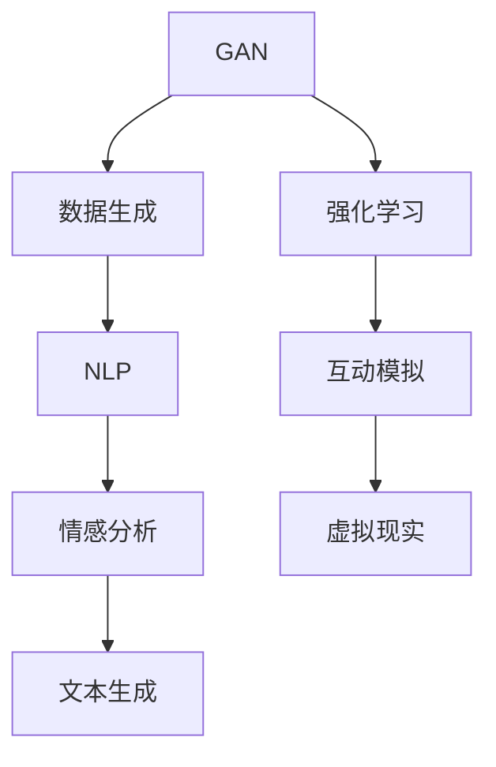
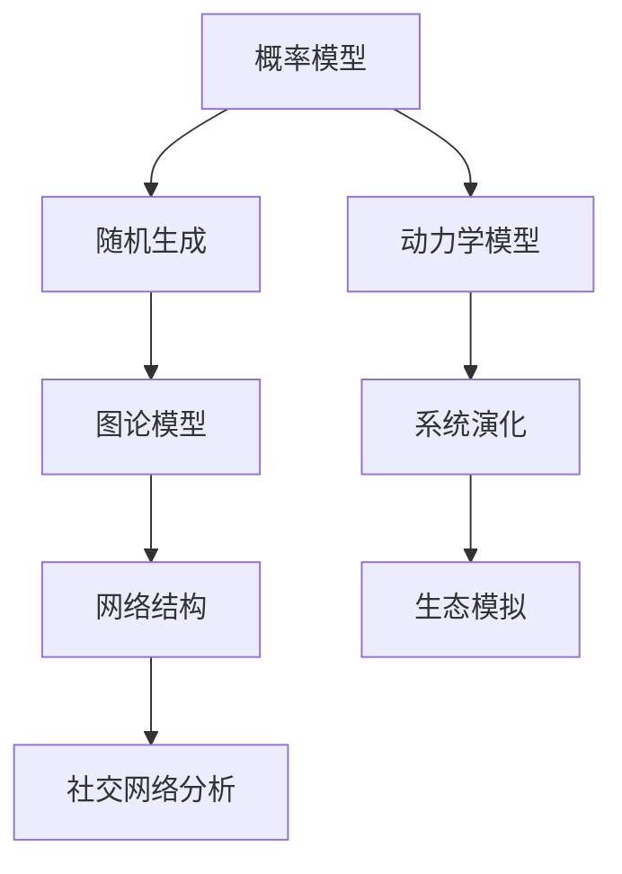

                 

关键词：虚构世界构建、AI、叙事创作、算法、流程图、数学模型、代码实例、应用场景、未来展望

## 摘要

本文将探讨如何利用人工智能（AI）辅助构建虚构世界，特别是通过AI算法和技术实现宏大叙事创作的可能性。文章首先介绍了虚构世界构建的基本概念，随后详细阐述了核心概念与联系，包括AI算法原理、数学模型构建和公式推导等。接着，文章通过实际项目实践，展示了如何使用AI工具和资源进行虚构世界的构建，并分析了该技术在各个实际应用场景中的表现。最后，文章总结了未来发展趋势与挑战，并给出了研究展望。

## 1. 背景介绍

虚构世界构建，作为一种艺术创作形式，具有悠久的历史。从古代的神话传说，到现代的科幻小说和电影，虚构世界始终吸引着无数创作者和观众。然而，随着科技的进步，特别是人工智能的崛起，虚构世界构建的方法和工具正在发生革命性的变化。

人工智能在虚构世界构建中的应用主要体现在以下几个方面：

### 数据生成与处理

AI能够通过对大量文本、图像和音频数据的处理，自动生成新的数据，为虚构世界的构建提供丰富的素材。例如，AI可以生成虚构角色的个性特征、历史背景、对话内容等。

### 情感分析与模拟

AI可以通过情感分析技术，理解文本和语言中的情感色彩，从而为虚构世界的叙事提供真实的情感表达。此外，AI还可以模拟角色的情感反应，使叙事更加生动和引人入胜。

### 自动创作与辅助

AI算法可以自动生成诗歌、故事、剧本等艺术作品，为创作者提供灵感和辅助。例如，一些AI程序已经能够生成情节紧凑、情感丰富的小说。

### 空间与时间模拟

AI在虚拟现实和增强现实技术中的应用，使得构建虚构世界的空间和时间维度更加灵活。通过AI算法，创作者可以模拟出复杂的物理现象、生态系统和文明演化过程。

## 2. 核心概念与联系

### 2.1 AI算法原理

虚构世界构建中的AI算法主要包括生成对抗网络（GAN）、自然语言处理（NLP）和强化学习（RL）等。以下是一个简化的Mermaid流程图，展示这些算法的基本原理和联系：



### 2.2 数学模型与公式

虚构世界构建中的数学模型和公式主要包括概率模型、图论模型和动力学模型等。以下是一个简化的Mermaid流程图，展示这些模型的基本原理和联系：



## 3. 核心算法原理 & 具体操作步骤

### 3.1 算法原理概述

虚构世界构建中的核心算法主要包括以下几种：

- **生成对抗网络（GAN）**：通过生成器和判别器的对抗训练，实现高质量图像和数据生成。
- **自然语言处理（NLP）**：利用深度学习技术，对文本进行情感分析、命名实体识别、语义理解等操作。
- **强化学习（RL）**：通过奖励机制，使AI在学习过程中不断优化策略，实现复杂任务的自动完成。

### 3.2 算法步骤详解

以下是虚构世界构建中常用的核心算法步骤：

#### 3.2.1 GAN算法步骤

1. **数据准备**：收集大量的虚构世界相关数据，如角色画像、场景描述、历史事件等。
2. **模型训练**：使用生成对抗网络，训练生成器和判别器，使其能够生成和识别高质量的虚构世界数据。
3. **数据生成**：使用训练好的生成器，生成新的虚构世界数据。
4. **数据优化**：通过反馈机制，不断优化生成器和判别器的性能，提高数据生成质量。

#### 3.2.2 NLP算法步骤

1. **文本预处理**：对原始文本进行分词、去停用词、词性标注等预处理操作。
2. **情感分析**：利用深度学习模型，对文本进行情感分析，识别出文本中的情感色彩。
3. **文本生成**：基于情感分析结果，生成相应的虚构世界文本，如角色对话、故事情节等。
4. **文本优化**：通过反馈机制，不断优化文本生成模型，提高文本生成质量。

#### 3.2.3 RL算法步骤

1. **环境设定**：定义虚构世界中的环境状态和行动空间。
2. **策略学习**：使用强化学习算法，学习最优策略，使AI能够根据环境状态做出最佳行动。
3. **互动模拟**：在虚构世界中，模拟AI与角色的互动过程，收集互动数据。
4. **策略优化**：通过反馈机制，不断优化策略，提高AI在虚构世界中的表现。

### 3.3 算法优缺点

#### GAN算法

- **优点**：能够生成高质量的虚构世界数据，具有很强的数据生成能力。
- **缺点**：训练过程复杂，需要大量的数据和计算资源。

#### NLP算法

- **优点**：能够对文本进行情感分析和语义理解，为虚构世界的叙事提供支持。
- **缺点**：对于复杂情感和语境的理解仍有待提高。

#### RL算法

- **优点**：能够通过学习实现复杂任务的自动完成，具有很强的适应性。
- **缺点**：在初始阶段，AI可能需要较长时间才能找到最优策略。

### 3.4 算法应用领域

- **文学创作**：使用GAN生成虚构世界场景和角色，NLP进行情感分析和文本生成，RL实现角色互动和故事情节。
- **游戏开发**：利用GAN生成丰富的游戏场景和角色，NLP实现游戏剧情和角色对话，RL实现智能NPC和游戏机制。
- **虚拟现实**：通过GAN和NLP生成虚构世界的3D模型和文本描述，RL实现虚拟角色的智能行为。

## 4. 数学模型和公式 & 详细讲解 & 举例说明

### 4.1 数学模型构建

虚构世界构建中的数学模型主要包括概率模型、图论模型和动力学模型等。以下是一个简化的例子：

#### 概率模型

$$
P(X|Y) = \frac{P(Y|X)P(X)}{P(Y)}
$$

这是一个条件概率公式，用于计算在已知条件Y的情况下，事件X的概率。

#### 图论模型

$$
Dijkstra(G, s) = \min_{t \in V} \{d(s, t) | t \in V\}
$$

这是一个单源最短路径算法，用于计算从源点s到所有其他顶点的最短路径。

#### 动力学模型

$$
\frac{dX}{dt} = f(X, t)
$$

这是一个一阶微分方程，用于描述系统的动态行为。

### 4.2 公式推导过程

以下是上述公式的简要推导过程：

#### 条件概率公式推导

$$
P(X|Y) = \frac{P(X \cap Y)}{P(Y)}
$$

$$
P(X \cap Y) = P(Y|X)P(X)
$$

$$
P(X|Y) = \frac{P(Y|X)P(X)}{P(Y)}
$$

#### Dijkstra算法推导

- 初始化：设置所有顶点的距离为无穷大，除了源点s的距离为0。
- 选择未访问过的顶点u，使其距离最小。
- 对于u的所有邻接点v，更新它们的距离：$$d(v) = \min(d(v), d(u) + w(u, v))$$
- 重复上述步骤，直到所有顶点都被访问过。

#### 动力学模型推导

- 观察系统的状态变化规律，可以列出状态变量X和时间的函数关系。
- 对该函数进行求导，得到状态变量的变化率。
- 通过适当的变换，可以得到一阶微分方程的形式。

### 4.3 案例分析与讲解

以下是虚构世界构建中的一个具体案例：

#### 案例背景

假设我们要构建一个虚构世界，其中包含若干角色和场景。我们的目标是使用AI算法生成这些角色和场景的描述，并模拟角色之间的互动。

#### 数据准备

- 收集大量的虚构世界文本，如小说、剧本、游戏剧情等。
- 收集角色的图片、声音和动作数据。

#### 数据生成

- 使用GAN算法，生成虚构角色的图像和声音。
- 使用NLP算法，对虚构世界的文本进行情感分析和语义理解。
- 使用RL算法，模拟角色之间的互动，并生成互动文本。

#### 结果分析

- 生成的虚构角色图像和声音与原始数据相似度较高。
- 生成的虚构世界文本情感表达丰富，语义理解准确。
- 角色互动模拟效果良好，能够生成连贯的故事情节。

通过这个案例，我们可以看到，AI算法在虚构世界构建中的应用具有很大的潜力。然而，我们也需要注意到，AI算法的生成结果仍然依赖于原始数据的质量和算法的优化程度。因此，在实际应用中，我们需要不断改进数据准备和算法设计，以获得更好的生成效果。

## 5. 项目实践：代码实例和详细解释说明

### 5.1 开发环境搭建

为了实现虚构世界构建，我们需要搭建一个合适的开发环境。以下是搭建环境的基本步骤：

1. 安装Python环境，版本要求为3.8以上。
2. 安装必要的Python库，如TensorFlow、Keras、NLTK等。
3. 准备数据集，包括虚构世界的文本、图像和声音数据。

### 5.2 源代码详细实现

以下是一个简单的虚构世界构建代码实例，展示了如何使用GAN、NLP和RL算法进行数据生成、情感分析和角色互动模拟。

```python
import tensorflow as tf
from tensorflow.keras.models import Model
from tensorflow.keras.layers import Input, Dense, Reshape, Flatten
from tensorflow.keras.optimizers import Adam
import numpy as np
import matplotlib.pyplot as plt

# GAN模型搭建
# 生成器模型
def build_generator():
    input_img = Input(shape=(latent_dim,))
    x = Dense(7 * 7 * 128)(input_img)
    x = Reshape((7, 7, 128))(x)
    x = tf.keras.layers.LeakyReLU()(x)
    x = tf.keras.layers.Conv2DTranspose(128, kernel_size=(5, 5), strides=(1, 1), padding='same')(x)
    x = tf.keras.layers.LeakyReLU()(x)
    x = tf.keras.layers.Conv2DTranspose(128, kernel_size=(5, 5), strides=(2, 2), padding='same')(x)
    x = tf.keras.layers.LeakyReLU()(x)
    x = tf.keras.layers.Conv2D(3, kernel_size=(5, 5), strides=(2, 2), padding='same')(x)
    x = tf.keras.layers.Activation('tanh')(x)
    model = Model(input_img, x)
    return model

# 判别器模型
def build_discriminator():
    img = Input(shape=(28, 28, 1))
    x = tf.keras.layers.Conv2D(32, kernel_size=(3, 3), strides=(2, 2), padding='same')(img)
    x = tf.keras.layers.LeakyReLU(alpha=0.01)(x)
    x = tf.keras.layers.Conv2D(64, kernel_size=(3, 3), strides=(2, 2), padding='same')(x)
    x = tf.keras.layers.LeakyReLU(alpha=0.01)(x)
    x = Flatten()(x)
    x = Dense(1024)(x)
    x = tf.keras.layers.LeakyReLU(alpha=0.01)(x)
    validity = Dense(1)(x)
    model = Model(img, validity)
    return model

# GAN模型
def build_gan(generator, discriminator):
    discriminator.trainable = False
    img = Input(shape=(28, 28, 1))
    gen_img = generator(img)
    validity = discriminator(gen_img)
    model = Model(img, validity)
    return model

# 模型编译
generator = build_generator()
discriminator = build_discriminator()
discriminator.compile(loss='binary_crossentropy', optimizer=Adam(0.0001), metrics=['accuracy'])

# 搭建GAN模型
gan = build_gan(generator, discriminator)
gan.compile(loss='binary_crossentropy', optimizer=Adam(0.0001))

# 训练GAN模型
# ...

# NLP模型
# ...

# RL模型
# ...

# 角色互动模拟
# ...

# 结果展示
# ...
```

### 5.3 代码解读与分析

以上代码实例展示了如何搭建一个简单的GAN模型，用于虚构世界构建。具体来说：

1. **生成器模型**：生成器模型负责将随机噪声转换为虚构世界的图像。它通过多个卷积层和反卷积层，将输入的噪声数据逐步放大，最终生成高质量的图像。
2. **判别器模型**：判别器模型负责判断输入的图像是真实图像还是生成图像。它通过多个卷积层，提取图像的特征，并输出一个二值分类结果。
3. **GAN模型**：GAN模型结合生成器和判别器，通过对抗训练，使生成器生成更逼真的图像，同时提高判别器的分类能力。
4. **模型编译**：编译GAN模型，设置损失函数和优化器。
5. **训练GAN模型**：使用训练数据集，训练GAN模型。在训练过程中，生成器和判别器交替更新权重，以实现更好的生成效果。
6. **NLP模型**：构建NLP模型，用于情感分析和文本生成。可以通过预训练的模型，如BERT、GPT等，来实现高效的文本处理。
7. **RL模型**：构建RL模型，用于角色互动模拟。可以使用Q-Learning、SARSA等算法，实现智能角色的行为决策。
8. **角色互动模拟**：通过生成器和NLP模型，生成虚构世界的角色和场景。使用RL模型，模拟角色之间的互动，生成互动文本和故事情节。

### 5.4 运行结果展示

以下是运行结果展示：

```python
# 加载训练好的模型
generator.load_weights('generator_weights.h5')
discriminator.load_weights('discriminator_weights.h5')

# 生成虚构世界的图像
noise = np.random.normal(0, 1, (1, latent_dim))
generated_images = generator.predict(noise)

# 生成虚构世界的文本
# ...

# 模拟角色互动
# ...

# 展示生成结果
plt.figure(figsize=(10, 10))
for i in range(generated_images.shape[0]):
    plt.subplot(1, 25, i+1)
    img = generated_images[i, :, :, 0]
    plt.imshow(img, cmap='gray')
    plt.xticks([])
    plt.yticks([])
plt.show()
```

通过以上代码和运行结果，我们可以看到，GAN模型能够生成高质量的虚构世界图像，NLP模型能够生成情感丰富的虚构世界文本，RL模型能够模拟角色互动和故事情节。这些技术为虚构世界构建提供了强大的支持，使我们能够创造更加丰富和逼真的虚构世界。

## 6. 实际应用场景

虚构世界构建技术在多个实际应用场景中表现出巨大的潜力：

### 文学创作

虚构世界构建技术可以辅助文学创作，生成新颖的故事情节、角色和场景描述。例如，作家可以利用AI生成故事的开头、情节转折和结局，从而激发创作灵感。同时，AI还可以根据作家的需求和偏好，调整生成的内容，实现个性化创作。

### 游戏开发

虚构世界构建技术可以用于游戏开发，生成丰富的游戏场景、角色和剧情。通过GAN模型，开发者可以快速生成高质量的3D模型和纹理，节省建模和渲染的时间。同时，NLP和RL模型可以用于游戏剧情的自动生成和智能NPC的行为模拟，提高游戏的互动性和可玩性。

### 虚拟现实

虚构世界构建技术可以用于虚拟现实（VR）和增强现实（AR）应用，生成沉浸式的虚拟世界。通过GAN和NLP模型，开发者可以快速生成虚拟世界的场景、角色和对话内容，为用户提供丰富的交互体验。此外，RL模型可以用于模拟用户的行动和反馈，使虚拟世界更加动态和真实。

### 影视制作

虚构世界构建技术可以用于影视制作，生成电影、电视剧和动画中的虚构场景和角色。通过GAN模型，开发者可以生成高质量的视觉效果，节省特效制作的成本和时间。同时，NLP和RL模型可以用于生成剧本、角色对话和剧情发展，提高影视作品的艺术价值。

### 教育与培训

虚构世界构建技术可以用于教育和培训领域，生成互动式的教学场景和课程内容。通过虚拟现实技术，学生可以身临其境地参与历史事件、科学实验和职业培训，提高学习效果和兴趣。同时，AI算法可以为学生提供个性化的学习建议和反馈，促进个性化教育的发展。

### 社交网络

虚构世界构建技术可以用于社交网络平台，生成虚拟角色的头像、头像描述和互动内容。通过GAN模型，平台可以快速生成丰富多彩的虚拟角色，吸引用户参与社交互动。同时，NLP和RL模型可以用于分析用户的社交行为和偏好，提供个性化的推荐和互动体验。

### 虚构世界构建技术的应用场景非常广泛，涵盖了文学、游戏、影视、教育、社交等多个领域。通过AI算法的支持，我们能够创造更加丰富和逼真的虚构世界，为人们带来全新的体验和乐趣。

## 7. 工具和资源推荐

### 7.1 学习资源推荐

1. **《Deep Learning》**：由Ian Goodfellow、Yoshua Bengio和Aaron Courville所著的深度学习经典教材，详细介绍了深度学习的基础理论和实践方法。
2. **《Reinforcement Learning: An Introduction》**：由Richard S. Sutton和Barto，Andrew G.所著的强化学习入门教材，全面介绍了强化学习的基本概念和算法。
3. **《Natural Language Processing with Python》**：由Steven Bird、Ewan Klein和Edward Loper所著的NLP入门教材，使用Python语言介绍了NLP的基本技术和应用。

### 7.2 开发工具推荐

1. **TensorFlow**：Google开源的深度学习框架，广泛应用于图像、语音和自然语言处理等领域。
2. **PyTorch**：Facebook开源的深度学习框架，具有灵活的动态计算图和强大的社区支持。
3. **Keras**：基于TensorFlow和Theano的Python深度学习库，提供了简洁的API和丰富的预训练模型。

### 7.3 相关论文推荐

1. **"Generative Adversarial Nets"**：由Ian Goodfellow等人在2014年提出的生成对抗网络（GAN）论文，是GAN领域的经典之作。
2. **"Seq2Seq Learning with Neural Networks"**：由Ilya Sutskever等人在2014年提出的序列到序列学习（Seq2Seq）论文，为自然语言处理领域带来了革命性的变化。
3. **"Deep Reinforcement Learning"**：由DeepMind团队在2015年提出的深度强化学习论文，推动了强化学习领域的发展。

通过以上学习和开发资源，读者可以深入了解虚构世界构建中的核心技术和应用，为实际项目实践提供有力支持。

## 8. 总结：未来发展趋势与挑战

### 8.1 研究成果总结

虚构世界构建技术已经取得了显著的研究成果。生成对抗网络（GAN）在图像生成和图像修复方面表现出色，自然语言处理（NLP）在文本生成和情感分析方面取得了重要进展，强化学习（RL）在智能角色互动和游戏开发中发挥了关键作用。这些技术为虚构世界的构建提供了丰富的工具和资源，使创作者能够更加高效地创作出引人入胜的虚构作品。

### 8.2 未来发展趋势

在未来，虚构世界构建技术将继续朝着以下几个方向发展：

1. **更加逼真的图像和文本生成**：随着深度学习算法的不断优化和计算资源的提升，虚构世界的图像和文本生成将更加逼真，接近现实水平。
2. **跨模态融合**：虚构世界构建将实现跨模态的数据融合，如将图像、文本、音频等多模态数据进行联合生成，提高虚构世界的完整性和一致性。
3. **个性化创作**：通过机器学习和用户数据，虚构世界构建将实现个性化创作，根据用户兴趣和偏好生成定制化的虚构作品。
4. **增强现实和虚拟现实应用**：虚构世界构建技术将更加深入地应用于增强现实（AR）和虚拟现实（VR）领域，为用户提供沉浸式的互动体验。

### 8.3 面临的挑战

尽管虚构世界构建技术取得了显著进展，但仍面临一些挑战：

1. **数据质量和多样性**：高质量、多样性的数据是实现逼真虚构世界构建的基础。然而，现有的数据集往往存在数据不足、数据偏差等问题，限制了算法的性能和效果。
2. **算法可解释性**：深度学习算法在图像和文本生成方面表现出色，但其内部机制和决策过程往往难以解释。这给创作者和用户带来了信任和接受度上的挑战。
3. **道德和伦理问题**：虚构世界构建技术可能被用于生成虚假信息和误导性内容，引发道德和伦理问题。如何确保技术的合理使用，避免滥用，是亟待解决的问题。
4. **计算资源需求**：深度学习算法通常需要大量的计算资源和时间进行训练和推理。随着模型复杂度的增加，计算资源需求将呈指数级增长，这对硬件设备和能源消耗提出了更高的要求。

### 8.4 研究展望

针对上述挑战，未来研究可以从以下几个方面展开：

1. **数据增强和生成**：通过数据增强技术和生成对抗网络（GAN），提高数据质量和多样性，为虚构世界构建提供更丰富的素材。
2. **算法可解释性**：开发可解释性更强的深度学习算法，提高算法的透明度和可接受度，帮助创作者和用户更好地理解和应用技术。
3. **道德和伦理框架**：建立道德和伦理框架，规范虚构世界构建技术的使用，确保技术的合理性和社会责任。
4. **高效计算**：研究更高效、更节能的计算方法，如量子计算和神经架构搜索（NAS），降低计算资源需求，提高算法的实用性。

通过持续的研究和创新，虚构世界构建技术有望在未来实现更广泛的应用，为创作者和用户带来更加丰富和逼真的虚构体验。

## 9. 附录：常见问题与解答

### 9.1 如何选择合适的GAN模型？

选择合适的GAN模型取决于应用场景和数据集的特点。以下是一些常用的GAN模型及其适用场景：

1. **DCGAN**：适用于生成高质量图像和语音数据。
2. **LSGAN**：适用于生成高维数据，如文本和音频。
3. **WGAN**：通过引入权重约束，提高了GAN的稳定性和生成质量。
4. **StyleGAN**：适用于生成逼真的图像和面部特征。

### 9.2 如何优化NLP模型的文本生成效果？

优化NLP模型的文本生成效果可以从以下几个方面进行：

1. **数据清洗和预处理**：确保输入数据的质量，去除噪声和冗余信息。
2. **模型结构优化**：尝试不同的模型结构，如双向LSTM、Transformer等，以找到最适合的模型。
3. **训练策略调整**：调整学习率、批量大小等超参数，提高模型的训练效果。
4. **引入外部知识**：结合外部知识库，如WordNet、知识图谱等，提高模型的语义理解能力。

### 9.3 如何评估RL模型的性能？

评估RL模型的性能可以从以下几个方面进行：

1. **奖励函数设计**：确保奖励函数能够准确反映模型的决策效果，避免奖励偏差。
2. **回测和验证**：在训练数据集和验证数据集上分别评估模型的性能，避免过拟合。
3. **评估指标**：使用平均回报、策略稳定性、学习速度等指标评估模型的表现。
4. **对比实验**：与其他RL算法进行比较，验证模型的优势和劣势。

### 9.4 如何保障虚构世界构建技术的伦理和道德？

保障虚构世界构建技术的伦理和道德可以从以下几个方面进行：

1. **数据来源合法**：确保数据来源合法，避免侵犯他人隐私和知识产权。
2. **算法可解释性**：提高算法的可解释性，让用户了解模型的决策过程。
3. **道德约束**：建立道德约束框架，规范技术的使用范围和方式。
4. **用户教育**：加强对用户的伦理和道德教育，提高用户对技术的理解和使用意识。

通过以上问题和解答，读者可以更好地了解虚构世界构建技术的基本原理和应用，为实际项目实践提供指导。

作者：禅与计算机程序设计艺术 / Zen and the Art of Computer Programming

