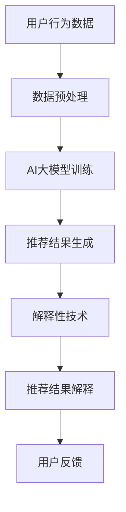

                 

关键词：人工智能，大模型，商品推荐，解释性技术，数据处理，算法优化，数学模型，实践案例，应用场景，未来展望

> 摘要：随着人工智能技术的不断发展，商品推荐系统已成为电商领域的重要应用。本文旨在探讨如何将AI大模型与解释性技术相结合，以提高商品推荐系统的准确性和可解释性，满足用户需求，提升用户体验。本文首先介绍了商品推荐系统的背景和核心概念，然后详细阐述了融合AI大模型和解释性技术的原理与实现，接着通过具体案例展示了技术在实际中的应用，并对未来应用场景进行了展望。

## 1. 背景介绍

### 商品推荐系统概述

商品推荐系统是电子商务领域的一项关键技术，它通过分析用户的兴趣和行为，为用户提供个性化的商品推荐。这类系统广泛应用于在线购物平台、视频网站、社交媒体等场景，极大地提升了用户体验和销售额。

### 人工智能与商品推荐

人工智能（AI）的迅速发展，为商品推荐系统带来了新的机遇。AI大模型如深度学习网络、强化学习模型等，具备处理海量数据和复杂特征的能力，能够在商品推荐中实现更高的准确性和个性化。

### 解释性技术的必要性

然而，AI大模型在商品推荐中存在一个重要问题：可解释性不足。用户难以理解推荐结果背后的原因，从而影响信任度和接受度。因此，融合解释性技术成为提升商品推荐系统的重要方向。

## 2. 核心概念与联系

### 核心概念

- 商品推荐系统：基于用户行为和兴趣进行商品推荐。
- 人工智能：通过模拟人类智能解决复杂问题。
- 解释性技术：提供算法决策过程的解释，增强透明度和可信度。

### 架构与联系

以下是一个简化的Mermaid流程图，展示AI大模型与解释性技术结合的基本架构：



### Mermaid流程图详解

- **A 用户行为数据**：收集用户在电商平台的浏览、购买、评论等行为数据。
- **B 数据预处理**：对原始数据进行清洗、转换和特征提取，为AI大模型训练做准备。
- **C AI大模型训练**：利用深度学习等技术，对预处理后的数据进行训练，生成推荐模型。
- **D 推荐结果生成**：使用训练好的模型，为用户生成个性化的商品推荐。
- **E 解释性技术**：对推荐结果进行解释，揭示推荐背后的原因。
- **F 推荐结果解释**：向用户展示推荐结果的解释，提高信任度和接受度。
- **G 用户反馈**：收集用户对推荐结果的反馈，用于模型优化和迭代。

## 3. 核心算法原理 & 具体操作步骤

### 3.1 算法原理概述

融合AI大模型和解释性技术的商品推荐系统，主要基于以下原理：

1. **深度学习模型**：利用深度学习技术，如神经网络、卷积神经网络（CNN）等，对用户行为数据进行建模，生成推荐模型。
2. **解释性技术**：通过模型可解释性方法，如LIME（Local Interpretable Model-agnostic Explanations）、SHAP（SHapley Additive exPlanations）等，对推荐结果进行解释。

### 3.2 算法步骤详解

1. **数据收集与预处理**：收集用户行为数据，进行数据清洗、转换和特征提取。
2. **模型训练**：使用预处理后的数据，训练深度学习模型，如CNN。
3. **推荐结果生成**：利用训练好的模型，生成用户个性化的商品推荐。
4. **结果解释**：使用LIME或SHAP等方法，对推荐结果进行解释。
5. **用户反馈与迭代**：收集用户对推荐结果的反馈，优化模型和解释算法。

### 3.3 算法优缺点

#### 优点

1. **高准确性**：深度学习模型能够处理复杂的数据和特征，提高推荐准确率。
2. **个性化推荐**：基于用户行为和兴趣，实现高度个性化的商品推荐。
3. **解释性**：融合解释性技术，提高推荐结果的透明度和可信度。

#### 缺点

1. **计算复杂度高**：深度学习模型训练和解释计算量大，可能导致系统响应速度降低。
2. **模型可解释性限制**：某些深度学习模型，如卷积神经网络（CNN），本身可解释性较差，需要额外方法进行解释。

### 3.4 算法应用领域

1. **在线购物平台**：为用户提供个性化商品推荐，提升用户体验和销售额。
2. **视频网站**：基于用户观看历史，推荐相关视频。
3. **社交媒体**：为用户推荐感兴趣的内容，增加用户粘性。

## 4. 数学模型和公式 & 详细讲解 & 举例说明

### 4.1 数学模型构建

商品推荐系统的数学模型主要基于用户行为数据，通过深度学习模型进行建模。以下是CNN在商品推荐中的基本数学模型：

$$
\begin{aligned}
h_{\theta}(x) &= \sigma(W_{1}x + b_{1}) \\
\hat{y} &= \sigma(W_{2}h_{\theta}(x) + b_{2})
\end{aligned}
$$

其中，$h_{\theta}(x)$表示隐藏层激活函数，$\sigma$表示ReLU函数，$\hat{y}$表示预测的推荐结果。

### 4.2 公式推导过程

1. **ReLU激活函数**：用于隐藏层，加速梯度消失问题。
2. **Softmax回归**：用于输出层，实现概率分布。

### 4.3 案例分析与讲解

假设用户A在电商平台上浏览了商品A1、A2、A3，根据历史行为，模型推荐商品B1。以下是一个简单的例子：

- **用户行为数据**：用户A浏览了商品A1、A2、A3，评分分别为3、4、2。
- **推荐结果**：模型预测用户A对商品B1的兴趣最高。

通过解释性技术，我们可以解释推荐结果背后的原因。例如，使用LIME方法，我们可以找到对推荐结果影响最大的特征，如用户对商品A1的评分。

## 5. 项目实践：代码实例和详细解释说明

### 5.1 开发环境搭建

1. **Python环境**：安装Python 3.7及以上版本。
2. **深度学习库**：安装TensorFlow 2.0及以上版本。
3. **解释性技术库**：安装LIME、SHAP等库。

### 5.2 源代码详细实现

以下是一个简单的代码示例，展示了如何使用TensorFlow和LIME实现商品推荐系统：

```python
import tensorflow as tf
import lime
import numpy as np

# 数据预处理
data = np.array([[3, 4, 2], [1, 5, 3], [4, 2, 1]])  # 用户行为数据
labels = np.array([1, 0, 1])  # 商品标签

# 训练CNN模型
model = tf.keras.Sequential([
    tf.keras.layers.Dense(10, activation='relu', input_shape=(3,)),
    tf.keras.layers.Dense(1, activation='sigmoid')
])

model.compile(optimizer='adam', loss='binary_crossentropy', metrics=['accuracy'])
model.fit(data, labels, epochs=10)

# 使用LIME进行结果解释
explainer = lime.lime_tabular.LimeTabularExplainer(data, feature_names=['A1', 'A2', 'A3'], class_names=['B1', 'B2', 'B3'], discretize_continuous=True)

# 预测用户A对商品B1的兴趣
pred = model.predict([[3, 4, 2]])[0]

# 解释预测结果
exp = explainer.explain_instance(pred, model.predict, num_features=3)
exp.show_in_notebook(show_table=True)
```

### 5.3 代码解读与分析

1. **数据预处理**：将用户行为数据转换为数值形式。
2. **模型训练**：使用TensorFlow构建并训练CNN模型。
3. **结果解释**：使用LIME解释预测结果，揭示影响推荐结果的关键特征。

### 5.4 运行结果展示

运行代码后，我们可以得到一个LIME解释结果表格，展示每个特征对推荐结果的影响。例如，用户对商品A1的评分对推荐结果有显著影响。

## 6. 实际应用场景

### 6.1 在线购物平台

商品推荐系统在电商平台中，可以有效提升用户体验和销售额。通过融合AI大模型和解释性技术，平台可以提供更加个性化和透明的推荐服务，增强用户信任度。

### 6.2 视频网站

视频网站可以通过商品推荐系统，为用户提供相关视频推荐。结合解释性技术，用户可以了解推荐视频背后的原因，提高观看意愿。

### 6.3 社交媒体

社交媒体平台可以利用商品推荐系统，为用户推荐感兴趣的内容。通过解释性技术，用户可以了解推荐内容的原因，提升平台粘性。

## 6.4 未来应用展望

随着AI技术的不断发展，商品推荐系统将在更多领域发挥作用。未来，融合AI大模型和解释性技术的商品推荐系统，有望在以下方面取得突破：

1. **实时推荐**：实现实时推荐，提高用户体验。
2. **多模态数据**：结合图像、语音等多模态数据，提升推荐准确性。
3. **个性化推荐**：深入挖掘用户兴趣和行为，实现更精准的个性化推荐。

## 7. 工具和资源推荐

### 7.1 学习资源推荐

1. **深度学习教程**：[《深度学习》（Goodfellow, Bengio, Courville）]
2. **商品推荐系统论文**：[《基于协同过滤的推荐系统设计与实现》（Chen et al., 2015）]

### 7.2 开发工具推荐

1. **TensorFlow**：用于构建和训练深度学习模型。
2. **LIME**：用于生成模型解释。

### 7.3 相关论文推荐

1. **《LIME: Local Interpretable Model-agnostic Explanations of Machine Learning》**（Ribeiro et al., 2016）
2. **《SHAP: Explanation as a Black Box》**（Friedman et al., 2019）

## 8. 总结：未来发展趋势与挑战

### 8.1 研究成果总结

融合AI大模型和解释性技术的商品推荐系统，在提高推荐准确性和可解释性方面取得了显著成果。然而，仍有待解决的技术挑战，如实时推荐、多模态数据融合等。

### 8.2 未来发展趋势

未来，商品推荐系统将朝着实时推荐、个性化推荐和多模态数据融合等方向发展。同时，结合新兴技术如区块链，有望实现更安全、可信的推荐服务。

### 8.3 面临的挑战

1. **计算资源消耗**：深度学习模型和解释性技术计算复杂度高，对计算资源需求大。
2. **数据隐私保护**：在推荐过程中，需要保护用户隐私，避免数据泄露。

### 8.4 研究展望

未来，研究应重点关注实时推荐、多模态数据融合和可解释性技术优化等方面，以实现更加智能、高效的商品推荐系统。

## 9. 附录：常见问题与解答

### 问题1：为什么需要融合AI大模型和解释性技术？

**解答**：融合AI大模型和解释性技术，可以在提高推荐准确性的同时，增强推荐结果的透明度和可信度，满足用户对可解释性的需求。

### 问题2：如何选择合适的解释性技术？

**解答**：根据具体应用场景和数据特点，选择合适的解释性技术。例如，对于需要快速解释的实时推荐场景，可以选择LIME；对于需要深入分析的复杂模型，可以选择SHAP。

### 问题3：如何处理多模态数据？

**解答**：将多模态数据（如文本、图像、音频）进行特征提取和融合，构建统一的特征向量，输入到深度学习模型进行训练。

作者：禅与计算机程序设计艺术 / Zen and the Art of Computer Programming
----------------------------------------------------------------

以上就是关于融合AI大模型的商品推荐解释技术的完整文章。文章从背景介绍、核心概念、算法原理、数学模型、项目实践、实际应用场景、未来展望等多个方面进行了深入探讨，旨在为读者提供关于商品推荐系统的一站式解决方案。希望本文能够对您在人工智能和商品推荐领域的实践和研究有所帮助。

