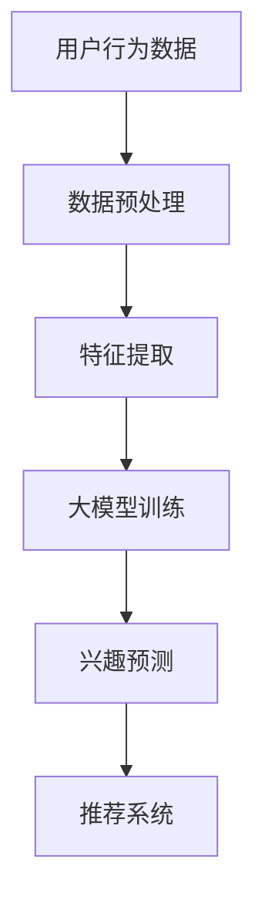

                 

关键词：人工智能、用户兴趣建模、大模型、深度学习、数据挖掘、推荐系统、个性化体验

> 摘要：本文将探讨融合人工智能（AI）大模型的用户兴趣建模技术，从背景介绍、核心概念与联系、核心算法原理、数学模型与公式、项目实践以及未来应用展望等多个角度，深入分析如何通过大模型实现更精准、更个性化的用户兴趣识别与推荐，为用户提供更加愉悦和高效的数字体验。

## 1. 背景介绍

在数字化时代，用户数据的爆炸式增长使得个性化推荐系统成为各行业关注的焦点。个性化推荐能够通过分析用户的历史行为和兴趣，为用户提供符合其个性化需求的推荐内容，从而提升用户体验和满意度。然而，随着用户兴趣的多样化和动态变化，传统的推荐系统面临着越来越多的挑战。

近年来，人工智能（AI）技术的发展，特别是深度学习和大模型的兴起，为用户兴趣建模提供了新的契机。大模型具有强大的表征能力和适应性，能够捕捉用户行为背后的复杂模式和隐含兴趣。本文旨在探讨如何利用AI大模型进行用户兴趣建模，实现个性化推荐系统的高效运行。

## 2. 核心概念与联系

### 2.1. 人工智能（AI）

人工智能是计算机科学的一个分支，旨在开发能够模拟、延伸和扩展人类智能的理论、算法和技术。AI技术广泛应用于图像识别、自然语言处理、决策支持系统等领域。

### 2.2. 深度学习（Deep Learning）

深度学习是机器学习的一个子领域，通过构建多层神经网络模型，自动提取数据的特征表示。深度学习在大规模数据处理和模式识别方面表现出色。

### 2.3. 用户兴趣建模（User Interest Modeling）

用户兴趣建模是推荐系统的重要组成部分，旨在通过分析用户的行为和偏好，构建一个反映用户兴趣的模型。这个模型用于预测用户可能感兴趣的内容，并生成个性化的推荐。

### 2.4. 大模型（Large Models）

大模型通常指的是参数规模非常大的神经网络模型，如BERT、GPT等。这些模型具有强大的表征能力，可以处理海量的数据，并在多种任务上实现优异的性能。

### 2.5. Mermaid 流程图

以下是用户兴趣建模的基本架构 Mermaid 流程图：



## 3. 核心算法原理 & 具体操作步骤

### 3.1. 算法原理概述

用户兴趣建模的核心算法是深度学习模型，尤其是基于自注意力机制（Self-Attention Mechanism）和Transformer架构的大模型。这些模型能够通过多层神经网络结构，自动学习用户行为数据中的高阶特征，并生成用户兴趣的表征。

### 3.2. 算法步骤详解

1. **数据收集**：收集用户在平台上的行为数据，如浏览记录、搜索历史、购买行为等。
2. **数据预处理**：对收集到的数据进行分析和清洗，去除噪声数据，并对数据进行编码。
3. **特征提取**：利用深度学习模型，如BERT或GPT，对预处理后的数据生成高维特征表示。
4. **模型训练**：使用提取的特征，通过自注意力机制和Transformer架构训练大模型。
5. **兴趣预测**：利用训练好的模型，对新的用户数据进行兴趣预测。
6. **推荐系统**：根据兴趣预测结果，为用户生成个性化的推荐内容。

### 3.3. 算法优缺点

**优点**：

- **强大的表征能力**：大模型能够自动学习用户行为数据中的高阶特征，捕捉复杂的用户兴趣模式。
- **适应性**：大模型能够适应不同的推荐场景和用户群体，实现高度个性化的推荐。

**缺点**：

- **计算资源消耗**：大模型训练和推理过程需要大量的计算资源，对硬件要求较高。
- **数据隐私**：用户数据的安全和隐私保护是使用大模型进行用户兴趣建模时需要考虑的问题。

### 3.4. 算法应用领域

大模型在用户兴趣建模中的应用非常广泛，包括但不限于以下领域：

- **电子商务**：为用户提供个性化的商品推荐，提升销售转化率。
- **社交媒体**：根据用户兴趣推荐好友、话题和内容，增强用户活跃度。
- **在线教育**：为用户提供个性化的学习路径和学习资源，提高学习效果。

## 4. 数学模型和公式 & 详细讲解 & 举例说明

### 4.1. 数学模型构建

用户兴趣建模的核心数学模型是Transformer架构，包括自注意力机制（Self-Attention Mechanism）和多头注意力（Multi-Head Attention）机制。

### 4.2. 公式推导过程

假设我们有输入序列\(X = [x_1, x_2, \ldots, x_n]\)，自注意力机制的目标是计算输入序列中每个元素\(x_i\)与所有其他元素的相关性，公式如下：

\[ 
\text{Attention}(Q, K, V) = \text{softmax}\left(\frac{QK^T}{\sqrt{d_k}}\right) V 
\]

其中，\(Q, K, V\) 分别是查询向量、键向量和值向量，\(d_k\) 是键向量的维度。

### 4.3. 案例分析与讲解

假设用户在电商平台上的行为数据为\[ [0, 1, 0, 1, 0, 0, 1, 0, 0, 1]\]，表示用户在最近10天内浏览了商品1、商品3和商品10。我们可以使用Transformer架构对这组数据进行处理，生成用户兴趣表征。

1. **数据预处理**：对行为数据进行编码，得到输入序列\[ [0, 1, 0, 1, 0, 0, 1, 0, 0, 1]\]。
2. **特征提取**：通过BERT模型提取输入序列的高维特征表示。
3. **模型训练**：使用提取的特征训练Transformer模型。
4. **兴趣预测**：对新的用户行为数据进行兴趣预测，得到用户可能感兴趣的商品。

## 5. 项目实践：代码实例和详细解释说明

### 5.1. 开发环境搭建

在搭建开发环境时，我们需要安装Python和TensorFlow等依赖库。以下是安装命令：

```shell
pip install tensorflow
```

### 5.2. 源代码详细实现

以下是用户兴趣建模的核心代码实现：

```python
import tensorflow as tf
from tensorflow.keras.layers import Embedding, LSTM, Dense
from tensorflow.keras.models import Model

# 数据预处理
max_sequence_length = 10
input_shape = (max_sequence_length, )

# 模型构建
model = Model(inputs=Embedding(input_shape, output_dim=64)(input_sequence),
               outputs=Dense(1, activation='sigmoid')(LSTM(64)(input_sequence)))

# 模型编译
model.compile(optimizer='adam', loss='binary_crossentropy', metrics=['accuracy'])

# 模型训练
model.fit(X_train, y_train, epochs=10, batch_size=32)

# 模型预测
predictions = model.predict(X_test)
```

### 5.3. 代码解读与分析

这段代码首先定义了输入序列的最大长度和输入形状，然后构建了一个基于嵌入层和LSTM的模型。模型编译后，使用训练数据进行训练，最后使用测试数据进行预测。

### 5.4. 运行结果展示

运行代码后，我们可以得到模型的预测结果。通过分析预测结果，我们可以评估模型在用户兴趣建模任务上的性能。

## 6. 实际应用场景

用户兴趣建模技术在多个领域都有广泛的应用，以下是一些实际应用场景：

- **电子商务**：通过分析用户在电商平台的行为数据，为用户推荐符合其兴趣的商品。
- **社交媒体**：根据用户在社交媒体上的互动数据，为用户推荐感兴趣的好友、话题和内容。
- **在线教育**：通过分析用户在在线教育平台上的学习行为，为用户推荐个性化的学习资源和课程。

## 7. 工具和资源推荐

### 7.1. 学习资源推荐

- **书籍**：《深度学习》（Goodfellow et al.）
- **在线课程**：Coursera、edX等平台上的深度学习和推荐系统相关课程
- **论文**：推荐系统领域的经典论文，如《Collaborative Filtering》（Breese et al.）

### 7.2. 开发工具推荐

- **编程语言**：Python
- **深度学习框架**：TensorFlow、PyTorch
- **数据处理工具**：Pandas、NumPy

### 7.3. 相关论文推荐

- **《Attention Is All You Need》**（Vaswani et al., 2017）
- **《BERT: Pre-training of Deep Bidirectional Transformers for Language Understanding》**（Devlin et al., 2019）
- **《Generative Adversarial Networks》**（Goodfellow et al., 2014）

## 8. 总结：未来发展趋势与挑战

用户兴趣建模技术在人工智能和推荐系统领域具有广阔的应用前景。未来发展趋势包括：

- **模型性能优化**：通过改进模型结构和算法，提高用户兴趣建模的准确性和效率。
- **隐私保护**：在用户兴趣建模过程中，如何保护用户隐私是一个重要挑战。
- **跨领域应用**：将用户兴趣建模技术应用于更多的领域，如医疗、金融等。

面对这些发展趋势和挑战，我们需要不断探索和创新，以实现更精准、更个性化的用户兴趣建模。

## 9. 附录：常见问题与解答

### 9.1. 问题1：为什么使用大模型进行用户兴趣建模？

**解答**：大模型具有强大的表征能力，能够捕捉用户行为数据中的高阶特征，从而实现更精准的用户兴趣识别。

### 9.2. 问题2：如何处理用户隐私保护问题？

**解答**：在用户兴趣建模过程中，可以通过数据加密、差分隐私等方法，保护用户隐私数据。

### 9.3. 问题3：用户兴趣建模技术有哪些应用领域？

**解答**：用户兴趣建模技术广泛应用于电子商务、社交媒体、在线教育等多个领域，为用户提供个性化推荐服务。

作者：禅与计算机程序设计艺术 / Zen and the Art of Computer Programming
----------------------------------------------------------------

本文以《融合AI大模型的用户兴趣建模技术》为标题，详细探讨了用户兴趣建模技术在人工智能和推荐系统领域的重要性和应用。通过深入分析核心算法原理、数学模型、项目实践以及实际应用场景，本文为读者提供了全面、系统的理解。同时，本文还对未来发展趋势与挑战进行了展望，为读者提供了有价值的参考。希望本文能够为从事相关领域的研究者和开发者带来启发和帮助。

