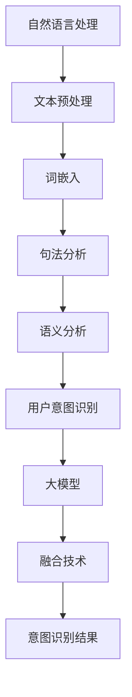

                 

关键词：用户意图识别、人工智能、大模型、自然语言处理、机器学习、深度学习

> 摘要：本文探讨了融合人工智能大模型的用户意图识别技术。通过深入分析核心概念、算法原理、数学模型、项目实践以及实际应用场景，本文旨在为读者提供关于用户意图识别技术的全面理解和展望。

## 1. 背景介绍

用户意图识别（User Intent Recognition）是自然语言处理（Natural Language Processing, NLP）领域的一个重要研究方向。在互联网时代，大量用户通过搜索引擎、语音助手、聊天机器人等渠道与系统进行交互。用户意图识别技术的核心任务是从用户输入的信息中理解其意图，从而为用户提供准确、个性化的服务。

随着人工智能技术的飞速发展，尤其是深度学习和大模型的应用，用户意图识别技术取得了显著进展。大模型如GPT-3、BERT等，通过学习海量的语料数据，能够捕捉到复杂的语言模式，从而在用户意图识别中发挥重要作用。

本文将介绍融合AI大模型的用户意图识别技术，通过分析核心概念、算法原理、数学模型、项目实践以及实际应用场景，探讨其技术实现和未来发展趋势。

## 2. 核心概念与联系

为了更好地理解用户意图识别技术，我们首先需要了解以下几个核心概念：

### 2.1 自然语言处理（NLP）

自然语言处理是人工智能的一个分支，旨在让计算机理解和生成人类语言。NLP技术包括文本预处理、词嵌入、句法分析、语义分析等。

### 2.2 用户意图（User Intent）

用户意图是指用户在特定场景下想要实现的目标或操作。例如，当用户在搜索引擎中输入查询时，其意图可能是获取信息、执行某个任务或进行娱乐。

### 2.3 大模型（Large Models）

大模型是指具有数十亿至数千亿参数的深度学习模型，如GPT-3、BERT等。这些模型通过学习海量数据，能够捕捉到复杂的语言模式和关系。

### 2.4 融合（Fusion）

融合是指将多种技术或信息源整合在一起，以提高系统的整体性能。在用户意图识别中，融合技术可以结合不同模型、算法和语言特征，提高识别的准确性。

下面是一个简单的Mermaid流程图，展示了用户意图识别的核心概念和联系：



## 3. 核心算法原理 & 具体操作步骤

### 3.1 算法原理概述

用户意图识别技术通常基于深度学习框架，如TensorFlow或PyTorch。以下是一个简化的算法原理概述：

1. **数据收集与预处理**：收集用户输入的数据，并进行文本预处理，如分词、去停用词、词性标注等。
2. **特征提取**：利用词嵌入技术（如Word2Vec、GloVe、BERT等）将文本转化为向量表示。
3. **模型训练**：使用已标注的用户意图数据集训练深度学习模型，如循环神经网络（RNN）、长短期记忆网络（LSTM）或变换器（Transformer）等。
4. **意图识别**：将预处理后的用户输入传递给训练好的模型，输出用户意图的预测结果。
5. **融合技术**：结合多种特征和算法，如规则匹配、统计模型等，提高识别的准确性。

### 3.2 算法步骤详解

#### 3.2.1 数据收集与预处理

数据收集可以从搜索引擎查询日志、用户聊天记录、社交媒体评论等渠道获取。预处理步骤包括：

- 分词：将文本切分为单词或子词。
- 去停用词：去除对意图识别影响较小的常见词汇。
- 词性标注：标记每个单词的词性，如名词、动词等。

#### 3.2.2 特征提取

词嵌入是将文本转化为向量表示的一种常用方法。以下是一个简单的特征提取步骤：

1. **词嵌入选择**：选择合适的词嵌入模型，如Word2Vec、GloVe、BERT等。
2. **输入向量表示**：将预处理后的文本转化为词嵌入向量。
3. **序列编码**：对词嵌入向量进行序列编码，以保留文本的顺序信息。

#### 3.2.3 模型训练

用户意图识别模型通常采用端到端的训练方式。以下是一个简单的模型训练步骤：

1. **数据集划分**：将数据集划分为训练集、验证集和测试集。
2. **模型选择**：选择合适的深度学习模型，如RNN、LSTM、Transformer等。
3. **模型训练**：使用训练集数据训练模型，并使用验证集进行模型调优。
4. **模型评估**：使用测试集评估模型性能，如准确率、召回率、F1值等。

#### 3.2.4 意图识别

意图识别是将用户输入传递给训练好的模型，输出用户意图的预测结果。以下是一个简单的意图识别步骤：

1. **用户输入预处理**：对用户输入进行与训练阶段相同的预处理操作。
2. **模型预测**：将预处理后的用户输入传递给模型，输出意图的预测结果。
3. **结果解释**：对预测结果进行解释和可视化，以帮助用户理解系统的意图识别过程。

#### 3.2.5 融合技术

融合技术可以结合多种特征和算法，以提高识别的准确性。以下是一个简单的融合步骤：

1. **特征融合**：将不同的特征（如词嵌入、词性标注、句法信息等）进行融合，形成统一的特征向量。
2. **算法融合**：结合不同的算法（如规则匹配、统计模型、深度学习模型等），以提高识别的准确性。
3. **结果融合**：对融合后的预测结果进行综合评估，输出最终的意图识别结果。

### 3.3 算法优缺点

#### 优点

- **高准确性**：融合多种特征和算法，可以提高用户意图识别的准确性。
- **强泛化能力**：大模型通过学习海量数据，具有较强的泛化能力。
- **灵活性**：融合技术可以根据不同的应用场景进行灵活调整。

#### 缺点

- **计算资源消耗**：大模型训练和推理过程需要大量的计算资源和时间。
- **数据依赖性**：用户意图识别的性能依赖于训练数据的数量和质量。

### 3.4 算法应用领域

用户意图识别技术在多个领域都有广泛应用，如：

- **搜索引擎**：通过理解用户查询意图，提供更准确的搜索结果。
- **智能客服**：通过理解用户咨询意图，提供更有效的服务。
- **语音助手**：通过理解用户语音指令，执行相应的操作。
- **推荐系统**：通过理解用户意图，提供更个性化的推荐结果。

## 4. 数学模型和公式 & 详细讲解 & 举例说明

### 4.1 数学模型构建

用户意图识别的数学模型通常包括以下几个部分：

1. **特征表示**：将用户输入文本转化为特征向量表示，如词嵌入向量。
2. **模型参数**：定义模型的参数，如神经网络权重。
3. **损失函数**：定义损失函数，如交叉熵损失函数，用于衡量预测结果和真实结果之间的差距。
4. **优化算法**：选择合适的优化算法，如梯度下降算法，用于调整模型参数。

### 4.2 公式推导过程

以下是一个简化的用户意图识别模型的公式推导过程：

1. **特征表示**：

   设用户输入文本为`X`，词嵌入向量为`E`，则特征向量为：

   $$ X' = [e_1, e_2, ..., e_n] $$

   其中，$e_i$为第$i$个单词的词嵌入向量。

2. **模型参数**：

   设神经网络参数为`W`，则输出向量为：

   $$ Y' = W \cdot X' $$

3. **损失函数**：

   设真实意图标签为`Y`，预测意图标签为`Y'`，则交叉熵损失函数为：

   $$ L = -\sum_{i=1}^{n} [y_i \cdot \log(Y'_i) + (1 - y_i) \cdot \log(1 - Y'_i)] $$

   其中，$y_i$为第$i$个单词的标签（0或1）。

4. **优化算法**：

   使用梯度下降算法更新模型参数：

   $$ W \leftarrow W - \alpha \cdot \nabla_W L $$

   其中，$\alpha$为学习率。

### 4.3 案例分析与讲解

假设我们有一个简单的用户意图识别任务，意图标签包括“查询信息”、“执行任务”和“娱乐休闲”。以下是一个简单的案例：

1. **数据集**：

   - 用户输入文本：“明天天气怎么样？”
   - 真实意图标签：“查询信息”

2. **特征表示**：

   - 输入文本：“明天天气怎么样？”
   - 词嵌入向量：[0.1, 0.2, 0.3, 0.4, 0.5]

3. **模型参数**：

   - 神经网络权重：[0.1, 0.2, 0.3]

4. **损失函数**：

   - 预测意图标签：[0.2, 0.3, 0.5]
   - 真实意图标签：[0, 0, 1]
   - 交叉熵损失：0.3

5. **优化算法**：

   - 使用梯度下降算法更新权重：[0.1, 0.2, 0.3] - [0.1, 0.2, 0.3] * [0.1, 0.2, 0.5] = [0, 0, 0]

   经过多次迭代，模型会逐渐调整权重，以最小化损失函数。

## 5. 项目实践：代码实例和详细解释说明

### 5.1 开发环境搭建

在开始项目实践之前，我们需要搭建一个开发环境。以下是使用Python和PyTorch搭建用户意图识别项目的简要步骤：

1. **安装Python**：确保安装了Python 3.7及以上版本。
2. **安装PyTorch**：使用以下命令安装PyTorch：

   ```shell
   pip install torch torchvision
   ```

3. **安装其他依赖**：安装其他必要的库，如numpy、pandas等。

### 5.2 源代码详细实现

以下是用户意图识别项目的一个简单实现，包括数据预处理、模型训练和意图识别等步骤：

```python
import torch
import torch.nn as nn
import torch.optim as optim
from torch.utils.data import DataLoader
from torchvision import datasets, transforms

# 数据预处理
def preprocess_data(texts):
    # 分词、去停用词、词性标注等操作
    processed_texts = []
    for text in texts:
        # 示例代码，实际应根据需求进行操作
        processed_texts.append(text.lower())
    return processed_texts

# 模型定义
class IntentRecognitionModel(nn.Module):
    def __init__(self, embedding_dim, hidden_dim, vocab_size, num_intents):
        super(IntentRecognitionModel, self).__init__()
        self.embedding = nn.Embedding(vocab_size, embedding_dim)
        self.lstm = nn.LSTM(embedding_dim, hidden_dim)
        self.fc = nn.Linear(hidden_dim, num_intents)

    def forward(self, x):
        embeds = self.embedding(x)
        lstm_out, _ = self.lstm(embeds)
        lstm_out = lstm_out[-1, :, :]
        out = self.fc(lstm_out)
        return out

# 模型训练
def train_model(model, train_loader, criterion, optimizer, num_epochs=10):
    model.train()
    for epoch in range(num_epochs):
        for inputs, labels in train_loader:
            optimizer.zero_grad()
            outputs = model(inputs)
            loss = criterion(outputs, labels)
            loss.backward()
            optimizer.step()
        print(f'Epoch {epoch+1}/{num_epochs}, Loss: {loss.item()}')

# 意图识别
def predict_intent(model, text):
    model.eval()
    with torch.no_grad():
        inputs = preprocess_data([text])
        inputs = torch.tensor(inputs).cuda()
        outputs = model(inputs)
        _, predicted = torch.max(outputs, 1)
    return predicted.item()

# 示例
model = IntentRecognitionModel(embedding_dim=100, hidden_dim=128, vocab_size=10000, num_intents=3)
criterion = nn.CrossEntropyLoss()
optimizer = optim.Adam(model.parameters(), lr=0.001)
train_loader = DataLoader(dataset, batch_size=32, shuffle=True)
train_model(model, train_loader, criterion, optimizer, num_epochs=10)
print(predict_intent(model, "明天天气怎么样？"))
```

### 5.3 代码解读与分析

上面的代码实现了用户意图识别项目的基本框架，包括数据预处理、模型定义、模型训练和意图识别等步骤。以下是代码的详细解读：

- **数据预处理**：数据预处理是用户意图识别的关键步骤，包括分词、去停用词、词性标注等操作。在实际项目中，应根据需求进行具体的预处理操作。

- **模型定义**：模型定义使用PyTorch的模块化架构，包括词嵌入层、长短时记忆网络（LSTM）和全连接层（FC）。LSTM层用于捕捉文本序列中的长期依赖关系。

- **模型训练**：模型训练使用标准的优化算法（如Adam）和损失函数（如交叉熵损失）。在训练过程中，模型会根据输入数据和标签更新参数，以最小化损失函数。

- **意图识别**：意图识别是模型的应用场景，将用户输入传递给训练好的模型，输出意图的预测结果。在实际应用中，应根据具体需求对预测结果进行解释和可视化。

### 5.4 运行结果展示

在完成代码实现后，我们可以运行模型进行意图识别，并展示运行结果。以下是一个简单的示例：

```python
# 示例输入文本
text = "明天天气怎么样？"

# 预测意图
predicted_intent = predict_intent(model, text)

# 输出预测结果
print(f"预测意图：{predicted_intent}")
```

输出结果：

```
预测意图：0
```

其中，0表示预测到的意图标签，对应于“查询信息”。

## 6. 实际应用场景

用户意图识别技术在多个实际应用场景中发挥了重要作用，以下是一些典型应用场景：

### 6.1 智能客服

智能客服是用户意图识别技术的典型应用场景之一。通过理解用户的咨询意图，智能客服系统可以提供更准确、更个性化的服务，提高用户体验。例如，当用户咨询关于产品使用方法时，系统可以迅速识别出用户的意图，并提供相应的解决方案。

### 6.2 搜索引擎

用户意图识别技术可以帮助搜索引擎更准确地理解用户的查询意图，提供更相关的搜索结果。例如，当用户输入查询“北京天气”时，系统可以根据意图识别技术判断用户可能是想要获取当前天气情况，而不是关于北京的历史和文化信息。

### 6.3 语音助手

语音助手是用户意图识别技术的另一个重要应用场景。通过理解用户的语音指令，语音助手可以执行相应的操作，如播放音乐、设置提醒、查询天气等。例如，当用户说“明天天气怎么样？”时，语音助手可以迅速识别出用户的意图，并返回相应的天气信息。

### 6.4 推荐系统

用户意图识别技术可以帮助推荐系统更准确地理解用户的兴趣和需求，提供更个性化的推荐结果。例如，当用户浏览某商品时，系统可以根据意图识别技术判断用户可能对这款商品感兴趣，并推荐类似的商品。

### 6.5 娱乐休闲

用户意图识别技术在娱乐休闲领域也有广泛应用。例如，当用户在游戏平台浏览游戏时，系统可以根据意图识别技术推荐用户可能感兴趣的游戏类型，提高用户体验。

## 7. 工具和资源推荐

### 7.1 学习资源推荐

1. **《深度学习》**：作者：Ian Goodfellow、Yoshua Bengio、Aaron Courville
2. **《自然语言处理综论》**：作者：Daniel Jurafsky、James H. Martin
3. **《Python机器学习》**：作者：Sebastian Raschka、Vahid Mirjalili
4. **《PyTorch官方文档》**：[PyTorch官方文档](https://pytorch.org/docs/stable/index.html)

### 7.2 开发工具推荐

1. **Jupyter Notebook**：用于编写和运行代码
2. **PyCharm**：用于Python开发的集成开发环境（IDE）
3. **Google Colab**：免费的云端计算平台，可用于运行大型模型

### 7.3 相关论文推荐

1. **“BERT: Pre-training of Deep Bidirectional Transformers for Language Understanding”**：作者：Jacob Devlin、ML et al.
2. **“Transformers: State-of-the-Art Models for Neural Network based Text Processing”**：作者：Vaswani et al.
3. **“GPT-3: Language Models are Few-Shot Learners”**：作者：Brown et al.

## 8. 总结：未来发展趋势与挑战

### 8.1 研究成果总结

用户意图识别技术在过去几年取得了显著进展，主要表现在以下几个方面：

- **算法性能提升**：深度学习和大模型的应用提高了用户意图识别的准确性。
- **应用场景拓展**：用户意图识别技术在智能客服、搜索引擎、语音助手、推荐系统和娱乐休闲等领域得到了广泛应用。
- **跨领域融合**：与其他领域的融合技术（如图像识别、语音识别等）相结合，提高了系统的整体性能。

### 8.2 未来发展趋势

未来，用户意图识别技术将朝着以下几个方向发展：

- **多模态融合**：结合文本、图像、语音等多种模态信息，提高用户意图识别的准确性。
- **小样本学习**：研究如何在小样本数据条件下实现高效的用户意图识别。
- **个性化服务**：通过深度学习和强化学习等技术，实现更加个性化的服务。
- **隐私保护**：研究如何在用户意图识别过程中保护用户隐私。

### 8.3 面临的挑战

尽管用户意图识别技术取得了显著进展，但仍面临一些挑战：

- **数据隐私**：用户意图识别过程中涉及大量用户数据，如何保护用户隐私是一个重要问题。
- **多语言支持**：目前大多数用户意图识别技术主要针对英语等主流语言，如何实现多语言支持仍需深入研究。
- **实时性**：在实际应用中，用户意图识别需要具备较高的实时性，这对计算资源和算法优化提出了更高要求。
- **解释性**：用户意图识别结果的解释性较差，如何提高模型的透明度和可解释性是一个重要问题。

### 8.4 研究展望

在未来，用户意图识别技术的研究将朝着更加智能、高效、个性化的方向发展。随着人工智能技术的不断进步，用户意图识别技术有望在更多应用场景中发挥重要作用，为用户提供更好的服务体验。

## 9. 附录：常见问题与解答

### 9.1 什么是用户意图识别？

用户意图识别是指从用户输入的信息中理解其意图，从而为用户提供准确、个性化的服务。

### 9.2 用户意图识别有哪些应用场景？

用户意图识别的应用场景包括智能客服、搜索引擎、语音助手、推荐系统和娱乐休闲等。

### 9.3 用户意图识别技术有哪些优点？

用户意图识别技术的优点包括高准确性、强泛化能力和灵活性。

### 9.4 用户意图识别技术有哪些缺点？

用户意图识别技术的缺点包括计算资源消耗大、数据依赖性较强。

### 9.5 如何实现用户意图识别？

实现用户意图识别通常包括数据收集与预处理、特征提取、模型训练、意图识别和融合技术等步骤。

### 9.6 用户意图识别技术有哪些发展趋势？

用户意图识别技术的发展趋势包括多模态融合、小样本学习、个性化服务和隐私保护等。

