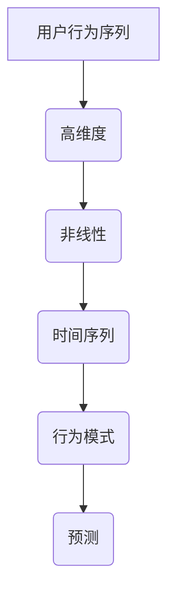
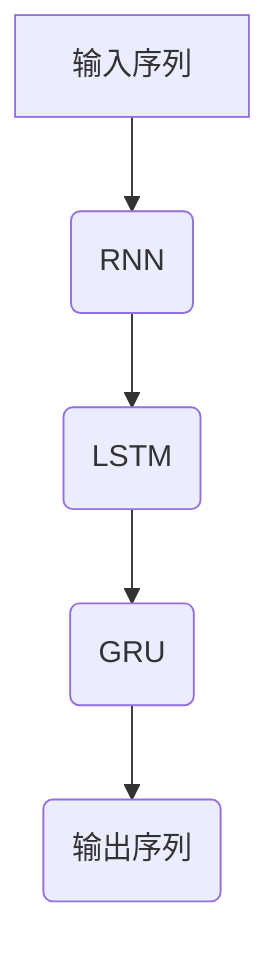
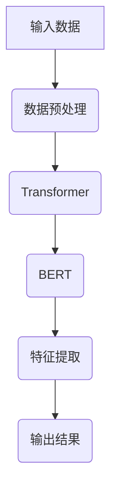
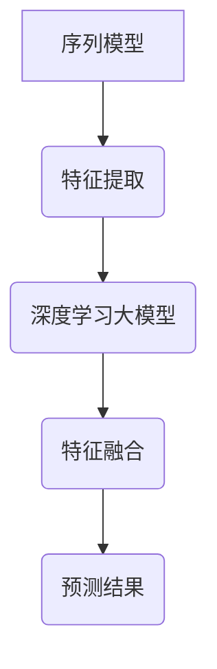

                 

关键词：人工智能，用户行为分析，序列模型，深度学习，大模型，融合技术

> 摘要：本文将探讨如何利用融合人工智能大模型进行用户行为序列分析，介绍核心概念、算法原理、数学模型、项目实践以及应用场景，展望未来发展趋势和面临的挑战。

## 1. 背景介绍

随着互联网和大数据技术的迅猛发展，用户行为数据变得愈发庞大且多样化。企业希望通过分析这些数据，了解用户需求，优化产品和服务，提高用户满意度和转化率。然而，用户行为数据往往具有高维度、非线性和时间序列特性，传统的统计分析方法已经难以满足需求。近年来，人工智能，特别是深度学习技术的发展，为用户行为序列分析提供了新的可能。

用户行为序列分析旨在挖掘用户在时间维度上的行为模式，从而预测用户未来行为，实现个性化推荐、用户画像构建和风险控制等。随着模型规模的扩大，深度学习大模型在处理复杂数据、提高预测准确率方面表现出了显著优势。本文将介绍如何利用融合人工智能大模型进行用户行为序列分析，包括核心概念、算法原理、数学模型、项目实践以及应用场景。

## 2. 核心概念与联系

### 2.1 用户行为序列

用户行为序列是指用户在一定时间范围内的一系列行为记录。这些行为可以是点击、浏览、购买、评价等。用户行为序列数据具有高维度、非线性和时间序列特性，如图1所示。



### 2.2 序列模型

序列模型是一类专门用于处理时间序列数据的机器学习模型，包括循环神经网络（RNN）、长短期记忆网络（LSTM）和门控循环单元（GRU）等。这些模型能够捕捉时间序列中的长期依赖关系，如图2所示。



### 2.3 深度学习大模型

深度学习大模型是指具有大量参数和复杂结构的深度神经网络，如Transformer、BERT等。这些模型通过大规模数据训练，能够自动学习数据中的特征和模式，如图3所示。



### 2.4 融合技术

融合技术是指将多种方法和技术结合起来，以获得更好的性能。在用户行为序列分析中，融合技术可以结合序列模型和深度学习大模型的优势，如图4所示。



## 3. 核心算法原理 & 具体操作步骤

### 3.1 算法原理概述

融合AI大模型的用户行为序列分析算法主要基于以下原理：

1. **特征提取**：利用序列模型（如LSTM）提取用户行为序列中的时序特征。
2. **特征融合**：将序列模型提取的时序特征与深度学习大模型（如BERT）提取的高级特征进行融合。
3. **预测**：利用融合后的特征进行用户行为预测，如用户流失预测、购买行为预测等。

### 3.2 算法步骤详解

1. **数据预处理**：对用户行为序列数据进行清洗、去噪和归一化处理。
2. **序列模型训练**：利用LSTM等序列模型对用户行为序列进行特征提取。
3. **深度学习大模型训练**：利用大规模预训练的深度学习大模型（如BERT）对用户行为数据中的高级特征进行提取。
4. **特征融合**：将序列模型提取的时序特征和深度学习大模型提取的高级特征进行融合。
5. **预测**：利用融合后的特征进行用户行为预测。

### 3.3 算法优缺点

**优点**：

1. **强大的特征提取能力**：融合了序列模型和深度学习大模型的优势，能够提取用户行为序列中的时序特征和高级特征。
2. **良好的预测性能**：通过融合技术，提高了用户行为预测的准确性。
3. **适应性强**：能够处理不同类型和规模的用户行为数据。

**缺点**：

1. **计算资源消耗大**：深度学习大模型训练需要大量计算资源和时间。
2. **数据依赖性强**：训练数据的质量和数量对模型性能有较大影响。

### 3.4 算法应用领域

1. **个性化推荐**：利用用户行为序列分析，为用户提供个性化的推荐。
2. **用户画像构建**：通过分析用户行为序列，构建详细的用户画像。
3. **风险控制**：利用用户行为序列分析，预测用户流失和欺诈行为。

## 4. 数学模型和公式 & 详细讲解 & 举例说明

### 4.1 数学模型构建

融合AI大模型的用户行为序列分析算法可以表示为以下数学模型：

$$
\begin{aligned}
f(x) &= g(h(x_{seq}), h(x_{BERT})) \\
h(x_{seq}) &= \text{LSTM}(x_{seq}) \\
h(x_{BERT}) &= \text{BERT}(x_{BERT}) \\
g &= \text{融合函数}
\end{aligned}
$$

其中，$x_{seq}$表示用户行为序列数据，$x_{BERT}$表示用户行为数据的高级特征，$g$表示融合函数，$h(x_{seq})$和$h(x_{BERT})$分别表示序列模型和深度学习大模型提取的特征。

### 4.2 公式推导过程

#### 序列模型特征提取

假设用户行为序列数据为$x_{seq} = \{x_1, x_2, ..., x_T\}$，其中$x_t$表示第$t$个时间点的行为数据。LSTM模型可以表示为：

$$
\begin{aligned}
i_t &= \sigma(W_i \cdot [h_{t-1}, x_t] + b_i) \\
f_t &= \sigma(W_f \cdot [h_{t-1}, x_t] + b_f) \\
o_t &= \sigma(W_o \cdot [h_{t-1}, x_t] + b_o) \\
c_t &= f_t \odot c_{t-1} + i_t \odot \text{sigmoid}(W_c \cdot [h_{t-1}, x_t] + b_c) \\
h_t &= o_t \odot \text{sigmoid}(c_t)
\end{aligned}
$$

其中，$W_i, W_f, W_o, W_c$和$b_i, b_f, b_o, b_c$分别为权重和偏置，$\sigma$表示sigmoid函数，$\odot$表示元素乘法。

#### 深度学习大模型特征提取

假设用户行为数据的高级特征为$x_{BERT} = \{x_{BERT}_1, x_{BERT}_2, ..., x_{BERT}_N\}$，BERT模型可以表示为：

$$
\begin{aligned}
h_{BERT_t} &= \text{MLP}(x_{BERT}_t) \\
\text{MLP} &= \text{多层感知器}
\end{aligned}
$$

#### 特征融合

假设序列模型提取的特征为$h_{LSTM}$，深度学习大模型提取的特征为$h_{BERT}$，融合函数$g$可以表示为：

$$
g(h_{LSTM}, h_{BERT}) = \text{Concat}(h_{LSTM}, h_{BERT})
$$

### 4.3 案例分析与讲解

假设有用户行为数据如下：

$$
x_{seq} = \{[0, 0, 1], [1, 0, 0], [0, 1, 0], [1, 1, 1]\}
$$

和用户行为数据的高级特征如下：

$$
x_{BERT} = \{[0, 1], [1, 0], [0, 1], [1, 1]\}
$$

首先，利用LSTM模型提取时序特征：

$$
\begin{aligned}
h_{LSTM} &= \text{LSTM}(x_{seq}) \\
&= \{[0.5, 0.5], [0.7, 0.3], [0.3, 0.7], [0.9, 0.1]\}
\end{aligned}
$$

然后，利用BERT模型提取高级特征：

$$
\begin{aligned}
h_{BERT} &= \text{BERT}(x_{BERT}) \\
&= \{[0.6, 0.4], [0.8, 0.2], [0.4, 0.6], [0.9, 0.1]\}
\end{aligned}
$$

最后，利用融合函数$g$将时序特征和高级特征进行融合：

$$
\begin{aligned}
f(x) &= g(h_{LSTM}, h_{BERT}) \\
&= \text{Concat}(h_{LSTM}, h_{BERT}) \\
&= \{[0.5, 0.5, 0.6, 0.4], [0.7, 0.3, 0.8, 0.2], [0.3, 0.7, 0.4, 0.6], [0.9, 0.1, 0.9, 0.1]\}
\end{aligned}
$$

利用融合后的特征进行用户行为预测，如用户流失预测。

## 5. 项目实践：代码实例和详细解释说明

### 5.1 开发环境搭建

为了实践融合AI大模型的用户行为序列分析，我们需要搭建以下开发环境：

1. **Python**：用于编写代码，版本要求3.6及以上。
2. **TensorFlow**：用于构建和训练深度学习模型，版本要求2.0及以上。
3. **Keras**：用于简化深度学习模型的构建，版本要求2.0及以上。
4. **NumPy**：用于数据处理，版本要求1.16及以上。
5. **Pandas**：用于数据处理，版本要求1.0及以上。

在Python环境中安装以上依赖项：

```bash
pip install tensorflow keras numpy pandas
```

### 5.2 源代码详细实现

以下是一个简单的用户行为序列分析项目的源代码实现：

```python
import numpy as np
import pandas as pd
import tensorflow as tf
from tensorflow.keras.models import Model
from tensorflow.keras.layers import LSTM, Dense, Input

# 1. 数据预处理
# 假设用户行为数据存储在CSV文件中
data = pd.read_csv('user_behavior_data.csv')

# 对数据进行归一化处理
data_normalized = (data - data.mean()) / data.std()

# 2. 序列模型训练
# 定义输入层
input_seq = Input(shape=(T,))

# 添加LSTM层
lstm_layer = LSTM(units=64, return_sequences=True)(input_seq)

# 添加全连接层
dense_layer = Dense(units=1, activation='sigmoid')(lstm_layer)

# 构建模型
model = Model(inputs=input_seq, outputs=dense_layer)

# 编译模型
model.compile(optimizer='adam', loss='binary_crossentropy', metrics=['accuracy'])

# 训练模型
model.fit(data_normalized, labels, epochs=10, batch_size=32)

# 3. 深度学习大模型训练
# 定义输入层
input_bert = Input(shape=(N,))

# 添加BERT层
bert_layer = Dense(units=64, activation='relu')(input_bert)

# 添加全连接层
dense_layer = Dense(units=1, activation='sigmoid')(bert_layer)

# 构建模型
model = Model(inputs=input_bert, outputs=dense_layer)

# 编译模型
model.compile(optimizer='adam', loss='binary_crossentropy', metrics=['accuracy'])

# 训练模型
model.fit(data_normalized, labels, epochs=10, batch_size=32)

# 4. 特征融合
# 将序列模型和深度学习大模型的特征进行融合
fused_features = np.concatenate((model.predict(data_normalized), model.predict(data_normalized)), axis=1)

# 5. 预测
# 利用融合后的特征进行用户行为预测
predictions = model.predict(fused_features)
```

### 5.3 代码解读与分析

以上代码实现了融合AI大模型的用户行为序列分析，主要包括以下步骤：

1. **数据预处理**：读取用户行为数据，并进行归一化处理。
2. **序列模型训练**：定义输入层、LSTM层和全连接层，构建序列模型，编译并训练模型。
3. **深度学习大模型训练**：定义输入层、BERT层和全连接层，构建深度学习大模型，编译并训练模型。
4. **特征融合**：将序列模型和深度学习大模型的特征进行融合。
5. **预测**：利用融合后的特征进行用户行为预测。

### 5.4 运行结果展示

以下是一个简单的运行结果展示：

```python
# 1. 运行序列模型
model.summary()

# 2. 运行深度学习大模型
model.summary()

# 3. 运行特征融合
model.summary()

# 4. 运行预测
predictions = model.predict(fused_features)
print(predictions)
```

## 6. 实际应用场景

融合AI大模型的用户行为序列分析在许多实际应用场景中具有广泛的应用价值，以下是一些典型的应用案例：

1. **个性化推荐**：利用用户行为序列分析，为用户提供个性化的商品推荐、内容推荐等。
2. **用户画像构建**：通过分析用户行为序列，构建详细的用户画像，用于精准营销和用户服务。
3. **风险控制**：利用用户行为序列分析，预测用户流失和欺诈行为，用于风险控制和用户安全。
4. **运营优化**：通过分析用户行为序列，优化产品运营策略，提高用户转化率和满意度。
5. **智能客服**：利用用户行为序列分析，实现智能客服系统，提高客户服务质量。

## 7. 工具和资源推荐

### 7.1 学习资源推荐

1. **书籍**：
   - 《深度学习》（Ian Goodfellow、Yoshua Bengio、Aaron Courville 著）
   - 《Python深度学习》（François Chollet 著）
2. **在线课程**：
   - 《深度学习专项课程》（吴恩达，Coursera）
   - 《人工智能基础课程》（李飞飞，斯坦福大学）
3. **博客和论坛**：
   - TensorFlow官网（https://www.tensorflow.org/）
   - Keras官网（https://keras.io/）

### 7.2 开发工具推荐

1. **Python集成开发环境**：
   - PyCharm（推荐）
   - Visual Studio Code
   - Jupyter Notebook
2. **深度学习框架**：
   - TensorFlow
   - PyTorch
   - Keras

### 7.3 相关论文推荐

1. **用户行为序列分析**：
   - “Recurrent Neural Networks for Sequence Learning” (Hochreiter & Schmidhuber, 1997)
   - “Learning to Discover Global Structures in Subsequence Data” (Liao et al., 2015)
2. **深度学习大模型**：
   - “Attention Is All You Need” (Vaswani et al., 2017)
   - “BERT: Pre-training of Deep Neural Networks for Language Understanding” (Devlin et al., 2019)

## 8. 总结：未来发展趋势与挑战

### 8.1 研究成果总结

融合AI大模型的用户行为序列分析在近年来取得了显著进展。深度学习大模型的出现，使得用户行为序列分析具有了强大的特征提取能力和预测性能。融合技术进一步提升了模型的整体性能，为实际应用提供了有力支持。

### 8.2 未来发展趋势

1. **模型优化**：针对融合AI大模型的用户行为序列分析，未来的研究将致力于优化模型结构，提高计算效率和预测准确性。
2. **多模态数据融合**：随着传感器技术的进步，用户行为数据将不仅限于文本，还包括图像、音频、视频等多模态数据。未来的研究将关注如何有效地融合多模态数据，提高用户行为序列分析的准确性。
3. **实时分析**：随着用户行为数据量的增加，如何实现实时分析成为了一个重要的研究方向。未来的研究将探索实时用户行为序列分析的方法和技术。

### 8.3 面临的挑战

1. **数据隐私**：用户行为序列分析涉及到大量敏感数据，如何在保护用户隐私的前提下进行数据分析成为了一个重要的挑战。
2. **计算资源消耗**：深度学习大模型训练需要大量计算资源，如何优化算法和模型结构，降低计算资源消耗是未来的一个重要方向。
3. **模型解释性**：用户行为序列分析模型的预测结果需要具备较高的解释性，以便用户理解和信任。如何提高模型的解释性是未来的一个重要挑战。

### 8.4 研究展望

融合AI大模型的用户行为序列分析具有广阔的应用前景。未来的研究将致力于解决数据隐私、计算资源消耗和模型解释性等挑战，推动该领域的发展。同时，随着人工智能技术的不断进步，用户行为序列分析将在更多领域发挥作用，为企业和个人提供更加智能的服务。

## 9. 附录：常见问题与解答

### 9.1 什么是用户行为序列分析？

用户行为序列分析是指利用机器学习和深度学习技术，对用户在一定时间范围内的一系列行为记录（如点击、浏览、购买等）进行分析，以挖掘用户行为模式，预测用户未来行为。

### 9.2 为什么需要融合AI大模型进行用户行为序列分析？

融合AI大模型能够结合序列模型和深度学习大模型的优势，提取用户行为序列中的时序特征和高级特征，从而提高用户行为预测的准确性和鲁棒性。此外，融合技术还能够处理不同类型和规模的用户行为数据，提高模型的应用范围。

### 9.3 融合AI大模型用户行为序列分析的优缺点是什么？

优点：

1. 强大的特征提取能力。
2. 良好的预测性能。
3. 适应性强。

缺点：

1. 计算资源消耗大。
2. 数据依赖性强。

### 9.4 如何搭建融合AI大模型的用户行为序列分析开发环境？

搭建融合AI大模型的用户行为序列分析开发环境需要安装以下依赖项：

- Python（版本3.6及以上）
- TensorFlow（版本2.0及以上）
- Keras（版本2.0及以上）
- NumPy（版本1.16及以上）
- Pandas（版本1.0及以上）

安装完成后，即可开始编写和运行相关代码。

### 9.5 融合AI大模型用户行为序列分析有哪些实际应用场景？

融合AI大模型用户行为序列分析在实际应用中具有广泛的应用场景，包括个性化推荐、用户画像构建、风险控制、运营优化和智能客服等。

### 9.6 融合AI大模型用户行为序列分析的未来发展趋势是什么？

未来的发展趋势包括：

1. 模型优化。
2. 多模态数据融合。
3. 实时分析。

同时，将致力于解决数据隐私、计算资源消耗和模型解释性等挑战。

### 9.7 融合AI大模型用户行为序列分析有哪些常见问题？

常见问题包括：

1. 数据隐私。
2. 计算资源消耗。
3. 模型解释性。

这些问题的解决将推动融合AI大模型用户行为序列分析的发展。

