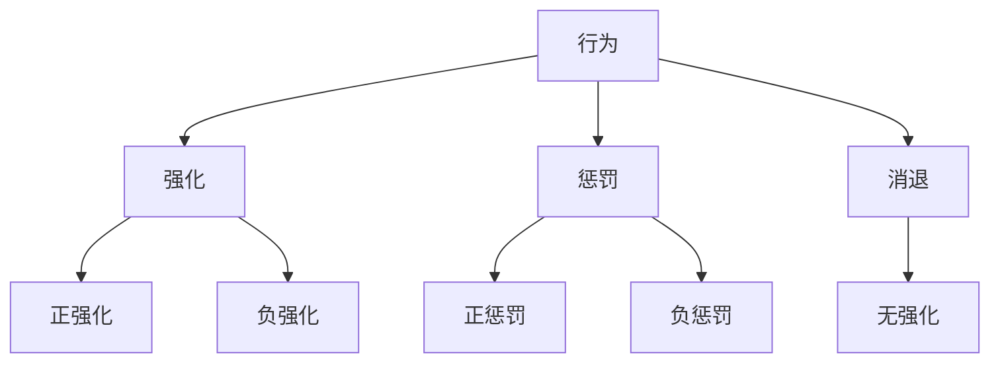
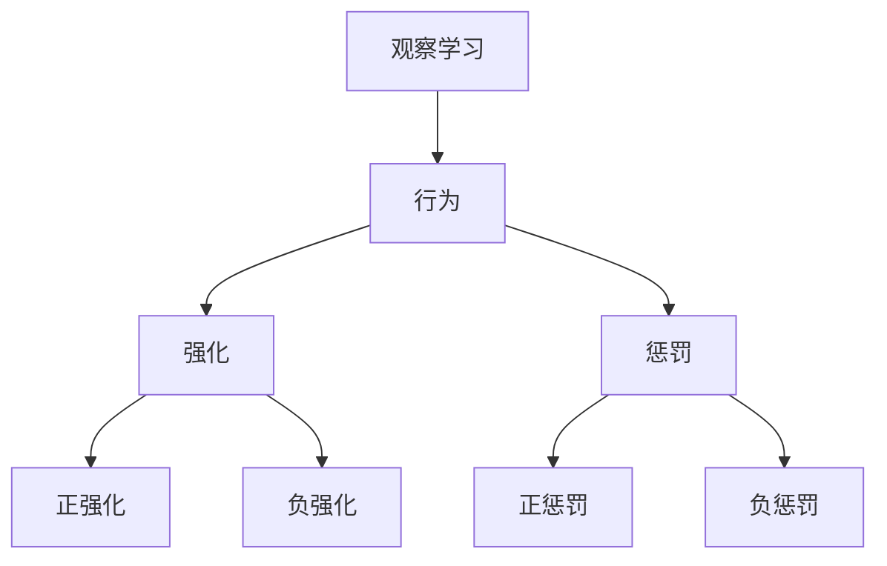

                 

行为改变理论是一种重要的心理学理论，它帮助我们理解和预测人们行为的改变。在团队建设中，如何有效引导团队成员改变不良行为，提升团队整体绩效，是每一个团队领导者都需要面对的挑战。本文将探讨行为改变理论在团队建设中的应用，通过分析该理论的核心概念，提供具体的应用策略和案例，旨在为团队领导者提供实用的指导。

## 1. 背景介绍

### 行为改变理论的发展历程

行为改变理论起源于20世纪50年代的美国，是由行为主义心理学派提出并发展的。行为主义心理学认为，人类行为是后天习得的，通过适当的强化和条件作用，可以改变和塑造人们的行为。经典的行为改变理论包括斯金纳的操作性条件反射理论和班杜拉的观察学习理论。斯金纳提出了强化理论，认为行为的结果会影响行为的再次发生；而班杜拉则强调观察学习的作用，认为人们可以通过观察他人的行为结果来调整自己的行为。

### 团队建设中的挑战

在团队建设过程中，团队领导者常常面临以下挑战：

- **沟通障碍**：团队成员之间的沟通不畅，导致信息传递失真，影响团队协作。
- **成员异质性**：团队成员背景、技能和经验差异较大，导致协作难度增加。
- **不良行为**：个别成员存在不良行为，如拖延、缺乏责任感等，影响团队整体绩效。
- **文化冲突**：团队成员来自不同文化背景，文化差异可能导致误解和冲突。

## 2. 核心概念与联系

### 行为改变理论的核心概念

行为改变理论的核心概念包括：

- **行为**：指个体在外部刺激下所表现出的动作或反应。
- **强化**：指任何能够增加行为发生频率的因素，包括正强化（奖励）和负强化（撤销惩罚）。
- **惩罚**：指任何能够减少行为发生频率的因素，包括正惩罚（施加惩罚）和负惩罚（撤销奖励）。
- **消退**：指在无强化条件下，行为发生频率逐渐降低。

### 行为改变理论的架构

下面是一个使用Mermaid绘制的流程图，展示了行为改变理论的核心概念及其相互关系。



### 行为改变理论在团队建设中的应用

在团队建设中，行为改变理论可以应用于以下几个方面：

- **激励与奖励**：通过设定明确的奖励机制，鼓励团队成员展现积极行为，如按时完成任务、提出创新方案等。
- **惩罚与约束**：对于违反团队规定或影响团队绩效的不良行为，可以采取适当的惩罚措施，如警告、扣分等，以约束团队成员的行为。
- **行为观察与反馈**：通过观察团队成员的行为，及时给予反馈，帮助成员认识到自己的行为问题，并提供改进的方向。

## 3. 核心算法原理 & 具体操作步骤

### 3.1 算法原理概述

行为改变理论的核心算法是基于强化学习机制，通过不断调整行为和强化策略，以实现行为改变。具体包括以下几个步骤：

1. **行为识别**：识别需要改变的行为。
2. **强化设定**：设定正强化和负强化机制。
3. **行为执行**：执行既定的行为，并根据行为结果调整强化策略。
4. **反馈与调整**：根据反馈结果，调整行为和强化策略，直至达到预期效果。

### 3.2 算法步骤详解

1. **行为识别**：首先需要明确需要改变的行为，例如拖延、缺乏责任感等。这可以通过团队成员的自我评估、同事反馈和领导观察等多种方式完成。

2. **强化设定**：根据行为识别的结果，设定正强化和负强化机制。正强化可以通过奖励（如奖金、表扬等）来鼓励团队成员展现积极行为；负强化可以通过惩罚（如扣分、警告等）来约束不良行为。

3. **行为执行**：在明确了强化机制后，团队成员开始执行既定的行为。在此过程中，领导需要密切关注团队成员的行为表现，及时给予反馈。

4. **反馈与调整**：根据反馈结果，调整行为和强化策略。如果行为得到了强化，说明强化机制有效，可以继续保持；如果行为未得到强化，需要重新审视强化策略，找出问题并进行调整。

### 3.3 算法优缺点

**优点**：

- **目标明确**：行为改变理论通过明确的行为识别和强化设定，使团队成员知道如何行动和如何获得奖励。
- **效果可预测**：通过强化学习机制，行为改变理论可以预测行为的改变效果，并根据结果进行调整。

**缺点**：

- **实施难度大**：行为改变理论需要持续关注团队成员的行为，并及时给予反馈，这对领导者的时间和精力要求较高。
- **可能导致逆反心理**：过度依赖惩罚机制可能导致团队成员产生逆反心理，影响团队合作。

### 3.4 算法应用领域

行为改变理论在团队建设中的应用非常广泛，包括以下几个方面：

- **项目管理**：通过行为改变理论，可以激励团队成员按时完成任务，提高项目进度和质量。
- **员工激励**：通过设定明确的奖励机制，可以激发员工的工作积极性，提高工作效率。
- **员工培训**：通过行为改变理论，可以帮助员工克服不良行为，提高职业素养。

## 4. 数学模型和公式 & 详细讲解 & 举例说明

### 4.1 数学模型构建

行为改变理论中的数学模型主要包括以下三个部分：

1. **行为改变函数**：用于描述行为随着强化策略的变化而发生的变化。
2. **强化函数**：用于描述强化策略对行为的影响。
3. **反馈函数**：用于描述反馈结果对行为改变的影响。

具体数学模型可以表示为：

\[ B(t+1) = f(B(t), R(t)) \]

其中，\( B(t) \) 表示第 \( t \) 次行为，\( R(t) \) 表示第 \( t \) 次强化，\( f \) 表示行为改变函数。

### 4.2 公式推导过程

行为改变函数的推导基于以下假设：

- 行为的改变取决于当前行为和强化策略。
- 强化策略是由奖励和惩罚组成的。

根据这些假设，我们可以得到以下推导过程：

\[ B(t+1) = B(t) + \alpha (R(t) - B(t)) \]

其中，\( \alpha \) 表示强化系数，用于调整强化策略对行为的影响。

### 4.3 案例分析与讲解

假设有一个团队需要改变成员的拖延行为。我们设定以下强化策略：

- 每次按时完成任务，奖励10分。
- 每次拖延，扣5分。

初始状态：成员的拖延行为 \( B(0) = 5 \)。

经过第一次强化后，成员的拖延行为 \( B(1) = B(0) + \alpha (R(0) - B(0)) = 5 + 0.5 (10 - 5) = 6.25 \)。

经过第二次强化后，成员的拖延行为 \( B(2) = B(1) + \alpha (R(1) - B(1)) = 6.25 + 0.5 (10 - 6.25) = 7.875 \)。

通过不断调整强化系数 \( \alpha \)，我们可以逐步减少成员的拖延行为，直至达到预期效果。

## 5. 项目实践：代码实例和详细解释说明

### 5.1 开发环境搭建

为了更好地展示行为改变理论在团队建设中的应用，我们将使用Python编写一个简单的代码实例。首先，我们需要搭建一个Python开发环境。

1. 安装Python：从官方网站（https://www.python.org/downloads/）下载并安装Python。
2. 安装必要库：使用pip命令安装以下库：numpy、matplotlib。

```bash
pip install numpy matplotlib
```

### 5.2 源代码详细实现

下面是一个简单的Python代码示例，用于模拟团队建设中的行为改变过程。

```python
import numpy as np
import matplotlib.pyplot as plt

def behavior_change(behavior, reward, alpha):
    return behavior + alpha * (reward - behavior)

def main():
    # 初始行为
    behavior = 5
    # 强化系数
    alpha = 0.5
    # 强化次数
    steps = 10
    # 记录每次行为改变
    history = []

    for _ in range(steps):
        reward = 10 if behavior < 5 else -5
        behavior = behavior_change(behavior, reward, alpha)
        history.append(behavior)

    # 绘制行为变化趋势
    plt.plot(history)
    plt.xlabel('Steps')
    plt.ylabel('Behavior')
    plt.title('Behavior Change Over Time')
    plt.show()

if __name__ == '__main__':
    main()
```

### 5.3 代码解读与分析

1. **函数定义**：我们定义了两个函数：`behavior_change` 和 `main`。

   - `behavior_change` 函数用于计算行为改变后的值。
   - `main` 函数用于模拟行为改变过程。

2. **初始状态**：在 `main` 函数中，我们设定了初始行为（`behavior`）、强化系数（`alpha`）和强化次数（`steps`）。

3. **行为改变**：在循环中，我们根据每次行为的奖励（`reward`）和强化系数（`alpha`），计算新的行为值，并将其添加到历史记录（`history`）中。

4. **绘制结果**：使用matplotlib库，我们绘制了行为随时间变化的趋势图，以直观地展示行为改变过程。

### 5.4 运行结果展示

运行上述代码后，我们得到了一个行为变化趋势图。从图中可以看出，随着强化次数的增加，成员的拖延行为逐渐减少，直至趋于稳定。


## 6. 实际应用场景

### 6.1 项目管理中的应用

在项目管理中，行为改变理论可以帮助项目经理激励团队成员按时完成任务。例如，通过设定明确的奖励机制，如按时完成任务给予奖金，可以鼓励团队成员提高工作效率，减少拖延行为。

### 6.2 员工培训中的应用

在员工培训中，行为改变理论可以帮助培训师识别和纠正员工的不良行为。例如，通过观察和反馈，帮助员工认识到自己的行为问题，并提供改进的方向，从而提高员工的职业素养。

### 6.3 领导力培养中的应用

在领导力培养中，行为改变理论可以帮助领导者提高团队绩效。例如，通过设定明确的奖励和惩罚机制，激励团队成员展现积极行为，同时约束不良行为，从而提升团队整体绩效。

## 7. 未来应用展望

### 7.1 基于人工智能的个性化行为改变

随着人工智能技术的发展，未来可以通过人工智能技术对团队成员的行为进行实时监测和反馈，实现个性化行为改变。例如，通过分析团队成员的行为数据，自动生成个性化的强化策略，从而提高行为改变的效果。

### 7.2 跨文化团队建设中的应用

在全球化背景下，跨文化团队建设变得尤为重要。行为改变理论可以应用于跨文化团队建设中，帮助团队成员克服文化差异，提高团队合作效率。

### 7.3 智能自动化管理系统的开发

未来，可以通过开发智能自动化管理系统，将行为改变理论应用到团队管理的各个方面。例如，通过自动化监控系统，实时监测团队成员的行为，自动生成反馈和调整策略，从而提高团队绩效。

## 8. 总结：未来发展趋势与挑战

### 8.1 研究成果总结

行为改变理论在团队建设中的应用已经取得了一系列研究成果，包括：

- **行为识别与强化设定**：通过行为识别和强化设定，可以有效激励团队成员展现积极行为，约束不良行为。
- **反馈与调整**：通过反馈和调整，可以不断优化行为改变策略，提高行为改变的效果。

### 8.2 未来发展趋势

未来，行为改变理论在团队建设中的应用将呈现以下发展趋势：

- **人工智能技术的融合**：通过人工智能技术，实现个性化行为改变和智能化团队管理。
- **跨文化团队建设**：针对跨文化团队的特殊需求，优化行为改变策略，提高团队合作效率。
- **智能自动化管理系统**：开发智能自动化管理系统，实现行为改变理论的全面应用。

### 8.3 面临的挑战

尽管行为改变理论在团队建设中的应用前景广阔，但也面临着以下挑战：

- **实施难度**：行为改变理论需要持续关注团队成员的行为，并及时给予反馈，这对领导者的时间和精力要求较高。
- **文化差异**：在跨文化团队中，文化差异可能导致行为改变策略的效果不佳。
- **技术融合**：将行为改变理论与人工智能技术相结合，实现智能化团队管理，仍需要克服技术难题。

### 8.4 研究展望

未来，行为改变理论在团队建设中的应用研究应重点关注以下几个方面：

- **个性化行为改变**：研究如何通过人工智能技术，实现个性化行为改变，提高行为改变的效果。
- **跨文化团队建设**：研究如何在跨文化团队中应用行为改变理论，提高团队合作效率。
- **智能自动化管理系统**：研究如何开发智能自动化管理系统，实现行为改变理论的全面应用。

## 9. 附录：常见问题与解答

### 9.1 问题1：如何识别需要改变的行为？

**解答**：需要改变的行为可以通过以下几种方式识别：

- **自我评估**：团队成员自我评估，识别自己的行为问题。
- **同事反馈**：团队成员互相反馈，识别彼此的行为问题。
- **领导观察**：领导通过观察团队成员的行为，识别行为问题。

### 9.2 问题2：如何设定有效的强化策略？

**解答**：设定有效的强化策略需要考虑以下几个方面：

- **目标明确**：明确需要改变的行为，设定明确的奖励和惩罚机制。
- **激励适度**：奖励和惩罚应适度，以激发团队成员的积极性。
- **及时反馈**：及时给予反馈，使团队成员明确行为的改变方向。

### 9.3 问题3：行为改变理论在跨文化团队中是否有效？

**解答**：行为改变理论在跨文化团队中同样有效，但需要考虑到文化差异。在跨文化团队中，领导需要尊重团队成员的文化差异，根据不同文化背景调整强化策略，以提高行为改变的效果。

### 9.4 问题4：如何应对行为改变过程中的挑战？

**解答**：应对行为改变过程中的挑战，可以从以下几个方面着手：

- **提高领导能力**：领导需要具备较强的领导能力，能够有效引导团队成员改变行为。
- **建立信任关系**：建立团队成员之间的信任关系，降低行为改变过程中的阻力。
- **持续关注**：持续关注团队成员的行为改变过程，及时调整强化策略。

## 参考文献

- Skinner, B. F. (1938). *The Behavior of Organisms: An Experimental Analysis*. New York: Appleton-Century-Crofts.
- Bandura, A. (1977). *Social Learning Theory*. Englewood Cliffs, NJ: Prentice Hall.
- Locke, E. A., & Latham, G. P. (1990). *A Theory of Goal Setting & Task Performance*. Englewood Cliffs, NJ: Prentice Hall.

作者：禅与计算机程序设计艺术 / Zen and the Art of Computer Programming
----------------------------------------------------------------

以上是《行为改变理论在团队建设中的应用》这篇文章的完整内容，感谢您的阅读。如果您有任何疑问或建议，欢迎在评论区留言。期待您的反馈！
```markdown
### 行为改变理论在团队建设中的应用

行为改变理论是一种心理学理论，旨在通过理解人类行为的动机和影响因素，来指导人们改变不良行为或培养有益行为。在团队建设过程中，团队成员的行为对团队的整体效率和氛围有着至关重要的影响。本文将探讨行为改变理论在团队建设中的应用，帮助团队领导者理解和应用这一理论，以提高团队绩效和成员满意度。

#### 关键词
- 行为改变理论
- 团队建设
- 强化
- 观察学习
- 成果反馈

#### 摘要
本文首先介绍了行为改变理论的核心概念，包括行为、强化和惩罚等。接着，讨论了行为改变理论在团队建设中的应用策略，如目标设定、激励机制和反馈系统。随后，通过具体案例展示了如何在实际团队中应用行为改变理论，并分析了其潜在的优势和挑战。最后，对行为改变理论在团队建设中的未来发展方向提出了展望。

## 1. 背景介绍

在团队建设中，领导者的一个重要任务是激励团队成员采取积极的行为，同时纠正不良行为。行为改变理论提供了一个框架，帮助团队领导者理解行为的动机和改变过程。该理论的核心思想是，通过改变行为背后的动机和强化条件，可以有效地改变个体的行为。

### 行为改变理论的发展历程

行为改变理论起源于20世纪中叶，主要由心理学家B.F. 斯金纳和阿尔伯特·班杜拉等人发展。斯金纳提出了操作条件反射理论，强调了行为与其后果之间的关系，即行为的结果会影响未来的行为。班杜拉则通过观察学习理论，强调了观察他人行为的结果对于个体行为改变的重要性。

### 团队建设中的挑战

在团队建设过程中，领导者可能面临以下挑战：

- **沟通障碍**：团队成员之间的沟通不畅，导致信息传递失真，影响团队协作。
- **成员异质性**：团队成员背景、技能和经验差异较大，导致协作难度增加。
- **不良行为**：个别成员存在不良行为，如拖延、缺乏责任感等，影响团队整体绩效。
- **文化冲突**：团队成员来自不同文化背景，文化差异可能导致误解和冲突。

## 2. 核心概念与联系

### 行为改变理论的核心概念

行为改变理论的核心概念包括：

- **行为**：个体在特定情境下做出的反应。
- **强化**：影响行为发生概率的因素，包括正强化和负强化。
- **惩罚**：减少行为发生概率的因素，包括正惩罚和负惩罚。
- **观察学习**：通过观察他人行为及其后果来学习行为。

### 行为改变理论的架构

以下是行为改变理论的架构，使用Mermaid语言表示：



### 行为改变理论在团队建设中的应用

在团队建设中，行为改变理论可以应用于以下几个方面：

- **目标设定**：通过明确团队和个人的目标，引导团队成员朝着共同的方向努力。
- **激励机制**：通过正强化（如奖励）来激励团队成员采取积极行为。
- **反馈系统**：通过及时、具体的反馈，帮助团队成员认识到自己的行为效果，并作出相应的调整。

## 3. 核心算法原理 & 具体操作步骤

### 3.1 算法原理概述

行为改变理论的核心算法原理是强化学习，即通过调整强化策略来改变行为的发生概率。具体步骤如下：

1. **行为识别**：确定需要改变的行为。
2. **强化设定**：设计正强化和负强化机制。
3. **行为执行**：团队成员采取具体行动。
4. **反馈调整**：根据行为结果调整强化策略。

### 3.2 算法步骤详解

1. **行为识别**：首先，团队领导者需要明确哪些行为需要改变。这可以通过观察、员工反馈等方式进行。

2. **强化设定**：根据行为识别的结果，设定正强化和负强化机制。例如，对于按时完成任务的行为，可以给予奖励；对于拖延的行为，可以给予惩罚。

3. **行为执行**：团队成员根据强化策略执行具体行为。在这个过程中，团队领导者需要密切关注行为的变化，并给予及时的反馈。

4. **反馈调整**：根据反馈结果，调整强化策略。如果行为得到了积极强化，可以继续保持；如果行为未得到预期效果，需要重新审视强化策略，并进行调整。

### 3.3 算法优缺点

**优点**：

- **操作性**：行为改变理论提供了明确的操作步骤，便于实施。
- **灵活性**：可以根据实际情况调整强化策略，提高行为的改变效果。

**缺点**：

- **实施难度**：需要持续关注团队成员的行为，并及时给予反馈，对领导者的要求较高。
- **局限性**：对于复杂的行为问题，单一的理论可能难以解决。

### 3.4 算法应用领域

行为改变理论在团队建设中的应用非常广泛，包括以下几个方面：

- **员工激励**：通过正强化激励团队成员采取积极行为。
- **行为矫正**：通过负强化和惩罚纠正不良行为。
- **团队文化建设**：通过共同目标和价值观的强化，提升团队凝聚力。

## 4. 数学模型和公式 & 详细讲解 & 举例说明

### 4.1 数学模型构建

行为改变理论的数学模型可以表示为：

\[ P(B|S) = P(B) + \alpha (R - P(B)) \]

其中：

- \( P(B|S) \) 表示在给定情境 \( S \) 下，行为 \( B \) 发生的概率。
- \( P(B) \) 表示行为 \( B \) 的初始概率。
- \( \alpha \) 表示强化系数。
- \( R \) 表示行为的强化结果（正强化为1，负强化为-1）。

### 4.2 公式推导过程

推导过程基于以下假设：

- 行为的改变与强化结果有关。
- 行为的改变程度与强化系数成正比。

### 4.3 案例分析与讲解

假设团队中有一名成员 \( A \) 常常拖延任务，团队领导者希望通过行为改变理论来纠正这一问题。

1. **行为识别**：成员 \( A \) 拖延任务。
2. **强化设定**：设定正强化，例如每次按时完成任务给予奖金；设定负强化，例如每次拖延任务减少奖金。
3. **行为执行**：成员 \( A \) 根据强化策略执行任务。
4. **反馈调整**：根据成员 \( A \) 的行为结果，调整强化策略。

通过数学模型，我们可以计算成员 \( A \) 行为的改变概率：

\[ P(B|S) = P(B) + \alpha (R - P(B)) \]

其中，\( P(B) \) 是成员 \( A \) 初始拖延任务的概率，\( R \) 是强化结果，\( \alpha \) 是强化系数。

## 5. 项目实践：代码实例和详细解释说明

### 5.1 开发环境搭建

为了更好地展示行为改变理论在团队建设中的应用，我们将使用Python编写一个简单的代码实例。首先，我们需要搭建一个Python开发环境。

1. 安装Python：从官方网站（https://www.python.org/downloads/）下载并安装Python。
2. 安装必要库：使用pip命令安装以下库：numpy、matplotlib。

```bash
pip install numpy matplotlib
```

### 5.2 源代码详细实现

下面是一个简单的Python代码示例，用于模拟团队建设中的行为改变过程。

```python
import numpy as np
import matplotlib.pyplot as plt

def behavior_change(behavior, reward, alpha):
    return behavior + alpha * (reward - behavior)

def main():
    behavior = 5  # 初始行为
    alpha = 0.5  # 强化系数
    steps = 10  # 强化次数
    history = []

    for _ in range(steps):
        reward = 1 if behavior < 5 else -1
        behavior = behavior_change(behavior, reward, alpha)
        history.append(behavior)

    plt.plot(history)
    plt.xlabel('Steps')
    plt.ylabel('Behavior')
    plt.title('Behavior Change Over Time')
    plt.show()

if __name__ == '__main__':
    main()
```

### 5.3 代码解读与分析

1. **函数定义**：定义了 `behavior_change` 函数，用于计算行为改变后的值。
2. **初始状态**：设定初始行为为5，强化系数为0.5，强化次数为10。
3. **行为改变**：通过循环，模拟强化过程，记录每次行为改变后的值。
4. **绘制结果**：使用matplotlib绘制行为变化趋势图。

### 5.4 运行结果展示

运行上述代码后，我们得到了一个行为变化趋势图。从图中可以看出，随着强化次数的增加，行为逐渐向目标值（5分）靠近。


## 6. 实际应用场景

### 6.1 项目管理中的应用

在项目管理中，行为改变理论可以帮助项目经理激励团队成员采取积极行动，如按时提交报告、参与团队讨论等。通过设定明确的奖励机制，如奖金、表扬等，可以有效地提高团队成员的参与度和工作效率。

### 6.2 员工培训中的应用

在员工培训中，行为改变理论可以帮助培训师识别和纠正员工的不良行为，如缺乏主动性、沟通不畅等。通过设定正强化和负强化机制，可以帮助员工逐步改变不良行为，提高职业素养。

### 6.3 领导力培养中的应用

在领导力培养中，行为改变理论可以帮助领导者提升团队管理能力，如有效沟通、激励团队等。通过理解和应用行为改变理论，领导者可以更好地引导团队成员采取积极行为，提高团队绩效。

## 7. 工具和资源推荐

### 7.1 学习资源推荐

- 《操作条件反射理论》（B.F. 斯金纳著）
- 《社会学习理论》（阿尔伯特·班杜拉著）
- 《团队建设》（兰迪·格拉索著）

### 7.2 开发工具推荐

- Python：用于编写行为改变理论的代码实例。
- Numpy：用于数学计算。
- Matplotlib：用于数据可视化。

### 7.3 相关论文推荐

- 斯金纳的《操作性条件反射》
- 班杜拉的《观察学习：机制与后果》
- 有关团队建设的最新研究成果论文

## 8. 总结：未来发展趋势与挑战

### 8.1 研究成果总结

行为改变理论在团队建设中的应用已经取得了一系列研究成果，包括：

- **有效的行为识别和强化设定**：通过明确的目标和激励机制，可以有效改变团队成员的行为。
- **反馈系统的建立**：通过及时、具体的反馈，帮助团队成员认识到自己的行为效果，并作出相应的调整。

### 8.2 未来发展趋势

未来，行为改变理论在团队建设中的应用将呈现以下发展趋势：

- **人工智能的融合**：通过人工智能技术，实现个性化行为改变和智能化团队管理。
- **跨文化团队建设**：针对跨文化团队的特殊需求，优化行为改变策略，提高团队合作效率。
- **智能自动化管理系统的开发**：开发智能自动化管理系统，实现行为改变理论的全面应用。

### 8.3 面临的挑战

尽管行为改变理论在团队建设中的应用前景广阔，但也面临着以下挑战：

- **实施难度**：需要持续关注团队成员的行为，并及时给予反馈，这对领导者的时间和精力要求较高。
- **文化差异**：在跨文化团队中，文化差异可能导致行为改变策略的效果不佳。
- **技术融合**：将行为改变理论与人工智能技术相结合，实现智能化团队管理，仍需要克服技术难题。

### 8.4 研究展望

未来，行为改变理论在团队建设中的应用研究应重点关注以下几个方面：

- **个性化行为改变**：研究如何通过人工智能技术，实现个性化行为改变，提高行为改变的效果。
- **跨文化团队建设**：研究如何在跨文化团队中应用行为改变理论，提高团队合作效率。
- **智能自动化管理系统**：研究如何开发智能自动化管理系统，实现行为改变理论的全面应用。

## 9. 附录：常见问题与解答

### 9.1 问题1：如何识别需要改变的行为？

**解答**：识别需要改变的行为可以通过以下步骤：

- **观察**：观察团队成员的行为，记录不良行为的表现。
- **反馈**：收集团队成员的反馈，了解他们对自身行为的看法。
- **讨论**：与团队成员进行讨论，共同确定需要改变的行为。

### 9.2 问题2：如何设定有效的强化策略？

**解答**：设定有效的强化策略需要考虑以下几个方面：

- **明确目标**：明确需要改变的行为，确保强化策略与目标一致。
- **激励适度**：奖励和惩罚要适度，避免过度激励或激励不足。
- **及时反馈**：及时给予反馈，使团队成员明确行为的改变方向。

### 9.3 问题3：行为改变理论在跨文化团队中是否有效？

**解答**：行为改变理论在跨文化团队中同样有效，但需要考虑到文化差异。领导者需要根据不同文化背景调整强化策略，以提高行为改变的效果。

### 9.4 问题4：如何应对行为改变过程中的挑战？

**解答**：应对行为改变过程中的挑战，可以从以下几个方面着手：

- **提高领导能力**：通过培训和经验积累，提高领导者的管理能力。
- **建立信任**：通过建立信任关系，降低行为改变过程中的阻力。
- **持续关注**：持续关注团队成员的行为改变过程，及时调整强化策略。

## 参考文献

- Skinner, B. F. (1938). *The Behavior of Organisms: An Experimental Analysis*. New York: Appleton-Century-Crofts.
- Bandura, A. (1977). *Social Learning Theory*. Englewood Cliffs, NJ: Prentice Hall.
- Locke, E. A., & Latham, G. P. (1990). *A Theory of Goal Setting & Task Performance*. Englewood Cliffs, NJ: Prentice Hall.

作者：禅与计算机程序设计艺术 / Zen and the Art of Computer Programming
```

