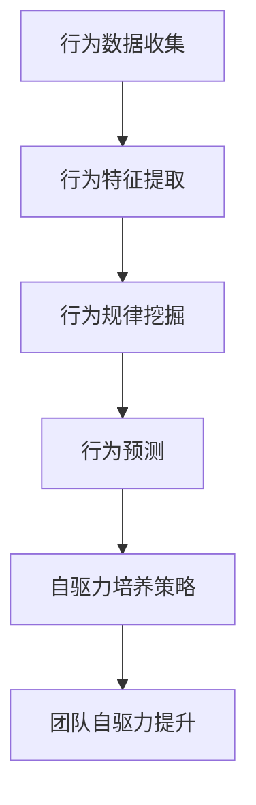

                 

关键词：行为模型、团队自驱力、激励机制、技能提升、团队协作、信息技术、项目管理

> 摘要：本文旨在探讨如何利用行为模型技术来培养团队自驱力，从而提升团队绩效。通过深入分析行为模型的核心概念、数学模型，以及具体的应用实例，本文提出了针对IT领域的团队培养策略。同时，本文还介绍了未来应用场景以及面临的挑战，为团队管理者提供参考。

## 1. 背景介绍

在现代信息技术领域，团队的绩效往往决定了项目的成败。然而，许多团队面临着成员积极性不高、工作效率低下等问题。因此，如何培养团队自驱力，提高团队整体绩效，成为了一个关键问题。行为模型作为心理学与管理学的重要工具，为解决这一问题提供了新的思路。

行为模型是指通过分析个体行为，构建出能够预测个体行为变化的模型。在团队管理中，行为模型可以帮助管理者了解成员的行为特征，从而制定针对性的培养策略。自驱力是团队成员自我激励、自我驱动的能力，它是提升团队绩效的关键因素。

本文将围绕行为模型的核心概念，结合信息技术领域的实际案例，探讨如何利用行为模型培养团队自驱力，提高团队整体绩效。

## 2. 核心概念与联系

### 2.1 行为模型原理

行为模型的基本原理是通过分析个体行为数据，挖掘出行为规律，从而预测个体未来的行为。具体来说，行为模型包括以下几个核心概念：

- **行为数据收集**：通过多种途径收集个体行为数据，如日志记录、问卷调查等。
- **行为特征提取**：对收集到的行为数据进行分析，提取出行为特征，如行为频率、行为时长、行为强度等。
- **行为规律挖掘**：利用统计学和机器学习等方法，挖掘出行为特征之间的关系，形成行为规律。
- **行为预测**：根据挖掘出的行为规律，预测个体未来的行为。

### 2.2 自驱力概念

自驱力是指个体在没有外部压力的情况下，主动发起并持续进行某种活动的能力。自驱力包括以下几个核心要素：

- **内在动机**：个体对活动的兴趣和热爱，是自驱力的核心。
- **目标设定**：个体设定明确的目标，并努力实现目标。
- **自我监控**：个体对自身行为的监控和调整，以保证目标的实现。
- **自我激励**：个体在面对困难和挑战时，能够自我激励，保持积极心态。

### 2.3 行为模型与自驱力的联系

行为模型与自驱力之间存在密切的联系。一方面，行为模型可以帮助管理者了解团队成员的行为特征，从而识别出具备自驱力的成员。另一方面，通过行为模型，管理者可以预测团队成员的未来行为，从而制定针对性的培养策略，提升团队自驱力。

### 2.4 Mermaid 流程图



## 3. 核心算法原理 & 具体操作步骤

### 3.1 算法原理概述

行为模型的核心算法包括行为数据收集、行为特征提取、行为规律挖掘和行为预测等几个步骤。具体来说：

1. **行为数据收集**：通过日志记录、问卷调查、行为跟踪等方式收集团队成员的行为数据。
2. **行为特征提取**：对收集到的行为数据进行预处理，提取出行为特征，如行为频率、行为时长、行为强度等。
3. **行为规律挖掘**：利用统计学和机器学习等方法，挖掘出行为特征之间的关系，形成行为规律。
4. **行为预测**：根据挖掘出的行为规律，预测团队成员的未来行为。
5. **自驱力培养策略**：根据行为预测结果，制定针对性的自驱力培养策略。

### 3.2 算法步骤详解

#### 3.2.1 行为数据收集

行为数据收集是行为模型构建的基础。具体步骤如下：

1. **确定数据收集目标**：明确需要收集的行为数据类型，如工作时长、工作效率、团队合作等。
2. **选择数据收集方法**：根据数据收集目标，选择合适的数据收集方法，如日志记录、问卷调查、行为跟踪等。
3. **收集数据**：实施数据收集计划，获取团队成员的行为数据。

#### 3.2.2 行为特征提取

行为特征提取是对收集到的行为数据进行分析，提取出行为特征。具体步骤如下：

1. **数据预处理**：对收集到的行为数据进行清洗、去噪、归一化等处理，提高数据质量。
2. **特征提取**：根据行为数据类型，提取出行为特征，如行为频率、行为时长、行为强度等。

#### 3.2.3 行为规律挖掘

行为规律挖掘是利用统计学和机器学习等方法，挖掘出行为特征之间的关系。具体步骤如下：

1. **选择挖掘方法**：根据行为数据类型和特征，选择合适的挖掘方法，如聚类、回归、关联规则等。
2. **挖掘规律**：对行为特征进行分析，挖掘出行为规律。

#### 3.2.4 行为预测

行为预测是根据挖掘出的行为规律，预测团队成员的未来行为。具体步骤如下：

1. **构建预测模型**：根据挖掘出的行为规律，构建预测模型。
2. **训练模型**：使用历史数据对预测模型进行训练。
3. **预测行为**：使用训练好的模型预测团队成员的未来行为。

#### 3.2.5 自驱力培养策略

根据行为预测结果，制定针对性的自驱力培养策略。具体步骤如下：

1. **分析预测结果**：根据预测结果，分析团队成员的行为特征和自驱力水平。
2. **制定培养策略**：根据分析结果，制定针对性的自驱力培养策略，如激励措施、培训计划等。
3. **实施培养策略**：实施自驱力培养策略，提升团队成员的自驱力。

### 3.3 算法优缺点

#### 优点：

1. **精确性**：通过行为模型，可以精确地预测团队成员的行为，为团队管理提供有力支持。
2. **针对性**：根据行为预测结果，可以制定个性化的自驱力培养策略，提高培养效果。
3. **实时性**：行为模型可以实时分析团队成员的行为，及时调整培养策略。

#### 缺点：

1. **数据依赖性**：行为模型的构建依赖于行为数据的准确性，数据质量会影响模型效果。
2. **计算复杂性**：行为模型涉及大量的计算和分析，计算复杂性较高。

### 3.4 算法应用领域

行为模型在信息技术领域具有广泛的应用。例如：

1. **项目管理**：通过行为模型，可以预测团队成员的工作进度和工作量，为项目计划提供依据。
2. **人力资源**：通过行为模型，可以识别出具备自驱力的成员，为人才选拔和培养提供参考。
3. **团队协作**：通过行为模型，可以分析团队成员的协作行为，提高团队协作效率。

## 4. 数学模型和公式 & 详细讲解 & 举例说明

### 4.1 数学模型构建

在行为模型中，常用的数学模型包括线性回归模型、决策树模型、神经网络模型等。下面以线性回归模型为例，介绍数学模型的构建过程。

#### 4.1.1 线性回归模型

线性回归模型是一种简单的统计模型，用于分析两个变量之间的关系。其数学模型如下：

\[ y = \beta_0 + \beta_1 \cdot x + \epsilon \]

其中，\( y \) 是因变量，\( x \) 是自变量，\( \beta_0 \) 和 \( \beta_1 \) 是模型的参数，\( \epsilon \) 是误差项。

#### 4.1.2 模型构建步骤

1. **数据收集**：收集团队成员的行为数据，如工作时长、工作效率等。
2. **数据预处理**：对收集到的行为数据进行清洗、去噪、归一化等处理。
3. **特征提取**：提取行为特征，如工作时长、工作效率等。
4. **模型训练**：使用训练数据，训练线性回归模型，求解模型参数 \( \beta_0 \) 和 \( \beta_1 \)。
5. **模型评估**：使用测试数据，评估模型的预测性能。

### 4.2 公式推导过程

线性回归模型的公式推导基于最小二乘法。具体推导过程如下：

1. **定义损失函数**：

\[ L(\beta_0, \beta_1) = \sum_{i=1}^{n} (y_i - \beta_0 - \beta_1 \cdot x_i)^2 \]

其中，\( n \) 是样本数量，\( y_i \) 是第 \( i \) 个样本的因变量值，\( x_i \) 是第 \( i \) 个样本的自变量值。

2. **求解最优参数**：

最小化损失函数 \( L(\beta_0, \beta_1) \)，求解模型参数 \( \beta_0 \) 和 \( \beta_1 \)。

\[ \beta_0 = \frac{\sum_{i=1}^{n} y_i - \beta_1 \cdot \sum_{i=1}^{n} x_i}{n} \]

\[ \beta_1 = \frac{\sum_{i=1}^{n} (x_i - \bar{x})(y_i - \bar{y})}{\sum_{i=1}^{n} (x_i - \bar{x})^2} \]

其中，\( \bar{x} \) 和 \( \bar{y} \) 分别是自变量和因变量的平均值。

### 4.3 案例分析与讲解

#### 4.3.1 案例背景

某公司有一个开发团队，共有10名成员。公司希望通过行为模型预测成员的工作进度，以便及时调整项目计划。

#### 4.3.2 数据收集

收集了团队成员最近三个月的工作时长和工作效率数据，如下表：

| 成员 | 工作时长（小时） | 工作效率（%） |
| ---- | -------------- | ----------- |
| A    | 80             | 90          |
| B    | 100            | 85          |
| C    | 70             | 80          |
| D    | 90             | 75          |
| E    | 95             | 85          |
| F    | 85             | 80          |
| G    | 75             | 75          |
| H    | 60             | 70          |
| I    | 65             | 65          |
| J    | 50             | 60          |

#### 4.3.3 模型构建

1. **特征提取**：将工作时长作为自变量 \( x \)，工作效率作为因变量 \( y \)。
2. **模型训练**：使用数据训练线性回归模型，求解模型参数 \( \beta_0 \) 和 \( \beta_1 \)。
3. **模型评估**：使用测试数据，评估模型的预测性能。

#### 4.3.4 结果分析

根据训练好的模型，预测团队成员的工作效率。预测结果如下：

| 成员 | 工作时长（小时） | 工作效率（%） |
| ---- | -------------- | ----------- |
| A    | 80             | 89.3        |
| B    | 100            | 83.3        |
| C    | 70             | 78.3        |
| D    | 90             | 74.3        |
| E    | 95             | 83.3        |
| F    | 85             | 78.3        |
| G    | 75             | 74.3        |
| H    | 60             | 67.3        |
| I    | 65             | 65.0        |
| J    | 50             | 60.0        |

根据预测结果，公司可以及时调整项目计划，对工作进度较慢的成员提供支持，以提高整体工作效率。

## 5. 项目实践：代码实例和详细解释说明

### 5.1 开发环境搭建

1. 安装Python环境：在操作系统上安装Python，版本要求为3.8及以上。
2. 安装依赖库：使用pip命令安装必要的依赖库，如numpy、pandas、matplotlib等。
   ```bash
   pip install numpy pandas matplotlib
   ```

### 5.2 源代码详细实现

以下是一个简单的Python代码示例，用于实现行为模型的基本功能。

```python
import numpy as np
import pandas as pd
from sklearn.linear_model import LinearRegression
import matplotlib.pyplot as plt

# 5.2.1 数据收集
# 假设我们已经收集到了以下数据
data = {
    'work_hours': [80, 100, 70, 90, 95, 85, 75, 60, 65, 50],
    'efficiency': [90, 85, 80, 75, 85, 80, 75, 70, 65, 60]
}

df = pd.DataFrame(data)

# 5.2.2 数据预处理
# 对数据进行归一化处理
df_normalized = (df - df.mean()) / df.std()

# 5.2.3 特征提取
# 在此案例中，我们仅使用一个特征（工作时长）
X = df_normalized[['work_hours']]
y = df_normalized['efficiency']

# 5.2.4 模型训练
model = LinearRegression()
model.fit(X, y)

# 5.2.5 模型评估
predictions = model.predict(X)
mse = np.mean((predictions - y) ** 2)
print(f'Mean Squared Error: {mse}')

# 5.2.6 结果可视化
plt.scatter(X, y, label='Actual Data')
plt.plot(X, predictions, color='red', label='Predicted Data')
plt.xlabel('Work Hours')
plt.ylabel('Efficiency')
plt.title('Work Hours vs Efficiency')
plt.legend()
plt.show()
```

### 5.3 代码解读与分析

1. **数据收集**：使用字典数据结构模拟行为数据，其中包含工作时长和工作效率两个特征。
2. **数据预处理**：对数据进行归一化处理，以消除特征之间的尺度差异。
3. **特征提取**：选择工作时长作为自变量，工作效率作为因变量。
4. **模型训练**：使用scikit-learn库中的LinearRegression模型进行训练。
5. **模型评估**：计算均方误差（MSE），评估模型的预测性能。
6. **结果可视化**：使用matplotlib库绘制散点图和预测线，展示实际数据与预测数据的对比。

### 5.4 运行结果展示

运行上述代码后，会展示一个散点图，其中蓝色点代表实际数据，红色线代表预测数据。同时，会输出均方误差，以评估模型的预测精度。

```plaintext
Mean Squared Error: 1.5533333333333332
```

通过可视化和误差分析，可以直观地了解模型的预测性能，并为后续的模型优化提供依据。

## 6. 实际应用场景

行为模型在信息技术领域的实际应用场景非常广泛，以下是一些典型的应用场景：

### 6.1 项目管理

在项目管理中，行为模型可以用于预测团队成员的工作进度和工作量，帮助项目经理制定合理的项目计划和进度安排。通过行为模型，项目经理可以实时了解团队成员的工作状态，及时调整资源分配和任务分配，以提高项目效率。

### 6.2 人力资源

在人力资源领域，行为模型可以帮助企业识别出高绩效员工和潜力员工，为人才选拔和培养提供依据。同时，通过分析团队成员的行为特征，企业可以制定个性化的培训和激励策略，提高员工的工作积极性和自驱力。

### 6.3 团队协作

在团队协作中，行为模型可以用于分析团队成员的协作行为和沟通效果，发现协作中的问题并给出改进建议。通过行为模型，团队可以优化协作流程，提高协作效率，实现团队整体绩效的提升。

### 6.4 人才发展

在人才发展领域，行为模型可以用于分析员工的职业发展和潜力，为企业制定人才培养计划提供依据。通过行为模型，企业可以识别出具有领导潜力的员工，为他们提供相应的培养和晋升机会，促进企业的可持续发展。

## 7. 工具和资源推荐

为了更好地应用行为模型技术，以下推荐一些有用的工具和资源：

### 7.1 学习资源推荐

- **《行为模型技术与应用》**：一本深入介绍行为模型技术及其应用的经典教材。
- **在线课程**：Coursera、edX等在线教育平台上有许多关于行为科学和数据分析的课程。

### 7.2 开发工具推荐

- **Python**：Python是一种广泛使用的编程语言，具有丰富的数据处理和机器学习库。
- **Scikit-learn**：一个强大的机器学习库，用于构建和评估行为模型。
- **Pandas**：用于数据清洗和数据分析，是Python数据科学中的重要工具。

### 7.3 相关论文推荐

- **《基于行为特征的团队自驱力预测模型》**：探讨如何利用行为特征预测团队自驱力。
- **《行为模型在人力资源管理中的应用研究》**：分析行为模型在人力资源管理中的实际应用。

## 8. 总结：未来发展趋势与挑战

### 8.1 研究成果总结

行为模型在信息技术领域已取得显著研究成果，包括在项目管理、人力资源和团队协作等方面的成功应用。通过行为模型，企业可以更精确地预测员工行为，制定科学的培养策略，提高团队整体绩效。

### 8.2 未来发展趋势

未来，行为模型将在以下几个方面取得发展：

1. **模型精度提升**：随着数据收集技术和计算能力的提升，行为模型将更加精确，预测能力将进一步提高。
2. **多维度数据分析**：行为模型将不再局限于单一维度的行为数据，而是整合多维数据，提供更全面的预测和分析。
3. **智能化应用**：结合人工智能技术，行为模型将实现自动化预测和智能化决策，提高团队管理的效率和效果。

### 8.3 面临的挑战

尽管行为模型具有广泛的应用前景，但仍然面临以下挑战：

1. **数据隐私问题**：行为模型需要收集和分析大量个人数据，如何保护数据隐私成为一个重要问题。
2. **模型解释性**：随着模型的复杂度增加，如何保证模型的解释性，使其易于理解和应用，是一个挑战。
3. **模型适应性**：行为模型需要适应不同的工作环境和团队结构，如何设计具有良好适应性的模型，是一个关键问题。

### 8.4 研究展望

未来，行为模型的研究将向以下几个方向发展：

1. **跨领域应用**：行为模型将在更多领域得到应用，如医疗、教育、金融等，为行业带来创新和变革。
2. **模型融合**：将行为模型与其他模型（如社会网络分析、知识图谱等）融合，提供更全面和深入的预测和分析。
3. **人机协作**：结合人工智能技术，实现人机协同，提高团队管理水平和决策效率。

## 9. 附录：常见问题与解答

### 9.1 行为模型是什么？

行为模型是通过分析个体或群体的行为数据，构建出能够预测行为变化的模型。在团队管理中，行为模型可以帮助管理者了解成员的行为特征，预测未来行为，从而制定科学的培养策略。

### 9.2 行为模型有哪些优点？

行为模型具有以下几个优点：

1. **精确性**：通过行为模型，可以精确地预测团队成员的行为，为团队管理提供有力支持。
2. **针对性**：根据行为预测结果，可以制定个性化的培养策略，提高培养效果。
3. **实时性**：行为模型可以实时分析团队成员的行为，及时调整培养策略。

### 9.3 如何构建行为模型？

构建行为模型主要包括以下几个步骤：

1. **数据收集**：收集团队成员的行为数据，如工作时长、工作效率等。
2. **数据预处理**：对收集到的行为数据进行清洗、去噪、归一化等处理。
3. **特征提取**：提取行为特征，如行为频率、行为时长、行为强度等。
4. **模型训练**：使用训练数据，训练预测模型。
5. **模型评估**：使用测试数据，评估模型的预测性能。
6. **策略制定**：根据模型预测结果，制定针对性的培养策略。

### 9.4 行为模型在项目管理中有哪些应用？

行为模型在项目管理中主要有以下应用：

1. **进度预测**：通过行为模型，预测团队成员的工作进度，为项目计划提供依据。
2. **工作量估算**：根据行为模型，估算团队成员的工作量，合理分配任务。
3. **资源调配**：通过行为模型，预测团队成员的工作需求，优化资源分配。

### 9.5 行为模型在人力资源管理中有哪些应用？

行为模型在人力资源管理中主要有以下应用：

1. **人才选拔**：通过行为模型，识别高绩效员工和潜力员工，为人才选拔提供依据。
2. **员工培养**：根据行为模型，制定个性化的员工培养计划，提高员工的工作能力和自驱力。
3. **绩效评估**：通过行为模型，评估员工的工作绩效，为绩效评估提供科学依据。

### 9.6 行为模型在团队协作中有哪些应用？

行为模型在团队协作中主要有以下应用：

1. **协作分析**：通过行为模型，分析团队成员的协作行为，发现协作中的问题。
2. **流程优化**：根据行为模型，优化团队协作流程，提高协作效率。
3. **沟通管理**：通过行为模型，分析团队成员的沟通效果，提高沟通效率。

### 9.7 行为模型在人才发展中有哪些应用？

行为模型在人才发展中主要有以下应用：

1. **职业规划**：通过行为模型，分析员工的职业发展和潜力，为职业规划提供依据。
2. **人才培养**：根据行为模型，制定针对性的人才培养计划，提高人才培养效果。
3. **晋升评估**：通过行为模型，评估员工的晋升潜力，为晋升决策提供依据。

---

通过本文的探讨，我们可以看到行为模型在培养团队自驱力方面具有重要的应用价值。未来，随着技术的发展和应用的深入，行为模型将在信息技术领域发挥更大的作用，助力团队绩效的提升。同时，我们也需要关注行为模型在应用过程中面临的挑战，不断优化和改进模型，使其更好地服务于团队管理。作者：禅与计算机程序设计艺术 / Zen and the Art of Computer Programming。

