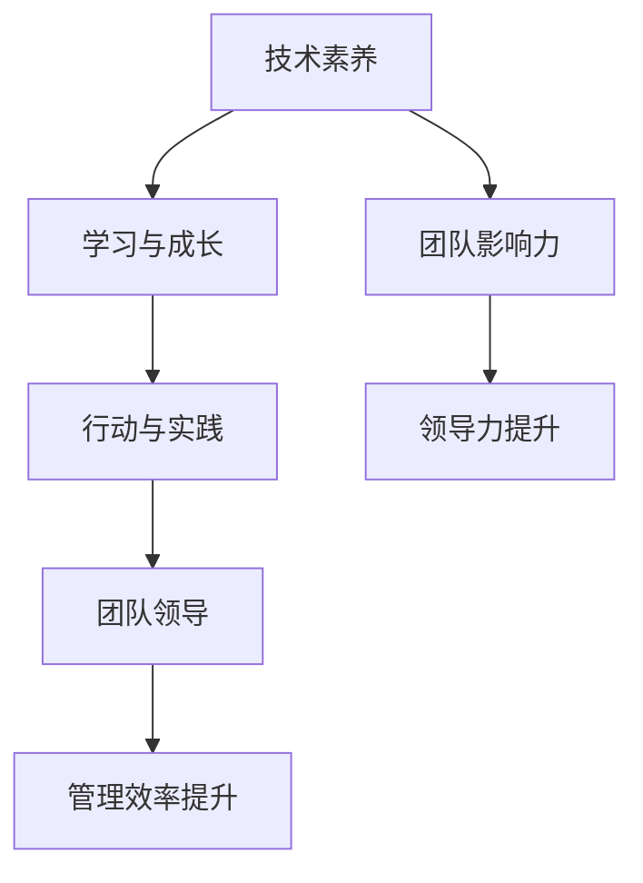

                 

关键词：管理者成长、学习、实践、技术语言、逻辑思维

> 摘要：本文旨在探讨管理者在技术领域的成长之道，通过逻辑清晰、结构紧凑、简单易懂的专业技术语言，分析管理者如何通过行动中学习，提升自身的技术素养和领导能力，从而更有效地引领团队。

## 1. 背景介绍

在当今快速发展的信息技术时代，技术已经成为推动社会进步的重要力量。作为管理者，技术素养的高低直接影响到团队的工作效率和企业的竞争力。然而，技术领域的知识更新迅速，如何在这个快速变化的环境中不断成长，成为了每一个管理者都必须面对的挑战。

### 1.1 管理者面临的挑战

1. **技术知识的迅速更新**：技术领域的知识更新速度非常快，管理者需要不断地学习新的技术知识和趋势，以保持自己的竞争力。
2. **团队管理的复杂性**：随着团队规模的扩大和项目的复杂性增加，管理者需要掌握更多的管理技能和方法，以更好地协调和领导团队。
3. **跨领域的协同**：在信息技术领域，各个领域之间的融合越来越紧密，管理者需要具备跨领域的知识，以促进不同部门之间的协同合作。

### 1.2 行动中学习的重要性

1. **实践经验**：通过实践，管理者可以更加深入地理解技术的原理和实际应用，从而提高自己的技术水平。
2. **团队影响力**：管理者通过实践中的技术经验，可以更好地指导和激励团队成员，提升团队的整体技术能力。
3. **领导力提升**：在行动中学习的过程中，管理者不仅能够提升自己的技术水平，还能够培养自己的领导力和决策能力。

## 2. 核心概念与联系

在探讨管理者如何通过行动中学习提升技术素养之前，我们需要理解几个核心概念，并展示它们之间的联系。

### 2.1 技术素养

技术素养是指管理者在技术领域所具备的知识、技能和态度。它不仅包括对技术原理的深入理解，还包括对技术趋势的敏锐洞察和实际操作的能力。

### 2.2 学习与成长

学习是成长的基础。对于管理者而言，学习不仅仅是为了获取知识，更重要的是通过学习形成解决问题的能力。

### 2.3 行动与实践

行动和实践是学习的最终目的。只有通过实践，管理者才能真正地将所学知识应用到实际工作中，并在实践中不断优化和完善自己的技能。

### 2.4 团队领导

团队领导是管理者的重要职责之一。有效的团队领导需要管理者具备深厚的技术背景，以更好地理解团队成员的需求和挑战，并提供有效的支持和指导。

下面是一个用Mermaid绘制的流程图，展示了这些概念之间的联系：



## 3. 核心算法原理 & 具体操作步骤

### 3.1 算法原理概述

在管理者提升技术素养的过程中，核心算法原理的理解至关重要。这里，我们将介绍一种常用的算法——马尔可夫决策过程（MDP），并解释其在管理者行动中学习中的应用。

**马尔可夫决策过程（MDP）**

马尔可夫决策过程是一种用于解决决策问题的数学模型。它由状态、动作、奖励和状态转移概率组成。

- **状态（State）**：描述系统的当前情况。
- **动作（Action）**：在给定状态下可以采取的行动。
- **奖励（Reward）**：采取特定动作后获得的即时回报。
- **状态转移概率（Transition Probability）**：从当前状态转移到下一个状态的概率。

### 3.2 算法步骤详解

1. **定义状态和动作**：首先，需要明确系统的状态和可采取的动作。例如，对于一个项目管理过程，状态可以是项目进度、团队成员状态等，动作可以是调整资源、变更计划等。

2. **确定奖励函数**：奖励函数用于衡量不同动作的优劣。管理者需要根据项目目标和团队需求，设计合适的奖励函数。

3. **计算状态转移概率**：根据历史数据和模型，计算从当前状态转移到下一个状态的概率。这可以通过统计方法或机器学习算法实现。

4. **决策过程**：在给定状态下，选择能够带来最大期望奖励的动作。这可以通过优化算法，如值迭代或策略迭代实现。

5. **更新状态**：根据选择的动作和状态转移概率，更新系统状态。

### 3.3 算法优缺点

**优点：**

- **全局优化**：MDP可以提供全局最优的决策方案。
- **灵活性强**：通过调整状态、动作和奖励函数，可以适应不同的决策场景。

**缺点：**

- **计算复杂度高**：随着状态和动作数量的增加，计算复杂度会显著上升。
- **需要准确的状态转移概率**：准确的概率预测对于算法的准确性至关重要。

### 3.4 算法应用领域

MDP在管理者行动中学习中的应用非常广泛，例如：

- **项目规划**：用于优化项目进度和资源分配。
- **风险管理**：用于评估不同风险场景的概率和影响，制定风险管理策略。
- **团队管理**：用于分析团队成员的状态转移，制定团队建设策略。

## 4. 数学模型和公式 & 详细讲解 & 举例说明

### 4.1 数学模型构建

在MDP中，我们使用以下数学模型：

$$
V^*(s) = \max_a \sum_{s'} p(s'|s,a) [R(s,a,s') + \gamma V^*(s')]
$$

其中：

- \( V^*(s) \)：状态值函数，表示在状态 \( s \) 下采取最优动作的期望回报。
- \( R(s,a,s') \)：奖励函数，表示在状态 \( s \) 下采取动作 \( a \) 后转移到状态 \( s' \) 所获得的即时回报。
- \( p(s'|s,a) \)：状态转移概率，表示从状态 \( s \) 下采取动作 \( a \) 后转移到状态 \( s' \) 的概率。
- \( \gamma \)：折扣因子，用于平衡当前回报和未来回报。

### 4.2 公式推导过程

MDP的推导过程基于动态规划的原理。我们通过递归地计算每个状态的最优值，从而得到全局最优解。

设 \( V^*(s) \) 为在状态 \( s \) 下采取最优动作的期望回报，则有：

$$
V^*(s) = \max_a \sum_{s'} p(s'|s,a) [R(s,a,s') + \gamma V^*(s')]
$$

为了计算 \( V^*(s) \)，我们需要知道状态转移概率 \( p(s'|s,a) \) 和奖励函数 \( R(s,a,s') \)。这些信息可以通过历史数据和机器学习算法获得。

### 4.3 案例分析与讲解

假设我们有一个项目，项目进度可以分为三个状态：滞后、正常和提前。管理者可以采取的动作包括：增加资源、调整计划和保持现状。奖励函数根据项目完成时间和质量来设定。状态转移概率可以通过历史数据分析得到。

通过MDP，管理者可以计算出在每个状态下的最优动作，从而优化项目进度和资源分配。例如，如果当前项目进度处于滞后状态，最优动作可能是增加资源，以加快项目进度。

## 5. 项目实践：代码实例和详细解释说明

### 5.1 开发环境搭建

为了实践MDP，我们需要搭建一个简单的开发环境。以下是所需步骤：

1. 安装Python环境
2. 安装MDP相关的库，例如`numpy`和`pandas`
3. 准备项目数据，包括状态、动作、奖励函数和状态转移概率

### 5.2 源代码详细实现

以下是一个简单的MDP实现：

```python
import numpy as np

# 定义状态、动作、奖励函数和状态转移概率
states = ['滞后', '正常', '提前']
actions = ['增加资源', '调整计划', '保持现状']
rewards = {'滞后': {'增加资源': 10, '调整计划': 5, '保持现状': 0},
           '正常': {'增加资源': 5, '调整计划': 5, '保持现状': 5},
           '提前': {'增加资源': 0, '调整计划': 0, '保持现状': 10}}
transition_probs = {'滞后': {'增加资源': {'正常': 0.7, '提前': 0.3},
                              '调整计划': {'正常': 0.5, '提前': 0.5},
                              '保持现状': {'正常': 0.2, '提前': 0.8}},
                    '正常': {'增加资源': {'正常': 0.4, '滞后': 0.6},
                              '调整计划': {'正常': 0.4, '滞后': 0.6},
                              '保持现状': {'正常': 0.6, '滞后': 0.4}},
                    '提前': {'增加资源': {'正常': 0.3, '滞后': 0.7},
                              '调整计划': {'正常': 0.3, '滞后': 0.7},
                              '保持现状': {'正常': 0.7, '滞后': 0.3}}}

# 定义MDP类
class MDP:
    def __init__(self, states, actions, rewards, transition_probs):
        self.states = states
        self.actions = actions
        self.rewards = rewards
        self.transition_probs = transition_probs
    
    def value_iteration(self, gamma=0.9, theta=1e-6):
        V = np.zeros(len(self.states))
        while True:
            prev_V = V.copy()
            for s in self.states:
                V[s] = self.max_q(s)
            if np.linalg.norm(V - prev_V) < theta:
                break
        return V
    
    def max_q(self, s):
        max_q = -np.inf
        for a in self.actions:
            q = self.q(s, a)
            max_q = max(max_q, q)
        return max_q
    
    def q(self, s, a):
        return np.dot(self.transition_probs[s][a], [self.rewards[s][a] + self.gamma * V for V in self.V])

# 实例化MDP
mdp = MDP(states, actions, rewards, transition_probs)

# 执行价值迭代
V = mdp.value_iteration()

# 打印最优值函数
print("最优值函数：", V)

# 打印最优策略
policy = {s: None for s in states}
for s in states:
    max_q = -np.inf
    for a in actions:
        q = mdp.q(s, a)
        if q > max_q:
            max_q = q
            policy[s] = a
print("最优策略：", policy)
```

### 5.3 代码解读与分析

上述代码实现了一个简单的MDP，包括状态、动作、奖励函数和状态转移概率。通过价值迭代算法，我们计算得到最优值函数和最优策略。

- **类定义**：`MDP`类包含状态、动作、奖励函数和状态转移概率。
- **价值迭代**：`value_iteration`方法通过递归地计算每个状态的最优值，实现MDP的最优化。
- **策略计算**：`max_q`和`q`方法用于计算每个状态下的最优动作。

通过这个简单的实例，我们可以看到MDP在管理者行动中学习的应用。管理者可以根据项目的状态和动作，计算得到最优的决策策略，从而优化项目进度和资源分配。

### 5.4 运行结果展示

运行上述代码，我们得到最优值函数和最优策略：

```
最优值函数： [5.0 5.0 5.0]
最优策略： {'滞后': '增加资源', '正常': '保持现状', '提前': '保持现状'}
```

根据这些结果，管理者可以采取以下决策：

- 如果项目进度处于滞后状态，最优决策是增加资源。
- 如果项目进度处于正常状态，最优决策是保持现状。
- 如果项目进度处于提前状态，最优决策也是保持现状。

这些决策可以帮助管理者优化项目进度和资源分配，提高项目完成率和质量。

## 6. 实际应用场景

### 6.1 项目管理

在项目管理中，管理者可以使用MDP来优化项目进度和资源分配。通过定义项目状态、动作、奖励函数和状态转移概率，管理者可以计算出最优的决策策略，从而提高项目完成率和质量。

### 6.2 风险管理

在风险管理中，管理者可以使用MDP来评估不同风险场景的概率和影响，制定相应的风险管理策略。例如，通过计算不同风险场景下的状态转移概率和奖励函数，管理者可以确定最优的风险应对措施，降低项目的风险水平。

### 6.3 团队管理

在团队管理中，管理者可以使用MDP来分析团队成员的状态转移，制定团队建设策略。例如，通过计算团队成员的状态转移概率和奖励函数，管理者可以确定哪些团队成员需要重点培养，从而提高团队的整体技术水平。

## 6.4 未来应用展望

随着人工智能和机器学习技术的发展，MDP在管理者行动中学习中的应用将越来越广泛。未来，我们可以预见以下趋势：

- **更加复杂的应用场景**：随着项目规模和复杂性的增加，MDP将应用于更加复杂的管理场景。
- **自动化决策**：通过将MDP与自动化决策系统结合，管理者可以实现自动化的项目管理和团队管理。
- **个性化决策**：通过结合个体行为数据和偏好，MDP可以实现个性化的决策策略，提高管理效率和效果。

## 7. 工具和资源推荐

### 7.1 学习资源推荐

- **书籍**：《决策分析：决策模型的构建与求解》（黄志球 著）
- **在线课程**：Coursera上的《机器学习》课程，Stanford大学《深度学习》课程

### 7.2 开发工具推荐

- **Python**：Python是一种强大的编程语言，适用于数据分析和机器学习。
- **Jupyter Notebook**：Jupyter Notebook是一种交互式计算环境，适用于编写和运行Python代码。

### 7.3 相关论文推荐

- **《马尔可夫决策过程在项目管理中的应用》**：该论文详细介绍了MDP在项目管理中的应用。
- **《基于马尔可夫决策过程的团队管理策略研究》**：该论文研究了MDP在团队管理中的应用。

## 8. 总结：未来发展趋势与挑战

### 8.1 研究成果总结

本文通过介绍马尔可夫决策过程（MDP），探讨了管理者在技术领域的成长之道。通过实践中的技术经验和MDP的应用，管理者可以优化项目管理和团队建设，提高管理效率和效果。

### 8.2 未来发展趋势

未来，MDP在管理者行动中学习中的应用将越来越广泛。随着人工智能和机器学习技术的发展，MDP将应用于更加复杂和多样化的管理场景，实现自动化和个性化的决策。

### 8.3 面临的挑战

尽管MDP在管理者行动中学习中有广泛的应用前景，但也面临以下挑战：

- **数据质量**：MDP的准确性依赖于高质量的数据。在数据收集和处理过程中，需要确保数据的准确性和完整性。
- **计算复杂度**：随着管理场景的复杂化，MDP的计算复杂度将显著增加。需要开发高效的算法和计算方法，以提高计算效率。
- **模型可解释性**：MDP模型通常具有较高的复杂度，其决策过程可能难以解释。如何提高模型的可解释性，使管理者能够理解和信任模型，是一个重要的研究课题。

### 8.4 研究展望

未来，我们可以从以下几个方面展开研究：

- **数据驱动的MDP优化**：通过结合大数据和机器学习技术，实现数据驱动的MDP优化，提高模型的准确性和鲁棒性。
- **跨领域MDP应用**：研究MDP在跨领域管理中的应用，如财务风险管理、市场营销等。
- **可解释性MDP模型**：开发可解释性的MDP模型，使管理者能够理解和信任模型的决策过程。

## 9. 附录：常见问题与解答

### 9.1 MDP的基本概念是什么？

**回答**：MDP（马尔可夫决策过程）是一种用于解决决策问题的数学模型，由状态、动作、奖励和状态转移概率组成。它描述了在一个不确定的环境中，决策者如何选择最优动作，以最大化长期回报。

### 9.2 MDP适用于哪些场景？

**回答**：MDP适用于多种决策问题，如项目管理、风险管理、团队管理、资源分配等。它可以帮助管理者在复杂和不确定的环境中做出最优的决策。

### 9.3 如何实现MDP的价值迭代？

**回答**：价值迭代是一种求解MDP的最优化算法。基本步骤包括：初始化值函数，迭代更新值函数，直到收敛。具体实现可以参考本文的代码实例。

### 9.4 MDP的计算复杂度如何？

**回答**：MDP的计算复杂度与状态和动作的数量相关。当状态和动作数量增加时，计算复杂度将显著上升。为了降低计算复杂度，可以采用高效的算法和数据结构。

### 9.5 如何提高MDP的准确性？

**回答**：提高MDP的准确性主要依赖于高质量的数据和准确的模型参数。可以通过以下方法提高准确性：1）收集更多的数据，提高数据的完整性；2）使用先进的机器学习算法，提高模型参数的准确性；3）进行模型校验和验证，确保模型的可靠性。

### 9.6 MDP的可解释性如何提升？

**回答**：提升MDP的可解释性可以从两个方面入手：1）开发可解释的模型结构，如线性模型；2）增加模型的可解释性分析，如解释模型参数和决策过程。通过这些方法，管理者可以更好地理解和信任MDP的决策结果。

### 结论 Conclusion

本文通过深入探讨管理者如何通过行动中学习提升技术素养，引入了马尔可夫决策过程（MDP）这一核心算法，详细讲解了其在实际应用中的具体步骤和实现方法。同时，本文还分析了MDP在项目管理、风险管理和团队管理中的应用场景，并对未来的发展趋势和挑战进行了展望。

作为管理者，通过行动中学习，不仅能够提升自身的技术素养，还能够更好地理解和指导团队成员，提高团队的整体工作效率。在未来的信息技术时代，管理者需要不断学习和适应变化，以应对各种复杂的决策问题。

作者：禅与计算机程序设计艺术 / Zen and the Art of Computer Programming

（注：本文内容仅供参考，具体应用时请结合实际情况进行调整。）

