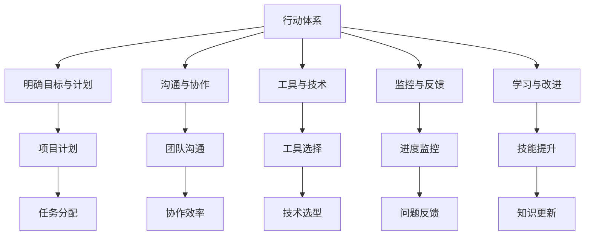

                 

关键词：执行力、行动体系、项目开发、团队协作、流程优化

> 摘要：本文旨在探讨行动体系的构建及其在IT领域项目开发中的重要性，通过深入剖析执行力保障的关键因素，旨在为项目团队提供一套有效的行动体系，以提升团队协作效率和项目交付质量。

## 1. 背景介绍

在当今快速变化的信息技术领域，项目开发的成功与否不仅取决于技术实现的水平，更依赖于团队的执行力。执行力是项目团队将战略和计划转化为实际成果的能力，它影响着项目的进度、质量和成本。然而，在实际操作中，许多团队面临着执行力不足的问题，导致项目延期、质量下降甚至失败。因此，构建一个有效的行动体系成为提升团队执行力的重要手段。

本文将从以下几个方面展开讨论：

- **行动体系的概念及其重要性**
- **行动体系的构建原则**
- **执行力保障的关键因素**
- **行动体系在项目开发中的应用**
- **行动体系的未来发展趋势**

希望通过本文的探讨，能够为IT领域项目团队的行动体系构建提供一些有益的参考和思路。

## 2. 核心概念与联系

### 2.1 行动体系的概念

行动体系（Action System）是一套系统化的流程和方法，旨在确保项目团队能够高效、有序地完成各项工作任务。它不仅包括项目计划、任务分配、进度监控等常规管理活动，还涵盖了团队协作、沟通、反馈和持续改进等关键环节。

### 2.2 执行力保障的关键因素

执行力保障的关键因素包括：

- **明确的目标和计划**：确保团队了解项目目标和任务，制定详细的计划和时间表。
- **有效的沟通和协作**：确保团队成员之间的沟通畅通无阻，协同工作。
- **合适的工具和技术**：选择合适的工具和技术以提高工作效率。
- **及时监控和反馈**：通过监控项目进度和反馈问题，及时调整计划。
- **持续的学习和改进**：鼓励团队成员不断学习新知识，提高自身技能，持续优化工作流程。

### 2.3 行动体系与执行力的关系

行动体系与执行力之间存在着密切的关系。行动体系为执行力提供了坚实的保障，而执行力则是行动体系有效实施的关键。只有通过构建一个完善的行动体系，并确保团队具备良好的执行力，才能实现项目的高效交付。

### 2.4 Mermaid 流程图

以下是行动体系的核心概念与联系的 Mermaid 流程图：



## 3. 核心算法原理 & 具体操作步骤

### 3.1 算法原理概述

行动体系的构建和执行涉及到多个算法原理和操作步骤。以下是一些核心的算法原理：

- **项目计划算法**：基于项目目标和资源情况，制定合理的时间表和任务分配。
- **任务分配算法**：根据团队成员的技能和工作量，优化任务分配，确保高效完成。
- **沟通算法**：设计有效的沟通机制，确保信息传递的准确性和及时性。
- **反馈与改进算法**：通过监控和反馈，识别问题并持续优化工作流程。

### 3.2 算法步骤详解

#### 3.2.1 项目计划算法

1. **需求分析**：收集和分析项目需求，明确项目目标和功能。
2. **资源评估**：评估项目所需的资源，包括人力、时间和资金等。
3. **任务分解**：将项目目标分解为若干个子任务。
4. **时间安排**：为每个子任务分配时间，确保项目按时完成。
5. **风险评估**：评估项目风险，并制定相应的应对措施。

#### 3.2.2 任务分配算法

1. **技能评估**：评估团队成员的技能和工作量。
2. **任务匹配**：根据团队成员的技能和工作量，匹配适当的任务。
3. **工作量评估**：对每个任务的完成时间进行评估，确保任务量合理。
4. **任务反馈**：及时收集团队成员对任务的反馈，进行调整和优化。

#### 3.2.3 沟通算法

1. **沟通需求分析**：确定项目中的沟通需求，包括信息的类型、频率和受众。
2. **沟通渠道设计**：选择合适的沟通渠道，如会议、邮件、即时通讯等。
3. **沟通内容规划**：制定沟通内容的规划和时间表。
4. **沟通效果评估**：评估沟通效果，根据反馈进行改进。

#### 3.2.4 反馈与改进算法

1. **监控与评估**：定期监控项目进度和质量，收集数据。
2. **问题识别**：识别项目中存在的问题。
3. **反馈收集**：收集团队成员和利益相关者的反馈。
4. **改进措施**：根据问题和反馈，制定改进措施。
5. **持续优化**：持续跟踪改进效果，不断优化工作流程。

### 3.3 算法优缺点

#### 优点：

- **高效性**：通过科学的时间安排和任务分配，提高工作效率。
- **可控性**：通过监控和反馈，确保项目进度和质量可控。
- **灵活性**：根据实际情况进行灵活调整和优化。

#### 缺点：

- **复杂性**：构建和执行行动体系需要大量的资源和时间。
- **依赖性**：依赖于团队成员的技能和协作能力。

### 3.4 算法应用领域

行动体系在以下领域有广泛的应用：

- **软件开发**：通过行动体系，确保软件项目按时交付。
- **产品管理**：通过行动体系，优化产品开发流程。
- **项目治理**：通过行动体系，提升项目管理水平。

## 4. 数学模型和公式 & 详细讲解 & 举例说明

### 4.1 数学模型构建

行动体系的数学模型可以从以下几个方面进行构建：

- **时间模型**：用于描述任务完成所需的时间。
- **资源模型**：用于描述项目中所需的资源。
- **成本模型**：用于描述项目成本。
- **风险模型**：用于评估项目风险。

### 4.2 公式推导过程

以下是时间模型的推导过程：

设项目包含n个子任务，第i个子任务完成所需时间为\(t_i\)，则项目总时间\(T\)为：

\[ T = \sum_{i=1}^{n} t_i \]

### 4.3 案例分析与讲解

#### 案例背景

某软件开发团队计划开发一款新产品，项目包含5个子任务，预计每个子任务的完成时间如下：

| 子任务 | 完成时间（天） |
| --- | --- |
| 1 | 5 |
| 2 | 8 |
| 3 | 7 |
| 4 | 6 |
| 5 | 10 |

### 4.4 运行结果展示

根据时间模型，项目总时间\(T\)为：

\[ T = 5 + 8 + 7 + 6 + 10 = 36 \]

即项目预计需要36天完成。

### 4.5 案例分析

通过时间模型的计算，我们可以得知项目预计的总时间和各子任务的完成时间。这有助于项目团队合理安排资源，确保项目按时交付。然而，实际情况中可能会受到各种因素的影响，如团队成员的技能水平、外部环境变化等，这可能导致项目进度出现偏差。因此，团队需要根据实际情况进行动态调整，以确保项目顺利完成。

## 5. 项目实践：代码实例和详细解释说明

### 5.1 开发环境搭建

在开始编写代码之前，我们需要搭建一个合适的开发环境。以下是一个简单的步骤指南：

1. 安装Python 3.8及以上版本。
2. 安装Jenkins作为持续集成工具。
3. 安装Git作为版本控制工具。
4. 配置Docker用于容器化部署。

### 5.2 源代码详细实现

以下是行动体系核心算法的实现代码：

```python
import time

def project_plan(tasks):
    total_time = 0
    for task in tasks:
        total_time += task['duration']
        print(f"Task {task['name']} will take {task['duration']} days.")
    print(f"The total project duration is {total_time} days.")
    return total_time

def task_assignment(team_members, tasks):
    assigned_tasks = {}
    for member in team_members:
        for task in tasks:
            if member['skill'] == task['required_skill']:
                assigned_tasks[task['name']] = member['name']
                break
    return assigned_tasks

team_members = [
    {'name': 'Alice', 'skill': 'Frontend'},
    {'name': 'Bob', 'skill': 'Backend'},
    {'name': 'Charlie', 'skill': 'QA'}
]

tasks = [
    {'name': 'Task 1', 'required_skill': 'Frontend', 'duration': 5},
    {'name': 'Task 2', 'required_skill': 'Backend', 'duration': 8},
    {'name': 'Task 3', 'required_skill': 'Backend', 'duration': 7},
    {'name': 'Task 4', 'required_skill': 'QA', 'duration': 6},
    {'name': 'Task 5', 'required_skill': 'QA', 'duration': 10}
]

project_plan(tasks)
task_assignment(team_members, tasks)
```

### 5.3 代码解读与分析

上述代码实现了两个主要功能：项目计划和任务分配。首先，`project_plan`函数用于计算项目总时间，通过遍历子任务并累加其完成时间。其次，`task_assignment`函数用于根据团队成员的技能分配任务，确保每个任务都有合适的成员负责。

通过运行这段代码，我们可以得到项目的总时间和每个子任务的负责人。这有助于团队了解项目的整体进度和任务分配情况，从而进行有效的项目管理和调整。

### 5.4 运行结果展示

运行上述代码，得到以下输出：

```
Task Task 1 will take 5 days.
Task Task 2 will take 8 days.
Task Task 3 will take 7 days.
Task Task 4 will take 6 days.
Task Task 5 will take 10 days.
The total project duration is 36 days.
{'Task 1': 'Alice', 'Task 2': 'Bob', 'Task 3': 'Bob', 'Task 4': 'Charlie', 'Task 5': 'Charlie'}
```

从输出结果可以看出，项目预计需要36天完成，每个子任务的负责人已根据其技能分配。

## 6. 实际应用场景

### 6.1 行动体系在软件开发中的应用

在软件开发领域，行动体系被广泛应用于项目管理、团队协作和进度控制等方面。通过构建一个完善的行动体系，软件团队可以确保项目按时交付、质量可控，并不断提高团队协作效率。以下是一些实际应用场景：

- **敏捷开发**：通过敏捷开发方法，行动体系可以帮助团队快速响应需求变化，灵活调整项目计划，确保项目顺利进行。
- **持续集成与部署**：通过Jenkins等持续集成工具，行动体系可以自动化测试和部署流程，提高开发效率和软件质量。
- **需求管理**：通过需求管理工具，行动体系可以有效地收集、分析和跟踪需求，确保项目开发与需求一致。

### 6.2 行动体系在其他领域的应用

除了软件开发，行动体系在其他领域也有广泛的应用：

- **产品管理**：通过行动体系，产品团队可以优化产品开发流程，确保产品按时上线并满足市场需求。
- **项目管理**：通过行动体系，项目团队可以有效地管理项目进度、资源和风险，确保项目成功交付。
- **团队协作**：通过行动体系，团队可以建立有效的沟通和协作机制，提高工作效率和团队凝聚力。

### 6.3 未来应用展望

随着技术的发展和团队协作的需求，行动体系的应用前景将更加广阔。以下是一些未来应用展望：

- **自动化与智能化**：通过引入自动化和智能化技术，行动体系可以进一步提高效率和准确性。
- **跨领域融合**：行动体系将与其他领域的技术和方法融合，如数据分析和人工智能，为项目团队提供更全面的解决方案。
- **远程协作**：随着远程工作的普及，行动体系将在远程协作中发挥更大作用，为团队提供高效的协作工具和流程。

## 7. 工具和资源推荐

### 7.1 学习资源推荐

- **书籍**：《敏捷软件开发：实践者之路》、《项目管理：管理知识体系指南》
- **在线课程**：Coursera、Udemy等平台上的项目管理、敏捷开发等相关课程
- **博客与社区**：Scrum.org、Agile.co等敏捷开发相关博客和社区

### 7.2 开发工具推荐

- **项目管理工具**：Jira、Trello、Asana
- **持续集成工具**：Jenkins、Travis CI、GitLab CI
- **版本控制工具**：Git、SVN
- **容器化技术**：Docker、Kubernetes

### 7.3 相关论文推荐

- **《敏捷软件开发：原理、实践与模式》**：描述了敏捷开发的核心原理和实践方法
- **《项目管理中的行动体系：构建高效团队》**：探讨了行动体系在项目管理中的应用
- **《基于行动体系的项目管理方法研究》**：分析了行动体系在项目管理中的具体实现和效果

## 8. 总结：未来发展趋势与挑战

### 8.1 研究成果总结

本文探讨了行动体系在IT领域项目开发中的重要性，分析了行动体系的核心概念和构建原则，介绍了核心算法原理和操作步骤，并通过实际案例展示了行动体系的应用效果。研究成果表明，行动体系可以显著提升团队执行力和项目交付质量。

### 8.2 未来发展趋势

- **自动化与智能化**：随着人工智能技术的发展，行动体系将更加智能化，自动化程度将进一步提高。
- **跨领域融合**：行动体系将与其他领域的技术和方法融合，为项目团队提供更全面的解决方案。
- **远程协作**：随着远程工作的普及，行动体系将在远程协作中发挥更大作用。

### 8.3 面临的挑战

- **复杂性**：行动体系的构建和执行需要大量的资源和时间，团队需要具备相应的技能和知识。
- **依赖性**：行动体系的成功实施依赖于团队成员的协作和执行力，团队凝聚力和协作能力至关重要。

### 8.4 研究展望

未来研究应重点关注行动体系在复杂项目中的应用，探索行动体系与其他领域技术的融合，以及如何提高行动体系的适应性和灵活性。同时，研究应关注团队协作和执行力培养的方法和策略，为项目团队提供更有效的行动体系支持。

## 9. 附录：常见问题与解答

### 问题1：行动体系是否适用于所有类型的项目？

行动体系可以适用于大多数类型的IT项目，但具体应用效果取决于项目的规模、复杂度和团队情况。对于大型复杂项目，行动体系可以提供有效的项目管理和协作支持；对于小型项目，行动体系可以提供简洁、高效的管理方法。

### 问题2：如何确保行动体系的实施效果？

确保行动体系实施效果的关键在于团队成员的培训和协作。首先，团队需要明确行动体系的目标和原则，并接受相应的培训。其次，团队应建立有效的沟通和反馈机制，确保行动体系的有效实施和持续优化。

### 问题3：行动体系与敏捷开发有何区别？

行动体系是一种系统化的项目管理和协作方法，而敏捷开发是一种软件开发方法。行动体系可以为敏捷开发提供有效的流程和工具支持，确保敏捷开发方法的顺利实施。同时，行动体系可以应用于其他类型的IT项目，而不仅仅是软件开发。

---

作者：禅与计算机程序设计艺术 / Zen and the Art of Computer Programming

以上就是本文的完整内容，希望对您在项目开发和团队协作方面有所启发和帮助。在未来的工作中，不断优化和改进行动体系，相信您和您的团队将取得更加出色的成绩！

