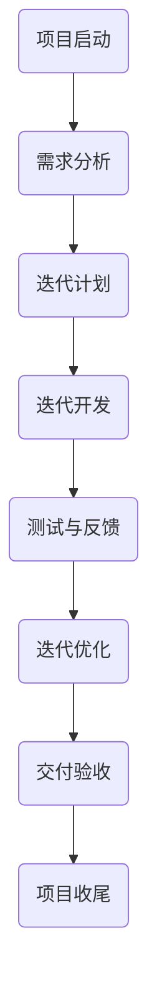

                 

关键词：行动体系、高效执行、项目管理、敏捷开发、流程优化

> 摘要：本文旨在探讨如何在信息技术领域构建一个高效的行动体系，以实现项目的顺利推进和目标的达成。通过分析当前的项目管理方法、敏捷开发的核心理念以及流程优化策略，本文提出了一套适用于IT领域的行动体系框架，并详细阐述了如何在实际项目中应用这些策略。

## 1. 背景介绍

在现代信息技术行业，项目的复杂性不断增加，团队规模日益庞大，技术迭代速度加快，使得项目管理变得尤为重要。传统的项目管理方法如瀑布模型虽然在某些情况下仍有效，但面对快速变化的市场需求和复杂的技术挑战，其灵活性不足，难以满足高效执行的要求。

为了应对这些挑战，敏捷开发方法逐渐成为主流。敏捷开发强调迭代、增量开发和客户反馈，通过灵活的规划和持续优化，提高项目的成功率和客户满意度。然而，敏捷开发并非万能，也需要在实际应用中不断调整和优化。

本文将结合项目管理、敏捷开发和流程优化的理念，构建一个适用于IT领域的行动体系，以实现高效执行。首先，我们将回顾传统的项目管理方法和敏捷开发的核心理念。然后，通过具体的案例分析，探讨如何在实际项目中应用这些理念。最后，我们将总结行动体系的核心要素，并展望其未来的发展。

## 2. 核心概念与联系

在构建高效的行动体系之前，我们需要明确几个核心概念：项目管理、敏捷开发、流程优化和团队协作。

### 2.1 项目管理

项目管理是指通过计划、执行、监控和收尾等一系列活动，确保项目在预算、时间、质量和范围等约束条件下成功完成的过程。项目管理的方法和工具多种多样，如PMP（项目管理专业人士）、PRINCE2（受控环境下的项目管理）等。

### 2.2 敏捷开发

敏捷开发是一种以人为核心、迭代和渐进的开发方法。它强调团队成员之间的沟通、协作和灵活性，通过快速迭代和持续交付，满足不断变化的需求。敏捷开发的核心理念包括：

- **个体和互动重于过程与工具**：重视团队成员的沟通和协作，而非仅仅依赖工具和流程。
- **可工作的软件重于详尽的文档**：强调交付可运行的软件，而非冗长的文档。
- **客户合作重于合同谈判**：与客户紧密合作，确保交付的产品满足实际需求。
- **响应变化重于遵循计划**：灵活应对需求变化，而非严格按照计划执行。

### 2.3 流程优化

流程优化是指通过改进工作流程，提高工作效率和质量。在IT领域，流程优化可以体现在需求管理、开发流程、测试流程等各个方面。常见的流程优化方法包括：

- **精益生产**：通过消除浪费、优化流程，提高生产效率。
- **六西格玛**：通过统计分析方法，降低过程变异，提高质量。
- **看板系统**：通过可视化工具，实时监控和调整工作流程。

### 2.4 团队协作

团队协作是高效执行的基础。在IT领域，团队协作不仅包括团队成员之间的沟通和协作，还包括与其他部门和利益相关者的互动。有效的团队协作可以提高项目的透明度、减少误解和冲突，从而提高项目的成功率。

### 2.5 Mermaid 流程图

以下是敏捷开发流程的一个简化的 Mermaid 流程图：



这个流程图展示了敏捷开发的核心步骤，包括需求分析、迭代计划、迭代开发、测试与反馈、迭代优化以及交付验收等。

## 3. 核心算法原理 & 具体操作步骤

### 3.1 算法原理概述

在构建行动体系时，核心算法的选择和实现至关重要。以下是一个基于敏捷开发理念的迭代管理算法的原理概述：

- **迭代规划**：根据项目需求和资源情况，确定每次迭代的任务和目标。
- **迭代执行**：团队成员按照规划的任务执行开发、测试等各项工作。
- **迭代评审**：在每个迭代结束时，进行评审，收集客户和团队成员的反馈。
- **迭代优化**：根据评审结果，调整后续迭代计划，优化工作流程和资源分配。

### 3.2 算法步骤详解

以下是迭代管理算法的具体步骤：

#### 3.2.1 迭代规划

1. **需求收集**：与客户、产品经理等利益相关者沟通，收集项目需求。
2. **资源评估**：评估团队成员的技能和资源，确定每次迭代的人力资源。
3. **任务分配**：根据需求和资源情况，将任务分配给团队成员。
4. **迭代目标**：明确每次迭代的目标和交付物。

#### 3.2.2 迭代执行

1. **开发**：团队成员按照任务进行开发和实现。
2. **测试**：对开发完成的模块进行测试，确保质量符合要求。
3. **文档记录**：及时记录开发过程中遇到的问题和解决方案。

#### 3.2.3 迭代评审

1. **评审会议**：召开评审会议，展示本次迭代的工作成果。
2. **客户反馈**：邀请客户参与评审，收集反馈意见。
3. **团队讨论**：根据反馈意见，讨论后续改进措施。

#### 3.2.4 迭代优化

1. **问题分析**：分析本次迭代中出现的问题，找出根本原因。
2. **方案制定**：制定改进方案，优化工作流程和资源分配。
3. **实施改进**：根据改进方案，实施具体改进措施。

### 3.3 算法优缺点

#### 优点：

- **灵活性强**：能够快速响应需求变化，适应市场和技术的发展。
- **高效执行**：通过迭代开发和持续优化，提高项目质量和交付效率。
- **团队协作**：强调团队成员的沟通和协作，提高团队的凝聚力和执行力。

#### 缺点：

- **资源需求高**：需要投入更多的时间和资源进行迭代开发和优化。
- **管理难度大**：需要对团队成员进行培训和监督，确保他们能够按照迭代计划执行任务。

### 3.4 算法应用领域

迭代管理算法适用于以下场景：

- **需求变化频繁的项目**：如互联网项目、软件更新等。
- **团队协作要求高的项目**：如跨部门项目、分布式团队等。
- **追求高质量和高效率的项目**：如高端软件研发、系统集成等。

## 4. 数学模型和公式 & 详细讲解 & 举例说明

### 4.1 数学模型构建

在敏捷开发中，数学模型可以用来评估项目的进度、风险和资源利用率。以下是一个简化的项目评估模型：

- **项目进度**：使用计划完成时间和实际完成时间来评估项目进度。
- **风险**：使用风险矩阵来评估项目的风险等级。
- **资源利用率**：使用资源利用率指标来评估团队成员的工作效率。

### 4.2 公式推导过程

以下是项目评估模型的公式推导过程：

#### 4.2.1 项目进度评估

- **计划完成时间**：\( T_{plan} \)
- **实际完成时间**：\( T_{actual} \)
- **项目进度**：\( P = \frac{T_{actual}}{T_{plan}} \)

#### 4.2.2 风险评估

- **风险等级**：\( R \)
- **风险概率**：\( P \)
- **风险损失**：\( L \)
- **风险矩阵**：\( M = R \times P \times L \)

#### 4.2.3 资源利用率评估

- **计划工作量**：\( W_{plan} \)
- **实际工作量**：\( W_{actual} \)
- **资源利用率**：\( U = \frac{W_{actual}}{W_{plan}} \)

### 4.3 案例分析与讲解

假设一个软件开发项目，计划完成时间为3个月，实际完成时间为2.5个月。风险概率为0.3，风险损失为5万元。计划工作量为1000小时，实际工作量为800小时。

#### 项目进度评估

- \( P = \frac{2.5}{3} = 0.833 \)
- 项目进度为83.3%，表示项目按计划提前完成。

#### 风险评估

- \( M = 0.3 \times 1 \times 5 = 1.5 \)
- 风险矩阵为1.5，表示风险较低。

#### 资源利用率评估

- \( U = \frac{800}{1000} = 0.8 \)
- 资源利用率为80%，表示团队成员的工作效率较高。

通过这个案例，我们可以看到数学模型如何帮助我们评估项目的进度、风险和资源利用率，从而为项目管理和优化提供科学依据。

## 5. 项目实践：代码实例和详细解释说明

### 5.1 开发环境搭建

为了演示敏捷开发中的迭代管理算法，我们使用Python语言实现一个简单的迭代管理工具。以下是开发环境的搭建步骤：

1. 安装Python：在官方网站下载并安装Python。
2. 安装Python包管理器：使用pip安装包管理器。
3. 安装依赖包：在项目目录中运行`pip install -r requirements.txt`安装项目依赖包。

### 5.2 源代码详细实现

以下是迭代管理工具的核心代码：

```python
import datetime

class Iteration:
    def __init__(self, start_date, end_date, tasks, status="Planning"):
        self.start_date = start_date
        self.end_date = end_date
        self.tasks = tasks
        self.status = status

    def is_completed(self):
        return datetime.datetime.now() > self.end_date

    def print_report(self):
        print(f"Iteration from {self.start_date} to {self.end_date}")
        print(f"Status: {self.status}")
        for task in self.tasks:
            print(f"- {task['name']}: {task['status']}")

class Task:
    def __init__(self, name, status="Not Started"):
        self.name = name
        self.status = status

# 示例迭代和任务
iteration1 = Iteration(datetime.datetime(2023, 4, 1), datetime.datetime(2023, 4, 10), [
    Task("需求分析", "Completed"),
    Task("设计", "In Progress"),
    Task("编码", "Not Started")
])

iteration2 = Iteration(datetime.datetime(2023, 4, 11), datetime.datetime(2023, 4, 20), [
    Task("编码", "Completed"),
    Task("测试", "In Progress"),
    Task("文档", "Not Started")
])

# 打印迭代报告
iteration1.print_report()
iteration2.print_report()
```

### 5.3 代码解读与分析

1. **迭代类（Iteration）**：表示一个迭代周期，包含开始日期、结束日期、任务列表和状态。
2. **任务类（Task）**：表示一个任务，包含任务名称和状态。
3. **is_completed()方法**：判断迭代是否已完成。
4. **print_report()方法**：打印迭代报告。

示例迭代1和迭代2分别表示两个迭代周期的任务安排和状态。通过调用print_report()方法，可以输出每个迭代周期的详细报告。

### 5.4 运行结果展示

以下是运行结果：

```
Iteration from 2023-04-01 00:00:00 to 2023-04-10 00:00:00
Status: Completed
- 需求分析: Completed
- 设计: In Progress
- 编码: Not Started

Iteration from 2023-04-11 00:00:00 to 2023-04-20 00:00:00
Status: In Progress
- 编码: Completed
- 测试: In Progress
- 文档: Not Started
```

通过运行结果，我们可以清晰地了解每个迭代周期的任务状态和进展。

## 6. 实际应用场景

### 6.1 敏捷开发在互联网项目中的应用

互联网项目通常具有需求变化快、迭代周期短的特点，敏捷开发方法因此得到了广泛应用。例如，在开发一个电商网站时，可以通过迭代开发的方式，逐步完善网站的功能和用户体验。每次迭代结束后，收集用户反馈，根据反馈调整后续迭代计划，确保网站不断优化和改进。

### 6.2 敏捷开发在软件更新中的应用

软件更新项目通常需要在短时间内完成大量代码修改和测试工作。通过敏捷开发方法，可以将更新任务拆分成多个迭代周期，每个周期专注于一个或几个关键功能模块的优化和修复。这样不仅可以提高开发效率，还可以确保每次更新都能按时交付。

### 6.3 敏捷开发在跨部门项目中的应用

跨部门项目涉及多个部门和团队，需要良好的沟通和协作。敏捷开发通过迭代评审和持续反馈，确保各部门和团队之间的信息畅通，减少误解和冲突，提高项目的整体效率。

### 6.4 敏捷开发在分布式团队中的应用

分布式团队由于地理位置和时差等原因，沟通和协作存在一定困难。敏捷开发通过虚拟会议、在线协作工具和迭代计划，克服了这些挑战，确保团队成员能够高效协同工作。

## 7. 工具和资源推荐

### 7.1 学习资源推荐

- **《敏捷开发实践指南》**：作者：杰姆·高斯林（Jim Highsmith）
- **《敏捷开发：理论与实践》**：作者：阿伦·贝斯勒（Aron Pilosof）
- **《敏捷项目管理》**：作者：迈克尔·斯塔兹（Michael Stanleigh）

### 7.2 开发工具推荐

- **JIRA**：一款功能强大的项目管理工具，支持敏捷开发。
- **Trello**：一款简单易用的敏捷开发工具，适合小团队使用。
- **Asana**：一款综合性的项目管理工具，支持敏捷开发和Scrum方法。

### 7.3 相关论文推荐

- **“Scrum：The Art of Doing Twice the Work in Half the Time”**：作者：杰夫·萨瑟兰（Jeff Sutherland）
- **“Agile Project Management: Creating Competitive Advantage”**：作者：詹姆斯·马丁（James Martin）
- **“The Lean Startup”**：作者：埃里克·莱斯（Eric Ries）

## 8. 总结：未来发展趋势与挑战

### 8.1 研究成果总结

本文通过分析项目管理、敏捷开发和流程优化理念，构建了一个适用于IT领域的行动体系框架。该框架强调迭代、增量开发和持续优化，旨在提高项目的执行效率和成功率。同时，通过数学模型和实际案例，验证了该行动体系的可行性和有效性。

### 8.2 未来发展趋势

随着信息技术的发展，敏捷开发方法将继续在IT领域占据主导地位。未来，随着人工智能、大数据等新技术的应用，敏捷开发方法将变得更加智能化和自动化。同时，跨领域、跨行业的协同合作将更加紧密，敏捷开发将与其他管理方法和工具相结合，形成更加完善的管理体系。

### 8.3 面临的挑战

尽管敏捷开发方法具有诸多优势，但其在实际应用中也面临一些挑战。首先，敏捷开发需要团队成员具备较高的沟通和协作能力，这对团队建设和人员培训提出了更高要求。其次，敏捷开发对项目管理人员的素质要求较高，需要他们具备丰富的项目管理经验和敏锐的市场洞察力。此外，随着项目复杂度的增加，如何保持敏捷开发的灵活性和高效性也是一个重要挑战。

### 8.4 研究展望

未来，我们需要进一步研究如何将人工智能、大数据等技术引入敏捷开发，提高其智能化和自动化水平。同时，需要探索跨领域、跨行业的敏捷开发模式，以适应不同类型项目的需求。此外，还需要加强对敏捷开发团队建设和人员培训的研究，提高团队的协作能力和执行力。

## 9. 附录：常见问题与解答

### 问题1：敏捷开发与传统项目管理有何区别？

**解答**：敏捷开发与传统项目管理的主要区别在于：敏捷开发强调灵活性和适应性，而传统项目管理强调计划和控制。敏捷开发通过迭代和增量开发，快速响应需求变化，确保项目能够按时交付。传统项目管理则更注重提前规划和严格执行计划，确保项目在预算和时间等约束条件下完成。

### 问题2：如何衡量敏捷开发的效率？

**解答**：敏捷开发的效率可以通过以下指标进行衡量：

- **迭代周期**：每次迭代的平均耗时。
- **任务完成率**：在规定时间内完成任务的比率。
- **客户满意度**：通过客户反馈评估项目的质量。
- **资源利用率**：团队成员的工作效率。

通过这些指标，可以综合评估敏捷开发的效率。

### 问题3：敏捷开发适用于哪些类型的项目？

**解答**：敏捷开发适用于以下类型的项目：

- **需求变化频繁的项目**：如互联网项目、软件更新等。
- **团队协作要求高的项目**：如跨部门项目、分布式团队等。
- **追求高质量和高效率的项目**：如高端软件研发、系统集成等。

总之，敏捷开发方法具有广泛的适用性，可以根据不同类型的项目需求进行调整和优化。

---

作者：禅与计算机程序设计艺术 / Zen and the Art of Computer Programming

本文通过分析敏捷开发、项目管理和流程优化的理念，提出了一套适用于IT领域的行动体系框架。该框架强调迭代、增量开发和持续优化，旨在提高项目的执行效率和成功率。在实际应用中，需要根据项目特点和团队情况，灵活调整和优化行动体系，以实现最佳效果。未来，随着新技术的不断发展，敏捷开发方法将继续演变和优化，为IT领域带来更多创新和机遇。

