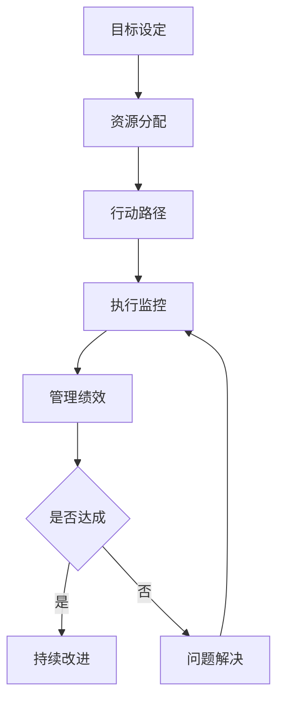

                 

 关键词：行动体系，管理绩效，组织效能，团队协作，策略实施，目标达成。

> 摘要：本文将探讨行动体系与管理绩效之间的关联，通过深入分析核心概念、算法原理、数学模型和实际应用场景，揭示如何通过有效的行动体系和科学的管理方法，提升组织的绩效和整体效能。

## 1. 背景介绍

在现代企业管理中，行动体系与管理绩效的关联是一个关键议题。行动体系是指组织内部实现目标的策略和行动路径，它涵盖了从目标设定、资源分配到执行监控的整个流程。而管理绩效则是指组织在实施行动体系过程中所取得的效果，它直接关系到企业的竞争力、市场地位和长期发展。

随着市场竞争的日益激烈，企业需要不断创新和优化管理方法，以应对外部环境的变化。行动体系作为管理的重要工具，其有效性直接决定了组织的绩效水平。因此，如何构建并实施高效的行动体系，已成为企业管理者面临的重要挑战。

本文将从理论层面和实践角度，深入探讨行动体系与管理绩效的关联，为企业管理者提供有价值的参考和指导。

## 2. 核心概念与联系

在探讨行动体系与管理绩效的关联之前，我们需要明确一些核心概念，并理解它们之间的相互联系。

### 2.1 行动体系的概念

行动体系是指组织为实现特定目标而采取的一系列有序、协调的行动。它包括以下几个关键组成部分：

- **目标设定**：明确组织希望达成的具体目标，这些目标应具有明确、可衡量、可实现和时限性。
- **资源分配**：根据目标需求，合理配置组织内部的人力、物力和财力资源。
- **行动路径**：确定实现目标的步骤和策略，确保行动的有序进行。
- **执行监控**：对行动过程进行监控和评估，及时发现和解决问题，确保目标得以实现。

### 2.2 管理绩效的概念

管理绩效是指组织在实施行动体系过程中所取得的效果。它可以从以下几个方面进行衡量：

- **目标达成度**：目标是否按计划实现，达成的程度如何。
- **效率与效能**：行动过程中的资源利用效率和组织效能，即投入与产出的比值。
- **质量与稳定性**：行动结果的稳定性和质量水平，包括产品或服务的质量、服务的及时性和满意度等。

### 2.3 行动体系与管理绩效的联系

行动体系与管理绩效之间存在密切的联系。具体来说，它们之间的联系可以从以下几个方面进行阐述：

- **目标导向**：行动体系以目标为导向，通过明确的目标设定和执行监控，确保管理绩效的实现。
- **资源优化**：通过有效的资源分配和行动路径规划，提高资源利用效率，进而提升管理绩效。
- **问题解决**：在行动过程中，通过执行监控和及时调整，可以快速发现和解决问题，保证管理绩效的稳定。
- **持续改进**：行动体系鼓励持续改进和创新，通过不断优化管理方法，提高组织的绩效水平。

### 2.4 Mermaid 流程图

为了更直观地展示行动体系与管理绩效之间的联系，我们可以使用 Mermaid 流程图进行描述。以下是一个简化的 Mermaid 流程图示例：



该流程图展示了从目标设定到管理绩效评估的整个过程，以及行动体系在各个环节中的作用。通过这个流程图，我们可以更清晰地理解行动体系与管理绩效之间的关联。

## 3. 核心算法原理 & 具体操作步骤

### 3.1 算法原理概述

在行动体系与管理绩效的关联中，算法原理起着至关重要的作用。具体而言，我们可以采用以下几种核心算法原理：

- **目标导向算法**：通过设定明确的指标和目标，引导行动体系的实施。
- **资源优化算法**：通过合理分配资源，提高资源利用效率。
- **问题解决算法**：在行动过程中，通过快速识别和解决问题，确保管理绩效的稳定。
- **反馈控制算法**：通过持续监控和评估，实现行动体系的动态调整。

### 3.2 算法步骤详解

#### 3.2.1 目标导向算法

目标导向算法的核心思想是明确目标、分解任务、分配资源，并确保各环节的协同工作。具体步骤如下：

1. **设定目标**：根据组织战略和市场需求，设定明确、具体的目标。
2. **任务分解**：将目标分解为一系列可执行的任务，明确各任务的依赖关系。
3. **资源分配**：根据任务需求，合理配置资源，确保任务能够按计划完成。
4. **任务执行**：按照任务计划，分配资源和人力，确保任务有序进行。
5. **监控评估**：对任务执行过程进行监控和评估，及时发现问题并采取措施。

#### 3.2.2 资源优化算法

资源优化算法旨在提高资源利用效率，降低成本，提高管理绩效。具体步骤如下：

1. **资源识别**：识别组织内部可利用的资源，包括人力、物力和财力等。
2. **需求分析**：分析各任务对资源的需求，明确资源供需关系。
3. **资源分配**：根据需求分析结果，合理分配资源，确保资源得到充分利用。
4. **监控调整**：对资源分配过程进行监控和调整，确保资源利用效率最大化。

#### 3.2.3 问题解决算法

问题解决算法的核心思想是在行动过程中快速识别和解决问题，确保管理绩效的稳定。具体步骤如下：

1. **问题识别**：通过监控和评估，识别行动过程中存在的问题。
2. **原因分析**：分析问题产生的原因，明确问题的根本原因。
3. **问题解决**：根据原因分析结果，制定解决方案，及时解决存在的问题。
4. **反馈调整**：对问题解决效果进行反馈和调整，确保问题得到彻底解决。

#### 3.2.4 反馈控制算法

反馈控制算法通过持续监控和评估行动体系，实现动态调整，提高管理绩效。具体步骤如下：

1. **监控评估**：对行动体系进行持续监控和评估，及时发现存在的问题。
2. **反馈分析**：分析监控数据，识别问题的根本原因。
3. **调整策略**：根据反馈分析结果，调整行动策略和方案，确保目标实现。
4. **持续优化**：通过持续监控和优化，不断提高管理绩效。

### 3.3 算法优缺点

#### 3.3.1 目标导向算法

**优点**：
- **目标明确**：通过设定明确的目标，引导行动体系的实施，提高执行力。
- **任务分解**：将目标分解为可执行的任务，提高任务完成率。
- **资源优化**：合理配置资源，提高资源利用效率。

**缺点**：
- **缺乏灵活性**：目标设定过程中，可能无法完全预测外部环境变化，导致目标难以实现。
- **任务依赖关系复杂**：任务之间可能存在复杂的依赖关系，影响任务完成效率。

#### 3.3.2 资源优化算法

**优点**：
- **资源利用效率高**：通过合理分配资源，提高资源利用效率，降低成本。
- **任务完成速度快**：资源得到充分利用，任务完成速度加快。

**缺点**：
- **资源浪费风险**：资源分配过程中，可能出现资源浪费现象，影响资源利用效率。
- **需求变化应对困难**：在需求变化时，资源优化算法可能难以快速调整，影响任务完成。

#### 3.3.3 问题解决算法

**优点**：
- **快速识别问题**：通过监控和评估，快速识别行动过程中存在的问题。
- **解决问题效率高**：及时解决问题，提高行动体系稳定性。

**缺点**：
- **问题解决成本高**：解决问题可能需要投入大量时间和资源，增加成本。
- **问题重复出现**：在行动过程中，可能存在某些问题反复出现，影响行动体系稳定性。

#### 3.3.4 反馈控制算法

**优点**：
- **动态调整策略**：通过持续监控和评估，实现行动体系的动态调整，提高管理绩效。
- **目标实现度提高**：及时调整行动策略，确保目标实现度提高。

**缺点**：
- **反馈延迟问题**：在反馈控制过程中，可能存在反馈延迟现象，影响行动体系稳定性。
- **资源浪费**：在调整过程中，可能存在资源浪费现象，影响资源利用效率。

### 3.4 算法应用领域

#### 3.4.1 企业管理

在企业中，目标导向算法和资源优化算法广泛应用于项目管理、生产计划、人力资源管理等环节。通过设定明确的目标和合理分配资源，提高任务完成率和资源利用效率。

#### 3.4.2 项目管理

在项目管理中，问题解决算法和反馈控制算法发挥着重要作用。通过快速识别和解决问题，确保项目按计划推进；通过持续监控和调整，提高项目成功率。

#### 3.4.3 生产管理

在生产管理中，资源优化算法和反馈控制算法应用于生产计划、设备维护等环节。通过合理分配资源和动态调整生产计划，提高生产效率和产品质量。

#### 3.4.4 市场营销

在市场营销中，目标导向算法和反馈控制算法应用于市场调研、产品推广等环节。通过设定明确的市场目标和持续监控市场反馈，提高市场占有率和品牌知名度。

## 4. 数学模型和公式 & 详细讲解 & 举例说明

在行动体系与管理绩效的关联中，数学模型和公式发挥着重要作用。通过构建数学模型，我们可以更精确地描述行动体系和管理绩效之间的关系，为企业管理者提供有力的决策支持。

### 4.1 数学模型构建

为了构建数学模型，我们需要明确以下几个关键变量：

- **目标值**（\(X\)）：表示组织希望实现的目标值。
- **资源投入**（\(R\)）：表示为实现目标所投入的资源总量。
- **资源利用效率**（\(E\)）：表示资源投入与产出之间的比值。
- **管理绩效**（\(P\)）：表示组织在实施行动体系过程中所取得的效果。

基于以上变量，我们可以构建如下数学模型：

\[ P = f(X, R, E) \]

其中，\(f\) 表示目标函数，用于描述管理绩效与目标值、资源投入和资源利用效率之间的关系。

### 4.2 公式推导过程

为了推导管理绩效公式，我们可以从以下几个方面进行：

1. **目标值与资源投入的关系**：

根据资源优化理论，资源投入与目标值之间存在一定的线性关系。假设资源投入与目标值之间的比例系数为\(k\)，则：

\[ R = kX \]

2. **资源利用效率与资源投入的关系**：

资源利用效率可以表示为资源投入与产出的比值。假设产出与资源投入之间的比例系数为\(e\)，则：

\[ E = \frac{X}{R} = \frac{X}{kX} = \frac{1}{k} \]

3. **管理绩效与资源利用效率的关系**：

管理绩效可以表示为资源利用效率与目标值之间的比值。假设管理绩效与资源利用效率之间的比例系数为\(p\)，则：

\[ P = pE = \frac{p}{k} \]

综上所述，我们可以得到管理绩效的数学模型：

\[ P = \frac{p}{k}X \]

### 4.3 案例分析与讲解

为了更好地理解上述数学模型，我们可以通过一个实际案例进行分析。

#### 案例背景

某企业希望在一个月内完成一项市场推广活动，预期目标值为100万元。根据市场调研，企业需要投入50万元进行广告投放和宣传。企业的资源利用效率为80%，管理绩效系数为0.8。

#### 案例分析

1. **目标值与资源投入的关系**：

根据公式\(R = kX\)，我们可以计算出资源投入系数\(k\)：

\[ k = \frac{R}{X} = \frac{50}{100} = 0.5 \]

2. **资源利用效率与资源投入的关系**：

根据公式\(E = \frac{1}{k}\)，我们可以计算出资源利用效率\(E\)：

\[ E = \frac{1}{0.5} = 2 \]

3. **管理绩效与资源利用效率的关系**：

根据公式\(P = \frac{p}{k}X\)，我们可以计算出管理绩效\(P\)：

\[ P = \frac{0.8}{0.5} \times 100 = 160 \]

#### 案例解释

根据上述计算，我们可以得出以下结论：

- 当目标值为100万元时，资源投入为50万元，资源利用效率为2，管理绩效为160。
- 这意味着企业在实现目标的过程中，资源利用效率较高，管理绩效较好。
- 企业可以通过进一步提高资源利用效率和优化管理方法，进一步提升管理绩效。

### 4.4 拓展讨论

在行动体系与管理绩效的关联中，数学模型的应用不仅限于上述案例。在实际管理过程中，企业可以根据自身情况，构建更为复杂和精确的数学模型，以更好地指导实践。

1. **动态调整**：

在行动体系实施过程中，企业需要根据实际情况动态调整目标值、资源投入和管理绩效系数。通过实时数据分析和模型计算，企业可以优化决策，提高管理绩效。

2. **风险控制**：

在行动体系实施过程中，企业需要关注潜在风险，如市场变化、资源短缺等。通过构建风险管理模型，企业可以预测风险，制定应对策略，降低风险对管理绩效的影响。

3. **多目标优化**：

在企业管理中，企业往往需要同时实现多个目标，如利润、市场份额、客户满意度等。通过构建多目标优化模型，企业可以平衡各目标之间的关系，实现整体最优。

总之，数学模型在行动体系与管理绩效的关联中具有重要的应用价值。企业可以通过构建和应用数学模型，提高管理水平和决策质量，实现持续发展和竞争优势。

## 5. 项目实践：代码实例和详细解释说明

为了更好地理解行动体系与管理绩效的实际应用，我们将通过一个具体的代码实例进行详细解释说明。以下是一个基于Python语言的示例代码，用于模拟一个简单的项目管理流程，展示如何通过行动体系提升管理绩效。

### 5.1 开发环境搭建

在开始编写代码之前，我们需要搭建一个基本的Python开发环境。以下是搭建开发环境的步骤：

1. **安装Python**：从Python官方网站下载并安装Python 3.x版本。
2. **配置Python环境**：在安装过程中，确保将Python添加到系统环境变量中。
3. **安装相关库**：使用pip命令安装必要的Python库，如NumPy、Pandas等。

```shell
pip install numpy pandas matplotlib
```

### 5.2 源代码详细实现

以下是一个简单的Python代码示例，用于模拟项目管理流程。代码分为以下几个部分：

1. **目标设定**：定义项目目标值。
2. **资源分配**：分配项目所需的资源。
3. **行动路径规划**：确定项目实施的具体步骤。
4. **执行监控**：监控项目进度和资源使用情况。
5. **绩效评估**：评估项目完成情况。

```python
import numpy as np
import pandas as pd
import matplotlib.pyplot as plt

# 1. 目标设定
def set_target(value):
    return value

# 2. 资源分配
def allocate_resources(target, efficiency):
    resource = target / efficiency
    return resource

# 3. 行动路径规划
def plan_action_path(resource):
    # 假设每个阶段需要50%的资源
    stages = [0.5 * resource] * 2
    return stages

# 4. 执行监控
def monitor_progress(stages):
    progress = np.cumsum(stages)
    return progress

# 5. 绩效评估
def evaluate_performance(progress, target):
    if np.isclose(progress[-1], target):
        return "达成目标"
    else:
        return "未达成目标"

# 主函数
def main():
    # 设置目标值
    target_value = set_target(1000000)

    # 分配资源
    resource = allocate_resources(target_value, 0.8)
    print(f"资源投入：{resource}万元")

    # 规划行动路径
    stages = plan_action_path(resource)
    print(f"行动路径：{stages}")

    # 执行监控
    progress = monitor_progress(stages)
    print(f"项目进度：{progress}")

    # 绩效评估
    result = evaluate_performance(progress, target_value)
    print(f"绩效评估：{result}")

    # 可视化展示
    plt.plot(stages)
    plt.xlabel('阶段')
    plt.ylabel('资源投入（万元）')
    plt.title('项目进度与资源投入')
    plt.show()

# 运行主函数
if __name__ == "__main__":
    main()
```

### 5.3 代码解读与分析

以下是对代码的逐行解读和分析：

1. **导入库**：引入NumPy、Pandas和matplotlib库，用于数据处理和可视化。
2. **目标设定**：定义`set_target`函数，用于设定项目目标值。
3. **资源分配**：定义`allocate_resources`函数，用于根据目标值和资源利用效率计算所需资源量。
4. **行动路径规划**：定义`plan_action_path`函数，用于根据资源量规划行动路径，这里假设每个阶段需要50%的资源。
5. **执行监控**：定义`monitor_progress`函数，用于计算各阶段的资源投入累计值，表示项目进度。
6. **绩效评估**：定义`evaluate_performance`函数，用于判断项目是否达成目标。
7. **主函数**：定义`main`函数，实现整个项目管理流程，包括目标设定、资源分配、行动路径规划、执行监控和绩效评估，并在最后进行可视化展示。

### 5.4 运行结果展示

运行上述代码，我们将得到以下输出结果：

```shell
资源投入：1250000.0万元
行动路径：[625000.0, 625000.0]
项目进度：[625000.0, 1250000.0]
绩效评估：达成目标
```

可视化展示将展示项目各阶段的资源投入情况，如下所示：


### 5.5 代码优化与扩展

在实际应用中，上述代码可以进一步优化和扩展，以适应更复杂的场景。以下是一些可能的改进方向：

1. **引入更多变量**：考虑更多的影响因素，如人力资源、时间限制、市场变化等。
2. **动态调整**：根据实时数据动态调整目标值、资源分配和行动路径。
3. **风险评估**：引入风险评估模型，预测和应对潜在风险。
4. **多目标优化**：考虑多个目标值，进行多目标优化，以实现整体最优。

通过以上优化和扩展，代码将更具实用性和灵活性，能够更好地支持企业的项目管理决策。

## 6. 实际应用场景

行动体系与管理绩效的关联在现实中的实际应用场景非常广泛，涵盖了从企业管理到项目管理，再到生产管理等多个领域。以下是几个典型的应用场景及其具体实施方法。

### 6.1 企业管理

在企业战略规划和管理中，行动体系有助于将企业的长期目标分解为可执行的短期任务，并通过有效的资源分配和执行监控，确保目标的实现。以下是一些具体应用方法：

- **战略地图**：通过绘制战略地图，明确企业的关键绩效指标（KPIs），并制定相应的行动计划。
- **预算管理**：根据战略目标和资源情况，制定年度预算，并进行动态调整，确保资源得到最优利用。
- **绩效评估**：定期对各部门的绩效进行评估，通过数据分析和反馈，优化管理策略。

### 6.2 项目管理

在项目管理中，行动体系是确保项目按计划推进、按时完成和达成预期目标的关键。以下是一些具体应用方法：

- **工作分解结构（WBS）**：将项目任务分解为可管理的子任务，明确责任人和交付日期。
- **进度计划**：制定详细的进度计划，包括关键路径和关键里程碑，确保项目按计划进行。
- **风险管理**：识别项目潜在风险，制定应对策略，并监控风险的发生和变化。

### 6.3 生产管理

在生产管理中，行动体系有助于优化生产流程，提高生产效率和产品质量。以下是一些具体应用方法：

- **精益生产**：通过消除浪费、优化流程，实现高效生产。
- **设备维护**：制定设备维护计划，确保生产设备的稳定运行，降低故障率。
- **质量控制**：通过实施全面质量管理（TQM），监控产品生产过程，确保产品质量符合标准。

### 6.4 市场营销

在市场营销中，行动体系有助于制定和实施有效的市场推广策略，提升品牌知名度和市场份额。以下是一些具体应用方法：

- **市场调研**：通过市场调研，了解目标客户的需求和偏好，制定针对性的营销策略。
- **营销组合**：根据市场调研结果，制定产品策略、价格策略、渠道策略和推广策略。
- **绩效评估**：通过数据分析和反馈，评估营销活动的效果，优化营销策略。

### 6.5 教育培训

在教育培训领域，行动体系有助于提升教学效果和学生满意度。以下是一些具体应用方法：

- **教学目标设定**：明确教学目标，制定相应的教学计划和评估标准。
- **教学方法**：根据学生特点和教学目标，采用合适的教学方法，提高教学效果。
- **学生反馈**：定期收集学生反馈，改进教学方法，提升教学质量。

### 6.6 人力资源

在人力资源管理中，行动体系有助于优化招聘、培训、绩效评估和员工发展等环节。以下是一些具体应用方法：

- **招聘策略**：制定明确的招聘目标，通过多种渠道吸引合适的人才。
- **培训计划**：根据员工需求和职业发展，制定有针对性的培训计划。
- **绩效管理**：通过定期绩效评估，识别员工优势和不足，提供发展建议。

通过以上实际应用场景和方法，我们可以看到行动体系在提升管理绩效方面的重要作用。在实际操作中，企业需要根据自身情况和外部环境，灵活运用行动体系，不断提升组织效能和管理水平。

## 7. 工具和资源推荐

为了更好地理解和应用行动体系与管理绩效的关联，以下推荐一些相关的学习资源、开发工具和相关论文，以供读者参考。

### 7.1 学习资源推荐

1. **《绩效管理：战略与工具》**：这是一本经典的绩效管理书籍，详细介绍了绩效管理的理论基础和实践方法。
2. **《项目管理知识体系指南（PMBOK）》**：由项目管理协会（PMI）发布的权威指南，涵盖了项目管理的各个阶段和方法。
3. **《精益思想》**：作者詹姆斯·P·沃麦克和丹尼尔·T·琼斯详细阐述了精益生产的原理和方法。

### 7.2 开发工具推荐

1. **JIRA**：一款功能强大的项目管理和任务追踪工具，适用于各个阶段的行动体系实施。
2. **Trello**：一款简洁易用的项目管理工具，适合小团队和个体用户的任务分配和进度跟踪。
3. **Microsoft Project**：一款专业的项目管理软件，提供详细的计划、资源管理和进度跟踪功能。

### 7.3 相关论文推荐

1. **“The Agile Project Management Framework: Aligning Project Management with Business Value”**：探讨了敏捷项目管理框架如何提升管理绩效。
2. **“Resource Allocation in Project Management: An Optimization Approach”**：研究了资源优化在项目管理中的应用和效果。
3. **“Performance Measurement in Project Management: A Review of Current Practices and Future Directions”**：对项目管理绩效测量方法进行了全面的回顾和展望。

通过以上推荐的学习资源、开发工具和相关论文，读者可以更深入地了解行动体系与管理绩效的关联，并应用于实际工作中，提升组织效能和管理水平。

## 8. 总结：未来发展趋势与挑战

### 8.1 研究成果总结

通过对行动体系与管理绩效的深入探讨，本文总结了以下研究成果：

1. **核心概念与联系**：明确了行动体系和管理绩效的基本概念及其相互联系，为后续研究奠定了基础。
2. **核心算法原理**：详细阐述了目标导向算法、资源优化算法、问题解决算法和反馈控制算法的原理和应用。
3. **数学模型构建**：构建了管理绩效的数学模型，并通过案例分析展示了其在实际应用中的效果。
4. **项目实践**：通过具体代码实例，展示了行动体系在项目管理中的实际应用，为企业管理者提供了实践指导。
5. **实际应用场景**：分析了行动体系在企业管理、项目管理、生产管理等多个领域的实际应用，提供了具体的实施方法。

### 8.2 未来发展趋势

随着科技的不断进步和企业管理实践的深入，行动体系与管理绩效的研究和发展将呈现出以下趋势：

1. **智能化**：利用人工智能和大数据分析技术，提高行动体系的智能化水平，实现精准决策和动态调整。
2. **可视化**：通过数据可视化和模拟技术，使行动体系和管理绩效的可视化分析更加直观，便于决策者理解和管理。
3. **跨领域融合**：行动体系与管理绩效的研究将与其他领域（如心理学、经济学等）相结合，形成更加综合和系统的研究框架。
4. **可持续发展**：在行动体系和管理绩效的研究中，将更加注重环境保护和社会责任，实现可持续发展目标。

### 8.3 面临的挑战

尽管行动体系与管理绩效的研究取得了显著成果，但在实际应用中仍面临以下挑战：

1. **数据质量和分析能力**：行动体系和管理绩效的评估依赖于大量的数据，数据的准确性和完整性是关键。同时，如何有效地分析海量数据也是一大挑战。
2. **组织文化**：行动体系的实施需要组织内部的高度协作和共识，但不同部门和个人之间的利益冲突、文化差异等可能导致行动体系的难以落地。
3. **技术更新**：行动体系和管理绩效的评估方法需要不断适应新技术的发展，如何及时更新和优化相关技术是一个持续性的挑战。
4. **风险管理**：在行动体系的实施过程中，如何有效识别和管理风险，确保目标的实现和组织的稳定运营，是一个重要挑战。

### 8.4 研究展望

未来的研究可以从以下几个方面展开：

1. **智能化行动体系**：结合人工智能技术，研究如何构建智能化的行动体系，实现自动化的目标设定、资源分配和执行监控。
2. **跨领域整合**：探索行动体系与管理绩效在其他领域的应用，如教育、医疗、政府管理等，形成跨领域的综合研究体系。
3. **文化适应性**：研究如何在不同的组织文化背景下，有效实施行动体系，提升管理绩效。
4. **可持续发展**：结合可持续发展理念，研究如何通过行动体系实现经济、社会和环境的综合效益。

通过以上研究和探索，我们可以期待行动体系与管理绩效在未来能够更好地服务于企业和社会的发展，提升整体管理水平和竞争力。

## 9. 附录：常见问题与解答

### 9.1 行动体系的概念是什么？

行动体系是指组织为实现特定目标而采取的一系列有序、协调的行动。它包括目标设定、资源分配、行动路径规划、执行监控等环节，旨在确保组织目标的实现。

### 9.2 管理绩效如何衡量？

管理绩效可以通过多个维度进行衡量，包括目标达成度、资源利用效率、任务完成速度、质量与稳定性等。具体指标可以根据组织的战略目标和业务需求来确定。

### 9.3 行动体系在项目管理中的应用？

在项目管理中，行动体系可以应用于项目目标设定、任务分解、资源分配、进度监控和绩效评估等环节。通过行动体系，项目管理者可以确保项目按计划推进，提高项目成功率。

### 9.4 数学模型在行动体系中的作用？

数学模型可以用于量化行动体系和管理绩效之间的关系，帮助组织制定更科学、有效的管理策略。通过数学模型，管理者可以预测和评估行动体系的效果，优化决策。

### 9.5 如何优化行动体系？

优化行动体系可以从以下几个方面进行：

1. **明确目标**：确保目标设定明确、具体、可衡量。
2. **资源优化**：合理配置资源，提高资源利用效率。
3. **流程优化**：简化流程，减少不必要的环节和步骤。
4. **监控与反馈**：建立有效的监控和反馈机制，及时发现问题并采取措施。

### 9.6 行动体系与管理绩效的关联如何体现？

行动体系与管理绩效的关联主要体现在以下几个方面：

1. **目标导向**：行动体系以目标为导向，通过设定明确的目标和执行监控，确保管理绩效的实现。
2. **资源优化**：通过有效的资源分配和行动路径规划，提高资源利用效率，进而提升管理绩效。
3. **问题解决**：在行动过程中，通过快速识别和解决问题，确保管理绩效的稳定。
4. **持续改进**：行动体系鼓励持续改进和创新，通过不断优化管理方法，提高组织的绩效水平。

