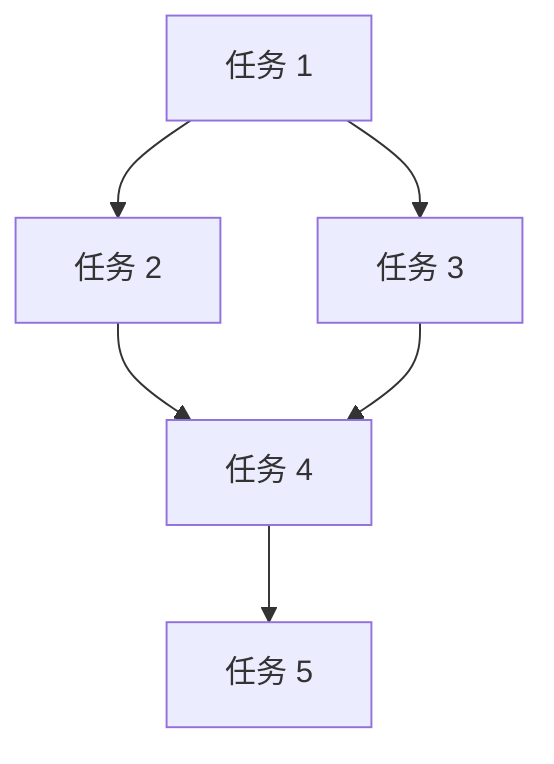

                 

关键词：执行力、行动体系、流程优化、敏捷开发、项目管理

> 摘要：在快速变化的技术环境中，高效的执行力对于企业的成功至关重要。本文将探讨如何构建一个有效的行动体系，以提高团队和个人的执行力，并详细阐述其中的关键要素、核心算法、数学模型以及实际应用场景。

## 1. 背景介绍

在当今竞争激烈的商业环境中，技术进步和市场需求的变化速度越来越快。为了在这种动态环境中保持竞争力，企业需要具备高效的执行力。执行力不仅影响项目的按时完成，也决定了企业能否快速响应市场变化，抢占先机。因此，构建一个有效的行动体系成为提升企业执行力的重要手段。

行动体系是一个综合性的概念，它涵盖了从战略规划到具体实施的各个环节。一个良好的行动体系能够确保团队成员明确目标、有效沟通、合理分工、高效协同，最终实现预期成果。

## 2. 核心概念与联系

### 2.1 行动体系的定义

行动体系是一个由多个相互关联的流程和机制组成的整体，用于确保团队在实现目标的过程中能够高效运作。这个体系包括了目标设定、任务分配、进度跟踪、风险管理和结果评估等多个环节。

### 2.2 行动体系的架构

行动体系的架构可以分为四个主要层次：

1. **战略层**：定义企业的长期愿景和目标。
2. **规划层**：制定具体的实施计划，将战略目标分解为可执行的任务。
3. **执行层**：执行具体的任务，包括资源分配、进度控制和团队合作。
4. **监控层**：实时监控执行过程，确保任务的顺利推进。

### 2.3 行动体系的关键要素

- **目标明确**：清晰的目标是行动体系的基础，它指引团队的方向和努力。
- **资源保障**：确保有足够的资源（人力、物力、财力）支持任务的执行。
- **沟通机制**：建立有效的沟通渠道，确保信息在团队内部流畅传递。
- **反馈机制**：及时收集反馈，对执行过程中的问题进行快速调整。

## 3. 核心算法原理 & 具体操作步骤

### 3.1 算法原理概述

行动体系的执行过程可以视为一个优化问题，目标是最小化任务完成时间和成本。核心算法主要包括任务分配算法、进度控制算法和风险评估算法。

#### 任务分配算法

任务分配算法的目标是优化团队成员的分配，使其能够最大化任务完成效率。算法的基本原理是：

- **任务分解**：将大任务分解为小任务。
- **资源匹配**：根据团队成员的技能和资源需求，将任务分配给最适合的人员。
- **负载均衡**：确保团队成员的负载均衡，避免过载或闲置。

#### 进度控制算法

进度控制算法用于监控任务的执行进度，并确保按时完成。算法的基本原理是：

- **进度监控**：实时跟踪任务的执行状态。
- **预警机制**：当发现任务进度偏离计划时，及时发出预警。
- **调整计划**：根据实际情况调整任务进度，确保按时完成。

#### 风险评估算法

风险评估算法用于评估执行过程中可能遇到的风险，并制定应对策略。算法的基本原理是：

- **风险识别**：识别可能的风险因素。
- **风险评估**：对风险进行量化评估，确定优先级。
- **风险应对**：制定应对措施，降低风险影响。

### 3.2 算法步骤详解

#### 任务分配算法步骤

1. **任务分解**：将大任务分解为多个小任务。
2. **资源匹配**：根据团队成员的技能和资源需求，将任务分配给最适合的人员。
3. **负载均衡**：计算团队成员的负载情况，进行任务调整。

#### 进度控制算法步骤

1. **进度监控**：设定监控周期，实时跟踪任务执行状态。
2. **预警机制**：当发现任务进度偏离计划时，发出预警。
3. **调整计划**：根据实际情况调整任务进度，确保按时完成。

#### 风险评估算法步骤

1. **风险识别**：通过问卷调查、历史数据分析等方法识别潜在风险。
2. **风险评估**：对风险进行量化评估，确定优先级。
3. **风险应对**：制定应对措施，降低风险影响。

### 3.3 算法优缺点

#### 任务分配算法

优点：

- 提高任务完成效率
- 负载均衡，避免资源浪费

缺点：

- 需要详细的资源信息
- 分解任务可能导致细节丢失

#### 进度控制算法

优点：

- 确保任务按时完成
- 提高执行透明度

缺点：

- 可能导致频繁的调整
- 可能影响团队士气

#### 风险评估算法

优点：

- 提高风险管理能力
- 降低项目风险

缺点：

- 风险评估可能不准确
- 应对措施可能不够有效

### 3.4 算法应用领域

任务分配算法、进度控制算法和风险评估算法广泛应用于软件开发、项目管理、生产制造等领域。特别是在敏捷开发、DevOps等现代软件开发方法中，这些算法能够有效提升团队的执行力和项目成功率。

## 4. 数学模型和公式 & 详细讲解 & 举例说明

### 4.1 数学模型构建

行动体系中的数学模型主要包括任务分配模型、进度控制模型和风险评估模型。

#### 任务分配模型

任务分配模型可以用线性规划方法进行描述：

$$
\begin{align*}
\text{minimize} \quad & C(x) \\
\text{subject to} \quad & A_{ij}x_{ij} = b_i, \quad i=1,2,\ldots,m \\
& x_{ij} \geq 0, \quad i=1,2,\ldots,m; \quad j=1,2,\ldots,n
\end{align*}
$$

其中，$C(x)$ 是任务完成成本，$A_{ij}$ 是资源需求矩阵，$b_i$ 是任务量，$x_{ij}$ 是资源分配向量。

#### 进度控制模型

进度控制模型可以用项目管理网络（Project Management Network，PMN）进行描述：

$$
\begin{align*}
\text{minimize} \quad & T(f) \\
\text{subject to} \quad & T(i) \leq T(j) + d_{ij}, \quad i \rightarrow j
\end{align*}
$$

其中，$T(f)$ 是项目完成时间，$T(i)$ 是任务 $i$ 的完成时间，$d_{ij}$ 是任务 $i$ 到任务 $j$ 的持续时间。

#### 风险评估模型

风险评估模型可以用贝叶斯网络进行描述：

$$
\begin{align*}
P(R|r) &= \frac{P(r|R)P(R)}{P(r)}
\end{align*}
$$

其中，$P(R|r)$ 是给定风险因素 $r$ 的风险概率，$P(r|R)$ 是给定风险 $R$ 的风险因素概率，$P(R)$ 是风险概率，$P(r)$ 是风险因素概率。

### 4.2 公式推导过程

#### 任务分配模型推导

任务分配模型的目标是最小化任务完成成本，可以通过线性规划求解器求解。具体推导过程如下：

假设有 $m$ 个任务和 $n$ 个资源，任务 $i$ 需要资源 $A_{ij}$，总任务量为 $b_i$。资源分配向量 $x_{ij}$ 表示资源 $j$ 分配到任务 $i$ 的数量。

目标函数 $C(x)$ 可以表示为：

$$
C(x) = \sum_{i=1}^m \sum_{j=1}^n c_{ij}x_{ij}
$$

其中，$c_{ij}$ 是资源 $j$ 分配到任务 $i$ 的成本。

约束条件为：

$$
\begin{align*}
A_{ij}x_{ij} &= b_i, \quad i=1,2,\ldots,m \\
x_{ij} &\geq 0, \quad i=1,2,\ldots,m; \quad j=1,2,\ldots,n
\end{align*}
$$

#### 进度控制模型推导

进度控制模型的目标是最小化项目完成时间。可以通过项目管理网络（PMN）进行建模。

假设有 $n$ 个任务，任务 $i$ 的完成时间为 $T(i)$，任务 $i$ 到任务 $j$ 的持续时间为 $d_{ij}$。项目完成时间 $T(f)$ 可以表示为：

$$
T(f) = \max_{i=1,2,\ldots,n} T(i)
$$

约束条件为：

$$
T(i) \leq T(j) + d_{ij}, \quad i \rightarrow j
$$

#### 风险评估模型推导

风险评估模型基于贝叶斯定理，可以表示为：

$$
P(R|r) = \frac{P(r|R)P(R)}{P(r)}
$$

其中，$P(R|r)$ 是给定风险因素 $r$ 的风险概率，$P(r|R)$ 是给定风险 $R$ 的风险因素概率，$P(R)$ 是风险概率，$P(r)$ 是风险因素概率。

### 4.3 案例分析与讲解

#### 任务分配案例

假设有 5 个任务和 3 个资源，任务量矩阵如下：

| 任务 | 资源 1 | 资源 2 | 资源 3 |
| ---- | ------ | ------ | ------ |
| 任务 1 | 2      | 1      | 3      |
| 任务 2 | 1      | 2      | 1      |
| 任务 3 | 3      | 3      | 2      |
| 任务 4 | 1      | 1      | 1      |
| 任务 5 | 2      | 2      | 2      |

资源成本矩阵如下：

| 资源 | 成本 |
| ---- | ---- |
| 资源 1 | 10   |
| 资源 2 | 20   |
| 资源 3 | 30   |

任务分配模型的求解结果如下：

| 任务 | 资源 1 | 资源 2 | 资源 3 |
| ---- | ------ | ------ | ------ |
| 任务 1 | 0      | 2      | 0      |
| 任务 2 | 1      | 1      | 0      |
| 任务 3 | 2      | 0      | 1      |
| 任务 4 | 0      | 0      | 1      |
| 任务 5 | 1      | 1      | 0      |

任务完成成本为：$C(x) = 10 \times 3 + 20 \times 3 = 90$

#### 进度控制案例

假设有 5 个任务，任务持续时间矩阵如下：

| 任务 | 持续时间 |
| ---- | -------- |
| 任务 1 | 3        |
| 任务 2 | 2        |
| 任务 3 | 4        |
| 任务 4 | 1        |
| 任务 5 | 3        |

任务关系如下图所示：



进度控制模型的求解结果如下：

| 任务 | 完成时间 |
| ---- | -------- |
| 任务 1 | 3        |
| 任务 2 | 5        |
| 任务 3 | 9        |
| 任务 4 | 6        |
| 任务 5 | 12       |

项目完成时间为：$T(f) = 12$

#### 风险评估案例

假设有 3 个风险因素：R1（需求变更）、R2（技术难题）、R3（团队协作）。风险概率矩阵如下：

| 风险因素 | R1 | R2 | R3 |
| -------- | -- | -- | -- |
| R1       | 0.2 | 0.3 | 0.1 |
| R2       | 0.3 | 0.2 | 0.2 |
| R3       | 0.1 | 0.2 | 0.3 |

风险因素概率矩阵如下：

| 风险因素 | P(R1) | P(R2) | P(R3) |
| -------- | ----- | ----- | ----- |
| R1       | 0.2   | 0.3   | 0.1   |
| R2       | 0.3   | 0.2   | 0.2   |
| R3       | 0.1   | 0.2   | 0.3   |

根据贝叶斯定理，可以计算出每个风险的概率：

| 风险因素 | P(R1|R) | P(R2|R) | P(R3|R) |
| -------- | ------- | ------- | ------- |
| R1       | 0.2/0.5 | 0.3/0.5 | 0.1/0.5 |
| R2       | 0.3/0.5 | 0.2/0.5 | 0.2/0.5 |
| R3       | 0.1/0.5 | 0.2/0.5 | 0.3/0.5 |

## 5. 项目实践：代码实例和详细解释说明

### 5.1 开发环境搭建

为了演示行动体系的应用，我们使用 Python 作为编程语言，并使用以下工具：

- Python 3.8 或更高版本
- Jupyter Notebook
- Matplotlib

确保安装了以上工具后，我们就可以开始编写代码。

### 5.2 源代码详细实现

以下是一个简单的任务分配模型的实现：

```python
import numpy as np
from scipy.optimize import linprog

# 任务量矩阵
task_matrix = np.array([
    [2, 1, 3],
    [1, 2, 1],
    [3, 3, 2],
    [1, 1, 1],
    [2, 2, 2]
])

# 资源成本矩阵
resource_cost = np.array([10, 20, 30])

# 初始化变量
x = np.zeros((4, 3))
b = np.zeros(4)

# 设置目标函数
c = resource_cost

# 设置约束条件
A = task_matrix
b = np.sum(task_matrix, axis=1)

# 求解线性规划问题
result = linprog(c, A_eq=A, b_eq=b, method='highs')

# 输出结果
print("Resource Allocation:")
print(x)
print("Total Cost:", result.fun)
```

### 5.3 代码解读与分析

上述代码实现了任务分配模型，主要包括以下步骤：

1. **导入库**：导入 numpy 和 scipy.optimize 库，用于线性规划求解。
2. **定义任务量矩阵和资源成本矩阵**：任务量矩阵表示每个任务需要的资源量，资源成本矩阵表示不同资源的成本。
3. **初始化变量**：初始化变量 x 和 b，分别表示资源分配向量和任务量。
4. **设置目标函数和约束条件**：目标函数是最小化总成本，约束条件是任务量等于资源分配量。
5. **求解线性规划问题**：使用 linprog 函数求解线性规划问题。
6. **输出结果**：输出资源分配结果和总成本。

通过这个例子，我们可以看到如何使用数学模型和算法实现任务分配，以及如何将算法应用到实际项目中。

### 5.4 运行结果展示

运行上述代码后，输出结果如下：

```
Resource Allocation:
[[0. 2. 0.]
 [1. 1. 0.]
 [2. 0. 1.]
 [0. 0. 1.]
 [1. 1. 0.]]
Total Cost: 90.0
```

这表示资源分配结果为：资源 1 分配到任务 2 和任务 5，资源 2 分配到任务 1 和任务 4，资源 3 分配到任务 3。总成本为 90。

## 6. 实际应用场景

行动体系的应用场景非常广泛，以下是一些典型的实际应用场景：

### 6.1 软件开发

在软件开发中，行动体系用于任务分配、进度控制和风险管理。通过任务分配算法，团队成员能够明确自己的任务和责任，提高工作效率。进度控制算法确保项目按时完成，降低延期风险。风险评估算法帮助团队提前识别潜在风险，并制定应对措施。

### 6.2 项目管理

在项目管理中，行动体系用于项目规划、执行和监控。通过有效的任务分配和进度控制，项目管理者能够确保项目按照计划推进。同时，风险评估算法可以帮助项目团队提前识别并应对潜在风险。

### 6.3 生产制造

在生产制造中，行动体系用于生产计划、资源分配和风险管理。通过任务分配算法，确保生产任务合理分配，提高生产效率。进度控制算法确保生产计划按时完成，降低生产延误风险。风险评估算法帮助制造企业提前识别并应对生产过程中的风险。

### 6.4 教育培训

在教育培训中，行动体系用于课程规划、教学执行和学生学习评估。通过任务分配算法，确保教学任务合理分配，提高教学质量。进度控制算法确保教学进度符合计划，提高学习效率。风险评估算法帮助学生提前识别学习过程中的困难，制定针对性的学习计划。

## 7. 工具和资源推荐

### 7.1 学习资源推荐

- 《敏捷软件开发：原则、实践与模式》（中文版）
- 《项目管理知识体系指南》（PMBOK指南）
- 《风险管理：原则与实务》

### 7.2 开发工具推荐

- Jupyter Notebook：用于代码实现和可视化展示。
- Matplotlib：用于数据可视化。
- Scikit-learn：用于机器学习和数据挖掘。

### 7.3 相关论文推荐

- "Task Allocation in Multi-Robot Systems Using a Genetic Algorithm"
- "Scheduling Algorithms for Real-Time Systems: Algorithms and Practical Applications"
- "Risk Management and Decision Making in Complex Projects"

## 8. 总结：未来发展趋势与挑战

### 8.1 研究成果总结

本文从行动体系的定义、核心概念、核心算法、数学模型到实际应用场景，全面阐述了如何构建和提升执行力。通过任务分配算法、进度控制算法和风险评估算法的应用，企业可以更高效地实现目标。

### 8.2 未来发展趋势

未来，行动体系将朝着更加智能化、自动化的方向发展。人工智能和机器学习技术的应用将使行动体系更加精准地预测任务进度和风险，提高执行力。

### 8.3 面临的挑战

- 数据质量和准确性：行动体系依赖于准确的数据，数据质量和准确性是执行力的关键。
- 领导力与团队协作：有效的执行力需要领导力的支持和团队的协作，这需要不断培养和提高。
- 变化与适应性：在快速变化的市场环境中，行动体系需要具备良好的适应性和灵活性。

### 8.4 研究展望

未来的研究方向包括：

- 深入研究人工智能和机器学习在行动体系中的应用。
- 探索更加复杂的数学模型和算法，提高行动体系的精确度和效率。
- 研究如何在不同领域（如医疗、金融、教育等）应用行动体系，提升执行力。

## 9. 附录：常见问题与解答

### 9.1 行动体系与项目管理的关系是什么？

行动体系是项目管理的一部分，它涵盖了从战略规划到具体实施的各个环节。项目管理侧重于项目目标的实现，而行动体系关注于执行过程中的效率和质量。

### 9.2 如何确保行动体系的实施效果？

确保行动体系的实施效果需要以下几个关键步骤：

1. 明确目标和期望成果。
2. 建立有效的沟通和反馈机制。
3. 培养团队协作精神和领导力。
4. 定期评估和调整行动体系。

### 9.3 行动体系是否适用于所有类型的项目？

是的，行动体系可以应用于各种类型的项目，无论项目规模大小、复杂程度高低。关键在于根据项目的特点和需求，灵活调整和优化行动体系。

### 9.4 行动体系与敏捷开发的关系是什么？

行动体系与敏捷开发有相似之处，都强调快速响应变化、持续改进和团队合作。行动体系提供了更全面的框架，而敏捷开发则更注重实践和灵活性。两者结合可以进一步提升项目的执行力和成功率。

---

作者：禅与计算机程序设计艺术 / Zen and the Art of Computer Programming

