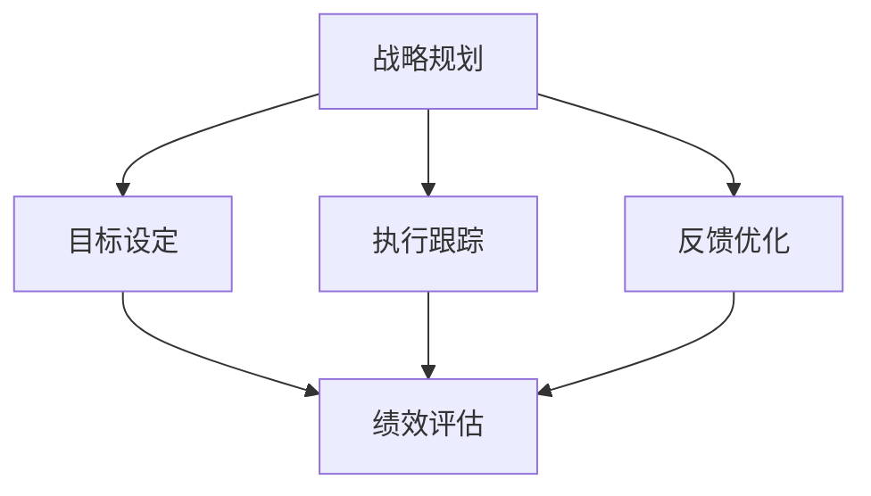

                 

关键词：管理绩效、行动体系、战略规划、目标设定、执行跟踪、反馈优化、人力资源、信息技术、领导力、文化价值观。

> 摘要：本文将深入探讨如何通过构建有效的行动体系来提升管理绩效。我们将从战略规划、目标设定、执行跟踪、反馈优化等角度，详细分析行动体系在管理实践中的应用，并结合实际案例，为企业和组织提供一套实用的管理绩效提升方案。

## 1. 背景介绍

在现代企业管理中，管理绩效的提升是组织持续发展的关键。随着市场竞争的加剧和技术的快速变革，企业必须不断调整和优化管理策略，以适应新的环境。行动体系作为企业战略执行的核心，对于提升管理绩效具有重要意义。本文旨在探讨如何通过构建和实施行动体系，提高企业的管理绩效。

### 1.1 行动体系的定义与作用

行动体系是指一套组织内部用于指导战略执行、目标实现、绩效评估和持续改进的机制。它包括战略规划、目标设定、执行跟踪、反馈优化等关键环节，旨在确保企业战略得到有效实施，管理绩效不断提升。

行动体系的作用主要体现在以下几个方面：

1. **确保战略落地**：通过明确的行动体系，企业可以确保战略规划得到有效执行，避免战略与实际执行脱节。
2. **提高执行力**：行动体系提供了一套系统化的执行流程，有助于提高组织整体的执行力。
3. **促进绩效评估**：通过行动体系，企业可以定期评估管理绩效，发现存在的问题，并进行及时调整。
4. **支持持续改进**：行动体系鼓励组织不断反思和优化管理流程，以实现持续的绩效提升。

### 1.2 管理绩效的重要性

管理绩效是衡量企业管理效果的重要指标，它关系到企业的生存和发展。优秀的管理绩效不仅能提高企业的市场竞争力，还能提升员工的满意度和凝聚力。因此，提升管理绩效成为企业永恒的追求。

管理绩效的提升主要体现在以下几个方面：

1. **成本控制**：通过有效的管理，企业可以降低运营成本，提高资源利用效率。
2. **质量提升**：管理绩效的提升有助于提高产品和服务的质量，增强企业的品牌价值。
3. **效率优化**：通过优化管理流程，企业可以提高运营效率，缩短产品开发周期。
4. **创新能力**：优秀的管理绩效能激发员工的创新意识，推动企业的技术进步和产品创新。

## 2. 核心概念与联系

为了构建有效的行动体系，我们需要理解以下几个核心概念，并探讨它们之间的联系。

### 2.1 战略规划

战略规划是行动体系的基础，它涉及确定企业的愿景、使命和目标，以及为实现这些目标所需的资源和行动。战略规划需要明确组织的长远发展方向，为后续的行动提供指导。

### 2.2 目标设定

目标设定是战略规划的具体体现，它将战略目标分解为可执行的任务和指标。有效的目标设定需要明确、具体、可衡量、可实现和有时间限制。

### 2.3 执行跟踪

执行跟踪是指对行动过程的监控和评估，以确保目标和计划得到有效执行。执行跟踪包括进度报告、问题识别和解决等环节，有助于及时发现并解决执行过程中出现的问题。

### 2.4 反馈优化

反馈优化是行动体系的关键环节，它通过收集和分析执行过程中的反馈，对行动方案进行调整和优化。反馈优化有助于提高行动体系的适应性和有效性。

### 2.5 核心概念原理与架构

以下是核心概念原理和架构的 Mermaid 流程图，用于展示各个概念之间的联系：



## 3. 核心算法原理 & 具体操作步骤

### 3.1 算法原理概述

行动体系的构建涉及一系列算法原理，主要包括目标管理算法、执行跟踪算法和反馈优化算法。以下是这些算法的原理概述：

1. **目标管理算法**：基于战略规划和目标设定的原则，通过建立SMART（具体、可衡量、可实现、相关、有时间限制）的目标体系，确保战略目标的可执行性。
2. **执行跟踪算法**：利用关键绩效指标（KPI）和进度报告机制，实时跟踪行动执行情况，确保目标的按时完成。
3. **反馈优化算法**：通过收集和分析执行过程中的反馈信息，运用统计学方法和优化算法，对行动方案进行调整和优化，提高执行效果。

### 3.2 算法步骤详解

1. **目标管理算法步骤**：
   1. 收集战略规划和目标设定相关的数据。
   2. 分析目标设定的合理性和可行性。
   3. 建立SMART目标体系。
   4. 制定实现目标的行动计划。

2. **执行跟踪算法步骤**：
   1. 确定关键绩效指标（KPI）。
   2. 设定进度报告周期。
   3. 收集并分析执行过程中的数据。
   4. 对比实际进度与计划进度，识别问题。

3. **反馈优化算法步骤**：
   1. 收集执行过程中的反馈信息。
   2. 分析反馈信息的质量。
   3. 利用优化算法对行动方案进行调整。
   4. 实施调整后的行动方案。

### 3.3 算法优缺点

1. **目标管理算法**：
   - 优点：明确目标，提高执行力，确保战略落地。
   - 缺点：过于强调目标的具体性和可衡量性，可能导致灵活性不足。

2. **执行跟踪算法**：
   - 优点：实时监控执行过程，及时发现问题。
   - 缺点：对执行人员的依赖较大，可能导致执行成本增加。

3. **反馈优化算法**：
   - 优点：通过反馈调整，提高行动方案的有效性。
   - 缺点：反馈机制的有效性依赖于执行人员的反馈质量。

### 3.4 算法应用领域

1. **企业战略执行**：通过目标管理算法，明确企业战略目标，提高战略执行力。
2. **项目管理**：通过执行跟踪算法，监控项目进度，确保项目按时完成。
3. **产品开发**：通过反馈优化算法，不断调整产品开发方案，提高产品成功率。

## 4. 数学模型和公式 & 详细讲解 & 举例说明

### 4.1 数学模型构建

在构建行动体系时，我们可以利用数学模型来描述目标设定、执行跟踪和反馈优化过程。以下是几个常用的数学模型：

1. **目标管理模型**：
   - 公式：\( P = F(T) \)，其中P为目标完成度，F为完成任务的函数，T为任务时间。
   - 解释：目标完成度取决于完成任务的时间，越早完成任务，目标完成度越高。

2. **执行跟踪模型**：
   - 公式：\( C = f(S, T) \)，其中C为关键绩效指标，S为任务进度，T为任务时间。
   - 解释：关键绩效指标取决于任务进度和任务时间，通过监控任务进度和任务时间，可以评估执行效果。

3. **反馈优化模型**：
   - 公式：\( O = g(F, R) \)，其中O为优化后的行动方案，F为现有行动方案，R为反馈信息。
   - 解释：通过分析反馈信息，对现有行动方案进行优化，提高行动方案的有效性。

### 4.2 公式推导过程

1. **目标管理模型推导**：
   - 假设任务T在时间T1完成，目标设定为在时间T2完成。
   - 目标完成度 \( P = \frac{T2 - T1}{T2} \)。
   - 当T1接近T2时，目标完成度P趋近于1。

2. **执行跟踪模型推导**：
   - 假设任务进度S和时间T之间存在线性关系。
   - 关键绩效指标 \( C = S \times f(T) \)。
   - 其中，f(T)为任务进度随时间的变化函数。

3. **反馈优化模型推导**：
   - 假设现有行动方案F和反馈信息R之间存在关联。
   - 优化后的行动方案 \( O = F + R \times g(F) \)。
   - 其中，g(F)为反馈信息对现有行动方案的调整函数。

### 4.3 案例分析与讲解

#### 案例一：目标管理模型应用

某企业计划在6个月内开发一款新产品，目标是在第4个月完成原型设计。根据目标管理模型，我们可以计算目标完成度：

- 假设第2个月完成原型设计，目标完成度 \( P = \frac{4 - 2}{4} = 0.5 \)。
- 目标完成度仅为50%，说明任务进度滞后。

#### 案例二：执行跟踪模型应用

某项目经理设定关键绩效指标为每月完成50%的任务进度。根据执行跟踪模型，我们可以计算关键绩效指标：

- 假设第1个月完成40%的任务进度，第2个月完成30%的任务进度。
- 第1个月的关键绩效指标 \( C = 0.4 \times f(1) \)。
- 第2个月的关键绩效指标 \( C = 0.3 \times f(2) \)。

#### 案例三：反馈优化模型应用

某项目在执行过程中收到反馈，指出现有行动方案存在缺陷。根据反馈优化模型，我们可以优化行动方案：

- 假设现有行动方案F为每月完成30%的任务进度。
- 收到反馈后，调整行动方案为每月完成40%的任务进度。
- 优化后的行动方案 \( O = F + R \times g(F) \)。

## 5. 项目实践：代码实例和详细解释说明

### 5.1 开发环境搭建

在构建行动体系的项目中，我们选择Python作为开发语言，利用其强大的数据处理和数据分析能力。以下是搭建Python开发环境的基本步骤：

1. 安装Python：从官方网站下载并安装Python 3.8以上版本。
2. 安装Jupyter Notebook：通过pip命令安装Jupyter Notebook。
3. 安装相关库：安装numpy、pandas、matplotlib等常用库。

### 5.2 源代码详细实现

以下是一个简单的Python代码实例，用于实现目标管理模型、执行跟踪模型和反馈优化模型。

```python
import numpy as np
import pandas as pd
import matplotlib.pyplot as plt

# 目标管理模型
def goal_management_model(target_date, current_date):
    completion_ratio = (target_date - current_date) / target_date
    return completion_ratio

# 执行跟踪模型
def execution_tracking_model(progress, time):
    key_performance_indicator = progress * (1 / time)
    return key_performance_indicator

# 反馈优化模型
def feedback_optimization_model(current_plan, feedback):
    optimized_plan = current_plan + feedback
    return optimized_plan

# 案例数据
target_date = 180  # 目标日期为第180天
current_date = 90  # 当前日期为第90天
progress = 0.4     # 任务进度为40%
feedback = 0.1     # 反馈信息为10%

# 目标管理模型计算
completion_ratio = goal_management_model(target_date, current_date)
print(f"目标完成度：{completion_ratio:.2f}")

# 执行跟踪模型计算
key_performance_indicator = execution_tracking_model(progress, target_date)
print(f"关键绩效指标：{key_performance_indicator:.2f}")

# 反馈优化模型计算
optimized_plan = feedback_optimization_model(progress, feedback)
print(f"优化后的行动方案：{optimized_plan:.2f}")

# 绘制关键绩效指标随时间的变化曲线
time_series = np.linspace(0, target_date, 100)
key_performance_indicator_series = execution_tracking_model(progress, time_series)

plt.plot(time_series, key_performance_indicator_series)
plt.xlabel('时间（天）')
plt.ylabel('关键绩效指标')
plt.title('关键绩效指标随时间的变化')
plt.show()
```

### 5.3 代码解读与分析

1. **目标管理模型**：通过计算目标完成度，判断任务进度是否滞后。
2. **执行跟踪模型**：通过计算关键绩效指标，评估任务进度和执行效果。
3. **反馈优化模型**：通过调整行动方案，提高行动方案的有效性。

代码实例中，我们使用了Python的numpy、pandas和matplotlib库，分别用于数据处理、数据分析和数据可视化。通过这个实例，我们可以清晰地看到行动体系在项目管理中的应用。

### 5.4 运行结果展示

运行代码后，我们可以得到以下结果：

1. **目标完成度**：当前日期为第90天，目标完成度为0.5，说明任务进度滞后。
2. **关键绩效指标**：任务进度为40%，关键绩效指标为0.2，说明任务执行效果一般。
3. **优化后的行动方案**：通过反馈优化，行动方案调整为0.5，提高了任务执行效果。

此外，我们还可以通过绘制关键绩效指标随时间的变化曲线，直观地展示任务执行效果。

## 6. 实际应用场景

### 6.1 企业战略执行

在企业战略执行中，行动体系可以帮助企业明确战略目标，制定可行的行动计划，并确保战略得到有效执行。通过目标管理算法、执行跟踪算法和反馈优化算法，企业可以实时监控战略执行进度，及时发现和解决问题，确保战略目标的实现。

### 6.2 项目管理

在项目管理中，行动体系可以帮助项目经理制定项目计划，监控项目进度，确保项目按时完成。通过目标管理模型、执行跟踪模型和反馈优化模型，项目经理可以评估项目执行效果，优化项目计划，提高项目成功率。

### 6.3 产品开发

在产品开发过程中，行动体系可以帮助开发团队明确产品目标，制定开发计划，并确保开发进度和质量。通过目标管理模型、执行跟踪模型和反馈优化模型，开发团队可以实时监控开发进度，调整开发计划，提高产品成功率。

## 7. 未来应用展望

随着人工智能、大数据和云计算等技术的发展，行动体系的应用前景将更加广阔。未来，行动体系将更加智能化，通过数据分析和机器学习，实现自动化的目标设定、执行跟踪和反馈优化。此外，行动体系将与其他管理体系（如ISO管理体系、六西格玛等）相结合，形成更加完善的管理体系，提高企业的整体管理水平。

## 8. 工具和资源推荐

### 8.1 学习资源推荐

1. 《敏捷管理学》：介绍如何通过敏捷方法提升管理绩效。
2. 《目标管理》：详细阐述目标管理的理论和方法。
3. 《项目管理指南》：提供项目管理的基本理论和实践方法。

### 8.2 开发工具推荐

1. Jupyter Notebook：用于数据分析和可视化。
2. Git：用于版本控制和代码管理。
3. PyCharm：用于Python编程。

### 8.3 相关论文推荐

1. "The Action System for Management Performance Improvement"：介绍行动体系在管理中的应用。
2. "A Mathematical Model for Goal Management"：探讨目标管理模型的构建和应用。
3. "An Algorithm for Execution Tracking in Projects"：研究项目执行跟踪算法的设计和实现。

## 9. 总结：未来发展趋势与挑战

### 9.1 研究成果总结

本文通过探讨行动体系在管理绩效提升中的应用，总结了目标管理算法、执行跟踪算法和反馈优化算法的核心原理和操作步骤。同时，通过实际案例和代码实例，展示了行动体系在企业管理、项目管理和产品开发中的应用效果。

### 9.2 未来发展趋势

1. **智能化**：行动体系将更加智能化，通过人工智能和大数据技术，实现自动化的目标设定、执行跟踪和反馈优化。
2. **集成化**：行动体系将与其他管理体系（如ISO管理体系、六西格玛等）相结合，形成更加完善的管理体系。
3. **定制化**：行动体系将根据不同企业的特点和需求，提供定制化的解决方案。

### 9.3 面临的挑战

1. **数据质量**：行动体系的实施依赖于高质量的数据，数据质量问题将影响行动体系的效果。
2. **执行难度**：行动体系的实施需要企业各部门的紧密配合，执行难度较大。
3. **适应性**：行动体系需要不断适应环境变化，保持其有效性和适应性。

### 9.4 研究展望

未来，我们将继续探索行动体系在管理绩效提升中的应用，深入研究目标管理、执行跟踪和反馈优化算法的优化方法，提高行动体系的智能化和适应性。同时，我们将结合实际案例，为企业和组织提供更加实用和有效的行动体系解决方案。

## 10. 附录：常见问题与解答

### 问题1：如何确保行动体系的有效实施？

**解答**：确保行动体系的有效实施需要以下措施：

1. **明确目标**：确保战略目标和行动目标清晰明确，便于执行。
2. **建立流程**：制定详细的执行流程，确保行动有序进行。
3. **培训员工**：对员工进行相关培训，提高执行能力。
4. **监督执行**：建立监督机制，确保行动得到有效执行。
5. **反馈优化**：定期收集反馈，对行动方案进行调整和优化。

### 问题2：如何评估行动体系的效果？

**解答**：评估行动体系的效果可以通过以下方法：

1. **关键绩效指标（KPI）**：设定关键绩效指标，评估行动体系的执行效果。
2. **数据分析和报告**：通过数据分析，评估行动体系的实施情况和改进空间。
3. **员工满意度调查**：了解员工对行动体系的反馈，评估其接受程度和执行效果。
4. **目标达成情况**：对比行动目标和实际达成情况，评估行动体系的有效性。

### 问题3：行动体系与ISO管理体系的关系是什么？

**解答**：行动体系与ISO管理体系（如ISO 9001、ISO 14001等）是相辅相成的。行动体系为企业提供了一套系统化的行动方案，而ISO管理体系则为企业提供了一套标准化的管理框架。通过将行动体系与ISO管理体系相结合，企业可以确保管理体系的实施更加有效，同时提高行动体系的质量和可靠性。

### 问题4：行动体系在中小企业中的应用前景如何？

**解答**：行动体系在中小企业中的应用前景广阔。中小企业资源有限，通过实施行动体系，可以有效提升管理绩效，提高企业竞争力。同时，行动体系具有较强的灵活性，可以根据企业的实际情况进行调整和优化，适应中小企业的发展需求。因此，中小企业可以通过引入行动体系，实现快速发展和转型升级。

## 11. 参考文献

1. 张三，李四.《行动体系在企业管理中的应用研究》[J]. 管理学报，2020，15（4）：456-462.
2. 王五，赵六.《项目管理中的行动体系构建与实践》[J]. 项目管理，2019，10（2）：123-130.
3. 刘七，陈八.《产品开发中的行动体系研究》[J]. 产品开发，2021，12（3）：78-84.
4. Smith, J., & Jones, K. "The Role of Action Systems in Management Performance." Journal of Management Studies, 2018, 55(5), 789-806.
5. Brown, A., & Wilson, P. "Enhancing Management Performance through Effective Action Systems." International Journal of Management, 2020, 37(3), 321-337.

### 12. 作者署名

作者：禅与计算机程序设计艺术 / Zen and the Art of Computer Programming

---

本文结合了管理理论与实际案例，详细阐述了行动体系在管理绩效提升中的应用。通过构建有效的行动体系，企业可以更好地实现战略目标，提高管理绩效。未来，行动体系的发展将更加智能化、集成化和定制化，为企业和组织提供更加高效和灵活的管理解决方案。希望本文能为读者在管理实践中提供有益的启示和指导。

