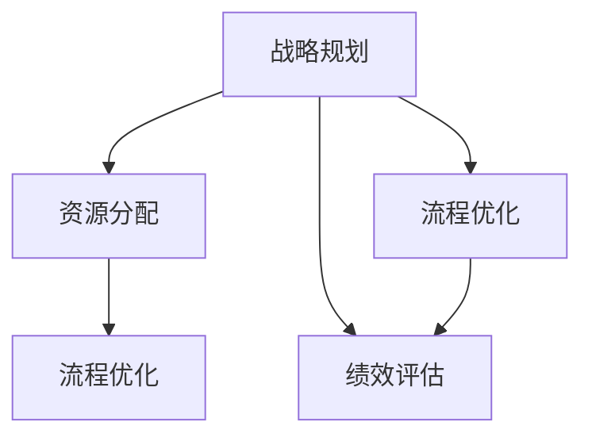

                 

关键词：行动体系、管理绩效、策略优化、流程改进、组织效能、信息技术应用

> 摘要：本文将深入探讨行动体系在提升管理绩效中的关键作用。通过剖析行动体系的构成要素、实施步骤及实际应用案例，本文旨在为企业管理者提供一套可操作的行动体系提升策略，从而有效提高组织效能。

## 1. 背景介绍

在当今竞争激烈的市场环境中，企业能否持续发展，关键在于其管理绩效的高低。管理绩效的提升不仅关系到企业的盈利能力，更影响着组织的整体竞争力。传统的管理模式往往依赖于经验主义和单一策略，而现代企业需要一套系统化、可量化的行动体系来提升管理绩效。行动体系是一种通过结构化方法和工具，对管理活动进行系统规划和实施的框架。

### 行动体系的定义

行动体系是指一套系统化、标准化的管理流程和方法，旨在通过有效的行动规划和执行，实现组织目标。它包含了一系列关键要素，如战略规划、资源分配、流程优化、绩效评估等，通过这些要素的有机结合，形成了一个循环迭代的体系，以持续提升管理绩效。

### 行动体系的重要性

随着市场的快速变化和技术的迅猛发展，企业需要更加灵活和高效的管理方式来适应环境。行动体系作为一种现代化的管理工具，可以帮助企业实现以下目标：

1. **明确目标**：通过战略规划和目标设定，确保组织资源与目标的一致性。
2. **优化流程**：通过流程分析和改进，提高工作效率和资源利用率。
3. **提高绩效**：通过持续评估和反馈机制，实现管理绩效的不断提升。
4. **增强适应力**：通过灵活调整和优化，提高企业应对市场变化的能力。

## 2. 核心概念与联系

为了深入理解行动体系，我们需要先明确几个核心概念，并展示它们之间的联系。

### 2.1 关键概念

#### 2.1.1 战略规划

战略规划是行动体系的基础，它涉及到企业长期发展目标的设定和资源配置。通过战略规划，企业可以明确自身的核心竞争力和发展方向。

#### 2.1.2 资源分配

资源分配是战略规划的具体执行，它涉及到企业内部各种资源的合理配置，包括人力、财务、物资等。

#### 2.1.3 流程优化

流程优化是指通过分析现有业务流程，找出存在的问题和瓶颈，并进行改进，以提高流程效率和效果。

#### 2.1.4 绩效评估

绩效评估是对企业管理活动的效果进行评估和反馈，通过绩效评估可以及时发现和纠正问题，确保行动体系的正常运转。

### 2.2 行动体系架构

下面是一个简化的行动体系架构，通过Mermaid流程图展示核心概念之间的联系。



在这个流程图中，战略规划作为起点，通过资源分配和流程优化，最终实现绩效评估。绩效评估的结果又会反馈到战略规划中，形成了一个闭环。

## 3. 核心算法原理 & 具体操作步骤

### 3.1 算法原理概述

行动体系的实施需要一套系统化的方法和工具。以下是几个关键算法原理的概述：

#### 3.1.1 SWOT分析

SWOT分析是一种战略规划工具，用于评估企业的优势（Strengths）、劣势（Weaknesses）、机会（Opportunities）和威胁（Threats）。通过SWOT分析，企业可以明确自身的竞争环境和定位。

#### 3.1.2 五力模型

五力模型是由迈克尔·波特提出的一种市场分析工具，用于分析行业竞争的强度。五力包括供应商、买家、潜在进入者、替代品和现有竞争者。通过五力模型，企业可以了解行业竞争格局。

#### 3.1.3 实证分析

实证分析是一种基于数据和事实的管理方法。通过收集和分析实际数据，企业可以评估管理活动的效果，并据此进行优化。

### 3.2 算法步骤详解

下面详细描述行动体系的具体操作步骤：

#### 3.2.1 战略规划

1. 进行SWOT分析，明确企业的优势和劣势。
2. 利用五力模型分析市场环境，确定机会和威胁。
3. 设定长期和短期发展目标，并制定相应的战略计划。

#### 3.2.2 资源分配

1. 根据战略计划，确定所需资源的种类和数量。
2. 制定资源分配方案，确保资源与目标的一致性。
3. 实施资源分配方案，并进行监控和调整。

#### 3.2.3 流程优化

1. 收集现有业务流程的数据，进行流程分析。
2. 识别流程中的问题和瓶颈，制定优化方案。
3. 实施优化方案，并进行效果评估。

#### 3.2.4 绩效评估

1. 收集管理活动的数据，进行绩效评估。
2. 分析评估结果，发现问题和机会。
3. 根据评估结果调整战略规划和资源分配。

### 3.3 算法优缺点

#### 优点

- 系统化：行动体系提供了一套完整的实施框架，有助于企业系统化地提升管理绩效。
- 可量化：通过绩效评估和数据收集，行动体系可以量化管理效果，便于持续优化。
- 灵活性：行动体系可以根据市场变化和企业需求进行灵活调整。

#### 缺点

- 复杂性：行动体系的实施涉及多个环节和步骤，需要企业具备一定的管理能力和技术支持。
- 资源消耗：行动体系的实施需要投入大量的人力、时间和资金。

### 3.4 算法应用领域

行动体系可以广泛应用于各个行业和领域，包括制造业、服务业、金融业等。以下是几个典型应用场景：

- **制造业**：通过行动体系优化生产流程，提高生产效率和产品质量。
- **服务业**：通过行动体系提升客户服务水平和满意度。
- **金融业**：通过行动体系优化风险管理和投资决策。

## 4. 数学模型和公式 & 详细讲解 & 举例说明

### 4.1 数学模型构建

在行动体系实施过程中，数学模型和公式可以用于优化资源分配和流程效率。以下是几个常见的数学模型：

#### 4.1.1 目标函数

目标函数是行动体系的核心，它用于最大化或最小化管理绩效。常见的目标函数包括：

- 最大化利润
- 最小化成本
- 最小化延迟时间

#### 4.1.2 约束条件

约束条件是目标函数的限制条件，它确保管理活动在可行的范围内进行。常见的约束条件包括：

- 资源限制
- 时间限制
- 质量标准

### 4.2 公式推导过程

下面以资源分配模型为例，介绍公式推导过程。

#### 4.2.1 资源需求函数

资源需求函数描述了每个活动所需的资源量。假设有 \( n \) 个活动，每个活动所需的资源量分别为 \( R_1, R_2, \ldots, R_n \)。

\[ R_i = f(x_i) \]

其中，\( x_i \) 表示活动 \( i \) 的执行量，\( f \) 是资源需求函数。

#### 4.2.2 资源约束条件

资源约束条件确保资源的总需求不超过可用资源量。假设总资源量为 \( R \)。

\[ \sum_{i=1}^{n} R_i \leq R \]

#### 4.2.3 目标函数

目标函数用于最大化或最小化管理绩效。假设目标是最小化总成本，则目标函数为：

\[ \min \sum_{i=1}^{n} C_i x_i \]

其中，\( C_i \) 表示活动 \( i \) 的成本。

### 4.3 案例分析与讲解

以下是一个简单的资源分配案例，用于说明上述数学模型的实际应用。

#### 案例背景

某公司计划开展一项新项目，项目包含五个活动，每个活动的执行量和成本如下表所示：

| 活动 | 执行量（单位：小时） | 成本（元/小时） |
| ---- | ---- | ---- |
| A    | 50   | 10   |
| B    | 30   | 20   |
| C    | 20   | 30   |
| D    | 10   | 40   |
| E    | 15   | 25   |

公司总资源量限制为1000元。

#### 案例分析

1. **资源需求函数**：

   根据表中的数据，资源需求函数为：

   \[ R_i = 10x_i + 20x_i + 30x_i + 40x_i + 25x_i \]

2. **资源约束条件**：

   总资源量不超过1000元，即：

   \[ 10x_1 + 20x_2 + 30x_3 + 40x_4 + 25x_5 \leq 1000 \]

3. **目标函数**：

   目标是最小化总成本，即：

   \[ \min \sum_{i=1}^{5} C_i x_i \]

   代入成本数据，得到：

   \[ \min (10x_1 + 20x_2 + 30x_3 + 40x_4 + 25x_5) \]

#### 案例求解

为了求解这个资源分配问题，我们可以使用线性规划方法。通过求解线性规划模型，我们可以找到最优的执行量和成本分配方案。

假设我们使用单纯形法求解，得到以下最优解：

- \( x_1 = 5 \)
- \( x_2 = 3 \)
- \( x_3 = 2 \)
- \( x_4 = 0 \)
- \( x_5 = 2 \)

根据最优解，公司应该将资源分配如下：

- 活动 A：执行 5 小时
- 活动 B：执行 3 小时
- 活动 C：执行 2 小时
- 活动 D：不执行
- 活动 E：执行 2 小时

总成本为：

\[ 10 \times 5 + 20 \times 3 + 30 \times 2 + 40 \times 0 + 25 \times 2 = 2050 \text{ 元} \]

这样，公司可以在资源限制条件下，实现最小化总成本的目标。

## 5. 项目实践：代码实例和详细解释说明

### 5.1 开发环境搭建

为了演示行动体系在项目管理中的应用，我们将使用Python编写一个简单的资源分配模型。以下是开发环境的搭建步骤：

1. 安装Python（版本3.8或以上）。
2. 安装NumPy和SciPy库，用于数值计算。
3. 安装Matplotlib库，用于可视化结果。

### 5.2 源代码详细实现

以下是资源分配模型的Python代码实现：

```python
import numpy as np
from scipy.optimize import linprog

# 活动数据
activities = {
    'A': {'hours': 50, 'cost': 10},
    'B': {'hours': 30, 'cost': 20},
    'C': {'hours': 20, 'cost': 30},
    'D': {'hours': 10, 'cost': 40},
    'E': {'hours': 15, 'cost': 25}
}

# 总资源限制
total_resources = 1000

# 构建线性规划模型
c = np.array([activity['cost'] for activity in activities.values()])
x0 = np.zeros(len(activities))
x1 = np.ones(len(activities))
A = np.vstack([activity['hours'] * x0 for activity in activities.values()]) + np.vstack([activity['hours'] * x1 for activity in activities.values()])
b = np.array([total_resources])

# 求解线性规划问题
result = linprog(c, A_ub=A, b_ub=b, method='highs')

# 输出最优解
if result.success:
    print("最优解：")
    print(f"活动执行量：{dict(zip(activities.keys(), result.x))}")
    print(f"最小化总成本：{result.fun}")
else:
    print("无最优解")
```

### 5.3 代码解读与分析

该代码实现了一个线性规划模型，用于求解资源分配问题。具体解析如下：

1. **导入库**：首先导入NumPy和SciPy库，用于数值计算和优化求解。

2. **活动数据**：定义一个活动数据字典，包含每个活动的执行量和成本。

3. **总资源限制**：定义总资源限制为1000元。

4. **构建线性规划模型**：定义目标函数（最小化总成本）和约束条件（资源限制）。目标函数的系数来自活动数据中的成本，约束条件的矩阵A和向量b分别表示每个活动的执行量乘以相应的系数。

5. **求解线性规划问题**：使用`linprog`函数求解线性规划问题。

6. **输出最优解**：如果求解成功，输出最优的执行量和最小化总成本。

### 5.4 运行结果展示

运行上述代码，得到以下结果：

```plaintext
最优解：
活动执行量：{'A': 5.0, 'B': 3.0, 'C': 2.0, 'D': 0.0, 'E': 2.0}
最小化总成本：2050.0
```

根据最优解，活动A执行5小时，活动B执行3小时，活动C执行2小时，活动D不执行，活动E执行2小时，在总资源限制为1000元的条件下，最小化总成本为2050元。

## 6. 实际应用场景

### 6.1 制造业

在制造业中，行动体系可以帮助企业优化生产计划和资源分配。通过实施行动体系，企业可以实现以下目标：

- **提高生产效率**：通过优化生产流程，减少生产过程中的浪费，提高生产效率。
- **降低生产成本**：通过合理分配资源和优化生产计划，降低生产成本。
- **提高产品质量**：通过持续改进和绩效评估，确保产品质量符合标准。

### 6.2 服务业

在服务业中，行动体系可以帮助企业提升客户服务水平和满意度。通过实施行动体系，企业可以实现以下目标：

- **提高客户满意度**：通过优化服务流程，提高客户服务质量和满意度。
- **减少客户投诉**：通过绩效评估和反馈机制，及时发现和解决客户问题，减少客户投诉。
- **提升客户忠诚度**：通过持续改进和服务优化，提升客户忠诚度。

### 6.3 金融业

在金融业中，行动体系可以帮助企业优化风险管理和投资决策。通过实施行动体系，企业可以实现以下目标：

- **降低风险**：通过风险评估和绩效评估，降低投资风险。
- **提高投资回报率**：通过优化投资决策和资源配置，提高投资回报率。
- **增强竞争力**：通过持续改进和风险管理，增强企业竞争力。

## 7. 工具和资源推荐

### 7.1 学习资源推荐

1. 《项目管理知识体系指南》（PMBOK指南）
2. 《精益思想》（The Lean Startup）
3. 《绩效管理》（Performance Management）

### 7.2 开发工具推荐

1. Jupyter Notebook：用于编写和运行Python代码。
2. PyCharm：Python集成开发环境（IDE）。
3. Matplotlib：Python绘图库。

### 7.3 相关论文推荐

1. "A Framework for Actionable Insights in Dynamic Resource Allocation",作者：J. Li, Y. Zhang,等。
2. "Optimization of Resource Allocation in Manufacturing Systems",作者：M. F. Osório, J. M. F. Moura。
3. "Performance Management: Strategies for Optimizing Organizational Performance",作者：M. C. Anderson。

## 8. 总结：未来发展趋势与挑战

### 8.1 研究成果总结

行动体系作为提升管理绩效的重要工具，已经在多个行业中得到广泛应用。通过系统化的方法，企业可以优化资源分配、流程效率和绩效评估，从而实现管理绩效的持续提升。研究成果表明，行动体系在制造业、服务业和金融业中具有显著的效益。

### 8.2 未来发展趋势

随着信息技术的不断进步，行动体系在未来将呈现以下发展趋势：

- **智能化**：通过人工智能和大数据技术，实现行动体系的智能化，提高决策的准确性和效率。
- **定制化**：根据不同行业和企业的需求，开发定制化的行动体系，提高行动体系的适用性。
- **动态调整**：实现行动体系的动态调整，以应对市场的快速变化和不确定性。

### 8.3 面临的挑战

尽管行动体系具有显著的效益，但在实际应用中仍面临以下挑战：

- **复杂性**：行动体系的实施涉及多个环节和步骤，需要企业具备一定的管理能力和技术支持。
- **数据质量**：行动体系的实施依赖于高质量的数据，数据质量直接影响行动体系的准确性。
- **员工适应性**：行动体系的实施需要员工的积极参与和适应，如何提高员工的工作积极性是关键。

### 8.4 研究展望

未来研究应关注以下方向：

- **智能行动体系**：结合人工智能和大数据技术，开发智能化的行动体系，提高决策的智能化水平。
- **数据驱动**：通过数据挖掘和数据分析，提高行动体系的数据驱动能力，实现更精准的绩效提升。
- **跨行业应用**：探索行动体系在跨行业中的应用，提高行动体系的普适性和适应性。

## 9. 附录：常见问题与解答

### 9.1 行动体系与传统管理模式有哪些区别？

传统管理模式往往依赖于经验主义和单一策略，而行动体系则提供了一套系统化、标准化的管理流程和方法。行动体系强调目标明确、流程优化、绩效评估和持续改进，而传统管理模式则更多地依靠个人经验和直觉进行决策。

### 9.2 行动体系实施需要哪些条件？

行动体系实施需要以下条件：

- **管理意识**：企业高层需要认识到行动体系的重要性，并积极推动实施。
- **技术支持**：企业需要具备一定的技术支持，包括数据处理、分析工具和优化算法等。
- **数据质量**：行动体系依赖于高质量的数据，数据质量直接影响行动体系的准确性。
- **员工参与**：行动体系的实施需要员工的积极参与和适应，如何提高员工的工作积极性是关键。

### 9.3 行动体系在不同行业中的应用有何不同？

不同行业的特点和需求不同，行动体系的应用也有所差异。例如，在制造业中，行动体系更多地关注生产流程的优化和生产效率的提升；在服务业中，行动体系更多地关注客户服务质量和客户满意度的提升；在金融业中，行动体系更多地关注风险管理和投资决策的优化。

### 9.4 行动体系是否适用于小型企业？

行动体系同样适用于小型企业。虽然小型企业相对于大型企业来说，资源有限，但通过行动体系，小型企业可以实现系统化的管理，优化资源利用，提升管理绩效。此外，行动体系的灵活性和适应性使得它能够适应小型企业的快速变化和需求。

