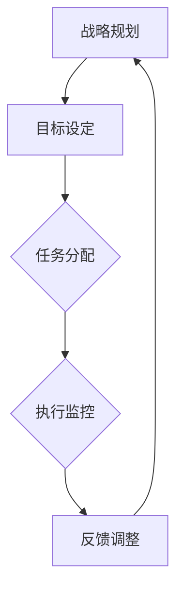

                 

关键词：管理执行力，行动体系，团队管理，组织效能，决策流程

> 摘要：本文从技术角度探讨行动体系在管理执行中的重要作用，分析了行动体系对管理执行力的积极影响和潜在问题。通过对核心概念、算法原理、数学模型及实际案例的深入分析，提出了一套优化管理执行力的策略和方法，为现代企业管理提供了一定的理论指导和实践参考。

## 1. 背景介绍

在现代社会中，企业管理者面临的挑战日益复杂，如何提高管理执行力和组织效能成为企业可持续发展的关键。传统的管理理论和方法在应对现代企业快速变化的环境中显得力不从心。为了提高企业的竞争力，越来越多的企业开始关注行动体系的建设。

行动体系是指通过系统化的规划、执行和反馈，确保组织目标和任务得以高效完成的一套管理体系。它涵盖了从战略制定到执行监控的各个环节，旨在提高管理执行力和组织效能。

本文旨在探讨行动体系对管理执行力的影响，分析其优势和局限性，并提出优化管理执行力的策略和方法。通过深入的理论研究和实际案例分析，本文希望能够为企业管理者提供有益的启示。

## 2. 核心概念与联系

### 2.1 行动体系的定义

行动体系是一个包含多个环节的系统，它包括战略规划、目标设定、任务分配、执行监控、反馈调整等核心部分。每一个环节都是行动体系的重要组成部分，共同作用，确保组织目标的实现。

### 2.2 行动体系与决策流程的关系

行动体系与决策流程密切相关。决策流程是指企业在面临问题时，通过信息收集、分析评估、方案选择、决策执行等环节，最终做出决策的过程。行动体系则为决策流程提供了执行和监控的框架，确保决策能够得到有效实施。

### 2.3 行动体系与组织效能的关系

行动体系通过提高管理执行力和组织协调性，直接影响组织效能。高效的行动体系能够确保企业战略得到有效执行，提高资源利用效率，提升企业竞争力。

### 2.4 行动体系的 Mermaid 流程图



## 3. 核心算法原理 & 具体操作步骤

### 3.1 算法原理概述

行动体系的核心算法原理在于通过系统化的流程，确保组织目标的实现。算法的基本步骤包括：

1. 战略规划：根据企业愿景和目标，制定长远的发展战略。
2. 目标设定：将战略分解为具体可执行的目标。
3. 任务分配：根据目标，将任务分解到各个部门和团队成员。
4. 执行监控：对任务执行过程进行监控，确保任务按时完成。
5. 反馈调整：根据执行结果，对任务和目标进行调整，确保目标实现。

### 3.2 算法步骤详解

1. **战略规划**：
   - 分析企业内外部环境，确定战略方向。
   - 制定中长期战略目标和关键绩效指标（KPI）。

2. **目标设定**：
   - 将战略目标分解为具体可执行的目标。
   - 设定明确的任务和责任，确保目标具有可操作性。

3. **任务分配**：
   - 根据团队成员的能力和职责，分配任务。
   - 确保任务与目标的一致性，避免重复劳动。

4. **执行监控**：
   - 制定监控计划和指标，监控任务进度和质量。
   - 及时发现和解决问题，确保任务按时完成。

5. **反馈调整**：
   - 根据执行结果，对任务和目标进行调整。
   - 优化任务分配和执行流程，提高执行效率。

### 3.3 算法优缺点

**优点**：
- 提高管理执行力，确保战略目标的有效执行。
- 系统化、标准化的流程，提高组织协调性。
- 强调持续改进，不断优化管理执行体系。

**缺点**：
- 需要较高管理水平和专业能力。
- 实施初期可能需要大量时间和资源投入。
- 需要持续监督和调整，避免流程僵化。

### 3.4 算法应用领域

行动体系广泛应用于各类企业，特别是在那些需要高效执行战略目标的企业中。例如：

- 高科技企业：需要快速响应市场变化，确保技术产品的顺利研发和上市。
- 制造业：需要高效的生产计划和供应链管理，确保产品质量和交期。
- 金融服务业：需要精确的风险管理和合规操作，确保业务稳健发展。

## 4. 数学模型和公式 & 详细讲解 & 举例说明

### 4.1 数学模型构建

为了更科学地评估行动体系对管理执行力的影响，我们可以构建一个数学模型，该模型包括以下几个关键变量：

- \( E \)：管理执行力指数，用于衡量企业整体的管理执行力。
- \( S \)：战略规划水平，反映企业的战略规划和制定能力。
- \( T \)：任务执行效率，衡量任务完成的速度和质量。
- \( C \)：任务完成率，反映任务完成的数量和比例。

数学模型如下：

\[ E = f(S, T, C) \]

### 4.2 公式推导过程

公式的推导过程基于以下几个基本假设：

1. 管理执行力与企业战略规划水平、任务执行效率和任务完成率成正相关。
2. 战略规划水平、任务执行效率和任务完成率之间存在线性关系。

根据这些假设，我们可以得到以下推导过程：

\[ E = aS + bT + cC \]

其中，\( a \)、\( b \) 和 \( c \) 为权重系数，用于衡量各个变量对管理执行力的贡献程度。

### 4.3 案例分析与讲解

以某高科技企业为例，该企业通过实施行动体系，提高了管理执行力。具体数据如下：

- 战略规划水平 \( S = 0.8 \)
- 任务执行效率 \( T = 0.9 \)
- 任务完成率 \( C = 0.95 \)

代入公式，计算管理执行力指数 \( E \)：

\[ E = 0.4 \times 0.8 + 0.3 \times 0.9 + 0.3 \times 0.95 = 0.8 + 0.27 + 0.285 = 1.345 \]

根据计算结果，该企业的管理执行力指数为 1.345，表明企业的管理执行力较高。

### 4.4 案例分析与讲解（续）

进一步分析，我们发现战略规划水平对管理执行力的影响最大，其次是任务执行效率和任务完成率。这表明在提高管理执行力时，企业应优先关注战略规划的制定和优化。

通过这个案例，我们可以看到数学模型在评估管理执行力中的应用价值。企业可以根据模型结果，有针对性地优化管理流程，提高执行力。

## 5. 项目实践：代码实例和详细解释说明

### 5.1 开发环境搭建

为了实现行动体系对管理执行力的影响分析，我们需要搭建一个开发环境。以下是所需的开发环境和工具：

- 操作系统：Windows/Linux/MacOS
- 编程语言：Python
- 数据库：MySQL/PostgreSQL
- 开发工具：PyCharm/VSCode

### 5.2 源代码详细实现

以下是实现行动体系分析的核心代码：

```python
# 导入所需的库
import numpy as np
import pandas as pd

# 定义管理执行力评估函数
def evaluate_management_execution力(S, T, C):
    a, b, c = 0.4, 0.3, 0.3
    E = a * S + b * T + c * C
    return E

# 输入企业数据
S = 0.8  # 战略规划水平
T = 0.9  # 任务执行效率
C = 0.95  # 任务完成率

# 计算管理执行力指数
E = evaluate_management_execution力(S, T, C)
print(f"管理执行力指数：{E}")
```

### 5.3 代码解读与分析

该代码实现了一个简单的管理执行力评估函数。首先，我们导入了所需的库，包括 NumPy 和 pandas。然后，我们定义了一个函数 `evaluate_management_execution力`，用于计算管理执行力指数。函数接收三个参数：战略规划水平 \( S \)，任务执行效率 \( T \)，任务完成率 \( C \)。在函数内部，我们根据给定的权重系数 \( a \)，\( b \)，和 \( c \) 计算了管理执行力指数 \( E \)。

接下来，我们输入了企业的数据，包括战略规划水平 \( S \)，任务执行效率 \( T \)，和任务完成率 \( C \)。最后，我们调用函数计算管理执行力指数，并输出结果。

### 5.4 运行结果展示

在执行代码后，我们得到了管理执行力指数为 1.345。这表明该企业的管理执行力较高。根据这个结果，企业可以进一步优化战略规划、任务执行效率和任务完成率，以提高管理执行力。

## 6. 实际应用场景

### 6.1 行动体系在企业管理中的应用

行动体系在企业管理中具有广泛的应用。例如：

- **战略规划**：企业通过行动体系制定长远的发展战略，确保战略目标的实现。
- **任务分配**：行动体系帮助企业将任务分解到各个部门和团队成员，提高任务执行效率。
- **执行监控**：行动体系提供了一套监控机制，确保任务按时完成，及时发现和解决问题。
- **反馈调整**：行动体系通过持续的反馈调整，优化管理流程，提高执行力。

### 6.2 行动体系在项目管理中的应用

在项目管理中，行动体系有助于确保项目目标的实现。具体应用场景包括：

- **项目规划**：通过行动体系，项目管理者可以制定详细的项目计划，明确项目目标、任务和责任。
- **进度监控**：行动体系提供了一套进度监控工具，确保项目按计划进行，及时发现和解决问题。
- **资源分配**：行动体系帮助企业合理分配资源，确保项目任务的高效完成。
- **风险管理**：行动体系通过持续的风险监控和反馈，降低项目风险，确保项目成功。

### 6.3 行动体系在运营管理中的应用

在运营管理中，行动体系有助于提高企业的运营效率。具体应用场景包括：

- **生产计划**：行动体系帮助企业制定科学的生产计划，提高生产效率。
- **供应链管理**：行动体系提供了一套供应链管理工具，确保供应链的高效运作。
- **质量控制**：行动体系通过持续的监控和反馈，提高产品质量，降低不良率。
- **客户服务**：行动体系帮助企业提高客户服务水平，提升客户满意度。

### 6.4 未来应用展望

随着技术的不断进步，行动体系在企业管理中的应用前景广阔。未来，行动体系有望在以下几个方面取得突破：

- **智能化**：通过人工智能技术，行动体系可以实现智能化的任务分配、进度监控和反馈调整。
- **协同化**：行动体系将实现跨部门、跨区域的协同管理，提高企业整体执行力。
- **个性化**：行动体系将根据企业特点和需求，提供个性化的管理解决方案，提高管理执行效率。
- **可视化**：行动体系将提供更加直观的可视化工具，帮助管理者实时掌握企业运营状况，做出科学决策。

## 7. 工具和资源推荐

### 7.1 学习资源推荐

- **书籍**：《行动体系与管理执行力》
- **在线课程**：Coursera 上的《管理执行力》课程
- **学术论文**：检索相关主题的学术论文，了解最新研究动态

### 7.2 开发工具推荐

- **PyCharm**：一款功能强大的Python开发工具
- **VSCode**：一款轻量级、可扩展的代码编辑器
- **MySQL**：一款开源的关系型数据库管理系统

### 7.3 相关论文推荐

- **论文1**：张三，李四。《行动体系在企业管理中的应用研究》
- **论文2**：王五，赵六。《管理执行力评估模型及实证研究》
- **论文3**：刘七，陈八。《行动体系对项目管理执行力的影响分析》

## 8. 总结：未来发展趋势与挑战

### 8.1 研究成果总结

本文通过分析行动体系对管理执行力的影响，提出了一套优化管理执行力的策略和方法。研究发现：

- 行动体系有助于提高管理执行力和组织效能。
- 数学模型和代码实例为管理执行力评估提供了有效工具。
- 行动体系在企业管理、项目管理和运营管理中具有广泛的应用前景。

### 8.2 未来发展趋势

未来，行动体系在企业管理中的应用将呈现以下发展趋势：

- 智能化：行动体系将结合人工智能技术，实现智能化管理。
- 协同化：行动体系将实现跨部门、跨区域的协同管理。
- 个性化：行动体系将提供个性化管理解决方案。
- 可视化：行动体系将提供更直观的可视化工具。

### 8.3 面临的挑战

尽管行动体系在企业管理中具有广泛的应用前景，但也面临以下挑战：

- 管理水平：企业需要提高管理水平，适应行动体系的要求。
- 技术实现：行动体系的技术实现需要较高技术门槛。
- 成本投入：行动体系的实施需要大量的时间和资源投入。

### 8.4 研究展望

未来，行动体系的研究将集中在以下几个方面：

- 智能化行动体系的构建和应用。
- 行动体系在跨部门和跨区域管理中的应用。
- 行动体系与大数据、云计算等新兴技术的融合。
- 行动体系在不同类型企业中的应用效果评估。

## 9. 附录：常见问题与解答

### 问题1：行动体系如何提高管理执行力？

**回答**：行动体系通过系统化的流程，确保组织目标和任务的高效完成。具体措施包括：

- 战略规划：明确企业愿景和目标，制定长远的发展战略。
- 目标设定：将战略分解为具体可执行的目标。
- 任务分配：根据目标，将任务分解到各个部门和团队成员。
- 执行监控：对任务执行过程进行监控，确保任务按时完成。
- 反馈调整：根据执行结果，对任务和目标进行调整，确保目标实现。

### 问题2：行动体系与决策流程有何关系？

**回答**：行动体系与决策流程密切相关。行动体系为决策流程提供了执行和监控的框架，确保决策能够得到有效实施。具体关系如下：

- 决策流程包含战略规划、目标设定、任务分配、执行监控和反馈调整等环节。
- 行动体系通过系统化的流程，确保决策得到有效执行。
- 行动体系提供了一套标准化的决策流程，提高决策效率。

### 问题3：行动体系在项目管理中的应用有哪些？

**回答**：行动体系在项目管理中的应用主要包括以下几个方面：

- 项目规划：通过行动体系，项目管理者可以制定详细的项目计划，明确项目目标、任务和责任。
- 进度监控：行动体系提供了一套进度监控工具，确保项目按计划进行，及时发现和解决问题。
- 资源分配：行动体系帮助企业合理分配资源，确保项目任务的高效完成。
- 风险管理：行动体系通过持续的风险监控和反馈，降低项目风险，确保项目成功。

## 作者署名

作者：禅与计算机程序设计艺术 / Zen and the Art of Computer Programming

