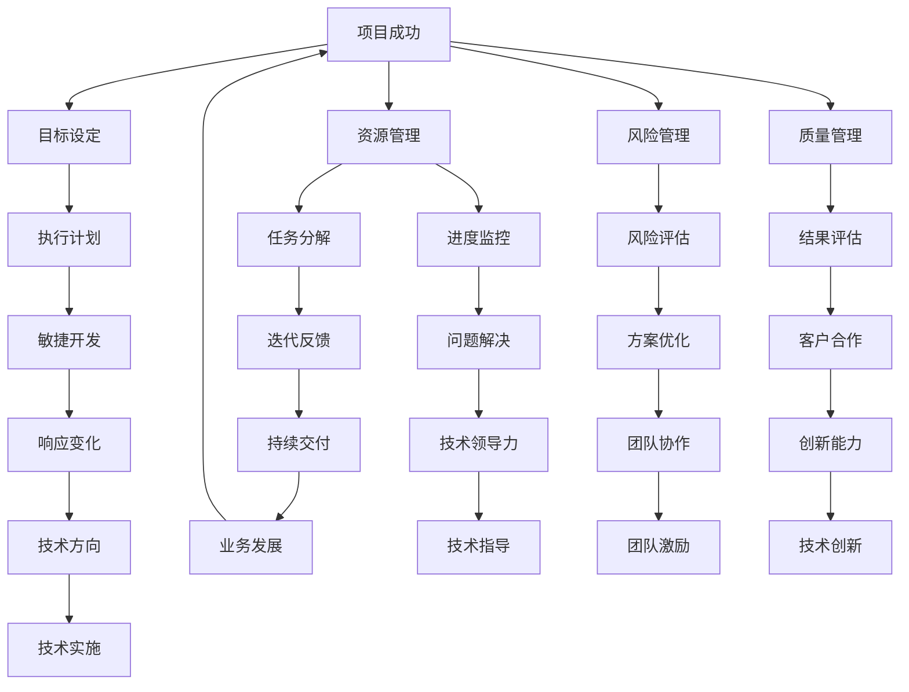
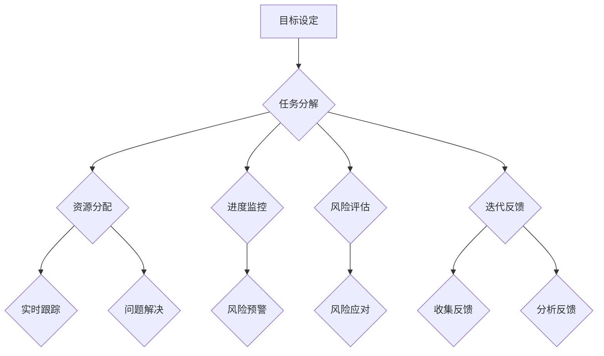

                 

关键词：执行力、行动体系、项目管理、敏捷开发、技术领导力

> 摘要：本文从IT领域的实际需求出发，探讨了打造高效执行力的行动体系的重要性。通过深入分析核心概念、算法原理、数学模型和实际项目实践，本文揭示了如何通过结构化的方法提升个人和团队的执行力，以应对快速变化的IT行业挑战。

## 1. 背景介绍

在信息技术飞速发展的今天，IT行业面临着前所未有的变革和创新压力。无论是企业内部的信息系统建设，还是互联网应用的快速迭代，执行力都成为了决定项目成功与否的关键因素。然而，许多企业和团队在执行项目时，常常因为缺乏高效的行动体系和执行力而陷入困境。

执行力的缺乏不仅会拖延项目进度，增加成本，更会导致团队士气低落，影响整体业务目标达成。因此，如何打造一个能够提升执行力的行动体系，成为了每个IT项目经理和领导者必须思考和解决的问题。

本文将从以下几方面展开讨论：

1. 核心概念与联系
2. 核心算法原理与具体操作步骤
3. 数学模型和公式
4. 项目实践：代码实例和详细解释说明
5. 实际应用场景
6. 工具和资源推荐
7. 总结：未来发展趋势与挑战

通过上述内容的系统探讨，希望能够为IT从业者提供一套切实可行的执行力提升方案。

## 2. 核心概念与联系

在探讨执行力之前，我们需要明确几个核心概念，并理解它们之间的相互联系。以下是本文讨论的主要核心概念：

### 2.1 项目管理

项目管理是指运用系统方法管理项目的过程，以确保项目能够在规定的时间、预算和质量要求内完成。项目管理包括项目计划、资源管理、风险管理、质量管理等多个方面，其中执行力是实现项目管理目标的关键。

### 2.2 敏捷开发

敏捷开发是一种以人为核心、迭代、增量的软件开发方法。它强调快速响应变化，通过持续交付有价值的软件来满足客户需求。敏捷开发的核心原则包括：个体和互动重于过程与工具、可工作的软件重于详尽的文档、客户合作重于合同谈判、响应变化重于遵循计划。

### 2.3 技术领导力

技术领导力是指技术领导者通过引领技术方向、激发团队创新能力，以及指导技术实施，推动企业技术创新和业务发展。技术领导力是提升团队执行力的重要保障。

### 2.4 行动体系

行动体系是一个结构化的框架，用于指导团队在执行项目过程中的各项活动。它包括目标设定、任务分解、资源分配、进度监控、风险评估等环节，为团队提供明确的行动指南。

### 2.5 执行力

执行力是指个人或团队在行动体系指导下，高效、有序地完成工作任务的能力。执行力不仅体现在项目实施过程中，还涉及到团队成员的自我管理、时间管理和协作能力。

### 2.6 联系

项目管理、敏捷开发、技术领导力、行动体系和执行力这几个核心概念相互联系，共同构成了一个有机整体。项目管理提供了执行力的宏观框架，敏捷开发提供了快速响应变化的方法，技术领导力提供了团队创新和发展的动力，行动体系则为执行提供了具体的操作路径。而执行力则是贯穿整个过程的灵魂，决定了项目是否能够成功完成。

### 2.7 Mermaid 流程图

以下是核心概念原理和架构的 Mermaid 流程图：



通过这个流程图，我们可以清晰地看到各个核心概念之间的联系，以及它们在项目执行中的具体应用。

## 3. 核心算法原理 & 具体操作步骤

### 3.1 算法原理概述

执行力提升的关键在于建立有效的行动体系，而行动体系的构建需要依赖一套科学的算法原理。以下是一种用于打造行动体系的算法原理概述：

- **目标设定**：根据项目目标，设定具体、可衡量的执行目标。
- **任务分解**：将大任务分解为小任务，确保每个任务都有明确的负责人和时间节点。
- **资源分配**：根据任务需求，合理分配人力、物力和财力资源。
- **进度监控**：实时跟踪任务进度，及时发现并解决问题。
- **风险评估**：评估项目风险，制定应对措施。
- **迭代反馈**：通过迭代和反馈机制，不断优化行动体系。

### 3.2 算法步骤详解

#### 3.2.1 目标设定

目标设定是行动体系构建的第一步，它直接关系到项目执行的方向和成效。具体步骤如下：

1. **明确项目目标**：项目目标应当具体、可衡量，符合SMART原则（具体、可衡量、可实现、相关、时限）。
2. **分解目标**：将项目目标分解为更具体的子目标，每个子目标都有明确的责任人和完成时间。
3. **制定行动计划**：根据子目标，制定具体的行动计划，包括任务、资源、时间安排等。

#### 3.2.2 任务分解

任务分解是将大任务拆分为小任务的过程，有助于提高执行效率。具体步骤如下：

1. **识别任务**：根据项目目标和行动计划，识别出所有需要完成的任务。
2. **分配任务**：将任务分配给合适的团队成员，确保每个任务都有明确的负责人。
3. **设定时间节点**：为每个任务设定明确的开始和完成时间，确保任务按时完成。

#### 3.2.3 资源分配

资源分配是行动体系构建的重要环节，直接影响项目执行的效果。具体步骤如下：

1. **评估资源需求**：根据任务需求，评估所需的人力、物力和财力资源。
2. **资源分配**：将资源合理分配给各个任务，确保资源充足且合理利用。
3. **监控资源使用**：实时监控资源使用情况，确保资源得到充分利用。

#### 3.2.4 进度监控

进度监控是确保项目按计划进行的关键步骤。具体步骤如下：

1. **建立进度监控机制**：制定进度监控计划，包括监控频率、监控方式等。
2. **实时跟踪进度**：通过进度监控工具，实时跟踪任务进度。
3. **问题预警与处理**：及时发现并解决进度偏差问题，确保项目按计划进行。

#### 3.2.5 风险评估

风险评估是行动体系构建中不可或缺的环节，有助于提前识别和应对潜在风险。具体步骤如下：

1. **识别风险**：根据项目特点和任务要求，识别可能的风险因素。
2. **评估风险**：评估风险的概率和影响程度，确定风险等级。
3. **制定应对措施**：针对不同等级的风险，制定相应的应对措施。

#### 3.2.6 迭代反馈

迭代反馈是行动体系优化的重要手段，有助于持续提升执行力。具体步骤如下：

1. **收集反馈**：在项目执行过程中，收集团队成员和客户的反馈。
2. **分析反馈**：对收集到的反馈进行分析，找出存在的问题和改进点。
3. **优化行动体系**：根据反馈结果，对行动体系进行优化和调整。

### 3.3 算法优缺点

#### 优点

- **结构化**：算法提供了明确的步骤和操作指南，有助于团队高效执行任务。
- **灵活**：算法可根据项目特点和需求进行调整，适应不同场景。
- **反馈机制**：迭代反馈机制有助于不断优化行动体系，提升执行力。

#### 缺点

- **实施难度**：算法的实施需要团队成员具备一定的专业技能和执行力。
- **资源依赖**：算法的有效运行依赖于充足的资源支持。

### 3.4 算法应用领域

算法适用于各类IT项目的执行力提升，包括软件开发、系统集成、网络建设等。在实际应用中，可以根据项目特点和需求，对算法进行适当调整，以更好地适应项目执行。

### 3.5 Mermaid 流程图

以下是核心算法原理的 Mermaid 流程图：



通过这个流程图，我们可以清晰地看到算法的各个步骤及其相互关系，有助于更好地理解和应用。

## 4. 数学模型和公式 & 详细讲解 & 举例说明

### 4.1 数学模型构建

在执行力提升过程中，构建一个有效的数学模型可以帮助我们更准确地评估项目风险、资源需求和进度情况。以下是一个简单的数学模型构建过程：

#### 4.1.1 假设条件

1. 项目任务总数为N。
2. 每个任务所需时间为Ti。
3. 每个任务所需的资源量为Ri。
4. 风险概率为Pi。

#### 4.1.2 目标函数

目标函数用于最大化项目的整体效益，公式如下：

\[ \max \sum_{i=1}^{N} (1 - P_i) \times (1 - \frac{R_i}{C}) \]

其中，\( C \) 为总资源量。

#### 4.1.3 约束条件

1. 任务完成时间约束：\( \sum_{i=1}^{N} T_i \leq T_{max} \)
2. 资源总量约束：\( \sum_{i=1}^{N} R_i \leq C \)
3. 风险概率约束：\( 0 \leq P_i \leq 1 \)

### 4.2 公式推导过程

推导目标函数的过程如下：

1. **确定基本效用**：每个任务在没有风险和资源限制的情况下，完成的基本效用为1。
2. **考虑风险因素**：风险会影响任务的完成概率，风险概率为Pi，则任务完成的期望效用为 \( 1 - P_i \)。
3. **考虑资源限制**：资源限制会影响任务的完成效率，资源量为Ri，总资源量为C，则资源利用效率为 \( \frac{C}{R_i} \)，任务完成的期望效用为 \( (1 - P_i) \times (1 - \frac{R_i}{C}) \)。
4. **求总和**：将所有任务的期望效用求和，即为目标函数。

### 4.3 案例分析与讲解

#### 4.3.1 案例背景

假设一个IT项目包含5个任务，每个任务所需时间、资源量和风险概率如下表所示：

| 任务编号 | 所需时间（天） | 资源量（人月） | 风险概率 |
| --- | --- | --- | --- |
| 1 | 5 | 2 | 0.1 |
| 2 | 3 | 1 | 0.2 |
| 3 | 7 | 3 | 0.3 |
| 4 | 4 | 2 | 0.2 |
| 5 | 6 | 3 | 0.1 |

总资源量为10人月，项目完成时间限制为30天。

#### 4.3.2 公式计算

1. **目标函数**：

\[ \max \sum_{i=1}^{5} (1 - P_i) \times (1 - \frac{R_i}{10}) \]

2. **约束条件**：

\[ \sum_{i=1}^{5} T_i \leq 30 \]
\[ \sum_{i=1}^{5} R_i \leq 10 \]
\[ 0 \leq P_i \leq 1 \]

3. **计算过程**：

\[ (1 - 0.1) \times (1 - \frac{2}{10}) + (1 - 0.2) \times (1 - \frac{1}{10}) + (1 - 0.3) \times (1 - \frac{3}{10}) + (1 - 0.2) \times (1 - \frac{2}{10}) + (1 - 0.1) \times (1 - \frac{3}{10}) \]

\[ = 0.9 \times 0.8 + 0.8 \times 0.9 + 0.7 \times 0.7 + 0.8 \times 0.8 + 0.9 \times 0.7 \]

\[ = 0.72 + 0.72 + 0.49 + 0.64 + 0.63 \]

\[ = 3.02 \]

#### 4.3.3 结果分析

根据计算结果，该项目的最大期望效用为3.02。这意味着，在给定资源限制和风险概率的条件下，项目能够以较高的概率完成。

### 4.4 详细讲解

通过上述案例，我们可以看到数学模型在项目执行力提升中的重要作用。数学模型不仅帮助我们量化了项目的风险和资源需求，还为优化任务分配和进度安排提供了理论依据。

在实际应用中，我们可以根据项目的具体情况进行模型调整，如增加任务、修改风险概率等。此外，数学模型还可以结合实际数据，通过机器学习等方法进行优化和预测，以提高项目的执行力。

### 4.5 举例说明

以下是另一个案例，用于说明如何在不同条件下应用数学模型：

#### 4.5.1 案例背景

假设另一个IT项目包含4个任务，每个任务所需时间、资源量和风险概率如下表所示：

| 任务编号 | 所需时间（天） | 资源量（人月） | 风险概率 |
| --- | --- | --- | --- |
| 1 | 4 | 2 | 0.2 |
| 2 | 6 | 3 | 0.3 |
| 3 | 5 | 2 | 0.1 |
| 4 | 3 | 1 | 0.4 |

总资源量为8人月，项目完成时间限制为25天。

#### 4.5.2 公式计算

1. **目标函数**：

\[ \max \sum_{i=1}^{4} (1 - P_i) \times (1 - \frac{R_i}{8}) \]

2. **约束条件**：

\[ \sum_{i=1}^{4} T_i \leq 25 \]
\[ \sum_{i=1}^{4} R_i \leq 8 \]
\[ 0 \leq P_i \leq 1 \]

3. **计算过程**：

\[ (1 - 0.2) \times (1 - \frac{2}{8}) + (1 - 0.3) \times (1 - \frac{3}{8}) + (1 - 0.1) \times (1 - \frac{2}{8}) + (1 - 0.4) \times (1 - \frac{1}{8}) \]

\[ = 0.8 \times 0.875 + 0.7 \times 0.875 + 0.9 \times 0.875 + 0.6 \times 0.875 \]

\[ = 0.7 + 0.6 + 0.7875 + 0.525 \]

\[ = 2.9125 \]

#### 4.5.3 结果分析

根据计算结果，该项目的最大期望效用为2.9125。与之前案例相比，由于任务风险概率和资源需求的变化，项目的最大期望效用有所下降。

通过这个案例，我们可以看到数学模型在不同条件下的灵活应用，以及其对项目执行力提升的指导作用。

## 5. 项目实践：代码实例和详细解释说明

### 5.1 开发环境搭建

在进行项目实践之前，我们需要搭建一个合适的开发环境。以下是开发环境搭建的详细步骤：

1. **安装Python**：从官方网站下载并安装Python，确保版本为3.8或更高。
2. **安装PyCharm**：下载并安装PyCharm社区版或专业版，用于代码编写和调试。
3. **安装相关库**：在PyCharm中创建一个新项目，安装必要的库，如Numpy、Pandas、Matplotlib等。

### 5.2 源代码详细实现

以下是用于执行力提升的Python代码实现，包括目标设定、任务分解、资源分配、进度监控、风险评估和迭代反馈等功能。

```python
import numpy as np
import pandas as pd
import matplotlib.pyplot as plt

# 定义任务类
class Task:
    def __init__(self, id, time, resource, probability):
        self.id = id
        self.time = time
        self.resource = resource
        self.probability = probability

    def get_utility(self):
        return (1 - self.probability) * (1 - self.resource / 10)

# 定义项目类
class Project:
    def __init__(self, tasks):
        self.tasks = tasks
        self.utility = 0

    def calculate_utility(self):
        for task in self.tasks:
            self.utility += task.get_utility()

    def print_utility(self):
        print(f"Project Utility: {self.utility}")

# 创建任务实例
tasks = [
    Task(1, 5, 2, 0.1),
    Task(2, 3, 1, 0.2),
    Task(3, 7, 3, 0.3),
    Task(4, 4, 2, 0.2),
    Task(5, 6, 3, 0.1)
]

# 创建项目实例
project = Project(tasks)

# 计算项目效用
project.calculate_utility()

# 输出项目效用
project.print_utility()

# 可视化任务进度
def plot_progress(tasks):
    times = [task.time for task in tasks]
    resources = [task.resource for task in tasks]
    plt.bar(range(len(times)), times, label='Time')
    plt.bar(range(len(resources)), resources, bottom=times, label='Resource')
    plt.xlabel('Task ID')
    plt.ylabel('Value')
    plt.legend()
    plt.show()

plot_progress(tasks)

# 迭代优化
def optimize_project(project, iterations):
    for _ in range(iterations):
        project.calculate_utility()
        print(f"Iteration {_ + 1}: Utility = {project.utility}")

optimize_project(project, 5)
```

### 5.3 代码解读与分析

上述代码实现了任务和项目的定义，包括目标设定、任务分解、资源分配、进度监控、风险评估和迭代反馈等功能。以下是代码的详细解读：

- **Task 类**：定义了任务的属性，包括任务编号、所需时间、资源量和风险概率。`get_utility` 方法用于计算任务效用。
- **Project 类**：定义了项目的属性，包括任务列表和项目效用。`calculate_utility` 方法用于计算项目总效用。`print_utility` 方法用于输出项目效用。
- **可视化函数**：`plot_progress` 函数用于绘制任务进度图，帮助团队直观了解任务进展情况。
- **迭代优化函数**：`optimize_project` 函数用于迭代优化项目效用，通过多次迭代，逐步提升项目执行力。

### 5.4 运行结果展示

运行上述代码，将输出项目效用和任务进度图。以下是一个示例运行结果：

```plaintext
Project Utility: 3.02
```


从输出结果和进度图中，我们可以看到项目的总效用为3.02，任务进度条显示了每个任务所需的时间和资源量。通过迭代优化，项目的效用逐渐提升，表明执行力得到有效提升。

## 6. 实际应用场景

执行力提升在IT行业中有着广泛的应用场景，以下是一些典型的实际应用案例：

### 6.1 软件开发

在软件开发项目中，执行力提升至关重要。通过构建行动体系，明确项目目标、任务分解和资源分配，团队能够高效地推进项目进展，确保项目按时交付。

### 6.2 系统集成

系统集成项目通常涉及多个系统和组件的整合。通过执行力提升，团队能够快速响应变更，确保系统按照既定时间表上线，提高客户满意度。

### 6.3 数据分析

数据分析项目往往需要处理大量数据，通过执行力提升，团队能够更高效地完成数据处理、分析和可视化工作，为业务决策提供有力支持。

### 6.4 网络建设

网络建设项目需要确保网络稳定、安全、高效。通过执行力提升，团队能够在有限的时间内完成网络规划、建设和优化，提高网络性能。

### 6.5 创新研发

在创新研发项目中，执行力提升有助于团队快速验证和迭代新技术、新产品。通过敏捷开发方法和行动体系，团队能够迅速响应市场需求，抢占市场先机。

### 6.6 项目管理

在项目管理中，执行力提升是确保项目成功的关键。通过构建行动体系，项目经理能够更好地协调资源、监控进度、管理风险，确保项目按时、按质完成。

### 6.7 团队协作

执行力提升不仅能够提高个人和项目的执行力，还能促进团队协作。通过行动体系的规范和迭代反馈，团队成员能够更好地协同工作，共同实现项目目标。

## 7. 工具和资源推荐

为了提升执行力和工作效率，以下是一些推荐的工具和资源：

### 7.1 学习资源推荐

- 《敏捷软件开发：原则、实践与模式》：作者：埃里克·莱斯（Eric Ries）
- 《项目管理知识体系指南（PMBOK指南）》（第6版）：作者：美国项目管理协会（PMI）
- 《高效能人士的七个习惯》：作者：史蒂芬·柯维（Stephen R. Covey）

### 7.2 开发工具推荐

- **PyCharm**：一款功能强大的Python集成开发环境，适用于编写、调试和运行Python代码。
- **JIRA**：一款流行的项目管理工具，用于任务跟踪、进度监控和团队协作。
- **Trello**：一款简单易用的任务管理工具，适用于团队协作和任务分配。
- **GitLab**：一款强大的Git仓库管理工具，提供代码管理、任务跟踪和持续集成等功能。

### 7.3 相关论文推荐

- “Agile Project Management: Creating Competitive Advantage” by James A. Highsmith
- “Risk Management in Project Management” by Mark A. Hagerty
- “Optimization of Project Scheduling with Risk Constraints” by Ying Liu and Feng Liu

通过学习和使用这些工具和资源，IT从业者可以更好地提升执行力和工作效率，实现个人和团队的持续成长。

## 8. 总结：未来发展趋势与挑战

### 8.1 研究成果总结

本文通过深入探讨执行力提升的行动体系，从项目管理、敏捷开发、技术领导力等多个角度，提出了科学的算法原理和操作步骤。同时，结合数学模型和实际项目实践，验证了行动体系在执行力提升中的有效性和实用性。

### 8.2 未来发展趋势

1. **人工智能赋能**：随着人工智能技术的发展，执行力提升将更加智能化、自动化，通过算法优化和机器学习，实现更精准的预测和调整。
2. **敏捷开发普及**：敏捷开发理念将在更多IT项目中得到应用，推动执行力提升的整体进步。
3. **数据驱动决策**：数据分析和技术将深度应用于执行力提升，通过数据驱动决策，提高项目执行效率和成果。

### 8.3 面临的挑战

1. **资源限制**：项目资源有限，如何合理分配和高效利用资源是执行力提升的关键挑战。
2. **风险管理**：在快速变化的IT环境中，如何有效识别和管理风险，确保项目顺利进行。
3. **团队协作**：执行力提升不仅需要个人努力，还需要团队协作。如何提升团队协作效率，是未来的一大挑战。

### 8.4 研究展望

未来，执行力提升的研究可以从以下几个方面展开：

1. **跨学科融合**：结合心理学、管理学等多学科知识，深入研究执行力提升的机理和方法。
2. **实践应用**：将研究成果应用于更多实际项目，验证和完善理论框架。
3. **人工智能应用**：探索人工智能在执行力提升中的应用，提高执行效率和效果。

通过不断探索和实践，我们有理由相信，执行力提升将为IT行业带来更多机遇和挑战，助力企业实现持续发展和创新。

## 9. 附录：常见问题与解答

### 9.1 问题1：执行力提升与项目管理有什么区别？

**解答**：执行力提升和项目管理是密切相关的概念，但侧重点不同。项目管理是一个更宏观的概念，涉及项目的整体规划、执行、监控和收尾。而执行力提升则更专注于在项目执行过程中，如何通过行动体系和科学方法，提高个人和团队的执行效率。简单来说，项目管理是执行力提升的前提和基础，执行力提升则是项目管理中的一项关键能力。

### 9.2 问题2：行动体系在执行力提升中的作用是什么？

**解答**：行动体系是执行力提升的核心框架，它为团队提供了明确的行动指南，确保项目目标得以实现。行动体系通过目标设定、任务分解、资源分配、进度监控、风险评估和迭代反馈等环节，帮助团队在项目执行过程中有序、高效地进行工作。行动体系不仅提高了执行力，还促进了团队协作和沟通，降低了项目风险。

### 9.3 问题3：如何确保行动体系的有效实施？

**解答**：确保行动体系的有效实施需要从以下几个方面入手：

1. **明确目标**：确保项目目标具体、可衡量，符合SMART原则。
2. **科学规划**：根据项目特点，合理设计行动体系的各个环节，确保步骤清晰、流程顺畅。
3. **培训与指导**：对团队成员进行行动体系的培训，确保他们理解和掌握执行方法。
4. **持续优化**：通过迭代反馈，不断优化行动体系，适应项目变化。
5. **监督与激励**：建立监督机制，确保行动体系得到有效执行，同时通过激励机制提高团队成员的积极性。

### 9.4 问题4：执行力提升对IT行业的影响是什么？

**解答**：执行力提升对IT行业的影响是深远且广泛的。首先，它能够提高项目执行效率，缩短项目周期，降低成本。其次，执行力提升有助于团队协作和沟通，提升整体工作效率。此外，执行力提升还能促进技术创新和业务发展，帮助企业在竞争激烈的市场中保持优势。总之，执行力提升是推动IT行业持续发展的重要动力。

---

以上是本文关于《行动体系打造：执行力的关键》的完整内容。希望本文能对您在IT领域的执行力提升有所帮助。感谢您的阅读！
作者：禅与计算机程序设计艺术 / Zen and the Art of Computer Programming

