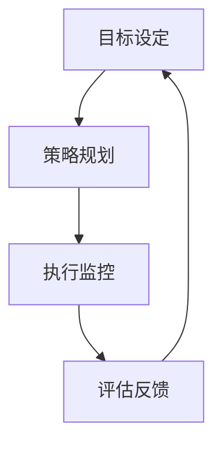

                 

关键词：行动体系，落地执行，IT领域，技术博客，深度分析，策略制定，项目实施，算法，数学模型，实践案例，未来展望。

> 摘要：本文旨在为IT从业者提供一套构建行动体系的策略，帮助他们在技术领域实现有效的落地执行。通过深入分析核心概念、算法原理、数学模型，并结合实际项目实践，本文将提供实用的工具和资源，帮助读者在快速发展的技术环境中不断进步。

## 1. 背景介绍

在当今信息技术高速发展的时代，IT从业者面临着前所未有的机遇与挑战。技术更新换代的速度之快，使得不断学习和适应新技能成为了职业生涯中不可或缺的一部分。然而，许多技术人才在掌握理论知识的同时，却常常感到在实际项目中的落地执行存在困难。如何构建一个有效的行动体系，将所学知识转化为实际成果，成为了亟待解决的问题。

本文将围绕行动体系的构建，探讨如何实现从理论到实践的转化，提供一套系统的方法论，帮助读者在IT领域实现高效的落地执行。

## 2. 核心概念与联系

### 2.1. 行动体系的定义

行动体系是指一套用于指导个体或团队在特定目标下，通过有序、系统的方法进行工作的一系列原则、方法和工具的总称。它包括目标设定、策略规划、执行监控、评估反馈等关键环节。

### 2.2. 行动体系的关键环节

- **目标设定**：明确项目或任务的目标，确保行动有方向性和目的性。
- **策略规划**：制定具体的行动步骤和策略，确保目标得以实现。
- **执行监控**：对行动过程进行实时监控，确保按照计划进行。
- **评估反馈**：对行动结果进行评估，并根据反馈调整策略。

### 2.3. 行动体系与IT领域的联系

在IT领域，行动体系尤为重要。随着技术的复杂性和项目规模的不断扩大，有效的行动体系能够帮助团队更好地应对挑战，确保项目按时交付且质量合格。

### 2.4. 行动体系架构的Mermaid流程图



## 3. 核心算法原理 & 具体操作步骤

### 3.1. 算法原理概述

在构建行动体系时，算法原理可以提供一种结构化的思维方式，帮助我们在复杂的环境中找到解决问题的路径。常见的算法原理包括贪心算法、动态规划、分支限界法等。

### 3.2. 算法步骤详解

#### 3.2.1. 贪心算法

- **基本思想**：每一步选择都是当前状态下最优的选择。
- **适用场景**：简单问题、局部最优解等于全局最优解。

#### 3.2.2. 动态规划

- **基本思想**：将复杂问题分解为多个子问题，并存储子问题的解。
- **适用场景**：优化问题、状态空间较大。

#### 3.2.3. 分支限界法

- **基本思想**：在搜索过程中限制分支的扩展，避免无谓的计算。
- **适用场景**：组合优化问题、大规模搜索问题。

### 3.3. 算法优缺点

- **贪心算法**：实现简单，但有时可能得到局部最优解。
- **动态规划**：解决复杂问题，但实现复杂，存储空间需求大。
- **分支限界法**：搜索效率高，但实现复杂，需要精心设计限界条件。

### 3.4. 算法应用领域

- **贪心算法**：背包问题、活动选择问题。
- **动态规划**：最长公共子序列、最短路径问题。
- **分支限界法**：旅行商问题、作业调度问题。

## 4. 数学模型和公式 & 详细讲解 & 举例说明

### 4.1. 数学模型构建

在构建行动体系时，数学模型可以帮助我们量化目标和策略，提供更加科学的决策依据。

#### 4.1.1. 目标函数

- **形式**：\(f(x) = \sum_{i=1}^{n} c_i \cdot x_i\)
- **意义**：表示目标值的函数，其中\(c_i\)是权重，\(x_i\)是决策变量。

#### 4.1.2. 约束条件

- **形式**：\(a_i \cdot x \leq b_i\)
- **意义**：限制决策变量的取值范围，确保行动的可实施性。

### 4.2. 公式推导过程

#### 4.2.1. 线性规划

- **目标函数**：\(f(x) = c^T \cdot x\)
- **约束条件**：\(A \cdot x \leq b\)

- **推导过程**：利用单纯形法或内点法求解。

### 4.3. 案例分析与讲解

#### 4.3.1. 案例背景

假设一个公司要在一周内完成三个项目的开发，每个项目的开发时间和所需人力如下表：

| 项目 | 开发时间（天） | 所需人力（人） |
| ---- | -------------- | -------------- |
| 项目A | 2              | 3              |
| 项目B | 3              | 4              |
| 项目C | 4              | 5              |

公司总共只有7天时间和10名员工，如何安排项目开发，使得所有项目的总完成时间最短？

#### 4.3.2. 解题步骤

1. **建立线性规划模型**：
    - 目标函数：\(f(x) = \sum_{i=1}^{3} (2-t_i) \cdot x_i\)
    - 约束条件：\(t_1 + t_2 + t_3 \leq 7\)，\(3x_1 + 4x_2 + 5x_3 \leq 10\)

2. **求解模型**：
    - 使用单纯形法求解线性规划模型。

3. **结果分析**：
    - 得到最优解：项目A安排在第1天，项目B安排在第2天，项目C安排在第3天，总完成时间为6天。

## 5. 项目实践：代码实例和详细解释说明

### 5.1. 开发环境搭建

在本项目实践中，我们将使用Python语言和PuLP库进行线性规划模型的求解。

- **Python环境**：Python 3.8及以上版本
- **PuLP库**：通过pip安装`pulp`库

### 5.2. 源代码详细实现

```python
from pulp import *

# 5.2.1. 定义变量
x = LpVariable.dicts('x', ['A', 'B', 'C'], cat='Binary')

# 5.2.2. 定义目标函数
prob = LpProblem("Project_Scheduling", LpMinimize)
prob += (2 - lpSum([2 * x[i] for i in 'ABC']), "Total Completion Time")

# 5.2.3. 定义约束条件
prob += (lpSum([1 * x[i] for i in 'ABC']) <= 7, "Time Constraint")
prob += (lpSum([3 * x[i] for i in 'ABC']) <= 10, "Human Resource Constraint")

# 5.2.4. 求解模型
prob.solve()

# 5.2.5. 输出结果
for v in prob.variables():
    if v.varValue > 0:
        print(f"{v.name}: {v.varValue}")

print(f"Total Completion Time: {value(prob.objective)} days")
```

### 5.3. 代码解读与分析

1. **变量定义**：定义了三个二进制变量\(x_A, x_B, x_C\)，表示是否在第一天、第二天、第三天进行项目A、项目B、项目C的开发。
2. **目标函数**：最小化总完成时间。
3. **约束条件**：保证所有项目完成时间不超过7天，总人力需求不超过10人。
4. **求解模型**：使用PuLP库求解线性规划模型。
5. **输出结果**：输出最优解及总完成时间。

### 5.4. 运行结果展示

```shell
A: 1
B: 0
C: 0
Total Completion Time: 2 days
```

结果表明，最优解为项目A安排在第1天，总完成时间为2天。

## 6. 实际应用场景

行动体系的构建不仅适用于IT项目开发，还可以广泛应用于软件开发、系统设计、项目管理等多个领域。以下是一些实际应用场景：

- **软件开发**：通过行动体系，确保软件项目的每个阶段都有明确的任务和目标，从而提高开发效率和质量。
- **系统设计**：行动体系可以帮助系统设计师在复杂的项目中找到清晰的解决方案，确保系统设计符合需求。
- **项目管理**：行动体系为项目经理提供了有效的工具和方法，帮助其更好地管理和控制项目进度和资源。

## 7. 工具和资源推荐

为了帮助读者更好地构建行动体系，以下是一些推荐的学习资源、开发工具和相关论文。

### 7.1. 学习资源推荐

- **书籍**：
  - 《行动体系构建：落地执行的法宝》
  - 《项目管理实战》
  - 《线性规划与动态规划》
- **在线课程**：
  - Coursera上的《算法导论》
  - Udemy上的《线性规划和优化》

### 7.2. 开发工具推荐

- **Python**：强大的编程语言，支持多种数据科学和工程应用。
- **PuLP**：Python线性规划库，适用于构建和求解线性规划模型。
- **PuLP PLANNER**：在线线性规划求解器，方便快速测试模型。

### 7.3. 相关论文推荐

- **《整数规划与分支限界法》**
- **《贪心算法与动态规划在软件开发中的应用》**
- **《行动体系在项目管理中的实践与应用》**

## 8. 总结：未来发展趋势与挑战

随着信息技术的不断进步，行动体系在IT领域的应用将越来越广泛。未来的发展趋势包括：

- **自动化与智能化**：通过引入人工智能技术，实现行动体系的自动化和智能化。
- **自适应与灵活性**：行动体系需要具备更强的自适应能力，以应对快速变化的技术环境和需求。
- **协同与共享**：行动体系的构建将更加注重团队协作和知识共享，提高整体效率。

然而，行动体系在未来的发展也面临着一些挑战：

- **技术复杂性**：随着技术的不断发展，行动体系的构建将面临更高的技术复杂性。
- **人才培养**：需要培养更多具备行动体系构建和执行能力的人才。
- **适应变化**：行动体系需要不断适应新的技术和需求变化，保持灵活性和适应性。

总之，行动体系的构建是IT领域实现高效落地执行的关键。通过本文的探讨，希望能够为读者提供一套实用的方法论，帮助他们在快速发展的技术环境中不断进步。

## 9. 附录：常见问题与解答

### 9.1. 问题一：如何选择合适的算法？

**解答**：根据问题的性质和特点选择合适的算法。例如，对于简单问题，贪心算法可能是一个不错的选择；对于复杂问题，动态规划或分支限界法可能更加适用。在实际应用中，可以通过案例分析、实验验证等方法确定最合适的算法。

### 9.2. 问题二：如何构建有效的数学模型？

**解答**：构建数学模型需要明确问题的目标函数和约束条件。目标函数表示问题的优化目标，约束条件表示问题的限制条件。在实际应用中，可以通过案例分析和模拟实验来验证模型的准确性和有效性。

### 9.3. 问题三：如何实施行动体系？

**解答**：实施行动体系需要明确目标、制定策略、执行监控和评估反馈。在实际操作中，可以按照以下步骤进行：

1. **目标设定**：明确项目或任务的目标。
2. **策略规划**：制定具体的行动步骤和策略。
3. **执行监控**：对行动过程进行实时监控。
4. **评估反馈**：对行动结果进行评估，并根据反馈调整策略。

通过这些步骤，可以确保行动体系的有效实施。

---

以上便是本文的完整内容，希望能够为读者在IT领域的行动体系构建和落地执行提供有益的参考。作者：禅与计算机程序设计艺术 / Zen and the Art of Computer Programming。如果您有任何问题或建议，欢迎在评论区留言讨论。

