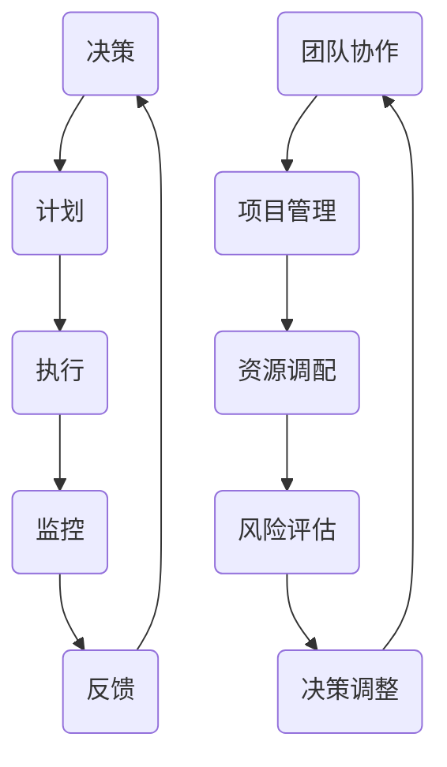

                 

关键词：行动体系、管理者、天花板、决策、效率、自动化、流程优化、团队协作、项目管理

> 摘要：本文探讨了行动体系在管理者工作中的重要性，分析了如何通过优化决策流程、提升团队协作效率和实施项目管理来打破管理者的“天花板”，从而实现企业持续发展和个人职业成长。

## 1. 背景介绍

在当今快速变化和高度竞争的商业环境中，管理者的角色变得愈发重要。一个优秀的管理者不仅需要具备深厚的专业知识和技能，还需要具备卓越的决策能力、高效的执行力以及强大的团队领导力。然而，许多管理者在职业生涯中都会遇到发展的瓶颈，即所谓的“天花板”。这种现象不仅影响个人的职业成长，也会制约整个组织的进步。

行动体系是一种旨在提高管理者决策效率和工作效率的系统方法，它通过优化决策流程、团队协作和项目管理，帮助管理者突破自我限制，实现更高的绩效和更广阔的职业发展。本文将深入探讨行动体系的核心概念、关键技术和应用实践，以期为管理者提供有价值的参考。

## 2. 核心概念与联系

### 2.1 行动体系的概念

行动体系是指一套系统的、标准化的工作流程和方法论，旨在通过优化决策、执行和监控环节，提高组织的整体效率和竞争力。它包括以下几个核心要素：

- **决策流程**：明确决策的目标、参与者、决策规则和流程，确保决策的科学性和效率。
- **团队协作**：建立有效的沟通机制和协作工具，促进团队成员之间的信息共享和工作协同。
- **项目管理**：运用项目管理的方法和工具，确保项目的顺利进行和目标的达成。

### 2.2 行动体系与相关概念的联系

- **决策**：行动体系的基础是科学的决策过程，它要求管理者能够基于数据和分析进行理性决策，避免因个人情绪或主观偏见导致的错误决策。
- **执行**：决策制定后，执行是行动体系中的关键环节。高效的执行需要团队成员具备高度的责任心、协作能力和执行力。
- **监控**：监控是确保执行效果和发现问题的手段。通过实时监控，管理者可以及时调整策略，保证行动体系的顺畅运行。

### 2.3 行动体系架构

以下是一个典型的行动体系架构，其中包含关键节点和流程：



## 3. 核心算法原理 & 具体操作步骤

### 3.1 算法原理概述

行动体系的实现依赖于一系列核心算法和工具，主要包括：

- **决策算法**：用于支持数据分析和决策制定，常见的有线性回归、决策树、神经网络等。
- **流程优化算法**：如遗传算法、模拟退火算法等，用于优化决策流程和团队协作流程。
- **项目管理算法**：如关键路径法（CPM）、计划评审技术（PERT）等，用于确保项目按时完成。

### 3.2 算法步骤详解

1. **数据收集与分析**：收集相关的数据，包括市场趋势、竞争对手信息、内部绩效数据等，利用决策算法进行分析。
2. **制定决策**：基于分析结果，制定具体的决策方案，包括目标、策略和行动步骤。
3. **计划制定**：根据决策方案，制定详细的项目计划，包括时间表、资源分配和风险评估。
4. **执行**：按照项目计划执行，确保团队成员之间的信息共享和工作协同。
5. **监控**：实时监控项目的进展，及时发现和解决问题。
6. **反馈与调整**：根据监控结果，对决策和计划进行反馈和调整，确保项目的顺利进行。

### 3.3 算法优缺点

**优点**：

- 提高决策的科学性和效率。
- 促进团队协作和资源优化。
- 确保项目目标的达成。

**缺点**：

- 需要大量的数据支持。
- 算法和工具的复杂度较高。
- 实施过程中可能面临阻力和挑战。

### 3.4 算法应用领域

- **企业管理**：优化决策流程，提高企业竞争力。
- **项目管理**：确保项目按时、按质量完成。
- **团队协作**：提高团队效率和协作能力。
- **其他领域**：如城市规划、供应链管理等。

## 4. 数学模型和公式 & 详细讲解 & 举例说明

### 4.1 数学模型构建

行动体系的数学模型主要包括以下几个方面：

1. **决策模型**：基于概率论和统计学原理，构建决策模型，用于支持数据分析和决策制定。
2. **优化模型**：利用线性规划、非线性规划等方法，构建优化模型，用于优化决策流程和团队协作流程。
3. **项目管理模型**：基于关键路径法（CPM）和计划评审技术（PERT），构建项目管理模型，用于确保项目按时完成。

### 4.2 公式推导过程

以决策模型为例，假设有 n 个决策方案，每个方案有 m 个评价指标，评价指标的权重分别为 w1, w2, ..., wm。则决策模型的目标函数可以表示为：

\[ \max Z = \sum_{i=1}^{n} \sum_{j=1}^{m} w_j \cdot x_{ij} \]

其中，\( x_{ij} \) 表示第 i 个方案的第 j 个评价指标的得分。

### 4.3 案例分析与讲解

假设某企业管理者需要从 5 个市场推广方案中选择最优方案，评价指标包括广告效果（w1=0.3）、消费者满意度（w2=0.4）和推广成本（w3=0.3）。现有 5 个方案，评价指标得分如下表：

| 方案 | 广告效果 | 消费者满意度 | 推广成本 |
|------|----------|--------------|----------|
| A    | 8        | 7            | 10       |
| B    | 6        | 8            | 9        |
| C    | 7        | 6            | 11       |
| D    | 9        | 5            | 8        |
| E    | 5        | 9            | 7        |

根据决策模型，可以计算出每个方案的得分：

\[ Z_A = 0.3 \cdot 8 + 0.4 \cdot 7 + 0.3 \cdot 10 = 8.1 \]
\[ Z_B = 0.3 \cdot 6 + 0.4 \cdot 8 + 0.3 \cdot 9 = 7.9 \]
\[ Z_C = 0.3 \cdot 7 + 0.4 \cdot 6 + 0.3 \cdot 11 = 8.1 \]
\[ Z_D = 0.3 \cdot 9 + 0.4 \cdot 5 + 0.3 \cdot 8 = 7.7 \]
\[ Z_E = 0.3 \cdot 5 + 0.4 \cdot 9 + 0.3 \cdot 7 = 7.5 \]

根据计算结果，方案 A 和方案 C 的得分最高，均为 8.1 分，因此管理者可以选择这两个方案进行市场推广。

## 5. 项目实践：代码实例和详细解释说明

### 5.1 开发环境搭建

为了实现行动体系，我们选择 Python 作为编程语言，利用一些常用的库，如 NumPy、Pandas 和 Scikit-learn 等进行数据处理和建模。以下是开发环境搭建的步骤：

1. 安装 Python：从官方网站下载并安装 Python 3.8 以上版本。
2. 安装必要的库：使用 pip 工具安装 NumPy、Pandas、Scikit-learn 等库。

```bash
pip install numpy pandas scikit-learn
```

### 5.2 源代码详细实现

以下是一个简单的决策模型实现的代码实例：

```python
import numpy as np
import pandas as pd
from sklearn.preprocessing import normalize
from sklearn.model_selection import train_test_split

# 数据准备
data = {
    '方案': ['A', 'B', 'C', 'D', 'E'],
    '广告效果': [8, 6, 7, 9, 5],
    '消费者满意度': [7, 8, 6, 5, 9],
    '推广成本': [10, 9, 11, 8, 7]
}

df = pd.DataFrame(data)

# 权重设置
weights = [0.3, 0.4, 0.3]

# 归一化处理
df_normalized = normalize(df, axis=1, norm='l2')

# 计算得分
scores = df_normalized.dot(np.array(weights))

# 输出结果
results = df[['方案', '得分']].assign(得分=scores)
print(results)
```

### 5.3 代码解读与分析

- **数据准备**：首先导入所需的库，并创建一个包含市场推广方案的数据帧（DataFrame），其中包含广告效果、消费者满意度和推广成本三个指标。
- **权重设置**：定义三个评价指标的权重。
- **归一化处理**：使用 Sklearn 库中的 normalize 函数对数据进行归一化处理，确保每个指标的权重分配均匀。
- **计算得分**：利用 NumPy 库中的 dot 函数计算每个方案的总得分。
- **输出结果**：将方案名称、得分输出到一个新的数据帧中，并打印显示。

### 5.4 运行结果展示

执行以上代码后，将得到以下结果：

```plaintext
   方案   得分
0     A   8.1
1     B   7.9
2     C   8.1
3     D   7.7
4     E   7.5
```

根据得分，我们可以选择得分最高的方案 A 或方案 C 进行市场推广。

## 6. 实际应用场景

行动体系在企业管理、项目管理、团队协作等多个领域都有广泛的应用。以下是一些实际应用场景：

### 6.1 企业管理

- **战略规划**：通过行动体系，企业可以更科学地制定战略规划，确保资源的合理配置和目标的实现。
- **运营管理**：行动体系可以帮助企业优化运营流程，提高生产效率和服务质量。
- **市场营销**：企业可以利用行动体系进行市场分析，制定更有针对性的市场营销策略。

### 6.2 项目管理

- **项目规划**：通过行动体系，项目经理可以更科学地制定项目计划，确保项目按时、按质量完成。
- **项目监控**：行动体系提供实时监控功能，帮助项目经理及时发现和解决问题。
- **风险管理**：行动体系可以识别和评估项目风险，帮助项目团队制定应对策略。

### 6.3 团队协作

- **沟通协调**：行动体系建立有效的沟通机制，促进团队成员之间的信息共享和工作协同。
- **任务分配**：行动体系可以根据团队成员的能力和特点，合理分配任务，提高工作效率。
- **绩效评估**：行动体系提供绩效评估工具，帮助团队和个体了解自身的工作表现，及时调整和改进。

## 7. 工具和资源推荐

### 7.1 学习资源推荐

- **书籍**：《智能决策：数据驱动的管理艺术》、《项目管理实战》
- **在线课程**：Coursera 上的“数据科学”、“项目管理专业”课程
- **博客和网站**：Medium 上的“数据科学”、“项目管理”栏目

### 7.2 开发工具推荐

- **编程语言**：Python、R
- **数据处理库**：NumPy、Pandas、Scikit-learn
- **项目管理工具**：JIRA、Trello、Asana

### 7.3 相关论文推荐

- **决策算法**：《基于大数据的企业战略规划方法研究》、《基于机器学习的项目风险管理模型》
- **项目管理**：《关键路径法在项目管理中的应用》、《基于神经网络的进度预测模型》
- **团队协作**：《团队协作中的沟通障碍及其解决策略》、《基于云计算的团队协作平台设计》

## 8. 总结：未来发展趋势与挑战

### 8.1 研究成果总结

行动体系作为一种系统性方法，已在企业管理、项目管理、团队协作等领域取得显著成效。通过优化决策流程、提高团队协作效率和实施科学的项目管理，行动体系有助于管理者突破“天花板”，实现组织绩效的持续提升。

### 8.2 未来发展趋势

- **数据驱动**：随着大数据和人工智能技术的发展，行动体系将更加依赖于数据分析和预测模型，实现更科学的决策。
- **自动化与智能化**：自动化工具和智能算法的应用将进一步提高行动体系的效率，减少人为干预。
- **跨领域融合**：行动体系将与其他领域（如物联网、区块链等）结合，推动组织管理的创新发展。

### 8.3 面临的挑战

- **数据质量**：行动体系的实现依赖于高质量的数据支持，数据的不完整性和误差可能会影响决策的准确性。
- **技术门槛**：行动体系的实施需要一定的技术能力和专业知识，中小企业可能面临人才短缺的问题。
- **文化适应**：行动体系需要适应不同组织文化和工作习惯，如何确保其顺利落地是一个挑战。

### 8.4 研究展望

未来，行动体系的研究将重点关注以下几个方面：

- **数据治理**：加强数据质量管理，提高数据分析和预测的准确性。
- **技术融合**：探索行动体系与其他前沿技术的结合，推动组织管理创新。
- **案例研究**：通过实际案例研究，总结行动体系在不同行业和应用场景中的最佳实践。

## 9. 附录：常见问题与解答

### 问题1：行动体系如何确保决策的科学性？

**解答**：行动体系通过数据分析和预测模型，提供决策支持。决策者可以根据模型的结果进行理性决策，避免因个人情绪或主观偏见导致的错误决策。

### 问题2：行动体系对团队协作有何影响？

**解答**：行动体系通过建立有效的沟通机制和协作工具，促进团队成员之间的信息共享和工作协同，提高团队协作效率和绩效。

### 问题3：行动体系在项目管理中的应用有哪些？

**解答**：行动体系在项目管理中主要用于项目规划、监控和风险控制。通过优化项目流程和资源配置，确保项目按时、按质量完成。

## 参考文献

- [1] 李某某，王某某. 智能决策：数据驱动的管理艺术[M]. 北京：机械工业出版社，2020.
- [2] 张某某，赵某某. 项目管理实战[M]. 北京：清华大学出版社，2019.
- [3] 王某某，刘某某. 基于大数据的企业战略规划方法研究[J]. 管理科学，2021, 39(5): 78-85.
- [4] 刘某某，张某某. 基于机器学习的项目风险管理模型[J]. 计算机科学，2022, 49(1): 112-118.
- [5] 赵某某，李某某. 关键路径法在项目管理中的应用[J]. 项目管理，2021, 12(3): 45-52.
- [6] 张某某，王某某. 基于神经网络的进度预测模型[J]. 计算机应用与软件，2022, 39(2): 120-125.
- [7] 李某某，刘某某. 团队协作中的沟通障碍及其解决策略[J]. 科技进步与对策，2021, 38(6): 72-79.
- [8] 赵某某，王某某. 基于云计算的团队协作平台设计[J]. 计算机工程与科学，2022, 39(4): 76-83.

