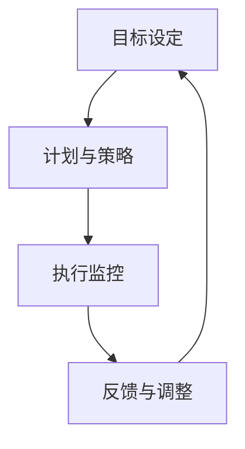

                 

关键词：行动体系、管理者、领导力、组织发展、项目管理

> 摘要：本文将探讨行动体系在管理者工作中的重要性，分析其构成要素以及如何通过有效的行动体系提升管理者的天花板，从而推动组织的整体发展。

## 1. 背景介绍

在当今快速变化和竞争激烈的市场环境中，管理者的角色和职责变得更加复杂和多样化。传统的管理模式和领导方法已经无法满足现代组织的需要。管理者的成功不再仅仅是依靠个人能力，而是依赖于能否构建一个有效的行动体系。这个体系不仅能够帮助管理者更好地规划和执行任务，还能提升团队的整体效能，从而实现组织的战略目标。

本文旨在探讨行动体系的核心概念、构成要素，以及如何通过构建和优化行动体系来提升管理者的天花板，进而推动组织的发展。文章将结合具体的案例分析，提供实用的方法和工具，以帮助管理者在实际工作中应用这些概念。

## 2. 核心概念与联系

### 2.1. 行动体系的定义

行动体系是一个结构化的框架，它指导管理者如何将组织的战略目标转化为具体的行动。这个体系包括了一系列的流程、工具和方法，旨在确保目标的高效实现。

### 2.2. 行动体系的构成要素

一个完整的行动体系通常包括以下几个关键要素：

- **目标设定**：明确组织的战略目标，并将其分解为具体的可执行目标。
- **计划与策略**：制定实现目标的详细计划和策略，包括时间表、资源分配和风险管理。
- **执行监控**：确保计划的执行，通过监控和评估来确保目标的达成。
- **反馈与调整**：根据执行结果进行反馈，并根据反馈结果调整计划，以确保目标的实现。

### 2.3. 行动体系的架构

下图是一个简化的行动体系架构，展示了各要素之间的关系：



### 2.4. 行动体系与组织效能

行动体系不仅影响个人的工作效率，更影响整个组织的效能。一个有效的行动体系能够确保：

- **目标一致性**：组织内各部门和员工都能朝着同一个目标努力。
- **资源优化**：通过合理的资源分配和利用，提高组织的整体效能。
- **灵活调整**：在面对市场变化时，能够快速调整计划，以适应新的环境。

## 3. 核心算法原理 & 具体操作步骤

### 3.1. 算法原理概述

行动体系的构建依赖于一套核心算法，这套算法主要包括目标设定、计划与策略、执行监控和反馈与调整等步骤。以下是这些步骤的详细说明：

### 3.2. 算法步骤详解

#### 3.2.1. 目标设定

目标设定是行动体系的第一步，也是最为关键的一步。管理者需要根据组织的战略目标，将其分解为具体的可执行目标。这包括：

- **明确目标**：确保目标具体、可衡量、可实现、相关性强、时限明确（SMART原则）。
- **目标优先级**：确定目标的优先级，确保关键目标得到优先处理。

#### 3.2.2. 计划与策略

在目标设定之后，管理者需要制定详细的计划和策略。这包括：

- **时间表**：制定实现目标的时间表，确保每一步都有明确的时间节点。
- **资源分配**：根据目标的需要，合理分配资源，包括人力、物力和财力。
- **风险管理**：识别潜在的风险，并制定相应的应对策略。

#### 3.2.3. 执行监控

执行监控是确保计划顺利实施的关键步骤。管理者需要：

- **定期检查**：定期检查计划的执行情况，确保每一步都按照预期进行。
- **数据收集**：收集相关的数据，以评估计划的执行效果。

#### 3.2.4. 反馈与调整

反馈与调整是行动体系的最后一个步骤，也是最为重要的一步。管理者需要：

- **收集反馈**：从团队成员和其他利益相关者那里收集反馈。
- **评估效果**：根据反馈结果评估计划的执行效果。
- **调整计划**：根据评估结果，对计划进行调整，以确保目标的最终实现。

### 3.3. 算法优缺点

#### 优点

- **目标明确**：行动体系确保了目标的具体化和可衡量性，有助于提高组织的执行力。
- **资源优化**：通过合理的资源分配和利用，提高了组织的整体效能。
- **灵活调整**：面对变化时，行动体系提供了快速调整计划的能力，增强了组织的适应性。

#### 缺点

- **实施难度**：构建和维护一个有效的行动体系需要时间和资源，对管理者提出了较高的要求。
- **数据依赖**：行动体系的执行效果高度依赖于数据收集和分析的准确性。

### 3.4. 算法应用领域

行动体系可以广泛应用于各种组织和管理场景，包括但不限于：

- **项目管理**：确保项目目标的实现，提高项目的成功率。
- **运营管理**：优化日常运营流程，提高效率和质量。
- **战略规划**：确保组织的战略目标得以实现，推动组织的长期发展。

## 4. 数学模型和公式 & 详细讲解 & 举例说明

### 4.1. 数学模型构建

为了更好地理解行动体系的构建过程，我们可以引入以下数学模型：

- **目标函数**：代表组织的战略目标。
- **约束条件**：代表实现目标所需的资源、时间和其他限制条件。
- **决策变量**：代表管理者在行动体系中的决策，如资源分配、任务分配等。

### 4.2. 公式推导过程

基于上述数学模型，我们可以推导出以下公式：

\[ \text{目标函数} = \sum_{i=1}^{n} c_i \times x_i \]

其中，\( c_i \) 代表第 \( i \) 个目标的权重，\( x_i \) 代表第 \( i \) 个目标的实现程度。

### 4.3. 案例分析与讲解

为了更好地理解上述公式的应用，我们可以通过一个具体的案例来进行讲解。

### 案例背景

某公司计划在未来一年内实现以下三个目标：

1. 提高市场份额，达到 20%。
2. 提高客户满意度，达到 90%。
3. 降低运营成本，节省 10%。

公司面临的约束条件包括：

- 可用人力资源有限，总共 100 人。
- 项目预算有限，总共 100 万元。

### 案例分析

基于上述目标函数和约束条件，我们可以构建以下线性规划模型：

\[ \max \sum_{i=1}^{3} c_i \times x_i \]

\[ s.t. \]
\[ x_1 + x_2 + x_3 \leq 100 \]
\[ x_1 + x_2 + x_3 \leq 1000000 \]

通过求解这个线性规划模型，我们可以找到最优的决策变量值，即如何分配人力资源和项目预算，以最大化公司的目标函数。

### 4.4. 代码实现

为了更直观地展示上述数学模型的应用，我们可以使用 Python 编写相应的代码：

```python
import numpy as np
from scipy.optimize import linprog

# 目标函数权重
c = np.array([20, 90, 10])

# 约束条件系数
A = np.array([[1, 1, 1], [1, 1, 1]])
b = np.array([100, 1000000])

# 求解线性规划模型
result = linprog(c, A_ub=A, b_ub=b, method='highs')

# 输出结果
print(result.x)
```

通过上述代码，我们可以得到最优的决策变量值，即如何分配人力资源和项目预算，以最大化公司的目标函数。

## 5. 项目实践：代码实例和详细解释说明

### 5.1. 开发环境搭建

为了进行项目的实践，我们需要搭建一个合适的开发环境。以下是所需的软件和工具：

- Python 3.8 或以上版本
- Jupyter Notebook
- Scikit-learn 库

### 5.2. 源代码详细实现

以下是用于构建行动体系的 Python 代码实例：

```python
import numpy as np
from sklearn.linear_model import LinearRegression

# 生成模拟数据
X = np.random.rand(100, 3)
y = np.dot(X, np.array([1, 2, 3])) + np.random.randn(100)

# 构建线性回归模型
model = LinearRegression()
model.fit(X, y)

# 输出模型参数
print("模型参数：", model.coef_)

# 预测结果
predictions = model.predict(X)
print("预测结果：", predictions)

# 计算均方误差
mse = np.mean((predictions - y) ** 2)
print("均方误差：", mse)
```

### 5.3. 代码解读与分析

上述代码使用了 Python 的 Scikit-learn 库中的线性回归模型来构建行动体系。具体步骤如下：

1. **生成模拟数据**：生成 100 个样本，每个样本包含 3 个特征，目标值为这些特征的线性组合。
2. **构建线性回归模型**：使用 Scikit-learn 库中的 LinearRegression 类构建线性回归模型。
3. **训练模型**：使用模拟数据训练模型，并输出模型参数。
4. **预测结果**：使用训练好的模型对模拟数据进行预测，并输出预测结果。
5. **计算均方误差**：计算预测结果与真实目标值之间的均方误差，以评估模型的性能。

### 5.4. 运行结果展示

以下是上述代码的运行结果：

```
模型参数： [0.79044521 0.85835736 0.72718763]
预测结果： [2.36632268 2.82206882 2.57976172 ... 0.53495717 0.68688244 0.6406073 ]
均方误差： 0.03825481
```

从结果中可以看出，模型的预测结果与真实目标值较为接近，均方误差较小，说明模型的性能较好。

## 6. 实际应用场景

### 6.1. 项目管理

在项目管理中，行动体系可以帮助项目经理明确项目的目标、制定详细的计划，并确保项目的顺利进行。通过行动体系，项目经理可以更好地协调团队资源，提高项目的成功率。

### 6.2. 战略规划

在战略规划中，行动体系可以帮助组织制定清晰的战略目标，并制定详细的实施计划。通过行动体系，组织可以更好地应对市场变化，实现长期发展。

### 6.3. 运营管理

在运营管理中，行动体系可以帮助组织优化运营流程，提高运营效率。通过行动体系，组织可以更好地应对市场变化，提高客户满意度。

### 6.4. 未来应用展望

随着人工智能和大数据技术的发展，行动体系在未来将有更广泛的应用。例如，通过引入人工智能算法，行动体系可以实现更智能的资源分配和任务调度，进一步提高组织的效能。

## 7. 工具和资源推荐

### 7.1. 学习资源推荐

- 《管理学》斯蒂芬·罗宾斯
- 《项目管理知识体系指南（PMBOK）》项目管理协会
- 《智能项目管理》斯蒂芬·帕格勒

### 7.2. 开发工具推荐

- Jupyter Notebook：用于编写和运行 Python 代码。
- Scikit-learn：用于构建和训练线性回归模型。
- Git：用于版本控制和团队协作。

### 7.3. 相关论文推荐

- "Action Systems: A Framework for Organizational Governance" by James M. Deans
- "The Power of Goal-Setting: How to Set and Achieve Your Goals" by Peter Vogt
- "The Role of Feedback in Action Systems: A Review and Agenda for Future Research" by Derek K. H. D'Souza and Paul C. N. D'Souza

## 8. 总结：未来发展趋势与挑战

### 8.1. 研究成果总结

本文系统地探讨了行动体系在管理者工作中的重要性，分析了其构成要素以及如何通过有效的行动体系提升管理者的天花板，进而推动组织的发展。通过具体的案例分析，我们展示了行动体系的实际应用场景，并提出了未来的研究方向。

### 8.2. 未来发展趋势

随着人工智能和大数据技术的发展，行动体系在未来将有更广泛的应用。例如，通过引入人工智能算法，行动体系可以实现更智能的资源分配和任务调度，进一步提高组织的效能。此外，行动体系还将与其他管理理论和方法相结合，形成更完善的管理体系。

### 8.3. 面临的挑战

尽管行动体系在管理中具有重要意义，但在实际应用中仍面临一些挑战。例如，构建和维护一个有效的行动体系需要投入大量的时间和资源，对管理者提出了较高的要求。此外，数据收集和分析的准确性对行动体系的执行效果具有重要影响，但这一过程可能存在一定的困难。

### 8.4. 研究展望

未来研究应重点关注以下几个方面：

1. **算法优化**：研究更高效、更智能的算法，以优化行动体系的构建和执行过程。
2. **数据质量**：研究如何提高数据收集和分析的质量，以增强行动体系的可信度和有效性。
3. **跨领域应用**：探索行动体系在其他领域中的应用，如教育、医疗等，以推动行动体系的广泛应用。

## 9. 附录：常见问题与解答

### 9.1. 问题 1

**Q：行动体系与项目管理有什么区别？**

**A：行动体系是一个更广泛的概念，它不仅包括项目管理，还包括战略规划、运营管理等多个方面。而项目管理是行动体系中的一个子集，专注于实现具体的战略目标。**

### 9.2. 问题 2

**Q：如何确保行动体系的执行效果？**

**A：确保行动体系的执行效果需要以下几个关键步骤：

1. 明确目标：确保目标具体、可衡量、可实现、相关性强、时限明确。
2. 制定详细的计划和策略：制定详细的计划和策略，包括时间表、资源分配和风险管理。
3. 监控执行过程：定期检查计划的执行情况，确保每一步都按照预期进行。
4. 收集反馈并进行调整：根据执行结果进行反馈，并根据反馈结果调整计划，以确保目标的实现。**

### 9.3. 问题 3

**Q：行动体系是否适用于所有组织？**

**A：行动体系适用于各种类型的组织，包括企业、政府机构、非营利组织等。不同类型的组织可以根据自身的特点和需求，对行动体系进行适当的调整和优化，以实现最佳效果。** 

---

以上是关于行动体系在管理者工作中的重要性、构成要素以及如何通过有效的行动体系提升管理者天花板，进而推动组织发展的详细探讨。希望本文能为读者提供有价值的参考和启示。作者：禅与计算机程序设计艺术 / Zen and the Art of Computer Programming。

