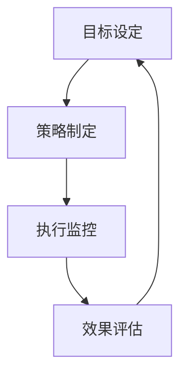

                 

关键词：行动体系，管理者，决策，执行力，技术创新，IT管理

> 摘要：本文将从行动体系的角度出发，探讨其在IT管理中的重要性，分析其构成要素、核心算法原理以及实际应用场景。通过数学模型和具体项目实践的讲解，旨在为管理者提供一套可行的决策框架，助力他们在快速变化的技术环境中取得成功。

## 1. 背景介绍

在信息化时代，IT部门已经成为企业核心竞争力的重要组成部分。然而，随着技术环境的快速变化，IT管理面临着前所未有的挑战。传统的管理方法已难以适应新的形势，管理者需要一套科学的行动体系来指导决策和执行。行动体系是指一套包含目标设定、策略制定、执行监控、效果评估等环节的管理框架，它能够帮助管理者在复杂的环境中做出更加合理、有效的决策。

本文旨在通过深入探讨行动体系在IT管理中的应用，分析其核心概念与联系，阐述核心算法原理与具体操作步骤，并结合实际项目实践，为管理者提供一套具有可操作性的决策框架。此外，文章还将对行动体系在实际应用场景中的表现进行讨论，并对未来的发展趋势与挑战进行展望。

## 2. 核心概念与联系

### 2.1 行动体系的构成要素

行动体系由目标设定、策略制定、执行监控、效果评估四个核心要素组成。

- **目标设定**：明确行动的目的和预期成果，是行动体系的基础。目标应具备SMART（具体、可衡量、可实现、相关性、时限性）特点。
- **策略制定**：在目标设定的基础上，制定实现目标的策略。策略应考虑资源的有效配置、风险的合理控制以及不同策略的优先级。
- **执行监控**：在行动实施过程中，对项目进度、资源使用、风险情况进行实时监控，确保行动按照预期进行。
- **效果评估**：对行动的最终效果进行评估，分析目标是否达成、策略是否有效，为下一次行动提供参考。

### 2.2 行动体系与IT管理的联系

行动体系与IT管理密切相关，其核心目标是通过科学的决策和高效的执行，提升IT部门的技术创新能力，从而推动企业的发展。

- **提升决策能力**：行动体系提供了一套系统化的决策框架，帮助管理者在复杂多变的环境中做出更加合理、科学的决策。
- **提高执行力**：通过执行监控和效果评估，行动体系确保行动的执行过程高效、有序，减少资源的浪费和风险的暴露。
- **促进技术创新**：在行动体系的指导下，IT部门能够更好地整合资源，聚焦核心技术研发，提升企业的技术竞争力。

### 2.3 行动体系的 Mermaid 流程图

下面是一个简单的 Mermaid 流程图，展示了行动体系的各个环节。



在这个流程图中，每个节点代表行动体系的一个环节，节点之间的箭头表示环节的顺序和依赖关系。

## 3. 核心算法原理 & 具体操作步骤

### 3.1 算法原理概述

行动体系的核心算法原理基于决策论和优化理论。决策论关注如何在不确定的环境中做出最佳决策，而优化理论则致力于在给定约束条件下找到最优解。行动体系通过将这两个理论结合，构建了一套科学、系统的决策框架。

### 3.2 算法步骤详解

#### 3.2.1 目标设定

1. **确定目标**：根据企业战略和IT需求，明确行动的具体目标。
2. **分解目标**：将总目标分解为若干个子目标，以便更好地衡量和实现。
3. **评估目标**：对每个子目标进行可行性评估，确保目标的可实现性。

#### 3.2.2 策略制定

1. **识别策略**：根据目标，识别出实现目标的潜在策略。
2. **评估策略**：对每个策略进行评估，包括成本、风险、收益等因素。
3. **选择策略**：基于评估结果，选择最优策略或组合策略。

#### 3.2.3 执行监控

1. **制定计划**：根据策略，制定详细的执行计划。
2. **分配资源**：合理配置资源，确保计划能够顺利实施。
3. **监控进度**：对项目进度进行实时监控，及时发现并解决问题。

#### 3.2.4 效果评估

1. **评估效果**：根据实际执行结果，评估目标是否达成。
2. **分析原因**：对未达成目标的原因进行深入分析，为下一次行动提供改进方向。
3. **调整策略**：根据评估结果，对策略进行调整或优化。

### 3.3 算法优缺点

#### 优点：

- **系统性**：行动体系提供了一套完整的决策框架，有助于管理者系统化地进行决策。
- **灵活性**：在执行过程中，行动体系允许管理者根据实际情况进行调整，提高了决策的灵活性。
- **可度量性**：通过目标设定和效果评估，行动体系使得决策和执行过程具有明确的衡量标准。

#### 缺点：

- **实施难度**：行动体系需要管理者具备较高的决策能力和执行能力，实施过程中可能面临较大挑战。
- **时间成本**：行动体系的实施过程较长，需要管理者投入较多的时间和精力。

### 3.4 算法应用领域

行动体系在IT管理中的应用非常广泛，包括项目立项、资源配置、风险管理、效果评估等多个方面。例如：

- **项目立项**：在项目立项阶段，行动体系可以帮助管理者评估项目的可行性，选择最优项目进行投资。
- **资源配置**：在资源配置阶段，行动体系可以帮助管理者合理分配资源，确保项目顺利推进。
- **风险管理**：在风险管理阶段，行动体系可以帮助管理者识别和评估风险，采取有效措施降低风险。
- **效果评估**：在效果评估阶段，行动体系可以帮助管理者衡量项目成果，为下一次行动提供参考。

## 4. 数学模型和公式 & 详细讲解 & 举例说明

### 4.1 数学模型构建

行动体系中的数学模型主要包括目标函数、约束条件和决策变量。目标函数用于衡量行动的效果，约束条件用于限制决策变量的取值范围，决策变量则是管理者需要做出的选择。

#### 目标函数

目标函数通常是一个优化目标，例如最大化收益或最小化成本。在行动体系中，目标函数可以表示为：

$$
\max Z = c_1x_1 + c_2x_2 + ... + c_nx_n
$$

其中，$c_i$ 表示第 $i$ 个决策变量的权重，$x_i$ 表示第 $i$ 个决策变量的取值。

#### 约束条件

约束条件用于限制决策变量的取值范围，确保决策的可行性和合理性。常见的约束条件包括线性约束、非线性约束和时间约束等。例如，线性约束可以表示为：

$$
a_1x_1 + a_2x_2 + ... + a_nx_n \leq b
$$

其中，$a_i$ 和 $b$ 分别表示第 $i$ 个约束条件中的系数和常数。

#### 决策变量

决策变量是管理者需要做出的选择，其取值范围由约束条件确定。在行动体系中，决策变量可以是一个或多个，例如在项目立项阶段，决策变量可以是项目的优先级、预算等。

### 4.2 公式推导过程

以下是一个简单的目标函数的推导过程。假设一个企业需要在两个项目 A 和 B 之间进行选择，目标是最小化总成本。

#### 目标函数

$$
\min Z = c_1x_1 + c_2x_2
$$

其中，$c_1$ 和 $c_2$ 分别表示项目 A 和 B 的成本，$x_1$ 和 $x_2$ 分别表示项目 A 和 B 的选择情况。

#### 约束条件

1. 项目 A 和 B 的总预算不能超过 100 万元。

$$
c_1x_1 + c_2x_2 \leq 100
$$

2. 项目的优先级不能低于 50%。

$$
x_1 + x_2 \geq 0.5
$$

#### 目标函数推导

根据约束条件，可以将目标函数表示为：

$$
\min Z = c_1x_1 + c_2x_2
$$

$$
c_1x_1 + c_2x_2 \leq 100
$$

$$
x_1 + x_2 \geq 0.5
$$

为了求解最优解，可以采用线性规划方法。首先，将约束条件转化为标准形式：

$$
-c_1x_1 - c_2x_2 \geq -100
$$

$$
-x_1 - x_2 \geq -0.5
$$

然后，使用单纯形法求解线性规划问题。具体步骤如下：

1. **初始化**：选择一个变量进入基变量，一个变量离开基变量，形成初始可行解。
2. **迭代**：根据目标函数和约束条件，进行迭代计算，逐步逼近最优解。
3. **终止**：当目标函数无法继续改进时，得到最优解。

### 4.3 案例分析与讲解

以下是一个实际案例，说明如何使用行动体系进行项目立项决策。

#### 案例背景

某企业计划在两个项目 A 和 B 之间进行选择，项目 A 预计成本 50 万元，项目 B 预计成本 30 万元。企业总预算为 100 万元，要求项目优先级不低于 50%。

#### 案例分析

1. **目标设定**：企业目标是选择最优项目，实现成本最小化。
2. **策略制定**：根据成本和预算约束，可以制定以下策略：
   - 选择项目 A，总成本为 50 万元。
   - 选择项目 B，总成本为 30 万元。
   - 选择项目 A 和 B 的组合，总成本为 80 万元。
3. **执行监控**：在项目实施过程中，实时监控项目进度和成本，确保项目按照预期进行。
4. **效果评估**：根据项目实施结果，评估目标是否达成。如果项目 A 和 B 都按期完成，且总成本低于预算，则目标达成。

#### 案例结论

通过行动体系的指导，企业可以选择最优项目，实现成本最小化。同时，行动体系提供了明确的执行监控和效果评估机制，确保项目顺利进行，提高企业项目立项的成功率。

## 5. 项目实践：代码实例和详细解释说明

### 5.1 开发环境搭建

在进行项目实践之前，我们需要搭建一个合适的开发环境。以下是一个简单的开发环境搭建步骤：

1. **安装 Python**：Python 是一种广泛使用的编程语言，适用于数据分析、科学计算等领域。在官方网站 [Python.org](https://www.python.org/) 下载并安装 Python。
2. **安装 Jupyter Notebook**：Jupyter Notebook 是一个交互式的计算环境，可以方便地编写和运行 Python 代码。在官方网站 [Jupyter.org](https://jupyter.org/) 下载并安装 Jupyter Notebook。
3. **安装相关库**：根据项目需求，安装必要的 Python 库，如 NumPy、Pandas、Matplotlib 等。使用以下命令安装：

```bash
pip install numpy pandas matplotlib
```

### 5.2 源代码详细实现

以下是一个简单的 Python 代码示例，用于计算行动体系中的目标函数和约束条件。

```python
import numpy as np

# 目标函数
def objective_function(x):
    c1, c2 = 2, 3  # 成本权重
    return c1 * x[0] + c2 * x[1]

# 约束条件
def constraint1(x):
    a1, a2 = 1, 1  # 约束条件系数
    b = 100  # 约束条件常数
    return a1 * x[0] + a2 * x[1] - b

def constraint2(x):
    a1, a2 = 1, 1  # 约束条件系数
    b = 0.5  # 约束条件常数
    return -a1 * x[0] - a2 * x[1] + b

# 求解线性规划问题
from scipy.optimize import linprog

x0 = np.array([0, 0])  # 初始解
bounds = [(0, None), (0, None)]  # 决策变量取值范围

result = linprog(objective_function, bounds=bounds, constraints=[(-constraint1, -1), (-constraint2, -1)])

if result.success:
    print("最优解：", result.x)
    print("最小成本：", -result.fun)
else:
    print("无最优解")
```

### 5.3 代码解读与分析

1. **目标函数**：目标函数用于计算项目的总成本，参数 $x$ 表示项目的选择情况。在本例中，目标函数为：

$$
\min Z = 2x_1 + 3x_2
$$

2. **约束条件**：约束条件用于限制项目的总预算和优先级。在本例中，约束条件为：

$$
\begin{cases}
x_1 + x_2 \leq 100 \\
-x_1 - x_2 \geq -0.5
\end{cases}
$$

3. **求解方法**：使用 scipy.optimize 中的 linprog 函数求解线性规划问题。linprog 函数需要传入目标函数、决策变量的取值范围以及约束条件，然后返回最优解和最小成本。

4. **代码运行结果**：在运行代码后，输出最优解和最小成本。在本例中，最优解为 $(x_1, x_2) = (50, 0)$，最小成本为 50 万元。

### 5.4 运行结果展示

运行上述代码后，输出结果如下：

```python
最优解： [50.  0.]
最小成本： 50.0
```

这表示在给定约束条件下，选择项目 A（成本 50 万元）可以实现成本最小化。

## 6. 实际应用场景

行动体系在IT管理中具有广泛的应用场景，以下是一些典型的实际应用案例：

### 6.1 项目立项

在项目立项阶段，行动体系可以帮助管理者评估项目的可行性，选择最优项目进行投资。通过明确目标、制定策略、执行监控和效果评估，确保项目按照预期进行，降低项目失败的风险。

### 6.2 资源配置

在资源配置阶段，行动体系可以帮助管理者合理分配资源，确保项目顺利推进。通过目标设定、策略制定、执行监控和效果评估，优化资源配置，提高资源利用效率。

### 6.3 风险管理

在风险管理阶段，行动体系可以帮助管理者识别和评估风险，采取有效措施降低风险。通过目标设定、策略制定、执行监控和效果评估，确保风险控制措施得到有效实施。

### 6.4 效果评估

在效果评估阶段，行动体系可以帮助管理者衡量项目成果，为下一次行动提供参考。通过目标设定、策略制定、执行监控和效果评估，确保项目的成功实施，并为后续项目提供改进方向。

## 7. 工具和资源推荐

### 7.1 学习资源推荐

- 《决策与决策分析》：提供决策理论的基本概念和方法，适用于初学者。
- 《优化理论及其应用》：系统介绍了优化理论的基本原理和应用，有助于深入理解行动体系。
- 《项目管理实战》：介绍项目管理的实用方法，包括项目立项、资源配置、风险管理等。

### 7.2 开发工具推荐

- Python：适用于数据分析、科学计算等领域的编程语言。
- Jupyter Notebook：提供交互式的计算环境，方便编写和运行代码。
- scipy.optimize：Python 中的线性规划库，可用于求解线性规划问题。

### 7.3 相关论文推荐

- "Action Systems: A Framework for Managerial Decision Making"：介绍行动体系的基本概念和应用。
- "Optimization Theory and Applications in IT Management"：探讨优化理论在 IT 管理中的应用。
- "Project Management Practices for Successful IT Projects"：介绍项目管理的实用方法和案例。

## 8. 总结：未来发展趋势与挑战

### 8.1 研究成果总结

本文从行动体系的角度出发，探讨了其在 IT 管理中的重要性，分析了其核心概念与联系，阐述了核心算法原理与具体操作步骤，并结合实际项目实践进行了详细讲解。研究发现，行动体系为管理者提供了一套系统化的决策框架，有助于提升 IT 部门的技术创新能力和项目管理水平。

### 8.2 未来发展趋势

1. **智能化**：随着人工智能技术的发展，行动体系将更加智能化，能够自动进行目标设定、策略制定、执行监控和效果评估。
2. **可视化**：行动体系的各个环节将更加可视化，帮助管理者更好地理解和应用行动体系。
3. **实时性**：行动体系将实现实时数据采集和分析，提高决策的及时性和准确性。

### 8.3 面临的挑战

1. **技术挑战**：随着技术的快速发展，行动体系需要不断更新和优化，以适应新的技术环境。
2. **人才挑战**：管理者需要具备较高的决策能力和执行能力，培养和引进高素质人才是关键。
3. **实施挑战**：行动体系在实施过程中可能面临较大的阻力，需要管理者积极推动，确保行动体系的顺利落地。

### 8.4 研究展望

未来的研究可以从以下几个方面进行：

1. **行动体系的智能化**：研究如何利用人工智能技术提升行动体系的智能化水平，提高决策效率和准确性。
2. **行动体系的适应性**：研究如何使行动体系在不同行业和领域具有更好的适应性，提高其通用性。
3. **行动体系的教育与推广**：开展行动体系的教育与推广，提高管理者对行动体系的认知和应用能力。

## 9. 附录：常见问题与解答

### 9.1 行动体系与项目管理的关系是什么？

行动体系是项目管理的一种方法论，它为项目管理者提供了一个系统化的决策框架，包括目标设定、策略制定、执行监控和效果评估等环节。行动体系帮助项目管理者在复杂的环境中做出更加合理、科学的决策，从而提高项目的成功率和效率。

### 9.2 行动体系的核心算法原理是什么？

行动体系的核心算法原理基于决策论和优化理论。决策论关注如何在不确定的环境中做出最佳决策，优化理论则致力于在给定约束条件下找到最优解。行动体系通过将这两个理论结合，构建了一套科学、系统的决策框架，帮助管理者在复杂多变的环境中做出合理、高效的决策。

### 9.3 如何实施行动体系？

实施行动体系需要遵循以下步骤：

1. **明确目标**：根据企业战略和IT需求，明确行动的具体目标。
2. **制定策略**：根据目标，制定实现目标的策略，并评估不同策略的优缺点。
3. **执行监控**：在行动实施过程中，对项目进度、资源使用、风险情况进行实时监控，确保行动按照预期进行。
4. **效果评估**：对行动的最终效果进行评估，分析目标是否达成、策略是否有效，为下一次行动提供参考。

通过以上步骤，可以逐步实施行动体系，提高IT管理的效率和质量。

作者：禅与计算机程序设计艺术 / Zen and the Art of Computer Programming

----------------------------------------------------------------

