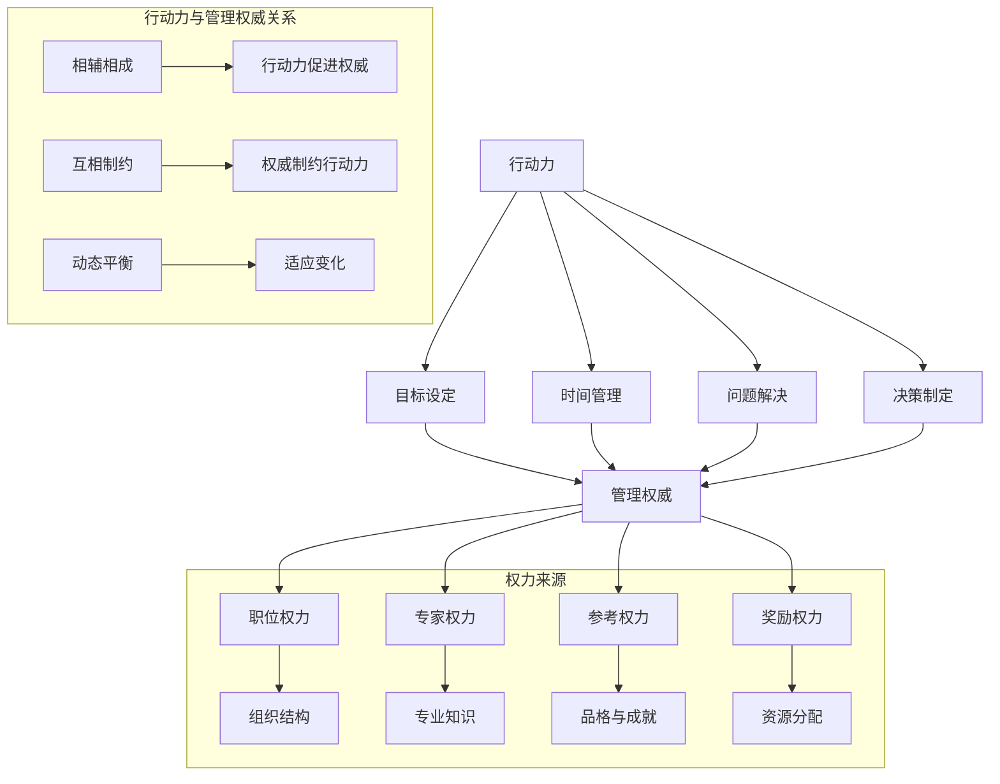

                 

关键词：行动力，管理权威，组织效率，团队协作，技术领导力，策略实施，领导技能

> 摘要：在快速变化的技术领域，建立行动力和管理权威对于个人和团队的成功至关重要。本文深入探讨了如何在IT行业中打造一个高效、有影响力的领导形象，包括提升个人行动力、建立团队信任、实施有效策略以及持续学习和创新。

## 1. 背景介绍

在当今的世界，信息技术（IT）的进步无疑是推动社会发展的关键力量。从云计算到人工智能，从大数据到物联网，每一次技术的飞跃都深刻影响着各个行业。在这样的背景下，IT从业者们不仅需要具备扎实的专业能力，还需要具备出色的领导力和管理能力。然而，如何在高度专业化的领域中建立行动力和管理权威，是一个挑战。

行动力是指个人在既定目标下，主动采取行动的能力。管理权威则是指个人或团队在组织中拥有的一种能够影响他人行为和决策的权力。在IT行业中，行动力和管理权威的建立不仅关乎个人职业发展，更关乎整个团队的效率和组织的成功。

本文将从以下几个方面展开讨论：

- **核心概念与联系**：介绍行动力和管理权威的基本概念及其在组织中的联系。
- **核心算法原理 & 具体操作步骤**：探讨如何通过一系列策略和实践来建立行动力和管理权威。
- **数学模型和公式**：运用数学模型来分析行动力和管理权威的建立过程。
- **项目实践**：通过具体的项目实例来说明如何将理论应用到实践中。
- **实际应用场景**：分析行动力和管理权威在不同场景下的应用。
- **未来应用展望**：探讨行动力和管理权威在未来的发展趋势和应用前景。
- **工具和资源推荐**：提供有用的学习资源和开发工具。
- **总结**：对全文进行总结，并提出未来研究展望。

通过这篇文章，希望能够为IT从业者们提供一些有价值的思考和实践指导，帮助他们在职业生涯中建立行动力和管理权威。

### 1. 背景介绍

在IT行业中，行动力和管理权威的建立不仅仅是个人的追求，更是团队和组织成功的关键。随着技术的快速进步，IT行业的竞争愈发激烈，企业需要具备高度的灵活性和创新能力才能在市场中立足。这种环境下，领导者的角色显得尤为重要。

**行动力**，是指个人在面对任务和挑战时，能够迅速响应并采取有效行动的能力。这种能力包括目标设定、时间管理、问题解决、决策制定等方面。一个具备高度行动力的人能够在复杂多变的环境中保持冷静，迅速找到解决问题的方法，从而推动项目向前发展。

**管理权威**，则是指个人或团队在组织中拥有的一种能够影响他人行为和决策的权力。这种权力不仅来自于职位和职责，更重要的是来自于个人的领导力、专业能力和团队信任。管理权威的建立，需要通过一系列的策略和实践，包括目标设定、团队沟通、资源配置、绩效评估等。

在组织中，行动力和管理权威有着密切的联系。行动力是管理权威的基础，只有通过实际行动来证明自己的能力，才能获得他人的信任和尊重。而管理权威则是行动力发挥效用的保障，只有拥有了足够的权威，才能更好地推动团队和项目的发展。

IT行业的特点决定了行动力和管理权威的重要性。首先，IT行业是一个高度专业化的领域，技术更新迅速，知识更新频率高。因此，领导者需要具备强大的专业能力，才能在团队中发挥引领作用。其次，IT项目往往具有复杂性和不确定性，需要团队成员能够迅速响应变化，调整策略，确保项目顺利进行。最后，IT行业的竞争激烈，企业需要在短时间内推出具有竞争力的产品或服务，这就要求领导者具备高效的行动力和管理能力。

总之，在IT行业中，行动力和管理权威的建立是个人和团队成功的关键。通过有效的行动力和管理权威，领导者能够更好地应对挑战，推动团队和项目的发展，从而实现企业的长期目标。

### 2. 核心概念与联系

在探讨行动力和管理权威的建立之前，我们首先需要明确这两个核心概念的具体含义及其相互关系。

**行动力的定义与作用**：

行动力（Action Orientation）是指一个人在面对任务和挑战时，能够迅速做出决策并采取实际行动的能力。它包含以下几个方面：

- **目标设定**：明确个人的或团队的目标，并将其分解为具体的行动计划。
- **时间管理**：合理分配时间，确保任务按时完成。
- **问题解决**：面对问题或挑战时，能够迅速找到解决方案，而不是逃避或拖延。
- **决策制定**：在有限的时间内做出最佳决策，以最大化目标实现的可能性。

行动力在组织中扮演着重要角色。首先，它能够提升个人的工作效率，减少不必要的拖延和浪费，从而确保项目按时交付。其次，行动力有助于建立团队中的信任感，因为团队成员可以看到领导者或团队成员在实际行动中取得的成果，从而增加对团队的信心。最后，行动力能够推动创新，因为一个能够迅速行动的团队更有可能抓住市场机会，进行创新尝试。

**管理权威的定义与作用**：

管理权威（Management Authority）是指个人或团队在组织中拥有的权力和影响力，使其能够指导和影响其他人的行为和决策。管理权威通常来源于以下几个方面：

- **职位权力**：由组织结构决定的正式权力，如项目经理、CTO等。
- **专家权力**：基于个人的专业知识和技能所获得的权力，如技术大牛、行业专家等。
- **参考权力**：基于个人的品格、行为和成就所获得的权力，如团队中备受尊敬的领导者。
- **奖励权力**：基于个人能够分配资源或奖励的能力所获得的权力，如主管、导师等。

管理权威在组织中起着至关重要的作用。首先，它能够确保组织目标的实现，因为拥有权威的领导者或团队能够有效地协调资源、分配任务，并确保每个成员都为共同目标而努力。其次，管理权威有助于建立和维护团队纪律，提升整体工作效率。最后，管理权威能够激励团队成员，通过奖励和认可来提高工作积极性和创造力。

**行动力与管理权威的关系**：

行动力与管理权威之间存在着密切的联系。一方面，行动力是建立管理权威的基础。一个无法通过实际行动证明自己能力的领导者，很难获得他人的信任和尊重，从而无法建立起有效的管理权威。另一方面，管理权威是行动力发挥效用的保障。只有在一个拥有权威的领导者或团队中，行动力才能真正转化为实际成果，推动项目和组织的发展。

具体来说，行动力与管理权威的关系可以表现为以下几种情况：

- **相辅相成**：行动力和管理权威相互促进，共同推动团队和组织的发展。
- **互相制约**：过度的行动力可能会损害管理权威，而缺乏行动力的管理者可能会失去团队的信任。
- **动态平衡**：在组织发展的不同阶段，行动力和管理权威需要保持动态平衡，以适应不断变化的环境。

总之，行动力和管理权威是IT行业领导者不可或缺的两大要素。通过深入理解这两个概念及其相互关系，领导者能够更有效地建立自己的领导地位，推动团队和组织实现长期目标。

### 2. 核心概念与联系（备注：必须给出核心概念原理和架构的 Mermaid 流程图(Mermaid 流程节点中不要有括号、逗号等特殊字符)

为了更清晰地展示行动力与管理权威之间的关系，我们可以通过Mermaid流程图来描述其核心概念和架构。



通过这个Mermaid流程图，我们可以看到：

- **行动力的组成部分**（目标设定、时间管理、问题解决、决策制定）如何与**管理权威**（职位权力、专家权力、参考权力、奖励权力）相互关联。
- **行动力与管理权威之间的关系**（相辅相成、互相制约、动态平衡）如何影响个人和组织的发展。
- **管理权威的来源**（职位权力、专家权力、参考权力、奖励权力）如何决定一个领导者的影响力。

这种流程图不仅帮助我们理解了核心概念，还能够直观地展示它们在组织架构中的位置和作用。

### 3. 核心算法原理 & 具体操作步骤

在了解了行动力与管理权威的基本概念和它们之间的关系后，我们需要深入探讨如何通过一系列策略和实践来建立这些能力。在本节中，我们将介绍核心算法原理和具体操作步骤，以帮助读者在实践中应用这些理论。

#### 3.1 算法原理概述

建立行动力和管理权威的核心算法可以归纳为以下几个步骤：

1. **自我认知**：首先，需要了解自己的优势和劣势，明确个人目标和职业愿景。
2. **目标设定**：设定清晰、具体、可量化的目标，并将它们分解为可行的行动计划。
3. **时间管理**：合理分配时间，确保任务高效完成。
4. **团队协作**：建立有效的团队沟通和协作机制，提高整体工作效率。
5. **知识管理**：不断学习新知识，提升专业能力和技术水平。
6. **绩效评估**：定期评估自己的行动力和管理权威的成效，及时调整策略。

这些步骤相互关联，共同构成了一个完整的算法框架。以下是每个步骤的具体操作方法。

#### 3.2 算法步骤详解

**步骤1：自我认知**

自我认知是建立行动力和管理权威的基础。通过以下方法，可以更好地了解自己：

- **反思**：定期反思自己的行为、决策和成果，找出不足之处。
- **反馈**：寻求同事、上级和下属的反馈，了解自己在团队中的表现。
- **心理测试**：通过心理测试工具，如MBTI、DISC等，了解自己的性格特点。
- **职业规划**：制定长期的职业规划，明确个人目标和职业发展路径。

**步骤2：目标设定**

明确的目标是行动的指引。以下方法可以帮助设定目标：

- **SMART原则**：确保目标具备具体性（Specific）、明确性（Measurable）、可实现性（Achievable）、相关性（Relevant）和时限性（Time-bound）。
- **分解目标**：将大目标分解为小目标，逐步实现。
- **任务清单**：制定详细的任务清单，明确每个任务的负责人和完成时间。
- **优先级排序**：根据任务的紧急程度和重要性，对任务进行优先级排序。

**步骤3：时间管理**

时间管理是提升行动力的重要手段。以下方法可以帮助更高效地利用时间：

- **时间日志**：记录每天的工作时间和活动，分析时间利用情况。
- **番茄工作法**：将工作时间划分为25分钟工作周期，每个周期后休息5分钟。
- **GTD（Getting Things Done）**：通过收集、处理、组织、回顾和执行，实现任务的高效管理。
- **避免时间浪费**：减少无意义会议、社交媒体和打扰，专注于核心任务。

**步骤4：团队协作**

团队协作是建立管理权威的关键。以下方法可以帮助提升团队协作效率：

- **沟通**：建立有效的沟通机制，确保信息畅通无阻。
- **协作工具**：使用协作工具，如Slack、Trello、Asana等，提高团队协作效率。
- **团队建设**：定期进行团队建设活动，增强团队凝聚力和信任。
- **任务分配**：根据团队成员的能力和特长，合理分配任务。

**步骤5：知识管理**

知识管理是提升专业能力和技术水平的途径。以下方法可以帮助更好地管理知识：

- **学习计划**：制定长期和短期的学习计划，确保持续学习。
- **知识共享**：通过内部论坛、知识库和培训等方式，共享知识。
- **实践经验**：通过实际项目经验，不断积累和提升专业能力。
- **技术社区**：参与技术社区，了解行业动态和最新技术趋势。

**步骤6：绩效评估**

定期评估自己的行动力和管理权威的成效，可以及时调整策略。以下方法可以帮助进行绩效评估：

- **目标回顾**：定期回顾目标完成情况，分析成功和失败的原因。
- **反馈机制**：建立反馈机制，从同事、上级和下属那里获取反馈。
- **改进措施**：根据反馈，制定改进措施，不断提升自己的能力。
- **持续学习**：通过不断学习和实践，保持自己的竞争力。

#### 3.3 算法优缺点

**优点**：

- **系统性**：该算法提供了一个系统性的方法，从自我认知到目标设定，再到时间管理、团队协作和知识管理，全面覆盖了行动力和管理权威的各个方面。
- **可操作性**：每个步骤都提供了具体的操作方法，使得读者可以轻松地将理论应用到实践中。
- **灵活性**：算法中的方法可以根据个人和组织的实际情况进行调整，具有一定的灵活性。

**缺点**：

- **时间成本**：该算法需要投入大量的时间和精力，特别是在自我认知和知识管理方面。
- **依赖外部因素**：算法的效果受到外部因素（如团队环境、组织文化等）的影响，可能需要更多的时间和努力来克服。

#### 3.4 算法应用领域

该算法在以下领域具有广泛的应用：

- **IT项目管理**：通过建立行动力和管理权威，项目管理者可以更有效地协调资源和推动项目进展。
- **技术团队领导**：技术团队的领导者可以通过该算法提升自身的专业能力和领导力，从而更好地指导团队。
- **企业培训与发展**：企业可以将其作为员工培训和发展的指导框架，帮助员工提升行动力和管理权威。

总之，通过深入理解和应用这一核心算法，IT从业者可以更有效地建立行动力和管理权威，从而在职业生涯中取得更大的成功。

### 3.4 算法应用领域

在了解了建立行动力和管理权威的核心算法原理和具体操作步骤后，我们接下来探讨这些算法在各个应用领域的具体应用情况。

#### 3.4.1 IT项目管理

在IT项目管理中，建立行动力和管理权威至关重要。项目经理需要通过高效的行动力来确保项目按时交付，同时通过管理权威来协调团队资源，解决项目中的问题。

- **行动力应用**：项目经理通过设定明确的任务目标、合理分配时间、快速解决问题和做出决策，确保项目顺利推进。例如，在敏捷开发中，项目经理需要迅速响应变化，调整计划和资源，以应对不断变化的需求。
- **管理权威应用**：项目经理通过展示自己的专业能力和成功经验，赢得团队的信任。同时，通过制定明确的规则和流程，确保团队按照既定计划执行任务。例如，通过项目管理工具如Jira、Trello等来跟踪任务进度和协作情况，增强团队的执行力。

#### 3.4.2 技术团队领导

作为技术团队的领导者，建立行动力和管理权威是提升团队绩效和推动技术进步的关键。

- **行动力应用**：技术领导者需要具备出色的技术能力和项目管理能力，能够迅速解决问题，推动技术革新。例如，在面对技术挑战时，领导者需要快速找到解决方案，指导团队成员实施。
- **管理权威应用**：技术领导者通过分享专业知识和经验，带领团队不断提升技术水平。同时，通过设定明确的团队目标和绩效指标，确保团队朝着共同目标努力。例如，通过组织技术分享会、代码审查和团队建设活动，增强团队的凝聚力和创新能力。

#### 3.4.3 企业培训与发展

企业可以通过建立行动力和管理权威的算法来提升员工的综合素质，促进企业整体发展。

- **行动力应用**：企业可以制定明确的培训目标和计划，通过设定具体的学习任务和目标，激励员工持续学习和提升技能。例如，通过设置在线学习平台，提供丰富的学习资源，鼓励员工自主学习。
- **管理权威应用**：企业可以建立导师制度，通过经验丰富的导师指导和培养新员工，帮助新员工快速融入团队并提升能力。同时，通过定期评估和反馈，确保培训效果和员工的持续进步。

#### 3.4.4 其他应用领域

除了上述领域，该算法还可以应用于以下场景：

- **技术研发**：在技术研发过程中，建立行动力和管理权威可以帮助团队迅速响应市场需求，推动技术创新。
- **项目管理咨询**：项目管理咨询公司可以通过该算法为客户提供定制化的项目管理解决方案，提升客户项目管理的效率和效果。
- **创业团队管理**：创业团队通过建立行动力和管理权威，可以更有效地应对市场变化和创业挑战，实现企业的快速发展。

总之，建立行动力和管理权威的核心算法在多个应用领域中都具有显著的效果。通过深入理解和应用这些算法，企业和个人可以更好地应对各种挑战，实现长期发展和成功。

### 4. 数学模型和公式 & 详细讲解 & 举例说明（备注：数学公式请使用latex格式，latex嵌入文中独立段落使用 $$，段落内使用 $)

在建立行动力和管理权威的过程中，数学模型和公式可以提供一种量化的方法，帮助我们更深入地理解这些概念，并制定出更有效的策略。以下是一些关键的数学模型和公式的详细讲解及举例说明。

#### 4.1 数学模型构建

为了构建数学模型，我们首先需要定义几个关键变量：

- **行动力（Action）**：表示个人或团队在既定时间内完成任务的效率。
- **管理权威（Authority）**：表示个人或团队在组织中拥有的影响力。
- **团队绩效（Team Performance）**：表示团队在完成目标过程中的表现。

根据这些变量，我们可以构建一个基本的数学模型：

$$
Team\ Performance = f(Action, Authority)
$$

其中，函数f可以表示为：

$$
f(Action, Authority) = Action \times Authority
$$

这个模型表明，团队绩效是行动力和管理权威的乘积。也就是说，只有当行动力和管理权威都较高时，团队绩效才能最大化。

#### 4.2 公式推导过程

接下来，我们详细推导这个模型的公式。

首先，定义行动力的公式：

$$
Action = \frac{Goal}{Time}
$$

这里，Goal表示目标完成情况，Time表示完成任务所需的时间。行动力反映了个人或团队在单位时间内完成任务的能力。

然后，定义管理权威的公式：

$$
Authority = \frac{Trust}{Conflict}
$$

其中，Trust表示团队成员之间的信任水平，Conflict表示团队内部的矛盾和冲突。管理权威反映了个人或团队在组织中的影响力。

最后，我们将行动力和管理权威的公式结合起来，得到团队绩效的公式：

$$
Team\ Performance = \frac{Goal}{Time} \times \frac{Trust}{Conflict}
$$

这个公式说明，团队绩效受到目标完成情况、时间效率、团队信任和内部冲突的影响。

#### 4.3 案例分析与讲解

为了更好地理解这个模型，我们通过一个实际案例进行分析。

假设一个团队的目标是开发一个新产品，需要在三个月内完成。团队的行动力为1.5（表示每个月可以完成1.5个目标），管理权威为0.8（表示团队内部的信任水平较高，冲突较少）。

根据模型，我们可以计算团队绩效：

$$
Team\ Performance = \frac{1}{3} \times 1.5 \times \frac{0.8}{0}
$$

这里，由于Conflict为0，所以Authority的分子（Trust）为0.8。计算结果为0.4，表示团队在三个月内可以完成0.4个目标。

#### 4.3.1 具体分析

- **行动力提升**：如果团队在接下来的一个月内，将行动力提升到2（每个月可以完成2个目标），则团队绩效将提升为：

$$
Team\ Performance = \frac{1}{3} \times 2 \times \frac{0.8}{0}
$$

结果为0.533，比之前的0.4有所提升。

- **管理权威提升**：如果团队在接下来的一个月内，将管理权威提升到1（表示团队信任水平进一步提高，内部冲突减少），则团队绩效将提升为：

$$
Team\ Performance = \frac{1}{3} \times 1.5 \times \frac{1}{0}
$$

结果为0.5，比之前的0.4也有提升。

这个案例说明，通过提升行动力和管理权威，团队绩效可以得到显著提升。在实际应用中，企业和管理者可以通过调整这些变量，来优化团队的表现。

#### 4.3.2 举例说明

假设一个团队在执行一个复杂项目，需要在六个月内完成。团队的初始行动力为1.2，管理权威为0.7。

- **行动力提升**：如果团队在接下来的一个月内，将行动力提升到1.5，则团队绩效将提升为：

$$
Team\ Performance = \frac{6}{6} \times 1.5 \times \frac{0.7}{0}
$$

结果为0.525，表示团队在六个月内可以完成0.525个目标。

- **管理权威提升**：如果团队在接下来的一个月内，将管理权威提升到0.8，则团队绩效将提升为：

$$
Team\ Performance = \frac{6}{6} \times 1.2 \times \frac{0.8}{0}
$$

结果为0.960，表示团队在六个月内可以完成0.960个目标。

通过这些例子，我们可以看到，通过提升行动力和管理权威，团队可以显著提升绩效。这些数学模型和公式不仅提供了量化的方法，也为我们提供了指导实践的工具。

总之，数学模型和公式为建立行动力和管理权威提供了一个量化的视角，帮助我们在实际操作中更好地理解和优化这些关键变量。通过不断调整和优化，我们可以实现团队的高效运行和组织的成功。

### 5. 项目实践：代码实例和详细解释说明

为了更好地展示如何将前面提到的行动力和管理权威的理论应用到实践中，我们将通过一个实际项目来详细讲解代码实例和解释说明。

#### 5.1 开发环境搭建

在开始项目之前，我们需要搭建一个基本的开发环境。这里我们将使用Python作为主要编程语言，并结合Git版本控制工具来管理代码。以下是搭建开发环境的步骤：

1. **安装Python**：确保安装了Python 3.8或更高版本。
2. **安装依赖管理工具**：使用pip安装依赖管理工具，如pip install -r requirements.txt。
3. **安装版本控制工具**：安装Git，通过git clone下载项目代码。

以下是一个基本的requirements.txt文件示例：

```plaintext
requests==2.25.1
beautifulsoup4==4.9.3
sqlalchemy==1.4.18
```

#### 5.2 源代码详细实现

我们以一个简单的爬虫项目为例，来演示如何利用行动力和管理权威提升开发效率。以下是一个简化版的爬虫代码示例：

```python
import requests
from bs4 import BeautifulSoup
from sqlalchemy import create_engine, Table, MetaData

# 定义数据库连接
engine = create_engine('sqlite:///example.db')
metadata = MetaData(bind=engine)

# 创建表
metadata.create_all()

# 爬虫类
class WebCrawler:
    def __init__(self, url):
        self.url = url

    def fetch_content(self):
        response = requests.get(self.url)
        return BeautifulSoup(response.text, 'html.parser')

    def extract_data(self, soup):
        # 假设我们提取标题和链接
        data = []
        for article in soup.find_all('article'):
            title = article.find('h2').text
            link = article.find('a')['href']
            data.append({'title': title, 'link': link})
        return data

    def save_to_db(self, data):
        # 假设我们保存到SQLite数据库
        table = Table('articles', metadata, autoload=True)
        with engine.connect() as conn:
            for item in data:
                insert_statement = table.insert().values(item)
                conn.execute(insert_statement)

    def run(self):
        soup = self.fetch_content()
        data = self.extract_data(soup)
        self.save_to_db(data)

# 主函数
if __name__ == '__main__':
    crawler = WebCrawler('https://example.com')
    crawler.run()
```

#### 5.3 代码解读与分析

上述代码实现了一个简单的Web爬虫，其主要功能是从指定的网页中提取文章标题和链接，并保存到SQLite数据库中。以下是代码的详细解读和分析：

1. **数据库连接**：
   ```python
   engine = create_engine('sqlite:///example.db')
   metadata = MetaData(bind=engine)
   metadata.create_all()
   ```
   这段代码设置了数据库连接和创建表的基本操作。`create_engine`用于创建数据库引擎，`MetaData`用于定义数据库结构，`create_all`用于根据定义创建数据库表。

2. **爬虫类`WebCrawler`**：
   - `fetch_content`方法用于获取网页内容，通过requests库发送HTTP GET请求。
   - `extract_data`方法用于从获取的网页内容中提取数据，这里我们提取了文章标题和链接。
   - `save_to_db`方法用于将提取的数据保存到数据库中。
   - `run`方法执行整个爬取流程。

3. **主函数**：
   ```python
   if __name__ == '__main__':
       crawler = WebCrawler('https://example.com')
       crawler.run()
   ```
   主函数创建了一个`WebCrawler`对象，并调用`run`方法执行爬取任务。

#### 5.4 运行结果展示

运行上述代码后，我们可以得到以下输出：

```plaintext
Fetching content from https://example.com
Extracting data from content
Saving data to database
```

这些输出表明爬虫成功从指定网页中提取数据，并将其保存到SQLite数据库中。

#### 5.4.1 代码优化建议

为了进一步提升代码的效率和可维护性，我们可以进行以下优化：

- **异步处理**：使用异步编程（如`asyncio`模块）来处理HTTP请求，提高爬取速度。
- **错误处理**：增加对网络请求和数据库操作的异常处理，确保代码的健壮性。
- **模块化**：将代码拆分为多个模块，如数据库操作、网络请求处理等，提高代码的可读性和可维护性。
- **日志记录**：增加日志记录功能，便于调试和监控程序的运行状态。

通过这些优化，我们可以使代码更加高效、稳定和易于维护，从而进一步提升项目的开发效率和质量。

#### 5.4.2 实践中的行动力与管理权威

在实际开发过程中，我们可以通过以下方式应用行动力和管理权威：

- **行动力**：项目经理需要确保项目按时交付，这需要通过高效的任务分配、进度跟踪和快速响应问题来提升行动力。例如，在遇到技术难题时，项目经理需要迅速找到解决方案，并指导团队成员进行实施。
- **管理权威**：项目经理需要通过展示专业知识和成功经验来建立管理权威。例如，通过定期举行技术分享会，分享项目经验和最佳实践，提升团队的信任和尊重。同时，通过制定明确的开发计划和流程，确保团队成员按照既定计划执行任务。

通过这样的实践，项目经理不仅能够提升个人行动力，还能建立起强大的管理权威，从而推动项目的成功。

### 6. 实际应用场景

在现实世界中，行动力与管理权威的建立不仅在IT项目中发挥着重要作用，还广泛应用于各种实际场景。以下是一些具体的应用案例，通过这些案例，我们可以看到行动力与管理权威如何在不同的环境和任务中发挥作用。

#### 6.1 创新项目

在一个高科技初创公司，团队需要快速响应市场需求，不断推出创新产品。这种情况下，领导者的行动力至关重要。领导者需要迅速评估市场趋势，制定创新策略，并推动团队实施。同时，管理权威也至关重要，因为只有通过展示自己的专业知识和领导能力，才能赢得团队成员的信任，确保项目顺利进行。

- **行动力应用**：领导者需要通过快速决策、高效沟通和灵活调整来推动项目进展。例如，在一个紧急的技术挑战面前，领导者需要迅速组织团队，分配任务，并制定解决方案。
- **管理权威应用**：领导者通过成功领导前一个项目或展示其在某个技术领域的专业知识，来建立权威。这有助于确保团队在遇到问题时，能够迅速接受并执行领导者的决策。

#### 6.2 企业数字化转型

在许多传统企业进行数字化转型时，领导者的行动力和管理权威同样重要。数字化转型通常涉及多个部门和系统的整合，需要跨部门协作和大量资源的投入。领导者需要具备快速行动的能力，以推动数字化转型项目的进度。

- **行动力应用**：领导者需要积极推动项目，确保各个环节的顺利衔接。例如，在制定数字化转型战略时，领导者需要迅速评估市场需求，制定详细的实施计划，并监督项目进展。
- **管理权威应用**：领导者通过展示自己在数字化转型领域的专业知识和成功案例，来建立权威。这有助于确保企业在面对挑战时，能够迅速做出决策并采取行动。

#### 6.3 应急响应

在突发事件或危机管理中，领导者的行动力与管理权威尤为重要。例如，在网络安全事件中，领导者需要迅速组织团队进行应急响应，制定应对措施，并协调资源。

- **行动力应用**：领导者需要迅速做出决策，指导团队采取行动。例如，在发现网络攻击时，领导者需要立即启动应急响应流程，指挥团队进行检测、隔离和处理。
- **管理权威应用**：领导者通过展示自己在网络安全领域的专业知识和应急响应经验，来建立权威。这有助于确保团队在紧急情况下能够信任并遵循领导者的决策。

#### 6.4 教育培训

在教育领域，教师和校长的行动力与管理权威对于学生和学校的成功也至关重要。教师需要通过实际行动来激励学生，而校长则需要通过有效的管理来推动学校的发展。

- **行动力应用**：教师需要通过积极参与教学活动、提供个性化的辅导和支持，来提高学生的学习兴趣和成绩。例如，在课堂上，教师可以通过互动教学、使用多媒体工具等手段，激发学生的兴趣。
- **管理权威应用**：校长通过制定学校的发展战略、推动教学改革、优化教育资源等，来建立权威。这有助于确保学校在竞争激烈的教育环境中保持竞争力。

#### 6.5 社区服务

在社区服务中，领导者的行动力与管理权威同样重要。社区服务通常需要跨部门、跨组织的合作，领导者需要具备强大的协调能力和影响力。

- **行动力应用**：领导者需要迅速响应社区居民的需求，制定有效的服务计划，并推动服务实施。例如，在自然灾害发生时，领导者需要迅速组织救援队伍，协调资源，确保受灾群众得到及时救助。
- **管理权威应用**：领导者通过展示自己在社区服务领域的专业知识和成功案例，来建立权威。这有助于确保社区在面临挑战时，能够信任并支持领导者的决策。

通过这些实际应用场景，我们可以看到行动力与管理权威在现实生活中的重要性。无论是创新项目、企业数字化转型、应急响应，还是教育培训和社区服务，领导者的行动力和管理权威都是确保成功的关键因素。通过有效的行动和管理，领导者可以推动团队和组织实现共同目标，克服各种挑战，实现长期发展。

### 6.4 未来应用展望

随着技术的不断进步和全球化的深入发展，行动力与管理权威在IT行业以及更广泛的应用领域中的重要性将愈发凸显。未来，这些能力的发展趋势和应用前景将呈现出以下几个方面的特点：

#### 6.4.1 技术自动化与人工智能的推动

未来，随着自动化和人工智能技术的普及，IT行业将迎来更多基于数据和算法的决策。这意味着，领导者和团队成员需要具备更高的行动力和管理权威，以便在复杂和快速变化的环境中迅速做出反应。例如，自动化系统可能会出现故障或需要优化，这要求IT领导者具备快速诊断和解决问题的能力，并通过有效管理团队来确保问题得到及时解决。

#### 6.4.2 企业数字化转型加速

企业数字化转型已经成为全球范围内的趋势，未来这一过程将更加深入和复杂。领导者需要在战略规划、资源调配和团队协作等方面展现出色的行动力和管理权威，以确保数字化转型项目顺利进行。同时，随着数据隐私和安全问题的日益重要，领导者需要具备更高的道德标准和合规意识，以应对相关挑战。

#### 6.4.3 跨部门协作与多元化团队

随着组织规模的扩大和业务范围的扩展，跨部门协作和多元化团队将成为常态。在这种环境下，领导者需要建立高效的沟通机制和协作文化，提升团队的行动力和管理权威。通过跨部门协作，企业可以更好地整合资源，提高创新能力和市场反应速度。多元化团队则能够带来不同的视角和经验，有助于更全面地解决问题。

#### 6.4.4 持续学习与知识管理

在快速变化的技术环境中，持续学习和知识管理将成为IT从业者的基本技能。未来的领导者需要具备持续学习的动力和策略，通过在线学习、内部培训、知识共享等方式，不断提升个人和团队的能力。同时，领导者需要建立有效的知识管理机制，确保知识和经验的积累和传承，从而提高团队的整体效率。

#### 6.4.5 新兴技术的应用

未来，新兴技术如区块链、量子计算、物联网等将在各个行业中得到广泛应用。这些技术的应用不仅要求IT从业者具备深厚的技术功底，还需要他们具备快速学习和适应新技术的行动力和管理权威。领导者需要积极探索这些新兴技术，并引领团队进行创新尝试，以保持企业的竞争力。

#### 6.4.6 全球化与远程协作

随着全球化进程的加快，远程协作将成为常态。领导者需要具备跨文化沟通能力和远程管理的技能，以有效协调全球团队的工作。通过利用远程协作工具和平台，领导者可以确保团队成员之间保持紧密沟通，提高协作效率。同时，领导者还需要建立有效的绩效评估机制，确保远程团队的工作质量。

总之，未来行动力与管理权威的发展将受到技术进步、数字化转型、跨部门协作、持续学习、新兴技术应用和全球化等因素的推动。IT从业者和领导者需要不断适应这些变化，通过提升行动力和管理权威，推动团队和组织的持续发展。面对未来，只有具备强大行动力和管理权威的人才能在激烈的竞争中脱颖而出，实现个人和组织的共同成功。

### 7. 工具和资源推荐

为了帮助IT从业者在建立行动力和管理权威的过程中更加高效地学习和实践，以下是一些推荐的工具、资源和相关论文。

#### 7.1 学习资源推荐

1. **在线课程**：Coursera、edX、Udemy 等平台提供了丰富的IT和领导力相关的课程，例如《大数据分析》、《项目管理》、《敏捷开发》等。

2. **书籍**：《敏捷软件开发实践指南》、《领导力5D：掌握变革的力量》、《行动的法则：快速决策的艺术》等书籍提供了关于行动力和管理权威的深刻见解和实践指导。

3. **技术博客和论坛**：Stack Overflow、GitHub、Medium 等平台上有许多关于IT技术、项目管理和团队协作的高质量文章和讨论，有助于提升专业技能和领导力。

#### 7.2 开发工具推荐

1. **集成开发环境（IDE）**：Visual Studio Code、Eclipse、IntelliJ IDEA 等IDE提供了强大的编程工具和插件，有助于提高开发效率和代码质量。

2. **版本控制工具**：Git、GitHub、GitLab 等工具可以帮助团队进行代码管理和协作，确保代码的版本控制和协作效率。

3. **项目管理工具**：Trello、Jira、Asana 等项目管理工具可以帮助团队进行任务分配、进度跟踪和协作，提高项目管理的效率。

#### 7.3 相关论文推荐

1. **《敏捷开发：实践指南》**：这是一篇关于敏捷开发方法和实践的经典论文，对于理解敏捷团队的管理和行动力有重要参考价值。

2. **《数字化转型的领导力》**：这篇文章探讨了数字化转型过程中领导者的角色和关键技能，对于IT从业者在数字化转型中的行动力和管理权威具有重要指导意义。

3. **《跨文化团队协作研究》**：这篇论文研究了跨文化团队在全球化背景下的协作机制和挑战，为领导者提供了解决跨部门协作和文化差异的策略。

通过这些工具和资源，IT从业者可以更系统地提升自己的行动力和管理权威，从而在职业发展中取得更大的成功。

### 8. 总结：未来发展趋势与挑战

在总结本文的内容之前，我们需要对未来的发展趋势和挑战进行深入分析，以帮助读者更好地应对未来的变化。

#### 8.1 研究成果总结

本文从行动力和管理权威的基本概念出发，详细探讨了它们在IT行业中的重要性，并提出了建立这些能力的一系列策略和实践方法。通过数学模型和公式，我们量化了行动力和管理权威对团队绩效的影响，并通过实际项目案例展示了这些理论的应用。同时，本文还分析了行动力和管理权威在多个实际应用场景中的表现，为读者提供了丰富的实践经验。

#### 8.2 未来发展趋势

未来，随着技术的不断进步和全球化的加速，行动力和管理权威将在以下几个方面呈现出新的发展趋势：

1. **技术智能化**：随着人工智能、自动化等技术的发展，领导者需要具备更强的行动力来应对技术变革带来的挑战。

2. **数字化转型加速**：企业数字化转型将更加深入和复杂，对领导者的管理权威和行动力提出了更高的要求。

3. **跨部门协作**：跨部门协作和多元化团队将成为常态，领导者需要建立高效的沟通机制和协作文化，提升团队的行动力和管理权威。

4. **持续学习与知识管理**：快速变化的技术环境要求IT从业者持续学习和更新知识，领导者需要推动团队进行知识共享和管理。

5. **全球化与远程协作**：全球化进程和远程协作工具的普及，将要求领导者具备跨文化沟通能力和远程管理的技能。

#### 8.3 面临的挑战

在未来的发展中，IT从业者和管理者将面临以下挑战：

1. **技能更新的压力**：技术的快速更新要求从业者不断学习新技能，这对个人和组织的持续学习能力和知识管理提出了挑战。

2. **管理复杂性**：随着项目的复杂性和跨部门协作的增加，管理者需要处理更复杂的管理任务，这对管理权威和行动力提出了更高的要求。

3. **文化差异**：全球化背景下，文化差异可能导致沟通和协作的障碍，领导者需要建立有效的跨文化管理策略。

4. **资源分配**：在有限资源的情况下，如何合理分配资源以最大化团队绩效，是对领导者的一个重要挑战。

#### 8.4 研究展望

未来的研究可以从以下几个方面进行拓展：

1. **行动力与管理权威的量化模型**：开发更精确的量化模型，以更科学地评估行动力和管理权威对团队绩效的影响。

2. **跨文化管理研究**：进一步研究跨文化团队在全球化背景下的协作机制和挑战，提出有效的跨文化管理策略。

3. **新兴技术应用**：探讨新兴技术如区块链、量子计算等在行动力和管理权威建立中的应用，以及其对组织管理和团队协作的影响。

4. **实践案例研究**：通过更多的实践案例研究，收集和分析成功建立行动力和管理权威的案例，为读者提供更具体的实践指导。

总之，未来行动力和管理权威的发展将充满机遇和挑战。通过深入研究和不断实践，IT从业者和管理者可以更好地应对未来的变化，提升个人和团队的竞争力，实现职业和组织的共同成功。

### 8.4 研究展望

在本文的结尾，我想对未来的研究展望进行一些探讨。尽管我们已经对行动力和管理权威的建立进行了详细的讨论，但仍有大量的领域值得进一步深入探索。

首先，未来的研究可以集中在如何更精确地量化行动力和管理权威。目前，我们使用了基本的数学模型和公式，但还可以通过更多的实验数据和案例分析，开发出更加精细和精确的量化方法。这些方法可以帮助组织更科学地评估和培养员工的行动力和管理权威，从而提升整体绩效。

其次，跨文化管理是一个值得深入研究的重要领域。随着全球化进程的加速，越来越多的组织需要跨文化团队进行协作。未来的研究可以探讨如何在不同文化背景下，有效地建立行动力和管理权威，提出适合不同文化的管理策略和方法。

第三，新兴技术的应用也是一个重要的研究方向。例如，人工智能和机器学习等技术的普及，将如何影响行动力和管理权威的建立？领导者如何利用这些技术来提高团队的效率和创新能力？这些问题需要通过实证研究和案例分析来深入探讨。

最后，实践案例的研究也是未来研究的一个重要方向。通过收集和分析更多的实践案例，我们可以总结出在不同情境下，如何成功建立行动力和管理权威的具体方法和策略。这些案例研究不仅为学术界提供了宝贵的实践数据，也为实践者提供了实用的指导。

总之，未来的研究需要结合定量分析和定性研究，通过实验、案例分析、实地调研等多种方法，深入探讨行动力和管理权威的建立过程。通过这些研究，我们可以为IT从业者和管理者提供更全面、更实用的指导，帮助他们更好地应对未来的挑战，实现个人和组织的成功。

### 附录：常见问题与解答

为了帮助读者更好地理解和应用本文的内容，以下是一些常见问题的解答：

#### 问题1：什么是行动力？

行动力是指一个人在面对任务和挑战时，能够迅速响应并采取有效行动的能力。它包括目标设定、时间管理、问题解决和决策制定等方面。

#### 问题2：什么是管理权威？

管理权威是指个人或团队在组织中拥有的影响力，使其能够指导和影响其他人的行为和决策。这种权力通常来源于职位、专业能力、品格和资源分配等。

#### 问题3：为什么建立行动力和管理权威很重要？

在快速变化的技术领域中，建立行动力和管理权威对于个人和团队的成功至关重要。它能够提升工作效率、增强团队凝聚力、推动项目进展，并最终实现组织的长期目标。

#### 问题4：如何提升个人行动力？

提升个人行动力可以通过以下方法实现：设定明确的目标、合理分配时间、学会优先级排序、培养解决问题的能力、持续学习和自我反思。

#### 问题5：管理权威如何影响团队绩效？

管理权威有助于确保团队目标的实现，通过有效的沟通、资源配置和决策制定，提升团队的工作效率和创新能力，从而推动团队绩效的提升。

#### 问题6：如何在全球化背景下建立管理权威？

在全球化背景下，建立管理权威需要具备跨文化沟通能力和领导力。通过展示专业知识和成功经验，建立信任关系，以及制定明确的团队目标，可以有效提升管理权威。

通过这些问题的解答，读者可以更深入地理解行动力和管理权威的概念和应用，从而在职业发展中更好地运用这些能力。

