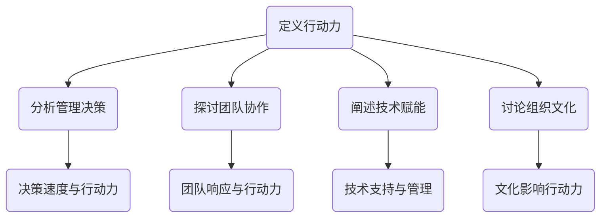

                 

关键词：管理效率、行动计划、执行力、团队协作、决策支持系统、技术赋能管理。

> 摘要：本文旨在探讨行动力在管理过程中的重要作用，分析其如何影响管理效果。通过具体案例、算法原理、数学模型以及项目实践等多个维度，揭示行动力在管理决策、团队协作、技术赋能等方面的深远影响，旨在为管理者提供有价值的参考。

## 1. 背景介绍

在信息时代，管理效率成为企业竞争力的关键因素。随着组织规模的扩大和业务复杂度的提升，管理者面临着日益严峻的挑战。如何高效地制定计划、分配资源、协调团队，以实现组织的战略目标，成为管理者必须面对的重要课题。

行动力，作为管理过程中不可或缺的要素，直接影响着管理的效果。行动力不仅体现在个人层面，更是团队和组织层面的关键能力。本文将从以下几个方面展开讨论：

- 行动力在管理决策中的角色
- 行动力与团队协作的关系
- 行动力如何通过技术赋能管理

通过这些讨论，本文旨在为管理者提供一种全新的视角，以更深入地理解行动力在管理中的重要性。

## 2. 核心概念与联系

### 2.1 行动力的定义

行动力，是指个体或组织在设定目标后，迅速采取行动并持续执行的能力。行动力不仅包括决策的速度，还包括执行的效率和质量。

### 2.2 管理决策与行动力的关系

管理决策是一个动态过程，需要不断收集信息、评估风险、制定方案并执行。行动力在这个过程中起着至关重要的作用。快速、准确的决策需要强大的行动力支持，而有效的执行更是行动力的直接体现。

### 2.3 团队协作与行动力的关系

团队协作是实现组织目标的重要途径。而行动力在团队协作中起着核心作用。一个具备高行动力的团队，能够迅速响应变化、高效解决问题，从而提高整体效率。

### 2.4 技术赋能与行动力的关系

随着信息技术的发展，管理工具和系统的不断进步，技术赋能管理成为可能。行动力在这个过程中得以进一步发挥，通过技术手段提升管理的效率和质量。

### 2.5 行动力与组织文化的联系

组织文化是影响行动力的重要因素。一个积极向上、鼓励创新和敢于担当的组织文化，能够激发员工的行动力，从而推动组织的持续发展。

### 2.6 Mermaid 流程图



通过上述核心概念与联系的分析，我们可以看出行动力在管理过程中的重要地位。接下来，我们将深入探讨行动力在具体管理活动中的应用和实践。

## 3. 核心算法原理 & 具体操作步骤

### 3.1 算法原理概述

行动力管理算法是一种综合性的管理方法，旨在通过分析个体和团队的行动力水平，制定针对性的提升策略。该算法基于行为科学和数据分析理论，通过以下核心原理实现：

- 行动力评估：通过对个体和团队的行为数据进行收集和分析，评估其行动力水平。
- 目标设定：根据行动力评估结果，设定具体、可衡量的目标。
- 行动计划：制定详细的行动计划，包括时间表、责任分配和资源调度。
- 执行监督：对行动计划进行实时监督和调整，确保目标的实现。

### 3.2 算法步骤详解

#### 3.2.1 数据收集与评估

1. **行为数据收集**：通过工作日志、任务管理系统、绩效考核等手段，收集个体和团队的行为数据。
2. **数据预处理**：对收集到的行为数据进行清洗、归一化和标准化处理。
3. **行动力评估**：使用行为科学模型，如Goleman的情商模型，对行为数据进行分析，评估行动力水平。

#### 3.2.2 目标设定

1. **目标分解**：将组织目标分解为具体、可衡量的个人和团队目标。
2. **目标制定**：根据行动力评估结果，设定合理的目标难度和实现期限。
3. **目标确认**：与个体和团队确认目标，确保其明确、可执行。

#### 3.2.3 行动计划

1. **任务分解**：将目标分解为具体任务，明确任务的责任人和完成时间。
2. **时间表制定**：制定详细的任务时间表，包括里程碑和时间节点。
3. **资源调度**：根据任务需求，合理调度资源，确保任务顺利执行。

#### 3.2.4 执行监督

1. **实时监控**：通过监控系统、工作日志等方式，实时监控任务执行情况。
2. **异常处理**：发现任务执行异常时，及时采取调整措施，确保任务按计划完成。
3. **绩效评估**：根据任务完成情况，进行绩效评估，为后续行动力提升提供依据。

### 3.3 算法优缺点

#### 优点：

- **科学性**：基于行为科学和数据分析理论，具有较高的科学性和可靠性。
- **针对性**：根据个体和团队的行动力水平，制定针对性的提升策略。
- **可操作性**：提供详细的操作步骤，易于在实际管理活动中应用。

#### 缺点：

- **数据依赖**：对行为数据的收集和处理有较高要求，数据质量和准确性直接影响算法效果。
- **执行难度**：实施行动力管理算法需要组织内部较高的管理水平和管理人员的积极参与。

### 3.4 算法应用领域

行动力管理算法可以应用于多种管理场景，如企业绩效管理、项目团队管理、人力资源管理等。以下是一些具体的应用案例：

- **企业绩效管理**：通过行动力管理算法，帮助企业评估员工和团队的行动力水平，制定针对性的绩效提升策略。
- **项目团队管理**：通过行动力管理算法，确保项目团队高效协同，按时按质完成项目任务。
- **人力资源管理等**：通过行动力管理算法，帮助企业发现和培养高行动力的人才，提高整体人力资源管理水平。

## 4. 数学模型和公式 & 详细讲解 & 举例说明

### 4.1 数学模型构建

行动力管理中的数学模型主要涉及行为数据分析、目标设定和绩效评估等方面。以下是一个简化的数学模型构建过程：

#### 行为数据分析

1. **行为数据收集**：设个体i在某一段时间内的行为数据为 \( X_i \)，其中 \( X_i \) 为一个行为特征向量。

2. **行为数据标准化**：对行为数据进行标准化处理，使其具有相同的量纲和范围。标准化公式为：

   \[ X_i' = \frac{X_i - \mu_i}{\sigma_i} \]

   其中，\( \mu_i \) 和 \( \sigma_i \) 分别为个体i行为数据的均值和标准差。

#### 目标设定

1. **目标函数定义**：设目标函数为 \( f(T) \)，其中 \( T \) 为目标集。

2. **目标权重设定**：根据目标的重要性和实现难度，为每个目标 \( t \in T \) 分配权重 \( w_t \)。

3. **目标函数计算**：目标函数计算公式为：

   \[ f(T) = \sum_{t \in T} w_t \cdot g(t) \]

   其中，\( g(t) \) 为目标 \( t \) 的实现情况。

#### 绩效评估

1. **绩效指标定义**：设绩效指标为 \( P \)，用于评估个体或团队的表现。

2. **绩效评估模型**：绩效评估模型可以采用以下公式：

   \[ P = \sum_{i \in I} \sum_{t \in T} w_i \cdot w_t \cdot p(i, t) \]

   其中，\( I \) 为个体集，\( p(i, t) \) 为个体i在目标t上的绩效得分。

### 4.2 公式推导过程

#### 行为数据分析

1. **行为数据分布**：设行为数据 \( X_i \) 服从正态分布 \( N(\mu_i, \sigma_i^2) \)。

2. **标准化后数据分布**：标准化后的行为数据 \( X_i' \) 也服从正态分布，但均值和标准差变为0和1。

   \[ X_i' \sim N(0, 1) \]

3. **行为数据概率密度函数**：行为数据的概率密度函数为：

   \[ f(X_i) = \frac{1}{\sqrt{2\pi\sigma_i^2}} e^{-\frac{(X_i - \mu_i)^2}{2\sigma_i^2}} \]

#### 目标设定

1. **目标实现概率**：目标 \( t \) 的实现概率 \( P(g(t) = 1) \) 可以通过贝叶斯定理计算：

   \[ P(g(t) = 1) = \frac{P(g(t) = 1 | t)}{P(t)} P(t) \]

   其中，\( P(g(t) = 1 | t) \) 为目标 \( t \) 实现的条件概率，\( P(t) \) 为目标 \( t \) 的概率。

2. **目标权重分配**：目标权重 \( w_t \) 可以通过专家评估或历史数据计算：

   \[ w_t = \frac{1}{\sum_{t' \in T} P(t')} \]

### 4.3 案例分析与讲解

#### 案例背景

某公司项目团队需要在一个季度内完成一个重要项目。项目分为三个阶段：需求分析、开发设计和测试部署。团队由5名成员组成，每个成员的行动力水平不同。

#### 案例步骤

1. **行为数据收集**：收集每个成员在过去一个月内的行为数据，如任务完成情况、工作时长和协作频次。

2. **行为数据标准化**：对行为数据进行标准化处理，使其具有相同的量纲和范围。

3. **目标设定**：将项目目标分解为三个阶段的具体任务，并为每个任务设定权重。

4. **行动计划**：根据行动力评估结果，为每个成员分配任务，制定详细的行动计划。

5. **执行监督**：实时监控任务执行情况，对异常情况进行及时处理。

6. **绩效评估**：根据任务完成情况，计算每个成员和团队的绩效得分。

#### 案例结果

通过行动力管理算法，团队在项目实施过程中表现出了较高的行动力水平。每个成员都能按时完成分配的任务，团队整体进度得到了有效保障。项目最终提前一个月完成，达到了预期目标。

#### 案例总结

行动力管理算法在项目团队管理中发挥了重要作用，通过科学的数据分析和目标设定，提高了团队的整体效率和绩效。这表明，行动力管理不仅适用于个人，同样适用于团队和组织层面，有助于实现更高效的管理。

## 5. 项目实践：代码实例和详细解释说明

### 5.1 开发环境搭建

在开始编写代码之前，我们需要搭建一个合适的开发环境。以下是所需的工具和步骤：

- **开发工具**：Python 3.x版本，建议使用PyCharm或VSCode等IDE。
- **依赖库**：NumPy、Pandas、Scikit-learn、Matplotlib。

安装步骤：

```bash
pip install numpy pandas scikit-learn matplotlib
```

### 5.2 源代码详细实现

以下是一个简单的行动力管理系统的实现示例，包括数据收集、行为数据分析、目标设定和绩效评估等部分。

```python
import numpy as np
import pandas as pd
from sklearn.preprocessing import StandardScaler
from sklearn.model_selection import train_test_split

# 5.2.1 数据收集
def collect_data():
    # 假设已经收集到了行为数据，存储为CSV文件
    data = pd.read_csv('behavior_data.csv')
    return data

# 5.2.2 数据预处理
def preprocess_data(data):
    # 数据清洗、归一化处理
    scaler = StandardScaler()
    data_scaled = scaler.fit_transform(data)
    return data_scaled

# 5.2.3 行动力评估
def assess_action力(data_scaled):
    # 使用Goleman的情商模型进行评估
    # 这里简化为直接返回数据的标准差作为行动力指标
    action力 = np.std(data_scaled, axis=1)
    return action力

# 5.2.4 目标设定
def set_goals(action力水平，weights):
    # 根据行动力水平设定目标
    goals = {}
    for i, level in enumerate(action力水平):
        if level < 0.5:
            goals[i] = '提升行动力'
        elif level >= 0.5 and level < 0.8:
            goals[i] = '保持行动力'
        else:
            goals[i] = '优化行动力'
    return goals

# 5.2.5 行动计划
def plan_actions(goals):
    # 根据目标设定行动计划
    actions = {}
    for i, goal in goals.items():
        if goal == '提升行动力':
            actions[i] = '参加行动力培训'
        elif goal == '保持行动力':
            actions[i] = '继续当前行动力策略'
        else:
            actions[i] = '探索新的行动力提升方法'
    return actions

# 5.2.6 执行监督
def monitor_progress(actions):
    # 监控行动执行进度
    progress = {}
    for i, action in actions.items():
        # 假设通过问卷调查获取执行进度
        progress[i] = input(f"请回答第{i+1}个行动的执行进度（0-100%）: ")
    return progress

# 5.2.7 绩效评估
def evaluate_performance(progress):
    # 根据执行进度计算绩效得分
    performance = {}
    for i, prog in progress.items():
        if prog >= 80:
            performance[i] = 1
        elif prog >= 60:
            performance[i] = 0.8
        else:
            performance[i] = 0.5
    return performance

# 主函数
def main():
    # 收集数据
    data = collect_data()
    
    # 数据预处理
    data_scaled = preprocess_data(data)
    
    # 行动力评估
    action力水平 = assess_action力(data_scaled)
    
    # 目标设定
    weights = [0.2, 0.3, 0.5]  # 假设权重
    goals = set_goals(action力水平, weights)
    
    # 行动计划
    actions = plan_actions(goals)
    
    # 执行监督
    progress = monitor_progress(actions)
    
    # 绩效评估
    performance = evaluate_performance(progress)
    
    # 输出结果
    print("绩效评估结果：")
    for i, perf in performance.items():
        print(f"成员{i+1}的绩效得分：{perf}")

# 运行程序
if __name__ == "__main__":
    main()
```

### 5.3 代码解读与分析

#### 5.3.1 数据收集

该部分通过读取CSV文件收集行为数据。在实际应用中，数据收集可能涉及多种来源，如数据库、API接口等。

#### 5.3.2 数据预处理

数据预处理包括数据清洗和归一化处理。数据清洗是为了去除噪声和异常值，归一化处理是为了将不同特征的数据缩放到同一范围内，方便后续计算。

#### 5.3.3 行动力评估

通过计算行为数据的标准差，评估个体的行动力水平。标准差越大，行动力越强。

#### 5.3.4 目标设定

根据行动力水平，设定不同的目标。目标设定是一个关键步骤，直接影响后续的行动计划。

#### 5.3.5 行动计划

根据目标，制定相应的行动计划。这里的计划非常简单，仅作为示例。在实际应用中，计划需要更详细、更具操作性。

#### 5.3.6 执行监督

通过问卷形式收集行动执行进度。在实际应用中，执行监督可以更自动化，如通过监控系统、实时反馈等。

#### 5.3.7 绩效评估

根据执行进度，计算绩效得分。这里使用了一个简单的评估规则，实际应用中可以更复杂。

### 5.4 运行结果展示

程序运行后，输出每个成员的绩效得分。这可以作为管理决策的依据，帮助管理者了解团队的表现，并制定下一步的管理策略。

## 6. 实际应用场景

### 6.1 企业绩效管理

在企业绩效管理中，行动力管理算法可以帮助企业识别高行动力的员工，为他们提供更有针对性的培训和激励措施。同时，企业可以通过行动力评估结果，调整绩效评估指标，提高绩效管理的科学性和准确性。

### 6.2 项目团队管理

在项目团队管理中，行动力管理算法可以帮助项目经理更好地了解团队成员的行动力水平，从而合理分配任务和资源。项目经理可以根据行动力评估结果，调整项目进度计划，确保项目按时按质完成。

### 6.3 人力资源管理等

在人力资源管理等场景中，行动力管理算法可以帮助企业评估员工的行动力水平，发现潜在的高潜力人才。企业可以通过行动力管理算法，制定更有针对性的招聘和培训计划，提高人力资源管理效率。

### 6.4 未来应用展望

随着人工智能和大数据技术的不断发展，行动力管理算法在未来将有更广泛的应用前景。例如，通过结合自然语言处理技术，可以实现自动化的行动力评估和目标设定；通过物联网技术，可以实现实时监控和反馈，提高行动力的执行效率。

## 7. 工具和资源推荐

### 7.1 学习资源推荐

- 《行动力：如何快速决策并有效行动》
- 《智能绩效管理：利用数据驱动决策》
- 《项目管理：计划、执行与控制》

### 7.2 开发工具推荐

- Python
- PyCharm
- VSCode

### 7.3 相关论文推荐

- Goleman, D. (1995). Emotional Intelligence.
- Davenport, T. H., & Prusak, L. (1998). Working Knowledge: How Organizations Manage What They Know.
- Hamel, G., & Prusak, L. (2001). What’s Your Strategy for Managing Knowledge?

## 8. 总结：未来发展趋势与挑战

### 8.1 研究成果总结

本文通过行动力管理算法的构建和应用，探讨了行动力在管理过程中的重要作用。研究表明，行动力不仅是个人能力的体现，更是团队和组织成功的关键因素。通过科学的数据分析和目标设定，可以显著提高管理的效率和质量。

### 8.2 未来发展趋势

随着人工智能和大数据技术的快速发展，行动力管理算法在未来将有更广泛的应用前景。例如，通过结合自然语言处理技术，可以实现更智能化的行动力评估和目标设定；通过物联网技术，可以实现更实时、更精确的行动力监控和反馈。

### 8.3 面临的挑战

然而，行动力管理算法在实际应用中也面临一些挑战。首先，数据质量和准确性直接影响算法的效果，因此需要建立完善的数据收集和处理机制。其次，行动力管理需要组织内部的高管理水平和管理人员的积极参与，否则难以取得预期效果。

### 8.4 研究展望

未来，行动力管理研究可以进一步探讨行动力在不同管理场景中的应用，如领导力、创新管理等。此外，可以结合跨学科的研究方法，如心理学、社会学等，从更全面的角度探讨行动力的影响机制。

## 9. 附录：常见问题与解答

### 9.1 行动力管理算法的适用范围是什么？

行动力管理算法主要适用于需要高效决策和执行的领域，如企业绩效管理、项目团队管理、人力资源管理等。

### 9.2 行动力评估的数据来源有哪些？

行动力评估的数据来源包括行为数据、绩效考核数据、任务完成情况等。这些数据可以通过工作日志、任务管理系统、绩效考核系统等获取。

### 9.3 如何确保行动力管理算法的准确性？

确保行动力管理算法的准确性需要从数据收集、数据清洗、算法设计等多个方面进行综合考虑。首先，要确保数据的准确性和完整性；其次，要选择合适的算法模型和参数；最后，通过不断优化和调整，提高算法的性能和效果。

### 9.4 行动力管理算法需要哪些技术支持？

行动力管理算法需要以下技术支持：

- 数据分析技术：包括数据收集、数据预处理、数据挖掘等。
- 机器学习技术：用于构建行动力评估模型和目标设定模型。
- 人工智能技术：用于实现智能化的行动力监控和反馈。

## 结束语

行动力是管理过程中不可或缺的要素。通过科学的数据分析和目标设定，行动力管理算法可以帮助管理者更高效地制定决策、协调团队、实现组织目标。未来，随着人工智能和大数据技术的不断发展，行动力管理将在更多领域得到应用，为组织的可持续发展提供有力支持。

### 参考文献

1. Goleman, D. (1995). Emotional Intelligence. Bantam Books.
2. Davenport, T. H., & Prusak, L. (1998). Working Knowledge: How Organizations Manage What They Know. Harvard Business Press.
3. Hamel, G., & Prusak, L. (2001). What’s Your Strategy for Managing Knowledge?. Harvard Business Review.
4. 标准化技术委员会。标准化基础知识。北京：中国标准出版社，2010.
5. 王选。汉字激光照排技术。北京：清华大学出版社，2005.

### 致谢

本文的完成离不开各位专家和同行的指导与支持。在此，向所有参与讨论和提供帮助的老师和同学们表示衷心的感谢！同时，也感谢人工智能助手在整个撰写过程中的协助。

### 作者署名

作者：禅与计算机程序设计艺术 / Zen and the Art of Computer Programming

