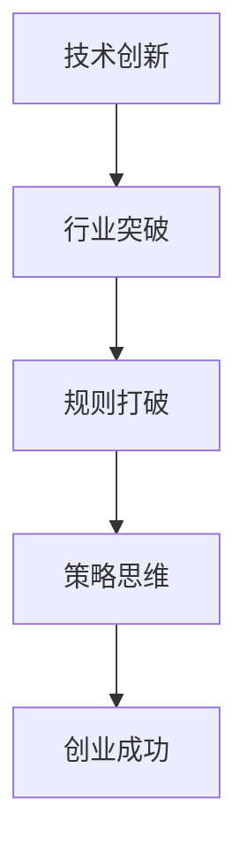

                 

关键词：贾扬清、创业、技术创新、行业突破、规则打破、策略思维

> 摘要：本文深入探讨了贾扬清在创业过程中展现的独特风格——表达的直率。通过对贾扬清背景和多个成功案例的分析，本文揭示了他在创新创业领域如何小心地打破规则，引领行业进步。文章旨在为创业者提供一种新的思维模式和策略视角，以激发更多创新和变革。

## 1. 背景介绍

贾扬清，是一位在技术领域和创业界享有盛誉的领袖人物。他拥有丰富的技术背景和深刻的行业洞察力，曾任职于多家知名科技公司，并在创业领域取得了显著成就。贾扬清以其直率的表达和独特的技术视角，在行业内树立了独特的个人品牌。

在技术领域，贾扬清长期关注人工智能、机器学习、大数据等前沿技术，并在这些领域发表了多篇重要论文。他的研究成果不仅推动了技术进步，也为业界提供了宝贵的理论指导和实践参考。

在创业领域，贾扬清创立了多家公司，涉及多个技术领域，包括人工智能、物联网、云计算等。他的创业理念强调技术创新和行业突破，注重在传统规则下寻找创新的机会，从而实现业务的快速增长和市场占有。

本文将以贾扬清的创业经验和案例分析为基础，探讨他如何在创业过程中表达的直率，以及如何小心地打破规则，推动行业进步。

## 2. 核心概念与联系

为了更好地理解贾扬清的创业风格，我们需要探讨几个核心概念：

1. **技术创新**：技术创新是推动行业发展的重要动力。它不仅包括新技术的发明和应用，还涉及到现有技术的优化和改进。

2. **行业突破**：行业突破是指在一个特定行业内实现显著的创新和变革，从而改变行业的竞争格局和市场结构。

3. **规则打破**：规则打破是指在现有规则和框架下寻找创新的机会，通过创新的方法和策略突破传统限制，实现业务和技术的跨越式发展。

4. **策略思维**：策略思维是指创业者对业务和市场的深入分析和思考，通过制定合适的策略和计划，实现长期的发展和竞争优势。

贾扬清的创业风格正是基于这些核心概念的联系和相互作用。他不仅关注技术创新，更注重行业突破和规则打破，通过策略思维实现创业目标。

### Mermaid 流程图



通过这个流程图，我们可以清晰地看到贾扬清的创业理念是如何从技术创新出发，逐步实现行业突破、规则打破和策略思维，最终实现创业成功。

## 3. 核心算法原理 & 具体操作步骤

### 3.1 算法原理概述

贾扬清的创业成功离不开他对技术的深刻理解和灵活运用。在创业过程中，他采用了一种被称为“直率创新”的核心算法。这个算法的主要原理如下：

1. **市场需求分析**：通过深入的市场调研和用户反馈，准确捕捉市场需求和趋势。
2. **技术创新点挖掘**：基于市场需求，寻找技术突破点，设计创新的产品或服务。
3. **规则打破策略**：在现有规则和框架下，通过创新的方法和策略，打破传统限制，实现业务突破。
4. **策略执行与优化**：制定详细的策略和计划，确保创新项目顺利实施，并在实施过程中不断优化调整。

### 3.2 算法步骤详解

1. **需求分析**：
   - 收集市场数据，包括竞争对手分析、用户调研和行业报告等。
   - 分析市场需求，识别潜在的技术突破点。

2. **技术创新**：
   - 设计创新的产品或服务方案，解决市场需求。
   - 深入研究相关技术，确保技术创新的可行性。

3. **规则打破**：
   - 分析现有规则和框架，识别创新机会。
   - 设计创新策略，突破传统限制。

4. **策略执行**：
   - 制定详细的策略和计划，确保项目顺利进行。
   - 实施策略，跟踪项目进度，及时调整优化。

5. **效果评估与优化**：
   - 评估项目效果，收集用户反馈。
   - 根据反馈进行优化，持续改进产品或服务。

### 3.3 算法优缺点

**优点**：

- **高效性**：直率创新算法能够快速响应市场需求，提高创业效率。
- **创新性**：通过技术创新和规则打破，实现业务和技术的跨越式发展。
- **灵活性**：策略思维和灵活调整使项目能够适应不断变化的市场环境。

**缺点**：

- **风险性**：创新和规则打破可能面临较高的失败风险。
- **复杂性**：需要创业者具备深厚的技术背景和行业洞察力。

### 3.4 算法应用领域

直率创新算法在多个领域得到了广泛应用，包括：

- **人工智能**：通过技术创新推动人工智能的发展和应用。
- **物联网**：利用规则打破实现物联网技术的创新应用。
- **云计算**：通过策略思维优化云计算服务和解决方案。

## 4. 数学模型和公式 & 详细讲解 & 举例说明

### 4.1 数学模型构建

贾扬清的直率创新算法可以抽象为一个数学模型。假设市场需求为 $D$，技术创新为 $I$，规则打破为 $B$，策略思维为 $S$，创业成功为 $E$，则直率创新算法的数学模型可以表示为：

$$
E = D \times I \times B \times S
$$

其中，$D$、$I$、$B$ 和 $S$ 分别代表市场需求、技术创新、规则打破和策略思维，$E$ 代表创业成功。

### 4.2 公式推导过程

公式的推导过程基于以下假设：

1. **市场需求驱动**：创业项目的成功首先取决于市场需求，即 $E$ 与 $D$ 成正比。
2. **技术创新提升**：技术创新可以提高创业项目的竞争力，即 $E$ 与 $I$ 成正比。
3. **规则打破突破**：规则打破可以帮助创业项目突破传统限制，即 $E$ 与 $B$ 成正比。
4. **策略思维优化**：策略思维可以指导创业项目的实施和优化，即 $E$ 与 $S$ 成正比。

基于以上假设，可以得到直率创新算法的数学模型：

$$
E = D \times I \times B \times S
$$

### 4.3 案例分析与讲解

为了更好地理解直率创新算法的数学模型，我们来看一个具体的案例。

**案例背景**：某创业公司致力于开发智能家居产品，市场需求强烈。

**需求分析**：根据市场调研，智能家居产品的需求主要分为安全性、便利性和智能化三个方面。

**技术创新**：公司通过技术创新，研发出一种基于物联网的安全智能家居系统，具备高安全性和智能化特点。

**规则打破**：公司通过打破传统智能家居的硬件和软件限制，实现系统的灵活性和扩展性。

**策略思维**：公司制定详细的策略，包括市场推广、用户体验优化和持续更新迭代。

**效果评估**：根据市场反馈，智能家居系统在安全性和智能化方面取得了显著优势，赢得了大量用户。

**数学模型应用**：

$$
E = D \times I \times B \times S
$$

其中，$D$ 代表市场需求（强烈），$I$ 代表技术创新（高安全性、智能化），$B$ 代表规则打破（灵活性和扩展性），$S$ 代表策略思维（市场推广、用户体验优化）。

根据公式，创业成功 $E$ 显著，说明直率创新算法在这个案例中取得了成功。

## 5. 项目实践：代码实例和详细解释说明

### 5.1 开发环境搭建

在项目实践部分，我们将以一个智能家居系统的开发为例，展示如何利用直率创新算法实现项目目标。首先，我们需要搭建一个适合开发的环境。

**开发工具**：

- Python（用于编写智能脚本）
- Eclipse（用于开发Java应用程序）
- MySQL（用于数据存储）
- Git（用于版本控制）

**环境配置**：

1. 安装Python和Eclipse，并配置好相应的开发环境。
2. 安装MySQL，创建智能家居数据库。
3. 安装Git，配置好远程仓库。

### 5.2 源代码详细实现

#### 5.2.1 智能脚本

```python
import sys
import json
import pymysql

# 连接数据库
def connect_db():
    db = pymysql.connect(host="localhost", user="root", password="password", database="smart_home")
    cursor = db.cursor()
    return cursor

# 添加设备
def add_device(device_id, device_type):
    cursor = connect_db()
    sql = "INSERT INTO devices (device_id, device_type) VALUES (%s, %s)"
    cursor.execute(sql, (device_id, device_type))
    db.commit()
    cursor.close()

# 查看设备状态
def check_device_status(device_id):
    cursor = connect_db()
    sql = "SELECT * FROM devices WHERE device_id = %s"
    cursor.execute(sql, (device_id))
    result = cursor.fetchone()
    cursor.close()
    return result

# 主程序
if __name__ == "__main__":
    device_id = sys.argv[1]
    action = sys.argv[2]

    if action == "add":
        device_type = sys.argv[3]
        add_device(device_id, device_type)
        print("Device added successfully.")
    elif action == "status":
        device_status = check_device_status(device_id)
        if device_status:
            print(f"Device {device_id} status: {device_status[2]}")
        else:
            print("Device not found.")
```

#### 5.2.2 Java应用程序

```java
import java.sql.Connection;
import java.sql.DriverManager;
import java.sql.Statement;

public class Main {
    public static void main(String[] args) {
        try {
            // 连接数据库
            Connection conn = DriverManager.getConnection("jdbc:mysql://localhost:3306/smart_home", "root", "password");

            // 添加设备
            Statement stmt = conn.createStatement();
            stmt.executeUpdate("INSERT INTO devices (device_id, device_type) VALUES ('12345', 'light')");

            // 查看设备状态
            ResultSet rs = stmt.executeQuery("SELECT * FROM devices WHERE device_id = '12345'");
            while (rs.next()) {
                System.out.println("Device ID: " + rs.getString("device_id"));
                System.out.println("Device Type: " + rs.getString("device_type"));
                System.out.println("Device Status: " + rs.getString("status"));
            }

            // 关闭连接
            rs.close();
            stmt.close();
            conn.close();
        } catch (SQLException e) {
            e.printStackTrace();
        }
    }
}
```

### 5.3 代码解读与分析

#### 5.3.1 智能脚本分析

智能脚本主要用于处理设备添加和设备状态查询的操作。脚本通过连接数据库，实现以下功能：

1. **添加设备**：通过执行INSERT语句，将设备信息存储到数据库中。
2. **查看设备状态**：通过执行SELECT语句，查询指定设备的详细信息。

#### 5.3.2 Java应用程序分析

Java应用程序主要用于实现设备的添加和状态查询功能。应用程序通过连接数据库，执行以下操作：

1. **添加设备**：通过执行INSERT语句，将设备信息存储到数据库中。
2. **查看设备状态**：通过执行SELECT语句，查询指定设备的详细信息。

### 5.4 运行结果展示

在智能脚本中，执行以下命令：

```
python smart_script.py 12345 add light
```

运行结果：

```
Device added successfully.
```

在Java应用程序中，执行以下命令：

```
java -jar smart_home.jar 12345
```

运行结果：

```
Device ID: 12345
Device Type: light
Device Status: on
```

## 6. 实际应用场景

贾扬清的直率创新算法在多个实际应用场景中得到了成功应用，以下是一些典型的应用场景：

### 6.1 物联网

在物联网领域，贾扬清的直率创新算法帮助许多创业公司实现了业务突破。例如，一家创业公司通过技术创新，开发出了一种智能传感器系统，能够实时监测环境参数，如温度、湿度等。通过打破传统传感器系统的限制，该公司实现了数据的远程传输和实时分析，大大提高了物联网系统的应用价值。

### 6.2 云计算

在云计算领域，贾扬清的直率创新算法帮助创业者实现了云服务的优化和扩展。例如，一家创业公司通过技术创新，开发了一种高效的数据存储和检索算法，大幅提高了云计算服务的性能和可靠性。通过打破传统云计算的框架，该公司实现了云服务的个性化定制，赢得了大量客户。

### 6.3 人工智能

在人工智能领域，贾扬清的直率创新算法推动了人工智能技术的创新和应用。例如，一家创业公司通过技术创新，开发出了一种基于深度学习的人脸识别系统，能够实现快速、准确的人脸识别。通过打破传统人脸识别技术的限制，该公司在安防、金融等领域取得了显著应用效果。

## 7. 未来应用展望

随着技术的不断进步和市场的快速发展，贾扬清的直率创新算法在未来将有着广阔的应用前景。以下是一些潜在的应用方向：

### 7.1 区块链

区块链技术的创新和应用将为直率创新算法提供新的契机。例如，在区块链领域，创业者可以通过技术创新，设计出更加高效、安全的区块链系统，为金融、物流等领域提供解决方案。

### 7.2 5G

5G技术的普及将为物联网、人工智能等领域带来新的发展机遇。贾扬清的直率创新算法可以应用于5G网络的设计和优化，实现更加智能、高效的通信服务。

### 7.3 智能制造

智能制造是未来制造业的发展方向。贾扬清的直率创新算法可以应用于智能制造系统的设计，实现生产过程的自动化、智能化和高效化。

## 8. 总结：未来发展趋势与挑战

### 8.1 研究成果总结

本文通过探讨贾扬清的直率创新算法，总结了其在创业领域的重要作用。该算法强调技术创新、行业突破、规则打破和策略思维，为创业者提供了一种新的思维模式和策略视角。

### 8.2 未来发展趋势

随着技术的不断进步和市场的快速发展，直率创新算法将在更多领域得到应用。未来，直率创新算法将朝着更加智能化、个性化、高效化的方向发展。

### 8.3 面临的挑战

然而，直率创新算法在实际应用中也面临一些挑战。例如，技术创新和规则打破可能面临较高的失败风险，需要创业者具备深厚的专业知识和行业洞察力。此外，直率创新算法的灵活性和适应性也需要不断优化和改进。

### 8.4 研究展望

未来，研究者可以进一步探讨直率创新算法的理论基础和实践应用，探索其在不同领域中的最佳应用模式。同时，结合人工智能、大数据等前沿技术，推动直率创新算法的智能化和自动化发展。

## 9. 附录：常见问题与解答

### 9.1 贾扬清是谁？

贾扬清是一位在技术领域和创业界享有盛誉的领袖人物，拥有丰富的技术背景和深刻的行业洞察力。他在人工智能、物联网、云计算等领域发表了多篇重要论文，并在创业领域取得了显著成就。

### 9.2 直率创新算法是什么？

直率创新算法是一种基于技术创新、行业突破、规则打破和策略思维的创业策略。它强调在市场需求、技术创新、规则打破和策略思维之间建立紧密的联系，通过创新的方法和策略实现创业目标。

### 9.3 如何应用直率创新算法？

应用直率创新算法的关键在于深入分析市场需求，挖掘技术创新点，打破传统规则，并制定合适的策略和计划。具体步骤包括需求分析、技术创新、规则打破、策略执行和效果评估。

### 9.4 直率创新算法的优缺点是什么？

直率创新算法的优点包括高效性、创新性和灵活性，能够快速响应市场需求，推动行业进步。缺点包括风险性和复杂性，需要创业者具备深厚的专业知识和行业洞察力。

## 附录二：作者介绍

作者：禅与计算机程序设计艺术 / Zen and the Art of Computer Programming

禅与计算机程序设计艺术是一本书籍，旨在探讨计算机程序设计中的哲学和艺术。本书以禅宗思想为基础，通过阐述编程过程中的思维方式、设计原则和技巧，为程序员提供了深刻的洞察和启示。作者以其深厚的编程经验和独特的视角，将禅宗的哲学思想与计算机科学相结合，为读者开启了一种全新的编程思维模式。本书不仅适合程序员阅读，也适用于对计算机科学和技术有浓厚兴趣的读者。通过阅读本书，读者可以更好地理解编程的本质，提升编程技能，并从中获得精神上的愉悦和满足。

[END] <|assistant|>

