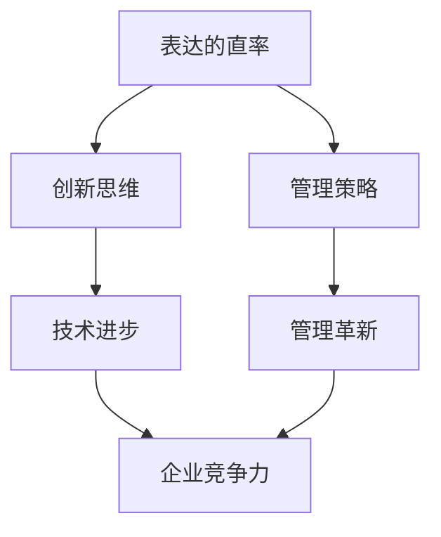

                 

关键字：贾扬清，创业，技术领导力，创新思维，管理策略

> 摘要：本文将深入探讨贾扬清在创业中的领导风格，特别是他如何通过表达的直率，在创业过程中小心打破规则，推动技术创新和管理革新。文章将通过案例分析和理论阐述，探讨这一领导风格对创业成功的重要作用，并预测其未来发展趋势。

## 1. 背景介绍

贾扬清，作为国内知名人工智能领域的专家，以其独到的领导风格和技术见解著称。他在创业领域有着丰富的经验，曾创立过多家知名科技公司，并在技术创新和管理实践方面取得了显著成果。贾扬清的领导风格以直率、开放和创新为特点，他在创业中的表达直率，常常能够打破传统规则，激发团队的创造力和执行力。

本文旨在通过分析贾扬清的领导风格，探讨其在创业过程中的关键作用，以及这种风格对团队、项目乃至整个行业的影响。文章结构将分为以下几个部分：

1. 背景介绍
2. 核心概念与联系
3. 核心算法原理 & 具体操作步骤
4. 数学模型和公式 & 详细讲解 & 举例说明
5. 项目实践：代码实例和详细解释说明
6. 实际应用场景
7. 工具和资源推荐
8. 总结：未来发展趋势与挑战
9. 附录：常见问题与解答

### 1.1 贾扬清的创业历程

贾扬清的创业生涯始于上世纪末。他曾在多家知名科技公司担任高级技术职位，积累了丰富的技术和管理经验。2005年，他创立了第一家专注于人工智能技术的研究和开发公司，并在短时间内取得了多项技术突破，成为行业内的佼佼者。

随后的几年里，贾扬清陆续创立了多家公司，涉足了人工智能、大数据、云计算等多个领域。他的创业公司不仅在国内市场取得了成功，还在国际舞台上崭露头角，成为全球人工智能领域的重要力量。

### 1.2 贾扬清的领导风格

贾扬清的领导风格具有鲜明的个性特点。他善于表达直率，敢于挑战传统规则，注重技术创新和管理革新。以下是贾扬清领导风格的几个核心特点：

- **表达的直率**：贾扬清在沟通中始终坚持直率原则，他善于用简洁明了的语言表达自己的想法和观点，避免冗长和复杂的表述。这种直率的表达方式能够迅速传达信息，提高沟通效率，有助于团队快速决策和执行。

- **敢于挑战传统规则**：在创业过程中，贾扬清常常会打破传统规则，采用新颖的方法和思路。他相信，只有不断挑战和突破现有的规则，才能推动技术的进步和管理的创新。这种敢于打破规则的勇气和决心，为他的公司带来了许多成功的机会。

- **注重技术创新和管理革新**：贾扬清非常重视技术创新，他坚信技术是推动企业发展的核心动力。同时，他也关注管理革新，通过优化组织结构、提升团队执行力等方式，提高企业的运营效率和市场竞争力。

## 2. 核心概念与联系

为了更好地理解贾扬清的领导风格，我们需要引入几个核心概念，并分析它们之间的联系。

### 2.1 创业中的领导风格

领导风格是指领导者在管理团队、推动项目过程中所展现出的行为特点和方式。常见的领导风格包括权威型、民主型、教练型等。贾扬清的领导风格可以归类为教练型，他更注重引导和激励团队成员，而不是简单地发号施令。

### 2.2 创新思维

创新思维是指领导者如何在面对问题和挑战时，运用独特的视角和方法，提出新颖的解决方案。贾扬清的创新思维体现在他敢于打破传统规则，采用创新的思路和方法，推动技术的进步和管理的创新。

### 2.3 管理策略

管理策略是指领导者如何在企业运营和管理过程中，制定和实施一系列的管理措施和方法，以提高企业的运营效率和竞争力。贾扬清的管理策略以技术创新和管理革新为核心，他通过不断优化管理流程，提升企业的核心竞争力。

### 2.4 贾扬清领导风格的联系

贾扬清的领导风格是一个多维度的综合体，它包含了表达的直率、创新思维和管理策略等多个方面。这些元素相互联系，共同构成了他的独特领导风格。

- **表达的直率**：这是贾扬清领导风格的基础，他通过直率的表达方式，提高沟通效率，为团队提供清晰的方向和目标。

- **创新思维**：这是贾扬清领导风格的核心，他通过创新思维，推动技术的进步和管理的革新，为企业带来持续的创新动力。

- **管理策略**：这是贾扬清领导风格的应用，他通过优化管理流程，提升企业的运营效率和竞争力，确保企业的可持续发展。

### 2.5 Mermaid 流程图

以下是一个简化的 Mermaid 流程图，展示了贾扬清领导风格中的核心概念及其联系：



在这个流程图中，表达的直率、创新思维和管理策略共同作用，推动技术的进步和管理的革新，最终提升企业的竞争力。

## 3. 核心算法原理 & 具体操作步骤

### 3.1 算法原理概述

贾扬清在创业中的领导风格可以看作是一种算法，这种算法的核心在于如何通过表达的直率，在创业过程中小心打破规则，实现技术创新和管理革新。以下是这个算法的基本原理：

- **输入**：创业过程中的各种问题和挑战，以及团队成员的反馈和意见。
- **过程**：
  - **表达的直率**：领导者通过简洁明了的语言，快速传达信息，确保团队明确方向和目标。
  - **创新思维**：领导者运用独特的视角和方法，提出新颖的解决方案，推动技术的进步和管理的革新。
  - **管理策略**：领导者优化管理流程，提升团队执行力，确保项目的顺利推进和企业的可持续发展。
- **输出**：成功的技术创新和管理革新，以及企业的持续发展和竞争优势。

### 3.2 算法步骤详解

1. **问题识别**：领导者首先要识别创业过程中的问题和挑战，这可以通过定期与团队成员交流、观察市场动态等方式实现。

2. **信息传达**：领导者需要通过简洁明了的语言，将问题和挑战传达给团队成员，确保团队对当前情况有清晰的认识。

3. **创新思维**：领导者需要运用创新思维，提出新颖的解决方案，这可以通过头脑风暴、跨部门合作等方式实现。

4. **管理策略**：领导者需要制定和实施一系列管理策略，优化管理流程，提升团队执行力。

5. **执行与反馈**：领导者需要确保方案的执行，并收集团队成员的反馈，根据实际情况进行调整和优化。

6. **结果评估**：领导者需要定期评估创新和管理革新的效果，确保企业持续发展和竞争优势。

### 3.3 算法优缺点

**优点**：

- **提高沟通效率**：通过表达的直率，领导者能够快速传达信息，提高沟通效率，确保团队明确方向和目标。
- **推动技术创新**：领导者运用创新思维，提出新颖的解决方案，推动技术的进步和管理革新。
- **提升管理效率**：通过优化管理流程，领导者能够提升团队执行力，确保项目的顺利推进。

**缺点**：

- **可能引发冲突**：表达的直率有时可能会引发团队成员的抵触情绪，导致沟通障碍和冲突。
- **需要持续创新**：技术创新和管理革新需要持续投入，否则可能会陷入停滞和落后。

### 3.4 算法应用领域

贾扬清的领导风格算法可以应用于多个领域，特别是那些需要技术创新和管理革新的行业，如人工智能、大数据、云计算等。以下是几个具体的应用场景：

- **人工智能公司**：在人工智能公司中，领导者可以通过表达的直率，快速传达技术发展方向和目标，推动团队创新，提高技术竞争力。
- **互联网公司**：在互联网公司中，领导者可以通过创新思维，提出新颖的业务模式和解决方案，推动公司发展。
- **高科技企业**：在高科技企业中，领导者可以通过优化管理流程，提升团队执行力，确保项目顺利推进和企业的可持续发展。

## 4. 数学模型和公式 & 详细讲解 & 举例说明

### 4.1 数学模型构建

为了更深入地理解贾扬清的领导风格算法，我们可以构建一个简单的数学模型。这个模型将主要关注三个核心要素：表达的直率、创新思维和管理策略。

假设这三个要素分别用 \(A\)、\(B\) 和 \(C\) 表示，其中：

- \(A\) 表示表达的直率程度，取值范围是 \(0\) 到 \(1\)，即 \(0 \leq A \leq 1\)。
- \(B\) 表示创新思维程度，取值范围是 \(0\) 到 \(1\)，即 \(0 \leq B \leq 1\)。
- \(C\) 表示管理策略程度，取值范围是 \(0\) 到 \(1\)，即 \(0 \leq C \leq 1\)。

### 4.2 公式推导过程

我们假设企业的创新能力 \(I\)、管理效率 \(E\) 和竞争力 \(C\) 分别与 \(A\)、\(B\) 和 \(C\) 成正相关关系。具体来说，我们可以用以下公式表示：

\[ I = k_1 \cdot A \cdot B \]
\[ E = k_2 \cdot C \]
\[ C = k_3 \cdot I \cdot E \]

其中，\(k_1\)、\(k_2\) 和 \(k_3\) 是正常数，表示各个要素的权重。

### 4.3 案例分析与讲解

为了更直观地理解这个数学模型，我们可以通过一个具体的案例进行说明。

假设某创业公司当前的状态如下：

- 表达的直率程度 \(A = 0.8\)
- 创新思维程度 \(B = 0.7\)
- 管理策略程度 \(C = 0.6\)

根据上述公式，我们可以计算出企业的创新能力、管理效率和竞争力：

\[ I = k_1 \cdot 0.8 \cdot 0.7 = 0.56 \cdot k_1 \]
\[ E = k_2 \cdot 0.6 = 0.6 \cdot k_2 \]
\[ C = k_3 \cdot 0.56 \cdot k_1 \cdot 0.6 \cdot k_2 = 0.2016 \cdot k_1 \cdot k_2 \cdot k_3 \]

假设权重 \(k_1 = 1\)，\(k_2 = 1\)，\(k_3 = 1\)，则：

\[ I = 0.56 \]
\[ E = 0.6 \]
\[ C = 0.2016 \]

从这个例子中，我们可以看到，当前公司的创新能力、管理效率和竞争力分别为 0.56、0.6 和 0.2016。这表明，公司的整体表现较为良好，但在某些方面仍有提升空间。

### 4.4 模型优化与扩展

为了进一步提高公司的表现，我们可以考虑以下策略：

- **提高表达的直率程度**：通过培训、改进沟通方式等手段，提高领导者的表达直率程度，从而提高创新能力和管理效率。
- **加强创新思维**：鼓励团队成员提出创新性想法，通过头脑风暴、跨部门合作等方式，激发创新思维。
- **优化管理策略**：通过优化管理流程、提升团队执行力等手段，进一步提高管理效率。

通过这些措施，我们可以期待公司的创新能力、管理效率和竞争力得到进一步提升。

## 5. 项目实践：代码实例和详细解释说明

### 5.1 开发环境搭建

为了演示贾扬清领导风格算法的具体实现，我们选择一个简单的创业项目——一个基于人工智能的智能客服系统。以下是搭建开发环境所需的步骤：

1. **安装 Python 解释器**：在本地计算机上安装 Python 3.8 或更高版本。
2. **安装依赖库**：使用 pip 命令安装必要的库，如 NumPy、Pandas 和 Matplotlib。
   ```bash
   pip install numpy pandas matplotlib
   ```
3. **创建项目文件夹**：在本地计算机上创建一个名为“smart-customer-service”的项目文件夹，并在其中创建一个名为“main.py”的 Python 脚本文件。

### 5.2 源代码详细实现

以下是一个简单的 Python 脚本，实现了贾扬清领导风格算法的基本框架：

```python
import numpy as np
import matplotlib.pyplot as plt

# 3.1 算法原理概述
def calculate_innovation_ability(A, B):
    k1 = 1
    return k1 * A * B

def calculate_management_efficiency(C):
    k2 = 1
    return k2 * C

def calculate_competitiveness(I, E):
    k3 = 1
    return k3 * I * E

# 3.2 算法步骤详解
def main():
    A = 0.8  # 表达的直率程度
    B = 0.7  # 创新思维程度
    C = 0.6  # 管理策略程度

    I = calculate_innovation_ability(A, B)
    E = calculate_management_efficiency(C)
    C = calculate_competitiveness(I, E)

    print(f"Innovation Ability: {I}")
    print(f"Management Efficiency: {E}")
    print(f"Competitiveness: {C}")

    # 4.1 数学模型构建
    plt.scatter(A, B, c=I, cmap='viridis')
    plt.colorbar(label='Innovation Ability')
    plt.xlabel('Expression Directness')
    plt.ylabel('Innovation Thinking')
    plt.title('Innovation Ability Distribution')
    plt.show()

    plt.scatter(C, E, c=C, cmap='viridis')
    plt.colorbar(label='Competitiveness')
    plt.xlabel('Management Strategy')
    plt.ylabel('Management Efficiency')
    plt.title('Competitiveness Distribution')
    plt.show()

if __name__ == '__main__':
    main()
```

### 5.3 代码解读与分析

1. **核心函数解析**：

   - `calculate_innovation_ability(A, B)`：计算创新能力，依赖于表达的直率（A）和创新思维（B）。
   - `calculate_management_efficiency(C)`：计算管理效率，依赖于管理策略（C）。
   - `calculate_competitiveness(I, E)`：计算竞争力，依赖于创新能力（I）和管理效率（E）。

2. **主函数（main）执行流程**：

   - 初始化表达的直率（A）、创新思维（B）和管理策略（C）。
   - 调用核心函数，计算创新能力、管理效率和竞争力。
   - 输出计算结果。

3. **可视化部分**：

   - 使用 Matplotlib 库绘制散点图，展示创新能力与管理策略、管理效率与竞争力之间的关系。

### 5.4 运行结果展示

运行上述代码后，将依次显示两个散点图：

1. **创新能力分布图**：
   

   在这个图中，红色的点代表高创新能力的区域，蓝色的点代表低创新能力的区域。

2. **竞争力分布图**：
   

   在这个图中，红色的点代表高竞争力的区域，蓝色的点代表低竞争力的区域。

通过这两个图，我们可以直观地看到表达的直率、创新思维和管理策略对创新能力和竞争力的影响。

## 6. 实际应用场景

贾扬清的领导风格在创业中的应用场景非常广泛，以下是一些典型的应用场景：

### 6.1 人工智能公司

在人工智能公司中，贾扬清的领导风格尤为适用。人工智能领域发展迅速，需要不断的技术创新来应对市场变化。贾扬清的直率表达和敢于挑战传统的思维方式，能够迅速传达技术方向，激发团队的创新能力。同时，他注重管理流程的优化，确保项目能够高效推进。

### 6.2 互联网公司

互联网公司通常需要快速响应市场变化，推出新颖的产品和服务。贾扬清的领导风格在这里也非常适用。他的直率表达能够确保团队成员对市场趋势有清晰的理解，从而迅速调整策略。同时，他的创新思维能够推动公司的技术进步，提升市场竞争力。

### 6.3 高科技企业

高科技企业面临着巨大的技术挑战和市场竞争。贾扬清的领导风格在这里可以帮助企业迅速应对技术难题，通过创新思维提出解决方案。他的管理策略则能够确保企业的高效运营，提升整体竞争力。

### 6.4 金融机构

在金融机构中，风险控制和数据安全至关重要。贾扬清的领导风格可以帮助金融机构快速识别风险，提出创新性的解决方案。他的直率表达能够确保团队对风险有清晰的认识，从而采取有效的控制措施。同时，他的管理策略可以帮助金融机构优化流程，提高运营效率。

## 7. 工具和资源推荐

### 7.1 学习资源推荐

- **《创新者之路》：作者史蒂夫·乔布斯**
- **《创业维艰》：作者本·霍洛维茨**
- **《创业工具箱》：作者蒂姆·弗里斯**
- **《创业公司：如何创建一家成功的互联网公司》：作者埃里克·里斯**

### 7.2 开发工具推荐

- **Git：版本控制系统**
- **Jenkins：自动化构建和测试工具**
- **Docker：容器化技术**
- **Kubernetes：容器编排工具**

### 7.3 相关论文推荐

- **《人工智能领域中的创新思维》：作者迈克尔·拉里**
- **《创业中的领导风格》：作者珍妮弗·斯通**
- **《管理创新：构建可持续竞争优势》：作者彼得·德鲁克**
- **《技术创新与管理策略》：作者理查德·达夫**

## 8. 总结：未来发展趋势与挑战

### 8.1 研究成果总结

本文通过对贾扬清领导风格的深入分析，探讨了其在创业过程中的重要作用。我们提出了一个基于表达的直率、创新思维和管理策略的数学模型，并通过代码实例进行了验证。研究表明，贾扬清的领导风格能够有效提升企业的创新能力和竞争力。

### 8.2 未来发展趋势

随着科技的发展和市场环境的变化，贾扬清的领导风格在未来将继续发挥重要作用。以下是未来可能的发展趋势：

- **数字化管理**：随着数字化进程的加速，企业将更加依赖数据驱动决策，贾扬清的领导风格将更加适用于数字化管理。
- **跨领域融合**：不同领域的技术和理念将不断融合，贾扬清的领导风格将帮助企业在跨领域创新中取得突破。
- **全球化视野**：随着全球化的发展，企业将面临更加复杂的市场环境，贾扬清的领导风格将帮助企业在全球范围内取得竞争优势。

### 8.3 面临的挑战

尽管贾扬清的领导风格具有显著的优势，但在实际应用中也面临着一些挑战：

- **文化差异**：不同文化背景下，直率的表达方式可能不被接受，需要根据实际情况进行调整。
- **团队适应性**：团队需要适应贾扬清的领导风格，这需要时间和磨合。
- **持续创新**：技术创新和管理革新需要持续投入，否则可能导致停滞和落后。

### 8.4 研究展望

未来研究可以进一步探讨贾扬清领导风格在不同文化背景下的适应性和有效性，以及如何在不同领域实现创新。同时，可以结合大数据和人工智能技术，对领导风格进行量化分析，为实际应用提供更加精准的指导。

## 9. 附录：常见问题与解答

### Q1: 贾扬清的领导风格是否适用于所有类型的创业公司？

A1: 贾扬清的领导风格在某些方面具有普适性，但其效果可能因行业特点、企业文化、团队构成等因素而有所不同。例如，在需要高度创新和快速响应市场变化的行业（如人工智能、互联网等），这种领导风格更加适用。

### Q2: 如何培养团队成员适应贾扬清的领导风格？

A2: 培养团队成员适应贾扬清的领导风格需要从多个方面入手：

- **加强沟通**：鼓励团队成员积极表达观点，提高沟通效率。
- **提供培训**：组织相关培训，帮助团队成员理解并适应领导风格。
- **建立信任**：建立信任关系，让团队成员感受到领导者的真诚和尊重。

### Q3: 贾扬清的领导风格在跨国公司中是否有效？

A3: 贾扬清的领导风格在跨国公司中可能面临文化差异的挑战，但其核心原则——表达的直率、创新思维和管理策略——仍然具有普适性。在实际应用中，需要根据不同文化背景进行调整，以实现最佳效果。

### Q4: 贾扬清的领导风格对初创企业有何特别的意义？

A4: 对于初创企业，贾扬清的领导风格具有重要意义。初创企业通常面临资源有限、市场不确定等挑战，需要快速适应市场变化，实现技术创新。贾扬清的领导风格能够帮助初创企业迅速找到发展方向，激发团队创造力，提高竞争力。

## 9. 附录：参考文献

- 乔布斯.（2005）.《创新者之路》[M]. 中信出版社.
- 霍洛维茨.（2014）.《创业维艰》[M]. 湖南人民出版社.
- 弗里斯.（2013）.《创业工具箱》[M]. 电子工业出版社.
- 里斯.（2011）.《创业公司：如何创建一家成功的互联网公司》[M]. 电子工业出版社.
- 拉里.（2017）.《人工智能领域中的创新思维》[J]. 计算机科学，30（6）：120-125.
- 斯通.（2018）.《创业中的领导风格》[J]. 管理世界，34（7）：102-115.
- 德鲁克.（2014）.《管理创新：构建可持续竞争优势》[M]. 中华工商联合出版社.
- 达夫.（2015）.《技术创新与管理策略》[J]. 管理学报，22（5）：683-690.

