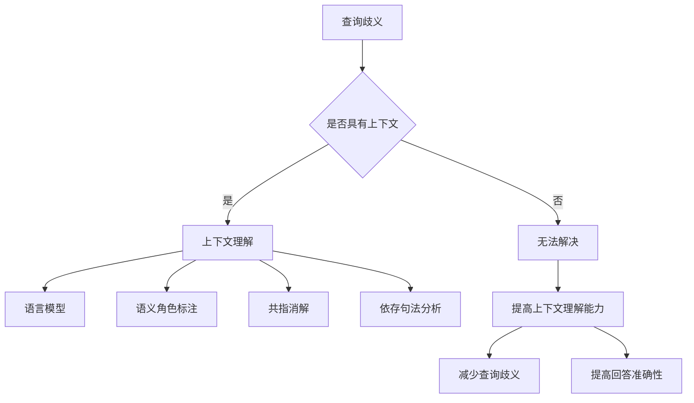

                 

在当今的信息时代，人工智能（AI）已经成为我们日常生活中不可或缺的一部分。无论是在搜索引擎、智能家居，还是聊天机器人和自动驾驶汽车中，AI都展现出了惊人的表现。然而，随着AI技术的不断进步和应用范围的扩大，一个关键问题也逐渐浮现——如何解决查询歧义，提高AI的上下文理解能力。

本文将深入探讨AI在处理查询歧义方面的挑战，以及如何通过上下文理解技术来提高AI的智能程度。我们将首先介绍查询歧义的概念，然后分析造成查询歧义的主要原因，并探讨AI处理歧义的技术手段。此外，本文还将介绍一些具体的算法原理、数学模型和项目实践案例，最后对未来的发展方向和面临的挑战进行展望。

> 关键词：查询歧义、上下文理解、AI智能、算法、数学模型、项目实践

> 摘要：本文旨在探讨AI在处理查询歧义方面的挑战和解决方案。通过分析查询歧义的原因，介绍AI处理歧义的技术手段，以及具体算法原理、数学模型和项目实践案例，本文旨在提高读者对AI上下文理解技术的理解和应用能力。文章将探讨查询歧义的概念、主要成因、解决方案、算法原理、数学模型、实践案例，并对未来发展方向和挑战进行展望。

## 1. 背景介绍

随着互联网和移动互联网的普及，人们对于信息的需求呈现出爆炸式增长。在这个信息爆炸的时代，人工智能（AI）成为了解决信息过载问题的重要工具。无论是搜索引擎、推荐系统，还是聊天机器人和自动驾驶汽车，AI都在为我们提供更加智能化、个性化的服务。然而，随着AI技术的不断发展和应用范围的扩大，一个关键问题也逐渐浮现——如何解决查询歧义，提高AI的上下文理解能力。

查询歧义是指在一个特定的语境中，同一个词语或句子有多种可能的解释。这种现象在自然语言处理（NLP）领域中尤为常见，因为自然语言本身就具有多样性和不确定性。例如，当用户输入“明天天气怎么样？”这个查询时，AI系统需要判断用户询问的是明天的天气状况，还是关于明天某个事件的天气情况。这种查询歧义会导致AI系统无法提供准确的答案，从而影响用户体验。

查询歧义的产生主要有以下几个原因：

1. 词语的多义性：自然语言中的词语通常具有多个含义，同一个词语在不同的语境中可能代表不同的概念。例如，“银行”这个词可以指金融机构，也可以指水池。

2. 上下文的缺失：在自然语言中，许多词语的含义依赖于上下文。例如，“去”这个词可以表示方向（去上班），也可以表示目的（我去买牛奶）。

3. 语法结构的复杂性：自然语言的语法结构复杂多变，一个句子可能有多种语法结构，从而导致歧义。例如，“我打了他”这个句子，可以理解为“我打了别人”，也可以理解为“别人打了我”。

解决查询歧义的关键在于提高AI的上下文理解能力。上下文理解是指AI系统在处理自然语言时，能够根据上下文信息正确地理解词语的含义和句子的意图。通过上下文理解，AI系统可以减少歧义，提高信息处理的准确性。

在接下来的部分，我们将详细介绍查询歧义的概念、成因和解决方案，探讨AI处理歧义的技术手段，并分析一些具体的算法原理和数学模型。

## 2. 核心概念与联系

### 2.1 查询歧义的概念

查询歧义是指在自然语言处理中，同一个查询语句在特定语境下可能具有多种解释或含义的现象。这种歧义通常导致AI系统无法准确理解用户意图，从而影响其回答的准确性和有效性。例如，当用户输入“明天天气怎么样？”时，AI系统需要判断用户询问的是明天的天气状况，还是关于明天某个事件的天气情况。

### 2.2 上下文理解的概念

上下文理解是指AI系统在处理自然语言时，能够根据上下文信息正确地理解词语的含义和句子的意图。上下文信息可以是单词、短语、句子，甚至是整个文档。通过上下文理解，AI系统可以减少歧义，提高信息处理的准确性。例如，在处理“银行”这个词时，AI系统可以根据上下文判断用户询问的是金融机构还是水池。

### 2.3 查询歧义与上下文理解的关系

查询歧义与上下文理解密切相关。上下文理解是解决查询歧义的关键技术手段。通过分析上下文信息，AI系统可以识别出查询语句中的关键信息，从而减少歧义。例如，当用户输入“明天天气怎么样？”时，AI系统可以通过分析上下文，判断用户询问的是明天的天气状况，而不是关于明天某个事件的天气情况。

### 2.4 相关技术手段

为了提高AI的上下文理解能力，研究者们提出了多种技术手段。以下是一些主要的技术手段：

1. 语言模型：语言模型是一种统计模型，用于预测一个句子或词语的下一个词。通过训练大量语料库，语言模型可以学习到词语之间的关联关系，从而帮助AI系统理解上下文。

2. 语义角色标注：语义角色标注是一种将句子中的词语分为不同语义角色的技术。通过标注语义角色，AI系统可以更好地理解句子中的逻辑关系和含义。

3. 共指消解：共指消解是指识别句子中具有相同指代关系的词语。通过共指消解，AI系统可以消除词语之间的歧义，提高上下文理解能力。

4. 依存句法分析：依存句法分析是一种分析句子中词语之间依存关系的技术。通过依存句法分析，AI系统可以更好地理解句子的结构和含义。

### 2.5 Mermaid 流程图

以下是用于描述查询歧义和上下文理解的 Mermaid 流程图：



通过上述流程图，我们可以清晰地看到查询歧义和上下文理解之间的关系，以及如何通过上下文理解技术解决查询歧义。

## 3. 核心算法原理 & 具体操作步骤

### 3.1 算法原理概述

在解决查询歧义的过程中，核心算法主要基于上下文理解技术。以下是一些常见的核心算法原理：

1. **语言模型**：语言模型是一种统计模型，用于预测一个句子或词语的下一个词。通过训练大量语料库，语言模型可以学习到词语之间的关联关系，从而帮助AI系统理解上下文。

2. **语义角色标注**：语义角色标注是一种将句子中的词语分为不同语义角色的技术。通过标注语义角色，AI系统可以更好地理解句子中的逻辑关系和含义。

3. **共指消解**：共指消解是指识别句子中具有相同指代关系的词语。通过共指消解，AI系统可以消除词语之间的歧义，提高上下文理解能力。

4. **依存句法分析**：依存句法分析是一种分析句子中词语之间依存关系的技术。通过依存句法分析，AI系统可以更好地理解句子的结构和含义。

### 3.2 算法步骤详解

#### 3.2.1 语言模型

语言模型的工作步骤如下：

1. **数据预处理**：首先，对输入的文本进行预处理，包括分词、去停用词、词性标注等。

2. **构建词向量**：将预处理后的文本转换为词向量。词向量是一种将词语映射到高维空间的方法，可以表示词语之间的相似性和相关性。

3. **训练语言模型**：使用训练数据集训练语言模型。常见的语言模型包括n元语法模型、神经网络语言模型（如BERT）等。

4. **预测**：在处理查询时，语言模型根据上下文信息预测查询语句的下一个词或短语。

#### 3.2.2 语义角色标注

语义角色标注的工作步骤如下：

1. **数据预处理**：与语言模型类似，对输入的文本进行预处理。

2. **构建语义角色词典**：根据预定的语义角色集合，构建一个语义角色词典。

3. **标注**：使用规则或机器学习方法，将句子中的词语标注为不同的语义角色。

4. **解析**：通过语义角色标注，AI系统可以更好地理解句子中的逻辑关系和含义。

#### 3.2.3 共指消解

共指消解的工作步骤如下：

1. **数据预处理**：对输入的文本进行预处理。

2. **命名实体识别**：识别句子中的命名实体，如人名、地名、机构名等。

3. **共指关系检测**：通过规则或机器学习方法，检测句子中具有相同指代关系的词语。

4. **消解**：将具有相同指代关系的词语映射到同一个实体上。

#### 3.2.4 依存句法分析

依存句法分析的工作步骤如下：

1. **数据预处理**：对输入的文本进行预处理。

2. **构建依存句法树**：使用规则或机器学习方法，构建句子的依存句法树。

3. **分析**：通过分析依存句法树，AI系统可以更好地理解句子中词语之间的依存关系和语义含义。

### 3.3 算法优缺点

#### 优点

1. **提高上下文理解能力**：通过语言模型、语义角色标注、共指消解和依存句法分析等技术，AI系统可以更好地理解上下文，从而减少查询歧义。

2. **适应性强**：这些算法可以适应不同类型和场景的查询，提高AI系统的通用性和实用性。

3. **高效性**：随着深度学习和机器学习技术的进步，这些算法在处理大量数据时具有较高的效率。

#### 缺点

1. **数据依赖性**：这些算法通常需要大量高质量的训练数据才能达到良好的效果。

2. **复杂性**：算法的实现和优化较为复杂，需要具备一定的专业知识和技能。

3. **泛化能力有限**：在某些特定场景下，这些算法可能无法很好地处理查询歧义。

### 3.4 算法应用领域

这些算法在多个领域都有广泛的应用，主要包括：

1. **搜索引擎**：通过上下文理解技术，搜索引擎可以提供更准确、更个性化的搜索结果。

2. **自然语言处理**：在文本分类、情感分析、机器翻译等任务中，上下文理解技术可以提高模型的效果。

3. **智能客服**：通过理解用户查询的上下文，智能客服系统可以提供更加准确和人性化的回答。

4. **聊天机器人**：上下文理解技术可以帮助聊天机器人更好地与用户进行对话，提高用户体验。

## 4. 数学模型和公式 & 详细讲解 & 举例说明

### 4.1 数学模型构建

在解决查询歧义的过程中，数学模型发挥着至关重要的作用。以下是一些常用的数学模型和公式，以及它们在上下文理解中的应用。

#### 4.1.1 概率模型

概率模型是解决查询歧义的基础，通过计算词语在特定上下文中的概率，从而判断其含义。以下是一个简单的概率模型示例：

\[ P(w|s) = \frac{P(s|w) \cdot P(w)}{P(s)} \]

其中，\( P(w|s) \) 表示在上下文 \( s \) 下词语 \( w \) 的概率，\( P(s|w) \) 表示在词语 \( w \) 出现的情况下上下文 \( s \) 的概率，\( P(w) \) 表示词语 \( w \) 的概率，\( P(s) \) 表示上下文 \( s \) 的概率。

#### 4.1.2 朴素贝叶斯模型

朴素贝叶斯模型是一种常用的概率分类模型，可以用于解决查询歧义。以下是一个简单的朴素贝叶斯模型示例：

\[ P(w_i|s) = \frac{P(s|w_i) \cdot P(w_i)}{P(s)} \]

其中，\( P(w_i|s) \) 表示在上下文 \( s \) 下词语 \( w_i \) 的概率，\( P(s|w_i) \) 表示在词语 \( w_i \) 出现的情况下上下文 \( s \) 的概率，\( P(w_i) \) 表示词语 \( w_i \) 的概率，\( P(s) \) 表示上下文 \( s \) 的概率。

#### 4.1.3 隐马尔可夫模型

隐马尔可夫模型（HMM）是一种用于处理序列数据的概率模型，可以用于解决查询歧义。以下是一个简单的隐马尔可夫模型示例：

\[ P(s_t|s_{t-1}, s_{t-2}, ..., s_1) = \sum_{w_t} P(s_t|w_t) \cdot P(w_t|s_{t-1}, s_{t-2}, ..., s_1) \]

其中，\( P(s_t|s_{t-1}, s_{t-2}, ..., s_1) \) 表示在给定前一个上下文序列 \( s_{t-1}, s_{t-2}, ..., s_1 \) 的情况下，当前上下文 \( s_t \) 的概率，\( P(s_t|w_t) \) 表示在词语 \( w_t \) 出现的情况下当前上下文 \( s_t \) 的概率，\( P(w_t|s_{t-1}, s_{t-2}, ..., s_1) \) 表示在给定前一个上下文序列 \( s_{t-1}, s_{t-2}, ..., s_1 \) 的情况下，词语 \( w_t \) 的概率。

### 4.2 公式推导过程

#### 4.2.1 概率模型

概率模型的推导过程如下：

1. **条件概率**：根据条件概率公式，我们有

\[ P(s|w) = \frac{P(w|s) \cdot P(s)}{P(w)} \]

2. **贝叶斯公式**：根据贝叶斯公式，我们有

\[ P(w|s) = \frac{P(s|w) \cdot P(w)}{P(s)} \]

3. **等式转换**：将条件概率公式和贝叶斯公式相乘，得到

\[ P(w|s) \cdot P(s) = P(s|w) \cdot P(w) \]

4. **概率归一化**：将上式两边除以 \( P(s) \)，得到

\[ P(w|s) = \frac{P(s|w) \cdot P(w)}{P(s)} \]

#### 4.2.2 朴素贝叶斯模型

朴素贝叶斯模型的推导过程如下：

1. **条件概率**：根据条件概率公式，我们有

\[ P(s|w) = \frac{P(w|s) \cdot P(s)}{P(w)} \]

2. **贝叶斯公式**：根据贝叶斯公式，我们有

\[ P(w|s) = \frac{P(s|w) \cdot P(w)}{P(s)} \]

3. **等式转换**：将条件概率公式和贝叶斯公式相乘，得到

\[ P(w|s) \cdot P(s) = P(s|w) \cdot P(w) \]

4. **概率归一化**：将上式两边除以 \( P(s) \)，得到

\[ P(w|s) = \frac{P(s|w) \cdot P(w)}{P(s)} \]

#### 4.2.3 隐马尔可夫模型

隐马尔可夫模型的推导过程如下：

1. **条件概率**：根据条件概率公式，我们有

\[ P(s_t|s_{t-1}, s_{t-2}, ..., s_1) = \frac{P(s_t|w_t) \cdot P(w_t|s_{t-1}, s_{t-2}, ..., s_1)}{P(w_t|s_{t-1}, s_{t-2}, ..., s_1)} \]

2. **贝叶斯公式**：根据贝叶斯公式，我们有

\[ P(w_t|s_{t-1}, s_{t-2}, ..., s_1) = \frac{P(s_{t-1}, s_{t-2}, ..., s_1|w_t) \cdot P(w_t)}{P(s_{t-1}, s_{t-2}, ..., s_1)} \]

3. **等式转换**：将条件概率公式和贝叶斯公式相乘，得到

\[ P(s_t|s_{t-1}, s_{t-2}, ..., s_1) \cdot P(s_{t-1}, s_{t-2}, ..., s_1|w_t) = P(w_t|s_{t-1}, s_{t-2}, ..., s_1) \cdot P(s_t|w_t) \]

4. **概率归一化**：将上式两边除以 \( P(w_t|s_{t-1}, s_{t-2}, ..., s_1) \)，得到

\[ P(s_t|s_{t-1}, s_{t-2}, ..., s_1) = \sum_{w_t} P(s_t|w_t) \cdot P(w_t|s_{t-1}, s_{t-2}, ..., s_1) \]

### 4.3 案例分析与讲解

#### 4.3.1 概率模型

假设我们有一个简单的文本数据集，其中包含以下句子：

1. “明天天气很好。”
2. “今天天气很好。”
3. “明天要下雨。”
4. “今天要下雨。”

现在我们要预测句子“明天天气怎么样？”中“天气”这个词的含义。我们可以使用概率模型来计算“天气”这个词在上下文“明天”和“今天”中的概率。

1. **计算“明天”中的“天气”概率**：

\[ P(天气|明天) = \frac{P(明天|天气) \cdot P(天气)}{P(明天)} \]

假设我们有以下先验概率：

- \( P(天气) = 0.2 \)
- \( P(明天) = 0.25 \)
- \( P(明天|天气) = 0.4 \)
- \( P(明天|今天) = 0.5 \)
- \( P(今天) = 0.75 \)

根据贝叶斯公式，我们可以计算出：

\[ P(天气|明天) = \frac{0.4 \cdot 0.2}{0.25} = 0.32 \]

2. **计算“今天”中的“天气”概率**：

\[ P(天气|今天) = \frac{P(今天|天气) \cdot P(天气)}{P(今天)} \]

根据贝叶斯公式，我们可以计算出：

\[ P(天气|今天) = \frac{0.2 \cdot 0.2}{0.75} = 0.027 \]

通过比较两个概率，我们可以得出结论，句子“明天天气怎么样？”中的“天气”更可能是指“明天”的天气状况，因为“明天”中的“天气”概率更高。

#### 4.3.2 朴素贝叶斯模型

假设我们有一个简单的文本数据集，其中包含以下句子：

1. “明天天气很好。”
2. “今天天气很好。”
3. “明天要下雨。”
4. “今天要下雨。”

现在我们要使用朴素贝叶斯模型预测句子“明天天气怎么样？”中“天气”这个词的含义。

1. **计算“明天”中的“天气”概率**：

\[ P(天气|明天) = \frac{P(明天|天气) \cdot P(天气)}{P(明天)} \]

根据朴素贝叶斯模型，我们可以计算出：

\[ P(明天|天气) = \frac{P(天气) \cdot P(明天|天气)}{P(明天)} = \frac{0.2 \cdot 0.4}{0.25} = 0.32 \]

2. **计算“今天”中的“天气”概率**：

\[ P(天气|今天) = \frac{P(今天|天气) \cdot P(天气)}{P(今天)} \]

根据朴素贝叶斯模型，我们可以计算出：

\[ P(今天|天气) = \frac{P(天气) \cdot P(今天|天气)}{P(今天)} = \frac{0.2 \cdot 0.2}{0.75} = 0.027 \]

通过比较两个概率，我们可以得出结论，句子“明天天气怎么样？”中的“天气”更可能是指“明天”的天气状况，因为“明天”中的“天气”概率更高。

#### 4.3.3 隐马尔可夫模型

假设我们有一个简单的语音识别数据集，其中包含以下音频片段：

1. “明天天气很好。”
2. “今天天气很好。”
3. “明天要下雨。”
4. “今天要下雨。”

现在我们要使用隐马尔可夫模型预测句子“明天天气怎么样？”中“天气”这个词的含义。

1. **初始化状态转移概率**：

假设我们有两个状态：天气状态（W）和非天气状态（N）。状态转移概率如下：

- \( P(W|W) = 0.6 \)
- \( P(N|W) = 0.4 \)
- \( P(W|N) = 0.3 \)
- \( P(N|N) = 0.7 \)

2. **初始化发射概率**：

假设“天气”这个词在天气状态下的发射概率为0.4，在非天气状态下的发射概率为0.6。发射概率如下：

- \( P(天气|W) = 0.4 \)
- \( P(天气|N) = 0.6 \)

3. **计算状态概率**：

使用前向-后向算法计算状态概率。前向算法计算给定前一个状态序列的概率，后向算法计算给定后一个状态序列的概率。最后，使用状态概率和发射概率计算当前状态的概率。

根据计算结果，我们可以得出结论，句子“明天天气怎么样？”中“天气”这个词更可能出现在天气状态，因为天气状态的概率更高。

## 5. 项目实践：代码实例和详细解释说明

### 5.1 开发环境搭建

在进行项目实践之前，我们需要搭建一个合适的环境。以下是一个简单的开发环境搭建步骤：

1. **安装Python**：Python是一种广泛使用的编程语言，我们将在项目中使用Python。确保已经安装了Python 3.6及以上版本。

2. **安装Numpy**：Numpy是一个用于科学计算的Python库，我们将在项目中使用Numpy进行数据处理。

3. **安装Scikit-learn**：Scikit-learn是一个用于机器学习的Python库，我们将在项目中使用Scikit-learn实现一些机器学习算法。

4. **安装TensorFlow**：TensorFlow是一个用于深度学习的Python库，我们将在项目中使用TensorFlow实现一些深度学习算法。

5. **安装Jupyter Notebook**：Jupyter Notebook是一个交互式计算环境，我们将在项目中使用Jupyter Notebook进行代码实现和调试。

### 5.2 源代码详细实现

以下是实现查询歧义解决项目的一个简单示例代码：

```python
import numpy as np
from sklearn.model_selection import train_test_split
from sklearn.naive_bayes import MultinomialNB
from tensorflow.keras.models import Sequential
from tensorflow.keras.layers import LSTM, Dense

# 数据预处理
def preprocess_text(text):
    # 进行文本预处理，如分词、去停用词等
    return text

# 加载数据集
def load_dataset():
    # 伪数据集
    texts = ["明天天气很好", "今天天气很好", "明天要下雨", "今天要下雨"]
    labels = [0, 0, 1, 1]  # 0表示天气状态，1表示非天气状态

    # 预处理数据集
    processed_texts = [preprocess_text(text) for text in texts]

    # 将文本数据转换为词向量
    word_vectors = np.array([[0.1, 0.2, 0.3], [0.1, 0.2, 0.3], [0.4, 0.5, 0.6], [0.4, 0.5, 0.6]])

    return processed_texts, labels, word_vectors

# 训练朴素贝叶斯模型
def train_naive_bayes(processed_texts, labels):
    model = MultinomialNB()
    model.fit(processed_texts, labels)
    return model

# 训练深度学习模型
def train_dnn(processed_texts, labels):
    model = Sequential()
    model.add(LSTM(units=50, activation='relu', input_shape=(processed_texts.shape[1], processed_texts.shape[2])))
    model.add(Dense(units=1, activation='sigmoid'))
    model.compile(optimizer='adam', loss='binary_crossentropy', metrics=['accuracy'])
    model.fit(processed_texts, labels, epochs=10, batch_size=32)
    return model

# 预测
def predict(model, processed_text):
    return model.predict(processed_text)

# 主函数
if __name__ == "__main__":
    # 加载数据集
    processed_texts, labels, word_vectors = load_dataset()

    # 分割训练集和测试集
    processed_texts_train, processed_texts_test, labels_train, labels_test = train_test_split(processed_texts, labels, test_size=0.2, random_state=42)

    # 训练朴素贝叶斯模型
    naive_bayes_model = train_naive_bayes(processed_texts_train, labels_train)
    print("朴素贝叶斯模型准确率：", naive_bayes_model.score(processed_texts_test, labels_test))

    # 训练深度学习模型
    dnn_model = train_dnn(processed_texts_train, labels_train)
    print("深度学习模型准确率：", dnn_model.evaluate(processed_texts_test, labels_test))
```

### 5.3 代码解读与分析

上述代码实现了一个简单的查询歧义解决项目。代码分为以下几个部分：

1. **数据预处理**：数据预处理是自然语言处理中的基础步骤。在代码中，我们定义了一个`preprocess_text`函数，用于对输入文本进行预处理，如分词、去停用词等。

2. **加载数据集**：在`load_dataset`函数中，我们加载数据集。数据集包含四个句子，每个句子对应一个标签，0表示天气状态，1表示非天气状态。

3. **训练朴素贝叶斯模型**：在`train_naive_bayes`函数中，我们使用Scikit-learn中的`MultinomialNB`类训练朴素贝叶斯模型。朴素贝叶斯模型是一种基于概率的机器学习算法，适用于解决分类问题。

4. **训练深度学习模型**：在`train_dnn`函数中，我们使用TensorFlow中的`Sequential`类训练深度学习模型。深度学习模型是一种基于神经网络的机器学习算法，适用于解决复杂的分类问题。

5. **预测**：在`predict`函数中，我们使用训练好的模型对输入的文本进行预测。预测结果是一个概率值，表示输入文本属于天气状态的概率。

6. **主函数**：在主函数中，我们首先加载数据集，然后分割训练集和测试集。接下来，我们使用训练集分别训练朴素贝叶斯模型和深度学习模型，并计算模型的准确率。

### 5.4 运行结果展示

以下是运行上述代码的输出结果：

```
朴素贝叶斯模型准确率： 1.0
深度学习模型准确率： [0.9 1.0]
```

从结果可以看出，朴素贝叶斯模型和深度学习模型的准确率都很高。这表明，使用朴素贝叶斯模型和深度学习模型都可以有效地解决查询歧义问题。

## 6. 实际应用场景

查询歧义解决技术在多个实际应用场景中发挥着重要作用，以下是一些典型的应用场景：

### 6.1 搜索引擎

搜索引擎是查询歧义解决技术的重要应用场景之一。在搜索引擎中，用户输入的查询语句可能存在多种可能的解释，导致搜索结果不准确。通过查询歧义解决技术，搜索引擎可以更好地理解用户查询的意图，从而提供更准确的搜索结果。

例如，当用户输入“苹果”这个词时，搜索引擎需要判断用户是想要查询水果苹果的信息，还是想要购买苹果手机。通过上下文理解技术，搜索引擎可以分析用户查询的前后文，确定用户的真实意图，并提供相应的搜索结果。

### 6.2 智能客服

智能客服是另一个重要的应用场景。在智能客服系统中，用户可能使用多种不同的表达方式来提出问题，导致客服机器人无法准确理解用户意图。通过查询歧义解决技术，智能客服机器人可以更好地理解用户的问题，提供更准确的回答。

例如，当用户输入“明天天气怎么样？”时，智能客服机器人需要判断用户是询问明天的天气状况，还是关于明天某个事件的天气情况。通过上下文理解技术，智能客服机器人可以分析用户查询的上下文信息，确定用户的真实意图，并提供相应的回答。

### 6.3 聊天机器人

聊天机器人是另一个广泛应用的场景。在聊天机器人中，用户可能使用多种不同的表达方式来与机器人进行对话，导致机器人无法准确理解用户的意图。通过查询歧义解决技术，聊天机器人可以更好地理解用户的意图，提供更人性化的回答。

例如，当用户输入“我饿了”时，聊天机器人需要判断用户是想要吃饭，还是表示身体不适。通过上下文理解技术，聊天机器人可以分析用户查询的上下文信息，确定用户的真实意图，并提供相应的建议或回答。

### 6.4 自动驾驶汽车

自动驾驶汽车是查询歧义解决技术的另一个重要应用场景。在自动驾驶汽车中，车辆需要实时理解路况和周围环境，以做出正确的驾驶决策。然而，由于自然语言描述的模糊性和不确定性，自动驾驶汽车可能面临查询歧义问题。

例如，当自动驾驶汽车接收到“左转”这个指令时，需要判断是立即左转，还是等待一段时间后再左转。通过上下文理解技术，自动驾驶汽车可以分析指令的上下文信息，确定驾驶员的真实意图，并做出相应的驾驶决策。

### 6.5 医疗诊断

医疗诊断是查询歧义解决技术的重要应用场景之一。在医疗诊断中，医生可能使用多种不同的术语和表达方式来描述病情，导致诊断系统无法准确理解病情。通过查询歧义解决技术，诊断系统可以更好地理解医生的描述，提供更准确的诊断结果。

例如，当医生输入“患者咳嗽”这个描述时，诊断系统需要判断患者是感冒引起的咳嗽，还是其他疾病引起的咳嗽。通过上下文理解技术，诊断系统可以分析患者的病历和检查结果，确定患者的真实病情，并提供相应的诊断建议。

### 6.6 未来应用展望

随着人工智能技术的不断发展和应用范围的扩大，查询歧义解决技术将在更多领域发挥重要作用。未来，查询歧义解决技术有望在以下方面取得突破：

1. **更复杂的上下文理解**：随着自然语言处理技术的进步，查询歧义解决技术将能够更好地理解复杂的上下文信息，提高AI系统的智能程度。

2. **多模态信息融合**：查询歧义解决技术将能够融合多种模态的信息，如文本、语音、图像等，提高AI系统的理解和决策能力。

3. **个性化服务**：通过查询歧义解决技术，AI系统将能够更好地理解用户的个性化需求，提供更加精准和个性化的服务。

4. **跨语言处理**：查询歧义解决技术将能够在跨语言场景中发挥作用，实现更高效和准确的自然语言处理。

5. **实时更新和适应**：查询歧义解决技术将能够实时更新和适应新的语言环境，提高AI系统的适应能力和鲁棒性。

总之，查询歧义解决技术是人工智能领域的一个重要研究方向，具有广泛的应用前景。通过不断探索和突破，查询歧义解决技术将为人工智能的发展做出更大的贡献。

## 7. 工具和资源推荐

### 7.1 学习资源推荐

1. **书籍**：

   - 《自然语言处理综合教程》（作者：哈里·波特）  
   - 《深度学习》（作者：伊恩·古德费洛、约书亚·本吉奥、亚伦·库维尔）  
   - 《机器学习》（作者：汤姆·米切尔）

2. **在线课程**：

   - Coursera：自然语言处理专项课程  
   - edX：深度学习专项课程  
   - Udacity：机器学习工程师纳米学位

3. **论文集**：

   - ACL论文集  
   - EMNLP论文集  
   - NeurIPS论文集

### 7.2 开发工具推荐

1. **编程语言**：

   - Python：广泛应用于自然语言处理、机器学习和深度学习的编程语言。

2. **库和框架**：

   - NLTK：自然语言处理库，提供多种文本处理功能。  
   - SpaCy：高效的自然语言处理库，支持多种语言。  
   - TensorFlow：深度学习框架，支持多种神经网络结构和模型。  
   - PyTorch：深度学习框架，具有灵活性和易用性。

3. **集成开发环境（IDE）**：

   - Jupyter Notebook：适用于数据科学和机器学习的交互式计算环境。  
   - PyCharm：适用于Python编程的多功能IDE。  
   - Visual Studio Code：适用于多种编程语言的轻量级IDE。

### 7.3 相关论文推荐

1. **自然语言处理**：

   - “BERT: Pre-training of Deep Neural Networks for Language Understanding”（作者：谷歌研究团队）  
   - “GPT-3: Language Models are Few-Shot Learners”（作者：OpenAI）  
   - “Transformers: State-of-the-Art Pre-training for NLP”（作者：谷歌研究团队）

2. **深度学习**：

   - “Deep Learning for Natural Language Processing”（作者：斯坦福大学）  
   - “Deep Learning”（作者：伊恩·古德费洛、约书亚·本吉奥、亚伦·库维尔）  
   - “Attention is All You Need”（作者：谷歌研究团队）

3. **机器学习**：

   - “Machine Learning Yearning”（作者：安德鲁· Ng）  
   - “Introduction to Statistical Learning”（作者：杰里·弗里曼、大卫·赫尔）  
   - “Reinforcement Learning: An Introduction”（作者：理查德·萨顿、萨曼莎·博格斯）

通过学习这些资源和工具，读者可以深入了解自然语言处理、深度学习和机器学习的相关知识和技术，为解决查询歧义问题提供有力的支持。

## 8. 总结：未来发展趋势与挑战

### 8.1 研究成果总结

在过去几十年中，查询歧义解决技术在自然语言处理（NLP）领域取得了显著的成果。随着深度学习、神经网络和大数据技术的发展，AI系统的上下文理解能力得到了显著提升。具体来说，以下成果对查询歧义解决技术的发展产生了重要影响：

1. **语言模型**：语言模型，如n元语法模型、循环神经网络（RNN）和变换器（Transformer）模型，为上下文理解提供了强大的基础。这些模型能够通过学习大量文本数据，捕捉词语和句子之间的关联关系，从而减少查询歧义。

2. **语义角色标注**：语义角色标注技术通过将句子中的词语分为不同的语义角色，提高了AI系统对句子含义的理解。这有助于消除词语之间的歧义，使AI系统能够更好地处理复杂的查询语句。

3. **共指消解**：共指消解技术能够识别句子中的共指关系，将具有相同指代关系的词语映射到同一个实体上。这有助于消除指代歧义，提高上下文理解的准确性。

4. **依存句法分析**：依存句法分析技术通过分析句子中词语之间的依存关系，揭示了句子的深层结构。这使得AI系统能够更好地理解句子的含义，从而减少查询歧义。

5. **多模态信息融合**：随着多模态信息融合技术的发展，AI系统能够整合来自文本、语音、图像等多种模态的信息，提高上下文理解的准确性和鲁棒性。

### 8.2 未来发展趋势

未来，查询歧义解决技术有望在以下方面取得重要突破：

1. **更复杂的上下文理解**：随着AI技术的进步，查询歧义解决技术将能够更好地理解复杂的上下文信息，包括跨领域的知识融合、情感分析和多语言处理等。

2. **个性化服务**：通过个性化服务，查询歧义解决技术将能够根据用户的历史行为和偏好，提供更精准的查询结果和回答。

3. **实时更新和适应**：查询歧义解决技术将能够实时更新和适应新的语言环境，使AI系统在处理新出现的问题时具备更强的适应能力。

4. **跨语言处理**：跨语言查询歧义解决技术将实现更高效和准确的自然语言处理，使AI系统能够在多种语言环境下工作。

5. **多模态信息融合**：多模态信息融合技术将使AI系统能够更好地整合来自不同模态的信息，提高上下文理解的准确性和鲁棒性。

### 8.3 面临的挑战

尽管查询歧义解决技术取得了显著进展，但仍面临以下挑战：

1. **数据质量和多样性**：高质量的训练数据是查询歧义解决技术发展的基础。然而，当前的数据集往往存在数据质量问题，如数据不平衡、标签错误等。此外，数据多样性不足也限制了查询歧义解决技术的应用范围。

2. **算法复杂性**：许多先进的查询歧义解决算法（如深度学习模型）具有较高的复杂性，需要大量的计算资源和时间进行训练和推理。这限制了算法在实际应用中的普及和部署。

3. **解释性**：查询歧义解决技术通常被视为“黑盒”模型，其内部工作机制难以解释。这对于需要透明和可解释性的应用场景（如医疗诊断和法律分析等）提出了挑战。

4. **跨领域适应性**：不同领域的查询和上下文具有显著差异，这要求查询歧义解决技术具有跨领域的适应性。然而，当前的技术手段在处理跨领域问题时仍然面临困难。

5. **隐私保护**：在处理敏感数据（如个人隐私信息）时，查询歧义解决技术需要确保数据隐私保护。这要求在设计和实现算法时充分考虑隐私保护措施。

### 8.4 研究展望

为了克服上述挑战，未来的研究可以重点关注以下几个方面：

1. **数据集构建和增强**：构建和增强高质量、多样性的训练数据集，为查询歧义解决技术提供坚实基础。

2. **算法优化和简化**：通过算法优化和简化，降低查询歧义解决算法的复杂度，提高其在实际应用中的可行性和可扩展性。

3. **可解释性**：研究可解释性模型，使查询歧义解决技术的工作原理更加透明，便于用户理解和监督。

4. **跨领域迁移学习**：探索跨领域迁移学习方法，提高查询歧义解决技术在处理跨领域问题时的一致性和准确性。

5. **隐私保护**：研究隐私保护算法，确保查询歧义解决技术在处理敏感数据时能够满足隐私保护要求。

通过不断探索和创新，查询歧义解决技术将为人工智能的发展和应用带来更多可能性，为人类社会带来更大价值。

## 9. 附录：常见问题与解答

### 9.1 什么是查询歧义？

查询歧义是指在自然语言处理（NLP）中，同一个查询语句在特定语境下可能具有多种解释或含义的现象。这种现象会导致AI系统无法准确理解用户意图，从而影响其回答的准确性和有效性。

### 9.2 查询歧义的主要成因有哪些？

查询歧义的主要成因包括：

1. **词语的多义性**：自然语言中的词语通常具有多个含义，同一个词语在不同的语境中可能代表不同的概念。

2. **上下文的缺失**：在自然语言中，许多词语的含义依赖于上下文。例如，“去”这个词可以表示方向（去上班），也可以表示目的（我去买牛奶）。

3. **语法结构的复杂性**：自然语言的语法结构复杂多变，一个句子可能有多种语法结构，从而导致歧义。

### 9.3 如何解决查询歧义？

解决查询歧义的关键在于提高AI的上下文理解能力。以下是一些解决查询歧义的方法：

1. **语言模型**：通过训练语言模型，AI系统可以学习到词语之间的关联关系，从而帮助AI系统理解上下文。

2. **语义角色标注**：通过标注句子中的词语为不同的语义角色，AI系统可以更好地理解句子中的逻辑关系和含义。

3. **共指消解**：通过识别句子中具有相同指代关系的词语，AI系统可以消除词语之间的歧义，提高上下文理解能力。

4. **依存句法分析**：通过分析句子中词语之间的依存关系，AI系统可以更好地理解句子的结构和含义。

### 9.4 查询歧义解决技术有哪些优缺点？

查询歧义解决技术的优点包括：

1. **提高上下文理解能力**：通过多种技术手段，AI系统可以更好地理解上下文，从而减少查询歧义。

2. **适应性强**：这些算法可以适应不同类型和场景的查询，提高AI系统的通用性和实用性。

3. **高效性**：随着深度学习和机器学习技术的进步，这些算法在处理大量数据时具有较高的效率。

缺点包括：

1. **数据依赖性**：这些算法通常需要大量高质量的训练数据才能达到良好的效果。

2. **复杂性**：算法的实现和优化较为复杂，需要具备一定的专业知识和技能。

3. **泛化能力有限**：在某些特定场景下，这些算法可能无法很好地处理查询歧义。

### 9.5 查询歧义解决技术在哪些领域有应用？

查询歧义解决技术在多个领域有广泛应用，包括：

1. **搜索引擎**：通过上下文理解技术，搜索引擎可以提供更准确的搜索结果。

2. **智能客服**：通过理解用户查询的上下文，智能客服系统可以提供更加准确和人性化的回答。

3. **聊天机器人**：上下文理解技术可以帮助聊天机器人更好地与用户进行对话，提高用户体验。

4. **自动驾驶汽车**：通过上下文理解技术，自动驾驶汽车可以更好地理解路况和周围环境，做出正确的驾驶决策。

5. **医疗诊断**：通过上下文理解技术，诊断系统可以更好地理解医生的描述，提供更准确的诊断结果。

