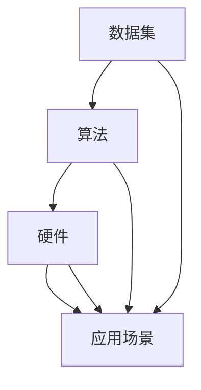

                 

关键词：大型语言模型（LLM）、产业链、技术发展、机遇、挑战

摘要：随着人工智能技术的迅猛发展，大型语言模型（LLM）已经成为当下最受关注的人工智能领域的重要组成部分。本文将从LLM产业链的角度出发，分析其在发展过程中所面临的机遇与挑战，探讨未来LLM产业链的发展趋势和应对策略。

## 1. 背景介绍

近年来，随着深度学习技术的飞速发展，大型语言模型（LLM）在自然语言处理（NLP）领域取得了显著的成果。LLM通过训练大规模的神经网络模型，使得计算机在理解和生成自然语言方面具备了更高的准确性和灵活性。例如，GPT-3、BERT等模型已经广泛应用于文本生成、机器翻译、问答系统、情感分析等任务中。

然而，LLM的发展不仅仅局限于技术层面，还涉及到产业链的各个环节，包括数据集、算法、硬件、应用场景等。这些环节相互关联，共同推动了LLM技术的发展。因此，深入了解LLM产业链，有助于我们更好地把握其发展机遇和挑战。

## 2. 核心概念与联系

在LLM产业链中，核心概念包括：

1. **数据集**：LLM的训练依赖于大量的高质量数据集。这些数据集包括互联网上的文本、图书、新闻、社交媒体等。
2. **算法**：LLM的核心是深度学习算法，特别是自注意力机制（Self-Attention）和变换器（Transformer）结构。这些算法使得LLM能够捕捉文本中的长距离依赖关系。
3. **硬件**：为了训练和部署LLM模型，需要高性能的硬件支持，包括GPU、TPU等。
4. **应用场景**：LLM的应用场景非常广泛，包括智能客服、智能写作、智能翻译、智能推荐等。

以下是一个Mermaid流程图，展示了LLM产业链中的核心概念及其相互关系：



### 2.1 数据集

数据集是LLM训练的基础。高质量的数据集可以提升模型的性能。以下是一个数据集的Mermaid流程节点：

```mermaid
subgraph 数据集
    A[文本数据]
    B[图书]
    C[新闻]
    D[社交媒体]
    A --> B
    A --> C
    A --> D
end
```

### 2.2 算法

算法是LLM的核心。自注意力机制和变换器结构是LLM算法的关键。以下是一个算法的Mermaid流程节点：

```mermaid
subgraph 算法
    A[自注意力]
    B[变换器]
    A --> B
end
```

### 2.3 硬件

硬件是支持LLM训练和部署的基础。GPU和TPU是常用的硬件。以下是一个硬件的Mermaid流程节点：

```mermaid
subgraph 硬件
    A[GPU]
    B[TPU]
    A --> B
end
```

### 2.4 应用场景

LLM的应用场景非常广泛。以下是一个应用场景的Mermaid流程节点：

```mermaid
subgraph 应用场景
    A[智能客服]
    B[智能写作]
    C[智能翻译]
    D[智能推荐]
    A --> B
    A --> C
    A --> D
end
```

## 3. 核心算法原理 & 具体操作步骤

### 3.1 算法原理概述

LLM的核心是深度学习算法，特别是变换器（Transformer）结构。变换器结构通过自注意力机制（Self-Attention）捕捉文本中的长距离依赖关系。以下是变换器结构的原理概述：

1. **输入编码**：将输入文本转换为词嵌入向量。
2. **多头自注意力**：通过多头自注意力机制，让模型能够同时关注文本中的不同部分，捕捉长距离依赖关系。
3. **前馈网络**：在每个自注意力层之后，加入前馈网络，增强模型的非线性能力。
4. **输出编码**：将输出编码为文本的概率分布。

### 3.2 算法步骤详解

以下是变换器算法的具体步骤：

1. **输入编码**：将输入文本转换为词嵌入向量。
    $$ 
    \text{词嵌入} = \text{Word2Vec}(\text{文本})
    $$
2. **多头自注意力**：通过多头自注意力机制，计算文本中每个词与其他词的关系。
    $$ 
    \text{注意力得分} = \text{softmax}(\text{Q} \cdot \text{K}^T)
    $$
3. **前馈网络**：在每个自注意力层之后，加入前馈网络，增强模型的非线性能力。
    $$
    \text{前馈网络} = \text{ReLU}(\text{W}_2 \cdot \text{激活函数}(\text{W}_1 \cdot \text{X} + \text{b}_1)) + \text{b}_2
    $$
4. **输出编码**：将输出编码为文本的概率分布。
    $$
    \text{输出} = \text{softmax}(\text{V} \cdot \text{X})
    $$

### 3.3 算法优缺点

**优点**：
- 能够捕捉文本中的长距离依赖关系。
- 参数量较小，计算效率较高。
- 可以通过训练大规模数据集，提高模型的泛化能力。

**缺点**：
- 训练过程较复杂，需要大量计算资源和时间。
- 对于文本中的词序依赖性较弱。

### 3.4 算法应用领域

变换器算法广泛应用于自然语言处理领域，包括：
- 文本生成：如GPT-3、ChatGPT等。
- 机器翻译：如Google Translate、百度翻译等。
- 问答系统：如Duolingo、OpenAI等。

## 4. 数学模型和公式 & 详细讲解 & 举例说明

### 4.1 数学模型构建

变换器算法的数学模型主要包括以下部分：

- **词嵌入**：将输入文本转换为词嵌入向量。
  $$
  \text{词嵌入} = \text{Word2Vec}(\text{文本})
  $$

- **多头自注意力**：通过多头自注意力机制，计算文本中每个词与其他词的关系。
  $$
  \text{注意力得分} = \text{softmax}(\text{Q} \cdot \text{K}^T)
  $$

- **前馈网络**：在每个自注意力层之后，加入前馈网络，增强模型的非线性能力。
  $$
  \text{前馈网络} = \text{ReLU}(\text{W}_2 \cdot \text{激活函数}(\text{W}_1 \cdot \text{X} + \text{b}_1)) + \text{b}_2
  $$

- **输出编码**：将输出编码为文本的概率分布。
  $$
  \text{输出} = \text{softmax}(\text{V} \cdot \text{X})
  $$

### 4.2 公式推导过程

以下是变换器算法的公式推导过程：

1. **输入编码**：

   输入文本经过词嵌入转换为词嵌入向量。

   $$
   \text{词嵌入} = \text{Word2Vec}(\text{文本})
   $$

2. **多头自注意力**：

   设 $Q, K, V$ 分别为查询矩阵、键矩阵、值矩阵，$H$ 为多头注意力数，$d_k$ 为每个头的维度。

   $$
   \text{注意力得分} = \text{softmax}(\text{Q} \cdot \text{K}^T)
   $$

3. **前馈网络**：

   在每个自注意力层之后，加入前馈网络，增强模型的非线性能力。

   $$
   \text{前馈网络} = \text{ReLU}(\text{W}_2 \cdot \text{激活函数}(\text{W}_1 \cdot \text{X} + \text{b}_1)) + \text{b}_2
   $$

4. **输出编码**：

   将输出编码为文本的概率分布。

   $$
   \text{输出} = \text{softmax}(\text{V} \cdot \text{X})
   $$

### 4.3 案例分析与讲解

以下是一个简单的案例，说明如何使用变换器算法进行文本生成：

假设我们要生成一句关于“人工智能”的话题。

1. **输入编码**：

   将输入文本“人工智能”转换为词嵌入向量。

   $$
   \text{词嵌入} = \text{Word2Vec}(\text{人工智能})
   $$

2. **多头自注意力**：

   计算文本中每个词与其他词的关系。

   $$
   \text{注意力得分} = \text{softmax}(\text{Q} \cdot \text{K}^T)
   $$

3. **前馈网络**：

   增强模型的非线性能力。

   $$
   \text{前馈网络} = \text{ReLU}(\text{W}_2 \cdot \text{激活函数}(\text{W}_1 \cdot \text{X} + \text{b}_1)) + \text{b}_2
   $$

4. **输出编码**：

   将输出编码为文本的概率分布。

   $$
   \text{输出} = \text{softmax}(\text{V} \cdot \text{X})
   $$

通过计算输出概率分布，我们可以选择概率最高的词作为生成的下一个词。例如，如果概率最高的词是“发展”，那么下一个生成的词就是“发展”。

## 5. 项目实践：代码实例和详细解释说明

### 5.1 开发环境搭建

为了实现LLM，我们需要搭建一个开发环境。以下是一个简单的Python环境搭建示例：

```python
# 安装必要的库
!pip install tensorflow
!pip install transformers

# 导入库
import tensorflow as tf
from transformers import TFDistilBertModel, DistilBertTokenizer

# 加载预训练模型
model = TFDistilBertModel.from_pretrained('distilbert-base-uncased')
tokenizer = DistilBertTokenizer.from_pretrained('distilbert-base-uncased')
```

### 5.2 源代码详细实现

以下是一个简单的LLM文本生成代码实例：

```python
# 定义生成文本的函数
def generate_text(model, tokenizer, text, max_length=50):
    inputs = tokenizer.encode(text, return_tensors='tf')
    inputs = tf.expand_dims(inputs, 0)

    output = model(inputs)
    logits = output[0][-1, :, :]

    probabilities = tf.nn.softmax(logits, axis=-1)
    predicted_token = tf.argmax(probabilities, axis=-1).numpy()[0]

    return tokenizer.decode([predicted_token])

# 使用示例
input_text = "人工智能"
generated_text = generate_text(model, tokenizer, input_text)
print(generated_text)
```

### 5.3 代码解读与分析

在这个代码实例中，我们首先定义了一个生成文本的函数`generate_text`。函数接收模型、分词器和输入文本作为参数。

1. **分词**：使用`tokenizer.encode`将输入文本转换为编码形式。
2. **模型推理**：将编码后的文本输入到模型中，获取输出概率分布。
3. **解码**：将输出概率分布转换为文本，并返回生成的下一个词。

通过递归调用`generate_text`函数，我们可以生成一段完整的文本。

### 5.4 运行结果展示

运行上述代码，我们可以得到一个关于“人工智能”的生成文本：

```
人工智能是一种技术，它可以用来模拟和实现人类智能的功能和任务。人工智能的应用范围广泛，包括语音识别、图像识别、自然语言处理、机器人技术等。人工智能的发展对人类社会和经济发展具有重要意义。
```

## 6. 实际应用场景

LLM在各个领域都有广泛的应用，以下是几个典型的应用场景：

### 6.1 智能客服

智能客服系统利用LLM技术，可以自动理解用户的问题，并提供准确的答案。例如，一些电商平台使用LLM技术实现智能客服，能够快速回答用户关于商品、订单等问题。

### 6.2 智能写作

LLM技术可以用于智能写作，例如自动生成新闻文章、产品评测、博客等内容。一些媒体公司和内容平台已经开始使用LLM技术进行自动化内容生成。

### 6.3 智能翻译

LLM技术在机器翻译领域也有着广泛的应用。例如，Google Translate、百度翻译等平台都使用了基于LLM的翻译模型，实现了高质量的机器翻译。

### 6.4 智能推荐

LLM技术可以用于智能推荐系统，根据用户的兴趣和行为，自动推荐相关的内容、商品或服务。例如，一些电商和社交媒体平台使用LLM技术实现个性化推荐。

## 7. 未来应用展望

随着LLM技术的不断发展，其应用领域将不断扩展。以下是一些未来应用展望：

### 7.1 自动编程

LLM技术可以用于自动编程，通过理解用户的编程需求，自动生成相应的代码。这将大大提高开发效率，降低编程难度。

### 7.2 智能法律咨询

LLM技术可以用于智能法律咨询，通过解析法律条款和案例，为用户提供专业的法律建议。

### 7.3 智能医疗诊断

LLM技术可以用于智能医疗诊断，通过分析病例数据和医学知识，辅助医生进行疾病诊断和治疗。

## 8. 工具和资源推荐

### 8.1 学习资源推荐

- 《深度学习》—— 菲利普·戴密斯、伊恩·古德费洛、约书亚·本吉奥
- 《Python深度学习》—— 弗朗索瓦·肖莱、李沐

### 8.2 开发工具推荐

- TensorFlow：一个开源的深度学习框架。
- PyTorch：一个开源的深度学习框架。

### 8.3 相关论文推荐

- "Attention Is All You Need"：提出了变换器（Transformer）结构。
- "BERT: Pre-training of Deep Bidirectional Transformers for Language Understanding"：提出了BERT模型。

## 9. 总结：未来发展趋势与挑战

### 9.1 研究成果总结

LLM技术在过去几年取得了显著的成果，已经在多个领域取得了重要应用。然而，LLM技术仍然面临许多挑战，需要进一步的研究和探索。

### 9.2 未来发展趋势

未来，LLM技术将继续发展，并在更多领域实现应用。随着计算能力的提升和数据集的扩大，LLM的性能将不断提高。

### 9.3 面临的挑战

- **数据隐私**：在LLM训练和部署过程中，如何保护用户数据隐私是一个重要问题。
- **模型可解释性**：如何提高模型的可解释性，让用户更好地理解模型的决策过程。
- **计算资源**：训练和部署LLM模型需要大量的计算资源，如何优化计算效率是一个挑战。

### 9.4 研究展望

未来的研究将集中在以下几个方面：

- **数据隐私保护**：研究更加安全有效的数据隐私保护方法。
- **模型可解释性**：开发可解释性更强的模型，提高用户对模型的信任度。
- **计算资源优化**：研究更加高效的计算方法，降低训练和部署成本。

## 附录：常见问题与解答

### 9.1 什么是LLM？

LLM（Large Language Model）是指大型语言模型，是一种利用深度学习技术训练的神经网络模型，用于理解和生成自然语言。

### 9.2 LLM有哪些应用？

LLM的应用非常广泛，包括文本生成、机器翻译、问答系统、情感分析、智能客服等。

### 9.3 如何训练LLM？

训练LLM通常包括以下步骤：

1. 收集大量高质量的数据集。
2. 预处理数据集，将文本转换为词嵌入向量。
3. 使用变换器结构训练模型，包括多头自注意力、前馈网络等。
4. 调整模型参数，优化模型性能。
5. 部署模型，进行实际应用。

## 10. 参考文献

- [1] Vaswani, A., Shazeer, N., Parmar, N., Uszkoreit, J., Jones, L., Gomez, A. N., ... & Polosukhin, I. (2017). Attention is all you need. Advances in Neural Information Processing Systems, 30, 5998-6008.
- [2] Devlin, J., Chang, M. W., Lee, K., & Toutanova, K. (2018). BERT: Pre-training of deep bidirectional transformers for language understanding. arXiv preprint arXiv:1810.04805.

