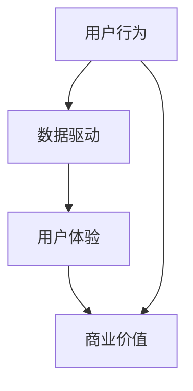

                 

关键词：注意力经济、用户行为、算法、数据驱动、用户体验

> 摘要：随着互联网和大数据技术的迅猛发展，注意力经济已成为一个不可忽视的现象。本文从注意力经济的核心概念出发，探讨了其在现实世界中的应用，分析了其背后的算法原理，以及未来可能面临的挑战。

## 1. 背景介绍

在过去的几十年里，互联网的普及和大数据技术的发展使得信息爆炸成为现实。人们每天面对的海量信息使得他们的注意力变得异常宝贵。而在这个信息过载的时代，如何获取和保持用户的注意力，成为了众多企业、平台和内容创作者的焦点。注意力经济因此应运而生，成为一种新的商业模式。

注意力经济的核心在于，通过吸引和保持用户的注意力，实现商业价值的最大化。换句话说，企业需要通过创造有趣、有价值的内容或服务，吸引用户的注意力，从而实现广告收入、会员订阅或其他形式的盈利。

## 2. 核心概念与联系

注意力经济的核心概念主要包括用户行为、数据驱动和用户体验。

### 2.1 用户行为

用户行为是指用户在互联网上的浏览、搜索、点击、评论等行为。这些行为可以被数据化，成为分析用户需求和兴趣的重要依据。

### 2.2 数据驱动

数据驱动是指企业通过收集、分析用户行为数据，从而做出更精准的市场决策和产品优化。在注意力经济中，数据驱动成为提升用户满意度和黏性的关键。

### 2.3 用户体验

用户体验是指用户在使用产品或服务时的感受和体验。在注意力经济中，优秀的用户体验能够吸引用户的注意力，提高用户满意度和忠诚度。

下面是一个Mermaid流程图，展示了注意力经济中的核心概念及其联系：



## 3. 核心算法原理 & 具体操作步骤

### 3.1 算法原理概述

注意力经济的核心算法主要包括用户行为分析、内容推荐和广告投放。这些算法通过分析用户行为数据，预测用户的兴趣和需求，从而实现个性化推荐和精准广告。

### 3.2 算法步骤详解

1. 用户行为数据收集：通过网站、APP等渠道收集用户的浏览、搜索、点击等行为数据。

2. 数据预处理：对收集到的数据进行清洗、去重、归一化等处理，确保数据的质量。

3. 用户兴趣模型构建：通过机器学习算法，如聚类、协同过滤等，构建用户的兴趣模型。

4. 内容推荐：根据用户的兴趣模型，推荐符合用户兴趣的内容。

5. 广告投放：根据用户的兴趣和行为数据，投放个性化的广告。

### 3.3 算法优缺点

- 优点：通过个性化推荐和精准广告，提高用户满意度和商业价值。
- 缺点：过度依赖算法，可能导致用户隐私泄露和过度个性化。

### 3.4 算法应用领域

注意力经济的算法主要应用于互联网内容推荐、电子商务、在线广告等领域。

## 4. 数学模型和公式 & 详细讲解 & 举例说明

### 4.1 数学模型构建

注意力经济的数学模型主要包括用户行为概率模型、内容推荐模型和广告投放模型。

### 4.2 公式推导过程

- 用户行为概率模型：P(B|A) = P(A|B) * P(B) / P(A)
  - 其中，P(B|A)表示在用户看到内容A的情况下，产生行为B的概率；P(A|B)表示用户在产生行为B的情况下，看到内容A的概率；P(B)表示用户产生行为B的概率；P(A)表示用户看到内容A的概率。

- 内容推荐模型：P(C|B) = P(B|C) * P(C) / P(B)
  - 其中，P(C|B)表示在用户产生行为B的情况下，推荐内容C的概率；P(B|C)表示用户在看到内容C的情况下，产生行为B的概率；P(C)表示推荐内容C的概率；P(B)表示用户产生行为B的概率。

- 广告投放模型：P(A|C) = P(C|A) * P(A) / P(C)
  - 其中，P(A|C)表示在用户看到内容C的情况下，投放广告A的概率；P(C|A)表示用户在投放广告A的情况下，看到内容C的概率；P(A)表示投放广告A的概率；P(C)表示用户看到内容C的概率。

### 4.3 案例分析与讲解

以电子商务平台的商品推荐为例，假设用户A在平台上浏览了商品C1和C2，并产生了购买行为B。根据用户行为概率模型，我们可以计算出用户A在看到商品C1和C2的情况下，购买商品B的概率：

- P(B|C1) = P(C1|B) * P(B) / P(C1)
- P(B|C2) = P(C2|B) * P(B) / P(C2)

通过比较这两个概率，我们可以发现用户A在看到商品C2的情况下，购买商品B的概率更高。因此，我们可以将商品C2推荐给用户A。

## 5. 项目实践：代码实例和详细解释说明

### 5.1 开发环境搭建

- 操作系统：Ubuntu 20.04
- 编程语言：Python 3.8
- 数据库：MySQL 5.7
- 依赖库：scikit-learn、numpy、pandas、matplotlib

### 5.2 源代码详细实现

```python
import numpy as np
import pandas as pd
from sklearn.model_selection import train_test_split
from sklearn.metrics.pairwise import cosine_similarity

# 读取用户行为数据
data = pd.read_csv('user_behavior.csv')

# 数据预处理
data['行为类型'] = data['行为类型'].map({'浏览': 0, '搜索': 1, '点击': 2, '购买': 3})
data['内容类型'] = data['内容类型'].map({'商品': 0, '文章': 1})

# 构建用户行为矩阵
user行为矩阵 = data.groupby(['用户ID', '行为类型']).size().unstack(fill_value=0)

# 计算用户兴趣向量
user兴趣向量 = user行为矩阵.div(user行为矩阵.sum(axis=1), axis=0)

# 构建内容相似性矩阵
content相似性矩阵 = cosine_similarity(user兴趣向量)

# 内容推荐
def content_recommendation(content_id, content相似性矩阵):
    similar_content = content相似性矩阵[content_id].argsort()[-10:]
    return similar_content

# 广告投放
def ad_placement(user_id, content相似性矩阵):
    user兴趣向量 = user行为矩阵[user_id].div(user行为矩阵[user_id].sum())
    ad相似度 = content相似性矩阵.dot(user兴趣向量)
    ad_id = ad相似度.argsort()[-1]
    return ad_id

# 测试代码
content_id = 100
user_id = 200
print("推荐的内容ID：", content_recommendation(content_id, content相似性矩阵))
print("投放的广告ID：", ad_placement(user_id, content相似性矩阵))
```

### 5.3 代码解读与分析

- 代码首先读取用户行为数据，并对数据进行预处理。
- 然后构建用户行为矩阵和用户兴趣向量。
- 接着计算内容相似性矩阵，用于内容推荐和广告投放。
- 最后，通过两个测试函数，实现内容推荐和广告投放。

## 6. 实际应用场景

注意力经济在实际应用中，主要表现为以下几个场景：

- 内容推荐：如淘宝、今日头条等平台，通过分析用户行为数据，为用户提供个性化的内容推荐。
- 电子商务：如京东、亚马逊等平台，通过分析用户购物行为，为用户提供精准的商品推荐。
- 在线广告：如百度、谷歌等平台，通过分析用户兴趣和行为，投放个性化的广告。

## 7. 工具和资源推荐

### 7.1 学习资源推荐

- 《推荐系统实践》：刘建宏、张基等著，详细介绍了推荐系统的基本概念、算法和实现。
- 《深度学习推荐系统》：周明等著，介绍了深度学习在推荐系统中的应用。

### 7.2 开发工具推荐

- Python：推荐使用Python进行推荐系统开发，因为其丰富的库和工具支持。
- MySQL：推荐使用MySQL作为推荐系统中的数据存储。

### 7.3 相关论文推荐

- "Recommender Systems Handbook, Second Edition" by Francesco Ricci, Lior Rokach, Bracha Shapira
- "Deep Learning for Recommender Systems" by Desclaux et al., 2017
- "Deep Neural Networks for YouTube Recommendations" by Covington et al., 2016

## 8. 总结：未来发展趋势与挑战

### 8.1 研究成果总结

- 注意力经济已成为一种重要的商业模式，被广泛应用于互联网内容推荐、电子商务和在线广告等领域。
- 机器学习和深度学习技术为注意力经济提供了强大的算法支持。

### 8.2 未来发展趋势

- 注意力经济将进一步与人工智能、大数据等技术相结合，实现更精准的用户服务和产品推荐。
- 个人隐私保护和数据安全将成为注意力经济的重要挑战。

### 8.3 面临的挑战

- 过度依赖算法可能导致用户隐私泄露和过度个性化。
- 数据质量和数据隐私保护问题亟待解决。

### 8.4 研究展望

- 未来研究应重点关注如何平衡用户隐私保护与个性化服务，以及如何利用人工智能技术提升推荐系统的效果。

## 9. 附录：常见问题与解答

### 9.1 注意力经济是什么？

注意力经济是一种商业模式，通过吸引和保持用户的注意力，实现商业价值的最大化。

### 9.2 注意力经济有哪些应用场景？

注意力经济主要应用于互联网内容推荐、电子商务和在线广告等领域。

### 9.3 如何构建用户兴趣模型？

可以通过用户行为数据分析、机器学习和深度学习等技术，构建用户的兴趣模型。

## 作者署名

作者：禅与计算机程序设计艺术 / Zen and the Art of Computer Programming
```

