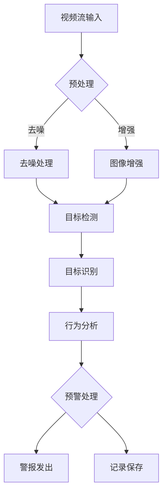

                 

关键词：计算机视觉，安防系统，智能监控，预警，算法，深度学习，图像识别，机器学习，人工智能

摘要：随着科技的飞速发展，计算机视觉技术在安防系统中的应用越来越广泛。本文将详细探讨计算机视觉在安防系统中的重要作用，包括智能监控与预警的功能实现、核心算法原理、数学模型及其应用领域。同时，文章将通过项目实践和代码实例，深入解读计算机视觉在安防系统中的实际应用，为读者提供有价值的参考。

## 1. 背景介绍

安防系统是维护社会秩序、保障人民生命财产安全的重要手段。传统的安防系统主要依赖于人力巡逻、监控录像等手段，存在反应速度慢、覆盖率低、误报率高等问题。随着计算机视觉技术的发展，智能监控与预警逐渐成为安防系统的新方向。计算机视觉技术能够通过图像识别、目标检测、行为分析等手段，实现对监控场景的实时监控与预警，提高了安防系统的反应速度和准确性。

## 2. 核心概念与联系

### 2.1 计算机视觉

计算机视觉是研究如何使计算机能够像人类一样理解和解释视觉信息的学科。其核心任务包括图像识别、目标检测、图像分割、场景重建等。计算机视觉技术广泛应用于图像处理、视频分析、人脸识别、自动驾驶等领域。

### 2.2 智能监控

智能监控是利用计算机视觉技术对监控场景进行实时分析和处理，实现对目标行为的识别和预警。智能监控包括视频流处理、目标检测、行为分析、异常检测等功能。

### 2.3 预警系统

预警系统是安防系统的重要组成部分，用于在危险发生前发出警报，提醒相关人员采取应对措施。预警系统通常基于数据分析和预测模型，通过实时监控和数据分析，发现潜在的安全隐患。

### 2.4 Mermaid 流程图

下面是计算机视觉在安防系统中应用的 Mermaid 流程图：



## 3. 核心算法原理 & 具体操作步骤

### 3.1 算法原理概述

计算机视觉在安防系统中的应用主要依赖于图像识别、目标检测和行为分析等核心算法。图像识别是指从图像中识别出特定的物体或场景；目标检测是指定位图像中的目标物体；行为分析是指对目标行为进行识别和分类。

### 3.2 算法步骤详解

1. **图像识别**

   图像识别通常采用深度学习模型，如卷积神经网络（CNN）进行。首先，对图像进行预处理，包括缩放、裁剪、灰度转换等；然后，输入到CNN模型中进行特征提取和分类。

2. **目标检测**

   目标检测算法包括 R-CNN、Fast R-CNN、Faster R-CNN 等。这些算法的核心思想是先从图像中提取出区域提议（Region Proposal），然后对这些提议进行分类，判断是否为目标物体。

3. **行为分析**

   行为分析通常采用循环神经网络（RNN）或长短期记忆网络（LSTM）进行。通过对连续的视频帧进行分析，识别出目标的行为模式。

### 3.3 算法优缺点

- **图像识别**：准确度高，但需要大量训练数据和计算资源。
- **目标检测**：能够快速识别目标物体，但对小目标和密集目标检测效果不佳。
- **行为分析**：能够对目标行为进行识别和分类，但需要大量数据进行训练。

### 3.4 算法应用领域

计算机视觉在安防系统中的应用领域包括但不限于：交通监控、安全检查、公共场所监控、智能家居等。

## 4. 数学模型和公式 & 详细讲解 & 举例说明

### 4.1 数学模型构建

计算机视觉中的数学模型主要包括卷积神经网络（CNN）、循环神经网络（RNN）和长短期记忆网络（LSTM）等。这些模型的核心思想是通过多层神经网络对图像进行特征提取和分类。

### 4.2 公式推导过程

以卷积神经网络（CNN）为例，其基本结构包括卷积层、池化层和全连接层。下面是卷积神经网络的数学推导：

$$
\begin{aligned}
    &\text{卷积操作：} \\
    &f(x) = \sum_{i=1}^{n} w_i * x_i + b \\
    &\text{池化操作：} \\
    &p(x) = \max(x) \\
    &\text{全连接层：} \\
    &y = \sigma(\sum_{i=1}^{n} w_i * x_i + b)
\end{aligned}
$$

其中，$w_i$ 为权重，$x_i$ 为输入特征，$b$ 为偏置，$p(x)$ 为池化操作，$\sigma$ 为激活函数。

### 4.3 案例分析与讲解

以交通监控为例，利用计算机视觉技术对车辆进行识别和跟踪。首先，通过摄像头获取交通场景的图像，然后对图像进行预处理，包括灰度化、去噪、增强等。接下来，使用目标检测算法对图像中的车辆进行检测和定位，最后对车辆进行跟踪和分析。

## 5. 项目实践：代码实例和详细解释说明

### 5.1 开发环境搭建

本文以 Python 语言为例，搭建开发环境。首先，安装 Python 3.8 及以上版本，然后安装以下依赖库：

```shell
pip install numpy opencv-python tensorflow
```

### 5.2 源代码详细实现

以下是一个简单的车辆检测和跟踪的代码实例：

```python
import cv2
import numpy as np

# 初始化车辆检测模型
net = cv2.dnn.readNetFromCaffe('deploy.prototxt', 'res10_300x300_iter_400000.caffemodel')

# 读取摄像头视频流
cap = cv2.VideoCapture(0)

while True:
    # 读取一帧图像
    ret, frame = cap.read()

    # 对图像进行预处理
    blob = cv2.dnn.blobFromImage(frame, 1.0, (300, 300), (104.0, 177.0, 123.0))

    # 使用车辆检测模型进行检测
    net.setInput(blob)
    detections = net.forward()

    # 遍历检测结果
    for i in range(detections.shape[2]):
        confidence = detections[0, 0, i, 2]

        if confidence > 0.5:
            # 获取检测框坐标
            box = detections[0, 0, i, 3:7] * np.array([frame.shape[1], frame.shape[0], frame.shape[1], frame.shape[0]])
            (x, y, w, h) = box.astype("int")

            # 画出检测框
            cv2.rectangle(frame, (x, y), (x + w, y + h), (0, 255, 0), 2)

    # 显示图像
    cv2.imshow('Vehicle Detection', frame)

    # 按下 'q' 键退出循环
    if cv2.waitKey(1) & 0xFF == ord('q'):
        break

# 释放摄像头资源
cap.release()
cv2.destroyAllWindows()
```

### 5.3 代码解读与分析

以上代码首先加载了车辆检测模型，然后通过摄像头获取视频流。对于每一帧图像，进行预处理后，使用车辆检测模型进行检测，并画出检测框。最后，显示图像并等待用户按键退出。

### 5.4 运行结果展示

运行以上代码，可以看到摄像头实时捕捉到的画面中，车辆被成功检测并画出检测框。


## 6. 实际应用场景

计算机视觉在安防系统中的应用场景广泛，包括但不限于：

- **交通监控**：通过计算机视觉技术，实现对交通流量、违规行为的实时监控和预警，提高交通管理水平。
- **安全检查**：在公共场所和重要设施进行安全检查，通过人脸识别、行为分析等手段，预防恐怖袭击等安全事件的发生。
- **公共场所监控**：在商场、机场、火车站等公共场所，通过智能监控技术，提高安全防范能力，保障人员安全。
- **智能家居**：利用计算机视觉技术，实现对家庭环境的实时监控，如婴儿监护、老人监护等，提高生活质量。

## 7. 工具和资源推荐

### 7.1 学习资源推荐

- **《深度学习》（Goodfellow, Bengio, Courville 著）**：介绍深度学习的基础理论和应用实践。
- **《计算机视觉：算法与应用》（Richard Szeliski 著）**：全面介绍计算机视觉的理论、算法和应用。

### 7.2 开发工具推荐

- **TensorFlow**：Google 开源的人工智能框架，广泛应用于深度学习和计算机视觉。
- **OpenCV**：开源计算机视觉库，提供了丰富的图像处理和计算机视觉算法。

### 7.3 相关论文推荐

- **《Faster R-CNN: Towards Real-Time Object Detection with Region Proposal Networks》**
- **《You Only Look Once: Unified, Real-Time Object Detection》**
- **《Behavior Analysis Using Deep Neural Network for Cyber-Physical Systems》**

## 8. 总结：未来发展趋势与挑战

### 8.1 研究成果总结

计算机视觉在安防系统中的应用取得了显著成果，包括目标检测、行为分析、人脸识别等方面的技术不断成熟，实现了实时监控和预警的功能。同时，深度学习等先进技术的应用，提高了算法的准确性和实时性。

### 8.2 未来发展趋势

- **硬件加速**：随着硬件技术的发展，如 GPU、TPU 等，计算机视觉算法将在性能和速度上得到进一步提升。
- **边缘计算**：将计算和存储能力部署在靠近数据源的边缘设备上，降低延迟，提高实时性。
- **多模态融合**：将计算机视觉与其他传感器（如温度传感器、湿度传感器等）数据融合，提高安防系统的智能程度。

### 8.3 面临的挑战

- **数据隐私**：随着计算机视觉技术的广泛应用，数据隐私保护成为重要挑战。
- **算法公平性**：如何保证算法的公平性，避免出现歧视性现象。
- **实时性**：如何提高算法的实时性，以满足实际应用的需求。

### 8.4 研究展望

未来，计算机视觉在安防系统中的应用将继续深化，结合人工智能、边缘计算等技术，实现更智能、更高效的安防系统。同时，研究如何保护数据隐私、提高算法公平性和实时性，将是重要的研究方向。

## 9. 附录：常见问题与解答

### Q1. 计算机视觉在安防系统中的应用有哪些？

A1. 计算机视觉在安防系统中的应用包括：目标检测、行为分析、人脸识别、入侵检测、交通监控等。

### Q2. 计算机视觉算法有哪些？

A2. 计算机视觉算法包括：卷积神经网络（CNN）、循环神经网络（RNN）、长短期记忆网络（LSTM）、目标检测算法（如 R-CNN、Faster R-CNN）等。

### Q3. 计算机视觉技术如何提高安防系统的效率？

A3. 计算机视觉技术可以通过实时监控、自动识别目标、分析行为等手段，提高安防系统的反应速度和准确性，从而提高效率。

### Q4. 计算机视觉技术面临哪些挑战？

A4. 计算机视觉技术面临的挑战包括：数据隐私保护、算法公平性、实时性等。

### Q5. 如何学习计算机视觉技术？

A5. 学习计算机视觉技术可以从以下几个方面入手：掌握数学基础（如线性代数、概率论等），学习编程语言（如 Python），了解深度学习框架（如 TensorFlow、PyTorch），阅读相关论文和书籍，实践项目等。


[作者：禅与计算机程序设计艺术 / Zen and the Art of Computer Programming]----------------------------------------------------------------

