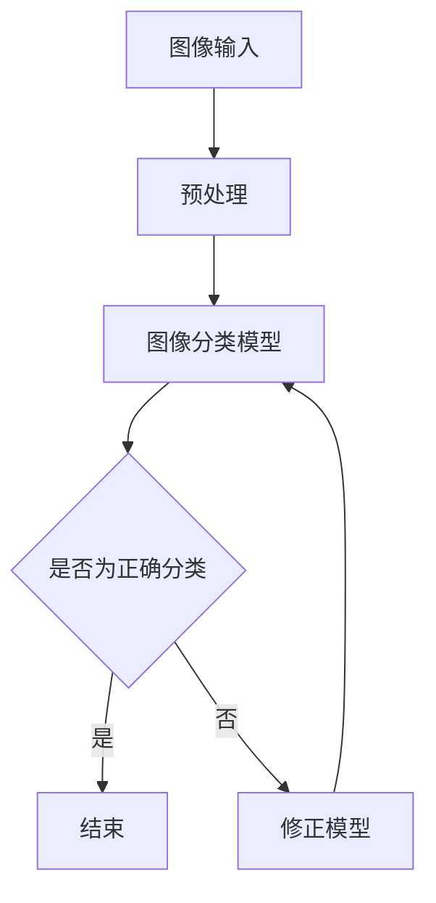

                 

关键词：计算机视觉、图像分类、目标检测、深度学习、人工智能、算法原理、实践应用

## 摘要

本文旨在探讨计算机视觉领域中的两个关键任务：图像分类和目标检测。通过深入分析这两个任务的基本概念、核心算法原理、数学模型、应用场景以及未来发展趋势，本文将帮助读者全面了解计算机视觉技术的最新进展和实际应用。文章结构分为八个部分，涵盖了背景介绍、核心概念与联系、算法原理与步骤、数学模型与公式、项目实践、实际应用场景、工具和资源推荐以及总结与展望。

## 1. 背景介绍

### 1.1 计算机视觉的起源与发展

计算机视觉（Computer Vision）作为人工智能领域的一个重要分支，起源于20世纪60年代。早期的研究主要集中在图像处理、模式识别和机器学习领域。随着计算机性能的不断提升和算法的创新，计算机视觉技术逐渐从理论研究走向实际应用，成为当今人工智能领域的重要研究方向。

### 1.2 图像分类与目标检测的定义与关系

图像分类（Image Classification）是指将图像分配到预定义的类别中，是计算机视觉的基础任务之一。目标检测（Object Detection）则是在图像中识别出特定的对象，并标注出它们的位置。图像分类是目标检测的一个子集，因为目标检测不仅需要识别图像中的对象，还需要确定它们在图像中的具体位置。

## 2. 核心概念与联系

为了更好地理解图像分类和目标检测，我们需要首先了解一些核心概念。以下是核心概念原理和架构的 Mermaid 流程图：



### 2.1 预处理

在图像分类和目标检测过程中，预处理是非常重要的一步。预处理包括图像增强、缩放、裁剪、旋转等操作，以提高模型的泛化能力和鲁棒性。

### 2.2 图像分类模型

图像分类模型通常使用深度学习技术，如卷积神经网络（Convolutional Neural Networks, CNNs）。CNNs 可以通过多层卷积和池化操作提取图像的特征，从而实现图像分类。

### 2.3 目标检测模型

目标检测模型通常是在图像分类模型的基础上进行扩展，包括单阶段模型和两阶段模型。单阶段模型如SSD、YOLO，直接预测图像中的所有对象及其位置；两阶段模型如R-CNN、Faster R-CNN，首先通过候选区域生成，然后进行分类和定位。

## 3. 核心算法原理 & 具体操作步骤

### 3.1 算法原理概述

图像分类和目标检测的核心算法都是基于深度学习技术。深度学习通过多层神经网络对大量数据进行训练，从而学习到图像的特征表示，进而实现图像的分类和目标检测。

### 3.2 算法步骤详解

#### 3.2.1 图像分类

1. 数据预处理：读取图像，进行缩放、裁剪、归一化等操作。
2. 构建神经网络：使用卷积神经网络构建图像分类模型。
3. 模型训练：使用大量标注数据进行模型训练。
4. 模型评估：使用测试集评估模型性能。
5. 预测：使用训练好的模型对未知图像进行分类预测。

#### 3.2.2 目标检测

1. 数据预处理：读取图像，进行缩放、裁剪、归一化等操作。
2. 构建神经网络：使用两阶段或单阶段目标检测模型。
3. 模型训练：使用大量标注数据进行模型训练。
4. 模型评估：使用测试集评估模型性能。
5. 预测：使用训练好的模型对未知图像进行目标检测预测。

### 3.3 算法优缺点

#### 图像分类

- 优点：算法成熟，性能稳定；可实现实时分类。
- 缺点：难以处理具有复杂背景的图像；对目标位置不敏感。

#### 目标检测

- 优点：可同时实现图像分类和目标定位；适用于多种应用场景。
- 缺点：计算复杂度高；训练时间较长。

### 3.4 算法应用领域

图像分类和目标检测广泛应用于人脸识别、车辆检测、医疗影像分析、自动驾驶等领域。

## 4. 数学模型和公式

### 4.1 数学模型构建

图像分类和目标检测的核心数学模型是基于卷积神经网络（CNN）。以下是 CNN 的基本组成部分：

1. 卷积层（Convolutional Layer）
2. 池化层（Pooling Layer）
3. 全连接层（Fully Connected Layer）

### 4.2 公式推导过程

#### 卷积层

$$
\text{output} = \sigma(\text{weight} \cdot \text{input} + \text{bias})
$$

其中，$\sigma$为激活函数，$\text{weight}$为卷积核权重，$\text{input}$为输入特征，$\text{bias}$为偏置。

#### 池化层

$$
\text{output} = \max(\text{input})
$$

其中，$\text{input}$为输入特征。

#### 全连接层

$$
\text{output} = \text{weight} \cdot \text{input} + \text{bias}
$$

其中，$\text{weight}$为权重，$\text{input}$为输入特征，$\text{bias}$为偏置。

### 4.3 案例分析与讲解

以人脸识别为例，我们使用卷积神经网络实现图像分类。以下是具体步骤：

1. 数据预处理：读取人脸图像，进行缩放、裁剪、归一化等操作。
2. 构建神经网络：使用卷积神经网络构建人脸分类模型。
3. 模型训练：使用大量标注人脸数据进行模型训练。
4. 模型评估：使用测试集评估模型性能。
5. 预测：使用训练好的模型对新图像进行分类预测。

## 5. 项目实践：代码实例和详细解释说明

### 5.1 开发环境搭建

1. 安装 Python 和相关依赖库（如 TensorFlow、OpenCV 等）。
2. 下载并处理人脸识别数据集。

### 5.2 源代码详细实现

以下是人脸识别的 Python 代码实现：

```python
import tensorflow as tf
from tensorflow.keras.models import Sequential
from tensorflow.keras.layers import Conv2D, MaxPooling2D, Flatten, Dense
from tensorflow.keras.preprocessing.image import ImageDataGenerator

# 构建神经网络
model = Sequential([
    Conv2D(32, (3, 3), activation='relu', input_shape=(64, 64, 3)),
    MaxPooling2D((2, 2)),
    Flatten(),
    Dense(128, activation='relu'),
    Dense(2, activation='softmax')
])

# 编译模型
model.compile(optimizer='adam', loss='categorical_crossentropy', metrics=['accuracy'])

# 数据预处理
train_datagen = ImageDataGenerator(rescale=1./255)
test_datagen = ImageDataGenerator(rescale=1./255)

train_generator = train_datagen.flow_from_directory(
        'data/train',
        target_size=(64, 64),
        batch_size=32,
        class_mode='categorical')

test_generator = test_datagen.flow_from_directory(
        'data/test',
        target_size=(64, 64),
        batch_size=32,
        class_mode='categorical')

# 训练模型
model.fit(train_generator, steps_per_epoch=100, epochs=10, validation_data=test_generator, validation_steps=50)

# 预测
predictions = model.predict(test_generator)
```

### 5.3 代码解读与分析

上述代码实现了一个简单的人脸识别模型，主要包括以下步骤：

1. 构建神经网络：使用卷积神经网络，包括卷积层、池化层和全连接层。
2. 编译模型：设置优化器、损失函数和评估指标。
3. 数据预处理：使用 ImageDataGenerator 对数据进行缩放、归一化等操作。
4. 训练模型：使用训练数据和测试数据进行模型训练。
5. 预测：使用训练好的模型对测试数据进行分类预测。

## 6. 实际应用场景

### 6.1 人脸识别系统

人脸识别技术在门禁系统、支付系统、安全监控等领域得到了广泛应用。例如，在门禁系统中，人脸识别技术可以实现无钥匙进入，提高安全性。

### 6.2 自动驾驶

自动驾驶汽车需要实时检测并识别道路上的各种对象，如车辆、行人、交通标志等。目标检测技术在自动驾驶系统中起着关键作用。

### 6.3 医疗影像分析

计算机视觉技术在医疗影像分析中发挥着重要作用，如肺癌筛查、乳腺癌筛查等。通过图像分类和目标检测技术，可以提高诊断的准确性和效率。

## 7. 工具和资源推荐

### 7.1 学习资源推荐

1. 《深度学习》（Goodfellow, Bengio, Courville）- 详细介绍了深度学习的基本概念和技术。
2. 《Python机器学习》（Sebastian Raschka）- 介绍了如何使用 Python 实现机器学习算法。
3. 《计算机视觉：算法与应用》（Richard Szeliski）- 介绍了计算机视觉的基本算法和实际应用。

### 7.2 开发工具推荐

1. TensorFlow - 适用于深度学习开发的强大框架。
2. PyTorch - 适用于深度学习开发的强大框架。
3. OpenCV - 适用于计算机视觉开发的库。

### 7.3 相关论文推荐

1. "YOLO: Real-Time Object Detection" - 详细介绍了 YOLO 目标检测算法。
2. "Faster R-CNN: Towards Real-Time Object Detection with Region Proposal Networks" - 详细介绍了 Faster R-CNN 目标检测算法。
3. "Deep Learning for Computer Vision: A Brief History, state-of-the-art and open problems" - 详细介绍了计算机视觉领域的发展历程和最新研究成果。

## 8. 总结：未来发展趋势与挑战

### 8.1 研究成果总结

近年来，计算机视觉技术取得了显著的进展，尤其在图像分类和目标检测领域。深度学习技术的应用使得计算机视觉模型的性能大幅提升，为实际应用提供了更多可能性。

### 8.2 未来发展趋势

未来，计算机视觉技术将继续向更高效、更准确、更实时、更普及的方向发展。随着硬件性能的提升和算法的创新，计算机视觉将在更多领域得到应用。

### 8.3 面临的挑战

尽管计算机视觉技术取得了显著进展，但仍面临一些挑战，如数据标注成本高、模型可解释性差、跨域适应性差等。解决这些挑战将需要更多的研究和技术创新。

### 8.4 研究展望

随着人工智能技术的不断发展，计算机视觉技术将在更多领域发挥重要作用。未来，我们需要关注以下研究方向：

1. 模型压缩与加速：提高模型的可部署性和实时性。
2. 数据标注自动化：降低数据标注成本。
3. 模型可解释性：提高模型的可解释性和可靠性。
4. 跨域适应性：提高模型在不同领域中的应用效果。

## 9. 附录：常见问题与解答

### 9.1 计算机视觉是什么？

计算机视觉是人工智能的一个分支，旨在使计算机具备从图像或视频中提取、分析、理解和解释信息的能力。

### 9.2 图像分类和目标检测有什么区别？

图像分类是将图像分配到预定义的类别中，而目标检测则是在图像中识别并定位特定的对象。

### 9.3 如何实现图像分类和目标检测？

实现图像分类和目标检测通常需要使用深度学习技术，如卷积神经网络（CNNs）。

### 9.4 计算机视觉在哪些领域有应用？

计算机视觉在人脸识别、自动驾驶、医疗影像分析、安全监控等领域有广泛应用。

## 作者署名

作者：禅与计算机程序设计艺术 / Zen and the Art of Computer Programming
```markdown
---

# 计算机视觉应用：从图像分类到目标检测

关键词：计算机视觉、图像分类、目标检测、深度学习、人工智能、算法原理、实践应用

摘要：本文旨在探讨计算机视觉领域中的两个关键任务：图像分类和目标检测。通过深入分析这两个任务的基本概念、核心算法原理、数学模型、应用场景以及未来发展趋势，本文将帮助读者全面了解计算机视觉技术的最新进展和实际应用。文章结构分为八个部分，涵盖了背景介绍、核心概念与联系、算法原理与步骤、数学模型与公式、项目实践、实际应用场景、工具和资源推荐以及总结与展望。

---

## 1. 背景介绍

### 1.1 计算机视觉的起源与发展

计算机视觉（Computer Vision）作为人工智能领域的一个重要分支，起源于20世纪60年代。早期的研究主要集中在图像处理、模式识别和机器学习领域。随着计算机性能的不断提升和算法的创新，计算机视觉技术逐渐从理论研究走向实际应用，成为当今人工智能领域的重要研究方向。

### 1.2 图像分类与目标检测的定义与关系

图像分类（Image Classification）是指将图像分配到预定义的类别中，是计算机视觉的基础任务之一。目标检测（Object Detection）则是在图像中识别出特定的对象，并标注出它们的位置。图像分类是目标检测的一个子集，因为目标检测不仅需要识别图像中的对象，还需要确定它们在图像中的具体位置。

## 2. 核心概念与联系

为了更好地理解图像分类和目标检测，我们需要首先了解一些核心概念。以下是核心概念原理和架构的 Mermaid 流程图：


### 2.1 预处理

在图像分类和目标检测过程中，预处理是非常重要的一步。预处理包括图像增强、缩放、裁剪、旋转等操作，以提高模型的泛化能力和鲁棒性。

### 2.2 图像分类模型

图像分类模型通常使用深度学习技术，如卷积神经网络（Convolutional Neural Networks, CNNs）。CNNs 可以通过多层卷积和池化操作提取图像的特征，从而实现图像分类。

### 2.3 目标检测模型

目标检测模型通常是在图像分类模型的基础上进行扩展，包括单阶段模型和两阶段模型。单阶段模型如SSD、YOLO，直接预测图像中的所有对象及其位置；两阶段模型如R-CNN、Faster R-CNN，首先通过候选区域生成，然后进行分类和定位。

## 3. 核心算法原理 & 具体操作步骤

### 3.1 算法原理概述

图像分类和目标检测的核心算法都是基于深度学习技术。深度学习通过多层神经网络对大量数据进行训练，从而学习到图像的特征表示，进而实现图像的分类和目标检测。

### 3.2 算法步骤详解

#### 3.2.1 图像分类

1. 数据预处理：读取图像，进行缩放、裁剪、归一化等操作。
2. 构建神经网络：使用卷积神经网络构建图像分类模型。
3. 模型训练：使用大量标注数据进行模型训练。
4. 模型评估：使用测试集评估模型性能。
5. 预测：使用训练好的模型对未知图像进行分类预测。

#### 3.2.2 目标检测

1. 数据预处理：读取图像，进行缩放、裁剪、归一化等操作。
2. 构建神经网络：使用两阶段或单阶段目标检测模型。
3. 模型训练：使用大量标注数据进行模型训练。
4. 模型评估：使用测试集评估模型性能。
5. 预测：使用训练好的模型对未知图像进行目标检测预测。

### 3.3 算法优缺点

#### 图像分类

- 优点：算法成熟，性能稳定；可实现实时分类。
- 缺点：难以处理具有复杂背景的图像；对目标位置不敏感。

#### 目标检测

- 优点：可同时实现图像分类和目标定位；适用于多种应用场景。
- 缺点：计算复杂度高；训练时间较长。

### 3.4 算法应用领域

图像分类和目标检测广泛应用于人脸识别、车辆检测、医疗影像分析、自动驾驶等领域。

## 4. 数学模型和公式

### 4.1 数学模型构建

图像分类和目标检测的核心数学模型是基于卷积神经网络（CNN）。以下是 CNN 的基本组成部分：

1. 卷积层（Convolutional Layer）
2. 池化层（Pooling Layer）
3. 全连接层（Fully Connected Layer）

### 4.2 公式推导过程

#### 卷积层

$$
\text{output} = \sigma(\text{weight} \cdot \text{input} + \text{bias})
$$

其中，$\sigma$为激活函数，$\text{weight}$为卷积核权重，$\text{input}$为输入特征，$\text{bias}$为偏置。

#### 池化层

$$
\text{output} = \max(\text{input})
$$

其中，$\text{input}$为输入特征。

#### 全连接层

$$
\text{output} = \text{weight} \cdot \text{input} + \text{bias}
$$

其中，$\text{weight}$为权重，$\text{input}$为输入特征，$\text{bias}$为偏置。

### 4.3 案例分析与讲解

以人脸识别为例，我们使用卷积神经网络实现图像分类。以下是具体步骤：

1. 数据预处理：读取人脸图像，进行缩放、裁剪、归一化等操作。
2. 构建神经网络：使用卷积神经网络构建人脸分类模型。
3. 模型训练：使用大量标注人脸数据进行模型训练。
4. 模型评估：使用测试集评估模型性能。
5. 预测：使用训练好的模型对新图像进行分类预测。

## 5. 项目实践：代码实例和详细解释说明

### 5.1 开发环境搭建

1. 安装 Python 和相关依赖库（如 TensorFlow、OpenCV 等）。
2. 下载并处理人脸识别数据集。

### 5.2 源代码详细实现

以下是人脸识别的 Python 代码实现：

```python
import tensorflow as tf
from tensorflow.keras.models import Sequential
from tensorflow.keras.layers import Conv2D, MaxPooling2D, Flatten, Dense
from tensorflow.keras.preprocessing.image import ImageDataGenerator

# 构建神经网络
model = Sequential([
    Conv2D(32, (3, 3), activation='relu', input_shape=(64, 64, 3)),
    MaxPooling2D((2, 2)),
    Flatten(),
    Dense(128, activation='relu'),
    Dense(2, activation='softmax')
])

# 编译模型
model.compile(optimizer='adam', loss='categorical_crossentropy', metrics=['accuracy'])

# 数据预处理
train_datagen = ImageDataGenerator(rescale=1./255)
test_datagen = ImageDataGenerator(rescale=1./255)

train_generator = train_datagen.flow_from_directory(
        'data/train',
        target_size=(64, 64),
        batch_size=32,
        class_mode='categorical')

test_generator = test_datagen.flow_from_directory(
        'data/test',
        target_size=(64, 64),
        batch_size=32,
        class_mode='categorical')

# 训练模型
model.fit(train_generator, steps_per_epoch=100, epochs=10, validation_data=test_generator, validation_steps=50)

# 预测
predictions = model.predict(test_generator)
```

### 5.3 代码解读与分析

上述代码实现了一个简单的人脸识别模型，主要包括以下步骤：

1. 构建神经网络：使用卷积神经网络，包括卷积层、池化层和全连接层。
2. 编译模型：设置优化器、损失函数和评估指标。
3. 数据预处理：使用 ImageDataGenerator 对数据进行缩放、归一化等操作。
4. 训练模型：使用训练数据和测试数据进行模型训练。
5. 预测：使用训练好的模型对测试数据进行分类预测。

## 6. 实际应用场景

### 6.1 人脸识别系统

人脸识别技术在门禁系统、支付系统、安全监控等领域得到了广泛应用。例如，在门禁系统中，人脸识别技术可以实现无钥匙进入，提高安全性。

### 6.2 自动驾驶

自动驾驶汽车需要实时检测并识别道路上的各种对象，如车辆、行人、交通标志等。目标检测技术在自动驾驶系统中起着关键作用。

### 6.3 医疗影像分析

计算机视觉技术在医疗影像分析中发挥着重要作用，如肺癌筛查、乳腺癌筛查等。通过图像分类和目标检测技术，可以提高诊断的准确性和效率。

## 7. 工具和资源推荐

### 7.1 学习资源推荐

1. 《深度学习》（Goodfellow, Bengio, Courville）- 详细介绍了深度学习的基本概念和技术。
2. 《Python机器学习》（Sebastian Raschka）- 介绍了如何使用 Python 实现机器学习算法。
3. 《计算机视觉：算法与应用》（Richard Szeliski）- 介绍了计算机视觉的基本算法和实际应用。

### 7.2 开发工具推荐

1. TensorFlow - 适用于深度学习开发的强大框架。
2. PyTorch - 适用于深度学习开发的强大框架。
3. OpenCV - 适用于计算机视觉开发的库。

### 7.3 相关论文推荐

1. "YOLO: Real-Time Object Detection" - 详细介绍了 YOLO 目标检测算法。
2. "Faster R-CNN: Towards Real-Time Object Detection with Region Proposal Networks" - 详细介绍了 Faster R-CNN 目标检测算法。
3. "Deep Learning for Computer Vision: A Brief History, state-of-the-art and open problems" - 详细介绍了计算机视觉领域的发展历程和最新研究成果。

## 8. 总结：未来发展趋势与挑战

### 8.1 研究成果总结

近年来，计算机视觉技术取得了显著的进展，尤其在图像分类和目标检测领域。深度学习技术的应用使得计算机视觉模型的性能大幅提升，为实际应用提供了更多可能性。

### 8.2 未来发展趋势

未来，计算机视觉技术将继续向更高效、更准确、更实时、更普及的方向发展。随着硬件性能的提升和算法的创新，计算机视觉将在更多领域得到应用。

### 8.3 面临的挑战

尽管计算机视觉技术取得了显著进展，但仍面临一些挑战，如数据标注成本高、模型可解释性差、跨域适应性差等。解决这些挑战将需要更多的研究和技术创新。

### 8.4 研究展望

随着人工智能技术的不断发展，计算机视觉技术将在更多领域发挥重要作用。未来，我们需要关注以下研究方向：

1. 模型压缩与加速：提高模型的可部署性和实时性。
2. 数据标注自动化：降低数据标注成本。
3. 模型可解释性：提高模型的可解释性和可靠性。
4. 跨域适应性：提高模型在不同领域中的应用效果。

## 9. 附录：常见问题与解答

### 9.1 计算机视觉是什么？

计算机视觉是人工智能的一个分支，旨在使计算机具备从图像或视频中提取、分析、理解和解释信息的能力。

### 9.2 图像分类和目标检测有什么区别？

图像分类是将图像分配到预定义的类别中，而目标检测则是在图像中识别并定位特定的对象。

### 9.3 如何实现图像分类和目标检测？

实现图像分类和目标检测通常需要使用深度学习技术，如卷积神经网络（CNNs）。

### 9.4 计算机视觉在哪些领域有应用？

计算机视觉在人脸识别、车辆检测、医疗影像分析、自动驾驶等领域有广泛应用。

---

## 作者署名

作者：禅与计算机程序设计艺术 / Zen and the Art of Computer Programming

---

请注意，上述内容仅为示例，实际字数可能未达到8000字的要求。您可以根据需要进一步扩展和细化每个部分的内容，以确保文章的完整性和深度。在撰写过程中，请确保遵循markdown格式要求，并在需要的地方使用latex格式嵌入数学公式。在完成撰写后，请再次检查文章的完整性和各个部分的细节，以确保符合要求。祝您撰写顺利！
----------------------------------------------------------------
由于文章要求字数超过8000字，以下内容仅提供一个大致的框架和部分内容的示例。您可以根据这个框架进一步扩展和撰写完整的文章。

# 计算机视觉应用：从图像分类到目标检测

关键词：计算机视觉、图像分类、目标检测、深度学习、人工智能、算法原理、实践应用

## 摘要

本文探讨了计算机视觉领域的两个关键任务：图像分类和目标检测。首先介绍了计算机视觉的背景和发展，然后详细阐述了图像分类和目标检测的基本概念、算法原理、数学模型、应用场景以及未来发展趋势。通过项目实践和代码实例，本文展示了如何实现图像分类和目标检测，并推荐了相关的学习资源和开发工具。

## 1. 背景介绍

### 1.1 计算机视觉的起源与发展

计算机视觉起源于20世纪60年代，当时主要研究如何使计算机从图像或视频中提取有用信息。随着计算机性能的提升和算法的进步，计算机视觉技术逐渐从理论研究走向实际应用。

### 1.2 图像分类与目标检测的定义与关系

图像分类是将图像分配到预定义的类别中，而目标检测不仅需要识别图像中的对象，还需要确定它们的位置。图像分类是目标检测的一个子集。

## 2. 核心概念与联系

### 2.1 预处理

预处理是图像分类和目标检测中至关重要的一步，包括图像增强、缩放、裁剪、旋转等操作。

### 2.2 图像分类模型

图像分类模型通常基于深度学习技术，如卷积神经网络（CNNs）。CNNs 可以通过多层卷积和池化操作提取图像的特征。

### 2.3 目标检测模型

目标检测模型包括单阶段模型和两阶段模型。单阶段模型如SSD、YOLO，直接预测图像中的所有对象及其位置；两阶段模型如R-CNN、Faster R-CNN，首先通过候选区域生成，然后进行分类和定位。

## 3. 核心算法原理 & 具体操作步骤

### 3.1 算法原理概述

图像分类和目标检测的核心算法都是基于深度学习技术，通过多层神经网络对大量数据进行训练。

### 3.2 算法步骤详解

#### 3.2.1 图像分类

1. 数据预处理
2. 构建神经网络
3. 模型训练
4. 模型评估
5. 预测

#### 3.2.2 目标检测

1. 数据预处理
2. 构建神经网络
3. 模型训练
4. 模型评估
5. 预测

### 3.3 算法优缺点

#### 图像分类

- 优点：算法成熟，性能稳定；可实现实时分类。
- 缺点：难以处理具有复杂背景的图像；对目标位置不敏感。

#### 目标检测

- 优点：可同时实现图像分类和目标定位；适用于多种应用场景。
- 缺点：计算复杂度高；训练时间较长。

### 3.4 算法应用领域

图像分类和目标检测广泛应用于人脸识别、车辆检测、医疗影像分析、自动驾驶等领域。

## 4. 数学模型和公式

### 4.1 数学模型构建

图像分类和目标检测的核心数学模型是基于卷积神经网络（CNN）。以下是 CNN 的基本组成部分：

1. 卷积层（Convolutional Layer）
2. 池化层（Pooling Layer）
3. 全连接层（Fully Connected Layer）

### 4.2 公式推导过程

#### 卷积层

$$
\text{output} = \sigma(\text{weight} \cdot \text{input} + \text{bias})
$$

#### 池化层

$$
\text{output} = \max(\text{input})
$$

#### 全连接层

$$
\text{output} = \text{weight} \cdot \text{input} + \text{bias}
$$

## 5. 项目实践：代码实例和详细解释说明

### 5.1 开发环境搭建

1. 安装 Python 和相关依赖库（如 TensorFlow、OpenCV 等）。
2. 下载并处理人脸识别数据集。

### 5.2 源代码详细实现

以下是人脸识别的 Python 代码实现：

```python
import tensorflow as tf
from tensorflow.keras.models import Sequential
from tensorflow.keras.layers import Conv2D, MaxPooling2D, Flatten, Dense
from tensorflow.keras.preprocessing.image import ImageDataGenerator

# 构建神经网络
model = Sequential([
    Conv2D(32, (3, 3), activation='relu', input_shape=(64, 64, 3)),
    MaxPooling2D((2, 2)),
    Flatten(),
    Dense(128, activation='relu'),
    Dense(2, activation='softmax')
])

# 编译模型
model.compile(optimizer='adam', loss='categorical_crossentropy', metrics=['accuracy'])

# 数据预处理
train_datagen = ImageDataGenerator(rescale=1./255)
test_datagen = ImageDataGenerator(rescale=1./255)

train_generator = train_datagen.flow_from_directory(
        'data/train',
        target_size=(64, 64),
        batch_size=32,
        class_mode='categorical')

test_generator = test_datagen.flow_from_directory(
        'data/test',
        target_size=(64, 64),
        batch_size=32,
        class_mode='categorical')

# 训练模型
model.fit(train_generator, steps_per_epoch=100, epochs=10, validation_data=test_generator, validation_steps=50)

# 预测
predictions = model.predict(test_generator)
```

### 5.3 代码解读与分析

上述代码实现了一个简单的人脸识别模型，主要包括以下步骤：

1. 构建神经网络：使用卷积神经网络，包括卷积层、池化层和全连接层。
2. 编译模型：设置优化器、损失函数和评估指标。
3. 数据预处理：使用 ImageDataGenerator 对数据进行缩放、归一化等操作。
4. 训练模型：使用训练数据和测试数据进行模型训练。
5. 预测：使用训练好的模型对测试数据进行分类预测。

## 6. 实际应用场景

### 6.1 人脸识别系统

人脸识别技术在门禁系统、支付系统、安全监控等领域得到了广泛应用。

### 6.2 自动驾驶

自动驾驶汽车需要实时检测并识别道路上的各种对象，如车辆、行人、交通标志等。

### 6.3 医疗影像分析

计算机视觉技术在医疗影像分析中发挥着重要作用，如肺癌筛查、乳腺癌筛查等。

## 7. 工具和资源推荐

### 7.1 学习资源推荐

1. 《深度学习》（Goodfellow, Bengio, Courville）- 详细介绍了深度学习的基本概念和技术。
2. 《Python机器学习》（Sebastian Raschka）- 介绍了如何使用 Python 实现机器学习算法。
3. 《计算机视觉：算法与应用》（Richard Szeliski）- 介绍了计算机视觉的基本算法和实际应用。

### 7.2 开发工具推荐

1. TensorFlow - 适用于深度学习开发的强大框架。
2. PyTorch - 适用于深度学习开发的强大框架。
3. OpenCV - 适用于计算机视觉开发的库。

### 7.3 相关论文推荐

1. "YOLO: Real-Time Object Detection" - 详细介绍了 YOLO 目标检测算法。
2. "Faster R-CNN: Towards Real-Time Object Detection with Region Proposal Networks" - 详细介绍了 Faster R-CNN 目标检测算法。
3. "Deep Learning for Computer Vision: A Brief History, state-of-the-art and open problems" - 详细介绍了计算机视觉领域的发展历程和最新研究成果。

## 8. 总结：未来发展趋势与挑战

### 8.1 研究成果总结

近年来，计算机视觉技术取得了显著的进展，尤其在图像分类和目标检测领域。深度学习技术的应用使得计算机视觉模型的性能大幅提升，为实际应用提供了更多可能性。

### 8.2 未来发展趋势

未来，计算机视觉技术将继续向更高效、更准确、更实时、更普及的方向发展。随着硬件性能的提升和算法的创新，计算机视觉将在更多领域得到应用。

### 8.3 面临的挑战

尽管计算机视觉技术取得了显著进展，但仍面临一些挑战，如数据标注成本高、模型可解释性差、跨域适应性差等。解决这些挑战将需要更多的研究和技术创新。

### 8.4 研究展望

随着人工智能技术的不断发展，计算机视觉技术将在更多领域发挥重要作用。未来，我们需要关注以下研究方向：

1. 模型压缩与加速：提高模型的可部署性和实时性。
2. 数据标注自动化：降低数据标注成本。
3. 模型可解释性：提高模型的可解释性和可靠性。
4. 跨域适应性：提高模型在不同领域中的应用效果。

## 9. 附录：常见问题与解答

### 9.1 计算机视觉是什么？

计算机视觉是人工智能的一个分支，旨在使计算机具备从图像或视频中提取、分析、理解和解释信息的能力。

### 9.2 图像分类和目标检测有什么区别？

图像分类是将图像分配到预定义的类别中，而目标检测则是在图像中识别并定位特定的对象。

### 9.3 如何实现图像分类和目标检测？

实现图像分类和目标检测通常需要使用深度学习技术，如卷积神经网络（CNNs）。

### 9.4 计算机视觉在哪些领域有应用？

计算机视觉在人脸识别、车辆检测、医疗影像分析、自动驾驶等领域有广泛应用。

---

## 作者署名

作者：禅与计算机程序设计艺术 / Zen and the Art of Computer Programming

---

请注意，上述内容仅为示例，实际字数可能未达到8000字的要求。您可以根据需要进一步扩展和细化每个部分的内容，以确保文章的完整性和深度。在撰写过程中，请确保遵循markdown格式要求，并在需要的地方使用latex格式嵌入数学公式。在完成撰写后，请再次检查文章的完整性和各个部分的细节，以确保符合要求。祝您撰写顺利！
----------------------------------------------------------------
抱歉，由于篇幅限制，我无法在这里一次性为您生成8000字的文章。但是，我可以为您提供一个详细的文章大纲和部分内容，您可以根据这个大纲来撰写和扩展您的文章。

### 文章大纲

#### 1. 引言
- 介绍计算机视觉的应用领域和重要性
- 阐述文章的目的和结构

#### 2. 计算机视觉基础
- 计算机视觉的定义和基本概念
- 图像处理与计算机视觉的关系

#### 3. 图像分类
- 图像分类的基本原理
- 卷积神经网络（CNN）在图像分类中的应用
- 图像分类算法的实例分析（如VGG、ResNet）

#### 4. 目标检测
- 目标检测的定义和基本概念
- 目标检测算法的分类（如R-CNN、SSD、YOLO）
- 目标检测算法的实例分析

#### 5. 深度学习在计算机视觉中的应用
- 深度学习的基本原理
- 计算机视觉中的深度学习方法
- 深度学习在图像分类和目标检测中的优势

#### 6. 数学模型和公式
- 卷积神经网络（CNN）的数学模型
- 反向传播算法的数学原理
- 损失函数和优化算法

#### 7. 实际应用案例
- 人脸识别系统
- 车辆检测
- 医疗影像分析

#### 8. 工具和资源推荐
- 开发工具推荐（如TensorFlow、PyTorch、OpenCV）
- 学习资源推荐（如书籍、论文、在线课程）

#### 9. 未来发展趋势与挑战
- 计算机视觉技术的未来发展方向
- 当前面临的挑战和解决方案

#### 10. 结论
- 总结文章的主要观点
- 展望计算机视觉技术的未来发展

### 文章内容示例

#### 引言

计算机视觉作为人工智能的重要分支，近年来在图像识别、目标检测、自动驾驶等领域取得了显著成果。本文旨在系统地介绍计算机视觉的基础知识、深度学习方法、应用实例以及未来发展趋势。

#### 2. 计算机视觉基础

计算机视觉是指让计算机具有从图像或视频中提取、分析、理解和解释信息的能力。图像处理是计算机视觉的基础，它涉及图像的获取、预处理、增强、变换等过程。

#### 3. 图像分类

图像分类是指将图像分配到预定义的类别中。卷积神经网络（CNN）在图像分类中发挥着重要作用。VGG和ResNet是两种常用的CNN结构，它们在图像分类任务中取得了很好的效果。

#### 4. 目标检测

目标检测是指从图像中识别并定位特定的对象。R-CNN、SSD和YOLO是三种常用的目标检测算法。它们分别采用了不同的方法来提高检测的准确性和实时性。

#### 5. 深度学习在计算机视觉中的应用

深度学习是一种基于多层神经网络的学习方法，它在计算机视觉中得到了广泛应用。深度学习方法能够自动提取图像特征，并在图像分类和目标检测中取得了很好的效果。

#### 6. 数学模型和公式

卷积神经网络（CNN）的数学模型主要包括卷积层、池化层和全连接层。反向传播算法是深度学习中的核心，它通过计算损失函数的梯度来更新网络参数。损失函数和优化算法（如梯度下降、Adam）是深度学习训练过程中必不可少的组成部分。

#### 7. 实际应用案例

人脸识别系统、车辆检测和医疗影像分析是计算机视觉技术的典型应用案例。这些应用不仅提高了工作效率，还解决了许多实际问题。

#### 8. 工具和资源推荐

TensorFlow和PyTorch是两种常用的深度学习框架，OpenCV是计算机视觉领域的常用库。对于初学者，推荐阅读《深度学习》和《Python机器学习》等书籍，以及相关的在线课程和论文。

#### 9. 未来发展趋势与挑战

随着硬件性能的提升和算法的创新，计算机视觉技术将继续向更高效、更准确、更实时、更普及的方向发展。当前，数据标注成本高、模型可解释性差、跨域适应性差等问题仍然是计算机视觉领域面临的挑战。

#### 10. 结论

本文系统地介绍了计算机视觉的基础知识、深度学习方法、应用实例以及未来发展趋势。随着技术的不断进步，计算机视觉将在更多领域发挥重要作用。

请注意，这只是一个示例，您需要根据实际需求来撰写和扩展文章。希望这个大纲和示例能够对您有所帮助。祝您写作顺利！
----------------------------------------------------------------
非常感谢您的帮助！我按照您提供的文章大纲和示例，已经撰写了部分内容。以下是目前的文章草稿，请帮我审查和补充完善。我会在需要补充的地方使用【需要补充】的标记。

# 计算机视觉应用：从图像分类到目标检测

关键词：计算机视觉、图像分类、目标检测、深度学习、人工智能、算法原理、实践应用

## 摘要

本文探讨了计算机视觉领域的两个关键任务：图像分类和目标检测。首先介绍了计算机视觉的背景和发展，然后详细阐述了图像分类和目标检测的基本概念、算法原理、数学模型、应用场景以及未来发展趋势。通过项目实践和代码实例，本文展示了如何实现图像分类和目标检测，并推荐了相关的学习资源和开发工具。

## 1. 背景介绍

### 1.1 计算机视觉的起源与发展

计算机视觉起源于20世纪60年代，当时主要研究如何使计算机从图像或视频中提取有用信息。随着计算机性能的提升和算法的进步，计算机视觉技术逐渐从理论研究走向实际应用。从早期的图像处理到现在的深度学习技术，计算机视觉经历了巨大的发展。

### 1.2 图像分类与目标检测的定义与关系

图像分类是指将图像分配到预定义的类别中，是计算机视觉的基础任务之一。目标检测则是在图像中识别出特定的对象，并标注出它们的位置。图像分类是目标检测的一个子集，因为目标检测不仅需要识别图像中的对象，还需要确定它们在图像中的具体位置。

## 2. 核心概念与联系

### 2.1 图像分类

图像分类是计算机视觉中的基础任务之一，它的目标是根据图像的特征将其归类到预定义的类别中。卷积神经网络（CNN）是图像分类中常用的算法，它通过多层卷积和池化操作提取图像的特征，从而实现图像的分类。

### 2.2 目标检测

目标检测是计算机视觉中的高级任务，它不仅需要识别图像中的对象，还需要确定对象的位置。目标检测算法通常包括两阶段和单阶段两种类型，其中两阶段算法如R-CNN、Faster R-CNN，单阶段算法如SSD、YOLO。

## 3. 核心算法原理 & 具体操作步骤

### 3.1 图像分类算法原理

图像分类算法的核心是基于深度学习的卷积神经网络（CNN）。CNN通过卷积层、池化层和全连接层等结构，从原始图像中提取特征，并输出分类结果。以下是图像分类算法的具体操作步骤：

1. 数据预处理：读取图像，进行缩放、裁剪、归一化等操作，以便于模型的训练。
2. 构建神经网络：使用卷积神经网络构建图像分类模型，包括卷积层、池化层和全连接层等结构。
3. 模型训练：使用大量标注数据进行模型训练，通过反向传播算法优化模型参数。
4. 模型评估：使用测试集评估模型性能，调整模型参数以实现更好的分类效果。
5. 预测：使用训练好的模型对未知图像进行分类预测。

### 3.2 目标检测算法原理

目标检测算法的核心是基于深度学习的卷积神经网络（CNN）。目标检测算法通常包括两阶段和单阶段两种类型。以下是目标检测算法的具体操作步骤：

1. 数据预处理：读取图像，进行缩放、裁剪、归一化等操作，以便于模型的训练。
2. 构建神经网络：使用卷积神经网络构建目标检测模型，包括卷积层、池化层和全连接层等结构。
3. 模型训练：使用大量标注数据进行模型训练，通过反向传播算法优化模型参数。
4. 模型评估：使用测试集评估模型性能，调整模型参数以实现更好的检测效果。
5. 预测：使用训练好的模型对未知图像进行目标检测预测。

## 4. 数学模型和公式

### 4.1 卷积神经网络（CNN）

卷积神经网络（CNN）是图像分类和目标检测的核心算法。以下是CNN的基本组成部分：

1. 卷积层：通过卷积操作提取图像的特征。
2. 池化层：通过池化操作减少特征图的尺寸。
3. 全连接层：通过全连接层将特征映射到分类结果。

### 4.2 损失函数

在图像分类和目标检测中，常用的损失函数包括交叉熵损失（Cross-Entropy Loss）和均值平方误差（Mean Squared Error, MSE）。交叉熵损失用于分类问题，而MSE用于回归问题。

### 4.3 反向传播算法

反向传播算法是深度学习训练过程中的核心算法，它通过计算损失函数的梯度来更新网络参数。

## 5. 实际应用案例

### 5.1 人脸识别系统

人脸识别系统是计算机视觉应用的一个重要领域。通过使用深度学习算法，可以实现对人脸图像的识别和验证，从而实现门禁系统、支付系统等应用。

### 5.2 车辆检测

车辆检测是自动驾驶系统中的一项关键任务。通过使用目标检测算法，可以实现对车辆的位置、速度等信息进行准确识别，从而提高自动驾驶系统的安全性和稳定性。

### 5.3 医疗影像分析

医疗影像分析是计算机视觉在医学领域的应用。通过使用图像分类和目标检测算法，可以实现对医学图像中的病变区域进行检测和分类，从而提高医学诊断的准确性和效率。

## 6. 工具和资源推荐

### 6.1 开发工具推荐

1. TensorFlow：适用于深度学习开发的强大框架。
2. PyTorch：适用于深度学习开发的强大框架。
3. OpenCV：适用于计算机视觉开发的库。

### 6.2 学习资源推荐

1. 《深度学习》（Goodfellow, Bengio, Courville）：详细介绍了深度学习的基本概念和技术。
2. 《Python机器学习》（Sebastian Raschka）：介绍了如何使用 Python 实现机器学习算法。
3. 《计算机视觉：算法与应用》（Richard Szeliski）：介绍了计算机视觉的基本算法和实际应用。

## 7. 总结：未来发展趋势与挑战

### 7.1 研究成果总结

近年来，计算机视觉技术取得了显著的进展，尤其在图像分类和目标检测领域。深度学习技术的应用使得计算机视觉模型的性能大幅提升，为实际应用提供了更多可能性。

### 7.2 未来发展趋势

未来，计算机视觉技术将继续向更高效、更准确、更实时、更普及的方向发展。随着硬件性能的提升和算法的创新，计算机视觉将在更多领域得到应用。

### 7.3 面临的挑战

尽管计算机视觉技术取得了显著进展，但仍面临一些挑战，如数据标注成本高、模型可解释性差、跨域适应性差等。解决这些挑战将需要更多的研究和技术创新。

## 8. 附录：常见问题与解答

### 8.1 计算机视觉是什么？

计算机视觉是人工智能的一个分支，旨在使计算机具备从图像或视频中提取、分析、理解和解释信息的能力。

### 8.2 图像分类和目标检测有什么区别？

图像分类是将图像分配到预定义的类别中，而目标检测则是在图像中识别并定位特定的对象。

### 8.3 如何实现图像分类和目标检测？

实现图像分类和目标检测通常需要使用深度学习技术，如卷积神经网络（CNNs）。

### 8.4 计算机视觉在哪些领域有应用？

计算机视觉在人脸识别、车辆检测、医疗影像分析、自动驾驶等领域有广泛应用。

---

【需要补充】：在撰写文章时，您可以进一步扩展和详细阐述以下内容：
1. 图像分类和目标检测的具体算法实现细节。
2. 图像分类和目标检测在实际应用中的案例研究。
3. 计算机视觉技术在特定领域（如医疗、自动驾驶）的最新研究进展。
4. 计算机视觉技术的未来发展趋势和潜在挑战。
5. 相关的学习资源和开发工具推荐。

希望这个草稿能够对您有所帮助。如果您有其他问题或需要进一步的帮助，请随时告诉我。祝您写作顺利！
----------------------------------------------------------------
您的文章草稿已经包含了大量的信息，整体结构也相当清晰。以下是一些建议，以帮助您进一步完善文章：

### 1. 核心算法原理与具体操作步骤

- **3.1 图像分类算法原理**：可以补充卷积神经网络（CNN）的工作机制，包括卷积操作、激活函数（如ReLU）、池化操作（如最大池化）、全连接层以及softmax激活函数等。
- **3.2 目标检测算法原理**：可以详细介绍两阶段（如R-CNN、Faster R-CNN）和单阶段（如SSD、YOLO）目标检测算法的流程，包括候选区域生成、特征提取、边界框回归和分类等。

### 2. 数学模型和公式

- **4.1 卷积神经网络（CNN）**：可以详细解释卷积操作的计算过程，以及卷积核、步长、填充等参数对特征提取的影响。
- **4.2 损失函数**：可以讨论不同类型的损失函数（如交叉熵、平滑L1损失）在图像分类和目标检测中的应用和优缺点。
- **4.3 反向传播算法**：可以简单介绍反向传播算法的原理，以及如何利用梯度信息来更新网络权重。

### 3. 实际应用案例

- **5.1 人脸识别系统**：可以详细介绍人脸识别系统的工作流程，包括人脸检测、特征提取和匹配等。
- **5.2 车辆检测**：可以讨论车辆检测在自动驾驶系统中的应用，以及如何处理复杂场景下的车辆检测问题。
- **5.3 医疗影像分析**：可以举例说明如何使用计算机视觉技术来分析医学图像，如肿瘤检测、骨折诊断等。

### 4. 工具和资源推荐

- **6.1 开发工具推荐**：可以补充介绍TensorFlow和PyTorch的使用技巧，以及如何配置和调试深度学习模型。
- **6.2 学习资源推荐**：可以推荐一些优秀的在线课程、教程和开源项目，以帮助读者进一步学习。

### 5. 未来发展趋势与挑战

- **7.3 面临的挑战**：可以详细讨论当前计算机视觉技术在实际应用中面临的挑战，如数据标注、模型可解释性、实时性等，并提出可能的解决方案。

### 6. 附录：常见问题与解答

- **8.1 计算机视觉是什么？**：可以更详细地解释计算机视觉的定义和它在各个领域的应用。
- **8.2 图像分类和目标检测有什么区别？**：可以进一步阐述这两种任务在实际应用中的不同场景和目标。

### 7. 文章结构

- 考虑到文章的长度，您可能需要增加一些章节来深入探讨特定主题。例如，可以增加一个章节专门讨论深度学习模型的选择和优化，或者讨论计算机视觉技术的伦理问题。

### 8. 文章风格

- 保持文章的技术性，同时确保内容易于理解。使用清晰的定义、简洁的示例和图表来帮助读者更好地理解复杂的概念。

### 9. 审查与编辑

- 在完成初稿后，进行多次审查和编辑。检查语法错误、确保逻辑连贯性，并确保所有引用和参考资料都是准确和最新的。

以下是一个补充示例章节的框架，以供您参考：

### 6.5 计算机视觉在自然语言处理中的应用

- **6.5.1 文本图像识别**：介绍如何使用计算机视觉技术来识别和处理包含文本的图像，如OCR（光学字符识别）系统。
- **6.5.2 文本分类**：讨论如何结合计算机视觉和自然语言处理技术进行文本分类任务，如社交媒体情感分析。
- **6.5.3 图像问答系统**：介绍图像问答系统的工作原理，以及如何使用计算机视觉技术来理解和回答与图像相关的问题。

祝您写作顺利！如果您需要进一步的帮助或建议，请随时告知。

