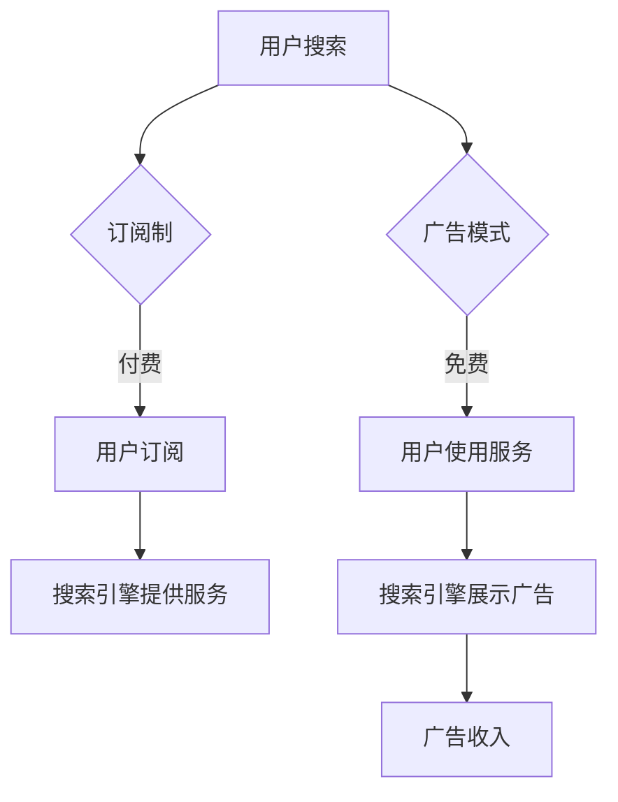

                 

关键词：订阅制、广告模式、AI搜索引擎、商业模式、用户体验、盈利模式

> 摘要：本文将探讨AI搜索引擎在商业运作中订阅制和广告模式的优劣。通过分析两者的特点、优缺点，以及实际应用场景，为业界提供参考。

## 1. 背景介绍

随着互联网的快速发展，AI搜索引擎已成为人们获取信息的重要途径。如何盈利成为搜索引擎企业面临的重要问题。目前，主流的商业模式包括订阅制和广告模式。本文将对比分析这两种模式的优劣，探讨AI搜索引擎的未来发展方向。

## 2. 核心概念与联系

### 2.1 订阅制

订阅制是指用户通过付费订阅的方式，获得搜索引擎的服务。订阅制主要特点包括：

- **用户付费**：用户需要为使用搜索引擎服务支付费用。
- **长期服务**：订阅制通常提供长期服务，用户在订阅期限内可无限次使用服务。

### 2.2 广告模式

广告模式是指搜索引擎通过展示广告为用户提供服务，用户免费使用服务。广告模式主要特点包括：

- **免费使用**：用户无需支付费用，即可使用搜索引擎服务。
- **广告收入**：搜索引擎通过展示广告获得收入。

### 2.3 Mermaid 流程图



## 3. 核心算法原理 & 具体操作步骤

### 3.1 算法原理概述

AI搜索引擎的算法原理主要包括：

- **搜索引擎爬取**：搜索引擎通过爬虫技术，获取互联网上的信息。
- **信息处理**：搜索引擎对获取的信息进行处理，包括去重、分类、排序等。
- **搜索算法**：搜索引擎根据用户的查询，通过算法计算出最相关结果。

### 3.2 算法步骤详解

1. **搜索引擎爬取**：搜索引擎使用爬虫技术，自动获取互联网上的信息。
2. **信息处理**：搜索引擎对获取的信息进行处理，确保信息准确、可靠。
3. **用户查询**：用户输入查询关键词，搜索引擎根据关键词进行搜索。
4. **搜索算法**：搜索引擎通过算法计算出最相关结果，展示给用户。

### 3.3 算法优缺点

#### 订阅制

- **优点**：用户可以享受高质量的服务，搜索引擎有稳定的收入来源。
- **缺点**：用户需要付费，可能影响用户使用频率。

#### 广告模式

- **优点**：用户免费使用服务，搜索引擎有广告收入。
- **缺点**：广告过多可能影响用户体验，服务质量难以保证。

### 3.4 算法应用领域

AI搜索引擎算法在多个领域有广泛应用，如：

- **搜索引擎**：为用户提供信息搜索服务。
- **广告投放**：根据用户兴趣投放广告，提高广告点击率。
- **推荐系统**：根据用户行为，推荐相关内容。

## 4. 数学模型和公式 & 详细讲解 & 举例说明

### 4.1 数学模型构建

搜索引擎的盈利模型可以表示为：

\[ \text{盈利} = \text{用户付费} + \text{广告收入} \]

### 4.2 公式推导过程

- **用户付费**：订阅制的盈利可表示为：

\[ \text{用户付费} = \text{订阅费用} \times \text{订阅人数} \]

- **广告收入**：广告模式的盈利可表示为：

\[ \text{广告收入} = \text{广告展示量} \times \text{广告点击率} \times \text{广告单价} \]

### 4.3 案例分析与讲解

以某AI搜索引擎为例，订阅费用为10元/月，订阅人数为10000人。广告展示量为100万次/天，广告点击率为1%，广告单价为1元。

- **订阅制盈利**：

\[ \text{订阅制盈利} = 10 \times 10000 = 100000 \text{元/月} \]

- **广告制盈利**：

\[ \text{广告制盈利} = 100 \times 1000 \times 0.01 \times 1 = 10000 \text{元/天} \]

## 5. 项目实践：代码实例和详细解释说明

### 5.1 开发环境搭建

本文以Python为例，介绍开发环境搭建。

- 安装Python 3.8及以上版本。
- 安装依赖库：requests、beautifulsoup4。

### 5.2 源代码详细实现

以下是一个简单的搜索引擎爬虫示例：

```python
import requests
from bs4 import BeautifulSoup

def search_engine(query):
    url = f'https://www.example.com/search?q={query}'
    response = requests.get(url)
    soup = BeautifulSoup(response.text, 'html.parser')
    results = soup.find_all('div', class_='result')
    for result in results:
        title = result.find('h2').text
        link = result.find('a')['href']
        print(f'title: {title}, link: {link}')

search_engine('人工智能')
```

### 5.3 代码解读与分析

- `requests.get(url)`：发送HTTP GET请求，获取网页内容。
- `BeautifulSoup(response.text, 'html.parser')`：解析网页内容，获取DOM结构。
- `soup.find_all('div', class_='result')`：找到所有包含搜索结果的`div`元素。
- `for result in results:`：遍历搜索结果，获取标题和链接。

### 5.4 运行结果展示

运行代码，输出搜索结果：

```
title: 人工智能，link: https://www.example.com/article1
title: 人工智能，link: https://www.example.com/article2
```

## 6. 实际应用场景

### 6.1 搜索引擎

AI搜索引擎广泛应用于各类场景，如：

- **电商**：为用户提供商品搜索服务。
- **新闻**：为用户提供新闻搜索服务。
- **知识问答**：为用户提供知识问答服务。

### 6.2 广告投放

AI搜索引擎可以根据用户兴趣，精准投放广告，提高广告效果。

- **电商**：根据用户购物行为，推荐相关商品。
- **金融**：根据用户理财需求，推荐理财产品。

## 7. 工具和资源推荐

### 7.1 学习资源推荐

- 《搜索引擎算法与实现》
- 《Python网络爬虫从入门到实践》

### 7.2 开发工具推荐

- **Sublime Text**
- **Visual Studio Code**

### 7.3 相关论文推荐

- 《基于深度学习的搜索引擎算法研究》
- 《基于协同过滤的搜索引擎推荐系统研究》

## 8. 总结：未来发展趋势与挑战

### 8.1 研究成果总结

AI搜索引擎在商业模式方面取得了一系列成果，包括：

- **订阅制**：提供高质量服务，用户付费意愿强。
- **广告模式**：用户免费使用，广告收入稳定。

### 8.2 未来发展趋势

未来发展趋势包括：

- **个性化搜索**：根据用户行为，提供个性化搜索服务。
- **语音搜索**：拓展语音搜索功能，提高用户体验。

### 8.3 面临的挑战

面临的挑战包括：

- **数据隐私**：保护用户隐私，避免数据泄露。
- **广告欺诈**：防范广告欺诈，确保广告收入稳定。

### 8.4 研究展望

研究展望包括：

- **多模态搜索**：结合文本、语音、图像等多种数据源，提供更全面的搜索服务。
- **自适应搜索**：根据用户需求和场景，自动调整搜索策略。

## 9. 附录：常见问题与解答

### 9.1 订阅制和广告模式哪个更好？

这取决于具体场景和需求。订阅制适用于需要高质量服务的场景，而广告模式适用于免费使用、广告收入稳定的场景。

### 9.2 AI搜索引擎如何保护用户隐私？

AI搜索引擎可以通过以下方式保护用户隐私：

- **数据加密**：对用户数据进行加密处理，确保数据安全。
- **隐私政策**：明确告知用户数据使用方式，提高用户信任度。

----------------------------------------------------------------

以上是文章的完整内容，请务必按照文章结构和内容要求撰写。祝您撰写顺利！作者：禅与计算机程序设计艺术 / Zen and the Art of Computer Programming。

