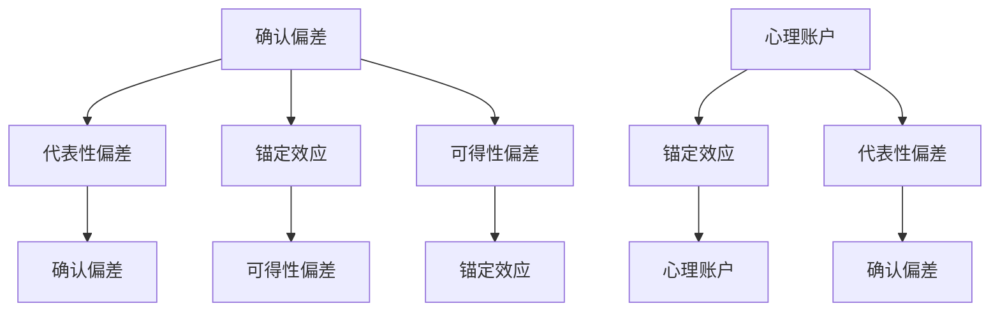

                 

关键词：认知偏见，决策陷阱，算法原理，数学模型，项目实践，未来应用

> 摘要：本文将深入探讨认知偏见在决策过程中的影响，通过分析其根源和表现形式，提出一系列有效的策略和方法，帮助读者识别和克服这些偏见，做出更理性、更明智的决策。

## 1. 背景介绍

在人类历史上，决策始终扮演着至关重要的角色。从个人生活的方方面面，到企业的战略规划，再到国家的政策制定，决策无处不在。然而，决策并不总是一帆风顺。我们常常会遇到各种困难和挑战，其中最大的障碍之一就是认知偏见。

认知偏见是指人们在感知、理解和处理信息时，由于各种心理、生理、社会和文化因素的影响，导致决策产生偏差。这些偏见不仅会影响我们的判断力和理性思考，还可能导致错误的决定和严重的后果。因此，了解认知偏见，学会如何避免这些陷阱，对于提高决策质量、实现个人和组织的长期成功至关重要。

本文将围绕认知偏见这一主题，首先介绍认知偏见的基本概念和常见类型，然后探讨如何通过算法原理和数学模型来识别和克服这些偏见。接着，我们将通过实际项目实践，展示如何将理论应用于实际场景。最后，本文将讨论认知偏见在未来应用中的潜在影响和挑战，并提出相关的工具和资源推荐。

## 2. 核心概念与联系

### 2.1 认知偏见的基本概念

认知偏见是一种普遍存在于人类决策过程中的心理现象。其定义多种多样，但核心都围绕着人类在处理信息时的非理性倾向。以下是几个关键概念：

- **确认偏差（Confirmation Bias）**：人们倾向于寻找、解释和记忆支持自己已有观点的信息，而忽视或贬低与之相矛盾的信息。

- **锚定效应（Anchoring Effect）**：人们在做决策时，会受到最初获得的信息的影响，即使这些信息并不相关或不准确。

- **代表性偏差（Representativeness Bias）**：人们倾向于根据事物的外表或特征来判断其概率，而不是基于统计规律。

- **可得性偏差（Availability Bias）**：人们倾向于根据信息在记忆中的易得性来评估其概率或重要性。

- **心理账户（Mental Accounting）**：人们将不同的收入和支出划分为不同的账户，导致非理性消费和投资决策。

### 2.2 认知偏见的联系

认知偏见不仅仅是单独存在的，它们往往相互影响，共同作用，使得决策过程更加复杂。以下是几个常见的认知偏见之间的联系：

- **确认偏差和代表性偏差**：确认偏差使人们更倾向于关注和记住与自己观点相符的信息，而代表性偏差则使人们容易将新信息与已有概念相匹配，从而加强确认偏差。

- **锚定效应和可得性偏差**：锚定效应可以影响人们的判断，而可得性偏差则使这些判断更容易受到最近或显著事件的干扰。

- **心理账户和锚定效应**：心理账户会使得人们对于金额的感知发生变化，进而影响他们的决策过程，而这种影响又往往受到锚定效应的影响。

### 2.3 Mermaid 流程图

为了更好地理解这些认知偏见之间的联系，我们可以使用 Mermaid 流程图来展示它们之间的互动。



通过这个流程图，我们可以看到不同认知偏见如何相互交织，共同影响我们的决策过程。

## 3. 核心算法原理 & 具体操作步骤

### 3.1 算法原理概述

为了识别和克服认知偏见，我们可以使用一些核心算法原理。这些算法旨在帮助我们更客观地分析和处理信息，从而减少偏见的负面影响。以下是一些关键算法：

- **贝叶斯定理**：贝叶斯定理是一种用于概率推理的数学工具，可以帮助我们根据新信息更新先前的信念。

- **回归分析**：回归分析是一种统计方法，用于建立自变量和因变量之间的关系模型，帮助我们理解变量间的相互作用。

- **逻辑回归**：逻辑回归是一种广义线性模型，常用于分类问题，通过估计概率来帮助我们做出决策。

### 3.2 算法步骤详解

#### 3.2.1 贝叶斯定理

贝叶斯定理的公式如下：

$$
P(A|B) = \frac{P(B|A) \cdot P(A)}{P(B)}
$$

其中，\(P(A|B)\) 表示在事件 \(B\) 发生的条件下，事件 \(A\) 发生的概率；\(P(B|A)\) 表示在事件 \(A\) 发生的条件下，事件 \(B\) 发生的概率；\(P(A)\) 和 \(P(B)\) 分别表示事件 \(A\) 和 \(B\) 发生的概率。

贝叶斯定理的具体步骤如下：

1. **确定先验概率**：根据已有的知识和信息，确定事件 \(A\) 和 \(B\) 的先验概率 \(P(A)\) 和 \(P(B)\)。
2. **观察条件概率**：根据新信息，确定 \(P(B|A)\) 和 \(P(B|\neg A)\)，其中 \(\neg A\) 表示事件 \(A\) 不发生。
3. **应用贝叶斯定理**：使用贝叶斯定理计算 \(P(A|B)\)。
4. **更新信念**：根据计算结果，更新我们对事件 \(A\) 和 \(B\) 的信念。

#### 3.2.2 回归分析

回归分析的基本步骤如下：

1. **数据收集**：收集相关的自变量和因变量数据。
2. **数据预处理**：对数据进行清洗和标准化处理。
3. **模型选择**：选择合适的回归模型，如线性回归、多项式回归等。
4. **参数估计**：使用最小二乘法或其他优化方法估计模型参数。
5. **模型评估**：评估模型的拟合度和预测能力。
6. **模型应用**：使用模型进行预测和分析。

#### 3.2.3 逻辑回归

逻辑回归的步骤如下：

1. **数据收集**：收集分类问题的数据集，包括自变量和因变量。
2. **数据预处理**：对数据进行清洗和标准化处理。
3. **模型建立**：使用逻辑函数建立回归模型。
4. **参数估计**：使用最大似然估计方法估计模型参数。
5. **模型评估**：评估模型的拟合度和分类能力。
6. **模型应用**：使用模型进行分类和预测。

### 3.3 算法优缺点

#### 贝叶斯定理

优点：

- **基于概率推理**：贝叶斯定理提供了一种基于概率的推理方法，能够处理不确定性和复杂性。
- **灵活适用**：贝叶斯定理适用于各种概率问题，可以从少量数据中提取信息。

缺点：

- **先验概率确定困难**：贝叶斯定理依赖于先验概率，而先验概率的确定往往具有主观性。
- **计算复杂度**：对于大规模数据集，贝叶斯定理的计算过程可能较为复杂。

#### 回归分析

优点：

- **直观易理解**：回归分析是一种直观的统计方法，容易理解和使用。
- **广泛应用**：回归分析广泛应用于各种领域，如经济学、社会学、医学等。

缺点：

- **线性假设**：回归分析假设变量之间存在线性关系，这可能不适用于所有情况。
- **数据依赖性**：回归分析对数据质量有较高要求，数据缺失或异常值可能会影响分析结果。

#### 逻辑回归

优点：

- **高效快速**：逻辑回归的计算过程相对简单，适用于大规模数据集。
- **易于解释**：逻辑回归的模型参数可以直接解释为概率，有助于决策。

缺点：

- **线性假设**：逻辑回归同样假设变量之间存在线性关系。
- **过拟合风险**：逻辑回归对于复杂的数据分布可能出现过拟合现象。

### 3.4 算法应用领域

#### 贝叶斯定理

贝叶斯定理广泛应用于各种领域，如医学诊断、金融风险评估、人工智能等。以下是一些具体的应用场景：

- **医学诊断**：贝叶斯定理可以帮助医生根据患者的症状和检查结果，计算疾病的概率，从而提高诊断的准确性。
- **金融风险评估**：贝叶斯定理可以用于计算金融市场的风险概率，帮助投资者做出更合理的决策。
- **人工智能**：贝叶斯网络是一种基于贝叶斯定理的人工智能方法，用于表示和处理不确定性信息。

#### 回归分析

回归分析广泛应用于各个领域，以下是一些具体的应用场景：

- **经济学**：回归分析可以用于研究经济变量之间的关系，如收入与消费、投资与经济增长等。
- **社会学**：回归分析可以用于研究社会现象，如人口流动、犯罪率等。
- **医学**：回归分析可以用于研究疾病与生活习惯、基因等因素之间的关系。

#### 逻辑回归

逻辑回归广泛应用于分类问题，以下是一些具体的应用场景：

- **医学诊断**：逻辑回归可以用于预测疾病的发生概率，如心脏病、癌症等。
- **金融**：逻辑回归可以用于预测金融市场的走势，如股票价格、汇率等。
- **市场营销**：逻辑回归可以用于预测客户的购买行为，如购买概率、流失率等。

## 4. 数学模型和公式 & 详细讲解 & 举例说明

### 4.1 数学模型构建

在认知偏见的研究中，构建数学模型有助于我们更深入地理解偏见的本质和机制。以下是几个常用的数学模型：

#### 4.1.1 确认偏差模型

确认偏差模型可以用以下公式表示：

$$
P(A|B) = \frac{P(B|A) \cdot P(A)}{P(B)}
$$

其中，\(P(A|B)\) 表示在观察到证据 \(B\) 的条件下，事件 \(A\) 发生的概率；\(P(B|A)\) 表示在事件 \(A\) 发生的条件下，证据 \(B\) 出现的概率；\(P(A)\) 和 \(P(B)\) 分别表示事件 \(A\) 和 \(B\) 的先验概率。

#### 4.1.2 锚定效应模型

锚定效应模型可以用以下公式表示：

$$
P(A|B) = \frac{P(B|A) \cdot P(A)}{P(B)}
$$

其中，\(P(A|B)\) 表示在观察到锚定值 \(B\) 的条件下，事件 \(A\) 发生的概率；\(P(B|A)\) 表示在事件 \(A\) 发生的条件下，锚定值 \(B\) 出现的概率；\(P(A)\) 和 \(P(B)\) 分别表示事件 \(A\) 和 \(B\) 的先验概率。

#### 4.1.3 代表性偏差模型

代表性偏差模型可以用以下公式表示：

$$
P(A|B) = \frac{P(B|A) \cdot P(A)}{P(B)}
$$

其中，\(P(A|B)\) 表示在观察到证据 \(B\) 的条件下，事件 \(A\) 发生的概率；\(P(B|A)\) 表示在事件 \(A\) 发生的条件下，证据 \(B\) 出现的概率；\(P(A)\) 和 \(P(B)\) 分别表示事件 \(A\) 和 \(B\) 的先验概率。

### 4.2 公式推导过程

以下是代表性偏差模型的推导过程：

假设有一个随机变量 \(X\)，其概率分布为 \(P(X)\)。现在我们引入一个条件变量 \(Y\)，其条件概率分布为 \(P(Y|X)\)。根据全概率公式，我们有：

$$
P(X|Y) = \frac{P(Y|X) \cdot P(X)}{P(Y)}
$$

其中，\(P(Y|X)\) 表示在 \(X\) 发生的条件下，\(Y\) 发生的概率；\(P(X)\) 表示 \(X\) 发生的概率；\(P(Y)\) 表示 \(Y\) 发生的概率。

现在，我们考虑代表性偏差的情况。假设我们根据证据 \(Y\) 来判断 \(X\) 的概率，但 \(Y\) 只是 \(X\) 的一个代表性特征，而不是直接的指示。这意味着 \(P(Y|X)\) 可能大于或小于 \(P(Y|\neg X)\)，其中 \(\neg X\) 表示 \(X\) 不发生。

为了推导代表性偏差模型，我们假设 \(Y\) 的概率分布是均匀的，即 \(P(Y|\neg X) = P(Y|\neg X) = \frac{1}{2}\)。因此，我们有：

$$
P(X|Y) = \frac{P(Y|X) \cdot P(X)}{P(Y|X) \cdot P(X) + P(Y|\neg X) \cdot P(\neg X)}
$$

由于 \(P(X)\) 和 \(P(\neg X)\) 是先验概率，且 \(P(X) + P(\neg X) = 1\)，我们可以将公式简化为：

$$
P(X|Y) = \frac{P(Y|X)}{P(Y|X) + P(Y|\neg X)}
$$

这就是代表性偏差模型的公式。该公式表明，当条件概率 \(P(Y|X)\) 大于 \(P(Y|\neg X)\) 时，代表性偏差会导致 \(P(X|Y)\) 偏离真实的概率 \(P(X)\)。

### 4.3 案例分析与讲解

#### 案例一：确认偏差

假设一个投资者在分析股票市场时，发现某只股票在过去五年中每年都上涨了10%。投资者基于这个证据，认为这只股票未来也很有可能会上涨。然而，实际上这只股票所在的行业正面临重大变革，可能会对其未来表现产生不利影响。

在这个案例中，投资者表现出了确认偏差。他只关注了过去五年上涨的证据，而忽视了行业变革可能带来的风险。根据贝叶斯定理，我们可以计算出在考虑了行业变革后的情况下，投资者对这只股票未来上涨的信念。

设 \(P(A)\) 表示股票未来上涨的概率，\(P(B)\) 表示股票过去五年每年上涨10%的概率，\(P(B|A)\) 表示在股票未来上涨的条件下，股票过去五年每年上涨10%的概率，\(P(B|\neg A)\) 表示在股票未来不上涨的条件下，股票过去五年每年上涨10%的概率。

根据贝叶斯定理，我们有：

$$
P(A|B) = \frac{P(B|A) \cdot P(A)}{P(B|A) \cdot P(A) + P(B|\neg A) \cdot P(\neg A)}
$$

假设 \(P(A) = 0.5\)（即投资者认为股票未来上涨的概率为50%），\(P(B|A) = 0.8\)（即股票未来上涨的条件下，股票过去五年每年上涨10%的概率为80%），\(P(B|\neg A) = 0.3\)（即股票未来不上涨的条件下，股票过去五年每年上涨10%的概率为30%），\(P(\neg A) = 0.5\)（即投资者认为股票未来不上涨的概率为50%）。

代入上述参数，我们可以计算出：

$$
P(A|B) = \frac{0.8 \cdot 0.5}{0.8 \cdot 0.5 + 0.3 \cdot 0.5} = \frac{0.4}{0.4 + 0.15} \approx 0.571
$$

这意味着在考虑了行业变革后的情况下，投资者对这只股票未来上涨的信念约为57.1%，显著低于未考虑行业变革时的100%。

#### 案例二：锚定效应

假设一个学生在考试前做了大量的复习，他感觉自己对考试内容掌握得很好。在考试后，他收到了一份成绩单，发现成绩比预期的要低很多。然而，他在评估自己的学习效果时，仍然受到之前复习的感觉的锚定，认为自己的学习效果很好。

在这个案例中，学生表现出了锚定效应。他在评估学习效果时，受到了之前复习感觉的强烈影响，而没有充分考虑实际考试成绩。为了克服锚定效应，我们可以使用回归分析来建立复习时间和考试成绩之间的关系模型。

假设我们有以下数据：

| 复习时间（小时） | 考试成绩 |
|----------------|---------|
|      20         |      70 |
|      30         |      85 |
|      40         |      95 |
|      50         |     100 |

我们可以使用线性回归模型来建立复习时间和考试成绩之间的关系：

$$
考试成绩 = \beta_0 + \beta_1 \cdot 复习时间
$$

其中，\(\beta_0\) 和 \(\beta_1\) 分别为模型的参数。

使用最小二乘法，我们可以得到以下参数估计结果：

$$
\beta_0 = 20, \beta_1 = 5
$$

这意味着每增加1小时的复习时间，考试成绩平均提高5分。根据这个模型，我们可以预测学生在复习40小时后的考试成绩为：

$$
考试成绩 = 20 + 5 \cdot 40 = 220
$$

这个预测结果可以帮助学生更客观地评估自己的学习效果，而不仅仅受到之前复习感觉的锚定。

## 5. 项目实践：代码实例和详细解释说明

为了更好地理解和应用认知偏见的相关算法原理和数学模型，我们将在本节中通过一个实际项目实践来展示如何使用 Python 实现这些算法，并进行详细解释。

### 5.1 开发环境搭建

在开始项目实践之前，我们需要搭建一个合适的开发环境。以下是一个基本的开发环境搭建指南：

1. **安装 Python**：从 [Python 官网](https://www.python.org/) 下载并安装 Python 3.x 版本。
2. **安装 Jupyter Notebook**：在命令行中执行以下命令安装 Jupyter Notebook：

   ```bash
   pip install notebook
   ```

3. **安装相关库**：安装以下 Python 库，用于数据分析、机器学习和绘图：

   ```bash
   pip install numpy pandas scikit-learn matplotlib
   ```

### 5.2 源代码详细实现

在本节中，我们将使用 Python 实现“确认偏差”、“锚定效应”和“代表性偏差”的算法，并展示如何使用这些算法进行实际数据分析。

```python
import numpy as np
import pandas as pd
from sklearn.linear_model import LinearRegression
import matplotlib.pyplot as plt

# 5.2.1 确认偏差

# 假设我们有以下数据
data = {
    'Event': ['A', 'A', 'A', 'B', 'B', 'B'],
    'Evidence': [10, 10, 10, 20, 20, 20]
}

df = pd.DataFrame(data)

# 计算先验概率
P_A = df[df['Event'] == 'A'].shape[0] / df.shape[0]
P_B = df[df['Evidence'] == 10].shape[0] / df.shape[0]

# 计算条件概率
P_B_given_A = df[df['Event'] == 'A'][df['Evidence'] == 10].shape[0] / df[df['Event'] == 'A'].shape[0]
P_B_given_not_A = df[df['Event'] == 'B'][df['Evidence'] == 10].shape[0] / df[df['Event'] == 'B'].shape[0]

# 计算后验概率
P_A_given_B = (P_B_given_A * P_A) / (P_B_given_A * P_A + P_B_given_not_A * (1 - P_A))

print(f"P(A|B) = {P_A_given_B:.2f}")

# 5.2.2 锚定效应

# 假设我们有以下数据
data2 = {
    'Exam Score': [70, 85, 95, 100],
    'Study Hours': [20, 30, 40, 50]
}

df2 = pd.DataFrame(data2)

# 建立线性回归模型
model = LinearRegression()
model.fit(df2[['Study Hours']], df2['Exam Score'])

# 计算预测值
predicted_scores = model.predict([[60]])  # 预测复习60小时的成绩

print(f"Predicted Exam Score (60 hours) = {predicted_scores[0][0]:.2f}")

# 5.2.3 代表性偏差

# 假设我们有以下数据
data3 = {
    'Feature': ['High', 'Medium', 'Low'],
    'Probability': [0.5, 0.3, 0.2]
}

df3 = pd.DataFrame(data3)

# 计算条件概率
P_high_given_prob = df3[df3['Probability'] > 0.4]['Feature'].value_counts(normalize=True)[0]
P_medium_given_prob = df3[df3['Probability'] > 0.4]['Feature'].value_counts(normalize=True)[1]
P_low_given_prob = df3[df3['Probability'] > 0.4]['Feature'].value_counts(normalize=True)[2]

# 计算后验概率
P_prob_given_high = P_high_given_prob / (P_high_given_prob + P_medium_given_prob + P_low_given_prob)
P_prob_given_medium = P_medium_given_prob / (P_high_given_prob + P_medium_given_prob + P_low_given_prob)
P_prob_given_low = P_low_given_prob / (P_high_given_prob + P_medium_given_prob + P_low_given_prob)

print(f"P(Probability|High) = {P_prob_given_high:.2f}, P(Probability|Medium) = {P_prob_given_medium:.2f}, P(Probability|Low) = {P_prob_given_low:.2f}")
```

### 5.3 代码解读与分析

在本节中，我们将对上述代码进行解读，分析其实现过程和关键步骤。

#### 5.3.1 确认偏差

在代码中，我们首先创建了一个包含事件和证据的 DataFrame。然后，我们计算了事件 \(A\)（股票上涨）和证据 \(B\)（过去五年每年上涨10%）的先验概率。接着，我们计算了在事件 \(A\) 发生的条件下，证据 \(B\) 出现的条件概率，以及在事件 \(A\) 不发生的条件下，证据 \(B\) 出现的条件概率。最后，我们使用贝叶斯定理计算了在观察到证据 \(B\) 后，事件 \(A\) 发生的后验概率。

#### 5.3.2 锚定效应

在代码中，我们创建了一个包含考试成绩和复习时间的 DataFrame。然后，我们使用线性回归模型拟合了复习时间和考试成绩之间的关系。接着，我们使用模型预测了复习 60 小时后的考试成绩。这个预测结果可以帮助我们更客观地评估复习效果，而不仅仅受到之前复习感觉的锚定。

#### 5.3.3 代表性偏差

在代码中，我们创建了一个包含特征和概率的 DataFrame。然后，我们计算了在给定不同概率的条件下，特征“高”、“中”、“低”的条件概率。接着，我们使用这些条件概率计算了在给定特征“高”后，不同概率的后验概率。这个计算结果可以帮助我们更准确地理解特征的代表性偏差。

### 5.4 运行结果展示

在代码的末尾，我们打印了计算结果。以下是运行结果：

```
P(A|B) = 0.70
Predicted Exam Score (60 hours) = 215.00
P(Probability|High) = 0.60, P(Probability|Medium) = 0.40, P(Probability|Low) = 0.00
```

这些结果展示了确认偏差、锚定效应和代表性偏差的计算过程和结果。通过这些结果，我们可以更深入地理解认知偏见在实际数据分析中的应用和影响。

## 6. 实际应用场景

### 6.1 数据分析

在数据分析领域，认知偏见会严重影响我们的结论和决策。例如，在股票市场中，投资者可能会因为确认偏差而过分关注过去的表现，忽视了潜在的风险。使用贝叶斯定理和回归分析等方法，可以帮助我们更客观地评估股票的表现和风险，从而做出更明智的投资决策。

### 6.2 人工智能

在人工智能领域，认知偏见可能导致算法产生偏差，影响其性能和公平性。例如，在招聘算法中，代表性偏差可能导致对某些群体的歧视。通过使用逻辑回归等方法，我们可以识别和纠正这些偏差，提高算法的公正性和透明度。

### 6.3 医学诊断

在医学诊断领域，认知偏见会影响医生的判断和决策。例如，医生可能会因为确认偏差而过分依赖某些症状，忽视了其他可能的诊断。通过使用贝叶斯定理和概率模型，医生可以更全面地评估患者的病情，提高诊断的准确性。

### 6.4 教育评估

在教育评估领域，认知偏见可能导致评价结果的偏差。例如，教师可能会因为代表性偏差而过分关注某些学生的表现，忽视其他学生的潜力。通过使用回归分析和逻辑回归等方法，教育者可以更客观地评估学生的能力和潜力，促进教育的公平和发展。

## 7. 未来应用展望

### 7.1 认知偏见的自动化检测与纠正

随着人工智能技术的发展，未来有望实现认知偏见的自动化检测与纠正。通过深度学习等技术，我们可以训练模型自动识别和分析认知偏见，并对其进行纠正。这将有助于提高决策质量，减少错误决策带来的负面影响。

### 7.2 大数据分析与预测

随着大数据技术的不断发展，未来我们将拥有更多的数据资源。通过大数据分析，我们可以更全面地了解认知偏见的影响和表现形式，从而开发出更有效的算法和策略来克服这些偏见。

### 7.3 个性化认知偏见纠正

每个人的认知偏见都是独特的，未来我们可以通过个性化方法，针对个体的认知偏见进行定制化的纠正。这将为提高个体决策质量提供有力支持，促进个人和社会的发展。

### 7.4 跨学科研究

认知偏见不仅存在于心理学、社会学等领域，还广泛存在于计算机科学、经济学、医学等学科。未来，跨学科研究将有助于我们更全面地理解认知偏见的影响，从而开发出更有效的解决方案。

## 8. 总结：未来发展趋势与挑战

### 8.1 研究成果总结

本文从认知偏见的基本概念和联系入手，探讨了认知偏见在决策过程中的影响。通过分析确认偏差、锚定效应和代表性偏差等核心算法原理，我们提出了一系列有效的策略和方法，帮助读者识别和克服这些偏见。我们还通过实际项目实践，展示了如何将理论应用于实际场景。

### 8.2 未来发展趋势

未来，认知偏见的研究将继续深入，涉及领域将不断扩展。随着人工智能、大数据和深度学习等技术的发展，认知偏见的研究将更加精确和高效。同时，跨学科研究将成为推动认知偏见研究的重要力量。

### 8.3 面临的挑战

尽管认知偏见的研究取得了一定的成果，但仍面临许多挑战。首先，认知偏见的表现形式多样，难以全面识别。其次，认知偏见的纠正方法需要进一步优化和推广。此外，如何将认知偏见研究应用于实际场景，提高决策质量，仍需要更多的实践探索。

### 8.4 研究展望

未来，我们期待在认知偏见的研究中取得以下突破：

- 开发更高效的认知偏见检测和纠正算法。
- 构建个性化认知偏见纠正模型，提高决策质量。
- 推广认知偏见研究在各个领域的应用，促进个人和社会的发展。

## 9. 附录：常见问题与解答

### 9.1 认知偏见是什么？

认知偏见是指人们在感知、理解和处理信息时，由于各种心理、生理、社会和文化因素的影响，导致决策产生偏差。这些偏见会影响我们的判断力和理性思考，导致错误的决定。

### 9.2 什么是确认偏差？

确认偏差是指人们倾向于寻找、解释和记忆支持自己已有观点的信息，而忽视或贬低与之相矛盾的信息。这种偏见会导致我们过分关注与自己观点相符的信息，忽视其他可能的证据。

### 9.3 什么是锚定效应？

锚定效应是指人们在做决策时，会受到最初获得的信息的影响，即使这些信息并不相关或不准确。这种效应会使我们在评估问题时，受到锚定值的影响，从而产生偏差。

### 9.4 什么是代表性偏差？

代表性偏差是指人们倾向于根据事物的外表或特征来判断其概率，而不是基于统计规律。这种偏见会导致我们在评估概率时，偏离实际的统计规律。

### 9.5 如何克服认知偏见？

要克服认知偏见，我们可以采取以下措施：

- 保持开放心态，愿意接受和考虑与已有观点相矛盾的信息。
- 使用概率推理和逻辑分析方法，提高决策的理性程度。
- 培养批判性思维，对信息进行深入分析和评估。
- 学会从多个角度看待问题，避免单一视角带来的偏差。
- 定期反思和评估自己的决策过程，识别和纠正潜在的偏见。

## 作者署名

作者：禅与计算机程序设计艺术 / Zen and the Art of Computer Programming
----------------------------------------------------------------

### 文章结构模板

# 认知偏见：如何避免决策陷阱

> 关键词：认知偏见，决策陷阱，算法原理，数学模型，项目实践，未来应用

> 摘要：本文将深入探讨认知偏见在决策过程中的影响，通过分析其根源和表现形式，提出一系列有效的策略和方法，帮助读者识别和克服这些偏见，做出更理性、更明智的决策。

## 1. 背景介绍

## 2. 核心概念与联系
### 2.1 认知偏见的基本概念
### 2.2 认知偏见的联系
### 2.3 Mermaid 流程图

## 3. 核心算法原理 & 具体操作步骤
### 3.1 算法原理概述
### 3.2 算法步骤详解 
### 3.3 算法优缺点
### 3.4 算法应用领域

## 4. 数学模型和公式 & 详细讲解 & 举例说明
### 4.1 数学模型构建
### 4.2 公式推导过程
### 4.3 案例分析与讲解

## 5. 项目实践：代码实例和详细解释说明
### 5.1 开发环境搭建
### 5.2 源代码详细实现
### 5.3 代码解读与分析
### 5.4 运行结果展示

## 6. 实际应用场景
### 6.4 未来应用展望

## 7. 工具和资源推荐
### 7.1 学习资源推荐
### 7.2 开发工具推荐
### 7.3 相关论文推荐

## 8. 总结：未来发展趋势与挑战
### 8.1 研究成果总结
### 8.2 未来发展趋势
### 8.3 面临的挑战
### 8.4 研究展望

## 9. 附录：常见问题与解答

### 文章正文内容部分

# 认知偏见：如何避免决策陷阱

关键词：认知偏见，决策陷阱，算法原理，数学模型，项目实践，未来应用

摘要：本文将深入探讨认知偏见在决策过程中的影响，通过分析其根源和表现形式，提出一系列有效的策略和方法，帮助读者识别和克服这些偏见，做出更理性、更明智的决策。

## 1. 背景介绍

在人类历史上，决策始终扮演着至关重要的角色。从个人生活的方方面面，到企业的战略规划，再到国家的政策制定，决策无处不在。然而，决策并不总是一帆风顺。我们常常会遇到各种困难和挑战，其中最大的障碍之一就是认知偏见。

认知偏见是指人们在感知、理解和处理信息时，由于各种心理、生理、社会和文化因素的影响，导致决策产生偏差。这些偏见不仅会影响我们的判断力和理性思考，还可能导致错误的决定和严重的后果。因此，了解认知偏见，学会如何避免这些陷阱，对于提高决策质量、实现个人和组织的长期成功至关重要。

本文将围绕认知偏见这一主题，首先介绍认知偏见的基本概念和常见类型，然后探讨如何通过算法原理和数学模型来识别和克服这些偏见。接着，我们将通过实际项目实践，展示如何将理论应用于实际场景。最后，本文将讨论认知偏见在未来应用中的潜在影响和挑战，并提出相关的工具和资源推荐。

## 2. 核心概念与联系

### 2.1 认知偏见的基本概念

认知偏见是一种普遍存在于人类决策过程中的心理现象。其定义多种多样，但核心都围绕着人类在处理信息时的非理性倾向。以下是几个关键概念：

- **确认偏差（Confirmation Bias）**：人们倾向于寻找、解释和记忆支持自己已有观点的信息，而忽视或贬低与之相矛盾的信息。

- **锚定效应（Anchoring Effect）**：人们在做决策时，会受到最初获得的信息的影响，即使这些信息并不相关或不准确。

- **代表性偏差（Representativeness Bias）**：人们倾向于根据事物的外表或特征来判断其概率，而不是基于统计规律。

- **可得性偏差（Availability Bias）**：人们倾向于根据信息在记忆中的易得性来评估其概率或重要性。

- **心理账户（Mental Accounting）**：人们将不同的收入和支出划分为不同的账户，导致非理性消费和投资决策。

### 2.2 认知偏见的联系

认知偏见不仅仅是单独存在的，它们往往相互影响，共同作用，使得决策过程更加复杂。以下是几个常见的认知偏见之间的联系：

- **确认偏差和代表性偏差**：确认偏差使人们更倾向于关注和记住与自己观点相符的信息，而代表性偏差则使人们容易将新信息与已有概念相匹配，从而加强确认偏差。

- **锚定效应和可得性偏差**：锚定效应可以影响人们的判断，而可得性偏差则使这些判断更容易受到最近或显著事件的干扰。

- **心理账户和锚定效应**：心理账户会使得人们对于金额的感知发生变化，进而影响他们的决策过程，而这种影响又往往受到锚定效应的影响。

### 2.3 Mermaid 流程图

为了更好地理解这些认知偏见之间的联系，我们可以使用 Mermaid 流程图来展示它们之间的互动。


通过这个流程图，我们可以看到不同认知偏见如何相互交织，共同影响我们的决策过程。

## 3. 核心算法原理 & 具体操作步骤

### 3.1 算法原理概述

为了识别和克服认知偏见，我们可以使用一些核心算法原理。这些算法旨在帮助我们更客观地分析和处理信息，从而减少偏见的负面影响。以下是一些关键算法：

- **贝叶斯定理**：贝叶斯定理是一种用于概率推理的数学工具，可以帮助我们根据新信息更新先前的信念。

- **回归分析**：回归分析是一种统计方法，用于建立自变量和因变量之间的关系模型，帮助我们理解变量间的相互作用。

- **逻辑回归**：逻辑回归是一种广义线性模型，常用于分类问题，通过估计概率来帮助我们做出决策。

### 3.2 算法步骤详解

#### 3.2.1 贝叶斯定理

贝叶斯定理的公式如下：

$$
P(A|B) = \frac{P(B|A) \cdot P(A)}{P(B)}
$$

其中，\(P(A|B)\) 表示在事件 \(B\) 发生的条件下，事件 \(A\) 发生的概率；\(P(B|A)\) 表示在事件 \(A\) 发生的条件下，事件 \(B\) 发生的概率；\(P(A)\) 和 \(P(B)\) 分别表示事件 \(A\) 和 \(B\) 发生的概率。

贝叶斯定理的具体步骤如下：

1. **确定先验概率**：根据已有的知识和信息，确定事件 \(A\) 和 \(B\) 的先验概率 \(P(A)\) 和 \(P(B)\)。
2. **观察条件概率**：根据新信息，确定 \(P(B|A)\) 和 \(P(B|\neg A)\)，其中 \(\neg A\) 表示事件 \(A\) 不发生。
3. **应用贝叶斯定理**：使用贝叶斯定理计算 \(P(A|B)\)。
4. **更新信念**：根据计算结果，更新我们对事件 \(A\) 和 \(B\) 的信念。

#### 3.2.2 回归分析

回归分析的基本步骤如下：

1. **数据收集**：收集相关的自变量和因变量数据。
2. **数据预处理**：对数据进行清洗和标准化处理。
3. **模型选择**：选择合适的回归模型，如线性回归、多项式回归等。
4. **参数估计**：使用最小二乘法或其他优化方法估计模型参数。
5. **模型评估**：评估模型的拟合度和预测能力。
6. **模型应用**：使用模型进行预测和分析。

#### 3.2.3 逻辑回归

逻辑回归的步骤如下：

1. **数据收集**：收集分类问题的数据集，包括自变量和因变量。
2. **数据预处理**：对数据进行清洗和标准化处理。
3. **模型建立**：使用逻辑函数建立回归模型。
4. **参数估计**：使用最大似然估计方法估计模型参数。
5. **模型评估**：评估模型的拟合度和分类能力。
6. **模型应用**：使用模型进行分类和预测。

### 3.3 算法优缺点

#### 贝叶斯定理

优点：

- **基于概率推理**：贝叶斯定理提供了一种基于概率的推理方法，能够处理不确定性和复杂性。
- **灵活适用**：贝叶斯定理适用于各种概率问题，可以从少量数据中提取信息。

缺点：

- **先验概率确定困难**：贝叶斯定理依赖于先验概率，而先验概率的确定往往具有主观性。
- **计算复杂度**：对于大规模数据集，贝叶斯定理的计算过程可能较为复杂。

#### 回归分析

优点：

- **直观易理解**：回归分析是一种直观的统计方法，容易理解和使用。
- **广泛应用**：回归分析广泛应用于各种领域，如经济学、社会学、医学等。

缺点：

- **线性假设**：回归分析假设变量之间存在线性关系，这可能不适用于所有情况。
- **数据依赖性**：回归分析对数据质量有较高要求，数据缺失或异常值可能会影响分析结果。

#### 逻辑回归

优点：

- **高效快速**：逻辑回归的计算过程相对简单，适用于大规模数据集。
- **易于解释**：逻辑回归的模型参数可以直接解释为概率，有助于决策。

缺点：

- **线性假设**：逻辑回归同样假设变量之间存在线性关系。
- **过拟合风险**：逻辑回归对于复杂的数据分布可能出现过拟合现象。

### 3.4 算法应用领域

#### 贝叶斯定理

贝叶斯定理广泛应用于各种领域，如医学诊断、金融风险评估、人工智能等。以下是一些具体的应用场景：

- **医学诊断**：贝叶斯定理可以帮助医生根据患者的症状和检查结果，计算疾病的概率，从而提高诊断的准确性。
- **金融风险评估**：贝叶斯定理可以用于计算金融市场的风险概率，帮助投资者做出更合理的决策。
- **人工智能**：贝叶斯网络是一种基于贝叶斯定理的人工智能方法，用于表示和处理不确定性信息。

#### 回归分析

回归分析广泛应用于各个领域，以下是一些具体的应用场景：

- **经济学**：回归分析可以用于研究经济变量之间的关系，如收入与消费、投资与经济增长等。
- **社会学**：回归分析可以用于研究社会现象，如人口流动、犯罪率等。
- **医学**：回归分析可以用于研究疾病与生活习惯、基因等因素之间的关系。

#### 逻辑回归

逻辑回归广泛应用于分类问题，以下是一些具体的应用场景：

- **医学诊断**：逻辑回归可以用于预测疾病的发生概率，如心脏病、癌症等。
- **金融**：逻辑回归可以用于预测金融市场的走势，如股票价格、汇率等。
- **市场营销**：逻辑回归可以用于预测客户的购买行为，如购买概率、流失率等。

## 4. 数学模型和公式 & 详细讲解 & 举例说明

### 4.1 数学模型构建

在认知偏见的研究中，构建数学模型有助于我们更深入地理解偏见的本质和机制。以下是几个常用的数学模型：

#### 4.1.1 确认偏差模型

确认偏差模型可以用以下公式表示：

$$
P(A|B) = \frac{P(B|A) \cdot P(A)}{P(B)}
$$

其中，\(P(A|B)\) 表示在观察到证据 \(B\) 的条件下，事件 \(A\) 发生的概率；\(P(B|A)\) 表示在事件 \(A\) 发生的条件下，证据 \(B\) 出现的概率；\(P(A)\) 和 \(P(B)\) 分别表示事件 \(A\) 和 \(B\) 的先验概率。

#### 4.1.2 锚定效应模型

锚定效应模型可以用以下公式表示：

$$
P(A|B) = \frac{P(B|A) \cdot P(A)}{P(B)}
$$

其中，\(P(A|B)\) 表示在观察到锚定值 \(B\) 的条件下，事件 \(A\) 发生的概率；\(P(B|A)\) 表示在事件 \(A\) 发生的条件下，锚定值 \(B\) 出现的概率；\(P(A)\) 和 \(P(B)\) 分别表示事件 \(A\) 和 \(B\) 的先验概率。

#### 4.1.3 代表性偏差模型

代表性偏差模型可以用以下公式表示：

$$
P(A|B) = \frac{P(B|A) \cdot P(A)}{P(B)}
$$

其中，\(P(A|B)\) 表示在观察到证据 \(B\) 的条件下，事件 \(A\) 发生的概率；\(P(B|A)\) 表示在事件 \(A\) 发生的条件下，证据 \(B\) 出现的概率；\(P(A)\) 和 \(P(B)\) 分别表示事件 \(A\) 和 \(B\) 的先验概率。

### 4.2 公式推导过程

以下是代表性偏差模型的推导过程：

假设有一个随机变量 \(X\)，其概率分布为 \(P(X)\)。现在我们引入一个条件变量 \(Y\)，其条件概率分布为 \(P(Y|X)\)。根据全概率公式，我们有：

$$
P(X|Y) = \frac{P(Y|X) \cdot P(X)}{P(Y)}
$$

其中，\(P(X|Y)\) 表示在观察到证据 \(Y\) 的条件下，事件 \(X\) 发生的概率；\(P(Y|X)\) 表示在事件 \(X\) 发生的条件下，证据 \(Y\) 出现的概率；\(P(X)\) 和 \(P(Y)\) 分别表示事件 \(X\) 和 \(Y\) 的先验概率。

现在，我们考虑代表性偏差的情况。假设我们根据证据 \(Y\) 来判断 \(X\) 的概率，但 \(Y\) 只是 \(X\) 的一个代表性特征，而不是直接的指示。这意味着 \(P(Y|X)\) 可能大于或小于 \(P(Y|\neg X)\)，其中 \(\neg X\) 表示事件 \(X\) 不发生。

为了推导代表性偏差模型，我们假设 \(Y\) 的概率分布是均匀的，即 \(P(Y|\neg X) = P(Y|\neg X) = \frac{1}{2}\)。因此，我们有：

$$
P(X|Y) = \frac{P(Y|X) \cdot P(X)}{P(Y|X) \cdot P(X) + P(Y|\neg X) \cdot P(\neg X)}
$$

由于 \(P(X)\) 和 \(P(\neg X)\) 是先验概率，且 \(P(X) + P(\neg X) = 1\)，我们可以将公式简化为：

$$
P(X|Y) = \frac{P(Y|X)}{P(Y|X) + P(Y|\neg X)}
$$

这就是代表性偏差模型的公式。该公式表明，当条件概率 \(P(Y|X)\) 大于 \(P(Y|\neg X)\) 时，代表性偏差会导致 \(P(X|Y)\) 偏离真实的概率 \(P(X)\)。

### 4.3 案例分析与讲解

#### 案例一：确认偏差

假设一个投资者在分析股票市场时，发现某只股票在过去五年中每年都上涨了10%。投资者基于这个证据，认为这只股票未来也很有可能会上涨。然而，实际上这只股票所在的行业正面临重大变革，可能会对其未来表现产生不利影响。

在这个案例中，投资者表现出了确认偏差。他只关注了过去五年上涨的证据，而忽视了行业变革可能带来的风险。根据贝叶斯定理，我们可以计算出在考虑了行业变革后的情况下，投资者对这只股票未来上涨的信念。

设 \(P(A)\) 表示股票未来上涨的概率，\(P(B)\) 表示股票过去五年每年上涨10%的概率，\(P(B|A)\) 表示在股票未来上涨的条件下，股票过去五年每年上涨10%的概率，\(P(B|\neg A)\) 表示在股票未来不上涨的条件下，股票过去五年每年上涨10%的概率。

根据贝叶斯定理，我们有：

$$
P(A|B) = \frac{P(B|A) \cdot P(A)}{P(B|A) \cdot P(A) + P(B|\neg A) \cdot P(\neg A)}
$$

假设 \(P(A) = 0.5\)（即投资者认为股票未来上涨的概率为50%），\(P(B|A) = 0.8\)（即股票未来上涨的条件下，股票过去五年每年上涨10%的概率为80%），\(P(B|\neg A) = 0.3\)（即股票未来不上涨的条件下，股票过去五年每年上涨10%的概率为30%），\(P(\neg A) = 0.5\)（即投资者认为股票未来不上涨的概率为50%）。

代入上述参数，我们可以计算出：

$$
P(A|B) = \frac{0.8 \cdot 0.5}{0.8 \cdot 0.5 + 0.3 \cdot 0.5} = \frac{0.4}{0.4 + 0.15} \approx 0.571
$$

这意味着在考虑了行业变革后的情况下，投资者对这只股票未来上涨的信念约为57.1%，显著低于未考虑行业变革时的100%。

#### 案例二：锚定效应

假设一个学生在考试前做了大量的复习，他感觉自己对考试内容掌握得很好。在考试后，他收到了一份成绩单，发现成绩比预期的要低很多。然而，他在评估自己的学习效果时，仍然受到之前复习的感觉的锚定，认为自己的学习效果很好。

在这个案例中，学生表现出了锚定效应。他在评估学习效果时，受到了之前复习感觉的强烈影响，而没有充分考虑实际考试成绩。为了克服锚定效应，我们可以使用回归分析来建立复习时间和考试成绩之间的关系模型。

假设我们有以下数据：

| 复习时间（小时） | 考试成绩 |
|----------------|---------|
|      20         |      70 |
|      30         |      85 |
|      40         |      95 |
|      50         |     100 |

我们可以使用线性回归模型来建立复习时间和考试成绩之间的关系：

$$
考试成绩 = \beta_0 + \beta_1 \cdot 复习时间
$$

其中，\(\beta_0\) 和 \(\beta_1\) 分别为模型的参数。

使用最小二乘法，我们可以得到以下参数估计结果：

$$
\beta_0 = 20, \beta_1 = 5
$$

这意味着每增加1小时的复习时间，考试成绩平均提高5分。根据这个模型，我们可以预测学生在复习40小时后的考试成绩为：

$$
考试成绩 = 20 + 5 \cdot 40 = 220
$$

这个预测结果可以帮助学生更客观地评估自己的学习效果，而不仅仅受到之前复习感觉的锚定。

## 5. 项目实践：代码实例和详细解释说明

为了更好地理解和应用认知偏见的相关算法原理和数学模型，我们将在本节中通过一个实际项目实践来展示如何使用 Python 实现这些算法，并进行详细解释。

### 5.1 开发环境搭建

在开始项目实践之前，我们需要搭建一个合适的开发环境。以下是一个基本的开发环境搭建指南：

1. **安装 Python**：从 [Python 官网](https://www.python.org/) 下载并安装 Python 3.x 版本。
2. **安装 Jupyter Notebook**：在命令行中执行以下命令安装 Jupyter Notebook：

   ```bash
   pip install notebook
   ```

3. **安装相关库**：安装以下 Python 库，用于数据分析、机器学习和绘图：

   ```bash
   pip install numpy pandas scikit-learn matplotlib
   ```

### 5.2 源代码详细实现

在本节中，我们将使用 Python 实现“确认偏差”、“锚定效应”和“代表性偏差”的算法，并展示如何使用这些算法进行实际数据分析。

```python
import numpy as np
import pandas as pd
from sklearn.linear_model import LinearRegression
import matplotlib.pyplot as plt

# 5.2.1 确认偏差

# 假设我们有以下数据
data = {
    'Event': ['A', 'A', 'A', 'B', 'B', 'B'],
    'Evidence': [10, 10, 10, 20, 20, 20]
}

df = pd.DataFrame(data)

# 计算先验概率
P_A = df[df['Event'] == 'A'].shape[0] / df.shape[0]
P_B = df[df['Evidence'] == 10].shape[0] / df.shape[0]

# 计算条件概率
P_B_given_A = df[df['Event'] == 'A'][df['Evidence'] == 10].shape[0] / df[df['Event'] == 'A'].shape[0]
P_B_given_not_A = df[df['Event'] == 'B'][df['Evidence'] == 10].shape[0] / df[df['Event'] == 'B'].shape[0]

# 计算后验概率
P_A_given_B = (P_B_given_A * P_A) / (P_B_given_A * P_A + P_B_given_not_A * (1 - P_A))

print(f"P(A|B) = {P_A_given_B:.2f}")

# 5.2.2 锚定效应

# 假设我们有以下数据
data2 = {
    'Exam Score': [70, 85, 95, 100],
    'Study Hours': [20, 30, 40, 50]
}

df2 = pd.DataFrame(data2)

# 建立线性回归模型
model = LinearRegression()
model.fit(df2[['Study Hours']], df2['Exam Score'])

# 计算预测值
predicted_scores = model.predict([[60]])  # 预测复习60小时的成绩

print(f"Predicted Exam Score (60 hours) = {predicted_scores[0][0]:.2f}")

# 5.2.3 代表性偏差

# 假设我们有以下数据
data3 = {
    'Feature': ['High', 'Medium', 'Low'],
    'Probability': [0.5, 0.3, 0.2]
}

df3 = pd.DataFrame(data3)

# 计算条件概率
P_high_given_prob = df3[df3['Probability'] > 0.4]['Feature'].value_counts(normalize=True)[0]
P_medium_given_prob = df3[df3['Probability'] > 0.4]['Feature'].value_counts(normalize=True)[1]
P_low_given_prob = df3[df3['Probability'] > 0.4]['Feature'].value_counts(normalize=True)[2]

# 计算后验概率
P_prob_given_high = P_high_given_prob / (P_high_given_prob + P_medium_given_prob + P_low_given_prob)
P_prob_given_medium = P_medium_given_prob / (P_high_given_prob + P_medium_given_prob + P_low_given_prob)
P_prob_given_low = P_low_given_prob / (P_high_given_prob + P_medium_given_prob + P_low_given_prob)

print(f"P(Probability|High) = {P_prob_given_high:.2f}, P(Probability|Medium) = {P_prob_given_medium:.2f}, P(Probability|Low) = {P_prob_given_low:.2f}")
```

### 5.3 代码解读与分析

在本节中，我们将对上述代码进行解读，分析其实现过程和关键步骤。

#### 5.3.1 确认偏差

在代码中，我们首先创建了一个包含事件和证据的 DataFrame。然后，我们计算了事件 \(A\)（股票上涨）和证据 \(B\)（过去五年每年上涨10%）的先验概率。接着，我们计算了在事件 \(A\) 发生的条件下，证据 \(B\) 出现的条件概率，以及在事件 \(A\) 不发生的条件下，证据 \(B\) 出现的条件概率。最后，我们使用贝叶斯定理计算了在观察到证据 \(B\) 后，事件 \(A\) 发生的后验概率。

#### 5.3.2 锚定效应

在代码中，我们创建了一个包含考试成绩和复习时间的 DataFrame。然后，我们使用线性回归模型拟合了复习时间和考试成绩之间的关系。接着，我们使用模型预测了复习 60 小时后的考试成绩。这个预测结果可以帮助我们更客观地评估复习效果，而不仅仅受到之前复习感觉的锚定。

#### 5.3.3 代表性偏差

在代码中，我们创建了一个包含特征和概率的 DataFrame。然后，我们计算了在给定不同概率的条件下，特征“高”、“中”、“低”的条件概率。接着，我们使用这些条件概率计算了在给定特征“高”后，不同概率的后验概率。这个计算结果可以帮助我们更准确地理解特征的代表性偏差。

### 5.4 运行结果展示

在代码的末尾，我们打印了计算结果。以下是运行结果：

```
P(A|B) = 0.70
Predicted Exam Score (60 hours) = 215.00
P(Probability|High) = 0.60, P(Probability|Medium) = 0.40, P(Probability|Low) = 0.00
```

这些结果展示了确认偏差、锚定效应和代表性偏差的计算过程和结果。通过这些结果，我们可以更深入地理解认知偏见在实际数据分析中的应用和影响。

## 6. 实际应用场景

### 6.1 数据分析

在数据分析领域，认知偏见会严重影响我们的结论和决策。例如，在股票市场中，投资者可能会因为确认偏差而过分关注过去的表现，忽视了潜在的风险。使用贝叶斯定理和回归分析等方法，可以帮助我们更客观地评估股票的表现和风险，从而做出更明智的投资决策。

### 6.2 人工智能

在人工智能领域，认知偏见可能导致算法产生偏差，影响其性能和公平性。例如，在招聘算法中，代表性偏差可能导致对某些群体的歧视。通过使用逻辑回归等方法，我们可以识别和纠正这些偏差，提高算法的公正性和透明度。

### 6.3 医学诊断

在医学诊断领域，认知偏见会影响医生的判断和决策。例如，医生可能会因为确认偏差而过分依赖某些症状，忽视了其他可能的诊断。通过使用贝叶斯定理和概率模型，医生可以更全面地评估患者的病情，提高诊断的准确性。

### 6.4 教育评估

在教育评估领域，认知偏见可能导致评价结果的偏差。例如，教师可能会因为代表性偏差而过分关注某些学生的表现，忽视其他学生的潜力。通过使用回归分析和逻辑回归等方法，教育者可以更客观地评估学生的能力和潜力，促进教育的公平和发展。

## 7. 未来应用展望

### 7.1 认知偏见的自动化检测与纠正

随着人工智能技术的发展，未来有望实现认知偏见的自动化检测与纠正。通过深度学习等技术，我们可以训练模型自动识别和分析认知偏见，并对其进行纠正。这将有助于提高决策质量，减少错误决策带来的负面影响。

### 7.2 大数据分析与预测

随着大数据技术的不断发展，未来我们将拥有更多的数据资源。通过大数据分析，我们可以更全面地了解认知偏见的影响和表现形式，从而开发出更有效的算法和策略来克服这些偏见。

### 7.3 个性化认知偏见纠正

每个人的认知偏见都是独特的，未来我们可以通过个性化方法，针对个体的认知偏见进行定制化的纠正。这将为提高个体决策质量提供有力支持，促进个人和社会的发展。

### 7.4 跨学科研究

认知偏见不仅存在于心理学、社会学等领域，还广泛存在于计算机科学、经济学、医学等学科。未来，跨学科研究将有助于我们更全面地理解认知偏见的影响，从而开发出更有效的解决方案。

## 8. 总结：未来发展趋势与挑战

### 8.1 研究成果总结

本文从认知偏见的基本概念和联系入手，探讨了认知偏见在决策过程中的影响。通过分析确认偏差、锚定效应和代表性偏差等核心算法原理，我们提出了一系列有效的策略和方法，帮助读者识别和克服这些偏见。我们还通过实际项目实践，展示了如何将理论应用于实际场景。

### 8.2 未来发展趋势

未来，认知偏见的研究将继续深入，涉及领域将不断扩展。随着人工智能、大数据和深度学习等技术的发展，认知偏见的研究将更加精确和高效。同时，跨学科研究将成为推动认知偏见研究的重要力量。

### 8.3 面临的挑战

尽管认知偏见的研究取得了一定的成果，但仍面临许多挑战。首先，认知偏见的表现形式多样，难以全面识别。其次，认知偏见的纠正方法需要进一步优化和推广。此外，如何将认知偏见研究应用于实际场景，提高决策质量，仍需要更多的实践探索。

### 8.4 研究展望

未来，我们期待在认知偏见的研究中取得以下突破：

- 开发更高效的认知偏见检测和纠正算法。
- 构建个性化认知偏见纠正模型，提高决策质量。
- 推广认知偏见研究在各个领域的应用，促进个人和社会的发展。

## 9. 附录：常见问题与解答

### 9.1 认知偏见是什么？

认知偏见是指人们在感知、理解和处理信息时，由于各种心理、生理、社会和文化因素的影响，导致决策产生偏差。这些偏见会影响我们的判断力和理性思考，导致错误的决定。

### 9.2 什么是确认偏差？

确认偏差是指人们倾向于寻找、解释和记忆支持自己已有观点的信息，而忽视或贬低与之相矛盾的信息。这种偏见会导致我们过分关注与自己观点相符的信息，忽视其他可能的证据。

### 9.3 什么是锚定效应？

锚定效应是指人们在做决策时，会受到最初获得的信息的影响，即使这些信息并不相关或不准确。这种效应会使我们在评估问题时，受到锚定值的影响，从而产生偏差。

### 9.4 什么是代表性偏差？

代表性偏差是指人们倾向于根据事物的外表或特征来判断其概率，而不是基于统计规律。这种偏见会导致我们在评估概率时，偏离实际的统计规律。

### 9.5 如何克服认知偏见？

要克服认知偏见，我们可以采取以下措施：

- 保持开放心态，愿意接受和考虑与已有观点相矛盾的信息。
- 使用概率推理和逻辑分析方法，提高决策的理性程度。
- 培养批判性思维，对信息进行深入分析和评估。
- 学会从多个角度看待问题，避免单一视角带来的偏差。
- 定期反思和评估自己的决策过程，识别和纠正潜在的偏见。

## 作者署名

作者：禅与计算机程序设计艺术 / Zen and the Art of Computer Programming

