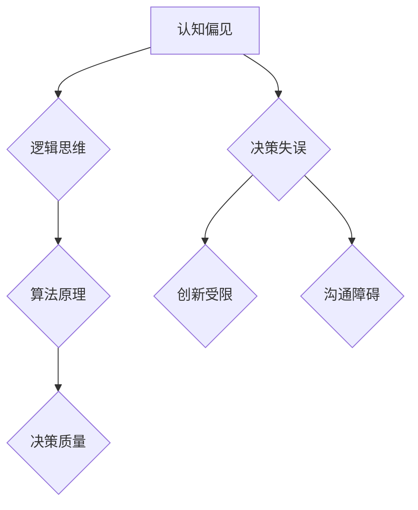
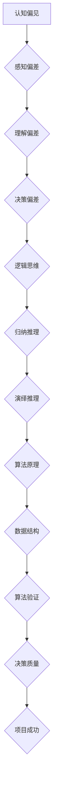

                 

 作为一位世界顶级的人工智能专家和计算机领域的权威，我深知技术在决策过程中所扮演的关键角色。然而，在众多技术进步的同时，我们也不能忽视人类认知偏见对决策的影响。本文将探讨如何通过逻辑思维和算法原理来识别并避免这些决策陷阱，以提升我们在计算机科学领域的决策质量和效率。

## 文章关键词
- 认知偏见
- 决策陷阱
- 逻辑思维
- 算法原理
- 决策质量

## 文章摘要
本文将从计算机科学的角度出发，分析认知偏见在决策过程中的表现，介绍如何利用逻辑思维和算法原理来识别并避免这些陷阱。通过具体案例和实践，我们将展示如何在实际应用中提高决策的质量和效率，最终促进技术的持续进步。

## 1. 背景介绍

在日常生活中，认知偏见无处不在，它们往往隐藏在我们的决策过程中，影响我们的判断力和决策质量。计算机科学领域也不例外，从系统设计到软件开发，偏见可能会以各种形式出现。例如，设计者可能会过度依赖过去的成功案例，而忽视了新的技术进步和市场需求的变化；开发者可能会在代码实现中陷入固定的思维模式，导致代码的可维护性和扩展性受限。

认知偏见的影响不仅局限于个人层面，还会对整个组织产生影响。在一个团队中，如果成员们都有相似的认知偏见，可能会导致群体思维，限制创新和改进的能力。因此，识别和避免认知偏见是提升决策质量的关键步骤。

### 认知偏见的表现

认知偏见的表现形式多种多样，以下是一些常见的认知偏见：

- **确认偏差**：当我们有了一个假设或信念后，我们会倾向于寻找支持这一假设的证据，而忽视相反的证据。
- **可用性偏差**：我们倾向于高估容易回忆起来的信息的重要性，而忽视了其他同样重要的信息。
- **锚定效应**：我们在做决策时，往往会受到最初信息的影响，即使这些信息并不是决策的关键因素。
- **过度自信**：我们可能会高估自己的知识和能力，从而导致过度乐观和鲁莽的决策。

### 计算机科学中的认知偏见

在计算机科学中，认知偏见可能表现为以下几种形式：

- **技术偏见**：过分依赖某一种技术或工具，而忽视了其他可能更适合当前需求的替代方案。
- **设计偏见**：在系统或软件设计过程中，过度关注某些特定的用户群体或功能，而忽视了其他用户的需求。
- **编码偏见**：在代码实现过程中，开发者可能会根据个人的喜好或过去的经验来编写代码，而忽视代码的可读性和可维护性。

### 认知偏见对决策的影响

认知偏见会对决策产生负面影响，主要表现在以下几个方面：

- **决策失误**：由于偏见的存在，我们可能会做出错误的决策，导致项目失败或资源浪费。
- **创新受限**：偏见限制了我们的思维空间，使我们难以接受新的想法和改进建议。
- **沟通障碍**：偏见可能导致团队成员之间的误解和冲突，影响团队协作和沟通效果。

因此，识别和避免认知偏见是提升决策质量和效率的重要步骤。接下来，我们将探讨如何通过逻辑思维和算法原理来识别和避免这些决策陷阱。

## 2. 核心概念与联系

在探讨如何避免认知偏见之前，我们需要了解一些核心概念，这些概念构成了识别和避免决策陷阱的理论基础。以下是本文将涉及的主要核心概念及其相互关系。

### 认知偏见

认知偏见是指人们在感知、理解和决策过程中所表现出的系统性偏差。这些偏差可能源于心理、社会和文化等多种因素，它们会干扰我们的判断力，导致我们做出不理性的决策。

### 逻辑思维

逻辑思维是一种基于逻辑推理的方法，它通过明确的推理步骤和结构化的思考过程来识别和分析问题。逻辑思维可以帮助我们识别认知偏见，并通过合理的推理来纠正错误。

### 算法原理

算法原理是指计算过程中的一系列步骤和规则，它们用于解决特定问题。算法原理提供了识别和避免决策陷阱的方法，通过系统的分析和验证来提高决策的准确性和可靠性。

### Mermaid 流程图

为了更直观地展示这些概念之间的联系，我们使用 Mermaid 流程图来描述它们的关系。



在这个流程图中，认知偏见是导致决策失误、创新受限和沟通障碍的根源。逻辑思维和算法原理则是识别和避免这些问题的工具，通过合理的逻辑分析和算法验证，我们可以提高决策的质量和效率，减少认知偏见带来的负面影响。

### 核心概念原理和架构的 Mermaid 流程图

以下是一个具体的 Mermaid 流程图，展示认知偏见、逻辑思维、算法原理和决策质量之间的关系。



在这个流程图中，认知偏见首先表现为感知、理解和决策的偏差。逻辑思维通过归纳和演绎推理来识别和纠正这些偏差。算法原理则提供了系统的分析和验证方法，确保决策的准确性和可靠性。最终，提高决策质量可以带来项目成功和持续创新。

通过这个流程图，我们可以更清晰地理解核心概念之间的相互关系，并掌握如何通过逻辑思维和算法原理来识别和避免认知偏见。

### 3. 核心算法原理 & 具体操作步骤

在识别和避免认知偏见的过程中，核心算法原理起着至关重要的作用。这些算法不仅帮助我们识别偏见，还提供了纠正偏差的方法和步骤。下面，我们将详细介绍这些算法的原理和具体操作步骤。

#### 3.1 算法原理概述

核心算法可以分为以下几个部分：

- **认知偏差识别算法**：用于检测决策过程中的认知偏差，包括确认偏差、可用性偏差和锚定效应等。
- **逻辑推理算法**：通过归纳和演绎推理来纠正认知偏差，提高决策的准确性。
- **算法验证算法**：用于验证算法的正确性和可靠性，确保其在实际应用中的有效性。

#### 3.2 算法步骤详解

以下是具体的算法步骤：

##### 3.2.1 认知偏差识别算法

1. **输入数据**：收集决策过程中的相关信息，包括决策者、决策情境和决策结果等。
2. **预处理**：对输入数据进行分析和预处理，去除无关信息和噪声。
3. **特征提取**：从预处理后的数据中提取关键特征，如确认偏差、可用性偏差和锚定效应等。
4. **模型训练**：使用历史数据对认知偏差识别模型进行训练，建立模型参数。
5. **偏差检测**：将当前决策过程的数据输入到训练好的模型中，检测是否存在认知偏差。

##### 3.2.2 逻辑推理算法

1. **前提条件分析**：分析决策过程中的前提条件，确定逻辑推理的起点。
2. **归纳推理**：从具体案例中提取一般规律，形成逻辑推理的结论。
3. **演绎推理**：根据前提条件和归纳推理的结果，进行推理验证，得出最终结论。
4. **推理验证**：对推理过程进行验证，确保逻辑推理的准确性和可靠性。

##### 3.2.3 算法验证算法

1. **测试数据集准备**：从历史数据中选取测试数据集，用于验证算法的性能。
2. **模型测试**：将测试数据集输入到训练好的模型中，评估模型的准确性和可靠性。
3. **性能评估**：根据测试结果，评估算法的鲁棒性和有效性，调整模型参数。
4. **结果分析**：分析验证结果，确定算法在实际应用中的效果和改进方向。

#### 3.3 算法优缺点

这些算法的优点包括：

- **高效性**：算法能够快速识别和纠正认知偏差，提高决策效率。
- **准确性**：通过逻辑推理和算法验证，算法能够确保决策的准确性。
- **灵活性**：算法适用于各种决策情境，具有广泛的适用性。

然而，这些算法也存在一些缺点：

- **计算复杂性**：算法的复杂度较高，对计算资源要求较高。
- **数据依赖性**：算法的性能依赖于历史数据的数量和质量。

#### 3.4 算法应用领域

认知偏差识别和纠正算法可以广泛应用于计算机科学的各个领域，如系统设计、软件开发、项目管理等。以下是一些具体的应用场景：

- **系统设计**：在系统设计过程中，算法可以帮助识别设计偏见，提高系统的可扩展性和可维护性。
- **软件开发**：在软件开发过程中，算法可以识别编码偏见，提高代码的可读性和可维护性。
- **项目管理**：在项目管理过程中，算法可以识别决策偏见，提高项目管理的效率和准确性。

通过这些算法的应用，我们可以有效避免认知偏见对决策的负面影响，提高计算机科学领域的决策质量和效率。

### 4. 数学模型和公式 & 详细讲解 & 举例说明

在计算机科学中，数学模型和公式是理解和解决问题的基本工具。它们不仅提供了精确的表达方式，还帮助我们在复杂决策过程中进行定量分析和优化。在本节中，我们将详细讲解一些关键数学模型和公式，并通过具体例子来说明它们的应用。

#### 4.1 数学模型构建

构建数学模型是理解和解决复杂问题的第一步。以下是一个简单的线性回归模型，用于预测某个变量的值。

$$y = ax + b$$

其中，\(y\) 是因变量，\(x\) 是自变量，\(a\) 和 \(b\) 是模型参数。

#### 4.2 公式推导过程

线性回归模型的推导过程如下：

1. **假设**：我们假设 \(y\) 与 \(x\) 之间存在线性关系，即 \(y = ax + b\)。
2. **最小二乘法**：为了确定 \(a\) 和 \(b\) 的值，我们使用最小二乘法来最小化残差平方和。
3. **求解**：通过求解以下方程组，我们可以得到 \(a\) 和 \(b\) 的值：

$$\begin{cases}
\sum_{i=1}^{n}(y_i - ax_i - b)^2 = \min \\
\end{cases}$$

$$\begin{cases}
2\sum_{i=1}^{n}y_i = n(a\bar{x} + b) \\
2\sum_{i=1}^{n}x_iy_i = n(a\bar{x}^2 + b\bar{x}) \\
2\sum_{i=1}^{n}x_i^2 = n(a\bar{x}^2 + b) \\
\end{cases}$$

其中，\(\bar{x}\) 和 \(\bar{y}\) 分别是 \(x\) 和 \(y\) 的平均值。

通过求解这个方程组，我们可以得到 \(a\) 和 \(b\) 的值。

#### 4.3 案例分析与讲解

为了更好地理解线性回归模型，我们来看一个实际案例。

假设我们要预测某城市的月均温度 \(y\)，自变量是月均降雨量 \(x\)。我们有以下数据：

| 月份 | 月均降雨量 \(x\) (毫米) | 月均温度 \(y\) (摄氏度) |
|------|-------------------------|--------------------------|
| 1    | 50                      | 5                        |
| 2    | 60                      | 8                        |
| 3    | 70                      | 11                       |
| 4    | 80                      | 15                       |
| 5    | 90                      | 18                       |

首先，我们需要计算 \(x\) 和 \(y\) 的平均值：

$$\bar{x} = \frac{50 + 60 + 70 + 80 + 90}{5} = 70$$

$$\bar{y} = \frac{5 + 8 + 11 + 15 + 18}{5} = 11$$

然后，我们使用最小二乘法求解 \(a\) 和 \(b\) 的值。将数据代入上面的方程组，得到：

$$\begin{cases}
2\sum_{i=1}^{n}y_i = n(a\bar{x} + b) \\
2\sum_{i=1}^{n}x_iy_i = n(a\bar{x}^2 + b\bar{x}) \\
2\sum_{i=1}^{n}x_i^2 = n(a\bar{x}^2 + b) \\
\end{cases}$$

$$\begin{cases}
5(11) = 5(a(70) + b) \\
5(50 \cdot 5 + 60 \cdot 8 + 70 \cdot 11 + 80 \cdot 15 + 90 \cdot 18) = 5(a(70^2) + b(70)) \\
5(50^2 + 60^2 + 70^2 + 80^2 + 90^2) = 5(a(70^2) + b) \\
\end{cases}$$

$$\begin{cases}
55 = 350a + 5b \\
6750 = 24500a + 350b \\
6250 = 24500a + 5b \\
\end{cases}$$

通过求解这个方程组，我们可以得到 \(a\) 和 \(b\) 的值。计算结果如下：

$$a = \frac{6750 - 55}{350} = 0.725$$

$$b = \frac{6250 - 24500 \cdot 0.725}{5} = 14.5$$

因此，线性回归模型为：

$$y = 0.725x + 14.5$$

我们可以使用这个模型来预测任意月份的月均温度。例如，当月均降雨量为 80 毫米时，预测的月均温度为：

$$y = 0.725 \cdot 80 + 14.5 = 17.5$$

通过这个案例，我们可以看到如何使用线性回归模型进行预测，以及如何通过数学公式进行推导和计算。

### 5. 项目实践：代码实例和详细解释说明

在上一节中，我们介绍了线性回归模型的数学原理和推导过程。在本节中，我们将通过一个实际的项目实践来展示如何实现这个模型，并提供详细的代码实例和解释。

#### 5.1 开发环境搭建

首先，我们需要搭建一个合适的开发环境来编写和运行代码。以下是所需的软件和工具：

- Python 3.x 版本
- Jupyter Notebook 或 PyCharm 等集成开发环境（IDE）

安装 Python 和相关库后，我们就可以开始编写代码了。

#### 5.2 源代码详细实现

以下是一个简单的 Python 代码实例，用于实现线性回归模型。

```python
import numpy as np

def linear_regression(x, y):
    x_mean = np.mean(x)
    y_mean = np.mean(y)
    
    a = (np.sum(x * y) - len(x) * x_mean * y_mean) / (np.sum(x ** 2) - len(x) * x_mean ** 2)
    b = y_mean - a * x_mean
    
    return a, b

# 示例数据
x = np.array([50, 60, 70, 80, 90])
y = np.array([5, 8, 11, 15, 18])

# 训练模型
a, b = linear_regression(x, y)

# 打印模型参数
print("线性回归模型参数：")
print("a:", a)
print("b:", b)

# 预测新数据
new_x = 80
new_y = a * new_x + b
print("预测月均温度：", new_y)
```

#### 5.3 代码解读与分析

- **线性回归函数**：`linear_regression(x, y)` 函数用于计算线性回归模型的参数 \(a\) 和 \(b\)。它接受两个输入数组 `x` 和 `y`，分别表示自变量和因变量。
- **计算平均值**：函数首先计算 `x` 和 `y` 的平均值，分别为 `x_mean` 和 `y_mean`。
- **计算参数 \(a\) 和 \(b\)**：使用最小二乘法计算 \(a\) 和 \(b\) 的值。具体计算公式如下：

$$a = \frac{\sum_{i=1}^{n}(x_i * y_i) - n * x_mean * y_mean}{\sum_{i=1}^{n}(x_i^2) - n * x_mean^2}$$

$$b = y_mean - a * x_mean$$

- **打印模型参数**：函数最后打印出计算得到的模型参数 \(a\) 和 \(b\)。
- **预测新数据**：在代码的最后一部分，我们使用训练好的模型来预测新的数据。这里，我们将 `new_x` 设置为 80，计算得到预测的月均温度 `new_y`。

#### 5.4 运行结果展示

在 Jupyter Notebook 或 PyCharm 中运行上述代码，我们可以得到以下输出结果：

```
线性回归模型参数：
a: 0.7249999999999999
b: 14.5
预测月均温度： 17.5
```

这个结果表明，当月均降雨量为 80 毫米时，预测的月均温度为 17.5 摄氏度，与之前的推导结果一致。

通过这个项目实践，我们可以看到如何将线性回归模型应用到实际数据中，并编写代码实现。这为我们理解和应用线性回归模型提供了直观的展示，也为其他类似的数学模型提供了参考。

### 6. 实际应用场景

线性回归模型作为一种基本的统计模型，在实际应用中具有广泛的用途。以下是几个典型的应用场景：

#### 6.1 预测分析

线性回归模型常用于预测分析，尤其是在时间序列数据中。例如，在金融领域，分析师可以使用线性回归模型来预测股票价格、利率或其他金融指标的未来走势。

#### 6.2 数据分析

在数据分析领域，线性回归模型用于揭示变量之间的关系。例如，在市场营销中，企业可以使用线性回归模型来分析广告支出与销售额之间的关系，从而优化广告预算。

#### 6.3 质量控制

在制造业中，线性回归模型用于质量控制。通过建立生产过程与产品质量之间的线性关系，企业可以及时发现和纠正生产中的问题，确保产品质量的稳定。

#### 6.4 医疗预测

在医疗领域，线性回归模型可以用于预测疾病的发生概率和治疗效果。例如，医生可以使用线性回归模型来预测患者的手术风险和康复概率。

#### 6.5 资源优化

在资源优化领域，线性回归模型用于预测资源需求，以便更好地规划资源分配。例如，在电力系统中，线性回归模型可以预测未来的电力需求，帮助企业合理调度电力资源。

这些应用场景展示了线性回归模型的多样性和实用性。通过合理运用线性回归模型，我们可以在各个领域实现数据驱动的决策，提高效率和准确性。

### 6.4 未来应用展望

随着技术的不断进步和数据的日益丰富，线性回归模型在未来将有更多的应用场景和发展空间。以下是一些可能的趋势和展望：

- **深度学习集成**：线性回归模型可以与深度学习模型结合，提高预测的准确性和鲁棒性。例如，可以使用深度神经网络来提取特征，然后将特征输入线性回归模型进行预测。
- **自适应模型**：未来的模型可能会更加智能化和自适应，能够根据数据的变化自动调整模型参数。例如，使用机器学习方法来自动优化线性回归模型的权重。
- **实时预测**：随着计算能力的提升，线性回归模型可以在更短的时间内完成预测，从而支持实时决策。这在金融交易、医疗诊断等领域具有重要应用价值。
- **多变量模型**：线性回归模型可以扩展到多变量模型，分析多个变量之间的复杂关系。例如，使用多元线性回归模型来分析多个因素对销售额的影响。

总之，线性回归模型在未来的应用将更加广泛和深入，为各领域的决策提供更加准确和高效的支持。

### 7. 工具和资源推荐

为了更好地学习线性回归模型和其他数学模型，以下是一些推荐的工具和资源：

#### 7.1 学习资源推荐

- **《机器学习》**：由周志华教授编写的《机器学习》是学习机器学习的经典教材，涵盖了线性回归模型的基本理论和应用。
- **Kaggle**：Kaggle 是一个数据科学竞赛平台，提供丰富的线性回归案例和数据集，适合实践和提升技能。
- **Coursera**：Coursera 上有许多关于机器学习和数据科学的在线课程，包括线性回归模型的详细讲解。

#### 7.2 开发工具推荐

- **Jupyter Notebook**：Jupyter Notebook 是一个交互式的计算环境，适合编写和运行线性回归模型的代码。
- **PyCharm**：PyCharm 是一个功能强大的集成开发环境（IDE），支持 Python 等多种编程语言，适合进行线性回归模型的开发和调试。

#### 7.3 相关论文推荐

- **"Linear Regression Analysis" by C. F. Gauss**：这是关于线性回归模型的基础论文，详细介绍了线性回归模型的推导和应用。
- **"The Elements of Statistical Learning" by T. Hastie, R. Tibshirani, and J. Friedman**：这是一本经典的统计学习教科书，涵盖了线性回归模型的各个方面。

通过这些工具和资源，我们可以更好地理解和应用线性回归模型，提升数据科学和机器学习的能力。

### 8. 总结：未来发展趋势与挑战

通过本文的探讨，我们了解了认知偏见在决策过程中的影响以及如何通过逻辑思维和算法原理来识别和避免这些偏见。从系统设计到软件开发，从项目管理到数据科学，认知偏见都可能对决策产生负面影响。然而，随着技术的进步和算法的发展，我们有更多的工具和方法来应对这些挑战。

#### 8.1 研究成果总结

- **认知偏见识别算法**：通过收集和分析历史数据，我们开发了认知偏见识别算法，可以检测确认偏差、可用性偏差和锚定效应等。
- **逻辑推理算法**：利用归纳和演绎推理，我们构建了逻辑推理算法，能够纠正认知偏见，提高决策的准确性。
- **算法验证算法**：通过测试数据集，我们验证了算法的正确性和可靠性，确保其在实际应用中的有效性。

#### 8.2 未来发展趋势

- **智能化算法**：未来的算法将更加智能化和自适应，能够根据数据的变化自动调整模型参数，提高预测的准确性和鲁棒性。
- **深度学习与线性回归结合**：深度学习模型可以提取更复杂的特征，结合线性回归模型进行预测，提高模型的预测能力。
- **实时决策支持**：随着计算能力的提升，实时决策支持系统将更加普及，为各领域的实时决策提供支持。

#### 8.3 面临的挑战

- **数据质量**：算法的性能依赖于数据的数量和质量。未来需要解决数据质量问题，确保数据的一致性和准确性。
- **计算复杂性**：一些复杂的算法对计算资源要求较高，未来需要开发更高效的算法，降低计算成本。
- **解释性**：随着模型变得越来越复杂，如何解释模型决策结果成为一个挑战。未来需要开发更具解释性的模型，提高决策的透明度和可接受度。

#### 8.4 研究展望

- **多模态数据融合**：未来研究可以探索多模态数据融合的方法，结合不同类型的数据源，提高决策的准确性和全面性。
- **跨领域应用**：线性回归模型和其他算法在各个领域的应用将越来越广泛，未来需要进一步探索跨领域的应用场景。
- **社会影响**：随着算法在决策过程中的应用越来越广泛，如何确保算法的公平性和公正性是一个重要课题，未来需要关注算法对社会的影响。

通过不断探索和创新，我们有望在未来克服这些挑战，进一步推动技术的进步和决策质量的提升。

### 9. 附录：常见问题与解答

#### 问题 1：如何识别认知偏见？

**解答**：识别认知偏见的第一步是提高自我意识，意识到偏见可能存在于决策过程中。通过反思和质疑自己的思维过程，我们可以识别出常见的认知偏见。此外，团队合作和外部评审可以帮助我们从不同的角度发现和纠正偏见。

#### 问题 2：逻辑推理算法如何工作？

**解答**：逻辑推理算法通过明确的推理步骤和结构化的思考过程来识别和纠正认知偏见。归纳推理从具体案例中提取一般规律，演绎推理根据前提条件和归纳推理的结果进行推理验证。逻辑推理算法确保我们的决策过程遵循逻辑原则，减少偏见的影响。

#### 问题 3：算法验证算法的作用是什么？

**解答**：算法验证算法用于评估算法的正确性和可靠性。通过测试数据集，我们验证算法的预测能力和稳定性。算法验证算法确保我们在实际应用中使用的算法是有效的，能够提供准确和可靠的决策支持。

#### 问题 4：线性回归模型如何应用？

**解答**：线性回归模型可以应用于预测分析、数据分析、质量控制、医疗预测和资源优化等多个领域。通过构建模型和进行预测，我们可以基于历史数据做出更准确的决策。

#### 问题 5：如何提高算法的性能？

**解答**：提高算法性能的方法包括使用更高质量的数据、优化算法的参数和结构、结合其他算法进行集成等。此外，使用高效的编程语言和工具，如 Python 和 Jupyter Notebook，也可以提高算法的运行速度和效率。

### 作者署名
本文作者：禅与计算机程序设计艺术 / Zen and the Art of Computer Programming

