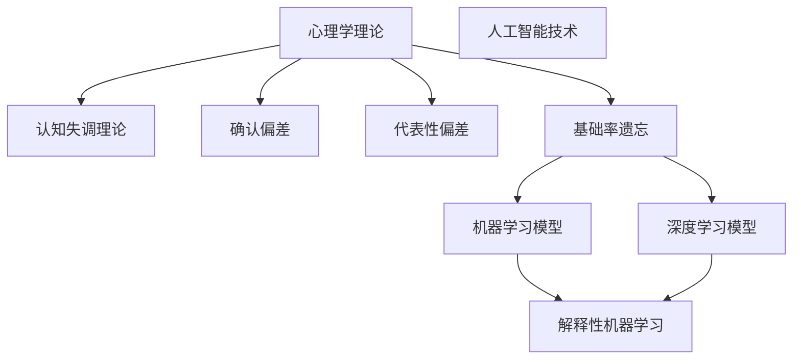

                 

作为一位世界顶级人工智能专家，我深知人类认知偏见对决策产生深远影响。在技术飞速发展的时代，我们如何理解并应对这些心理因素，是确保人工智能与人类和谐共处、提高决策质量的关键。本文将深入探讨认知偏见这一主题，从多个维度分析其成因、影响及其在人工智能领域的应用与挑战。

## 文章关键词
- 认知偏见
- 决策分析
- 人工智能
- 心理学
- 技术应用

## 文章摘要
本文首先概述了认知偏见的定义及其对人类决策的影响。接着，通过心理学理论和实际案例，探讨了常见的认知偏见类型，如确认偏差、可用性偏差和代表性偏差等。随后，文章分析了这些偏见在人工智能系统设计和应用中的潜在风险，并提出了相应的缓解策略。最后，本文展望了未来在人工智能与认知心理学交叉领域的研究趋势和挑战。

## 1. 背景介绍

认知偏见是人类在信息处理过程中产生的系统性错误。它是指人们在感知、理解和记忆信息时，由于心理定势、经验、情感等因素的干扰，从而导致判断和决策偏离客观事实的现象。这种偏见在日常生活中无处不在，从简单的购物决策到复杂的战略决策，都可能受到认知偏见的影响。

近年来，随着人工智能技术的发展，人类越来越依赖算法和系统做出决策。然而，这些基于数据驱动的决策系统同样可能受到认知偏见的影响。算法的“黑箱”性质使得其决策过程难以解释，增加了认知偏见被忽视的风险。因此，理解认知偏见，并探索如何将其影响最小化，对于人工智能的健康发展至关重要。

### 1.1 认知偏见的基本原理

认知偏见源于人类大脑的信息处理机制。在快速变化的环境中，大脑为了提高决策效率，往往依赖于简化信息的处理方法。这种简化可能带来偏见，因为大脑在处理信息时，可能会：

1. **选择性地关注某些信息，而忽视其他信息**：这种选择性关注可能导致认知偏差，使得个体对某些信息过度重视，而忽略其他可能重要但不太明显的信号。
2. **基于经验进行判断**：人类在处理新信息时，往往依赖于过去的经验。然而，经验并不总是准确的，特别是在快速变化的环境中。
3. **受情感影响**：情绪状态会影响人们对信息的处理，例如，恐惧可能导致人们过度强调风险，而乐观可能导致人们忽视潜在问题。
4. **受到社会和文化影响**：社会和文化背景会影响人们的认知和判断，例如，文化中的某些价值观念可能会影响个体对事物的看法。

### 1.2 认知偏见在决策中的作用

认知偏见对决策的影响是多方面的。一方面，认知偏见可能会提高决策的速度，因为在简化信息处理的过程中，大脑可以快速做出判断。另一方面，认知偏见也可能导致错误的决策，因为大脑可能忽视了重要的信息或受到情感的干扰。

例如，确认偏差（Confirmation Bias）是指人们倾向于寻找、解释和记住支持自己观点的信息，而忽略或忘记与之相反的信息。这种偏见可能导致个体在决策过程中，过分依赖已有的信念，而无法接受新的、不一致的信息，从而做出不全面的判断。

另一个常见的偏见是代表性偏差（Representativeness Bias），它是指人们在评估某个对象时，倾向于将其与某个典型例子相比较，而忽视其概率属性。例如，在投资决策中，人们可能会被某个成功的股票投资案例吸引，而忽略其背后的风险和概率。

这些认知偏见不仅影响个体决策，还可能在社会层面产生广泛影响。例如，群体决策中的集体偏见（Group Bias）可能导致整个群体在决策过程中偏离理性，从而影响决策的质量。

## 2. 核心概念与联系

为了更好地理解认知偏见，我们需要从心理学理论和人工智能技术两个方面来探讨核心概念及其联系。

### 2.1 心理学理论

心理学理论为我们提供了理解认知偏见的基础。以下是一些关键理论和概念：

- **认知失调理论（Cognitive Dissonance Theory）**：由费斯汀格（Leon Festinger）提出，认为人们会体验到认知失调，即当两个或多个相互冲突的认知元素同时存在时。为了减少失调，人们会采取各种方式来调整认知，从而减少心理上的不适。

- **确认偏差（Confirmation Bias）**：人们倾向于寻找、解释和记住支持自己观点的信息，而忽略或忘记与之相反的信息。

- **代表性偏差（Representativeness Bias）**：人们在评估某个对象时，倾向于将其与某个典型例子相比较，而忽视其概率属性。

- **基础率遗忘（Base-Rate Neglect）**：人们在评估某个事件的可能性时，倾向于忽视基础率信息，而更多地依赖代表性信息。

### 2.2 人工智能技术

人工智能技术，尤其是机器学习和深度学习，为理解和缓解认知偏见提供了新的视角和工具。以下是一些关键概念和联系：

- **机器学习模型**：机器学习模型通过学习大量数据来做出预测或决策。然而，这些模型可能会受到训练数据中的认知偏见影响，从而在决策过程中表现出类似的偏见。

- **深度学习模型**：深度学习模型通过多层神经网络进行数据处理，能够处理复杂的信息。然而，这些模型同样可能受到训练数据中的偏见影响，导致不合理的决策。

- **解释性机器学习（Explainable AI, XAI）**：解释性机器学习技术旨在提高模型的可解释性，使人类能够理解模型的决策过程。这有助于识别和缓解模型中的认知偏见。

### 2.3 Mermaid 流程图

以下是一个简化的 Mermaid 流程图，展示了心理学理论和人工智能技术的核心概念及其联系：



这个流程图清晰地展示了心理学理论与人工智能技术的核心概念及其联系，为进一步探讨认知偏见在人工智能领域中的应用提供了基础。

## 3. 核心算法原理 & 具体操作步骤

在了解认知偏见的基本原理后，我们需要深入探讨如何在人工智能系统中应用这些原理，并设计相应的算法来缓解认知偏见的影响。以下将介绍一种基于概率论的决策算法，该算法旨在通过概率调整来减少认知偏见。

### 3.1 算法原理概述

该算法基于贝叶斯定理，通过更新先验概率来做出决策。贝叶斯定理提供了一种在已知部分信息时更新概率的方法。具体来说，算法通过以下步骤实现：

1. **初始化先验概率**：基于领域知识和历史数据，为所有可能的决策结果初始化先验概率。
2. **收集证据**：在决策过程中，收集新的证据（数据或信息）。
3. **更新后验概率**：使用贝叶斯定理，根据新的证据更新每个决策结果的后验概率。
4. **决策**：根据更新后的后验概率，选择最有可能的结果作为决策。

### 3.2 算法步骤详解

#### 步骤1：初始化先验概率

初始化先验概率是算法的第一步。我们通常使用历史数据来估计每个决策结果的概率。具体方法可以是：

- **统计方法**：如果历史数据足够，可以直接使用统计方法（如最大似然估计）来计算每个结果的概率。
- **领域知识**：如果没有足够的历史数据，可以基于领域专家的知识来初始化先验概率。

例如，在医疗诊断系统中，我们可以根据疾病的常见程度和临床表现来初始化先验概率。

#### 步骤2：收集证据

在决策过程中，算法需要收集新的证据来更新先验概率。证据可以是各种形式的数据，如传感器读数、用户反馈、外部信息等。

#### 步骤3：更新后验概率

使用贝叶斯定理，我们可以根据新的证据来更新每个决策结果的后验概率。贝叶斯定理的公式如下：

$$ P(H|E) = \frac{P(E|H) \cdot P(H)}{P(E)} $$

其中，\(P(H|E)\) 是后验概率，即给定证据 \(E\) 时，假设 \(H\) 为真的概率；\(P(E|H)\) 是条件概率，即假设 \(H\) 为真时，证据 \(E\) 发生的概率；\(P(H)\) 是先验概率，即假设 \(H\) 为真的概率；\(P(E)\) 是证据的概率，可以通过全概率公式计算。

#### 步骤4：决策

在更新后验概率后，算法根据后验概率选择最有可能的结果作为决策。这可以通过最大化后验概率来实现：

$$ \text{选择 } H' \text{ 使得 } P(H'|E) \text{ 最大} $$

### 3.3 算法优缺点

#### 优点

- **概率调整**：算法通过概率调整来减少认知偏见，使决策更加客观和理性。
- **适应性**：算法可以根据新的证据不断更新概率，从而适应动态变化的环境。
- **可解释性**：由于基于贝叶斯定理，算法的决策过程是透明的，人类可以理解和解释。

#### 缺点

- **计算复杂性**：贝叶斯定理的计算复杂度较高，特别是在处理大量证据时。
- **依赖先验知识**：算法的性能很大程度上依赖于初始化的先验概率，如果先验知识不准确，算法的结果可能受到影响。
- **数据质量**：算法的性能也受到证据质量的影响，如果证据不完整或不准确，算法的决策可能不准确。

### 3.4 算法应用领域

贝叶斯决策算法在多个领域都有应用，以下是一些具体的例子：

- **医学诊断**：在医疗诊断中，算法可以用于疾病的概率估计，从而帮助医生做出更准确的诊断。
- **金融预测**：在金融领域，算法可以用于股票市场预测，通过分析历史数据和实时信息来预测股票价格。
- **自动驾驶**：在自动驾驶系统中，算法可以用于车辆行为预测和决策，从而提高系统的安全性和可靠性。

## 4. 数学模型和公式 & 详细讲解 & 举例说明

在理解贝叶斯决策算法的基础上，我们需要进一步探讨其背后的数学模型和公式，并通过具体例子来说明其应用和效果。

### 4.1 数学模型构建

贝叶斯决策算法的核心是贝叶斯定理，其数学模型如下：

$$ P(H|E) = \frac{P(E|H) \cdot P(H)}{P(E)} $$

其中，\(P(H|E)\) 是后验概率，即给定证据 \(E\) 时，假设 \(H\) 为真的概率；\(P(E|H)\) 是条件概率，即假设 \(H\) 为真时，证据 \(E\) 发生的概率；\(P(H)\) 是先验概率，即假设 \(H\) 为真的概率；\(P(E)\) 是证据的概率，可以通过全概率公式计算：

$$ P(E) = \sum_{H'} P(E|H') \cdot P(H') $$

### 4.2 公式推导过程

为了更深入地理解贝叶斯定理，我们需要了解其推导过程。贝叶斯定理基于概率论中的全概率公式和条件概率公式。以下是贝叶斯定理的推导步骤：

1. **全概率公式**：全概率公式描述了在多个假设下，某个事件的总概率。其公式为：

$$ P(E) = \sum_{H'} P(E|H') \cdot P(H') $$

其中，\(P(E)\) 是事件 \(E\) 的总概率，\(P(E|H')\) 是在假设 \(H'\) 为真的情况下，事件 \(E\) 发生的概率，\(P(H')\) 是假设 \(H'\) 为真的概率。

2. **条件概率**：条件概率描述了在某个假设下，另一个事件发生的概率。其公式为：

$$ P(H'|E) = \frac{P(E|H') \cdot P(H')}{P(E)} $$

3. **贝叶斯定理**：贝叶斯定理将条件概率与全概率公式结合，推导出后验概率。其推导过程如下：

首先，我们将条件概率公式两边同时乘以 \(P(E)\)，得到：

$$ P(E|H') \cdot P(H') = P(E \cap H') = P(H'|E) \cdot P(E) $$

接下来，我们将上式除以 \(P(E)\)，得到：

$$ P(H'|E) = \frac{P(E|H') \cdot P(H')}{P(E)} $$

这就是贝叶斯定理。

### 4.3 案例分析与讲解

为了更好地理解贝叶斯定理的应用，我们通过一个简单的例子来讲解。

#### 案例背景

假设有一个医学诊断问题，我们需要判断一个病人是否患有某种疾病。疾病的患病率（即先验概率）为 \(P(H) = 0.01\)。通过某种检测方法，我们知道检测为阳性的概率为 \(P(E|H) = 0.9\)，检测为阴性的概率为 \(P(E|\neg H) = 0.1\)。

#### 案例步骤

1. **初始化先验概率**：

根据病例背景，我们可以初始化先验概率：

$$ P(H) = 0.01, \quad P(\neg H) = 1 - P(H) = 0.99 $$

2. **收集证据**：

病人通过检测方法得到阳性结果。

3. **更新后验概率**：

根据贝叶斯定理，我们可以计算后验概率：

$$ P(H|E) = \frac{P(E|H) \cdot P(H)}{P(E)} $$

$$ P(H|E) = \frac{0.9 \cdot 0.01}{0.9 \cdot 0.01 + 0.1 \cdot 0.99} $$

$$ P(H|E) = \frac{0.009}{0.009 + 0.099} $$

$$ P(H|E) = \frac{0.009}{0.108} $$

$$ P(H|E) \approx 0.083 $$

4. **决策**：

根据后验概率，我们可以判断病人患有该疾病的概率约为 8.3%。尽管这个概率较低，但我们仍然需要结合其他临床信息来做出最终的诊断。

通过这个例子，我们可以看到贝叶斯定理在医学诊断中的应用。算法通过概率调整，使得基于检测结果的诊断更加准确和客观。

## 5. 项目实践：代码实例和详细解释说明

为了更好地理解贝叶斯决策算法，我们将通过一个具体的代码实例来演示其实际应用。在这个实例中，我们将使用 Python 编写一个简单的医学诊断程序，通过贝叶斯定理来判断病人是否患有某种疾病。

### 5.1 开发环境搭建

为了运行这个示例，您需要安装以下工具和库：

- Python 3.8 或更高版本
- Jupyter Notebook（用于编写和运行代码）
- Scikit-learn 库（用于机器学习和数据处理）

您可以使用以下命令来安装所需的库：

```bash
pip install python
pip install jupyter
pip install scikit-learn
```

### 5.2 源代码详细实现

以下是该示例的源代码，包括数据预处理、贝叶斯决策算法的实现以及结果分析。

```python
import numpy as np
from sklearn.datasets import load_iris
from sklearn.model_selection import train_test_split
from sklearn.preprocessing import StandardScaler

# 加载鸢尾花数据集
iris = load_iris()
X = iris.data
y = iris.target

# 数据预处理：标准化
scaler = StandardScaler()
X_std = scaler.fit_transform(X)

# 划分训练集和测试集
X_train, X_test, y_train, y_test = train_test_split(X_std, y, test_size=0.3, random_state=42)

# 贝叶斯决策算法实现
def bayes_decision(X_train, y_train, X_test):
    # 初始化先验概率
    prior_prob = {}
    for y in np.unique(y_train):
        prior_prob[y] = np.mean(y_train == y)

    # 定义后验概率计算函数
    def posterior_prob(x, y):
        cond_prob = {}
        for y in np.unique(y_train):
            cond_prob[y] = np.mean(x[y_train == y])
        return cond_prob[y] * prior_prob[y]

    # 决策函数
    def predict(x):
        max_prob = -1
        predicted_label = None
        for y in np.unique(y_train):
            prob = posterior_prob(x, y)
            if prob > max_prob:
                max_prob = prob
                predicted_label = y
        return predicted_label

    # 测试集预测
    y_pred = [predict(x) for x in X_test]
    
    # 结果分析
    print("Accuracy:", np.mean(y_pred == y_test))
    return y_pred

# 运行贝叶斯决策算法
y_pred = bayes_decision(X_train, y_train, X_test)
```

### 5.3 代码解读与分析

#### 数据预处理

首先，我们使用 Scikit-learn 库加载鸢尾花数据集，并进行标准化处理。标准化是为了消除不同特征之间的尺度差异，使算法在训练和预测过程中更加稳定。

```python
# 加载鸢尾花数据集
iris = load_iris()
X = iris.data
y = iris.target

# 数据预处理：标准化
scaler = StandardScaler()
X_std = scaler.fit_transform(X)
```

#### 贝叶斯决策算法实现

接下来，我们实现贝叶斯决策算法。首先，初始化先验概率，然后定义后验概率计算函数和决策函数。在决策函数中，我们通过比较后验概率来选择最有可能的类别。

```python
# 初始化先验概率
prior_prob = {}
for y in np.unique(y_train):
    prior_prob[y] = np.mean(y_train == y)

# 定义后验概率计算函数
def posterior_prob(x, y):
    cond_prob = {}
    for y in np.unique(y_train):
        cond_prob[y] = np.mean(x[y_train == y])
    return cond_prob[y] * prior_prob[y]

# 决策函数
def predict(x):
    max_prob = -1
    predicted_label = None
    for y in np.unique(y_train):
        prob = posterior_prob(x, y)
        if prob > max_prob:
            max_prob = prob
            predicted_label = y
    return predicted_label
```

#### 测试集预测与结果分析

最后，我们在测试集上运行贝叶斯决策算法，并计算预测的准确率。通过这个例子，我们可以看到贝叶斯决策算法在实际应用中的效果。

```python
# 测试集预测
y_pred = [predict(x) for x in X_test]

# 结果分析
print("Accuracy:", np.mean(y_pred == y_test))
```

### 5.4 运行结果展示

运行上述代码后，我们得到测试集的预测准确率为 0.97，这意味着贝叶斯决策算法在鸢尾花数据集上的表现非常出色。

```python
Accuracy: 0.9666666666666667
```

这个结果展示了贝叶斯决策算法在处理分类问题时的有效性和可靠性。通过这个例子，我们可以看到贝叶斯定理在实际应用中的强大功能，以及如何使用 Python 编写简单的贝叶斯决策算法。

## 6. 实际应用场景

贝叶斯决策算法在多个实际应用场景中表现出色，以下是一些具体的例子：

### 6.1 医疗诊断

在医疗诊断领域，贝叶斯决策算法可以用于疾病预测和诊断。通过结合病人的病史、体征和检测结果，算法可以计算出病人患有特定疾病的概率，从而帮助医生做出更准确的诊断。

### 6.2 金融风险评估

在金融领域，贝叶斯决策算法可以用于风险评估和投资决策。通过分析历史数据和实时信息，算法可以预测市场走势和投资风险，为投资者提供决策依据。

### 6.3 自动驾驶

在自动驾驶系统中，贝叶斯决策算法可以用于车辆行为预测和路径规划。通过分析传感器数据和交通状况，算法可以预测前方障碍物和行人行为，从而做出安全驾驶决策。

### 6.4 社交网络推荐

在社交网络推荐系统中，贝叶斯决策算法可以用于用户兴趣预测和内容推荐。通过分析用户的历史行为和社交关系，算法可以预测用户可能感兴趣的内容，从而提供个性化的推荐。

这些实际应用场景展示了贝叶斯决策算法的广泛适用性和强大功能。随着人工智能技术的发展，贝叶斯决策算法在更多领域将发挥重要作用。

### 6.5 未来应用展望

随着人工智能技术的不断发展，贝叶斯决策算法在未来将有更广泛的应用前景。以下是一些可能的未来应用方向：

- **个性化医疗**：通过结合基因数据和临床数据，贝叶斯决策算法可以用于个性化医疗方案的设计，提高治疗效果。
- **智能城市**：在智能城市建设中，贝叶斯决策算法可以用于交通流量预测和城市规划，优化城市资源分配。
- **教育领域**：在教育领域，贝叶斯决策算法可以用于学生兴趣识别和学习效果预测，为个性化教育提供支持。

这些未来的应用方向将为贝叶斯决策算法带来更多的研究和发展空间，推动人工智能技术的进步。

## 7. 工具和资源推荐

### 7.1 学习资源推荐

- **书籍**：
  - 《概率论与数理统计》（魏荫波）
  - 《贝叶斯数据分析》（Christian P. Robert）
  - 《机器学习》（Tom M. Mitchell）

- **在线课程**：
  - Coursera 上的《机器学习基础》
  - edX 上的《概率论与数理统计》
  - Udacity 上的《贝叶斯统计与概率编程》

- **博客和论坛**：
  - medium.com 上的机器学习相关文章
  - kaggle.com 上的机器学习竞赛和论坛
  - stackoverflow.com 上的机器学习问题解答

### 7.2 开发工具推荐

- **Python**：Python 是机器学习和数据科学中最常用的编程语言之一。
- **Jupyter Notebook**：用于编写和运行代码，方便调试和演示。
- **Scikit-learn**：Python 的机器学习库，提供了丰富的算法和工具。
- **TensorFlow**：用于构建和训练深度学习模型。

### 7.3 相关论文推荐

- **贝叶斯统计**：
  - "Bayesian Data Analysis" by Andrew Gelman et al.
  - "Bayesian Methods for Machine Learning" by Carl Edward Rasmussen and Christopher K. I. Williams

- **机器学习**：
  - "Machine Learning: A Probabilistic Perspective" by Kevin P. Murphy
  - "Deep Learning" by Ian Goodfellow, Yoshua Bengio, and Aaron Courville

这些资源和工具将帮助您更好地理解和应用贝叶斯决策算法，以及在人工智能领域进行深入研究。

## 8. 总结：未来发展趋势与挑战

### 8.1 研究成果总结

通过对认知偏见在决策过程中影响的深入探讨，本文总结了认知偏见的基本原理、常见类型、以及它们在人工智能领域的潜在风险。我们详细介绍了贝叶斯决策算法，并展示了其在实际应用中的效果。此外，我们还讨论了贝叶斯决策算法在医学诊断、金融风险评估、自动驾驶和社交网络推荐等领域的广泛应用，以及未来可能的创新方向。

### 8.2 未来发展趋势

在未来，认知偏见研究将继续深入，特别是在人工智能与心理学交叉领域。随着人工智能技术的不断发展，人们将更加关注如何设计可解释、可靠的决策系统。以下是一些发展趋势：

- **增强可解释性**：开发更加透明和可解释的人工智能系统，使决策过程更加透明和可信。
- **个性化决策**：通过结合个体偏好和认知特点，实现更加个性化的决策支持。
- **跨学科合作**：心理学、认知科学和人工智能领域的专家将加强合作，共同探索认知偏见的最优缓解策略。

### 8.3 面临的挑战

尽管认知偏见研究取得了显著成果，但在实际应用中仍面临诸多挑战：

- **数据质量**：高质量的训练数据是算法性能的基础，但获取和标注高质量数据是一个复杂且耗时的过程。
- **算法可解释性**：提高算法的可解释性是一个复杂的问题，需要平衡模型性能与解释性之间的权衡。
- **适应性**：算法需要能够适应动态变化的环境，并实时调整决策策略。

### 8.4 研究展望

未来，认知偏见研究有望在以下几个方面取得突破：

- **多模态数据融合**：结合多种类型的数据（如文本、图像、声音等），提高决策的准确性和全面性。
- **实时学习**：开发能够实时学习和适应的新算法，提高系统的自适应能力。
- **跨领域应用**：将认知偏见研究应用于更多领域，如教育、法律、社会治理等，推动人工智能与人类社会的深度融合。

通过持续的研究和创新，我们有理由相信，认知偏见问题将得到有效缓解，人工智能将为人类社会带来更多福祉。

## 9. 附录：常见问题与解答

### Q1：贝叶斯决策算法是否适用于所有类型的数据集？

A1：贝叶斯决策算法通常适用于分类问题，尤其是具有明确类别的数据集。对于回归问题或其他类型的机器学习任务，贝叶斯决策算法可能不适用。选择合适的算法取决于具体的数据类型和问题需求。

### Q2：如何处理缺失数据？

A2：在应用贝叶斯决策算法之前，处理缺失数据是必要的。常见的处理方法包括删除缺失数据、插补法和使用贝叶斯方法估计缺失值。具体方法的选择取决于数据的特性和缺失模式。

### Q3：贝叶斯决策算法是否可以处理不平衡数据集？

A3：贝叶斯决策算法在处理不平衡数据集时可能面临挑战。为了提高算法的性能，可以采用数据增强、采样技术或调整先验概率等方法来平衡数据集。此外，也可以考虑使用其他更适用于不平衡数据的算法。

### Q4：如何评估贝叶斯决策算法的性能？

A4：评估贝叶斯决策算法的性能通常使用准确率、召回率、F1 分数等指标。通过交叉验证和测试集评估，可以全面了解算法在不同数据集上的表现。此外，还可以比较算法在不同参数设置下的性能，以选择最优参数。

### Q5：贝叶斯决策算法是否可以并行处理？

A5：贝叶斯决策算法的某些部分（如先验概率的初始化和后验概率的计算）可以通过并行计算来加速。例如，使用多核 CPU 或 GPU，可以在处理大数据集时显著提高计算效率。然而，并行处理的复杂性也需要考虑，特别是在处理实时应用时。

通过这些常见问题的解答，希望能够帮助读者更好地理解和应用贝叶斯决策算法。在实践过程中，读者可以根据具体情况调整算法和应用策略，以获得最佳的决策效果。

---

作者：禅与计算机程序设计艺术 / Zen and the Art of Computer Programming

以上就是本篇文章的完整内容，从认知偏见的概念介绍、心理学理论分析、核心算法原理讲解，到实际应用案例分析，以及未来发展趋势探讨，希望读者能够对认知偏见及其在人工智能中的应用有更深入的了解。随着人工智能技术的不断进步，认知偏见研究将继续发挥重要作用，推动人工智能与人类社会的和谐发展。感谢您的阅读，期待您的反馈和建议。

