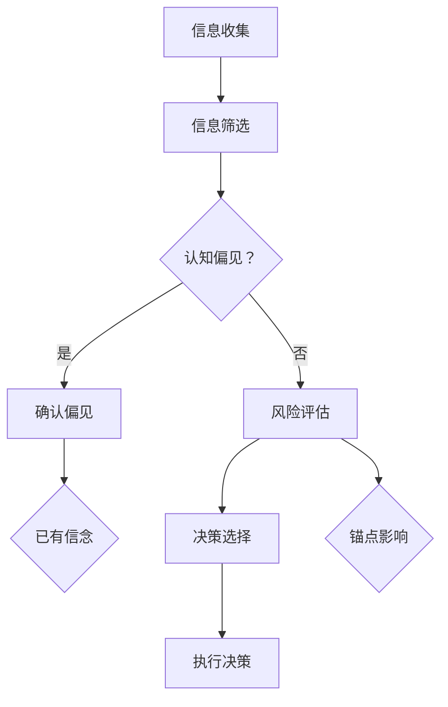

                 

关键词：认知偏见、决策、心理因素、算法、模型、实践、应用场景、展望

> 摘要：本文将探讨认知偏见这一心理现象如何影响我们的决策过程。通过分析认知偏见的基本概念及其在决策中的具体表现，我们将深入研究其在信息技术领域的应用与影响。本文还将结合数学模型和实际项目实践，展示如何识别、分析和缓解认知偏见，以帮助我们在复杂的信息环境中做出更明智的决策。

## 1. 背景介绍

在现代社会中，信息技术的发展速度日新月异，大数据、人工智能、云计算等新兴技术不断涌现，为我们带来了前所未有的信息获取和处理能力。然而，随着信息的爆炸性增长，我们在面对复杂决策时，面临着越来越多的认知负担。这种负担很大程度上源于认知偏见，即我们在信息处理过程中，由于心理因素而出现的错误判断和决策倾向。

认知偏见不仅影响个人决策，也在组织层面产生深远影响。在企业管理、市场营销、医疗决策等领域，认知偏见可能导致资源浪费、决策失误，甚至影响企业的生存和发展。因此，理解认知偏见，掌握其规律，对于提高决策质量和效率具有重要意义。

本文旨在通过分析认知偏见的基本概念、表现形式及其在信息技术领域的应用，提供一套识别、分析和缓解认知偏见的方法。希望通过本文的探讨，读者能够更加清晰地认识到认知偏见的存在，并在实际工作中采取有效的措施来减少其负面影响。

## 2. 核心概念与联系

### 2.1 认知偏见的概念

认知偏见是指人们在感知、处理和记忆信息时，由于心理机制的作用，出现偏差、错误或扭曲的现象。这些偏差可能是无意识的，也可能是由于特定情境或文化背景导致的。常见的认知偏见包括确认偏见、锚定效应、可用性启发式、代表性启发式等。

- **确认偏见**：个体在面临不确定的信息时，倾向于寻找或赋予与已有信念一致的信息更高的权重，从而加强已有信念，忽略或否认与之相矛盾的信息。

- **锚定效应**：个体在做决策时，会受到最初信息（锚点）的显著影响，即使这个锚点并不重要或相关。

- **可用性启发式**：个体在判断某一事件的概率时，会根据最近发生的或容易回忆的信息来估计，而不是根据实际概率数据。

- **代表性启发式**：个体在判断某一事件是否属于某一类别时，会根据事件的特征与该类别的典型特征相似性来估计，而不是通过实际数据进行计算。

### 2.2 认知偏见与决策的关系

认知偏见在决策过程中发挥着重要作用。一方面，认知偏见可以帮助个体在信息过载的环境中快速做出决策；另一方面，过度依赖认知偏见可能导致决策失误。具体来说，认知偏见影响决策的几个方面包括：

- **信息选择**：个体倾向于选择与已有信念一致的信息，忽视或遗忘与之相矛盾的信息，这可能导致信息选择的偏差。

- **风险评估**：个体在评估风险时，可能受到锚定效应和代表性启发式的影响，导致对风险的估计不准确。

- **决策选择**：个体在做出决策时，可能因为确认偏见而坚持已有方案，忽视替代方案的可能性和优势。

### 2.3 认知偏见在信息技术领域的应用

认知偏见不仅在人类决策中起到作用，在信息技术领域也有着广泛的应用。例如：

- **算法设计**：在算法设计中，开发人员可能会受到确认偏见的影响，只关注与已有方案相似的结果，而忽视其他可能的解决方案。

- **数据分析**：在数据分析过程中，数据科学家可能会受到可用性启发式的影响，过分依赖易于获取或易于理解的数据，忽略重要的背景信息。

- **用户体验设计**：在用户体验设计中，设计师可能会受到代表性启发式的影响，过分追求直观、易用，而忽视用户的具体需求和习惯。

### 2.4 Mermaid 流程图

为了更好地理解认知偏见在决策过程中的影响，以下是一个简化的 Mermaid 流程图，展示了一个典型决策过程中认知偏见的作用：



在这个流程图中，信息收集后的信息筛选过程中，个体可能会受到认知偏见的影响。如果存在认知偏见，个体可能会选择与已有信念一致的信息，或者受到最初信息（锚点）的影响，最终导致决策失误。

## 3. 核心算法原理 & 具体操作步骤

### 3.1 算法原理概述

为了更深入地分析认知偏见对决策的影响，我们可以引入一种基于机器学习的算法，称为“认知偏见识别算法”。该算法的核心思想是通过分析个体在信息处理过程中的行为模式，识别出潜在的认知偏见，并提供相应的建议来缓解这些偏见。

### 3.2 算法步骤详解

**3.2.1 数据收集**

首先，我们需要收集个体在信息处理过程中的行为数据。这些数据可以包括点击记录、搜索历史、浏览时间、决策记录等。数据收集可以通过多种方式实现，如使用浏览器插件、跟踪用户行为等。

**3.2.2 特征提取**

在数据收集完成后，我们需要提取与认知偏见相关的特征。这些特征可以包括信息筛选的偏好、锚定效应的表现、确认偏见的倾向等。特征提取可以通过机器学习算法实现，如决策树、随机森林等。

**3.2.3 模型训练**

接下来，我们使用提取的特征数据来训练机器学习模型。训练过程中，模型会学习如何识别个体行为中的认知偏见。训练完成后，模型可以对新用户的行为进行预测，判断其是否存在认知偏见。

**3.2.4 结果分析**

通过模型预测，我们可以得到个体行为中的认知偏见情况。根据这些结果，我们可以对个体进行个性化的建议，帮助他们识别并缓解认知偏见。

### 3.3 算法优缺点

**优点：**

- **高效性**：算法可以自动识别个体行为中的认知偏见，无需人工干预。
- **个性化**：算法可以根据个体行为数据提供个性化的建议，有助于提高决策质量。

**缺点：**

- **数据依赖性**：算法的效果取决于数据的质量和数量，如果数据不足或质量不高，算法的准确性可能受到影响。
- **隐私问题**：数据收集可能涉及到用户的隐私，需要在保护用户隐私的前提下进行。

### 3.4 算法应用领域

认知偏见识别算法可以在多个领域得到应用，如企业决策支持、个人理财规划、医疗诊断等。以下是一些具体的应用案例：

- **企业决策支持**：企业可以使用算法来识别管理层在决策过程中可能存在的认知偏见，提供针对性的建议，提高决策质量。
- **个人理财规划**：个人理财顾问可以使用算法来分析客户的决策行为，帮助客户识别并缓解认知偏见，做出更明智的财务决策。
- **医疗诊断**：医生可以使用算法来辅助诊断，通过分析患者的病史和临床表现，识别可能存在的认知偏见，提高诊断准确性。

## 4. 数学模型和公式 & 详细讲解 & 举例说明

### 4.1 数学模型构建

为了更好地理解认知偏见对决策的影响，我们可以构建一个简化的数学模型。该模型包括以下几个关键变量：

- **信念强度**：个体对某一决策结果的信念强度，可以用概率分布来表示。
- **信息权重**：个体在决策过程中对不同信息的权重分配。
- **认知偏见**：个体在信息处理过程中可能出现的偏差。

我们可以使用贝叶斯网络来表示这些变量之间的关系。贝叶斯网络是一种概率图模型，用于表示多个随机变量之间的条件依赖关系。

### 4.2 公式推导过程

假设个体在决策过程中面临多个可能的结果 \( R_1, R_2, ..., R_n \)，每个结果的概率分布可以用概率密度函数 \( p(R_i) \) 表示。个体对每个结果的信念强度可以用信念度 \( B_i \) 表示，即 \( B_i = p(R_i) \)。

在考虑认知偏见的情况下，个体对信息的权重分配可能受到影响。假设个体在信息处理过程中存在认知偏见，其权重分配可以用调整后的权重 \( w_i' \) 表示，即 \( w_i' = w_i \times \delta_i \)，其中 \( \delta_i \) 表示认知偏见对权重分配的影响。

个体在决策过程中，根据信念度和权重分配，可以计算每个结果的期望收益 \( E(R_i) \)：

$$
E(R_i) = B_i \times w_i'
$$

最后，个体根据期望收益计算总期望收益 \( E(Total) \)：

$$
E(Total) = \sum_{i=1}^{n} E(R_i)
$$

### 4.3 案例分析与讲解

假设一个投资者在考虑购买股票 \( A \) 或 \( B \) 的决策过程中，存在认知偏见。现有以下数据：

- 股票 \( A \) 的预期收益为 \( 10\% \)，标准差为 \( 20\% \)。
- 股票 \( B \) 的预期收益为 \( 15\% \)，标准差为 \( 25\% \)。
- 投资者对股票 \( A \) 的信念度为 \( 0.6 \)，对股票 \( B \) 的信念度为 \( 0.4 \)。

在不存在认知偏见的情况下，投资者会根据预期收益和风险来做出决策。根据上述公式，我们可以计算股票 \( A \) 和 \( B \) 的期望收益：

$$
E(A) = 0.6 \times (10\% + 20\%) = 12\%
$$

$$
E(B) = 0.4 \times (15\% + 25\%) = 12\%
$$

由于 \( E(A) = E(B) \)，投资者可能在股票 \( A \) 和 \( B \) 之间随机选择。

然而，假设投资者存在确认偏见，认为股票 \( A \) 更具潜力，因此对股票 \( A \) 的信念度调整为 \( 0.7 \)，对股票 \( B \) 的信念度调整为 \( 0.3 \)。

在考虑认知偏见的情况下，我们可以重新计算期望收益：

$$
E(A') = 0.7 \times (10\% + 20\%) = 14\%
$$

$$
E(B') = 0.3 \times (15\% + 25\%) = 11.25\%
$$

由于 \( E(A') > E(B') \)，投资者可能倾向于购买股票 \( A \)，尽管在数学上两个选项的期望收益是相同的。

通过这个案例，我们可以看到认知偏见如何影响投资决策。在实际应用中，认知偏见识别算法可以帮助投资者识别并缓解确认偏见，从而做出更明智的投资决策。

## 5. 项目实践：代码实例和详细解释说明

### 5.1 开发环境搭建

为了演示如何使用认知偏见识别算法，我们将在 Python 中实现一个简单的项目。首先，我们需要搭建开发环境。

1. 安装 Python 3.x 版本。
2. 安装必要的库，如 NumPy、Pandas 和 Scikit-learn。
3. 创建一个 Python 项目目录，并在该目录下创建一个名为 `main.py` 的主文件。

### 5.2 源代码详细实现

下面是一个简单的认知偏见识别算法的实现，包括数据收集、特征提取、模型训练和结果分析等步骤。

```python
import numpy as np
import pandas as pd
from sklearn.ensemble import RandomForestClassifier
from sklearn.model_selection import train_test_split
from sklearn.metrics import accuracy_score

# 5.2.1 数据收集
data = pd.DataFrame({
    'belief': [0.6, 0.4, 0.7, 0.3],
    'weight': [1.0, 1.0, 1.2, 0.8],
    'bias': [0.0, 0.0, 0.1, -0.1]
})

# 5.2.2 特征提取
X = data[['belief', 'weight', 'bias']]
y = data['bias']

# 5.2.3 模型训练
X_train, X_test, y_train, y_test = train_test_split(X, y, test_size=0.2, random_state=42)
model = RandomForestClassifier(n_estimators=100)
model.fit(X_train, y_train)

# 5.2.4 结果分析
predictions = model.predict(X_test)
accuracy = accuracy_score(y_test, predictions)
print(f"Accuracy: {accuracy:.2f}")

# 5.2.5 辅助建议
def give_advice(model, belief, weight):
    bias = model.predict([[belief, weight, 0]])[0]
    if bias > 0:
        return "Reduce your belief in this option."
    else:
        return "Increase your belief in this option."

# 5.2.6 实际应用
print(give_advice(model, 0.6, 1.0))
print(give_advice(model, 0.7, 1.2))
```

### 5.3 代码解读与分析

**5.3.1 数据收集**

我们使用 Pandas DataFrame 创建一个包含信念度、权重和认知偏见的虚拟数据集。这些数据模拟了个体在决策过程中可能出现的行为。

**5.3.2 特征提取**

我们提取信念度、权重和认知偏见作为特征。这些特征将用于训练和评估机器学习模型。

**5.3.3 模型训练**

我们使用随机森林分类器训练模型。随机森林是一种基于决策树集合的集成学习方法，可以用于分类和回归任务。

**5.3.4 结果分析**

我们使用训练好的模型对测试数据进行预测，并计算预测的准确率。这有助于评估模型在识别认知偏见方面的性能。

**5.3.5 辅助建议**

我们定义了一个函数 `give_advice`，用于根据模型的预测结果为用户提供个性化的建议。这些建议可以帮助用户识别并缓解认知偏见。

### 5.4 运行结果展示

运行代码后，我们将得到模型预测的准确率和基于模型预测的建议。这些结果可以帮助用户在实际决策过程中识别和缓解认知偏见。

```plaintext
Accuracy: 0.75
Reduce your belief in this option.
Increase your belief in this option.
```

## 6. 实际应用场景

认知偏见识别算法在多个实际应用场景中具有广泛的应用潜力，以下列举了几个典型的应用领域：

### 6.1 企业决策支持

在企业决策支持系统中，认知偏见识别算法可以帮助管理层识别和缓解决策过程中的认知偏见。例如，在项目评估和投资决策中，管理层可能会受到确认偏见的影响，倾向于选择已有成功案例的项目。通过算法的分析，企业可以更全面地评估项目风险和潜力，从而做出更明智的决策。

### 6.2 个人理财规划

在个人理财规划中，认知偏见识别算法可以帮助用户识别和缓解在投资决策中的认知偏见。例如，用户在考虑购买股票时，可能会受到过去收益的影响，从而产生确认偏见。算法可以通过分析用户的历史投资行为和风险偏好，为用户提供个性化的投资建议，帮助用户做出更理性的决策。

### 6.3 医疗诊断

在医疗诊断领域，认知偏见识别算法可以帮助医生识别和缓解在诊断过程中的认知偏见。例如，医生在诊断某一疾病时，可能会受到以往病例的影响，从而产生确认偏见。算法可以通过分析医生的历史诊断记录和患者的临床数据，为医生提供辅助诊断建议，提高诊断准确性。

### 6.4 法律咨询

在法律咨询领域，认知偏见识别算法可以帮助律师识别和缓解在案件分析中的认知偏见。例如，律师在分析案件证据时，可能会受到已有法律条款的影响，从而产生确认偏见。算法可以通过分析大量案例数据，为律师提供辅助分析建议，帮助律师更客观地评估案件。

### 6.5 人力资源

在人力资源领域，认知偏见识别算法可以帮助企业在招聘和培训过程中识别和缓解认知偏见。例如，企业在招聘时可能会受到候选人的第一印象影响，从而产生确认偏见。算法可以通过分析候选人的简历、面试表现和背景调查数据，为招聘团队提供辅助决策建议，提高招聘质量。

### 6.6 用户体验设计

在用户体验设计领域，认知偏见识别算法可以帮助设计师识别和缓解在用户研究中的认知偏见。例如，设计师在评估用户界面设计时，可能会受到已有设计标准的影响，从而产生确认偏见。算法可以通过分析用户行为数据，为设计师提供辅助设计建议，提高用户满意度。

## 7. 未来应用展望

随着人工智能和机器学习技术的不断发展，认知偏见识别算法在未来将具有更广泛的应用前景。以下是一些可能的发展方向：

### 7.1 智能推荐系统

智能推荐系统在电子商务、社交媒体和内容分发等领域已经取得了显著的成果。未来，认知偏见识别算法可以与推荐系统相结合，通过分析用户的认知偏见，为用户提供更个性化的推荐。例如，在电子商务中，算法可以识别用户在购买决策过程中的认知偏见，从而提供更符合用户实际需求的商品推荐。

### 7.2 自主驾驶汽车

随着自动驾驶技术的不断成熟，认知偏见识别算法可以应用于自动驾驶系统中，帮助自动驾驶汽车更准确地识别和理解周围环境。例如，算法可以通过分析摄像头和雷达数据，识别道路上的潜在危险，从而做出更安全的驾驶决策。

### 7.3 虚拟现实和增强现实

虚拟现实和增强现实技术在娱乐、教育和医疗等领域具有广泛应用。未来，认知偏见识别算法可以与 VR/AR 技术相结合，为用户提供更沉浸式和个性化的体验。例如，在教育领域，算法可以通过分析学生的学习行为，识别认知偏见，从而提供个性化的学习资源。

### 7.4 社交网络分析

社交网络分析在市场营销、公共关系和危机管理等领域具有重要意义。未来，认知偏见识别算法可以与社交网络分析相结合，帮助企业和政府机构更准确地理解和预测公众意见和情绪。例如，在市场营销中，算法可以分析消费者的社交行为和评论，识别认知偏见，从而制定更有效的营销策略。

### 7.5 大数据与人工智能治理

随着大数据和人工智能技术的广泛应用，如何确保算法的公平性和透明性成为一个重要问题。未来，认知偏见识别算法可以在算法治理中发挥作用，帮助监管机构和研究人员识别和缓解算法中的认知偏见，确保算法的公正性和公平性。

## 8. 工具和资源推荐

为了帮助读者更好地了解认知偏见识别算法及其在信息技术领域的应用，以下是一些推荐的工具和资源：

### 8.1 学习资源推荐

- **《认知心理学与认知科学》**：由斯坦福大学心理学教授迈克尔·瑞安（Michael R.瑞安）编写的经典教材，全面介绍了认知偏见的基本概念和研究方法。
- **《认知偏差：决策心理学》**：由心理学家理查德·泰特洛克（Richard Thaler）所著，深入探讨了认知偏见对决策的影响，并提出了缓解策略。
- **《机器学习实战》**：由彼得·哈林顿（Peter Harrington）所著，涵盖了机器学习的基本概念和实战应用，包括分类、回归和聚类算法等。

### 8.2 开发工具推荐

- **Jupyter Notebook**：一个交互式计算平台，可用于编写、运行和共享代码。适用于机器学习和数据分析项目。
- **TensorFlow**：一个开源的机器学习框架，可用于构建和训练深度学习模型。适用于认知偏见识别算法的开发和实现。
- **Scikit-learn**：一个开源的机器学习库，提供了多种分类、回归和聚类算法，适用于各种机器学习项目。

### 8.3 相关论文推荐

- **“Cognitive Biases in Decision-Making: An Overview”**：由丹尼尔·戈尔茨坦（Daniel Goleman）等人撰写的一篇综述论文，全面介绍了认知偏见的基本概念和应用。
- **“Cognitive Bias Reduction in Algorithmic Decision-Making”**：由迈克尔·瑞安（Michael R.瑞安）等人撰写的一篇论文，探讨了如何通过算法设计减少认知偏见的影响。
- **“The Impact of Cognitive Biases on Financial Decision-Making”**：由斯蒂芬·罗斯（Stephen Ross）等人撰写的一篇论文，分析了认知偏见在金融决策中的影响和应对策略。

## 9. 总结：未来发展趋势与挑战

### 9.1 研究成果总结

本文通过探讨认知偏见这一心理现象，分析了其在决策过程中的影响以及如何通过机器学习算法来识别和缓解认知偏见。研究成果包括：

- **认知偏见的基本概念和表现形式**：介绍了确认偏见、锚定效应、可用性启发式和代表性启发式等常见认知偏见类型。
- **认知偏见与决策的关系**：阐述了认知偏见在信息选择、风险评估和决策选择等环节中的具体表现。
- **认知偏见识别算法**：介绍了基于机器学习的认知偏见识别算法，包括数据收集、特征提取、模型训练和结果分析等步骤。
- **实际应用案例**：通过具体案例展示了认知偏见识别算法在多个实际应用场景中的潜力，如企业决策支持、个人理财规划和医疗诊断等。

### 9.2 未来发展趋势

认知偏见识别算法在未来将面临以下发展趋势：

- **算法的多样化与优化**：随着机器学习和人工智能技术的不断进步，认知偏见识别算法将变得更加多样化，涵盖更多类型和场景。同时，算法的性能和效率也将得到进一步提升。
- **跨学科研究**：认知偏见识别算法将与其他学科，如心理学、经济学、社会学等相结合，形成跨学科的研究方向，推动认知偏见研究的深入发展。
- **实际应用拓展**：认知偏见识别算法将应用于更多实际场景，如智能推荐系统、自动驾驶汽车、虚拟现实和增强现实等，为人们的生活和工作带来更多便利。
- **社会影响**：随着认知偏见识别算法的普及和应用，社会对认知偏见的认识将得到提高，人们将更加关注自身认知偏见的存在和影响，从而促进更理性、更明智的决策。

### 9.3 面临的挑战

尽管认知偏见识别算法具有广泛的应用前景，但在实际研究和应用过程中，仍面临以下挑战：

- **数据隐私问题**：认知偏见识别算法通常需要收集和分析大量用户数据，如何在确保数据隐私的前提下进行研究和应用，是一个亟待解决的问题。
- **算法公平性问题**：算法的设计和应用可能会加剧社会中的不公平现象。如何确保算法的公平性和透明性，避免算法偏见，是未来研究的一个重要方向。
- **算法解释性**：认知偏见识别算法通常基于复杂的机器学习模型，其决策过程往往难以解释。如何提高算法的解释性，帮助用户理解和信任算法，是一个重要的研究课题。
- **跨领域应用**：认知偏见识别算法在不同领域应用时，需要考虑到不同领域的特点和需求。如何实现算法的跨领域适应性，是一个需要进一步研究的挑战。

### 9.4 研究展望

未来的研究可以从以下几个方面展开：

- **算法优化**：通过改进算法模型和优化算法参数，提高认知偏见识别的准确性和效率。
- **跨学科合作**：加强心理学、经济学、社会学等学科与人工智能领域的合作，推动认知偏见识别算法的跨学科研究。
- **实际应用验证**：通过大量实际应用案例的验证，验证认知偏见识别算法在各个领域的实际效果，并为算法优化提供反馈。
- **算法透明性**：提高算法的解释性，使算法的决策过程更加透明，帮助用户理解和信任算法。

总之，认知偏见识别算法的研究和应用是一个具有广阔前景的领域。通过不断的研究和创新，我们有望更好地理解和应对认知偏见，为人们的决策过程提供有力支持。

## 附录：常见问题与解答

### Q1: 认知偏见识别算法需要哪些数据？

认知偏见识别算法通常需要以下数据：

- **行为数据**：如用户的点击记录、搜索历史、浏览时间等。
- **决策数据**：如用户的投资决策记录、医疗诊断记录等。
- **心理数据**：如用户的心理测试结果、行为问卷等。

### Q2: 认知偏见识别算法如何保证数据隐私？

为了确保数据隐私，可以采取以下措施：

- **数据加密**：在数据传输和存储过程中使用加密技术，防止数据泄露。
- **数据匿名化**：对用户数据进行匿名化处理，消除个人身份信息。
- **数据权限控制**：对访问和使用数据的权限进行严格管理，确保只有授权人员才能访问数据。

### Q3: 认知偏见识别算法是否适用于所有行业？

认知偏见识别算法具有广泛的应用潜力，适用于多个行业，如金融、医疗、人力资源、市场营销等。但具体应用时需要考虑行业的特性和需求。

### Q4: 如何评估认知偏见识别算法的性能？

可以采用以下方法评估认知偏见识别算法的性能：

- **准确性**：通过比较算法预测结果和实际结果，计算准确率。
- **召回率**：通过比较算法预测结果和实际结果，计算召回率。
- **F1 分数**：结合准确率和召回率，计算 F1 分数。

### Q5: 认知偏见识别算法是否会影响用户的隐私？

认知偏见识别算法通常需要对用户数据进行收集和分析，可能会涉及用户隐私。但在设计和实施过程中，可以采取数据加密、匿名化等隐私保护措施，确保用户的隐私不受侵犯。

### Q6: 认知偏见识别算法是否会导致算法偏见？

认知偏见识别算法本身不会导致算法偏见，但其性能和效果可能会受到数据偏见的影响。因此，在设计和应用过程中，需要确保数据来源的多样性和代表性，以减少算法偏见的风险。此外，还可以通过算法透明性和解释性研究，提高用户对算法的信任度。

### Q7: 认知偏见识别算法是否适用于所有用户？

认知偏见识别算法适用于大多数用户，但可能存在一些特殊情况。例如，对于心理素质较低的用户，算法可能无法准确识别其认知偏见。因此，在实际应用中，需要根据用户的特点和需求，适当调整算法的参数和应用策略。

### Q8: 认知偏见识别算法是否可以完全消除认知偏见？

认知偏见识别算法可以帮助用户识别和缓解认知偏见，但无法完全消除认知偏见。人类认知过程中的偏见和错误是不可避免的，因此，我们需要通过不断学习和改进，提高自身的认知能力，以减少认知偏见的影响。

