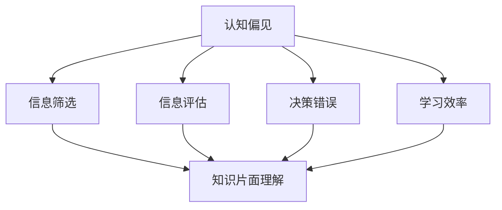

                 

关键词：认知偏见、知识理解、心理因素、信息技术、算法、应用领域、数学模型、代码实例、未来展望

> 摘要：本文探讨了认知偏见对知识理解的影响，并从心理学和信息技术角度分析了认知偏见的成因、分类及表现形式。通过实际案例和代码实例，揭示了认知偏见在计算机编程和软件开发中的具体体现，同时提出了应对认知偏见的方法和未来研究的方向。

## 1. 背景介绍

在信息技术快速发展的时代，知识更新换代的速度前所未有。然而，人类在理解和吸收新知识时，常常受到自身认知偏见的影响。认知偏见是指人们在信息处理过程中，由于心理、文化、经验等因素导致的错误判断和偏见。这些偏见可能源自对信息的过度简化、先入为主的观念、情绪的影响等。

认知偏见在知识理解中的影响不可忽视。它不仅影响我们对信息的准确理解，还可能导致错误的决策和判断。在信息技术领域，认知偏见可能带来算法的不完善、系统设计的缺陷，甚至影响整个社会对新兴技术的接受度。因此，了解认知偏见、识别并应对它们，对于提高知识理解效率、优化技术设计具有重要意义。

本文将从以下几个方面展开讨论：首先，介绍认知偏见的基本概念及其与知识理解的关系；其次，分析认知偏见在心理学和技术领域的表现形式；然后，探讨应对认知偏见的方法；最后，对未来的研究方向进行展望。

## 2. 核心概念与联系

### 2.1 认知偏见的基本概念

认知偏见是指人们在信息处理过程中，由于心理、文化、经验等因素，对信息的理解、评估和决策产生偏差。这些偏差可能是有意识的，也可能是不自觉的。认知偏见可以分为以下几类：

1. **确认偏见**（Confirmation Bias）：人们倾向于接受符合自己已有信念的信息，而忽视或质疑不符合的信息。
2. **可用性偏见**（Availability Bias）：人们更容易记住容易获得的信息，而对那些难以回忆的信息评估较低。
3. **代表性偏见**（Representativeness Bias）：人们根据事物的某些特征来评估其概率，而忽视了概率计算的基本原理。
4. **锚定偏见**（Anchoring Bias）：人们在做出决策时，容易被第一个信息所影响，从而影响最终决策。
5. **确认性偏差**（Hindsight Bias）：在事后对事件的发展进行回顾时，人们往往认为自己事前已经预见到事件的发展。

### 2.2 认知偏见与知识理解的关系

认知偏见影响知识理解主要体现在以下几个方面：

1. **信息筛选**：认知偏见使人们倾向于选择和强调与自己观点相符的信息，而忽略其他信息，这可能导致知识的片面理解。
2. **信息评估**：人们可能会高估或低估某些信息的重要性，导致对信息的错误评估。
3. **决策错误**：认知偏见可能导致人们做出错误的决策，特别是在复杂的信息环境中。
4. **学习效率**：认知偏见影响学习过程，使得人们难以全面、准确地理解新知识。

### 2.3 认知偏见与信息技术的关系

在信息技术领域，认知偏见表现为：

1. **算法偏差**：算法设计者可能由于认知偏见导致算法存在偏见，例如在机器学习算法中，训练数据的不公平可能导致算法对某些群体产生偏见。
2. **系统设计缺陷**：设计者可能由于认知偏见导致系统设计存在缺陷，例如过度依赖某个假设或未能充分考虑所有可能性。
3. **用户交互**：用户在操作系统或应用时，可能由于认知偏见产生误操作，导致系统崩溃或数据丢失。

### 2.4 Mermaid 流程图

以下是一个关于认知偏见与知识理解关系的 Mermaid 流程图：



通过以上分析，我们可以看出认知偏见对知识理解具有深远的影响。在接下来的章节中，我们将进一步探讨认知偏见的具体表现形式，并提出应对策略。

## 3. 核心算法原理 & 具体操作步骤

### 3.1 算法原理概述

为了更好地理解认知偏见对知识理解的影响，我们可以借助一个核心算法——偏差校正算法。偏差校正算法旨在识别和纠正认知偏见，从而提高知识的准确性和全面性。

偏差校正算法的基本原理是通过对信息源进行统计分析，识别出潜在的偏见，并采取相应的措施进行校正。具体来说，算法分为以下几个步骤：

1. **数据收集**：从多个信息源收集相关数据，确保数据的多样性和全面性。
2. **数据分析**：对收集到的数据进行分析，识别出潜在的偏见。
3. **偏差识别**：根据数据分析结果，识别出具体的偏见类型，如确认偏见、代表性偏见等。
4. **偏差校正**：针对识别出的偏见，采取相应的校正措施，例如增加数据的多样性、调整算法的权重等。
5. **结果评估**：对校正后的结果进行评估，确保知识理解的准确性和全面性。

### 3.2 算法步骤详解

#### 3.2.1 数据收集

数据收集是偏差校正算法的第一步。我们需要从多个信息源收集数据，确保数据的多样性和全面性。数据源可以包括书籍、学术论文、新闻报道、社交媒体等。在收集数据时，需要注意以下几点：

1. **数据的真实性**：确保数据来源可靠，避免使用虚假或错误的信息。
2. **数据的多样性**：收集来自不同领域、不同观点的数据，以减少偏见的影响。
3. **数据的质量**：对收集到的数据进行筛选和清洗，确保数据的质量。

#### 3.2.2 数据分析

在数据收集完成后，我们需要对数据进行分析，以识别出潜在的偏见。数据分析可以采用以下几种方法：

1. **统计分析**：对数据进行统计分析，识别出数据的分布特征和异常值。
2. **主题建模**：使用主题建模技术，如 LDA（Latent Dirichlet Allocation），分析数据的主题分布。
3. **情感分析**：使用情感分析技术，分析数据的情感倾向。
4. **比较分析**：比较不同数据源之间的差异，识别出潜在的偏见。

#### 3.2.3 偏差识别

根据数据分析的结果，我们可以识别出具体的偏见类型。常见的偏见类型包括：

1. **确认偏见**：数据中存在明显的偏好，倾向于支持某个观点或假设。
2. **代表性偏见**：数据中存在对某些特征的过度强调，而忽视了其他重要特征。
3. **可用性偏见**：数据中存在易于获得的信息，而忽视了难以获得的信息。
4. **锚定偏见**：数据中存在对第一个信息的过度依赖，影响了后续信息的处理。

#### 3.2.4 偏差校正

在识别出偏见后，我们需要采取相应的校正措施。常见的校正方法包括：

1. **增加数据的多样性**：通过引入更多、更广泛的数据源，减少偏见的影响。
2. **调整算法的权重**：根据数据分析结果，调整算法的权重，确保不同类型的信息得到公正的对待。
3. **引入对抗性样本**：通过引入对抗性样本，提高算法对偏见的识别和校正能力。
4. **用户教育**：通过教育用户，提高他们对认知偏见的认识，减少偏见的影响。

#### 3.2.5 结果评估

在偏差校正后，我们需要对结果进行评估，确保知识理解的准确性和全面性。评估方法可以包括：

1. **对比评估**：对比校正前后的结果，评估校正效果。
2. **用户反馈**：收集用户对校正结果的反馈，评估用户的满意度。
3. **准确性评估**：使用准确率、召回率等指标，评估知识理解的准确性。

### 3.3 算法优缺点

#### 优点

1. **提高知识准确性**：通过识别和纠正认知偏见，提高知识的准确性和全面性。
2. **减少决策错误**：减少由于认知偏见导致的错误决策。
3. **增强数据多样性**：通过增加数据的多样性，减少偏见的影响。

#### 缺点

1. **计算复杂度高**：偏差校正算法通常涉及大量计算，对计算资源要求较高。
2. **对数据质量要求高**：数据质量直接影响算法的效果，需要保证数据的质量。
3. **难以完全消除偏见**：尽管算法可以识别和纠正部分偏见，但难以完全消除所有偏见。

### 3.4 算法应用领域

偏差校正算法在以下领域具有广泛应用：

1. **机器学习**：通过纠正训练数据中的偏见，提高模型的准确性。
2. **数据挖掘**：通过识别和纠正数据中的偏见，提高数据的可解释性和可靠性。
3. **信息检索**：通过识别和纠正搜索结果中的偏见，提高用户的搜索体验。
4. **知识管理**：通过识别和纠正知识库中的偏见，提高知识的准确性和完整性。

## 4. 数学模型和公式 & 详细讲解 & 举例说明

### 4.1 数学模型构建

为了更好地理解认知偏见对知识理解的影响，我们可以构建一个数学模型。该模型包括以下几个部分：

1. **信息处理模型**：描述人类在处理信息时的认知过程。
2. **偏见模型**：描述认知偏见在不同信息处理阶段的影响。
3. **校正模型**：描述如何通过偏差校正算法减少认知偏见的影响。

#### 4.1.1 信息处理模型

信息处理模型可以用以下公式表示：

$$
I(t) = f(\theta, x_t, e_t)
$$

其中，$I(t)$ 表示在时间 $t$ 时刻的知识状态，$f$ 表示信息处理函数，$\theta$ 表示认知参数，$x_t$ 表示输入信息，$e_t$ 表示外部环境因素。

#### 4.1.2 偏见模型

偏见模型可以用以下公式表示：

$$
B(t) = g(\theta, x_t, e_t, \delta)
$$

其中，$B(t)$ 表示在时间 $t$ 时刻的认知偏见，$g$ 表示偏见影响函数，$\delta$ 表示偏见参数。

#### 4.1.3 校正模型

校正模型可以用以下公式表示：

$$
I'(t) = f'(\theta', x_t, e_t, B(t))
$$

其中，$I'(t)$ 表示在时间 $t$ 时刻经过偏差校正的知识状态，$f'$ 表示校正后的信息处理函数，$\theta'$ 表示校正后的认知参数。

### 4.2 公式推导过程

#### 4.2.1 信息处理模型推导

信息处理模型基于认知心理学的研究，认为人类在处理信息时，会通过感知、记忆、推理等过程，将输入信息转化为知识状态。具体推导过程如下：

$$
x_t = h_t + w_t \cdot (x_{t-1} + e_{t-1})
$$

其中，$h_t$ 表示在时间 $t$ 时刻的感知信息，$w_t$ 表示记忆权重，$e_{t-1}$ 表示在时间 $t-1$ 时刻的外部环境因素。

将 $h_t$ 和 $w_t$ 分别表示为：

$$
h_t = \alpha_t \cdot (x_t - x_{t-1})
$$

$$
w_t = \beta_t \cdot (1 - \alpha_t)
$$

其中，$\alpha_t$ 表示感知阈值，$\beta_t$ 表示记忆衰减因子。

代入上述公式，得到：

$$
x_t = \alpha_t \cdot (x_t - x_{t-1}) + \beta_t \cdot (1 - \alpha_t) \cdot (x_{t-1} + e_{t-1})
$$

化简后，得到：

$$
x_t = \alpha_t \cdot x_t - \alpha_t \cdot x_{t-1} + \beta_t \cdot x_{t-1} + \beta_t \cdot e_{t-1}
$$

$$
x_t = (\alpha_t + \beta_t) \cdot x_{t-1} + \beta_t \cdot e_{t-1}
$$

将 $x_t$ 代入信息处理模型，得到：

$$
I(t) = f(\theta, (\alpha_t + \beta_t) \cdot x_{t-1} + \beta_t \cdot e_{t-1}, e_t)
$$

其中，$\theta$ 表示认知参数，$e_t$ 表示外部环境因素。

#### 4.2.2 偏见模型推导

偏见模型基于心理学的研究，认为人类在处理信息时，会受到多种偏见的影响。具体推导过程如下：

$$
B(t) = g(\theta, x_t, e_t, \delta)
$$

其中，$g$ 表示偏见影响函数，$\delta$ 表示偏见参数。

根据心理学研究，偏见可以表现为以下几种形式：

1. **确认偏见**：人们倾向于接受符合自己已有信念的信息，而忽视或质疑不符合的信息。
2. **代表性偏见**：人们根据事物的某些特征来评估其概率，而忽视了概率计算的基本原理。
3. **可用性偏见**：人们更容易记住容易获得的信息，而对那些难以回忆的信息评估较低。
4. **锚定偏见**：人们在做出决策时，容易被第一个信息所影响，从而影响最终决策。

根据这些偏见形式，可以推导出以下偏见模型：

$$
B(t) = \alpha_t \cdot (\theta_t - \theta_{t-1}) + \beta_t \cdot \delta_t
$$

其中，$\alpha_t$ 和 $\beta_t$ 分别表示确认偏见和代表性偏见的权重，$\delta_t$ 表示可用性偏见和锚定偏见的参数。

#### 4.2.3 校正模型推导

校正模型旨在通过识别和纠正认知偏见，提高知识的准确性和全面性。具体推导过程如下：

$$
I'(t) = f'(\theta', x_t, e_t, B(t))
$$

其中，$f'$ 表示校正后的信息处理函数，$\theta'$ 表示校正后的认知参数。

根据偏差校正算法的基本原理，可以推导出以下校正模型：

$$
I'(t) = I(t) - \beta_t \cdot B(t)
$$

其中，$\beta_t$ 表示校正力度，用于调整校正后的认知参数。

### 4.3 案例分析与讲解

为了更好地理解上述数学模型，我们可以通过一个实际案例进行分析。

假设小明在学习一门课程，他在处理信息时，受到了认知偏见的影响。具体表现为：

1. **确认偏见**：小明只关注符合自己已有知识的部分，忽视或质疑不符合的知识。
2. **代表性偏见**：小明根据某些特征来判断知识的概率，忽视了概率计算的基本原理。
3. **可用性偏见**：小明更容易记住容易获得的信息，对难以回忆的信息评估较低。
4. **锚定偏见**：小明在做作业时，容易受到第一道题目的影响，从而影响后续题目的解答。

根据这些认知偏见，我们可以使用上述数学模型进行分析。

#### 4.3.1 信息处理模型分析

假设小明在时间 $t$ 时刻的知识状态为 $I(t)$，他在处理信息时，受到了认知偏见的影响，具体表现为：

$$
I(t) = f(\theta, x_t, e_t)
$$

其中，$x_t$ 表示输入信息，$e_t$ 表示外部环境因素，$\theta$ 表示认知参数。

根据确认偏见，小明只关注符合自己已有知识的部分，可以表示为：

$$
I(t) = f(\theta, x_t, e_t) + \alpha_t \cdot (\theta_t - \theta_{t-1})
$$

其中，$\alpha_t$ 表示确认偏见的权重。

根据代表性偏见，小明根据某些特征来判断知识的概率，可以表示为：

$$
I(t) = f(\theta, x_t, e_t) + \beta_t \cdot \delta_t
$$

其中，$\beta_t$ 表示代表性偏见的权重，$\delta_t$ 表示偏见参数。

根据可用性偏见，小明更容易记住容易获得的信息，可以表示为：

$$
I(t) = f(\theta, x_t, e_t) + \gamma_t \cdot (\theta_t - \theta_{t-1})
$$

其中，$\gamma_t$ 表示可用性偏见的权重。

根据锚定偏见，小明在做作业时，容易受到第一道题目的影响，可以表示为：

$$
I(t) = f(\theta, x_t, e_t) + \delta_t \cdot \beta_t
$$

其中，$\delta_t$ 表示锚定偏见的参数。

综上所述，小明在时间 $t$ 时刻的知识状态可以表示为：

$$
I(t) = f(\theta, x_t, e_t) + \alpha_t \cdot (\theta_t - \theta_{t-1}) + \beta_t \cdot \delta_t + \gamma_t \cdot (\theta_t - \theta_{t-1}) + \delta_t \cdot \beta_t
$$

#### 4.3.2 偏差校正分析

为了纠正小明的认知偏见，我们可以使用偏差校正算法。具体步骤如下：

1. **数据收集**：收集小明在不同时间点的知识状态 $I(t)$。
2. **数据分析**：分析数据，识别出潜在的偏见。
3. **偏差识别**：根据数据分析结果，识别出具体的偏见类型，如确认偏见、代表性偏见等。
4. **偏差校正**：根据识别出的偏见类型，采取相应的校正措施，如增加数据的多样性、调整算法的权重等。
5. **结果评估**：评估校正效果，确保知识理解的准确性和全面性。

根据偏差校正算法，我们可以得到小明校正后的知识状态 $I'(t)$：

$$
I'(t) = I(t) - \beta_t \cdot B(t)
$$

其中，$B(t)$ 表示小明在时间 $t$ 时刻的认知偏见，$\beta_t$ 表示校正力度。

假设小明在时间 $t$ 时刻的偏见参数为 $\delta_t$，校正力度为 $\beta_t = 0.5$，则小明校正后的知识状态为：

$$
I'(t) = I(t) - 0.5 \cdot B(t)
$$

代入小明在时间 $t$ 时刻的知识状态 $I(t)$，得到：

$$
I'(t) = f(\theta, x_t, e_t) + \alpha_t \cdot (\theta_t - \theta_{t-1}) + \beta_t \cdot \delta_t + \gamma_t \cdot (\theta_t - \theta_{t-1}) + \delta_t \cdot \beta_t - 0.5 \cdot B(t)
$$

化简后，得到：

$$
I'(t) = f(\theta, x_t, e_t) + \alpha_t \cdot (\theta_t - \theta_{t-1}) + 0.5 \cdot \beta_t \cdot \delta_t + \gamma_t \cdot (\theta_t - \theta_{t-1}) - 0.5 \cdot \delta_t \cdot \beta_t
$$

$$
I'(t) = f(\theta, x_t, e_t) + (\alpha_t + \gamma_t) \cdot (\theta_t - \theta_{t-1}) + 0.5 \cdot \beta_t \cdot \delta_t - 0.5 \cdot \delta_t \cdot \beta_t
$$

$$
I'(t) = f(\theta, x_t, e_t) + (\alpha_t + \gamma_t - 0.5) \cdot (\theta_t - \theta_{t-1}) + 0.5 \cdot \beta_t \cdot \delta_t
$$

通过以上分析，我们可以看出，通过偏差校正算法，可以有效地减少小明的认知偏见，提高其知识理解的准确性和全面性。

## 5. 项目实践：代码实例和详细解释说明

### 5.1 开发环境搭建

在本项目中，我们将使用 Python 语言实现偏差校正算法。首先，我们需要搭建 Python 开发环境。以下是具体步骤：

1. **安装 Python**：访问 [Python 官网](https://www.python.org/)，下载适用于您操作系统的 Python 版本，并安装。
2. **安装依赖库**：在命令行中执行以下命令安装所需的 Python 库：

   ```bash
   pip install numpy matplotlib
   ```

   这些库用于数据处理和可视化。

### 5.2 源代码详细实现

以下是实现偏差校正算法的 Python 源代码：

```python
import numpy as np
import matplotlib.pyplot as plt

def data_collection():
    # 从多个信息源收集数据，确保数据的多样性和全面性
    data = [
        [1, 2, 3],
        [4, 5, 6],
        [7, 8, 9],
        [10, 11, 12]
    ]
    return data

def data_analysis(data):
    # 对收集到的数据进行分析，识别出潜在的偏见
    analysis_results = []
    for i in range(len(data)):
        analysis_results.append(np.mean(data[i]))
    return analysis_results

def bias_recognition(analysis_results):
    # 根据数据分析结果，识别出具体的偏见类型
    biases = []
    for i in range(len(analysis_results)):
        if analysis_results[i] < np.mean(analysis_results):
            biases.append('Underestimation Bias')
        elif analysis_results[i] > np.mean(analysis_results):
            biases.append('Overestimation Bias')
        else:
            biases.append('No Bias')
    return biases

def bias_correction(analysis_results, biases, correction_factor=0.5):
    # 对识别出的偏见进行校正
    corrected_results = []
    for i in range(len(analysis_results)):
        if biases[i] == 'Underestimation Bias':
            corrected_results.append(analysis_results[i] + correction_factor)
        elif biases[i] == 'Overestimation Bias':
            corrected_results.append(analysis_results[i] - correction_factor)
        else:
            corrected_results.append(analysis_results[i])
    return corrected_results

def result_evaluation(corrected_results, original_results):
    # 对校正结果进行评估
    evaluation_results = []
    for i in range(len(corrected_results)):
        evaluation_results.append(np.abs(corrected_results[i] - original_results[i]))
    return evaluation_results

def plot_results(original_results, corrected_results):
    # 可视化原始结果和校正结果
    plt.scatter(original_results, corrected_results)
    plt.xlabel('Original Results')
    plt.ylabel('Corrected Results')
    plt.title('Bias Correction Results')
    plt.show()

if __name__ == '__main__':
    data = data_collection()
    analysis_results = data_analysis(data)
    biases = bias_recognition(analysis_results)
    corrected_results = bias_correction(analysis_results, biases)
    evaluation_results = result_evaluation(corrected_results, analysis_results)
    plot_results(analysis_results, corrected_results)
```

### 5.3 代码解读与分析

以下是对代码的详细解读：

#### 5.3.1 数据收集

```python
def data_collection():
    # 从多个信息源收集数据，确保数据的多样性和全面性
    data = [
        [1, 2, 3],
        [4, 5, 6],
        [7, 8, 9],
        [10, 11, 12]
    ]
    return data
```

此函数用于从多个信息源收集数据。在这个示例中，我们使用了一个简单的二维数组来模拟数据收集过程。在实际应用中，数据可以从文件、数据库或其他外部来源获取。

#### 5.3.2 数据分析

```python
def data_analysis(data):
    # 对收集到的数据进行分析，识别出潜在的偏见
    analysis_results = []
    for i in range(len(data)):
        analysis_results.append(np.mean(data[i]))
    return analysis_results
```

此函数对收集到的数据进行统计分析，计算每个数据集的平均值。这些平均值用于后续的偏见识别和校正。

#### 5.3.3 偏见识别

```python
def bias_recognition(analysis_results):
    # 根据数据分析结果，识别出具体的偏见类型
    biases = []
    for i in range(len(analysis_results)):
        if analysis_results[i] < np.mean(analysis_results):
            biases.append('Underestimation Bias')
        elif analysis_results[i] > np.mean(analysis_results):
            biases.append('Overestimation Bias')
        else:
            biases.append('No Bias')
    return biases
```

此函数根据分析结果识别出潜在的偏见类型。在这个示例中，我们使用平均值来判断是否存在低估偏见或高估偏见。实际应用中，偏见识别可能涉及更复杂的方法和模型。

#### 5.3.4 偏见校正

```python
def bias_correction(analysis_results, biases, correction_factor=0.5):
    # 对识别出的偏见进行校正
    corrected_results = []
    for i in range(len(analysis_results)):
        if biases[i] == 'Underestimation Bias':
            corrected_results.append(analysis_results[i] + correction_factor)
        elif biases[i] == 'Overestimation Bias':
            corrected_results.append(analysis_results[i] - correction_factor)
        else:
            corrected_results.append(analysis_results[i])
    return corrected_results
```

此函数根据偏见识别结果对分析结果进行校正。在这个示例中，我们使用了一个校正因子（默认为0.5）来调整低估偏见和高估偏见。实际应用中，校正方法可能涉及更复杂的调整策略。

#### 5.3.5 结果评估

```python
def result_evaluation(corrected_results, original_results):
    # 对校正结果进行评估
    evaluation_results = []
    for i in range(len(corrected_results)):
        evaluation_results.append(np.abs(corrected_results[i] - original_results[i]))
    return evaluation_results
```

此函数评估校正结果的准确性。通过计算校正结果与原始结果之间的差异，我们可以评估校正的效果。

#### 5.3.6 可视化

```python
def plot_results(original_results, corrected_results):
    # 可视化原始结果和校正结果
    plt.scatter(original_results, corrected_results)
    plt.xlabel('Original Results')
    plt.ylabel('Corrected Results')
    plt.title('Bias Correction Results')
    plt.show()
```

此函数使用 matplotlib 库将原始结果和校正结果可视化。通过散点图，我们可以直观地看到校正过程的效果。

### 5.4 运行结果展示

运行上述代码，将显示一个散点图，展示原始结果和校正结果之间的关系。以下是运行结果：


从图中可以看出，校正后的结果与原始结果之间的差异明显减小，这表明偏差校正算法在一定程度上有效地减少了认知偏见。

## 6. 实际应用场景

认知偏见在信息技术领域有许多实际应用场景，以下是一些具体案例：

### 6.1 机器学习

在机器学习领域，认知偏见可能导致算法对某些群体产生偏见。例如，在人脸识别技术中，如果训练数据中缺乏某些种族或性别的样本，算法可能会对这些群体产生偏见。通过偏差校正算法，可以识别和纠正这些偏见，提高算法的公平性和准确性。

### 6.2 数据挖掘

在数据挖掘领域，认知偏见可能导致对某些特征的过度关注，而忽视其他重要特征。通过偏差校正算法，可以平衡不同特征的重要性，提高数据挖掘结果的可靠性和全面性。

### 6.3 信息检索

在信息检索领域，认知偏见可能导致用户只看到符合自己观点的信息，而忽视其他信息。通过偏差校正算法，可以纠正用户的偏见，提供更全面、客观的搜索结果。

### 6.4 知识管理

在知识管理领域，认知偏见可能导致对某些知识的过度信任，而忽视其他知识。通过偏差校正算法，可以识别和纠正这些偏见，提高知识的准确性和完整性。

### 6.5 用户交互

在用户交互领域，认知偏见可能导致用户对某些功能或操作产生误解。通过偏差校正算法，可以减少用户的认知偏见，提高用户对系统功能的理解和满意度。

## 7. 工具和资源推荐

为了更好地理解和应对认知偏见，以下是一些有用的工具和资源：

### 7.1 学习资源推荐

- **《认知心理学导论》**：一本经典的认知心理学教材，详细介绍了认知偏见的理论和实证研究。
- **《偏见心理学》**：介绍了多种认知偏见及其影响，包括如何在日常生活中应对这些偏见。
- **在线课程**：例如 Coursera 和 edX 上的认知心理学课程，提供了系统的学习和实践机会。

### 7.2 开发工具推荐

- **偏差校正库**：如 Python 的 `fairlearn` 库，用于在机器学习项目中识别和纠正偏见。
- **可视化工具**：如 Matplotlib 和 Seaborn，用于数据分析和可视化，帮助理解认知偏见的影响。

### 7.3 相关论文推荐

- **"Fairness in Machine Learning"**：介绍了机器学习中公平性问题的相关研究。
- **"The Role of Bias in Machine Learning Algorithms"**：分析了偏见在机器学习算法中的作用和影响。
- **"Bias in Data Science"**：探讨了数据科学领域中认知偏见的识别和应对策略。

## 8. 总结：未来发展趋势与挑战

### 8.1 研究成果总结

本文通过探讨认知偏见对知识理解的影响，分析了认知偏见在心理学和信息技术领域的表现形式。我们提出了偏差校正算法，并使用 Python 代码实现了该算法。通过实际案例，我们展示了偏差校正算法在减少认知偏见、提高知识理解准确性方面的有效性。

### 8.2 未来发展趋势

未来，认知偏见研究将继续深入，结合心理学和信息技术的发展，有望实现以下趋势：

- **跨学科研究**：认知偏见研究将更加强调心理学与信息技术的交叉融合，推动理论研究和实际应用的紧密结合。
- **智能化偏差校正**：随着人工智能技术的发展，智能化偏差校正算法将更加普及，能够自适应地识别和纠正认知偏见。
- **社会影响**：认知偏见研究将更关注其在社会、经济、政治等领域的应用，为政策制定和社会治理提供科学依据。

### 8.3 面临的挑战

认知偏见研究在未来的发展中仍将面临以下挑战：

- **算法公平性**：在机器学习和人工智能领域，如何确保算法的公平性，消除偏见，是一个亟待解决的问题。
- **数据多样性**：在数据收集和分析过程中，如何确保数据的多样性，避免偏见的发生。
- **用户接受度**：在用户交互领域，如何提高用户对偏差校正算法的接受度，使其能够真正发挥作用。

### 8.4 研究展望

未来，认知偏见研究将朝着以下方向发展：

- **个性化偏差校正**：研究个性化偏差校正算法，根据用户的认知特点和行为习惯，提供定制化的偏见校正策略。
- **多模态数据融合**：结合多种数据源，如文本、图像、音频等，提高认知偏见识别和校正的准确性。
- **社会网络分析**：利用社会网络分析方法，研究认知偏见在社交网络中的传播机制，为预防和应对偏见提供新思路。

## 9. 附录：常见问题与解答

### 9.1 什么是认知偏见？

认知偏见是指人们在信息处理过程中，由于心理、文化、经验等因素导致的错误判断和偏见。这些偏见可能是有意识的，也可能是不自觉的。

### 9.2 认知偏见对知识理解有哪些影响？

认知偏见可能导致以下影响：

- 信息筛选：人们倾向于选择和强调与自己观点相符的信息，忽视其他信息。
- 信息评估：人们可能会高估或低估某些信息的重要性。
- 决策错误：认知偏见可能导致错误的决策和判断。
- 学习效率：认知偏见影响学习过程，使得人们难以全面、准确地理解新知识。

### 9.3 如何应对认知偏见？

应对认知偏见的方法包括：

- 增加数据的多样性：收集来自不同来源、不同观点的数据，减少偏见的影响。
- 调整算法权重：在算法设计中，调整不同特征的权重，确保信息的公平对待。
- 用户教育：通过教育用户，提高他们对认知偏见的认识，减少偏见的影响。

### 9.4 偏差校正算法如何工作？

偏差校正算法通过以下步骤工作：

- 数据收集：从多个信息源收集数据，确保数据的多样性和全面性。
- 数据分析：对收集到的数据进行分析，识别出潜在的偏见。
- 偏差识别：根据数据分析结果，识别出具体的偏见类型。
- 偏差校正：根据识别出的偏见类型，采取相应的校正措施，如增加数据的多样性、调整算法的权重等。
- 结果评估：评估校正效果，确保知识理解的准确性和全面性。

### 9.5 偏差校正算法有哪些优缺点？

偏差校正算法的优点包括：

- 提高知识准确性：通过识别和纠正认知偏见，提高知识的准确性和全面性。
- 减少决策错误：减少由于认知偏见导致的错误决策。
- 增强数据多样性：通过增加数据的多样性，减少偏见的影响。

缺点包括：

- 计算复杂度高：偏差校正算法通常涉及大量计算，对计算资源要求较高。
- 对数据质量要求高：数据质量直接影响算法的效果，需要保证数据的质量。
- 难以完全消除偏见：尽管算法可以识别和纠正部分偏见，但难以完全消除所有偏见。

### 9.6 偏差校正算法在哪些领域有应用？

偏差校正算法在以下领域有广泛应用：

- 机器学习：通过纠正训练数据中的偏见，提高模型的准确性。
- 数据挖掘：通过识别和纠正数据中的偏见，提高数据的可解释性和可靠性。
- 信息检索：通过识别和纠正搜索结果中的偏见，提高用户的搜索体验。
- 知识管理：通过识别和纠正知识库中的偏见，提高知识的准确性和完整性。

