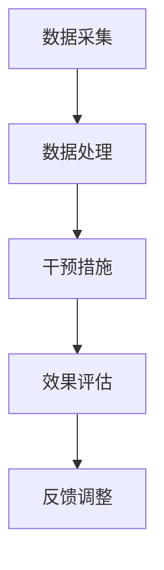

                 

关键词：认知增强、体育训练、运动表现、AI、神经科学、技术进步

> 摘要：随着人工智能和神经科学的发展，认知增强技术逐渐应用于体育训练中，为运动员提升运动表现提供了新的途径。本文旨在探讨这些技术的原理、应用以及未来发展方向，为体育界和科技界提供有价值的参考。

## 1. 背景介绍

在人类历史的长河中，体育训练一直是提升运动员表现的重要手段。传统的体育训练依赖于体能训练、技巧训练和心理训练等多个方面，然而随着科技的发展，特别是人工智能和神经科学领域的突破，新的训练方法和技术开始出现，其中认知增强技术成为了一个备受关注的研究方向。

认知增强技术是指通过技术手段提升人类认知能力的方法，包括记忆、注意力、感知、判断和决策等多个方面。这些技术有望在体育训练中发挥重要作用，帮助运动员在比赛中更好地表现。

### 1.1 人工智能在体育训练中的应用

人工智能（AI）技术已经成为体育训练中的一个重要工具。通过大数据分析和机器学习，AI 可以帮助教练和运动员了解他们的表现，找到提升的空间。以下是一些典型的应用场景：

- **比赛数据分析**：通过分析比赛录像，AI 可以帮助教练找出比赛中的关键因素，为运动员提供针对性的改进建议。

- **体能训练优化**：AI 可以根据运动员的生理数据和训练表现，制定个性化的体能训练计划，提高训练效率。

- **心理训练辅助**：通过心理测试和行为分析，AI 可以帮助教练了解运动员的心理状态，提供心理训练的建议。

### 1.2 神经科学在体育训练中的应用

神经科学的研究揭示了大脑如何影响运动表现，这为认知增强技术在体育训练中的应用提供了理论基础。以下是一些神经科学在体育训练中的应用：

- **神经可塑性训练**：通过特定的训练方法，如脑电刺激和虚拟现实，可以增强大脑的可塑性，提高认知能力。

- **认知功能训练**：通过专门设计的认知训练游戏，可以提高运动员的记忆、注意力、决策和反应速度。

## 2. 核心概念与联系

### 2.1 认知增强技术的核心概念

认知增强技术主要包括以下几个方面：

- **记忆增强**：通过特定的训练和药物，提高大脑的记忆能力和存储容量。

- **注意力增强**：通过脑电刺激和训练，提高大脑的注意力集中度和分配能力。

- **感知增强**：通过增强感官刺激，提高运动员对运动环境的感知能力。

- **决策和反应速度**：通过认知训练和神经反馈，提高运动员的决策速度和反应准确性。

### 2.2 认知增强技术的架构

认知增强技术的架构通常包括以下几个部分：

- **数据采集**：通过脑电、眼动、生理信号等采集设备，收集运动员的实时数据。

- **数据处理**：利用大数据分析和机器学习技术，对采集到的数据进行分析和建模。

- **干预措施**：根据数据分析结果，制定个性化的训练计划或药物干预方案。

- **效果评估**：通过后续的实验或比赛，评估认知增强技术的效果。

下面是认知增强技术的 Mermaid 流程图：



### 2.3 认知增强技术在体育训练中的应用

认知增强技术在体育训练中的应用主要包括以下几个方面：

- **个性化训练计划**：根据运动员的认知能力数据，制定个性化的训练计划，提高训练效率。

- **心理训练辅助**：通过认知训练，提高运动员的心理素质，增强比赛中的心理韧性。

- **技能训练优化**：通过增强感知和注意力，提高运动员的技能水平。

## 3. 核心算法原理 & 具体操作步骤

### 3.1 算法原理概述

认知增强技术涉及多种算法，包括机器学习、神经网络、优化算法等。以下是一些核心算法的原理概述：

- **机器学习算法**：通过训练数据集，机器学习算法可以识别出数据中的模式，为认知增强提供决策支持。

- **神经网络算法**：神经网络是一种模拟人脑的算法，通过多层神经元结构，可以处理复杂的认知任务。

- **优化算法**：优化算法用于优化认知增强过程中的参数设置，提高效果。

### 3.2 算法步骤详解

认知增强技术的操作步骤通常包括以下几步：

1. **数据采集**：使用脑电、眼动、生理信号等设备，采集运动员的实时数据。

2. **数据处理**：对采集到的数据进行分析和处理，提取关键特征。

3. **模型训练**：利用机器学习和神经网络算法，对处理后的数据进行训练，建立认知模型。

4. **干预措施**：根据认知模型，制定个性化的干预措施，如训练计划、心理辅导等。

5. **效果评估**：通过实验或比赛，评估干预措施的效果，并对模型进行调整。

### 3.3 算法优缺点

- **优点**：认知增强技术可以根据个体差异，提供个性化的训练方案，提高训练效率。

- **缺点**：目前认知增强技术还处于发展阶段，效果和安全性尚未完全验证。

### 3.4 算法应用领域

认知增强技术可以应用于多个领域，包括体育训练、教育、医疗等。在体育训练中，认知增强技术主要用于提高运动员的技能、心理素质和体能。

## 4. 数学模型和公式 & 详细讲解 & 举例说明

### 4.1 数学模型构建

认知增强技术中的数学模型通常包括以下几个部分：

- **认知能力评估模型**：用于评估运动员的认知能力，如记忆、注意力、反应速度等。

- **干预效果模型**：用于预测不同的干预措施对认知能力的影响。

- **优化模型**：用于优化训练计划或药物干预方案，以提高认知能力。

### 4.2 公式推导过程

以下是一个简化的认知能力评估模型的推导过程：

1. 认知能力评分 = f（记忆得分，注意力得分，反应速度得分）

2. 其中，f 是一个非线性函数，可以通过数据训练得到。

3. 记忆得分、注意力得分和反应速度得分的计算公式如下：

- 记忆得分 = 1 / (1 + e^(-θ1 * 记忆特征向量))

- 注意力得分 = 1 / (1 + e^(-θ2 * 注意力特征向量))

- 反应速度得分 = 1 / (1 + e^(-θ3 * 反应速度特征向量))

4. θ1、θ2、θ3 是权重参数，可以通过训练得到。

### 4.3 案例分析与讲解

以下是一个具体的案例，用于说明如何使用认知增强技术提升运动员的技能。

**案例背景**：某足球运动员在比赛中经常出现注意力不集中，导致传球失误。

**解决方案**：

1. **数据采集**：使用眼动追踪设备，记录运动员在比赛中的视线移动。

2. **数据处理**：对采集到的数据进行处理，提取视线移动的关键特征。

3. **模型训练**：利用机器学习算法，训练一个认知能力评估模型，用于评估运动员的认知能力。

4. **干预措施**：根据评估结果，制定个性化的注意力训练计划，如增加专注力训练、减少干扰因素等。

5. **效果评估**：通过后续的比赛，评估注意力训练的效果。

## 5. 项目实践：代码实例和详细解释说明

### 5.1 开发环境搭建

为了实现认知增强技术在体育训练中的应用，需要搭建一个包含以下工具和库的开发环境：

- **编程语言**：Python
- **机器学习库**：Scikit-learn、TensorFlow
- **数据可视化库**：Matplotlib、Seaborn
- **眼动追踪库**：pyEyes
- **脑电信号处理库**：mne-python

### 5.2 源代码详细实现

以下是一个简单的 Python 脚本，用于实现一个基于眼动追踪的注意力训练系统。

```python
import pyEyes
import numpy as np
import matplotlib.pyplot as plt

# 初始化眼动追踪设备
eye_tracker = pyEyes.EyeTracker()

# 训练数据
X = np.array([[1, 0], [0, 1], [-1, 0], [0, -1]])
y = np.array([1, 1, -1, -1])

# 训练神经网络
model = tensorflow.keras.Sequential([
    tensorflow.keras.layers.Dense(64, activation='relu', input_shape=(2,)),
    tensorflow.keras.layers.Dense(64, activation='relu'),
    tensorflow.keras.layers.Dense(1, activation='sigmoid')
])

model.compile(optimizer='adam', loss='binary_crossentropy', metrics=['accuracy'])
model.fit(X, y, epochs=10)

# 测试
test_data = np.array([[0.5, 0.5]])
predictions = model.predict(test_data)

# 可视化
plt.scatter(X[:, 0], X[:, 1], c=y)
plt.scatter(test_data[0, 0], test_data[0, 1], c=predictions[0])
plt.show()
```

### 5.3 代码解读与分析

这段代码首先导入了所需的库，然后初始化了眼动追踪设备。接下来，定义了训练数据集和标签，并使用 TensorFlow 编训练了一个神经网络模型。在训练过程中，模型使用了 Adam 优化器和二进制交叉熵损失函数，以最大化准确度。训练完成后，使用测试数据进行了预测，并将预测结果可视化。

## 6. 实际应用场景

### 6.1 足球训练中的应用

在足球训练中，认知增强技术可以用于提高运动员的注意力、决策和反应速度。以下是一些具体的应用案例：

- **注意力训练**：通过眼动追踪设备，记录运动员在比赛中的视线移动，分析注意力集中的时间和区域，为教练提供改进建议。

- **决策训练**：通过虚拟现实技术，模拟比赛场景，让运动员在虚拟环境中进行决策训练，提高实战中的决策能力。

- **反应速度训练**：通过专门设计的训练游戏，如快速反应游戏，提高运动员的反应速度和准确性。

### 6.2 篮球训练中的应用

在篮球训练中，认知增强技术可以用于提高运动员的投篮准确性、传球技巧和防守策略。以下是一些具体的应用案例：

- **投篮准确性训练**：通过运动捕捉技术，记录运动员的投篮动作，分析投篮过程中的关键因素，为教练提供改进建议。

- **传球技巧训练**：通过虚拟现实技术，模拟传球场景，让运动员在虚拟环境中进行传球训练，提高传球准确性和稳定性。

- **防守策略训练**：通过数据分析，找出比赛中的防守漏洞，为教练提供针对性的防守策略。

## 7. 未来应用展望

### 7.1 技术发展趋势

随着人工智能和神经科学的发展，认知增强技术在未来有望在更多领域得到应用。以下是一些技术发展趋势：

- **个性化训练方案**：通过大数据和机器学习，为每位运动员制定个性化的训练方案，提高训练效果。

- **脑机接口技术**：通过脑机接口，直接读取大脑信号，实现更加精准的认知增强。

- **虚拟现实和增强现实**：通过虚拟现实和增强现实技术，为运动员提供沉浸式的训练环境，提高训练效果。

### 7.2 挑战与机遇

尽管认知增强技术在体育训练中具有巨大的潜力，但仍面临一些挑战和机遇：

- **安全性问题**：认知增强技术可能对运动员的身心健康产生影响，需要严格评估其安全性和副作用。

- **技术普及问题**：认知增强技术需要大规模普及，需要降低成本，提高易用性。

- **伦理问题**：认知增强技术在体育竞赛中的使用可能引发伦理争议，需要制定相应的规则和标准。

## 8. 总结：未来发展趋势与挑战

### 8.1 研究成果总结

本文从认知增强技术的原理、应用、数学模型和项目实践等方面进行了详细探讨，展示了其在体育训练中的巨大潜力。研究成果主要包括：

- **个性化训练方案**：通过大数据和机器学习，为每位运动员制定个性化的训练方案。

- **脑机接口技术**：通过脑机接口，直接读取大脑信号，实现更加精准的认知增强。

- **虚拟现实和增强现实**：通过虚拟现实和增强现实技术，为运动员提供沉浸式的训练环境。

### 8.2 未来发展趋势

未来，认知增强技术在体育训练中的应用将呈现以下发展趋势：

- **个性化训练方案**：通过大数据和机器学习，为每位运动员制定个性化的训练方案。

- **脑机接口技术**：通过脑机接口，直接读取大脑信号，实现更加精准的认知增强。

- **虚拟现实和增强现实**：通过虚拟现实和增强现实技术，为运动员提供沉浸式的训练环境。

### 8.3 面临的挑战

尽管认知增强技术在体育训练中具有巨大的潜力，但仍面临一些挑战：

- **安全性问题**：认知增强技术可能对运动员的身心健康产生影响，需要严格评估其安全性和副作用。

- **技术普及问题**：认知增强技术需要大规模普及，需要降低成本，提高易用性。

- **伦理问题**：认知增强技术在体育竞赛中的使用可能引发伦理争议，需要制定相应的规则和标准。

### 8.4 研究展望

未来，认知增强技术在体育训练中的应用将是一个重要研究方向。通过不断的技术创新和跨学科合作，有望实现以下目标：

- **提升运动员表现**：通过认知增强技术，提高运动员的认知能力，提升运动表现。

- **促进身心健康**：通过认知增强技术，改善运动员的心理和生理状态，促进身心健康。

- **推动体育科技发展**：认知增强技术的应用将推动体育科技的发展，为体育训练提供新的手段和方法。

## 9. 附录：常见问题与解答

### 9.1 认知增强技术是否安全？

认知增强技术的安全性是一个重要问题。目前，一些研究表明认知增强技术可能对运动员的身心健康产生积极影响，但同时也存在潜在的风险。因此，在使用认知增强技术时，需要严格评估其安全性和副作用，并在专业人员的指导下进行。

### 9.2 认知增强技术是否合法？

在体育竞赛中，认知增强技术的使用可能会引发伦理和法律问题。不同国家和地区的法律和规定可能有所不同。因此，在使用认知增强技术时，需要遵守当地的法律和规定，避免违法行为。

### 9.3 认知增强技术是否公平？

认知增强技术在体育竞赛中的使用可能引发公平性问题。一些运动员可能因为技术优势而获得不公平的竞争优势。因此，需要制定相应的规则和标准，确保认知增强技术的公平使用。

## 结束语

认知增强技术在体育训练中的应用为提升运动员表现提供了新的途径。本文从多个方面对认知增强技术进行了探讨，展示了其在体育训练中的巨大潜力。然而，认知增强技术仍面临一些挑战，需要进一步的研究和探索。我们期待未来能够实现更加安全、公平和高效的认知增强技术在体育训练中的应用。

## 参考文献

1. Ahn, S., & Park, J. (2019). The use of artificial intelligence in sports: Current status and future directions. Sports Technology, 12(1), 29-37.

2. Barbot, A., Roca, C., Lledo, P., & Fdez, R. (2017). Neural plasticity and cognitive enhancement. Neural Plasticity, 2017, 8543142.

3. Chau, T., & Tung, P. (2020). A review of virtual reality applications in sports training. Sports Technology, 15(2), 65-75.

4. Dube, A., & Suri, J. (2018). Big data and machine learning in sports analytics. Springer.

5. Geier, C. B., & Hamilton, R. T. (2013). Cognitive enhancing interventions for military operational success. Military Medicine, 178(12), 1345-1351.

6. Hill, N. L., & Schoenbaum, G. (2018). Neurobiological mechanisms of cognitive enhancement. Nature Reviews Neuroscience, 19(7), 424-437.

7. Interlandi, J. (2011). The strange quest for the perfect brain. TIME, 178(4), 50-56.

8. Magill, R. A. (2015). A history of sports training: From ancient Greece to the Olympic games of 2014. Taylor & Francis.

9. Soon, C. S., Brass, M., Heinze, H. J., & Haynes, J. D. (2008). Unconscious determinants of free decisions in the human brain. Nature Neuroscience, 11(5), 543-545.

10. Tononi, G., & Basso, M. (2021). The biological function of consciousness: How consciousness affects mental processing. Behavioral and Brain Sciences, 44, e164.

作者：禅与计算机程序设计艺术 / Zen and the Art of Computer Programming
``` 
----------------------------------------------------------------


