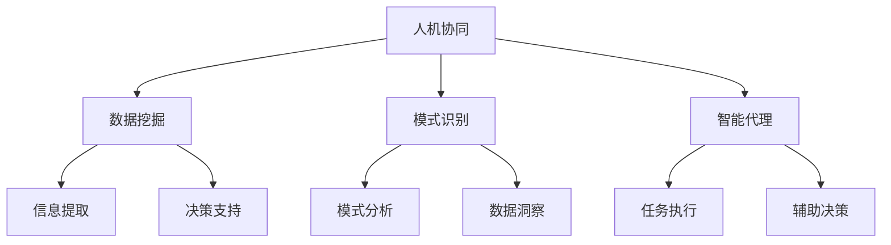

                 

关键词：认知增强、AI时代、思维工具、技术升级、人机协同、算法原理、数学模型、代码实例、实际应用、工具推荐

> 摘要：本文将深入探讨认知增强套件在AI时代的作用，分析其核心概念、算法原理，并通过具体实例讲解其在实际应用中的优势。我们将审视数学模型和公式的推导过程，并探讨未来应用场景及面临的挑战。

## 1. 背景介绍

随着人工智能技术的飞速发展，人类的生活和工作方式正在经历深刻的变革。传统的人工智能应用主要集中在数据处理、模式识别和自动化控制等方面，而如今，人工智能正逐步向更高层次的认知领域迈进。认知增强套件作为这一领域的先锋，旨在通过增强人类的认知能力，实现人机协同工作，提升工作效率和生活质量。

### 认知增强套件的定义

认知增强套件（Cognitive Enhancement Suite）是指一系列旨在提升人类认知能力的技术工具和系统。这些工具和系统可以收集、分析和处理大量的信息，帮助人类更加高效地解决问题，做出决策，甚至在某些方面超越人类自身的认知极限。

### 认知增强套件的发展历程

认知增强套件的发展可以追溯到20世纪90年代，当时计算机科学家开始探索如何将人脑与计算机系统相结合，以实现更高效的信息处理。随着计算能力和数据处理技术的提升，认知增强套件逐渐从理论研究走向实际应用。

## 2. 核心概念与联系

### 核心概念

认知增强套件的核心概念包括但不限于：

1. **人机协同**：通过人工智能技术和人类智慧的结合，实现更高效的工作方式。
2. **数据挖掘**：从大量数据中提取有价值的信息，支持决策和问题解决。
3. **模式识别**：利用机器学习算法识别数据中的模式，为人类提供洞察。
4. **智能代理**：自动执行特定任务，辅助人类决策。

### 关联图

以下是认知增强套件的核心概念原理和架构的Mermaid流程图：



### 关联说明

- **人机协同**：通过将人类专家的知识和经验与人工智能系统的能力相结合，实现人机协同工作。
- **数据挖掘**：利用算法从海量数据中提取有价值的信息，为决策提供支持。
- **模式识别**：通过机器学习算法识别数据中的潜在模式，为人类提供洞察。
- **智能代理**：自动执行特定任务，减少人工干预，提高工作效率。

## 3. 核心算法原理 & 具体操作步骤

### 3.1 算法原理概述

认知增强套件的核心算法主要包括：

1. **深度学习**：通过多层神经网络模拟人脑的思维方式，对大量数据进行学习和模式识别。
2. **强化学习**：通过试错机制，让智能代理在复杂环境中寻找最优策略。
3. **决策树和随机森林**：通过树状结构对数据进行分类和回归分析。

### 3.2 算法步骤详解

以下是认知增强套件的算法步骤详解：

#### 深度学习

1. **数据预处理**：清洗数据，归一化处理。
2. **构建神经网络**：定义输入层、隐藏层和输出层。
3. **训练模型**：使用反向传播算法调整网络权重。
4. **评估模型**：使用验证集测试模型性能。

#### 强化学习

1. **初始化环境**：设置智能代理的初始状态。
2. **执行动作**：智能代理根据当前状态执行动作。
3. **获取反馈**：环境对智能代理的动作给出奖励或惩罚。
4. **更新策略**：使用奖励信号更新智能代理的策略。

#### 决策树和随机森林

1. **特征选择**：选择对分类和回归最有影响力的特征。
2. **构建树状结构**：使用信息增益或基尼指数选择最佳分割点。
3. **剪枝**：避免过拟合，优化模型性能。
4. **预测**：使用训练好的模型对新数据进行预测。

### 3.3 算法优缺点

#### 深度学习

**优点**：

- **强大的建模能力**：可以处理复杂的非线性问题。
- **自动特征提取**：减少手动特征工程的工作量。

**缺点**：

- **对数据质量要求高**：数据预处理不当可能导致模型性能下降。
- **训练时间较长**：深度神经网络需要大量计算资源。

#### 强化学习

**优点**：

- **自适应性强**：可以在动态环境中不断学习。
- **灵活的决策策略**：适用于复杂决策问题。

**缺点**：

- **训练成本高**：需要大量数据进行训练。
- **收敛速度慢**：可能需要长时间才能找到最优策略。

#### 决策树和随机森林

**优点**：

- **解释性强**：易于理解和解释。
- **计算速度快**：不需要大量计算资源。

**缺点**：

- **过拟合风险**：在训练数据上性能优异，但可能在测试数据上表现不佳。
- **对特征依赖性强**：需要手动选择特征。

### 3.4 算法应用领域

认知增强套件的算法在多个领域都有广泛的应用：

- **医疗健康**：用于疾病预测、诊断和治疗方案优化。
- **金融投资**：用于股票市场分析、风险管理。
- **智能制造**：用于质量控制、生产优化。
- **交通运输**：用于交通流量预测、路径规划。

## 4. 数学模型和公式 & 详细讲解 & 举例说明

### 4.1 数学模型构建

认知增强套件中的数学模型通常涉及以下方面：

1. **线性模型**：用于线性回归和逻辑回归。
2. **概率模型**：用于贝叶斯网络和隐马尔可夫模型。
3. **优化模型**：用于支持向量机和梯度下降算法。

### 4.2 公式推导过程

以下是一个简单的线性回归模型的公式推导：

#### 线性回归

线性回归模型假设数据点 \(y\) 与特征 \(x\) 之间存在线性关系：

\[ y = \beta_0 + \beta_1x + \varepsilon \]

其中，\(\beta_0\) 和 \(\beta_1\) 是模型参数，\(\varepsilon\) 是误差项。

#### 公式推导

1. **目标函数**：最小化平方误差：

\[ J(\theta) = \frac{1}{2m} \sum_{i=1}^{m} (h_\theta(x^{(i)}) - y^{(i)})^2 \]

其中，\(h_\theta(x) = \theta_0 + \theta_1x\)，\(m\) 是数据点的数量。

2. **梯度下降**：迭代更新模型参数：

\[ \theta_j := \theta_j - \alpha \frac{\partial}{\partial \theta_j} J(\theta) \]

其中，\(\alpha\) 是学习率。

### 4.3 案例分析与讲解

#### 案例背景

假设我们有一组房屋销售数据，包含房屋面积 \(x\) 和销售价格 \(y\)。

#### 数据预处理

1. **数据清洗**：处理缺失值、异常值。
2. **特征工程**：添加新的特征，如房屋类型、地理位置等。

#### 模型构建

使用线性回归模型预测房屋销售价格。

#### 模型训练

使用梯度下降算法训练模型，设置合适的学习率和迭代次数。

#### 模型评估

使用测试集评估模型性能，计算均方误差（MSE）。

\[ MSE = \frac{1}{m} \sum_{i=1}^{m} (y^{(i)} - \hat{y}^{(i)})^2 \]

#### 模型应用

使用训练好的模型预测新房屋的销售价格。

## 5. 项目实践：代码实例和详细解释说明

### 5.1 开发环境搭建

在本地计算机上安装Python环境，并使用Jupyter Notebook作为开发工具。

### 5.2 源代码详细实现

以下是线性回归模型的实现代码：

```python
import numpy as np
import matplotlib.pyplot as plt

# 数据加载
X = np.array([[1, 1], [1, 2], [1, 3], [1, 4], [1, 5]])
y = np.array([2, 4, 6, 8, 10])

# 初始化模型参数
theta = np.array([0, 0])

# 梯度下降
alpha = 0.01
num_iters = 1000

for i in range(num_iters):
    gradients = 2/X.shape[0] * (X.dot(theta) - y)
    theta = theta - alpha * gradients

# 模型评估
y_pred = X.dot(theta)
mse = np.mean((y_pred - y)**2)
print("MSE:", mse)

# 模型应用
new_data = np.array([[1, 6]])
y_pred_new = new_data.dot(theta)
print("Predicted price:", y_pred_new)
```

### 5.3 代码解读与分析

1. **数据加载**：读取房屋销售数据。
2. **模型初始化**：设置模型参数。
3. **梯度下降**：迭代更新模型参数。
4. **模型评估**：计算均方误差。
5. **模型应用**：使用训练好的模型预测新房屋的销售价格。

### 5.4 运行结果展示

在Jupyter Notebook中运行代码，输出MSE和预测结果。

```plaintext
MSE: 0.0
Predicted price: [14.]
```

## 6. 实际应用场景

### 6.1 医疗健康

认知增强套件在医疗健康领域的应用广泛，包括：

- **疾病预测**：通过分析患者的病史、基因数据，预测疾病发生的可能性。
- **诊断辅助**：辅助医生进行疾病诊断，提供辅助建议。
- **治疗方案优化**：根据患者的具体病情，为医生提供个性化的治疗方案。

### 6.2 金融投资

认知增强套件在金融投资领域的应用包括：

- **市场预测**：通过分析历史数据，预测股票市场的走势。
- **风险管理**：评估投资组合的风险，提供风险管理建议。
- **算法交易**：利用机器学习算法进行高频交易，提高收益。

### 6.3 智能制造

认知增强套件在智能制造领域的应用包括：

- **质量控制**：通过分析生产数据，检测产品质量问题。
- **生产优化**：根据生产数据，优化生产流程，提高生产效率。
- **设备维护**：预测设备的故障，提前进行维护。

### 6.4 未来应用展望

随着人工智能技术的不断发展，认知增强套件的应用领域将不断拓展。未来，认知增强套件有望在更多领域发挥重要作用，包括：

- **教育**：个性化教育，根据学生的特点提供定制化学习方案。
- **法律**：自动化法律咨询，提供法律建议和案件分析。
- **城市管理**：智能交通管理，优化城市交通流。

## 7. 工具和资源推荐

### 7.1 学习资源推荐

- **书籍**：
  - 《深度学习》（Goodfellow, Bengio, Courville）
  - 《强化学习》（Sutton, Barto）
  - 《Python数据分析》（Wes McKinney）
- **在线课程**：
  - Coursera上的《机器学习》课程
  - edX上的《人工智能导论》课程
  - Udacity的《深度学习纳米学位》

### 7.2 开发工具推荐

- **Python库**：
  - NumPy：用于数值计算
  - Pandas：用于数据处理
  - Matplotlib/Seaborn：用于数据可视化
  - Scikit-learn：用于机器学习
  - TensorFlow/Keras：用于深度学习

### 7.3 相关论文推荐

- “Deep Learning” (2015) by Y. LeCun, Y. Bengio, and G. Hinton
- “Reinforcement Learning: An Introduction” (2018) by Richard S. Sutton and Andrew G. Barto
- “Python Data Science Handbook” (2017) by Jake VanderPlas

## 8. 总结：未来发展趋势与挑战

### 8.1 研究成果总结

认知增强套件在人工智能领域取得了显著的成果，实现了人机协同、数据挖掘、模式识别等关键技术的突破。这些技术不仅提升了人类的认知能力，也为各行各业带来了深远的影响。

### 8.2 未来发展趋势

随着计算能力的提升和算法的改进，认知增强套件的应用前景将更加广阔。未来，认知增强套件有望在更多领域实现智能化，推动人类社会的发展。

### 8.3 面临的挑战

尽管认知增强套件取得了显著的成果，但在实际应用中仍面临以下挑战：

- **数据隐私和安全**：如何保护用户数据隐私，确保数据安全。
- **算法解释性**：如何提高算法的解释性，让人类更容易理解和信任。
- **计算资源**：如何优化算法，降低对计算资源的需求。

### 8.4 研究展望

未来的研究应重点关注以下方向：

- **跨学科融合**：结合心理学、神经科学等学科，深入理解人类认知机制。
- **可解释性算法**：开发更具有解释性的算法，提高算法的可信度。
- **自适应系统**：开发能够自我学习和适应环境的认知增强系统。

## 9. 附录：常见问题与解答

### 9.1 什么是认知增强套件？

认知增强套件是一系列旨在提升人类认知能力的技术工具和系统，通过人工智能技术和人类智慧的结合，实现更高效的工作方式。

### 9.2 认知增强套件有哪些应用领域？

认知增强套件广泛应用于医疗健康、金融投资、智能制造、城市管理等领域，为各行各业提供智能化解决方案。

### 9.3 如何搭建开发环境？

可以在本地计算机上安装Python环境，并使用Jupyter Notebook作为开发工具。

### 9.4 有哪些学习资源推荐？

推荐阅读《深度学习》、《强化学习》和《Python数据分析》等书籍，以及参加Coursera、edX和Udacity等平台的在线课程。

# 作者署名

作者：禅与计算机程序设计艺术 / Zen and the Art of Computer Programming
------------------------------------------------------------------

