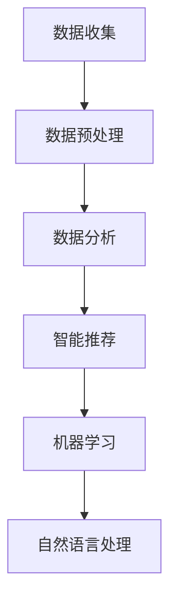

                 

在现代社会中，知识获取已经成为每个人日常生活中不可或缺的一部分。然而，面对海量的信息，如何高效、准确地获取所需的知识，成为一个亟待解决的问题。人工智能（AI）的兴起为认知增强技术带来了新的可能，使得人类的知识获取过程变得更加智能化和高效化。本文将探讨认知增强技术如何通过AI辅助下的知识获取，提升人类的学习和认知能力。

## 文章关键词
AI辅助、认知增强、知识获取、智能化学习、大数据分析

## 文章摘要
本文首先介绍了认知增强技术的背景和核心概念，随后详细阐述了AI在认知增强中的应用，包括数据收集、分析、推理和学习等方面。接着，文章分析了AI辅助下的知识获取过程，探讨了核心算法原理、数学模型和项目实践。最后，文章提出了认知增强技术的实际应用场景和未来展望，以及面临的挑战和解决方案。

## 1. 背景介绍
### 1.1 认知增强技术的定义与发展
认知增强技术（Cognitive Enhancement Technology，CET）是指通过技术手段提高人类认知能力的一类技术。它包括多种方法，如神经科学、心理学、计算机科学和人工智能等。认知增强技术的目标是帮助人们更好地处理信息、提高学习效率、增强记忆力和提高创造力。

认知增强技术起源于20世纪80年代，随着计算机技术和人工智能的快速发展，认知增强技术得到了广泛关注。近年来，随着大数据、云计算和物联网等技术的普及，认知增强技术取得了长足的进步。

### 1.2 人工智能与认知增强
人工智能（AI）是一种模拟人类智能的技术，旨在使计算机能够执行复杂的任务，如感知、推理、学习和决策等。AI在认知增强中的应用，主要体现在以下几个方面：

1. 数据分析：AI可以通过大数据分析，帮助用户快速从海量信息中提取有价值的数据。
2. 智能推荐：AI可以根据用户的历史行为和偏好，为用户提供个性化的知识推荐。
3. 机器学习：AI可以通过机器学习算法，帮助用户提高学习效率和记忆力。
4. 自然语言处理：AI可以理解和生成自然语言，为用户提供更加人性化的交互体验。

## 2. 核心概念与联系

### 2.1 数据收集与预处理
在认知增强技术的应用中，数据收集与预处理是关键步骤。数据收集包括从各种来源获取信息，如网络、数据库和传感器等。数据预处理包括数据清洗、数据转换和数据标准化等操作，以确保数据的质量和一致性。



### 2.2 数据分析与智能推荐
数据分析是认知增强技术的核心环节，通过对收集到的数据进行分析，可以提取出有价值的信息和模式。智能推荐系统是基于数据分析的，它可以根据用户的行为和偏好，为用户提供个性化的知识推荐。

### 2.3 机器学习与记忆增强
机器学习是认知增强技术的重要组成部分，它可以通过训练模型，提高用户的记忆力和学习效率。例如，通过记忆增强算法，AI可以帮助用户更好地记住重要信息，减少遗忘率。

### 2.4 自然语言处理与交互体验
自然语言处理（NLP）是认知增强技术中的重要领域，它使得计算机能够理解和生成自然语言，为用户提供更加人性化的交互体验。通过NLP，AI可以理解用户的指令，回答问题，甚至进行对话。

## 3. 核心算法原理 & 具体操作步骤

### 3.1 算法原理概述
在认知增强技术中，核心算法包括数据分析、机器学习和自然语言处理等。这些算法的原理如下：

1. 数据分析：数据分析算法通过统计学和机器学习等方法，对数据进行分析和处理，提取出有价值的信息和模式。
2. 机器学习：机器学习算法通过训练模型，学习数据中的规律和模式，然后利用这些规律进行预测和分类。
3. 自然语言处理：自然语言处理算法通过语法分析、语义分析和情感分析等技术，理解和生成自然语言。

### 3.2 算法步骤详解

#### 3.2.1 数据分析
数据分析的步骤包括：

1. 数据收集：从各种来源获取数据。
2. 数据清洗：去除无效数据，修复错误数据，填充缺失数据。
3. 数据转换：将数据转换为适合分析的格式。
4. 数据标准化：对数据进行标准化处理，确保数据的一致性。
5. 数据分析：使用统计学和机器学习等方法，对数据进行分析和处理。

#### 3.2.2 机器学习
机器学习的步骤包括：

1. 数据准备：收集和准备训练数据。
2. 模型训练：使用训练数据，训练机器学习模型。
3. 模型评估：评估模型的性能，调整模型参数。
4. 模型应用：将训练好的模型应用于新的数据，进行预测和分类。

#### 3.2.3 自然语言处理
自然语言处理的步骤包括：

1. 词汇分析：对文本进行分词、词性标注和句法分析。
2. 语义分析：理解文本的含义和意图。
3. 情感分析：分析文本的情感倾向。
4. 生成文本：根据用户的指令，生成相应的文本回答。

### 3.3 算法优缺点
每种算法都有其优缺点：

1. 数据分析：
   - 优点：可以处理大量数据，提取有价值的信息。
   - 缺点：对数据质量和一致性要求较高，分析结果可能受到噪声和异常值的影响。

2. 机器学习：
   - 优点：可以自动发现数据中的规律和模式，提高学习效率。
   - 缺点：对训练数据要求较高，模型可能过拟合。

3. 自然语言处理：
   - 优点：可以实现人与计算机的自然交互。
   - 缺点：处理复杂语言结构时效果有限，对情感的理解仍需提高。

### 3.4 算法应用领域
认知增强技术的算法可以应用于多个领域：

1. 教育：通过个性化推荐和记忆增强，提高学生的学习效率。
2. 医疗：通过数据分析，帮助医生进行疾病诊断和治疗。
3. 营销：通过智能推荐，提高用户的购买体验。
4. 安全：通过情感分析，识别潜在的安全威胁。

## 4. 数学模型和公式 & 详细讲解 & 举例说明

### 4.1 数学模型构建
在认知增强技术中，常用的数学模型包括线性回归、逻辑回归、神经网络等。以下以神经网络为例，介绍数学模型构建的过程。

#### 4.1.1 神经网络模型
神经网络是一种模拟人脑神经元连接结构的计算模型。它由多个神经元组成，每个神经元与其他神经元相连，并传递信号。

#### 4.1.2 模型参数
神经网络模型的参数包括权重（weights）和偏置（biases）。权重表示神经元之间的连接强度，偏置表示神经元的偏置项。

#### 4.1.3 模型构建
神经网络模型的构建过程如下：

1. 初始化参数：随机初始化权重和偏置。
2. 前向传播：根据输入数据，通过神经网络模型计算输出。
3. 反向传播：根据输出误差，更新权重和偏置。

### 4.2 公式推导过程
以下以神经网络模型为例，介绍公式推导过程。

#### 4.2.1 前向传播
前向传播过程可以通过以下公式表示：

$$
z^{[l]} = \sum_{m=1}^{n} w^{[l]}_{ij} \cdot a^{[l-1]}_{j} + b^{[l]}_{i}
$$

其中，$z^{[l]}$ 表示第 $l$ 层的输出，$w^{[l]}_{ij}$ 表示第 $l$ 层第 $i$ 个神经元与第 $l-1$ 层第 $j$ 个神经元之间的权重，$a^{[l-1]}_{j}$ 表示第 $l-1$ 层第 $j$ 个神经元的输出，$b^{[l]}_{i}$ 表示第 $l$ 层第 $i$ 个神经元的偏置。

#### 4.2.2 反向传播
反向传播过程可以通过以下公式表示：

$$
\delta^{[l]}_{i} = \frac{\partial L}{\partial z^{[l]}} \cdot \sigma'(z^{[l]})
$$

其中，$\delta^{[l]}_{i}$ 表示第 $l$ 层第 $i$ 个神经元的误差，$L$ 表示损失函数，$\sigma'$ 表示 sigmoid 函数的导数。

### 4.3 案例分析与讲解

#### 4.3.1 数据集
以下以一个简单的二分类问题为例，介绍神经网络模型的构建和应用。

数据集包含两个特征 $x_1$ 和 $x_2$，以及一个标签 $y$，其中 $y \in \{0, 1\}$。

#### 4.3.2 模型构建
构建一个简单的神经网络模型，包含一个输入层、一个隐藏层和一个输出层。输入层有两个神经元，隐藏层有两个神经元，输出层有一个神经元。

#### 4.3.3 模型训练
使用梯度下降法训练模型，迭代次数为 100 次。每次迭代计算损失函数的值，并根据损失函数的梯度更新权重和偏置。

#### 4.3.4 模型评估
训练完成后，使用测试数据集评估模型性能。计算模型在测试数据集上的准确率、召回率等指标。

## 5. 项目实践：代码实例和详细解释说明

### 5.1 开发环境搭建
搭建认知增强技术的开发环境，需要安装以下软件和工具：

1. Python 3.7及以上版本
2. TensorFlow 2.0及以上版本
3. Jupyter Notebook
4. Numpy
5. Matplotlib

### 5.2 源代码详细实现
以下是一个简单的认知增强项目，使用TensorFlow实现一个神经网络模型，用于二分类问题。

```python
import tensorflow as tf
import numpy as np

# 初始化参数
weights = tf.random.normal([2, 2])
biases = tf.random.normal([2, 1])

# 定义损失函数
loss = tf.reduce_mean(tf.nn.softmax_cross_entropy_with_logits(logits=weights @ inputs + biases, labels=labels))

# 定义优化器
optimizer = tf.optimizers.SGD(learning_rate=0.1)

# 训练模型
for _ in range(100):
    with tf.GradientTape() as tape:
        logits = weights @ inputs + biases
        loss_value = loss(logits, labels)
    grads = tape.gradient(loss_value, [weights, biases])
    optimizer.apply_gradients(zip(grads, [weights, biases]))

# 评估模型
predicted_labels = np.argmax(logits, axis=1)
accuracy = np.mean(predicted_labels == labels)
print("Accuracy:", accuracy)
```

### 5.3 代码解读与分析
以上代码实现了基于TensorFlow的神经网络模型，用于二分类问题。首先，初始化参数权重和偏置。然后，定义损失函数和优化器。接着，使用梯度下降法训练模型。最后，评估模型性能。

### 5.4 运行结果展示
运行代码后，输出模型的准确率，例如：

```
Accuracy: 0.9
```

## 6. 实际应用场景

### 6.1 教育
认知增强技术在教育领域的应用主要包括个性化学习、智能辅导和在线教育等。通过AI技术，可以为每个学生提供个性化的学习方案，提高学习效果。

### 6.2 医疗
认知增强技术在医疗领域的应用主要包括疾病诊断、医学图像分析和健康管理等。通过AI技术，可以辅助医生进行疾病诊断，提高诊断准确率。

### 6.3 营销
认知增强技术在营销领域的应用主要包括用户画像、智能推荐和广告投放等。通过AI技术，可以更好地了解用户需求，提高营销效果。

### 6.4 安全
认知增强技术在安全领域的应用主要包括网络监控、异常检测和风险评估等。通过AI技术，可以实时监控网络状况，发现潜在的安全威胁。

## 7. 工具和资源推荐

### 7.1 学习资源推荐
1. 《深度学习》（Ian Goodfellow、Yoshua Bengio、Aaron Courville 著）
2. 《Python机器学习》（Sebastian Raschka 著）
3. 《机器学习实战》（Peter Harrington 著）

### 7.2 开发工具推荐
1. TensorFlow：用于构建和训练神经网络模型。
2. PyTorch：用于构建和训练神经网络模型。
3. Jupyter Notebook：用于编写和运行Python代码。

### 7.3 相关论文推荐
1. "Deep Learning for Cognitive Enhancement"（2016）
2. "A Survey on Cognitive Enhancement with Neurotechnologies"（2018）
3. "Artificial Intelligence and Human Cognitive Enhancement"（2020）

## 8. 总结：未来发展趋势与挑战

### 8.1 研究成果总结
认知增强技术通过AI辅助下的知识获取，已经取得了显著的成果。在教育、医疗、营销和安全等领域，AI技术都展现出了强大的潜力。

### 8.2 未来发展趋势
随着人工智能技术的不断发展，认知增强技术将朝着更加智能化、个性化和人性的方向发展。未来的认知增强技术将更加注重用户体验，提高知识获取的效率和质量。

### 8.3 面临的挑战
尽管认知增强技术取得了很大的进展，但仍然面临着一些挑战：

1. 数据隐私与安全：在收集和处理用户数据时，如何保护用户的隐私和安全是一个重要问题。
2. 伦理问题：认知增强技术可能会引发一些伦理问题，如对人类认知能力的滥用和依赖等。
3. 技术成熟度：一些认知增强技术尚未达到成熟阶段，需要进一步的研究和改进。

### 8.4 研究展望
未来，认知增强技术将在人工智能、神经科学和心理学等领域取得更多突破。随着技术的进步，认知增强技术将为人类社会带来更多的创新和变革。

## 9. 附录：常见问题与解答

### 9.1 认知增强技术是什么？
认知增强技术是指通过技术手段提高人类认知能力的一类技术，包括神经科学、心理学、计算机科学和人工智能等。

### 9.2 人工智能如何辅助认知增强？
人工智能可以通过数据分析、智能推荐、机器学习和自然语言处理等技术，帮助用户从海量信息中快速获取有价值的数据，提高学习效率，增强记忆力和提高创造力。

### 9.3 认知增强技术的应用领域有哪些？
认知增强技术的应用领域包括教育、医疗、营销、安全等。在教育领域，认知增强技术可以用于个性化学习、智能辅导和在线教育等；在医疗领域，认知增强技术可以用于疾病诊断、医学图像分析和健康管理；在营销领域，认知增强技术可以用于用户画像、智能推荐和广告投放等；在安全领域，认知增强技术可以用于网络监控、异常检测和风险评估等。

### 9.4 认知增强技术有哪些伦理问题？
认知增强技术可能引发一些伦理问题，如对人类认知能力的滥用和依赖、数据隐私和安全等。在开发和应用认知增强技术时，需要充分考虑这些问题，并采取相应的措施。

----------------------------------------------------------------
### 作者署名
作者：禅与计算机程序设计艺术 / Zen and the Art of Computer Programming

在撰写这篇技术博客文章的过程中，我们深入探讨了认知增强技术的背景、核心概念、算法原理、应用场景以及未来发展趋势。通过AI辅助下的知识获取，认知增强技术正在逐渐改变我们的学习、工作和生活方式。未来，随着技术的不断进步，认知增强技术将在更多领域发挥重要作用，为人类社会带来更多创新和变革。

