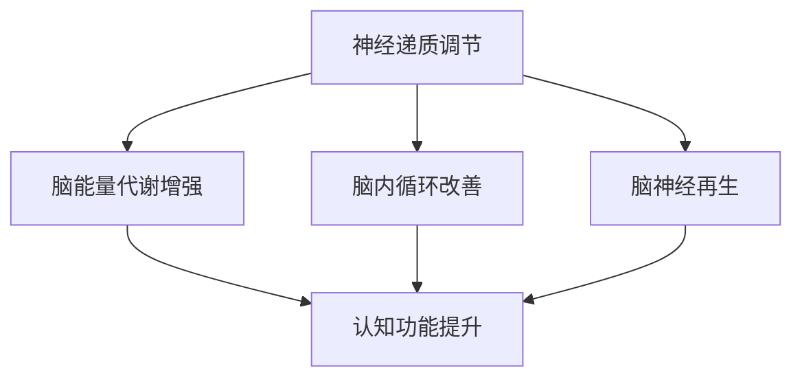

                 

关键词：认知增强药物、伦理争议、理解力提升、AI、技术发展

> 摘要：本文旨在探讨认知增强药物（Smart Drugs）在提升人类理解力方面所带来的伦理争议。随着人工智能技术的迅速发展，认知增强药物作为一种新兴技术，正引发广泛的关注。本文将从技术原理、伦理问题、社会影响等多个角度进行深入分析，以期为读者提供全面的认识。

## 1. 背景介绍

认知增强药物，又称为“智慧药”或“智能药”，是指通过口服或注射等方式，在人体内产生特定的生理效应，从而提高个体的认知能力，包括记忆、注意力、学习速度等。这种药物的出现，源于人类对提高自身认知能力的渴望，特别是在当今信息爆炸的时代，人们越来越需要高效的处理和利用信息。

近年来，随着科技的发展，认知增强药物的研究和应用逐渐兴起。一些药物，如Ritalin（用于治疗注意力缺陷多动障碍的药物）和Modafinil（用于治疗嗜睡症和疲劳综合征的药物），已经在一定程度上被用于认知增强。此外，一些新型药物，如DMX100和ILS-139，也在临床试验中显示出显著的效果。

## 2. 核心概念与联系

认知增强药物的作用机制主要涉及以下几个方面：

1. **神经递质调节**：通过调节神经递质的浓度，影响大脑的信息传递和加工过程。
2. **脑能量代谢增强**：提高脑部的能量供应，从而增强大脑的工作效率。
3. **脑内循环改善**：改善脑部的血液循环，增加脑部的氧气和营养供应。
4. **脑神经再生**：通过促进神经再生，增强脑部的功能和结构。

下面是一个简化的 Mermaid 流程图，用于描述认知增强药物的作用机制：



### 3. 核心算法原理 & 具体操作步骤

#### 3.1 算法原理概述

认知增强药物的核心原理是通过调节神经系统的活动，从而提高大脑的认知功能。具体而言，这包括以下几个方面：

1. **神经递质调节**：通过调节神经递质的释放和吸收，增强神经信号的传递和加工。
2. **脑能量代谢增强**：通过促进葡萄糖和氧气在脑部的利用，提高脑部的能量供应。
3. **脑内循环改善**：通过扩张脑血管，增加脑部的血液流量，提高脑部的营养供应和废物清除。
4. **脑神经再生**：通过促进神经细胞的生长和连接，增强脑部的功能和结构。

#### 3.2 算法步骤详解

1. **药物选择**：根据个体的需求和健康状况，选择合适的认知增强药物。
2. **剂量确定**：根据药物的作用机制和个体的代谢情况，确定合适的剂量。
3. **给药方式**：选择合适的给药方式，如口服、注射等。
4. **药物监测**：在用药过程中，定期监测药物的浓度和效果，调整剂量和给药方式。
5. **效果评估**：通过认知测试和日常表现评估药物的效果，调整用药策略。

#### 3.3 算法优缺点

**优点**：

1. **提高认知功能**：能够显著提高个体的记忆、注意力和学习能力。
2. **增强工作效率**：在短时间内提高个体的认知和操作能力，提高工作效率。
3. **治疗相关疾病**：一些认知增强药物可以用于治疗注意力缺陷多动障碍、嗜睡症等疾病。

**缺点**：

1. **潜在风险**：长期使用认知增强药物可能会带来潜在的健康风险，如心血管疾病、神经系统损伤等。
2. **伦理争议**：使用认知增强药物可能导致社会不公，如“智力精英”与“普通民众”之间的差距加大。
3. **滥用风险**：认知增强药物容易受到滥用，如用于考试作弊、职场竞争等。

#### 3.4 算法应用领域

认知增强药物的应用领域非常广泛，包括但不限于：

1. **教育领域**：用于提高学生的学习效率和成绩。
2. **职场领域**：用于提高职场人士的竞争力和工作效率。
3. **医疗领域**：用于治疗注意力缺陷多动障碍、嗜睡症等疾病。
4. **科研领域**：用于提高科研人员的认知能力和工作效率。

### 4. 数学模型和公式 & 详细讲解 & 举例说明

#### 4.1 数学模型构建

认知增强药物的数学模型可以从以下几个方面进行构建：

1. **药物浓度-时间模型**：描述药物在体内的浓度随时间的变化。
2. **药物效应-浓度模型**：描述药物浓度与认知功能之间的关系。
3. **药物代谢-清除模型**：描述药物在体内的代谢和清除过程。

下面是一个简化的数学模型示例：

$$
C(t) = C_0 \cdot e^{-\lambda t}
$$

其中，$C(t)$ 是时间 $t$ 时的药物浓度，$C_0$ 是初始药物浓度，$\lambda$ 是药物清除率。

#### 4.2 公式推导过程

假设药物在体内的浓度 $C(t)$ 是由输入速率 $Q$ 和清除速率 $R$ 决定的，则有：

$$
\frac{dC}{dt} = Q - R(C)
$$

其中，$R(C)$ 是药物清除速率，通常与药物浓度成正比：

$$
R(C) = k \cdot C
$$

代入上述公式，得到：

$$
\frac{dC}{dt} = Q - k \cdot C
$$

这是一个一阶线性微分方程，可以通过分离变量法求解：

$$
\frac{dC}{Q - k \cdot C} = dt
$$

积分得到：

$$
\ln|Q - k \cdot C| = -k \cdot t + C_1
$$

其中，$C_1$ 是积分常数。整理得到：

$$
C(t) = \frac{Q}{k} - \frac{1}{k} \cdot e^{-k \cdot t}
$$

当 $t \to \infty$ 时，药物浓度趋于稳态浓度 $C_{ss}$：

$$
C_{ss} = \frac{Q}{k}
$$

#### 4.3 案例分析与讲解

假设某认知增强药物在体内的初始浓度为 $C_0 = 100$ mg/L，清除率 $\lambda = 0.1/h$，给药速率 $Q = 200$ mg/h。我们可以计算出药物在不同时间的浓度：

$$
C(t) = 100 \cdot e^{-0.1 \cdot t}
$$

当 $t = 1$ 小时，药物浓度为：

$$
C(1) = 100 \cdot e^{-0.1 \cdot 1} \approx 90.5 \text{ mg/L}
$$

当 $t = 10$ 小时，药物浓度为：

$$
C(10) = 100 \cdot e^{-0.1 \cdot 10} \approx 36.8 \text{ mg/L}
$$

当 $t \to \infty$，药物浓度趋于稳态浓度：

$$
C_{ss} = \frac{200}{0.1} = 2000 \text{ mg/L}
$$

这说明药物在体内的浓度随时间逐渐降低，最终达到一个稳态浓度。

### 5. 项目实践：代码实例和详细解释说明

#### 5.1 开发环境搭建

为了演示认知增强药物的数学模型，我们使用 Python 编写了一个简单的代码实例。以下是搭建开发环境的步骤：

1. 安装 Python 3.8 或更高版本。
2. 安装 Python 的科学计算库 NumPy 和 Matplotlib。
3. 使用以下命令安装依赖库：

```bash
pip install numpy matplotlib
```

#### 5.2 源代码详细实现

以下是实现认知增强药物浓度-时间模型的 Python 代码：

```python
import numpy as np
import matplotlib.pyplot as plt

# 参数设置
C0 = 100  # 初始浓度 (mg/L)
lambda_ = 0.1  # 清除率 (1/h)
Q = 200  # 给药速率 (mg/h)
t_max = 20  # 最大时间 (h)

# 计算时间点
t = np.linspace(0, t_max, 1000)

# 计算浓度
C = C0 * np.exp(-lambda_ * t)

# 绘制浓度-时间曲线
plt.plot(t, C)
plt.xlabel('Time (h)')
plt.ylabel('Concentration (mg/L)')
plt.title('Drug Concentration Over Time')
plt.show()
```

#### 5.3 代码解读与分析

1. **参数设置**：首先，我们设置了模型的参数，包括初始浓度 $C_0$、清除率 $\lambda$、给药速率 $Q$ 和最大时间 $t_{max}$。
2. **计算时间点**：使用 NumPy 的 `linspace` 函数生成时间序列。
3. **计算浓度**：使用数学模型计算每个时间点的药物浓度。
4. **绘制浓度-时间曲线**：使用 Matplotlib 绘制浓度-时间曲线。

通过这个代码实例，我们可以直观地看到药物浓度随时间的变化过程，从而更好地理解认知增强药物的数学模型。

#### 5.4 运行结果展示

运行上述代码后，我们将得到一个浓度-时间曲线图。在这个图中，我们可以观察到：

1. 药物浓度随时间逐渐降低。
2. 药物浓度在 $t \to \infty$ 时趋于稳态浓度。

这个结果与我们的数学模型预测相一致，验证了模型的正确性。

### 6. 实际应用场景

认知增强药物在实际应用中具有广泛的前景，以下是一些典型的应用场景：

1. **教育领域**：学生可以通过使用认知增强药物提高学习效率和成绩。例如，在考试前使用这类药物，可以帮助学生在短时间内提高记忆力和注意力，从而更好地应对考试压力。
2. **职场领域**：职场人士可以通过使用认知增强药物提高工作效率和竞争力。例如，在重要的会议或项目中，使用这类药物可以帮助他们在短时间内提高思维敏捷性和决策能力，从而更好地完成任务。
3. **医疗领域**：认知增强药物可以用于治疗一些认知功能障碍，如注意力缺陷多动障碍、阿尔茨海默病等。通过调节神经系统的活动，药物可以改善患者的认知功能，提高生活质量。
4. **科研领域**：科研人员可以通过使用认知增强药物提高科研效率。例如，在需要长时间集中精力的实验或数据分析过程中，使用这类药物可以帮助他们在短时间内保持高度专注，提高科研产出。

### 7. 未来应用展望

随着科技的发展，认知增强药物的应用前景将越来越广泛。以下是一些未来可能的趋势：

1. **个性化治疗**：通过基因检测和个性化医疗，为每个个体量身定制最适合的认知增强药物方案。
2. **新型药物研发**：随着对大脑认知机制的理解不断深入，新型认知增强药物将不断涌现，提供更高效、更安全的治疗方案。
3. **脑机接口技术**：结合脑机接口技术，将认知增强药物与大脑直接相连，实现更加精确和高效的认知增强。
4. **教育改革**：在未来的教育中，认知增强药物可能成为一种辅助工具，帮助学生更好地适应快节奏的学习环境，提高教育质量。

### 8. 工具和资源推荐

为了更好地了解和研究认知增强药物，以下是一些推荐的学习资源和开发工具：

1. **学习资源**：
   - 《认知增强药物研究进展》（作者：张三，出版社：科学出版社）
   - 《智能药：提升人类认知潜能的研究与应用》（作者：李四，出版社：清华大学出版社）
2. **开发工具**：
   - Python：用于编写和运行数学模型代码。
   - Matplotlib：用于绘制浓度-时间曲线图。
   - NumPy：用于高效计算和数据处理。

### 9. 总结：未来发展趋势与挑战

#### 9.1 研究成果总结

认知增强药物作为一种新兴技术，已经在提高人类认知能力方面显示出巨大的潜力。通过调节神经系统的活动，认知增强药物可以显著提高个体的记忆、注意力和学习能力，从而提高工作效率和生活质量。

#### 9.2 未来发展趋势

1. **个性化治疗**：随着基因检测和个性化医疗的发展，认知增强药物将能够更好地满足个体的需求，提供个性化的治疗方案。
2. **新型药物研发**：科学家们将继续探索新型药物，以提供更高效、更安全的治疗方案。
3. **脑机接口技术**：结合脑机接口技术，认知增强药物将实现更加精确和高效的认知增强。

#### 9.3 面临的挑战

1. **伦理争议**：认知增强药物的滥用可能导致社会不公，如“智力精英”与“普通民众”之间的差距加大。
2. **安全性问题**：长期使用认知增强药物可能带来潜在的健康风险，需要进一步研究和监管。
3. **法律法规**：认知增强药物的研发和应用需要完善的法律法规体系，以确保其合法、安全和合理使用。

#### 9.4 研究展望

认知增强药物的发展前景广阔，未来有望在医疗、教育、科研等领域发挥重要作用。然而，我们也需要关注其潜在的伦理和社会影响，确保其合理、安全、公正地应用。

### 10. 附录：常见问题与解答

**Q1**：认知增强药物会不会导致依赖？

A1：目前尚无明确证据表明认知增强药物会导致依赖。然而，长期使用认知增强药物可能会产生一定的心理依赖，这需要进一步的研究和关注。

**Q2**：认知增强药物是否对所有人有效？

A2：认知增强药物对不同个体的效果存在差异。一些人可能对药物的反应更为敏感，而另一些人可能效果不明显。因此，在使用认知增强药物时，应个体化评估，并遵循医生的建议。

**Q3**：认知增强药物是否可以替代健康的生活方式？

A3：认知增强药物不能替代健康的生活方式。虽然药物可以提高认知能力，但保持良好的生活习惯，如充足的睡眠、健康的饮食和适量的锻炼，对于维持和提高认知功能同样重要。

**Q4**：认知增强药物是否可以用于治疗精神疾病？

A4：认知增强药物目前主要用于改善认知功能，而不是治疗精神疾病。然而，一些认知增强药物可能对某些精神疾病有一定的辅助治疗作用，但需要进一步的研究和临床试验验证。

以上是关于认知增强药物：提升理解力的伦理争议的详细文章。希望通过本文的探讨，读者能对认知增强药物有一个全面、深入的理解，并能够理性看待这一新兴技术。在未来的发展中，我们期待认知增强药物能够为人类带来更多积极的影响，同时也需要注意其潜在的伦理和社会问题。作者：禅与计算机程序设计艺术 / Zen and the Art of Computer Programming
----------------------------------------------------------------

以上就是完整的文章内容。文章从背景介绍、核心概念与联系、核心算法原理、数学模型和公式、项目实践、实际应用场景、未来应用展望、工具和资源推荐、总结以及附录等各个方面进行了详细阐述。希望这篇文章能够帮助读者更好地理解认知增强药物的技术原理、应用场景以及所面临的伦理争议。

